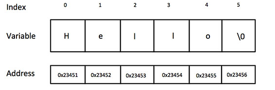
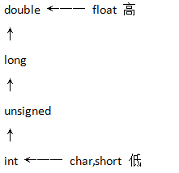

# C Language Course

# 1. C基础教程

## Chapter 1. 简介

## Chapter 2. 环境设置

## Chapter 3. 程序结构

## Chapter 4. 基本语法

## Chapter 5. 数据类型

## Chapter 6. 变量

## Chapter 7. 常量

## Chapter 8. 存储类

## Chapter 9. 运算符

## Chapter 10. 判断

## Chapter 11. 循环

## Chapter 12. 函数

## Chapter 13. 作用域规则

## Chapter 14. 数组

## Chapter 15. enum

## Chapter 16. 指针

## Chapter 17. 函数指针与回调函数

### 17.1 函数指针

函数指针:指向函数的指针变量.函数指针可以调用函数、传递参数.

	typedef int (*func_ptr)(int, int);
	/*
		声明一个函数指针func_ptr类型.指向的函数有两个参数(int,int),返回值为int类型的函数.
		使用方法如下:
		在一个函数里面,需要使用func_ptr声明一个函数指针变量:
			func_ptr f = func;	//使用func_ptr函数指针类型声明一个函数指针变量f,指向func函数.
	*/

实例1---直接在函数内部声明一个函数指针变量指向某个函数:

	#include <stdio.h>

	int max(int x, int y)
	{
		return (x > y ? x : y);
	}
	
	int main()
	{
		int (*p)(int, int) = max;
		/*
			声明一个函数指针变量p,将max函数赋值给该函数指针.
			PS:此处使用max或&max是一样的.
			也可以:
			int (*p)(int, int); //先声明一个函数指针
			p = max;			//在给函数指针赋值
		*/
		int a, b, c, d;
	
		printf("Please input thress number:");
		scanf("%d %d %d", &a, &b, &c);
	
		d = p(p(a, b), c);
		printf("The max number is: %d\n", d);
		return 0;
	}

实例2---先typedef(重定义)一个函数指针类型,再由该类型去声明一个函数指针变量.

	#include <stdio.h>
	
	int max(int x, int y)
	{
		return (x > y ? x : y);
	}
	
	typedef int (*p)(int, int);	//声明一个函数指针类型p
	
	int main()
	{
		p pfunc = max;	//使用函数指针类型定义一个函数指针变量pfunc,并将max赋值给该函数指针变量
		int a, b, c, d;
	
		printf("Please input thress number:");
		scanf("%d %d %d", &a, &b, &c);
	
		d = pfunc(pfunc(a, b), c);
		printf("The max number is: %d\n", d);
		return 0;
	}

### 17.2 回调函数

回调函数:函数指针变量作为某个函数的参数,此时该函数指针指向的函数就叫回调函数(该函数是在某函数中通过函数指针来调用).

知乎的解说:

	你到一个商店买东西,刚好你要的东西没有货.于是你在店员那里留下了你的电话,过了几天店里有货了,店员就打了
	你的电话,然后你接到电话后就到店里去取了货.在这个例子里,你的电话号码就叫回调函数,你把电话留给店员就叫
	登记回调函数,店里后来有货了叫做触发了回调关联的事件,店员给你打电话叫做调用回调函数,你到店里去取货叫做
	响应回调事件.

实例1---直接使用函数指针变量作为函数的参数

	#include <stdlib.h>
	#include <stdio.h>
	
	void populate_array(long *array, size_t arraySize, long (*getNextValue)(void))
	{	
		/*
			"long (*getNextValue)(void)":直接声明了一个函数指针变量getNextValue.
			后面可以直接使用该变量,如下:
		*/
		for (size_t i=0; i<arraySize; i++)
			array[i] = getNextValue();
	}
	
	long getNextRandomValue(void)
	{
		return rand();
	}
	
	int main()
	{
		long myArray[10];
		populate_array(myArray, 10, getNextRandomValue);
		for (int i=0; i<10; i++) {
			printf("%d ", myArray[i]);
		}
	
		printf("\n");
		return 0;
	}

	VS2012运行结果为:41 18467 6334 26500 19169 15724 11478 29358 26962 24464

实例2---先typedef(重定义)一个函数指针类型,再由该类型去声明一个函数指针变量作为函数的参数.

	#include <stdlib.h>
	#include <stdio.h>
	
	typedef long (*p)(void); //声明一个函数指针类型
	
	void populate_array(long *array, size_t arraySize, p getNextValue)
	{
		/*
			p getNextValue:由函数指针类型声明一个函数指针变量,后面使用该变量调用函数.比较符合常规.
		*/
		for (size_t i=0; i<arraySize; i++)
			array[i] = getNextValue();
	}
		
	long getNextRandomValue(void)
	{
		return rand();
	}
	
	int main()
	{
		long myArray[10];
		populate_array(myArray, 10, getNextRandomValue);
		for (int i=0; i<10; i++) {
			printf("%d ", myArray[i]);
		}
		
		printf("\n");
		return 0;
	}

	VS2012运行结果为:41 18467 6334 26500 19169 15724 11478 29358 26962 24464

## Chapter 18. 字符串

C语言中,字符串实际上是使用空字符(即'\0')终止的一堆字符数组.因此,一个字符串的组成字符包括从起始到null结尾之前的字符.

	空字符其值为0.0,'\0',null在计算机内存中是一样的,值都是为0.

### 18.1 字符串的初始化

	char greeting[6] = {'H', 'e', 'l', 'l', '0', '\0'};	//greeting包含"Hello"和结尾的'\0'
	//也可以写成:
	char greeting[] = "Hello";	//C语言会在初始化数组时自动在末尾加上'\0'.
	//也可以写成:
	char *greeting = "Hello";

此时的占用内存情况:

### 18.2 字符串操作函数

1.strcpy(s1, s2)

	strcpy(s1, s2):复制字符串s2到字符串s1.

2.strcat(s1, s2)

	strcat(s1, s2):连接字符串s2到字符串s1的末尾(会自动去掉s1的'\0',然后再连接).

3.strlen(s1)

	strlen(s1):返回字符串s1的长度(即字符数量,结尾的'\0'是不计算在内的).

4.strcmp(s1, s2)

	strcmp(s1, s2):s1和s2是相同的,则返回0;s1<s2则返回小于0;s1>s2则返回大于0.

5.strchr(s1, ch)

	strchr(s1, ch):返回一个指针,指向字符串s1中字符ch第一次出现的位置.

6.strstr(s1, s2)

	strstr(s1, s2):返回一个指针,指向字符串s1中字符串s2第一次出现的位置.

### 18.3 实例

	#include <stdio.h>
	#include <string.h>
	 
	int main ()
	{
		char str1[12] = "Hello";
		char str2[12] = "World";
		char str3[12];
		char *str4 = "helloworld";
		int  len ;
	
		printf("%d \n", strlen(str4));	//结果为:10
		strcpy(str3, str1);
		printf("strcpy( str3, str1) :  %s\n", str3 );	//结果为:Hello
	 
		strcat( str1, str2);
		printf("strcat( str1, str2):   %s\n", str1 );	//结果为:HelloWorld

		len = strlen(str1);
		printf("strlen(str1) :  %d\n", len );	//结果为:10
	 
		return 0;
	}

## Chapter 19. 结构体

### 19.1 结构体定义

**1.常规定义**

	1.既有标签,又有变量:
		struct SIMPLE {	//SIMPLE为结构体标签
			int a;	//结构体成员
			char b;
			double c;
		} s1;	//在定义结构体的同时声明了一个结构体变量s1
	2.无标签,有变量:
		struct {	//由于无标签,后续想在声明一个结构体变量不方便--->此种方法用的比较少
			...
		} s1;	//在定义结构体时声明了一个结构体变量s1
	3.仅有标签,没有定义变量:
		struct SIMPLE {	//SIMPLE为结构体标签
			...
		};
		struct SIMPLE t1, t2[20], *t3;	//使用标签来声明一些结构体变量
		PS:C++中可以直接使用SIMPLE(省略签名的struct).
	4.使用typedef为结构体取一个新的名字:
		typedef struct {
			...
		} Simple2;	//为结构体取一个新的名字Simple2(类似创建一个新类型Simple2)
		Simple2 u1, u2[20], *u3;	//使用新名字来声明一些结构体变量

**2.结构体包含结构体**

	1.包含其他结构体:
		struct COMPLEX {
			char str[100];
			struct SIMPLE a;	//包含其他结构体struct SIMPLE
		};
	2.包含指向自己类型的指针,常用于实现链表和数等:
		struct NODE {
			char str[100];
			struct NODE *next_node;	//包含自身的结构体指针
		};

**3.结构体互相包含--->用的比较少**

	struct B;	//先对结构体B进行不完整声明
	
	struct A {
		struct B *partner;	//结构体A中包含指向结构体B的指针
		...
	};

	struct B {
		struct A *partner;	//A声明完后,在进行B的完整声明.此时包含结构体A的指针
		...
	};

### 19.2 结构体变量的初始化

定义时进行初始化:

	#include <stdio.h>
	
	struct Books {
		char title[50];
		char author[50];
		char subject[100];
		int book_id;
	} book = {"C Program", "RUNOOB", "Program language", 123456};
	// {...}中的内容会依次赋值给结构体中的成员.
	
	int main()
	{
		printf("title: %s\nauthor: %s\nsubject: %s\nbook_id: %d\n", book.title, book.author, 
			book.subject, book.book_id);
	}
	//结果为:
	title: C Program
	author: RUNOOB
	subject: Program language
	book_id: 123456

### 19.3 访问结构体成员

**1.使用运算符"."**

	struct Books {	//结构体定义
		char title[50];
		char author[50];
		char subject[100];
		int book_id;
	};

	struct Books book;	//声明一个结构体变量
	strcpy(book.title, "C Programming");	//访问成员并复制字符串到该成员
	strcpy(book.author, "Defy");
	strcpy(book.subject, "C Programming Tutorial");
	book.book_id = 98456;

**2.使用运算符"->"--->针对指针**

	struct Books {	//结构体定义
		char title[50];
		char author[50];
		char subject[100];
		int book_id;
	};

	void printBook(struct Books *bookPtr);	//接收一个结构体指针作为参数

	int main()
	{
		struct Books book;	//声明一个结构体变量
		strcpy(book.title, "C Programming");	//访问成员并复制字符串到该成员
		strcpy(book.author, "Defy");
		strcpy(book.subject, "C Programming Tutorial");
		book.book_id = 98456;

		printBook(&book);
	}

	void printBook(struct Books *bookPtr)
	{
		printf("Title: %s\n", bookPtr->title);
		printf("Author: %s\n", bookPtr->author);
		printf("Subject: %s\n", bookPtr->subject);
		printf("book_id: %s\n", bookPtr->book_id);
	}

### 19.4 位域

位域主要用于区分字节中二进制位的作用.可以节省存储空间.

**1.位域的定义和位域变量的说明**

	struct bs {	//位域也是以struct开始,bs为标签
		int a : 8;	//位域列表,表示方法为:类型 位域名:位域宽度(二进制位的个数)
		int b : 2;	//类型只能为整形(包括int, unsigned, uint64_t等)
		int c : 6;
	} data;		//定义一个位域变量data,共占用2字节.位域a占8-bit,位域b占2-bit,位域c占6-bit.

**2.无名位域(也叫空位域)**

	struct bs {
		unsigned a : 4;
		unsigned   : 4;	//无名位域,仅用于占位(此处占位4-bit),不能使用.更常用的为命名为reserved
		unsigned b : 4;
		unsigned c : 4;
	};

**3.位域的访问--->与结构体类似**

	#include <stdio.h>
	
	struct bs {
		unsigned a : 1;
		unsigned b : 3;
		unsigned c : 4;
	}bit, *pbit;
	
	int main()
	{
		bit.a = 1;	//给位域赋值,不能超过位域的允许范围,即二进制位数表示的范围.此处1-bit,值为0/1
		bit.b = 7;	//此处为3-bit,值为0~7
		bit.c = 15; //此处为4-bit,值为0~15
		printf("%d, %d, %d\n", bit.a, bit.b, bit.c);
		pbit = &bit;
		pbit->a = 0;
		pbit->b &= 3;	//按位域
		pbit->c |= 1;	//按位或
		printf("%d, %d, %d\n", pbit->a, pbit->b, pbit->c);
	}
	//结果为:
	1, 7, 15
	0, 3, 15

## Chapter 20. 联合体(union)

联合体(union)是一种特殊的数据类型,是一种在相同的内存位置存储不同的数据类型.联合体中可包含多个成员,但任何时候只能有一个成员带有正确的值.

### 20.1 定义联合体

	union Data {	//Data:联合体标签名
		int i;
		float f;
		char str[20];
	} data;	//在定义联合体时声明联合体变量data
	/*
		此处表示:在同一时刻,union Data变量(相同的内存位置)能存储整数或浮点数或字符串中的一个.
		联合体占用的内存是最大的成员占用的内存,此处为占用20-byte的内存空间.使用sizeof(data)可以得到.
	*/

### 20.2 访问联合体成员

	#include <stdio.h>
	#include <string.h>
	
	union Data {
		int i;
		float f;
		char str[20];
	};
	
	int main()
	{
		union Data data;
		printf("Memory size occupied by data: %d\n", sizeof(data)); //可以得到联合体占用内存为20
	
		data.i = 10;	//访问联合体变量和结构体类似,指针也可以使用"->"
		printf("data.i : %d\n", data.i);
		data.f = 220.5;
		printf("data.f: %f\n", data.f);
		strcpy(data.str, "C Programming");
		printf("data.str: %s\n", data.str);
	}
	//结果为:
		Memory size occupied by data: 4
		data.i : 10
		data.f: 220.500000
		data.str: C Programming

## Chapter 21. 位域

参考19.4.

## Chapter 22. typedef

typedef用于为类型定义一个新的名称.用于简化类型.

	typedef unsigned char uint8_t;	//为unsigned char取一个新的名字uint8_t
	typedef struct Books {
		char title[50];
		char author[50];
		char subject[100];
		int book_id;
	} Book;	//为struct Books取一个新的名字,之后可以直接使用Book定义结构体变量
	PS:一般自定义类型(结构体、联合体等)首字母大写.

### 22.1 typdef vs #define

	1.typedef仅限于为类型定义一个新的名称;#define不仅可以为类型定义别名,还可以为数值定义别名:
		#define ONE 1		//名称ONE代表数值1
	2.typedef由编译器执行解释;#define语句由预编译器进行处理.

## Chapter 23. 输入和输出

	标准输入(e.g.键盘)		文件指针:stdin(类似fopen一个设备返回的文件指针)
	标准输出(e.g.屏幕)		文件指针:stdout
	标准错误(e.g.屏幕)		文件指针:stderr

### 23.1 getchar() & putchar()函数

**1.getchar()**

	int getchar(void):从屏幕读取一个字符,并转换为一个整数返回.(每次只会读取一个字符).

**2.putchar()**

	int putchar(int c):将整数c代表的字符输出到屏幕,并返回相同的字符.(每次只会输出一个字符).

**3.实例**

	#include <stdio.h>
	
	int main()
	{
		int c;
		printf("Please enter a character:");	//输出runoob
		c = getchar();	//getchar()只会读取第一个字符"r",并按着ASCII码转成整形返回.
	
		printf("You entered: ");
		putchar(c);		//putchar()接收一个整形数,并按ASCII码转成字符后输出到屏幕.
		printf("\n");
		return 0;
	}

### 23.2 gets & puts()函数

**1.gets()**

	char *gets(char *):从屏幕读取一行到s所指向的buffer(中间的空格/Tab都会被正确读取),直到遇到一个
	终止符或EOF.

**2.puts()**

	int puts(const char *s):把字符串s和一个尾随的换行符输出到屏幕.

**3.实例**

	#include <stdio.h>
	
	int main()
	{
		char str[100];
		printf("Enter a string:");	//输入:runoob	defy	--->中间的Tab被正确读取
		gets(str);	//输入的字符会存入到str中
	
		printf("\nYou enters: ");
		puts(str);	//输出:runoob	defy
		return 0;
	}

### 23.3 scanf() & printf()

**1.scanf()**

	int scanf(const char *format, ...):从标准输入流stdin读取输入,并根据format进行格式输入.
	PS:scanf接收的内容要放到变量的地址中,因此:
		1.对于普通变量:
			int a;
			scanf("%d", &a);	//以&a取地址来接收整形
		2.对于数组/指针:
			char str[100];
			scanf("%s", str);	//因为str即代表数组的指针.因此可以不带"&",带上了也是表示同一个地址
								//(一般不带).

**2.printf()**

	int printf(const char *format, ...):将内容输出到标准输出流stdout,并根据format进行格式输出.

## Chapter 24. 文件读写

### 24.1 打开文件fopen函数

1.打开文本文件

	FILE *fopen(const char *filename, const char *mode);
	/*
		para1:文件名(包含路径)
		para2:访问模式:
			r:以读的方式打开一个已有的文本文件.必须存在,不存在会报错;
			w:以写的方式打开一个文件.不存在则创建一个文件;存在会先将文件内容清除,再重新写入;
			a:以追加的方式打开一个文件.不存在则创建一个文件;存在会在已有文件内容尾追加内容;
			r+:打开一个文件,允许读写.仅有此种模式打开,调用fseek才会有效,其他模式可能不会达到预期效果;
			w+:打开一个文件,允许读写.不存在则创建;存在会清空内容;
			a+:打开一个文件,允许读写.不存在则创建;存在读取从开头开始,写入追加到文件尾;
		retval:返回一个文件指针.
	*/

2.打开二进制文件

	如果是打开二进制文件,则模式为"rb, wb, ab, r+b/rb+, w+b/wb+, a+b/ab+".

### 24.2 关闭文件

fclose()会清空缓冲区的数据,关闭文件,并释放用于该文件的所有内存.

	int fclose(FILE *fp);
	/*
		para:打开文件时返回的文件指针;
		retval:成功返回0;发生错误时返回EOF(EOF时定义在<stdio.h>中的一个常量).
	*/

### 24.3 写入文件

**1.fputc()**

	int fputc(int c, FILE *fp);
	/*
		把参数c表示的字符写入到fp所指的输出流中.成功返回写入字符的整数表示,发生错误返回EOF.
	*/

**2.fputs()**

	int fputs(const char *s, FILE *fp);
	/*
		把字符串s写入到fp所指向的输出流中.成功返回非负值,发生错误返回EOF.
	*/

**3.fprintf()**

	int fprintf(FILE *fp, const char *format, ...);
	/*
		将format格式的内容写入到fp所指的输出流中.
	*/

**4.实例**

	#include <stdio.h>
	#include <stdlib.h>
	
	int main()
	{
		FILE *fp = NULL;
	
		fp = fopen("D:\\test\\test.txt", "w+");
		/*
			windows下路径必须使用"\\",否则会找不到正确的文件路径
			linux下的路径为"/tmp/test.txt"
		*/
		if (!fp) {
			printf("Error: file open fail\n");
			exit(0);
		}
		fprintf(fp, "This is testing for fprintf...\n");
		fputs("This is testing for fputs...\n", fp);
		fclose(fp);
	}

### 24.4 读取文件

**1.fgetc()**

	int fgetc(FILE *fp);
	/*
		从fp所指向的输入流中读取一个字符.成功返回读取字符的整数值,发生错误返回EOF.
	*/

**2.fgets()**

	char *fgets(char *buf, int n, FILE *fp);
	/*
		从fp所指向的输入流中读取n-1个字符(字符串结尾的空字符需要占用一个字符空间)到buf缓冲区中,并在buff
		最后追加一个空字符("\0"或者叫null)来终止字符串.
		如果遇到"\n"或文件末尾EOF,也会终止读取.
	*/

**3.fscanf()**

	int fscanf(FILE *fp, const char *format, ...);
	/*
		从fp所指向的输入流中读取字符串到format格式中.但遇到空格就会停止读取.
	*/

**4.实例**

	#include <stdio.h>
	#include <stdlib.h>
	
	int main()
	{
		FILE *fp = NULL;
		char buf[255];
	
		fp = fopen("D:\\test\\test.txt", "r");
		fscanf(fp, "%s", buf);	//读取到空格就终止读取
		printf("1: %s\n", buf);	//结果为:This
	
		fgets(buf, 255, fp);
		printf("2: %s\n", buf);	//结果为:is testing for fprintf...
	
		fgets(buf, 255, fp);
		printf("3: %s\n", buf);	//结果为:This is testing for fputs...
		fclose(fp);
	}

### 24.5 二进制I/O函数

下面两个函数主要用于存储快的读写.

	size_t fread(void *ptr, size_t size_of_elements, size_t number_of_elements,
		FILE *a_file);
	size_t fwrite(const void *ptr, size_t size_of_elements, size_t number_of_elements, 
		FILE *a_file);

### 24.6 fseek和其他

**1.fseek()**

	int fseek(FILE *fp, long offset, int whence);
	/*
		设置fp的当前读写点到offset处.
		whence值为:
			SEEK_SET:文件头;
			SEEK_CUR:当前位置;
			SEEK_END:文件尾.
	*/

实例:

	#include <stdio.h>
	
	int main()
	{
		FILE *fp = NULL;
	
		fp = fopen("D:\\test\\test.txt", "r+");
		/*
			只有使用"r+"的方式打开fseek才能定位到正确的位置,其他不能取得预期效果.
			r+模式写入内容时,不会先清除掉文件内容.只是以取代的方式写入(从文件头开始取代,后面不取代的
			不受影响).
		*/
		fprintf(fp, "This is testing for fprintf...\n");
		fseek(fp, 10, SEEK_SET);	//定位到10的位置
		if (fputc(65, fp) == EOF) {	//在10的位置插入"A"字符
			printf("fputc fail\n");
		}
		fclose(fp);
	}
	//结果为:This is teAting for fprintf...

**2.其他**

	VS2012的版本使用fopen会提示fopen函数不安全,报错误:
	C4996 'fopen': This function or variable may be unsafe. Consider using fopen_s instead.
	To disable deprecation, use _CRT_SECURE_NO_WARNINGS. See online help for details.
	解决方法:
	项目->xxx属性->配置属性->C/C++->预处理器->预处理器定义中增加:
		_CRT_SECURE_NO_WARNINGS

## Chapter 25. 预处理器

C预处理是一个文本替换工具,指示编译器在实际编译之前完成所需的预处理.

### 25.1 预处理命令

所有的预处理器命令都是以"#"开头.且"#"是第一个非空字符.C重要的预处理命令如下:

	#define:定义宏;
	#include:包含一个头文件;
	#undef:取消已定义的宏;
	#ifdef:如果宏已经定义,则返回真;
	#ifndef:如果宏没有定义,则返回真;
	#if:如果给定条件为真,则编译下面代码;
	#else:#if的替代方案;
	#elif:如果前面的#if给定条件为假而当前条件为真,则编译下面的代码;
	#endif:结束一个#if...#else条件编译块;
	#error:当遇到标准错误时,输出错误信息;
	#pragma:使用标准化方法,向编译器发布特殊的命令到编译器中.

**实例**

	#undef FILE_SIZE		//取消已定义的FILE_SIZE
	#define FILE_SIZE 42	//重新定义FILE_SIZE为42

	#ifndef MESSAGE		//如果MESSAGE没有定义时,就定义MESSAGE
	#define MESSAGE "You wish!"
	#endif

	#ifdef DEBUG
		...	// debug语句代码
	#endi
	/*
		如果定义了DEBUG,则会执行debug语句代码.在编译时,可以向gcc编译器传递"-DDEBUG"(打开debug信息)或不
		传递该宏(关闭debug信息)来控制debug开关.
	*/

### 25.2 预定义宏

	__DATE__:当前日期,用"%s"可实现输出;
	__TIME__:当前时间,用"%s"可实现输出;
	__FILE__:当前文件名,用"%s"可实现输出;
	__LINE__:当前行号(一个十进制常量),用"%d"可实现输出;
	__STDC__:当编译器以ANSI标准编译时,则定义为1(vs2012无该宏);

**实例**

	#include <stdio.h>
	int main()
	{
	   printf("File :%s\n", __FILE__ );
	   printf("Date :%s\n", __DATE__ );
	   printf("Time :%s\n", __TIME__ );
	   printf("Line :%d\n", __LINE__ );
	   //printf("ANSI :%d\n", __STDC__ );
	}
	//结果为:
	File :g:\repository\vs develop\c_program_introduction\test\test\8.cpp
	Date :May 26 2019
	Time :23:02:25
	Line :7

### 25.3 预处理器运算符

**1.宏延续运算符(\)**

	#define message_for(a, b) \		//当宏定义一行写不下,使用"\"可延续到下一行
		printf(#a " and " #b ": We love you!\n")

**2.字符串常量化运算符(#)**

用于将宏参数转换为字符串常量.

	#include <stdio.h>
	#define message_for(a, b) \
		printf(#a " and " #b ": We love you!\n")	//表明a,b参数会转换为字符串常量
	
	int main()
	{
		message_for(Carole, Debra);
	}
	//结果为: Carole and Debra: We love you!

**3.标记粘贴运算符(##)**

标记粘贴运算符(##)用于合并两个独立的标记(有参数时会发生参数的替换).

	#include <stdio.h>
	
	#define tokenpaster(n) printf("token" #n " = %d\n", token##n)
	
	int main()
	{
		int token23 = 40;
		tokenpaster(23);
		/*
			"token" #n " = %d\n", token##n解析为:
			#n:变成常量字符串"23",此时变成:"token23 = %d\n"
			token##n:变成token23,为一个整形变量.
		*/
	}
	//结果为:token23 = 40

**4.defined()运算符**

用于确定一个宏是否已经使用#define定义过.定义过则为真,没被定义则为假.

	#if !defined(MESSAGE)	//表示如果没有定义过MESSAGE,则执行下面的语句.
		...
	#endif

### 25.4 参数化的宏

略.

## Chapter 26. 头文件

将所有的常量、宏、系统全局变量和函数原型写在头文件里,是比较好的编码风格.

	#include <xxx.h>:引用系统头文件,在系统目录的标准列表中搜索头文件,可通过-I选项指定搜索目录;
	#include "xxx.h":引用用户头文件,在当前文件所在目录中搜索头文件,可通过-I选项指定搜索目录.

### 26.1 只引用一次头文件

一个头文件被引用两次,编译器会报错.只引用一次头文件方法:

	1.使用#ifndef...#define...#endif:
	#ifndef xxx
	#define xxx
		...
	#endif
	2.使用#pragma once
	#pragma once	//放在头文件的第一行.缺点是不支持夸平台.一般使用第一种方式.

### 26.2 有条件编译

	#ifdef SYSTEM_1
	#include "system_1.h"
	#elif SYSTEM_2
	#include "system_2.h"
	...
	#endif

## Chapter 27. 强制类型转换

隐式强制类型转换规则:

## Chapter 28. 错误处理

C语言发生函数调用错误时(e.g.打开文件失败),全局变量errno(int类型)会被自动设置,表示函数调用期间发生了错误.通过解析errno可以得到相关的文本信息.

	errno:全局变量(int),记录函数调用期间发生的错误信息;
	perror("xxx"):显示用于传递的字符串,后面自动跟上": errno表示的文本信息";
	strerror(errno):返回一个字符串指针,指向当前errno值所表示的文本信息;
	PS:errno值所代表的文本信息可在errno.h中找到.

实例:

	#include <stdio.h>
	#include <errno.h>
	#include <string.h>
	
	extern int errno;
	
	int main()
	{
		FILE *fp;
		int errnum;
		errno = 0;
		/*
			errno:是全局变量,通过"extern int errno;"可以引入.但不能在声明处进行初始化,会报错.
			使用之前先初始化为0(表示没有错误),是一种好的编程习惯.
		*/
		fp = fopen("unexist.txt", "rb");	//打开一个不存在的文件,会返回NULL
		if (!fp) {	//打开失败
			errnum = errno;
			fprintf(stderr, "error number: %d\n", errno);	//输出errno的值,此处为:2
			perror("output error");	//结果为:output error: No such file or directory
			fprintf(stderr, "open file fail: %s\n", strerror(errnum));
			//strerror(errnum):输出errnum值所代表的文本信息.
		} else {
			fclose(fp);
		}
	}
	//结果为:
	error number: 2
	output error: No such file or directory
	open file fail: No such file or directory

## Chapter 29. 递归

略.

## Chapter 30. 可变参数

函数可变参数:函数定义声明中,类似:func(para1, ...)后面"连续3个英文句号"表示可变参数(即参数不固定).

实例:

	#include <stdio.h>
	#include <stdarg.h>		//包含va_list/va_start/va_arg/va_end等宏或类型的头文件,必须包含该头文件
	
	double average(int num, ...) //第一个para(num)为固定参数(此处为数据个数),后面的"..."表示可变参数
	{
		va_list vp; //创建一个va_list变量,用于存储可变参数列表
		double sum = 0.0;
		int i;
	
		va_start(vp, num);
		/*
			va_start():初始化va_list变量,此时va_list变量存储的即为所有的可变参数(为一个列表);
			para1:va_list变量;	para2:最后一个固定参数.将该固定参数后的所有参数存储到va_list变量中.
		*/
		for (i = 0; i < num; i++) {
			sum += va_arg(vp, int);
			/*
				va_arg():访问参数列表(va_list变量)中的每一项;
				para1:已经初始化的va_list变量; para2:va_list参数列表中的参数类型(此处为int类型).
			*/
		}
	
		va_end(vp);	//va_end():释放为va_list变量申请的内存. para:va_list变量.
		return sum / num;
	}
	
	int main()
	{
		printf("Average of 2, 3, 4, 5 = %f\n", average(4, 2,3,4,5));
		printf("Average of 5, 10, 15 = %f\n", average(3, 5,10,15));
	}
	//结果为:
	Average of 2, 3, 4, 5 = 3.500000
	Average of 5, 10, 15 = 10.000000

## Chapter 31. 内存管理

## Chapter 32. 命令行参数

## Chapter 33. 排序算法

## Chapter 34. 语言实例

## Chapter 35. 经典100例

***

# 2. C标准库

## Chapter 1. <assert.h>

## Chapter 2. <ctype.h>

## Chapter 3. <errno.h>

## Chapter 4. <float.h>

## Chapter 5. <limits.h>

## Chapter 6. <locale.h>

## Chapter 7. <math.h>

## Chapter 8. <setjmp.h>

## Chapter 9. <signal.h>

## Chapter 10. <stdarg.h>

## Chapter 11. <stddef.h>

## Chapter 12. <stdio.h>

## Chapter 13. <stdlib.h>

## Chapter 14. <string.h>

## Chapter 15. <time.h>
