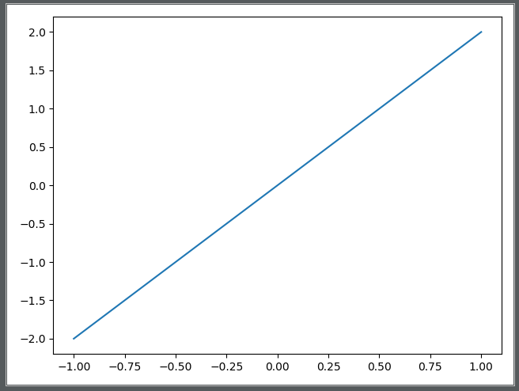

# NumPy Course

## Chapter 0. NumPy简介

### 1. NumPy简介

NumPy(Numerical Python)是Python语言的一个扩展程序库,支持大量的维度数组与矩阵运算,也针对数组运算提供了大量的数学函数库.

NumPy是一个运行速度非常快的数学库,主要用于数组计算,包含:

	1.一个强大的N维数组对象ndarray;
	2.广播功能函数;
	3.整合C/C++/Fortran代码的工具;
	4.线性代数、傅里叶变换、随机数生成等功能.

### 2. NumPy应用

NumPy通常与SciPy(Scientific Python)和Matplotlib(绘图库)一起使用,这种组合广泛用于替代MatLab.是一个强大的科学计算环境,有助于我们通过Python学习数据科学或者机器学习等.

	1.SciPy:一个开源的Python算法库和数学工具包,包含的模块有:
		最优化、线性代数、积分、插值、特殊函数、快速傅里叶变换、信号处理和图像处理、常微分方程求解和其他科学与
		工程中常用的计算;
	2.Matplotlib:Python和NumPy的可视化操作界面.

***

## Chapter 1. NumPy安装

### 1.1 NumPy安装

**1.Windows的安装**

1.cmd下的安装

	pip install numpy scipy matplotlib pandas

2.pycharm的安装

	File->Settings->Project:xxx->点击"Project Interpreter"
	1.如果在cmd中安装了,在右边的框框中就会显示有"numpy",也可以进行第2步再安装一次;
	2.如果没有,点击右边的"+",增加package.在搜索中输入"numpy/scipy...",点击下面的"Install Package".
		安装即可.
	PS:安装经常会出现不成功的,使用pip安装稳妥点.

**2.linux下的安装**

略.

### 1.2 NumPy的测试

	from numpy import *		//导入numpy库
	print(eye(4))
	//结果为:--->输出一个对角矩阵
	[[1. 0. 0. 0.]
	 [0. 1. 0. 0.]
	 [0. 0. 1. 0.]
	 [0. 0. 0. 1.]]

***

## Chapter 2. NumPy ndarray对象

ndarray对象:n维数组对象,一系列同类型数据的集合,以0下标开始进行集合中元素的索引.

### 2.1 创建ndarray

创建ndarray只需要调用NumPy的array函数即可:

	numpy.array(object, dtype = None, copy = True, order = None, subok = false, ndmin = 0)
	/*
		para1:数组或嵌套的数列(e.g.一个list);
		para2:数组元素的数据类型,可选;
		para3:对象是否需要复制,可选
		para4:创建数组的样式(C为行方向,F为列方向,A为任意方向(默认));
		para5:默认返回一个与基类类型一致的数组;
		para6:指定生成数组维度.
	*/

### 2.2 实例

**实例1**

	import numpy as np
	a = np.array([1, 2, 3, 4])	//接收一个list
	print(a)
	//结果为:
	[1 2 3 4]	//生成一个一维数组

**实例2**

	import numpy as np
	a = np.array([[1, 2], [3, 4]])	//接收一个list(元素也为list),此时为二维数组
	print(a)
	//结果为:
	[[1 2]
	 [3 4]]		//生成一个二维数组

**实例3**

	import numpy as np
	a = np.array([1, 2, 3, 4], ndmin=2)	//ndmin=2:指定生成一个二维数组
	print(a)
	//结果为:
	[[1 2 3 4]]		//第二维为空

**实例4**

	import numpy as np
	a = np.array([1, 2, 3, 4], dtype = complex)	//dtype:指定元素类型,此处指定元素为虚数
	print(a)
	//结果为:
	[1.+0.j 2.+0.j 3.+0.j 4.+0.j]	//虚数数组

***

## Chapter 3. NumPy数据类型

### 3.1 NumPy支持的常用数据类型

NumPy支持的常用数据类型如下:

	bool_, int8, int16, int32, int64, uint8, uint16, uint32, uint64, float16, float32, float64,
	complex64(复数), complex128(复数)
	//使用方法:
	import numpy as np
	np.int32	//32-bit有符号整数

### 3.2 数据类型对象(dtype)

数据类型对象:用于描述数组中元素的类型.dtype构造方法:

	numpy.dtype(object, align, copy)
	/*
		para1:数据类型.e.g.
			np.int32:表示元素为int32类型;
			[('age', np.int8)]:'age':表示某一列,元素为int8类型.
		para2:对齐.为true则对齐类似C的结构体--->一般不用填充;
		para3:复制dtype对象.为false则是对内置数据类型对象的引用--->一般不用填充.
	*/

### 3.3 实例

**实例1**

	import numpy as np
	dt = np.dtype(np.int32)	//创建一个int32的dtype对象
	print(dt)
	//结果为:
	int32

**实例2**

	import numpy as np
	dt = np.dtype('i4')	//直接用'i1','i2','i4','i8'可以表示np.int8,np.int16,np.32,np.int64
	print(dt)
	//结果为:
	int32

**实例3**

	import numpy as np
	dt = np.dtype('<i4')	//数据类型为小端. '>i4'数据类型为大端.
	print(dt)
	//结果为:
	int32

**实例4**
	
	import numpy as np
	dt = np.dtype([('age', 'i1'/np.int8)])
		//第一列类型为int8,且可以用array_name['age']直接取用第一列的所有元素
	a = np.array([(10,),(20,),(30,)], dtype = dt)
	print(a)
	print(a['age'])		//取用第一列的元素
	//结果为:
	[(10,) (20,) (30,)]
	[10 20 30]

**实例5**

	import numpy as np
	student = np.dtype([('name', 'S20'), ('age', 'i1'), ('marks', 'f4')])
	/*
		第一列类型为'S20':字符串,显示时前面会有个'b'字母.取第一列可用array_name['name'];
		第二列类型为'i1':int8.取第二列可用array_name['age'];
		第三列类型为'f4':float32(f2,f4,f8表示float16,float32,float64).取第三列可用
			array_name['marks']
	*/
	a = np.array([('abc', 21, 50), ('xyz', 18, 75)], dtype = student)
	print(a)
	print(a['name'], a['age'], a['marks'])
	//结果为:
	[(b'abc', 21, 50.) (b'xyz', 18, 75.)]
	[b'abc' b'xyz'] [21 18] [50. 75.]

***

## Chapter 4. NumPy数组属性

### 4.1 ndarray(数组)对象属性

NumPy的数组中ndarray对象属性如下:

	ndarray.ndim:数组维度的数量;
	ndarray.shape:数组的维度,对于矩阵:n行m列;
	ndarray.size:数组元素的总个数.相当于.shape中n*m的值;
	ndarray.dtype:ndarray对象的元素类型;
	ndarray.itemsize:ndarray对象中每个元素的大小,以字节为单位;
	ndarray.flags:ndarray对象的内存信息;
	ndarray.real:ndarray元素的实部;
	ndarray.imag:ndarray元素的虚部;

### 4.2 ndarray对象属性的使用

**1.ndarray.ndim**

	import numpy as np
	a = np.arange(24)	//arange(24):生成一个0~23的数组
	print(a) //结果为:[0  1  2  3  4  5  6  7  8  9 10 11 12 13 14 15 16 17 18 19 20 21 22 23]
	print(a.ndim)	//输出维度数量,结果为:1
	b = a.reshape(2,4,3)	//调整维度为:2 4 3
	print(b)
	//结果为:
	[[[ 0  1  2]
	  [ 3  4  5]
	  [ 6  7  8]
	  [ 9 10 11]]
	
	[[12 13 14]
	  [15 16 17]
	  [18 19 20]
	  [21 22 23]]]
	print(b.ndim)	//输出维度数量,结果为:3

**2.ndarray.shape**

ndarray.shape:表示一个数组的维度,返回一个tuple(行数和列数).也可用于调整数组的大小.

	1.返回一个数组的维度
	import numpy as np
	a = np.array([[1, 2, 3], [4, 5, 6]])
	print(a.shape)
	//结果为:
		(2, 3)
	2.调整数组大小
	import numpy as np
	a = np.array([[1, 2, 3], [4, 5, 6]])
	a.shape = (3, 2)	//调整数组大小为3行2列
	print(a)
	//结果为:
	[[1 2]
	 [3 4]
	 [5 6]]
	PS:使用reshape调整大小也可以:
		b = a.reshape
		print(b)	//结果为一样

**3.ndarray.itersize**

ndarray.itersize:以字节的形式返回数组中每一个元素的大小.

	import numpy as np
	a = np.array([1, 2, 3, 4, 5], dtype = np.float64)
	print(a)
	print(a.itemsize)	//由于元素类型为float64,因为大小为8字节
	//结果为:
	[1. 2. 3. 4. 5.]
	8

**4.ndarray.flags**

ndarray.flags:返回ndarray对象的内存信息.

	import numpy as np
	a = np.array([1, 2, 3, 4, 5], dtype = np.float64)
	print(a.flags)
	//结果为:
		C_CONTIGUOUS : True
		F_CONTIGUOUS : True
		OWNDATA : True
		WRITEABLE : True
		ALIGNED : True
		WRITEBACKIFCOPY : False
		UPDATEIFCOPY : False

***

## Chapter 5. NumPy创建数组

NumPy创建数组一般用ndarray,也可使用下面方式创建特殊的数组.

### 5.1 numpy.empty

**1.numpy.empty原型**

	numpy.empty(shape, dtype = float, order = 'C')
	/*
		para1:数组形状,几行几列,用list说明/tuple;
		para2:数据类型,默认为float;
		para3:"C"和"F"两个选项,分别代表:行优先和列优先.
	*/

**2.实例**

	import numpy as np
	x = np.empty([3, 2], dtype = int)	//创建3x2的数组,元素为整型.但是元素值为随机值.
	print(x)
	//结果为:(元素值随机)
	[[6488126 7602290]
	 [6357090 6619251]
	 [6553600       0]]

### 5.2 numpy.zeros

**1.numpy.zeros原型**

	numpy.zeros(shape, dtype = float, order = 'C')
	/*
		para1:数组形状,几行几列,用list说明/tuple;
		para2:数据类型,默认为float;
		para3:"C"和"F"两个选项,分别代表:行优先和列优先.
	*/

**2.实例**

	1.创建一维的数组
	import numpy as np
	x = np.zeros(5)	//一维数组,总共5个元素,每个都是浮点0.
	print(x)
	//结果为:
		[0. 0. 0. 0. 0.]
	2.2*2的数组
	import numpy as np
	y = np.zeros((2, 2), dtype=[('x', 'i4'), ('y', 'i4')])
		//2x2,第1/2列均为int32.第一列可用:y['x']访问;第二列可用:y['y']访问.
	print(y)
	//结果为:
	[[(0, 0) (0, 0)]
	 [(0, 0) (0, 0)]]

### 5.2 numpy.ones

**1.numpy.ones原型**

	numpy.ones(shape, dtype = float, order = 'C')
	/*
		para1:数组形状,几行几列,用list/tuple说明;
		para2:数据类型,默认为float;
		para3:"C"和"F"两个选项,分别代表:行优先和列优先.
	*/

**2.实例**

	1.创建一维的数组
	import numpy as np
	x = np.ones(5)	//一维数组,总共5个元素,每个都是浮点1.
	print(x)
	//结果为:
		[1. 1. 1. 1. 1.]
	2.2*2的数组
	import numpy as np
	y = np.ones((2, 2), dtype=[('x', 'i4'), ('y', 'i4')])
		//2x2,第1/2列均为int32.第一列可用:y['x']访问;第二列可用:y['y']访问.
	print(y)
	//结果为:
	[[(1, 1) (1, 1)]
	 [(1, 1) (1, 1)]]

***

## Chapter 6. NumPy从已有的数组创建数组

***

## Chapter 20. matplotlib画图

matplotlib是一个python的2D绘图库,可以绘制直方图、功率谱、条形图、散点图等.

### 20.1 matplotlib画图的属性控制

#### 20.1.1 matplotlib的简单使用

代码:

	import matplotlib.pyplot as plt
	import numpy as np

	x = np.linspace(-1, 1, 50)	//创建一个一维数组,起始值为-1,终值为1,数值个数为50.
	y = 2 * x

	plot.plot(x, y)	//matplotlib.pyplot的plot函数用于绘制图形
	plot.show()		//绘制完了之后需要调用show()用于显示.

结果为:

#### 20.1.2 figure对象的使用

