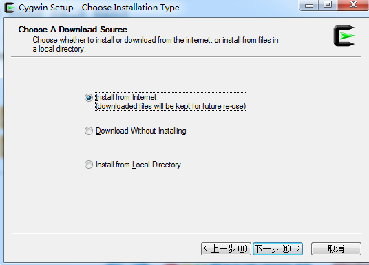
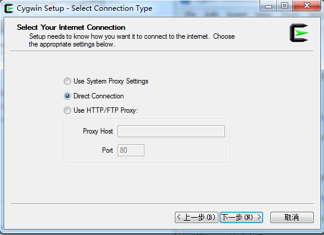
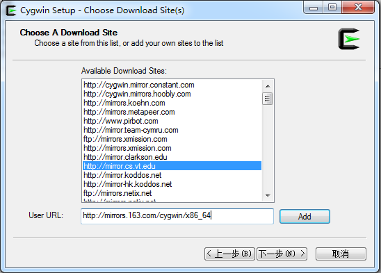

# Cygwin Installation

## 1.Cygwin介绍

Cygwin是一个在windows平台上运行的unix模拟环境,是cygnus solution公司开发的自由软件.

## 2.Cygwin的下载

[下载路径](https://cygwin.com/install.html)

	选择其中的setup-x86_64.exe进行下载.

## 3.Cygwin的安装

1.点击setup-x86_64.exe,出现"Choose installation type"界面.

	此处选择"Install from Internet"即可.下面指定存放路径.

2.选择网络连接方式

	一般选择"Direct Connection",但是我选择了"Use System Proxy Settings"也可以.

3.选择服务器

[服务器地址](http://mirrors.163.com/cygwin/)

	在选择下载网址(即服务器)的页面中,在User URL输入"http://mirrors.163.com/cygwin/x86_64".
	因此如果在选项中选择国内下载会很慢.

4.接下来就是下一步直到完成.

## 4.参考网址

[参考网址](https://blog.csdn.net/pz0605/article/details/52193450)