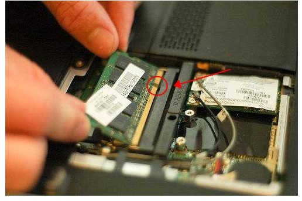

# Daily Record

## 1. 背景护眼颜色

	R:204
	G:232
	B:207

## 2. Microsoft office出现的异常解决
	
### 2.1 excel等出现"等待其他某个应用程序以完成对象的连接与嵌入操作的解决办法"消息

	原因:因为excel和和如金山词霸、PDF阅读器(还有Beyong compare)等其他软件商的兼容性问题造成的,这些软件会自动在
		excel中装插件、加载项,如果不成功就会出现这个问题
	解决:
		调出任务管理器,结束相关进程即可解决.

### 2.2 word出现一直打不开,画面停在那里不动

	解决:
		将word进程结束,将excel进程也结束.再打开,可能出现问题1的状况.

## 3. 在secure CRT中,linux文件名中出现空格" "如何选择上

	文件名"C language skill.md"
	在linux下,由于含有空格的文件名查看起来不是很方便,因此linux中带有空格的文件名较少.
	在secure CRT/linux下,选定带有空格的文件名方法:
	ls C\ language\ skill.md	//空格使用"\ ",反斜线 + 一个空格代替

## 4. UltraEdit打开文件时出现"文件可能不是DOS格式,你要转换...为DOS格式吗?"

	/************选择"是"或"否"的区别:************/
	1.选择"是",会转换成"DOS"格式,如果以十六进制显示得到的文件大小与Windows/linux的不一样.不是正确的文件大小
	2.选择"否".可以得到正确的文件大小和显示----选择"否"就对了.
	/************UltraEdit如何以十六进制显示************/
	快捷键:Ctrl + H

## 5. Windows系统一些常用的命令

	win+E--->打开资源管理器
	win+R--->打开"运行窗口"(该窗口可以输入"cmd"、"mstsc")
	/*运行窗口中输入如下命令,可得:*/
	1.输入"sysdm.cpl"--->将会打开系统属性窗口(像"修改环境变量"等操作属于该窗口);
	2.输入"dxdiag"--->将会打开DirectX诊断工具(目前没发现有什么用);
	3.输入"msinfo32"--->将会打开"系统信息"窗口(里面包含的信息蛮丰富的);
	4.输入"devmgmt.msc"--->将会"打开设备管理器";
	5.输入"taskmgr"--->打开任务管理器(与Ctrl+Alt+Del相同);
	6.输入"winver"--->查看系统版本信息.

	/*运行窗口下输入"cmd"之后的一些dos命令介绍:*/
	1.wmic diskdrive--->查看硬盘的牌子和大小(目前看没什么用);
	2.wmic cpu--->查看cpu的相关信息(位宽、最大时钟频率、厂商、二级缓存等),不好查看;
	3.wmic memorychip--->显示内存信息(条数、容量和速度),也不好查看;
	4.wmic bios--->bios相关信息,不好查看.
	PS:上述所有的查看都可以加上:list brief
	e.g. wmic memorychip list brief--->显示内存的相关信息.

## 6. MSB和LSB

在一些硬件的Spec中,经常会出现MSB和LSB,意思如下:

	MSB:Most Significant Bit,最高有效位.通常MSB位于二进制的最左侧;
	LSB:Least Significant Bit,最低有效位.通常LSB位于二进制的最右侧.
	(如果MSB=1,则表示数据为负值;如果MSB=0,则表示数据为正.)
	
## 7. meeting minutes

	meeting minutes:会议记录

## 8. c.f的意思

	c.f.	//意思是请参照,请比较
	c.f.kl.proto	//请参照kl.proto文件

## 9. word插入代码段

在word中插入优美的代码段

1.插入一个文本框并进行相关设置:

	插入->文本框(选择简单文本框即可)
	1.选中文本框"右击"->选择"其他布局选项(L)"->在"布局"中设置->文字环绕->环绕方式选择"嵌入式"->然后点击确定即可.
	2.选中文本框"右击"->选择"设置形状格式(O)"->
		在"填充"->选择"纯色填充"->颜色选择"第二行最后一个"(橙色,强调文字颜色6,淡色80%).
	3.调整文本框的大小,使其看起来比较舒服(可以选择段落,让文字居中)

2.设置一个样式

	选择"开始"下的菜单靠右的"更改样式"下的一个扩展按钮->在显示的"样式"窗口中->选择新建样式
	在"根据格式设置创建新样式"的窗口中设置:
	1.属性:
		名称:Code
		样式类型:链接段落和字符
		样式基准:正文
		后续段落样式:是自动设置的,不需要设置
	2.格式：
		字体:宋体(中文正文)
		字号:8
		颜色:自动
		最后一个选择"中文"
	3.点击确定即可

3.在文本框中选择所设置的样式.
		
## 10. Win7中创建软链接(mklink命令)

Win7/Win10拥有类似linux相同的软连接,创建后在source insight中可以看到该链接(使用快捷方式是看不到的).

**1.创建方法:**

	mklink [/D] [/H] [/J] link target
	/*
		/D--->创建目录的符号链接.默认为文件(常用)
		/H--->创建硬链接.
		/J--->创建目录链接
		link--->指定符号链接名称
		target--->指定需要链接的路径.
	*/

**2.实例**

	mklink /D linux linux-4.17.2 //为linux-4.17.2创建一个名叫linux的符号链接.

## 11. Win7设置宽带拨号上网

一般家庭使用宽带拨号上网的方式进行上网,相关的设置如下:

	1.打开控制面板(Control Panel)->选择"网络和共享中心(Network and Sharing Center)"
		PS:也可以直接点击右下角网络图标->选择最下面的"Open Network and Sharing Center"
	2.在"Network and Sharing Center"中,选择"设置新的链接或网络(Set up a new connection or
	network)":这一项在这一页面的下半部第一条.
	3.选择"连接到Internet(Connect to the Internet)"->在"你想如何连接?(How do you want to
	connect)"中选择"带宽(PPPoE)(R) (Broadband(PPPoE))"->然后输入账号和密码即可.
	
## 12. Win7如何创建密码

	Control Panel->User Accounts and Family Safety(用户账号和家庭安全)
	->User Accounts->Create password...(创建密码)

## 13. Thinkpad T430增加内存

1.缺口位置:

2.错误的安装方法:

3.正确的安装方法:

安装重点:

	对着内存条的缺口插进去,与水平40度左右斜角插进去,而不是平着插进去,因为平着插进去两边的小铁卡子会挡住.
	插内存时要用点力插进去,当金手指基本上全插进槽内,然后向下按平,按平就可以了.

## 14. Windows电脑将程序添加到右键菜单的方法

以将cygwin加入到右键菜单为例:

	1.win+R->输入"regedit"->在注册表编辑器中依次展开目录"HKEY_CLASSES_ROOT/Directory/shell";
	2.选中shell->右键->新建->项->生成一个文件夹,将文件夹名字改为"cygwin"(此为在右键菜单中显示的名字);
	3.选中"cygwin"文件夹->右键->新建->项->生成一个文件夹,将文件夹名字改为"command";
	4.选中"command"文件夹->在右侧窗口中参数(名称下面)双击->打开编辑字符串;
	5.在桌面上右键cygwin快捷方式->属性->复制路径:
		D:\cygwin64\bin\mintty.exe -i /Cygwin-Terminal.ico -	 //如果有双引号需要去掉
	6.将复制的路径粘贴到第4步的编辑字符串的"数值数据(V)"中;
	7.设置完成,右击一个文件夹,即可看到"cygwin"选项了.

