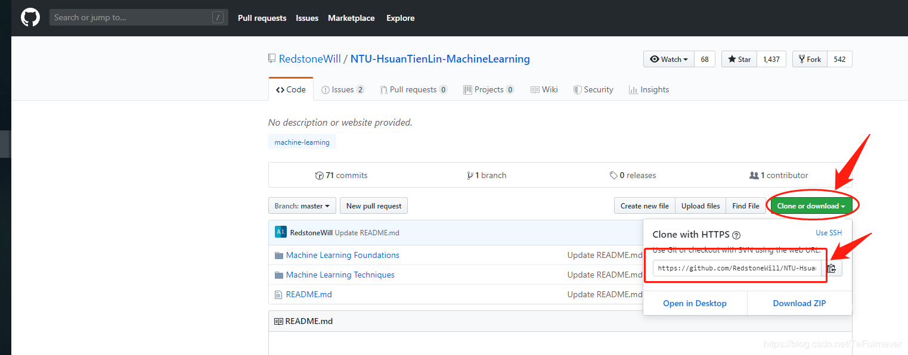
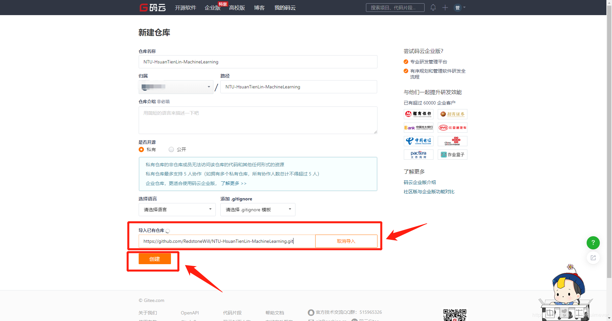
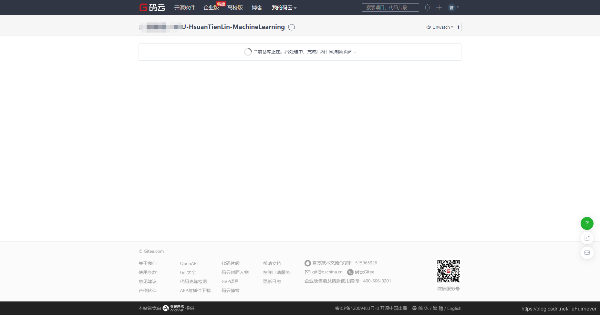

# How to increase the download speed of github

	从github上下载代码时,国内经常会碰到下载速度只有几k或者直接下载失败.百度中的方法基本都是修改hosts文件,
	但是这个方法效果不明显(本人也没试过).下面一种方法可以高速下载github上的项目代码.

## 1.码云界面

本方法是利用码云来克隆github项目,然后再下载.

[码云官网](https://gitee.com/)

	我的码云账号:defychen;	passwd:...

## 2.注册码云账户

	可以使用手机号进行注册.

## 3.新建一个仓库

## 4.选择导入已有仓库

## 5.在github上找到需要clone的网站

## 6.复制github项目地址到"导入已有仓库位置"

## 7.等待码云克隆项目,1-3min即可完成

## 8.克隆码云上的项目

