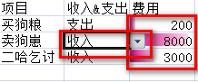
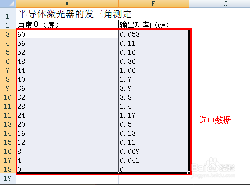
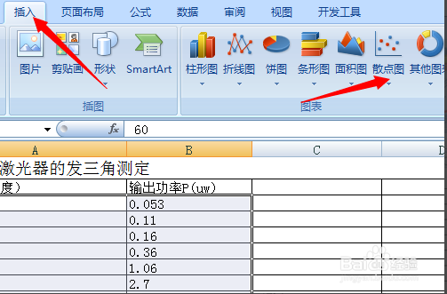
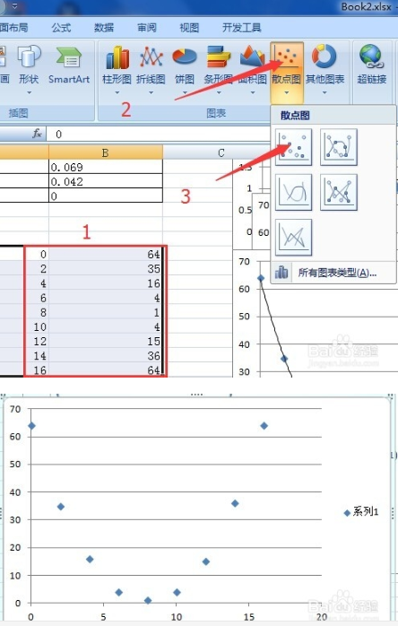
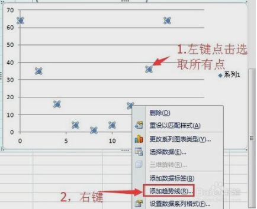
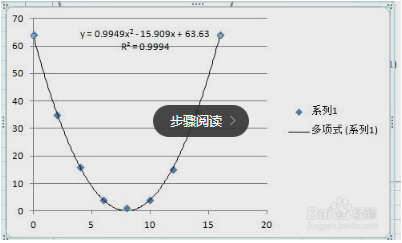
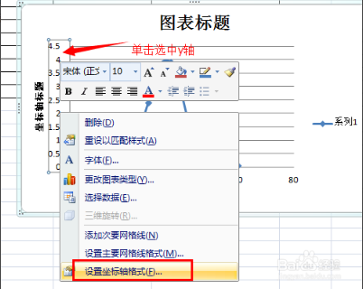

# Microsoft Office Usage

## 1.Word Usage

***

## 2.Excel Usage

### 2.1 合并数量不同的单元格填充相同的数据

例如:合并A1/A2, A3/A4/A5/A6,AA7/A8/A9/A10/A11/A12.产生3个合并的单元.但都需要填充数据80.

**1.如果合并后的单元格没有数据,方法如下:**

	选中合并后的单元 -> ctrl+g -> 弹出"定位"的窗口 -> 点击"定位条件" -> 在定位条件的窗口中选择"空值"
	-> 点击"确定" -> 此时三个合并的单元格还是处于选中的状态 -> 输入要填充的数据"80" -> 按下ctrl+enter
	-> 所有合并的单元格即可填充数据"80".

**2.如果合并后的单元格含有数据,也使用方法1**

	选中合并后的单元 -> ctrl+g -> 弹出"定位"的窗口 -> 点击"定位条件" -> 在定位条件的窗口中选择"空值"
	-> 点击"确定" -> 此时三个合并的单元格还是处于选中的状态 -> 输入要填充的数据"50" -> 按下ctrl
	+enter -> 所有合并的单元格即可被新填充数据"80".

### 2.2 SUMPRODUCT函数的使用

在给定的几组数组中,把数据间对应的元素相乘,将相乘的结果再求和.

	e.g.
	1.A1数据为2, B1为5, C1为10.
		=> 则E1中写入:=SUMPRODUCT(A1,B1,C1),结果为100.
	2.A1/A2为为2/3, B1/B2为5/6, C1/C2为10/11.
		=> 则E1中写入:=SUMPRODUCT(A1:A2,B1:B2,C1:C2),结果为298.

### 2.3 GEOMEAN函数的使用

GEOMEAN函数用于求取多个数的几何平均数,即:

	GM = (y1*y2*y3*...*yn)再开n次根式,即n个数相乘再开n次根式

输入方法为:

	e.g.
	A1~A4输入值1,2,3,4.在B1中输入"=GEOMEAN(A1:A4)",结果为:2.213364(即几何平均值为2.213364).

### 2.4 数据条填充,更好的呈现数据

数据填充如下图所示:

方法:

	选中需要制作数据条的数据->在"开始"菜单中间的样式子菜单中有"条件格式"选项->点击"条件格式"->数据条
	->选择喜欢的数据条即可.

### 2.5 制作下拉菜单

制作的下拉如2.4所示:

	选中需要制作下拉菜单的列->在"数据"菜单靠右的数据工具子菜单中有"数据有效性"选项->点击"数据有效性"->
	在"数据有效性"的"设置"页面中:
		允许选择"序列";来源选择"收入,支出"(来源表示下拉菜单的可选项)
		PS:"收入,支出"中的逗号为英文状态下,中文的不行.

### 2.6 曲线拟合

曲线拟合包括:平滑曲线,线性,指数,幂,多项式(如二次曲线,三次曲线...),对数拟合等.

	多项式用的最多.

#### 2.6.1 平滑曲线拟合

**1.选中数据**

**2.插入散点图**

**3.平滑曲线拟合**

选择既有数据点、又有平滑曲线的散点图即可.

#### 2.6.2 多项式拟合

**1.选中数据**

选中数据--->插入--->散点图(只有数据点的类型)即可.

**2.添加趋势线**

点击一个点(即会选中所有数据点)--->右键--->弹出的菜单中选择"添加趋势线".

**3.选择拟合的曲线类型**

选择需要的曲线类型(此处为多项式,顺序为2表示2阶)--->勾选"显示公式"和"显示R平方".可以得到公式和相对误差.

**4.设置坐标轴**

在坐标轴附近右键--->选择"设置坐标轴格式"--->进行详细的设置.

### 2.7 万能的Ctrl键

	Ctra+a:全选;
	Ctrl+T:美化表格--->需要先全选中;
	Ctrl+\:快速找出不同处--->需要先全选中;
	Ctrl+E:智能拆分数据;
	Ctrl+;(分号):输入日期;
	Ctrl+shift+;(分号):输入时间;
	Ctrl+B:字体加粗;
	Ctrl+4:添加下划线;
	Ctrl+5:添加删除线.

### 2.8 万能的Alt键

	Alt+Enter:单元格内换行;
	Alt+=:一键求和--->需要先全选中数据;
	Alt+F1:生成柱形图--->需要先全选中数据;

***

## 3.PowerPoint Usage