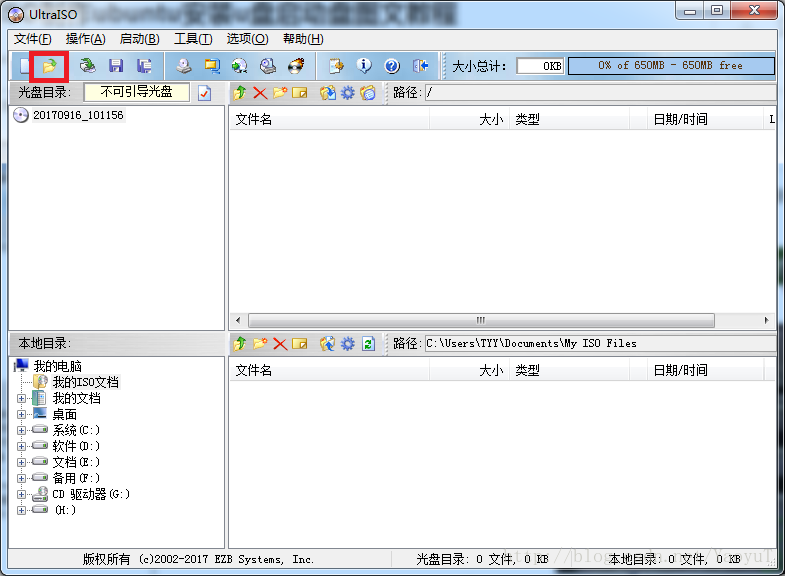
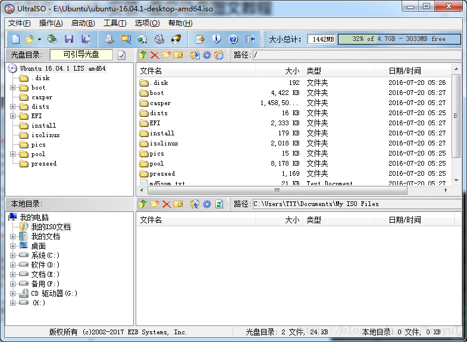
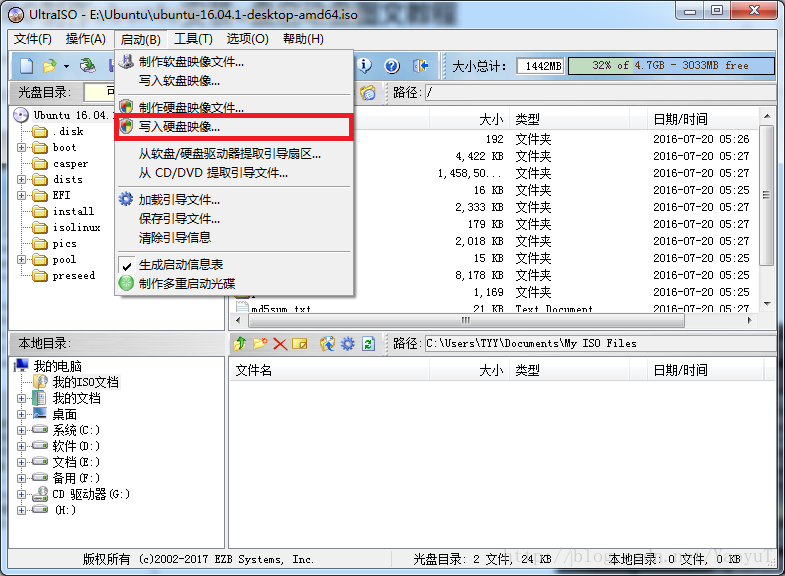
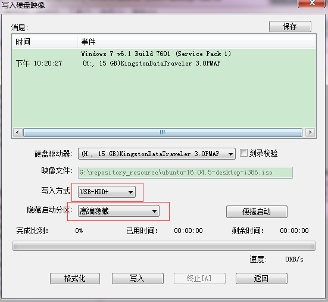
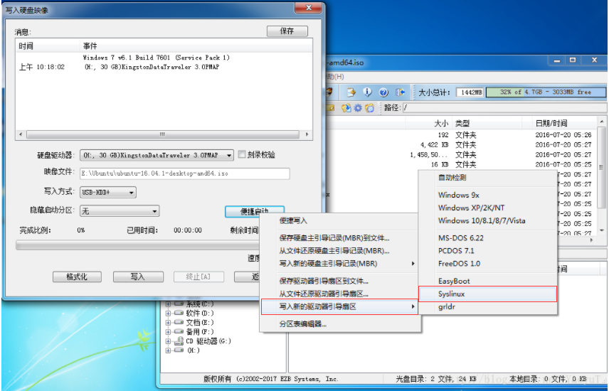

# UltraISO+Ubuntu16.04 Installation

## 1.Ubuntu16.04下载

下载地址:[Ubuntu Release](http://releases.ubuntu.com/)

## 2.UltraISO安装

### 2.1 UltraISO下载

下载地址:[UltraISO下载](http://www.upantool.com/qidong/2011/UltraISO_v9.5.0.2800.html)

	将网站拉到最后面,选择"普通下载地址"中的一个下载即可.

### 2.2 安装

安装常规安装即可.

## 3.制作U盘启动盘

1.打开UltraISO软件,点击"打开文件"按钮,如下图.选中下载的Ubuntu的iso文件,进行打开.

2.打开Ubuntu的iso文件后的效果如下图:

3.点击"启动"菜单->选择"写入硬盘映像..."

4.选择写入方式为"USB-HDD+"或"USB-HDD";并选择隐藏启动分区为:"隐藏"或"高级隐藏"(推荐).

5.点击"便捷启动"->选择"写入新的驱动器引导扇区"->选择"Syslinux".

	此处会出现一个"提示",选择"是"即可.然后就会出现"引导扇区写入成功"的消息框.

6.点击"写入",选择"是".会出现提示"驱动器...所有数据将丢失".选择"是",然后就是写入到U盘的等待过程.

7.至此,U盘启动工具制作完成.

## 4.Ubuntu U盘启动

参考:[U盘启动安装Ubuntu16.04详解](https://blog.csdn.net/lingyunxianhe/article/details/81415675).

此处略.