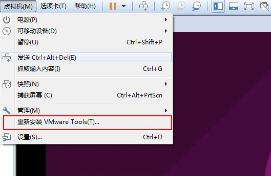
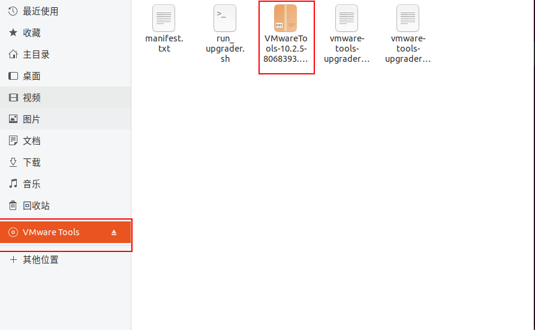
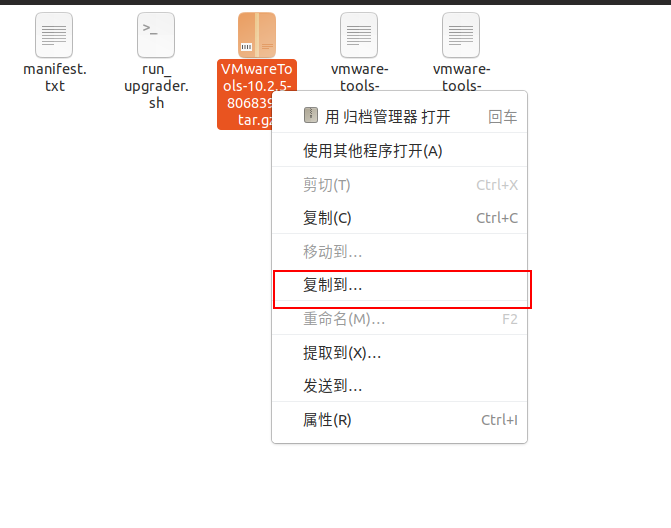
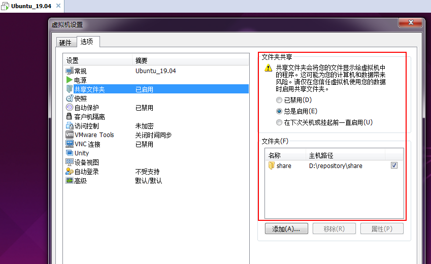

# VMware+SecureCRT usage

# 1. VMware usage

## 1.1 VMware 14.x下载及安装

### 1.1.1 下载

[VMware 14.x下载地址](https://www.cr173.com/soft/68480.html)

	VMware 2018 v14.x 永久许可证激活密钥--->秘钥1实测过,可用.
	FF31K-AHZD1-H8ETZ-8WWEZ-WUUVA
	CV7T2-6WY5Q-48EWP-ZXY7X-QGUWD

### 1.1.2 安装

略.

## 1.2 VMware 14.x安装ubuntu 19.04

### 1.2.1 ubuntu 19.04下载

[ubuntu 19.04下载地址](http://mirrors.163.com/ubuntu-releases/)

	下载的版本选择:ubuntu-19.04-desktop-amd64.iso

### 1.2.2 安装ubuntu 19.04

安装过程如下:

	首页选择"创建新的虚拟机"--->选择"典型",然后"下一步"--->选择"稍后安装操作系统",然后"下一步"--->
	选择"Linux(L)",版本中选择"Ubuntu 64位",然后"下一步"--->名称设为"Ubuntu_19.04",位置设为
	"D:\repository\VMWare",然后"下一步"--->磁盘大小设为"40",点选"将虚拟磁盘拆分成多个文件",然后
	"下一步"--->点击"自定义硬件",在硬件窗口中:
		1.选中"打印机",点击"移除",将打印机移除;
		2.选中"内存",将虚拟机内存设置为2048MB;
		3.选中"处理器",设置处理器数量为1;
		4.选中"CD/DVD (SATA)",选中"使用ISO映像文件",在"浏览"选择下载的Ubuntu 19.04的iso文件.
	然后点击确定,开始安装ubuntu.

[安装参考文档](https://www.cnblogs.com/swjian/p/9193478.html)

	正常安装成功即可进入到ubuntu.

## 1.3 VMware下Linux和Windows共享文件

VMware下Linux和Windows共享文件是借助VMware Tools实现的.具体步骤如下:

**1.加载VMware Tools**

	1.打开虚拟机,启动安装的Linux(一定要启动,否则选项"安装/重新VMware Tools"为灰色);
	2.在启动Linux后的那一页WMware中点击:
		虚拟机--->安装VMware Tools(已经安装过了就是重新安装VMware Tools);

**2.查看加载成功后的VMware Tools中的内容**

	加载成功后,在文件系统中即可看到VMware Tools文件夹中的内容.

**3.解压及安装**

方法1:直接使用界面操作:

	右击"VMwareTools...tar.gz",选择"复制到",选择路劲即可解压出来.

方法2:只用命令行方式:

	1.切换权限
		su -
	2.新建一个mount目录
		mkdir /home/defychen/repository_develop
	3.mount到新建目录
		mount /dev/cdrom /home/defychen/repository_develop
		/*
		显示:mount: /home/defychen/repository_develop: WARNING: device write-protected, mounted
			read-only.--->即表示成功.
		PS:如果使用"./",当前可能看不到,需要回退到上一层目录,在回来就可以看到mount之后的内容.
		*/
	4.拷贝"VMwareTools-10.2.5-8068393.tar.gz"到需要解压的目录
		cp VMwareTools-10.2.5-8068393.tar.gz /opt/working
	5.解压
		tar -xvzf VMwareTools-10.2.5-8068393.tar.gz	//解压到当前目录
	6.安装
		cd vmware-tools-distrib		//解压后的目录
		./vmware-install.pl			//安装
		PS:安装过程中,一直输入"yes"或者点击"Enter"即可.不出意外,安装就会成功.
	7.安装成功之后,关闭Linux系统及WMware软件,重新启动.

**4.设置共享文件夹**

	启动WMware后,也需要启动Linux系统.在启动Linux后的那一页WMware中点击:
		虚拟机--->设置--->在弹出的"虚拟机设置"页面中按图进行共享文件夹的设置.
	PS:没有启动Linux,看到的共享文件夹设置里的信息为灰色的.因此一定要启动Linux.

**5.共享文件夹路径**

	1.共享文件夹在Windows比较好查看;
	2.共享文件夹在Linux的路径为:
		/mnt/hgfs/share		//share为自己设置的共享文件夹.都在"/mnt/hgfs"路径下.

**6.注意**

	当从Windows下拷贝压缩文件到共享文件夹,Linux需要拷贝到其他目录.Linux不能在该共享文件夹下解压,会出错.
	--->出错的原因:在解压过程中,由于在共享文件夹下,文件格式会发生变化.

***

# 2. SecureCRT usage

SecureCRT是一款支持SSH(SSH1和SSH2)的终端仿真程序,借助SecureCRT可以在Windows下登录到Unix或Linux主机.

## 2.1 SecureCRT下载

[SecureCRT 6.5中文破解版下载地址](http://www.kuaihou.com/soft/169205.html)

	为一个绿色版本,下载即可使用.

## 2.2 Ubuntu支持SSH

### 2.2.1 查看虚拟机和Windows是否能互相ping通

	1.启动虚拟机中ubuntu,查看ubuntu的ip地址:
		1.ctrl+alt+t(打开一个terminal)--->ifconfig查看网卡信息,如果没有安装ifconfig命令,可参看
			"Ubuntu&Qemu usage"的1.3或者看提示进行安装;
		2.安装好后,执行ifconfig可以看到网络信息:
			ens33:....
				inet 192.168.35.132 ....
				...
			lo:...
			--->显示ubuntu的ip地址为192.168.35.132;
	2.查看windows的ip地址:
		打开cmd--->输入ipconfig--->显示如下:
			...
			以太网适配器 本地连接:		--->一定要查看该地址
				...
				IPv4 地址 ....... : 139.189.1.3	--->此为windows的ip地址
	3.互相ping ip:
		1.windows ping ubuntu:
			在cmd中执行:
			ping 192.168.35.132
			当看到"已发送 = 4, 已接收 = 4, 丢失 = 0 (0%丢失)"即为ping通;
		2.ubuntu ping windows:
			在ubunt terminal中执行:
			ping 139.189.1.3
			当看到一直在进行ping,则为ping通.

需要ping通才能进行下一步,虚拟机中的ubuntu才能上网.

### 2.2.2 安装SSH

下载的ubuntu 19.04默认是不安装SSH.

	1.测试SSH是否安装:
		ssh username@localhost
		/*
		如果出现"ssh: connect to host localhost port 22: Connection refused",则说明机器没装SSH,
		则需要安装SSH.
		*/
	2.安装SSH:
		sudo apt-get install openssh-server	//会出现确认,执行输入"y"即可.
	3.测试SSH是否启动:	--->一般安装完毕默认会启动SSH
		netstat -nat | grep 22
		/*
		如果出现:
			tcp		0		0 0.0.0.0:22			0.0.0.0:*		LISTEN
			tcp		0		0 :::22					:::*			LISTEN
		即为成功启动.
		*/

## 2.3 SecureCRT连接到ubuntu

打开SecureCRT,然后:

	1.选择"连接"(工具栏第一个图标)--->弹出的连接窗口选择"新建会话"(工具栏第三个图标)--->弹出新建会话向导
		--->点击"下一步";
	2.在下一步窗口中设置如下:
		主机名:192.168.35.132	--->ubuntu的ip地址
		用户名:defychen
		其他不变--->下一步--->完成即可.
	3.在连接窗口中选择刚建立的Sessions,点击连接,会弹出"输入安全外壳秘钥",输入登录ubuntu的密码即可.
	
经过上述步骤后,正常情况下,在SecureCRT中即可登录到Ubuntu.

