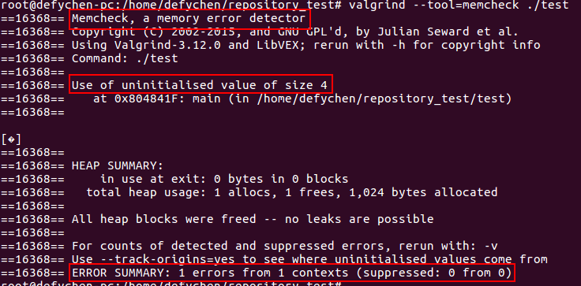
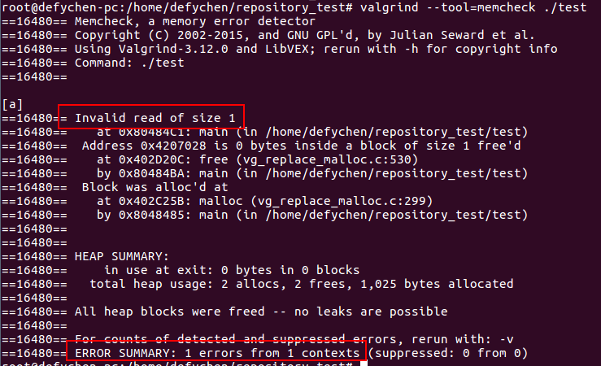
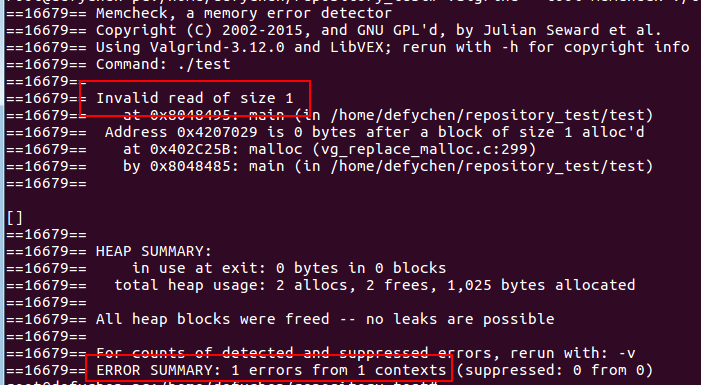
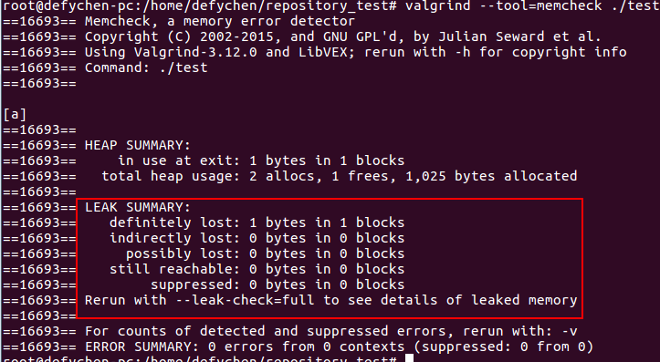
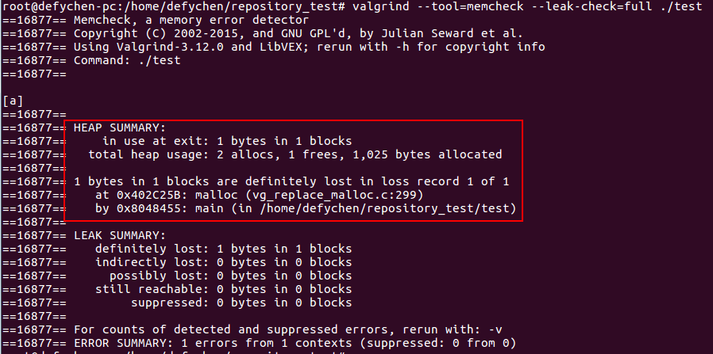
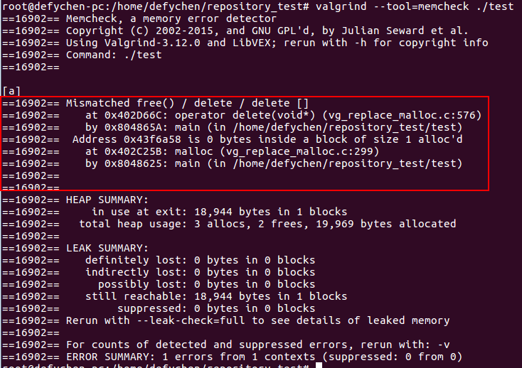
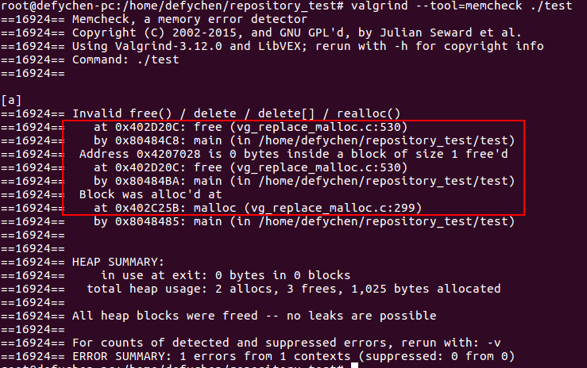

# Valgrind memcheck Usage

## 1. Valgrind概述

Valgrind是用于构建动态分析工具的探测框架.它包括一个工具集,每个工具执行某种类型的调试、分析或类似的任务,以帮助完善程序.Valgrind的架构是模块化的,所以可以容易的创建新的工具而不会扰乱现有的结构.

**Valgrind包含的工具**

	1.Memcheck是一个内存错误检测器.它有助于使你的程序,尤其是那些用C和C++写的程序,更加准确;
	2.Cachegrind是一个缓存和分支预测分析器.它有助于使你的程序运行更快;
	3.Helgrind是一个线程错误检测器.它有助于使你的多线程程序更加准确;
	4.DRD也是一个线程错误检测器.它和Helgrind相似,但使用不同的分析技术,所以可能找到不同的问题;
	5.Massif是一个堆分析器.它有助于使你的程序使用更少的内存;
	6.DHAT是另一种不同的堆分析器.它有助于理解块的生命期、块的使用和布局的低效等问题;
	7.SGcheck是一个实验工具,用来检测堆和全局数组的溢出.它的功能和Memcheck互补:SGcheck可以找到Memcheck
		无法找到的问题,反之亦然;
	8.BBV是个实验性质的SimPoint基本块矢量生成器.它对于进行计算机架构的研究和开发很有用处.

## 2. Valgrind的安装

### 2.1 valgrind下载

[下载地址](http://valgrind.org/downloads/valgrind-3.12.0.tar.bz2)

### 2.2 valgrind安装

1.解压

	tar -xvjf valgrind-3.12.0.tar.bz2

2.配置

	cd valgrind-3.12.0
	./configure

3.编译及安装

	make
	make install

4.帮助信息

	valgrind -h	//显示参数信息及提示,说明安装成功
	which valgrind	//查看valgrind的路径

## 3. Valgrind memcheck的使用

memcheck工具的使用方式如下:

	valgrind --tool=memcheck ./a.out
	/*
		--tool:表示使用的工具,此处为memcheck;
		./a.out:执行可执行程序,表示在该程序运行期间进行内存检查.
	*/

memcheck工具可进行的内存检查包括:

	1.检测未释放的内存;
	2.检测对释放后内存的读/写;
	3.检测对已分配内存块尾部的读/写;
	4.检测内存泄漏;
	5.检测不匹配的使用malloc/new/new[] 和 free/delete/delete[];
	6.检测重复释放内存.

## 4. 实例

### 4.1 检测未初始化的内存

**1.代码**

	#include <stdio.h>
	#include <stdlib.h> 
	
	int main(void)
	{
	    char *p; 
	
	    char c = *p;	//使用了未初始化的指针'p'.
	
	    printf("\n [%c]\n",c); 
	
	    return 0;
	}

**2.使用valgrind进行检测**

	gcc test.c -o test
	valgrind --tool=memcheck ./test

**3.检测结果**

	输出log可以看出:valgrind检测到了未初始化的变量.

### 4.2 检测内存被释放后进行读写

**1.代码**

	#include <stdio.h>
	#include <stdlib.h>
	
	int main()
	{
		char *p = malloc(1);
		*p = 'a';
	
		char c = *p;
		printf("\n[%c]\n", c);
	
		free(p);
		c = *p;		//p指针已经被free掉了
		return 0;
	}

**2.使用valgrind进行检测**

	gcc test.c -o test
	valgrind --tool=memcheck ./test

**3.检测结果**

	输出log可以看出:valgrind检测到了无效的读操作"Invalid read of size 1".

### 4.3 检测对已分配内存块尾部的读/写

**1.代码**

	#include <stdio.h>
	#include <stdlib.h>
	
	int main()
	{
		char *p = malloc(1);
		*p = 'a';
	
		char c = *(p + 1);	//超越了分配的内存
		printf("\n[%c]\n", c);
	
		free(p);
		return 0;
	}

**2.使用valgrind进行检测**

	gcc test.c -o test
	valgrind --tool=memcheck ./test

**3.检测结果**

	输出log可以看出:valgrind检测到了无效的读操作"Invalid read of size 1".

### 4.4 检测内存泄漏

**1.代码**

	#include <stdio.h>
	#include <stdlib.h>
	
	int main()
	{
		char *p = malloc(1);	//malloc的内存没有释放(即没调用free)
		*p = 'a';
	
		char c = *p;
		printf("\n[%c]\n", c);
	
		return 0;
	}

**2.使用valgrind进行检测**

	gcc test.c -o test
	valgrind --tool=memcheck ./test

**3.检测结果**

**4.查看详细的泄漏情况**

	valgrind --tool=memcheck --leak-check=full ./test

### 4.5 不匹配的使用malloc/new/new[]和free/delete/delete[]

**1.代码**

	#include <stdio.h>
	#include <stdlib.h>
	#include <iostream>
	
	int main()
	{
		char *p = (char *)malloc(1);
		*p = 'a';
	
		char c = *p;
		printf("\n[%c]\n", c);
	
		delete(p);	//malloc的内存使用delete来释放
	
		return 0;
	}

**2.使用valgrind进行检测**

	g++ test.c -o test
	valgrind --tool=memcheck ./test

**3.检测结果**

### 4.6 两次释放内存

**1.代码**

	#include <stdio.h>
	#include <stdlib.h>
	
	int main()
	{
		char *p = (char *)malloc(1);
		*p = 'a';
	
		char c = *p;
		printf("\n[%c]\n", c);
	
		free(p);
		free(p);	//释放了两次p
	
		return 0;
	}

**2.使用valgrind进行检测**

	g++ test.c -o test
	valgrind --tool=memcheck ./test

**3.检测结果**

