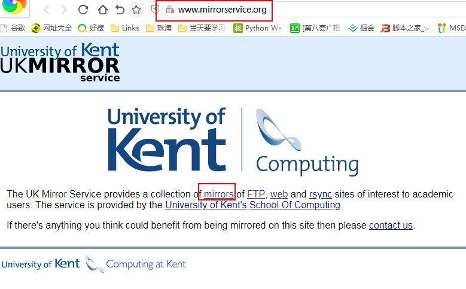

# Sourceforge Usage

Sourceforge是一些开源软件经常用到的网站,然而国内的网站一直不稳定.虽然可以访问,但是下载的时候经常下载不下来.

	借助于"http://www.mirrorservice.org"这个网站,该网站提供了很多网站的镜像,可以通过web或ftp等方式
	访问下载.

## 1.在Sourceforge上下载"cmusphinx-zh-cn-5.2.tar.gz"

cmusphinx-zh-cn-5.2.tar.gz是一个中文语言、声学模型.正常在Sourceforge上下载下载不下来.

### 1.1 打开镜像网站"http://www.mirrorservice.org"

[镜像网站](http://www.mirrorservice.org)

打开之后如下:

### 1.2 下载

	接下来依次:
		选择"mirrors"->download.sourceforge.net/->pub/->sourceforge/->c/->cm/->cmusphinx/
		->Acoustic and Language Models/->Mandarin/->cmusphinx-zh-cn-5.2.tar.gz

PS:可以在Sourceforge上先查看如何下载,然后再去"http://www.mirrorservice.org"寻找下载地点.