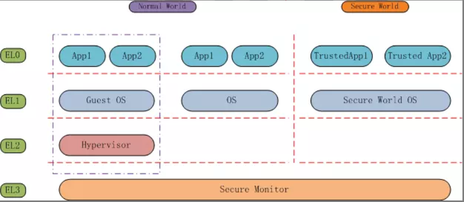
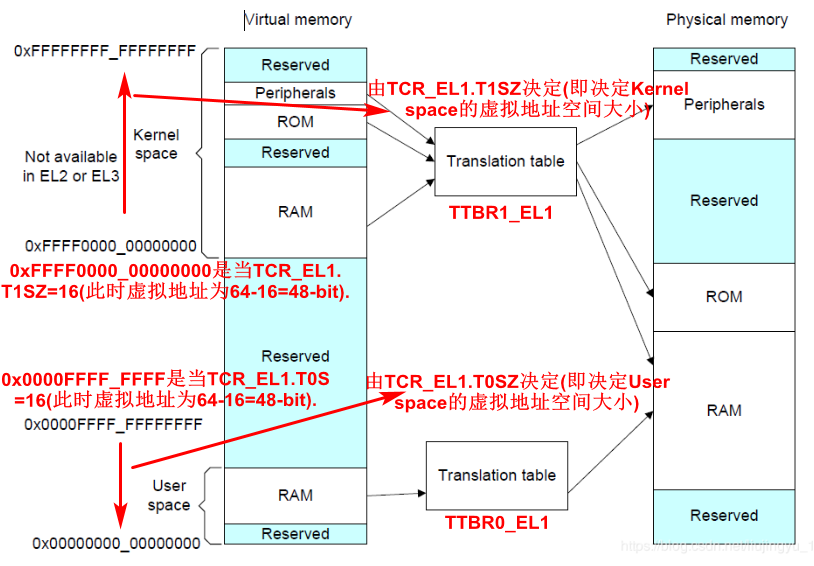
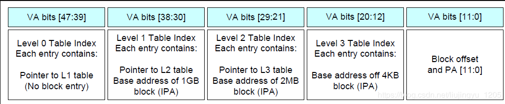
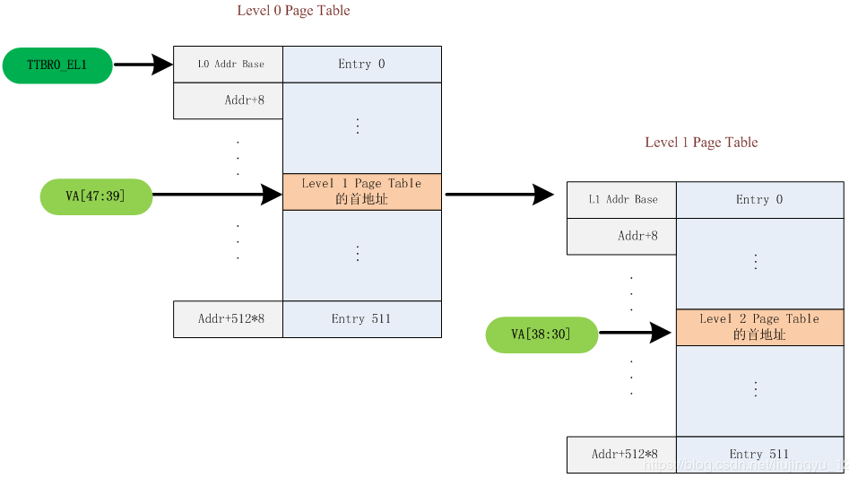
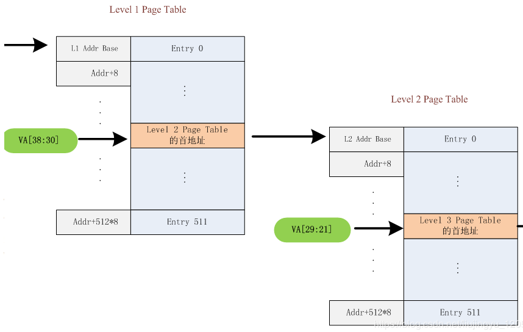
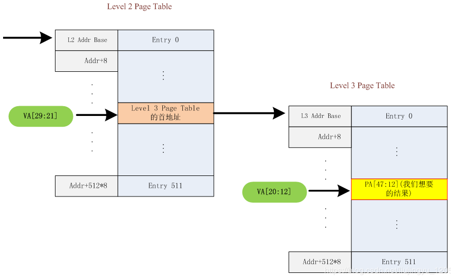
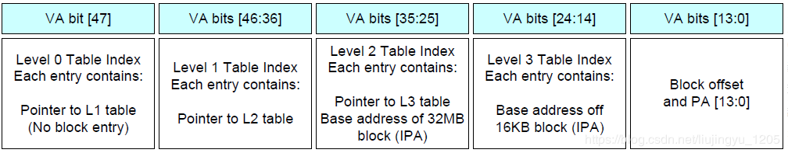
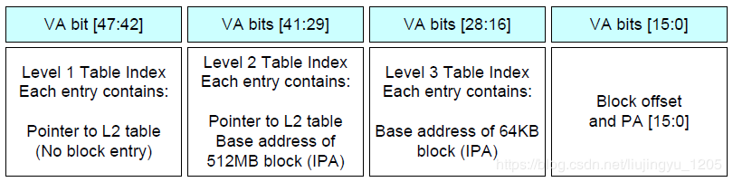

# ARMv8 Architecture Learning

## Chapter 1. ARMv8架构简介

### 1.1 背景

ARM于2011年推出了第8代架构ARMv8,ARMv8架构是迄今为止ARM历史上变革最大的架构.

ARM为低功耗而生,从ARMv7开始,ARM将其架构分为3个系列:

	A系列:针对Application,适用于追求高性能的场景(e.g.移动领域->手机;企业领域->服务器);
	R系列:针对Real-time,适用于车用以及工业控制领域;
	M系列:针对Microcontroller,适用于微控制器领域.

ARMv8架构增加了3个特性:

	支持64-bit、虚拟化支持、安全增强.
	PS:ARMv7增加LAPE(Large Physical Address Extensions),使用48-bit VA,并将虚拟地址映射到40-bit
		物理地址上(最大支持1024G的物理内存).

### 1.2 运行状态

由于基于32-bit的ARMv7架构的Cortex系列大受欢迎,而且已经建立了完善的开发者生态.因此ARMv8架构兼容ARMv7架构中的主要特性.

ARMv8架构将运行状态分为AArch64和AArch32两种状态,具体情形如下:

**1.AArch64状态特点**

	1.64-bit的运行状态,地址存储在64-bit的寄存器中,使用64-bit指令集以及64-bit的寄存器;
	2.31个64-bit的通用寄存器(X0-X30,通过W0-W30来访问低32-bit,X30一般用作程序链接寄存器);
	3.64-bit的程序计数器(PC)、64-bit的堆栈指针SP(每个异常等级一个)、64-bit的异常链接寄存器ELR(每个异常
		等级一个,存储了从中断返回的地址);
	4.32个128-bit的NEON浮点寄存器(V0-V31),支持SIMD的向量运算及标量浮点的运算;
	5.使用AArch64指令集,使用固定长度的指令,指令使用32-bit编码;
	6.定义了4个异常等级EL0-EL3,对应不同的执行权限,EL0最低,EL3最高;
	7.支持64-bit的虚拟地址空间;
	8.定义了一组Process state寄存器PSTATE(NZCV/DAIF/CurrentEL/SPSel等),用于保护PE当前的状态信息,
		AArch64指令集提供专门的指令来访问这些PSTATE;
	9.系统寄存器(System Register)名称后面带一个后缀,表示访问该寄存器的最低EL级别.

**2.AArch32状态信息**

	1.32-bit的运行状态,地址存储在32-bit的寄存器中,使用T32/AArch32指令集以及32-bit的寄存器;
	2.13个32-bit的通用寄存器(R0-R12);
	3.32-bit的程序计数器(PC)、32-bit的堆栈指针SP(每个异常等级一个)、32-bit的程序链接寄存器LR(LR也可用作
		异常链接寄存器ELR);
	4.提供一个ELR,用来保存Hyper模式下异常返回的地址,Hyper模式与虚拟化相关;
	5.32个64-bit的浮点寄存器,支持AdvancedSIMD的向量运算及标量浮点的运算;
	6.使用AArch32指令集(使用固定长度的指令,指令使用32-bit编码)或者T32指令集(使用变长指令,指令编码为
		16-bit或32-bit);
	7.支持ARMv7中基于PE模式(FIQ/IRQ/Abort/Undefined/SVC)的异常模型;
	8.支持32-bit的虚拟地址空间;
	9.定义了一组Process state寄存器PSTATE(NZCV/DAIF/CurrentEL/SPSel等),用于保护PE当前的状态信息,
		AArch32/T32指令集提供专门的指令来访问这些PSTATE.

### 1.3 异常等级

ARMv8定义了一套新的异常(或叫等级)模型,具有以下特性:

	1.ARMv8异常模型定义了4个异常等级(El0-EL3),层级越高(数字越大表示层级越高),特权越大,EL0为非特权等级;
	2.在进入异常时会把异常返回地址写入到异常链接寄存器ELR中;
	3.异常可以在同异常等级中处理,也可以上升到更高的异常等级中被处理.且EL1/EL2/EL3有各自不同的异常向量
		基址寄存器VBAR(Vector Base Address Register);
	4.Syndrome Register提供了异常的详细信息,包括异常的类型、指令的长度、指令的具体信息等.

ARMv8 4个等级描述如下:

	1.EL0:用来跑应用程序,包括虚拟化中客户操作的App(Normal world);Secure状态下的TrustedApp也运行在该层
		(Secure world);
	2.EL1:用来跑OS,包括虚拟化中的Guest OS(Normal world);Secure状态下的Secure World OS也运行在该层
		(Secure world);
	3.EL2:用来支持虚拟化的Hypervisor运行在该层(仅有Normal world存在EL2);
	4.EL3:用来支持Security的Secure Monitor运行在该层.

**在实现架构时,并不是所有的EL都要实现.其中EL0~EL1是必须要实现的,EL2主要用于支持虚拟化,可以不用实现;EL3用来支持Security,也可以不实现.**

	Linux OS只有两个特权级别:用户空间和内核空间.
		1.用户空间一般运行在非特权级别,因此位于EL0层;
		2.内核空间运行在特权级别,因此位于El1层.用户空间发起的System call,以及触发的异常和中断,都需要交给
			具有特权的内核空间来处理.

### 1.4 AArch32与AArch64之间的关联

	1.EL0没有权限进行AArch64和AArch32状态切换;
	2.AArch32与AArch64之间的切换只能发生在进入异常或者从异常返回时.且无法通过分支跳转或者链接寄存器来
		实现AArch32与AArch64之间的切换(旧架构中可以通过BX指令实现ARM与Thumb状态);
	3.AArch64状态下的OS上可以跑AArch64的App,也可以跑AArch32的App,反之则不行;
	4.AArch64 Hypervisor之上可以跑AArch64的Guest OS,也可以跑AArch32的Guest OS,反之不行;
	5.允许AArch32 Secure与AArch64 Non-secure的组合(手机就是双系统,Android跑在AArch64 Non-secure
		一侧,支付等跑在Secure一侧).
	
***

## Chapter 2. AArch64应用层结构

***

## Chapter 3. AArch64指令集

***

## Chapter 4. AArch64系统层结构

### 4.1 AArch64 MMU翻译过程

#### 4.1.1 AArch64 MMU特点

	1.支持最大64-bit虚拟地址到48-bit物理地址的翻译;
	2.物理地址大小可由软件配置,通过ID_AA64MMFR0_EL1.PARange和TCR_ELx.{I}PS寄存器来配置;
		ID_AA64MMFR0_EL1, AArch64 Memory Model Feature Register0(AArch64内存模型特性寄存器0):
			PARange,bits[3:0]:支持的物理地址范围
				0000: 32-bit, 4GB
				0001: 36-bit, 64GB
				0010: 40-bit, 1TB
				0011: 42-bit, 4TB
				0100: 44-bit, 16TB
				0101: 48-bit, 256TB
				其他: reserved
		TCR_EL1.IPS--->见3.
	3.虚拟地址大小可由软件来配置,通过"TCR_ELx.T0SZ和TCR_ELx.T1SZ"来配置;
		TCR_EL1, Translation Control Register(EL1)(EL1状态的转换控制寄存器):
			IPS,bits[34:32]:中间物理地址范围
				000: 32-bit, 4GB
				001: 36-bit, 64GB
				010: 40-bit, 1TB
				011: 42-bit, 4TB
				100: 44-bit, 16TB
				101: 48-bit, 256TB
				其他: reserved
			TG1,bits[31:30]:TTBR1_EL1(Kernel Space)的Granule size(即页表大小)
				01: 16KB
				10: 4KB
				11: 64KB
				其他: reserved
			T1SZ,bits[21:16]:
				配置TTBR1_EL1虚拟地址大小(Kernel space),位数大小为:(64 - T1SZ)-bit.
			TG0,bits[15:14]:TTBR0_EL1(User space)的Granule size(即页表大小)
				01: 16KB
				10: 4KB
				11: 64KB
				其他: reserved
			T0SZ,bits[5:0]:
				配置TTBR0_EL1虚拟地址大小(User space),位数大小为:(64 - T0SZ)-bit.
	4.AArch64的MMU页表使用长描述符,每个描述符64-bit,和页表项在一起;
	5.AArch32模式下兼容ARMv7描述符,包括A15的长描述符和A9的短描述符;
	6.支持4KB、16KB和64KB三种页表大小,由TCR_ELx.TG0、TCR_ELx.TG1配置;
		TCR_ELx.TG0/1--->见3
	7.MMU翻译过程中可控制安全、虚拟化、Cacheable、Executable等属性,且翻译过程中页表大小端可配置;
	8.EL3/EL2/EL1有不同的页表基地址,其中EL1阶段有TTBR0和TTBR1两个基地址;
	9.虚拟化时最多需要2个stage,其他场景只需要一个stage,每个stage最多4级页表.

#### 4.1.2 AArch64 MMU翻译过程

MMU典型的查表过程如下:

	1.根据TTBR(Translation Table Base Register)找到页表基地址,进而找到level 0 table;
	2.level 0 table以虚拟地址的某段为偏移查表,找到level 1 table;
	3.level 1 table以虚拟地址的某段为偏移查表,找到level 2 table;
	4.level 2 table以虚拟地址的某段为偏移查表,找到level 3 table(4级查表时);
	5.level 3 table以虚拟地址的某段为偏移查表,找到最终的前多少位的物理地址,然后在加上剩余的物理偏移,
		得到最终的物理地址.
	PS:查表之前需要确定:
		1.页表基地址(即TTBR);
		2.页面大小(4K, 16K, 64K);
		3.虚拟地址范围;
		4.页表描述符.

**1.页表基地址**

页表基地址描述如下:

	1.User space运行在EL0,如果是48-bit虚拟地址,地址范围为:0x00000000_0x0000FFFF_FFFFFFFF,需要在寄存
		TTBR0_EL1中查找页表基地址(TTBR0_EL1[47:0]);
	2.Kernel space运行在EL1,如果是48-bit虚拟地址,地址范围为:0xFFFF0000_0xFFFFFFFF_FFFFFFFF,需要在
		寄存TTBR1_EL1中查找页表基地址(TTBR1_EL1[47:0]);
	PS:虚拟地址位数=(64 - TCR_EL1.T0/1SZ)-bit.

除了两端的虚拟地址之外的中间虚拟地址是无效的,访问会报Translation fault.

**2.页面大小**

页面大小由TCR_EL1.TG0/TG1,如前所述.

1.4K页表的4级转换(48-bit的虚拟地址):

	1.每级9-bit索引,计算方法如下:
		4KB = 1024 x 4 x 8 = 512 x 64 bit(因为ARMv8是采用64-bit地址对齐方式).即4KB页表要分为512条
			Entry,每条Entry 64-bit(存放8 Byte).512条Entry由9-bit来表征.
	2.L0 table只有L1的table Entry,无block Entry(block Entry表示可以直接查找到物理地址,不需再
		进行下一级查表);
	3.L1 table可以有L2的table Entry,也可以有1GB(后面刚好30-bit)的block Entry(即无后一级查表);
	4.L2 table可以有L3的table Entry,也可以有2MB(后面刚好20-bit)的block Entry(即无后一级查表);
	5.L3 table(即第4级查表)仅有4KB(最后刚好12-bit)的block Entry.

4K查找过程如下:

2.16K页表的4级转换(48-bit的虚拟地址):

	1.每级11-bit索引,计算方法如下:
		16KB = 1024 x 16 x 8 = 2048 x 64 bit.即16KB页表要分为2048条Entry,每条Entry 64-bit(存放8 
		Byte).2048条Entry由11-bit来表征.
	2.L0 table只有2条Entry,使用VA[47]来索引下一级L1 table首地址;
	3.L1 table有2048条Entry,使用VA[46:36]来索引下一级L2 table的首地址;
	4.L2 table有2048条Entry,使用VA[35:25]来索引下一级L3 table的首地址;
	5.L3 table有2048条Entry,使用VA[24:14]来索引存放着PA[47:14]的地址;
	6.16K页表转换后的物理地址:PA[47:0] = {PA[47:14], VA[13:0]}

3.64K页表的3级转换(48-bit的虚拟地址):

64K页表只有3级转换.

	1.每级11-bit索引,计算方法如下:
		64KB = 1024 x 64 x 8 = 8192 x 64 bit.即64KB页表要分为8192条Entry,每条Entry 64-bit(存放
		8 Byte).8192条Entry由13-bit来表征.
	2.L1 table(从L1开始),VA[47:42]共6-bit来索引L2 table,无block Entry;
	3.L2 table,VA[41:29]共13-bit来索引L3 table,或者512MB的block Entry;
	4.L3 table,VA[28:16]共13-bit来索引PA[47:16]的地址;
	5.64K页表转换后的物理地址:PA[47:0] = {PA[47:16], VA[15:0]}

**3.虚拟地址范围**

虚拟地址范围影响查表开始的level,查表最多需要level 0/1/2/3四级,但有时可能会跳过level 0自动从level 1开始查找.

	4KB页表,如果TCR_EL1.T1SZ配置为32,则Kernel所占的虚拟地址范围为:0xFFFF_FFFF_FFFF_FFFF ~ 0xFFFF_
	FFFF_0000_0000.因为每级固定9-bit,2x9+12=30-bit(L3、L4各占9-bit),L1占2-bit.因此无L0,此时查找L0
	无意义,因此硬件会自动从L1开始查找.

**4.页表描述符**

每级页表中的每个页表项都存在一个页表描述符,用于表征一些页表属性.比较重要的:

	1.描述符类型:table(需要继续查找下一级页表)、block(查找结束,可以直接找到物理地址);
	2.略...

#### 4.1.3 实例

软件访问虚拟地址:0xFFFFFFC87FFFE020,手动翻译该地址,步骤如下:

	1.计算虚拟地址位数:
		查看系统控制寄存器:TCR_EL1.T0SZ=25,TCR_EL1.T1SZ=25;表示虚拟地址空间为39位(64-25),共512GB;
	2.页面大小:
		TCR_EL1.TG1=2(因为该虚拟地址位于Kernel space),为4KB的页面;且TCR_EL1.TG0=2,User space也为
		4KB页面;
	3.物理地址范围:
		ID_AA64MMFR0_EL1.PARange=2,表示40-bit物理地址,共1TB;
	4.中间物理地址范围(IPA):
		TCR_EL1.IPS=2,表示40-bit的IPA,共1TB;
	5.页表基址从TTBR1_EL1中查找,找到值为0x8007D000,查表从level 1开始查(因为虚拟地址0xFFFF_FFC8_7FFF
		_E020:前42bit都为0,L0查找的虚拟地址范围为VA[48:39],查L0无意义).且该虚拟地址位于Kernel space,
		因此TTBR1_EL1指向level 1的基址;
	6.基址偏移计算及查找过程:
		L1的偏移为:VA[38:30]=0x121,L2的偏移为:VA[29:21]=0xFF,L3的偏移为:VA[20:12]=0xFE;
		查找过程:
			1.从level 1开始查找:0x8007D000 + 0x121 x 8(每个偏移8 Byte)处的值,查到值为:0xBFFFD000;
			2.level 2查找:0xBFFFD000 + 0x1FF x 8处的值,查到值为:0x8_FFE0_0000,查看页表描述符,看到
				该处为一个block,不需要再进行L3的查找,对应一个2MB范围的映射;
			3.最终的物理地址为:0x8_FFE0_0000 + VA[20:0] = 0x8FFFFE020.

***

## Chapter 5. AArch32应用层结构

***

## Chapter 6. AArch32指令集

***

## Chapter 7. AArch32系统层结构

***

## Chapter 8. 外部调试

