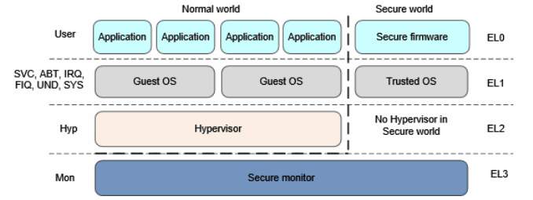

# ARMv8 Architecture Learning

## Chapter 1. ARMv8架构简介

### 1.1 背景

ARM于2011年推出了第8代架构ARMv8,ARMv8架构是迄今为止ARM历史上变革最大的架构.

ARM为低功耗而生,从ARMv7开始,ARM将其架构分为3个系列:

	A系列:针对Application,适用于追求高性能的场景(e.g.移动领域->手机;企业领域->服务器);
	R系列:针对Real-time,适用于车用以及工业控制领域;
	M系列:针对Microcontroller,适用于微控制器领域.

ARMv8架构增加了3个特性:

	支持64-bit、虚拟化支持、安全增强.
	PS:ARMv7增加LAPE(Large Physical Address Extensions),使用48-bit VA,并将虚拟地址映射到40-bit
		物理地址上(最大支持1024G的物理内存).

### 1.2 运行状态

由于基于32-bit的ARMv7架构的Cortex系列大受欢迎,而且已经建立了完善的开发者生态.因此ARMv8架构兼容ARMv7架构中的主要特性.

ARMv8架构将运行状态分为AArch64和AArch32两种状态,具体情形如下:

**1.AArch64状态特点**

	1.64-bit的运行状态,地址存储在64-bit的寄存器中,使用64-bit指令集以及64-bit的寄存器;
	2.31个64-bit的通用寄存器(X0-X30,通过W0-W30来访问低32-bit,X30一般用作程序链接寄存器);
	3.64-bit的程序计数器(PC)、64-bit的堆栈指针SP(每个异常等级一个)、64-bit的异常链接寄存器ELR(每个异常
		等级一个,存储了从中断返回的地址);
	4.32个128-bit的NEON浮点寄存器(V0-V31),支持SIMD的向量运算及标量浮点的运算;
	5.使用AArch64指令集,使用固定长度的指令,指令使用32-bit编码;
	6.定义了4个异常等级EL0-EL3,对应不同的执行权限,EL0最低,EL3最高;
	7.支持64-bit的虚拟地址空间;
	8.定义了一组Process state寄存器PSTATE(NZCV/DAIF/CurrentEL/SPSel等),用于保护PE当前的状态信息,
		AArch64指令集提供专门的指令来访问这些PSTATE;
	9.系统寄存器(System Register)名称后面带一个后缀,表示访问该寄存器的最低EL级别.

**2.AArch32状态信息**

	1.32-bit的运行状态,地址存储在32-bit的寄存器中,使用T32/AArch32指令集以及32-bit的寄存器;
	2.13个32-bit的通用寄存器(R0-R12);
	3.32-bit的程序计数器(PC)、32-bit的堆栈指针SP(每个异常等级一个)、32-bit的程序链接寄存器LR(LR也可用作
		异常链接寄存器ELR);
	4.提供一个ELR,用来保存Hyper模式下异常返回的地址,Hyper模式与虚拟化相关;
	5.32个64-bit的浮点寄存器,支持AdvancedSIMD的向量运算及标量浮点的运算;
	6.使用AArch32指令集(使用固定长度的指令,指令使用32-bit编码)或者T32指令集(使用变长指令,指令编码为
		16-bit或32-bit);
	7.支持ARMv7中基于PE模式(FIQ/IRQ/Abort/Undefined/SVC)的异常模型;
	8.支持32-bit的虚拟地址空间;
	9.定义了一组Process state寄存器PSTATE(NZCV/DAIF/CurrentEL/SPSel等),用于保护PE当前的状态信息,
		AArch32/T32指令集提供专门的指令来访问这些PSTATE.

### 1.3 异常等级

1.新增一套64-bit的指令集,叫A64.

2.向前兼容ARMv7,所以同时支持现存的32-bit指令集,A32(ARM指令集)和T32(Thumb指令集).

3.定义AArch64和AArch32两套运行环境(Execution state),分别执行64-bit和32-bit指令集.软件可以在需要的时候切换.

4.AArch64(64-bit的运行环境),使用新的概念---异常等级(Exception level).

5.在ARMv7 security extension的基础上,新增security model,支持安全相关的应用需求.

6.在ARMv7 virtualization extension的基础上,提供完整的virtualization框架,从硬件上支持虚拟化.

### 1.4 AArch64 Exception level

**ARMv7之前**

ARMv7之前的架构有7种工作模式(也叫处理器模式),包括User、FIQ、IRQ、Abort、Undefined、SVC、System等.不同的模式有不同的硬件访问权限,称作privilege level.

**ARMv7-a**

ARMv7-a保留之前的设计,将privilege leve重新命名为PL0(User模式,也叫non-privilege level)和PL1(其他6种模式,也叫privilege level),还增加了PL2,用于虚拟化扩展(Virtualization Extension).同时增加了两个模式,Monitor和Supervisor.

**ARMv8-a**

ARMv8-a去掉了privilege level的概念,使用EL0-EL3(Exception Level).ELn的n值越大,表示权限越大.

ARMv8 Exception Level:

	说明:
	1.在AArch64中,已经没有User、SVC、ABT等处理器模式的概念.为了向前兼容,在AArch32中,将这些模式map到了
		4个Exception level;
	2.Application位于特权等级最低的EL0;Guest OS(linue kernel、window等)位于EL1;提供虚拟化支持的
		Hypervisor位于EL2(可以不实现);提供Security支持的Security Monitor位于EL3(可以不实现);
	3.只有在异常发生时,才能切换Exception level.切换原则:
		1.发生时,要么停留在当前的EL,要么跳转到更高的EL,EL不能跳级;
		2.异常处理返回时,要么停留在当前的EL,要么跳转到更低的EL.

### 1.5 Security model

ARMv8-a的security模型属于一种物理上的隔离,在不同的security状态下,可以访问的物理内存是不同的.

ARMv8-a架构有两个security state(security和non-security),主要是物理地址的分隔,以及一些system control寄存器的访问控制.

	Security状态下:处理器可以访问所有的Secure physical address space以及
			non-secure physical address space;
	Non-Security状态下:只能访问Non-secure physical address space,且不能
			访问Secure system control resources.

### 1.6 virtualization
	
硬件虚拟化包括指令虚拟化、异常处理虚拟化、MMU虚拟化、IO虚拟化等.
	
***

## Chapter 2. AArch64应用层结构

***

## Chapter 3. AArch64指令集

***

## Chapter 4. AArch64系统层结构

### 4.1 AArch64 MMU翻译过程

#### 4.1.1 AArch64 MMU特点

	1.支持最大64-bit虚拟地址到48-bit物理地址的翻译;
	2.物理地址大小可由软件配置,通过ID_AA64MMFR0_EL1.PARange和TCR_ELx.{I}PS寄存器来配置;
		ID_AA64MMFR0_EL1, AArch64 Memory Model Feature Register0(AArch64内存模型特性寄存器0):
			PARange,bits[3:0]:支持的物理地址范围
				0000: 32-bit, 4GB
				0001: 36-bit, 64GB
				0010: 40-bit, 1TB
				0011: 42-bit, 4TB
				0100: 44-bit, 16TB
				0101: 48-bit, 256TB
				其他: reserved
		TCR_EL1.IPS--->见3.
	3.虚拟地址大小可由软件来配置,通过"TCR_ELx.T0SZ和TCR_ELx.T1SZ"来配置;
		TCR_EL1, Translation Control Register(EL1)(EL1状态太的转换控制寄存器):
			IPS,bits[34:32]:中间物理地址范围
				000: 32-bit, 4GB
				001: 36-bit, 64GB
				010: 40-bit, 1TB
				011: 42-bit, 4TB
				100: 44-bit, 16TB
				101: 48-bit, 256TB
				其他: reserved
			TG1,bits[31:30]:TTBR1_EL1的Granule size(即页表大小)
				01: 16KB
				10: 4KB
				11: 64KB
				其他: reserved
			T1SZ,bits[21:16]:
				配置TTBR1_EL1虚拟地址大小,位数大小为:(64 - T1SZ)-bit.
			T0SZ,bits[5:0]:
				配置TTBR0_EL1虚拟地址大小,位数大小为:(64 - T1SZ)-bit.
	4.AArch64的MMU页表使用长描述符,每个描述符64-bit,和页表项在一起;
	5.AArch32模式下兼容ARMv7描述符,包括A15的长描述符和A9的短描述符;
	6.支持4KB、16KB和64KB三种页表大小,由TCR_ELx.TG0、TCR_ELx.TG1配置;
		TCR_ELx.TG0/1--->见3
	7.MMU翻译过程中可控制安全、虚拟化、Cacheable、Executable等属性,且翻译过程中页表大小端可配置;
	8.EL3/EL2/EL1有不同的页表基地址,其中EL1阶段有TTBR0和TTBR1两个基地址;
	9.虚拟化时最多需要2个stage,其他场景只需要一个stage,每个stage最多4级页表.

#### 4.1.2 AArch64 MMU特点

***

## Chapter 5. AArch32应用层结构

***

## Chapter 6. AArch32指令集

***

## Chapter 7. AArch32系统层结构

***

## Chapter 8. 外部调试

