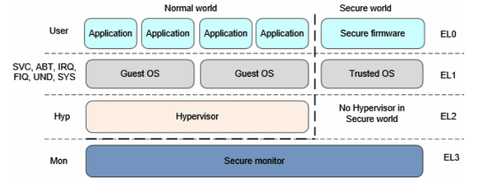

# ARMv8 Architecture

原文来源于[蜗窝科技](http://www.wowotech.net/sort/armv8a_arch)

## Chapter 1. ARMv8-a 架构简介

### 1.1 前言

ARMv8(当前只有A系列,即ARMv8-A)架构,是ARM公司为满足需求而重新设计的一个架构,是近20年来,ARM架构变动最大的一次.

引入了Execution State、Exception Level、Security State等新特性,与旧的ARM架构有很大的差距.

### 1.2 背景

ARMv7划分为A(Application)、R(Real-time)和M(Microcontroller)三个系列.其中A系列针对性能要求较高的应用.

ARM新趋势:大内存(Large Memory)、虚拟化(Virtualization)、安全(Security).

	大内存:Cortex-A15(ARMv7架构)通过Large Physical Address Extension(LPAE)技术,可以支持高达40 bits的
		物理地址空间.但是32-bit指令集其虚拟地址空间仍然是32bits(4G),因此ARM定义了一个64-bit的指令集(即ARM64).

### 1.3 ARMv8-a架构简介

1.新增一套64-bit的指令集,叫A64.

2.向前兼容ARMv7,所以同时支持现存的32-bit指令集,A32(ARM指令集)和T32(Thumb指令集).

3.定义AArch64和AArch32两套运行环境(Execution state),分别执行64-bit和32-bit指令集.软件可以在需要的时候切换.

4.AArch64(64-bit的运行环境),使用新的概念---异常等级(Exception level).

5.在ARMv7 security extension的基础上,新增security model,支持安全相关的应用需求.

6.在ARMv7 virtualization extension的基础上,提供完整的virtualization框架,从硬件上支持虚拟化.

### 1.4 AArch64 Exception level

**ARMv7之前**

ARMv7之前的架构有7种工作模式(也叫处理器模式),包括User、FIQ、IRQ、Abort、Undefined、SVC、System等.不同的模式有不同的硬件访问权限,称作privilege level.

**ARMv7-a**

ARMv7-a保留之前的设计,将privilege leve重新命名为PL0(User模式,也叫non-privilege level)和PL1(其他6种模式,也叫privilege level),还增加了PL2,用于虚拟化扩展(Virtualization Extension).同时增加了两个模式,Monitor和Supervisor.

**ARMv8-a**

ARMv8-a去掉了privilege level的概念,使用EL0-EL3(Exception Level).ELn的n值越大,表示权限越大.

ARMv8 Exception Level:

	说明:
	1.在AArch64中,已经没有User、SVC、ABT等处理器模式的概念.为了向前兼容,在AArch32中,将这些模式map到了
		4个Exception level;
	2.Application位于特权等级最低的EL0;Guest OS(linue kernel、window等)位于EL1;提供虚拟化支持的
		Hypervisor位于EL2(可以不实现);提供Security支持的Security Monitor位于EL3(可以不实现);
	3.只有在异常发生时,才能切换Exception level.切换原则:
		1.发生时,要么停留在当前的EL,要么跳转到更高的EL,EL不能跳级;
		2.异常处理返回时,要么停留在当前的EL,要么跳转到更低的EL.

### 1.5 Security model

ARMv8-a的security模型属于一种物理上的隔离,在不同的security状态下,可以访问的物理内存是不同的.

ARMv8-a架构有两个security state(security和non-security),主要是物理地址的分隔,以及一些system control寄存器的访问控制.

	Security状态下:处理器可以访问所有的Secure physical address space以及
			non-secure physical address space;
	Non-Security状态下:只能访问Non-secure physical address space,且不能
			访问Secure system control resources.

### 1.6 virtualization
	
硬件虚拟化包括指令虚拟化、异常处理虚拟化、MMU虚拟化、IO虚拟化等.
	

