# C Program Introduction

## Chapter 1 Compilation preprocessing(编译预处理)

作用:对源程序编译之前做一些处理,生成扩展C源程序.种类如下:

**1.宏定义---#define/#ifdef/#ifndef/#undef**

宏定义只做字符替换,不分配内存空间.因此也不需要类型定义.

	#define TEST_DEFY	(1)	//定义TEST_DEV这个宏的值为1
	
	#ifdef DEBUG_TEST	//如果定义了DEBUG_TEST这个宏
		...
	#else
		...
	#endif
	/*
		#ifdef xxx与#if defined xxx是一样的效果.
		#if !defined DEBUG //前面的"!"可以用来反转条件.即没有定义DEBUG
			...
		#endif
	*/
	#define MICRO 1	//定义宏
	#undef MICRO	//删除前面定义的MICRO宏.

**2.文件包含---#include**

	#include <stdio.h>	//直接搜索标准目录

	#include "test.h"	//先在当前目录搜索,再搜索标准目录.

**3.条件编译---#if--#else--#endif**

	#if 0		//#if condition(如果condition为true,紧接着的代码会执行,否则执行else的代码).此处0为false.
	...	//注释掉某段代码
	#else
	... //开启的代码
	#endif

	PS:还有#elif condition //类似else if,用的比较少.

**4.其他宏定义---#line,#error,#pragma**

	1.#line:用于重新设定__LINE__和__FILE__的内容.
		#line line-number "filename" //指定当前文件名称为"filename",当前行的下一行为"line-number".
	#include <stdio.h> //当前文件名为"test.c"
	
	#line 200 "defy" //指定下一行为第200行,文件名为"defy"
	main()
	{
		printf("line: %d, file: %s\n", __LINE__, __FILE__);
		printf("line: %d, file: %s\n", __LINE__, __FILE__);
		printf("line: %d, file: %s\n", __LINE__, __FILE__);
	}
	/*
		结果为:
			line: 203, file:defy
			line: 204, file:defy
			line: 205, file:defy
	*/

	2.#error:强制编译程序停止编译,主要用于程序调试.
		#error error-message //error-message不需要引号.为一些自定义的错误内容
	#ifdef xxx
	#error xxxis defined. //如果定义了xxx,程序就会被强制停止编译.
	#endif

	3.#pragma:
	#pragma pack(1) //指定数据在内存中的对齐方式为1字节
	struct sample {
		char a;
		double b;
	};
	#pragma pack() //取消对齐方式的指定
	/*
		此处指定了struct sample结构体在编译器处理时按照1字节对齐方式.此时占9字节空间.
		如果没有这样指定,按默认的对齐方式(默认以size最大的那个对齐),因此默认占用16字节.
	*/

**5.宏参数处理---#和##**

	1.#:将后面的宏参数进行字符串化处理:
		#include <stdio.h>
		#define mkstr(s) #s //将s进行字符串化处理
		int main(void)
		{
			printf(mkstd(I like C)); //经过mkstr后会变为:printf("I like C");
			return 0;
		}
	2.##:将两个宏参数链接起来.
	一般用于只有在运行时才能确定要调用哪个函数,可以利用"##"运算符动态地构造要调用函数的名称.
		/* function to convert string to enumeration id */
		#define STR2ENUM_CONV(_enum, ENUM) \
			static int str2 ## _enum (char *str) { \
				int i = 0;		\
				if (!str) {		\
					printf("%s, %d: wrong parameter!\n", __func__, __LINE__); \
					return -1;	\
				}				\
				while (i < NUM_OF_ ## ENUM) {	\
					if (strcmp(str, _enum ## _str[i]) == 0)	\
						break;	\
					i++;		\
				}				\
				if (i == NUM_OF_ ## ENUM) {	\
					printf("%s, %d: wrong parameter!\n", __func__, __LINE__"); \
					return -1;	\
				}				\
				return i;		\
			}

		#define NUM_OF_TEST 0x04
		#define TEST1		0
		#define TEST2		1
		#define TEST3		2
		#define TEST4		3

		const char *test_str[NUM_OF_TEST] = {"test0", "test1", "test2", "test3"};
		STR2ENUM_CONV(test, TEST);

		/*后续调用方式为:
			int index = 0;
			index = str2test("test1"); //可以得到test1在数组中的索引值(此处为1).
		*/
		
**6.预定义宏**

	__DATE__:进行预处理的日期(由%s打印).
	__FILE__:源文件名(由%s打印).
	__LINE__:当前行号(由%d打印).
	__TIME__:源文件编译时间(由%s打印).
	__func__:当前所在函数名(由%s打印).

***

## Chapter 2 Programming practice in C language(C语言编程实践)

### 2.1 位运算

**位运算符:**

	&:按位与;
	|:按位或;
	^:按位异或;
	~:按位取反;
	<<:左移;
	>>:右移.

**左移:**

操作数各位左移,低位补0,高位溢出.

	5 << 2 = 20(十进制数20)

**右移:**

操作数各位右移,移出的低位丢弃,高位如下处理:

	1.对于无符号数和有符号中的整数,直接补0.
		unsigned int a = 5; //101B
		a = a >> 2; //因为a为无符号数,因此a右移之后的值为2(10B).
	2.有符号中的负数(即最高位为1),分为:
		1)逻辑右移:直接高位补0. --->这种系统比较少
		2)算术右移:移完之后最高位补1. --->一般系统均为算术右移(e.g.linux)
			实例:8位二进制数:11001101:
				逻辑右移1位为:[0]1100110
				算术右移1位为:[1]1100110
			
				逻辑右移2位为:[00]110011
				算术右移1位为:[11]110011

**位运算实例---将一个整数(16-bit)按二进制位输出**

	#include <stdio.h>

	int main()
	{
		short num, mask, i;
		printf("Please input an number: ");
		scanf("%d", num);
		mask = 1 << 15; //每个数字都从最高位第15-bit输出
		printf("%d=", num);
		for (i=1; i<=16; i++) {
			putchar((num & mask) ? '1' : '0'); //最高bit为1,putchar输出字符'1';否则输出字符'0'.
			num = num << 1;
			if (i % 4 == 0)
				putchar(','); //输出一个','字符
		}
		printf("\bB\n"); //\b输出一个退格键,去掉最后的','字符.再输出B.
		return 0;
	}

### 2.2 指针特性

#### 2.2.1 数据指针

**1.指针直接操作内存的情况**

1.某I/O芯片被定位在CPU的存储空间而非I/O空间,而且寄存器对应于某特定地址;

2.两个CPU之间以双端口RAM通信,CPU需要在双端口RAM的特定单元(称为mail box)书写内容以在对方CPU产生中断;

3.读取在ROM或FLASH的特定单元所烧录的汉字和英文字模.

**2.指针实例**

	unsigned char *p = (unsigned char *)0xF000FF00; //直接给一个指针赋值一个地址.
	*p = 11; //指针内容赋值

指针自增/自减操作的结果取决于指针指向的数据类型:

	int *p = (int *)0xF000FF00;
	p++(或++p) -> p = p + sizeof(int); //相当于+4
	p--(或--p) -> p = p - sizeof(int); //相当于-4

**3.指针的指针作用(申请内存空间)**

1.错误实例---申请不到内存

	void GetMemory(char *p, int num)
	{
		p = (char *)malloc(sizeof(char) * num);
	}

	void main()
	{
		char *str = NULL;
		GetMemory(str, 100);
		strcpy(str, "hello");
	}
	/*
		实参调用形参时,都是实参的一份拷贝.此处传指针(地址),也是传的地址的一份拷贝,而在GetMemory中malloc
		的内存,改变的是形参以及拷贝的指针的值.但是源指针(即实参指针)并没有被改变.因此此时实参指针仍为NULL.
	*/

2.修改---传指针的指针

	void GetMemory(char **p, int num)
	{
		*p = (char *)malloc(sizeof(char) * num);
	}

	void main()
	{
		char *str = NULL;
		GetMemory(&str, 100);
		strcpy(str, "hello");
		free(str);
	}

3.函数形参传变量,指针,指针的指针比较

	1.传变量:调用形参时,为实参的一份变量的拷贝.如果在函数内修改形参变量并不能体现在源实参变量上;
	2.传指针:调用形参时,为实参的一份指针(地址)的拷贝.如果在函数内修改形参指向的内容可以体现在实参上,
		因为形参(实参的一份拷贝)和实参指向的是同一个地址.但是实参的地址是改不动的(因为是一份拷贝);
	3.传指针的指针:调用形参时,为实参的指针的指针的拷贝.此时可以修改指针的指针里面的内容(即指针).但是
		指针的指针是该不动的(因为是一份拷贝).

#### 2.2.2 函数指针

1.C中的函数名直接对应于函数生成的指令代码在内存中的首地址,因此函数名可以直接赋值给指向函数的指针.

2.调用函数实质为"跳转指令+参数传递处理+返回地址入栈".最核心的操作是将函数生成的目标代码的首地址赋给CPU的PC寄存器.

3.因为函数调用的本质是跳转到某一个地址单元的code去执行,因此可以调用一个"根本不存在的函数实体".

**1.定义一个函数指针---用的较少**

	int (*pAdd)(int, int); //定义一个函数指针pAdd
	int add(int x, int y)
	{
		.../*一个函数*/
	}

	pAdd = add; //函数指针的使用.

**2.定义一个函数指针类型---常用**

	typedef int (*test_func)(int a, int b); //定一个函数指针类型
	
	int add(int x, int y)
	{
		...
	}

	int sum(int x, int y)
	{
		...
	}

	test_func func_add = NULL; //由函数指针类型定义一个函数指针func_add
	func_add = add; //给函数指针赋值
	func_sum = sum; //给函数指针赋值

### 2.3 C语言关键词

#### 2.3.1 const

const主要用于标识只读,防止代码被无意的修改.

const int a:

	const int a; //表示变量a的内容不能被修改,只读属性.

	const int a; //声明时没有被赋值,此时a被自动初始化为0.
	a = 2; //编译时会报错"assignment of read-only variable a"

int const a--->和const int a是一样的功能

const int *a:

	const int *a; //表示a指向的对象为一个常量,不能通过"*a"来修改,但是可以给指针a重新赋值,使其指向不同的对象.
	
	int b = 2;
	const int *a;
	a = &b; //正确的,通过给a赋值,指向b这个对象.
	*a = 3; //编译时会报错"assignment of read-only location '*a'".内容不能被修改.

int * const a:

	int * const a; //表示a地址为一个常量,不能被重新赋值.但是可以修改a的内容.

	int * const a; //如果没有被初始化,系统会自动分配地址(为非空)
	*a = 2; //可以修改该地址指向的内容.

	int b = 2;
	a = &b; //编译时会报错"assignment of read-only variable 'b'"

int const * const a:

	int const * const a; //表示a地址为一个常量(不能更改a指向的地址),
						 //且a指向的值也为一个常量(不能通过*a来修改).

	int b = 2;
	int const * const a = &b; //如果没有被初始化,其值为0.此处为2.

#### 2.3.2 static作用

1.函数体内:声明为static(静态)的变量在该函数被调用过程中维持其值不变;放在静态存储区,因此一直存在,但作用域仍为局部作用域.

2.在模块内(e.g.文件内)但在函数体外:声明为静态的变量可以被模块内所有函数访问,但是不能被模块内其他函数访问;

3.在模块内:一个被声明为静态的函数只能被该模块内的其他函数调用.

### 2.4 编程要点

#### 2.4.1 C程序的存储空间布局

**1.C程序由以下几部分组成:**

1)正文段---也叫代码段(code segment/text segment):存放代码的地方.通常是可共享的,所以即使频繁执行的程序(e.g.文本编辑器、C编译器和Shell等)也只需一份副本,而且通常设置为只读.保存在磁盘上.

2)初始化数据段---通常称为数据段:包含程序中需要明确赋初值的变量且非0(e.g. int maxcount = 99;).存放程序中已初始化的全局变量(初始化为非0).保存在磁盘上.

3)未初始化数据段(bss段)---也称为常量区或全局区:该段数据不指定初值也可(或者初始化为0).在执行程序之前,内核会将该段中的数据初始化为"0"或"NULL".该段存放未初始化的全局变量,因为不需要指定初值,因此不会保存在磁盘上.

4)栈(stack):存放临时变量,函数地址或环境上下文信息等.Stack空间由操作系统自动分配/释放.Stack空间有限.

5)堆(heap):动态存储分配.位于未初始化数据段(bss)和栈(stack)之间.Heap空间由程序员手动分配/释放.Heap是有很大的自由存储区.

**2.C程序存储空间的排布**

			高地址______________
				
				命令行参数和环境变量
				______________
					栈			
				..............
					栈往下增长		
			
					堆往上增长
				..............
					堆
				______________
			
				未初始化数据段	由exec初始化为0---不会保存在磁盘上
					(bss)
				______________
				初始化数据段			由exec从
				______________
				正文					程序中读入
		   低地址______________

#### 2.4.2 数组指针和指针数组

**数组指针**

数组指针为一个指针,指向一个数组.

	int (*p)[n]; //声明一个数组指针p,指针p指向一个一维数组,长度为n.p+1是跨过n个整型数据的长度.

举例:

	char a[MAX]; //一个数组
	char (*pb)[MAX] = &a; //数组指针pb被赋值为&a.类似二维数组.

例子:

	#include <stdio.h>
	void main()
	{
		char a[5] = {'a', 'b', 'c', 'd', '\0'};
		char *p = a;
		char (*point_to_str)[5]; //声明一个数组指针
		point_to_str = &a; //给数组指针赋值
		printf("0x%x\n0x%x\n", &p, &point_to_str); //打印出两个指针的地址.
			/*因为栈是从上往下涨(高地址往低地址涨),因此两个指针的地址为:
				0x1245044
				0x1245040
			*/
		printf("%s\n%s\n", p, point_to_str);
			/*
				结果为:
					abcd
					abcd
			*/
	}

**指针数组**

	int *p[n]; //指针数组.p内部有n个指针类型的数组元素.执行p+1时,指向下一个数组元素.

***

## Chapter 3 Summary of data structure and algorithm(数据结构与算法概述)

### 3.1 数据结构

#### 3.1.1 基本概念和术语

**1.数据(Data)**

数据(Data):是对信息的一种符号表示.是指所有能输入到计算机中并被计算机程序处理的符号的总称.(e.g.文本,表格,图像等)

	举例:一个图书管理程序所要处理的数据可能是一张表格(表格中包含所有的图书信息).

**2.数据元素(Data Element)**

数据元素(Data Element):是数据的基本单位.在计算机程序中通常作为一个整体来进行考虑和处理.

	数据元素通常由若干个数据项组成.

**3.数据项**

数据项是数据不可分割的最小单位.

	多个数据项构成数据元素;多个数据元素构成数据.

#### 3.1.2 数据结构

数据结构是研究数据元素(Data Element)之间抽象化的相互关系(逻辑结构)和这种关系在计算机中的存储表示(物理结构,也叫存储结构),并对这种结构定义相适应的运算,设计相应的算法.

**1.逻辑结构**

数据之间的相互关系成为逻辑结构.通常有以下4种基本结构:

	1.集合:数据元素除了属于同一种类型外,无其他关系.
		e.g. int a; int b; //a,b都属于int型,但是a,b之间无关系.
	2.线性结构:数据元素之间存在一对一的关系.除了第一个和最后一个数据元素之外,
	其他每个数据元素只有一个前驱元素和后继元素.
		e.g.int a[5]; //类似数组这种形式.
	3.树形结构:数据元素之间存在一对多的关系.除第一个外,每个元素只存在一个前驱
	元素,但可能存在多个后继元素.
		e.g. linux的目录结构:
					root(存在多个后继)
			bin		lib		user	etc...(只有一个前驱root)
	4.图状结构或网状结构:数据元素之间存在多对多的关系.每个元素都可能存在多个
	前驱元素或多个后继元素.
		e.g.
			1.学习计算机导论(C1)--->之后才可以学习数据结构,汇编语言,C程序设计
			2.学习数据结构(C2)--->之后才可以学习计算机图形学,数据库原理,操作系统
			3.学习汇编语言(C3)--->之后才可以学习计算机图形学,接口技术
			4.学习C程序设计(C4)--->之后才可以学习计算机图形学,编译原理
			5.学习计算机图形学(C5)
			6.学习接口技术(C6)
			7.学习数据库原理(C7)
			8.学习编译原理(C8)
			9.学些操作系统(C9)--->之后才可以学习数据库原理.

逻辑结构示意图:

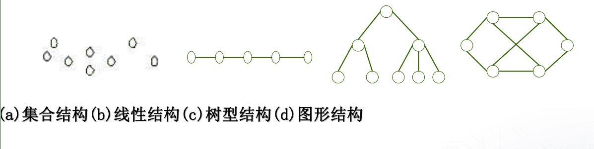

**2.存储结构**

数据结构在计算机中的存储表示称为数据的存储结构.通常有以下4种存储结构:

1.顺序存储结构

把逻辑上相邻的结点存储在物理上相邻的存储单元里(通常是一片内存).结点之间的逻辑关系由存储单元位置的邻接关系来体现.

	优点:存储空间占用较少;
	缺点:只能使用一整片存储单元,可能产生较多的碎片现象.
	顺序存储结构通常使用数组来描述.主要应用于线性的数据结构.

2.链式存储结构

结点所占存储单元分为两部分,一部分存放结点本身的信息,另一部分存放结点的后继结点地址(即指针).结点间的逻辑关系由附加的指针字段表示.

	优点:不会产生碎片现象,能充分利用所有的存储单元;
	缺点:每个结点占用较多的存储空间.
	链式存储结构通常使用指针类型来描述.

3.索引存储方式

利用结点的索引号来确定结点的存储地址.

	优点:检索速度快;
	缺点:增加了附加的索引表,占用较多的存储空间.同时在增加和删除元素时需要更新索引表花费时间.
	索引存储在存储结点信息的同时,需要建立附加的索引表.

4.散列存储方式

根据结点的关键字值计算出该结点的存储地址.通过散列函数把结点间的逻辑关系对应到不同的物理地址空间.

	优点:检索,增加和删除结点的操作很快;
	缺点:当采用不好的散列函数时可能出现结点存储单元的冲突,为解决冲突需要附加时间和空间的开销.

### 3.2 算法描述

**1.算法(algorithm)概述**

解决特定问题的方法.是对问题求解过程的一种描述.

**2.算法的特点**

算法是执行特定计算的有穷过程,具有以下特点:

	1.动态有穷;
	2.确定性;
	3.输入:具有0个或多个由外界提供的输入;
	4.输出:产生1个或多个结果;
	5.可行性.

算法的描述通常使用	伪代码来描述.

**3.算法设计的要求**

	1.正确性(correctness):算法的执行结果应当满足预先规定的功能和性能要求;
	2.可读性(readability):算法应当思路清晰、层次分明、简单明了、易读易懂.
	3.健壮性(robustness):算法应具有容错处理.当输入非法数据时,算法应对其作出处理,
		不至引起严重后果.
	4.高效性和存储量需求:算法应具有执行时间短(效率高),同时所占的存储空间尽量小.

### 3.3 算法效率的度量

**1.时间复杂度(Time complexity)**

时间复杂度是指算法运行从开始到结束所需要的时间.

**2.空间复杂度(Space complexity)**

空间复杂度是指算法执行过程中所需的最大存储空间.

***

## Chapter 4 Linked List(链表)

### 4.1 单链表

链表特点:

	1.动态进行存储分配的一种结构;
	2.在内存中不连续存放;
	3.头节点指向链表中的第一个元素.节点是一个结构体,包含两部分(实际数据和下一个节点的地址)
		struct Student {
			char cName[20];
			int iNumber;
			struct Student *pNext; //下一个节点地址
		};

**单链表操作实例1**

	#include <stdio.h>
	#include <string.h>
	#include <stdlib.h>

	struct Student {
		char cName[20];
		int iNumber;
		struct Student *pNext;
	};

	int iCount; //表示链表长度

	/* 创建一个链表,返回链表头指针 */
	struct Student *Create_List()
	{
		struct Student *pHead = NULL; //头节点
		struct Student *pEnd, *pNew; //尾节点和新节点

		iCount = 0; //初始化链表长度

		pEnd = pNew = (struct Student *)malloc(sizeof(struct Student));
		memset(pNew, 0, sizeof(struct Student));

		/* 提示输入姓名和学号 */
		printf("Please input the name, then the number\n");
		scanf("%s", &pNew->cName); //scanf("格式", &变量);--->一定需要地址
		scanf("%d", &pNew->iNumber);

		/* 学号不为0,就添加到链表中 */
		while (pNew->iNumber != 0) {
			iCount++; //统计+1
			if (iCount == 1) {
				pHead = pNew; //头节点指向第一个节点
				pNew->pNext = NULL;
				pEnd = pNew; //尾节点往后移动
			} else {
				pEnd->pNext = pNew;
				pNew->pNext = NULL;
				pEnd = pNew; //尾节点往后移动
			}
			/* 继续分配空间并接受新的输入 */
			pNew = (struct Student *)malloc(sizeof(struct Student));
			printf("Please input the name, then the number\n");
			scanf("%s", &pNew->cName);
			scanf("%d", &pNew->iNumber);
		}

		free(pNew); //因为当学号为0时也申请了内存,此时不会添加到链表.因此需要free掉
		return pHead; //返回头节点
	}

	/* 输出链表 */
	void Print(struct Student *pHead)
	{
		struct Student *pTemp; //临时节点
		int iIndex = 0; //链表索引

		printf("the list has %d element\n", iCount);
		printf("|iIndex|	name	|iNumber|\n");
		pTemp = pHead;
		while (pTemp != NULL) {
			iIndex++;
			printf("%6d", iIndex);
			printf("%10s", pTemp->cName);
			printf("%7d\n", pTemp->iNumber);
			pTemp = pTemp->pNext;
		}
		printf("==========================================\n");
	}

	/* 往头节点插入元素,返回头指针 */
	struct Student *Insert(struct Student *pHead)
	{
		struct Student *pNew;
		pNew = (struct Student *)malloc(sizeof(struct Student));
		memset(pNew, 0, sizeof(struct Student));
		printf("Please input the name, then the number\n");
		scanf("%s", &pNew->cName);
		scanf("%d", &pNew->iNumber);
		pNew->pNext = pHead;
		pHead = pNew;
		iCount++;
		return pHead;
	}

	/* 删除第iIndex个元素 */
	void Delete(struct Student *pHead, int iIndex)
	{
		struct Student *pPre, *pTemp;
		int i;

		pPre = pTemp = pHead;
		for (i=0; i<iIndex; i++) {
			pPre = pTemp;
			pTemp = pTemp->pNext; //往后挪
		}
		pPre->pNext = pTemp->pNext; //删除某节点
		free(pTemp); //释放删除结点的内存
		iCount--;
	}

	/* 写入文件 */
	void Save(struct Student *pHead)
	{
		FILE *fp;
		struct Student *pTemp;
		fp = fopen("data.txt", "a+");
		if (!fp) {
			printf("open file fail\n");
			return;
		}
		pTemp = pHead;
		while (pTemp != NULL) {
			fprintf(fp, "%15s", pTemp->cName);
			fprintf(fp, "%10d", pTemp->iNumber);
			fputs("\n", fp);
			pTemp = pTemp->pNext;
		}
		fclose(fp);
	}

	int main()
	{
		struct Student *pHead;
		pHead = Create_List();
		pHead = Insert(pHead);
		Delete(pHead, 2); //删除第二个元素
		Save(pHead);
		Print(pHead);
		return 0;
	}

**单链表操作实例2**

实现链表的转置:

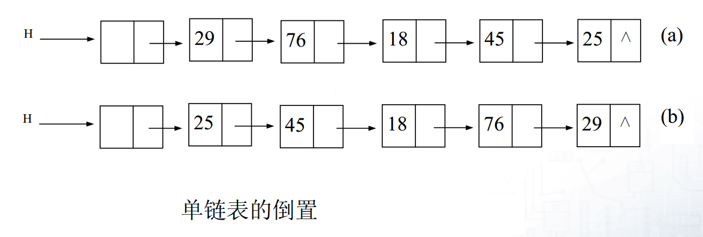

	void reverse(struct linkList *pHead)
	{
		struct linkList *p, *q;
		p = pHead->next; //头节点不包含节点数据.因此p指向第一个节点
		pHead->next = NULL; //清空原链表
		while (p) {
			q = p; //保存原节点信息
			p = p->next;
			q->next = pHead->next; //插入到头节点的后面
			pHead->next = q; //挪动头节点
		}
	}

**单链表操作实例3**

删除链表中的重复节点

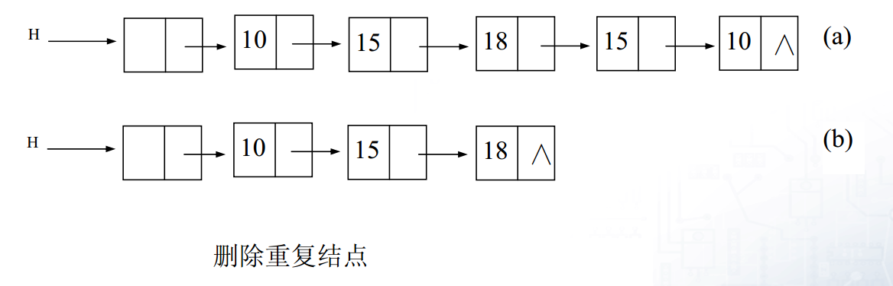

	void delte_repeat_node(struct linkList *pHead)
	{
		struct linkList *p, *q, *r;
		p = pHead->next; //头节点不包含节点数据.因此p指向第一个节点
		if (p==NULL)
			return;
		while (p->next) {
			q = p;
			while (q->next) {
				if (q->next->data == p->data) {
					//出现重复
					r = q->next; //保存要删除的节点信息
					q->next = r->next;
					free(r); //释放删除的节点的内存
				} else {
					q = q->next;
				}
			}
			p = p->next;
		}
	}

### 4.2 循环链表

**单循环链表**

特点:

	1.循环链表可以从任意结点开始遍历整个链表.
	2.一般不用头指针而用一个指向尾节点的指针R来标识.

带头节点的单循环链表:

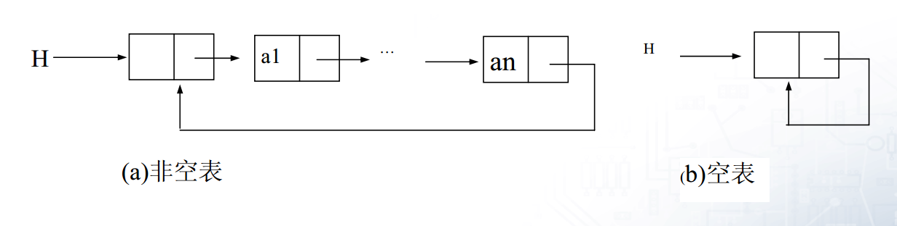

两个单循环链表的链接操作示意图:

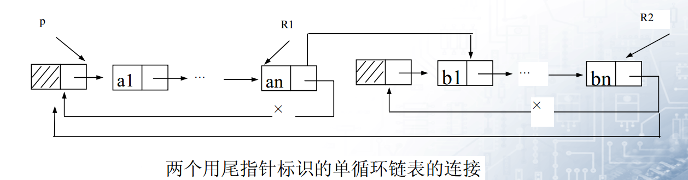

	p = R1->next; //保存R1的头节点指针
	R1->next = R2->next->next; //链接R1的尾和R2的头的下一个节点
	free(R2->next); //释放R2的头节点
	R2->next = p; //R2的尾链接R1的头

### 4.3 双向链表

特点:

	1.数据域
	2.一个指向前驱的指针
	3.一个指向后继的指针

定义:

	struct dnode {
		datatype data;
		struct dnode *pre, *next;
	}

***

## Chapter 5 Tree and binary tree(树和二叉树)

### 5.1 树的逻辑结构和存储结构

#### 5.1.1 树的定义

**1.树的定义**

树(Tree)是n(n>=0)个结点的有限集,为空时称为空树.满足以下两个条件:

	1.有且仅有一个没有前驱的根结点(Root);
	2.除根结点外,其他结点构成一些互不相交的子树(SubTree).每棵子树的根结点有且仅有一个
	直接前驱,但可以有0个或多个后继.
	PS:树的定义时递归的.

树的逻辑结构表示数据之间的关系为一对多的关系.

**2.树的基本术语**

1.树的结点:包含一个数据元素和指向子树或双亲的指针信息;

2.结点的度:一个结点拥有的子树个数.没有子树(度为0)的结点称为叶子;

3.树的度:树中所有结点的度的最大值.即为树中含有的最大分支数.

4.结点的层次和树的深度:结点位于的层次称为结点的层次(e.g.根为第一层...).树的结点中的最大层次称为树的深度/高度.

5.森林:m(m>=0)棵互不相交的树的集合.

6.孩子、双亲:结点的子树称为这个结点的孩子,而这个结点称为孩子的双亲.

7.子孙:以某结点为根的其他所有结点称为是该结点的子孙.

8.祖先:从根结点到某结点路径上的所有结点.

9.兄弟:同一个双亲的孩子之间互为兄弟.

10:堂兄弟:双亲在同一层且双亲不同的结点互为堂兄弟.

#### 5.1.2 树的存储结构

1.双亲存储表示法

采用顺序存储结构,用一组地址连续的存储单元(e.g.数组)来存放树的结点.

	结点包括两个域:
		1.data域:存放结点信息;
		2.parent域:存放该结点双亲结点的位置.
	特点:求双亲容易,但求结点的孩子需要遍历整棵树.

双亲存储示意图

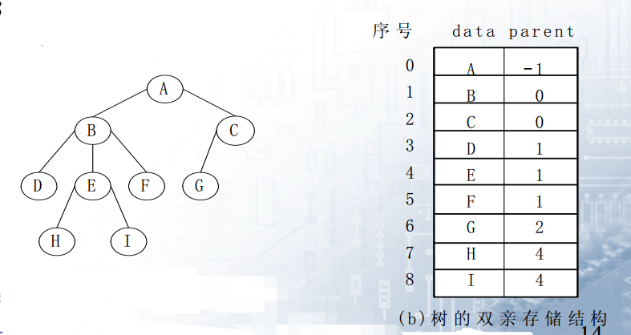

2.孩子链表表示法

每个结点的孩子用单链表存储,称为孩子链表.

	特点:
		1.n个结点有你个孩子链表(叶结点的孩子链表为空表)
		2.n个孩子链表的头指针用一个向量表示
		PS:求孩子容易,求双亲难.

孩子链表存储示意图

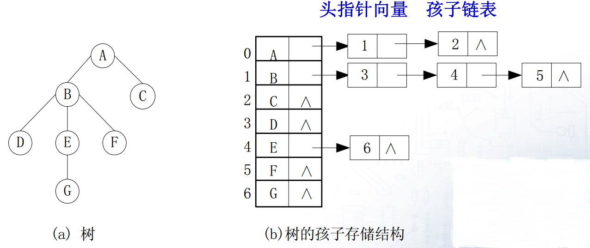

3.孩子兄弟链表表示法

由两个指针链表构成,左链域指向结点的第一个孩子(一般为最左边的那个),右链域指向兄弟结点.也称为"二叉链表".

	特点:双亲只管长子,长子连接兄弟.

孩子兄弟存储示意图

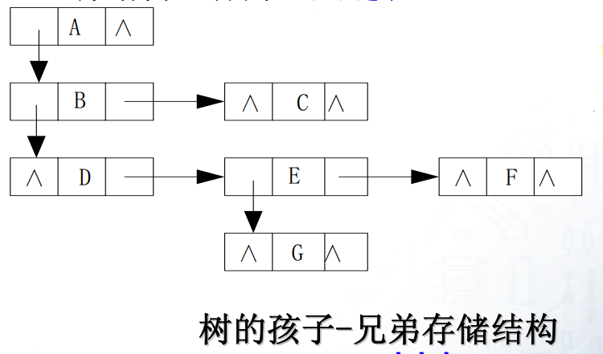

#### 5.1.3 树的遍历

**1.前序遍历**

	1.根结点R;
	2.从左到右的顺序依次(递归)前序遍历根结点R的各子树.

**2.后序遍历**

	1.从左到右的顺序依次(递归)后序遍历根T的各子树T1, T2, ...;
	2.根结点R.

**3.广度优点(按层)遍历**

	按层次从左到右的顺序进行遍历(e.g.前图中的广度优先遍历:ABCDEFG).

### 5.2 二叉树

#### 5.2.1 二叉树的定义

**1.二叉树的定义**

	1.有且仅有一个跟结点;
	2.其余结点分成两棵互不相交的左子树和右子树.

**2.二叉树与树的区别**

	1.树至少有一个结点,二叉树可以为空;
	2.树的子树没有顺序,但二叉树的根结点如果只有一棵子树,必须区分为左子树还是右子树.

二叉树的基本形态

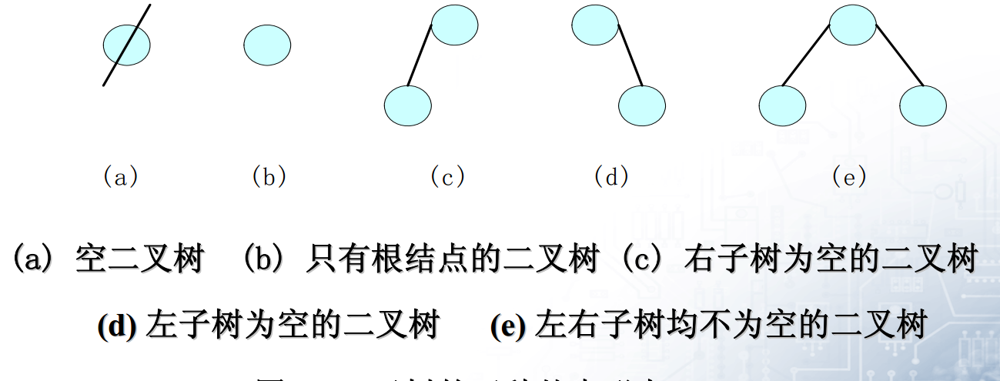

**3.满二叉树和完全二叉树**

1.满二叉树(Full Binary Tree)

深度为k,其结点数为2^k - 1个结点的二叉树称为满二叉树.

特点:

	1.每层结点树都达到最大;
	2.度为1的结点没有(即n1=0),叶结点都在最下一层.
	PS:编号是逐层从左到右编号.

2.完全二叉树(Complete Binary Tree)

结点可能比满二叉树少(或者相同),但是结点编号与相同深度的满二叉树前面的是一样的,不存在结点编号的跳跃.

特点:

	1.叶结点只可能出现在层次最大或次最大的两层上;
	2.完全二叉树的结点数n满足:(2^(k-1) - 1) < n <= (2 ^ k -1)
	3.满二叉树一定是完全二叉树,反之不成立.

#### 5.2.2 二叉树的性质

1.二叉树的第i层上最大有2^(i-1)个结点.

2.深度为k的二叉树最大有2^k - 1个结点.

3.叶子结点数n0与度为2的结点数n2的关系为:n0 = n2 + 1.

#### 5.2.3 二叉树的存储结构

1.顺序存储结构

用一组连续的存储单元(e.g.数组),以层次顺序存放二叉树的数据元素.

完全二叉树存储示意图

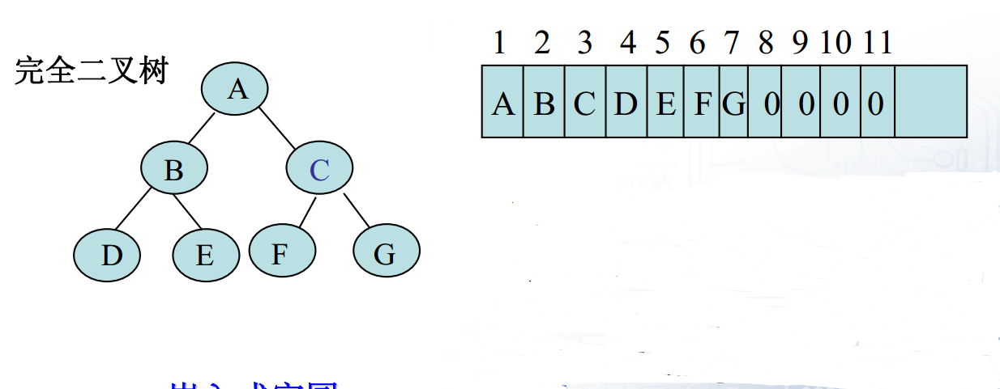

一般二叉树存储示意图

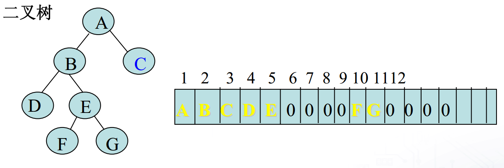

特点:

	1.适合于完全二叉树/满二叉树;
	2.对于一般二叉树会造成空间的大量浪费.

2.链式存储结构(二叉链表)

结点包括三个域:1)结点本身信息;2)左右指针域(存放左、右孩子的地址).

二叉链表示意图:

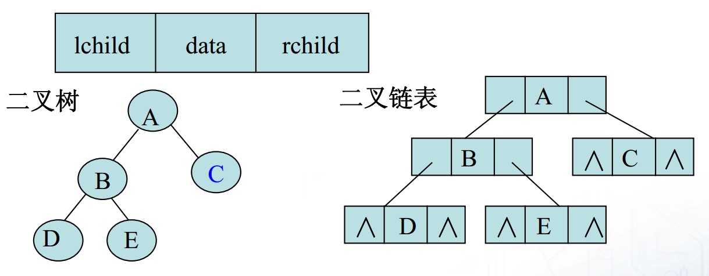

特点:

	具有n个结点的二叉链表共有2n个指针域.其中只有n-1个用来指示结点的左、右孩子,
	其余n+1个指针域为空.

3.带双亲指针的二叉链表

在二叉链表的基础上增加了一个指向双亲的指针parent.称为三叉链表.

三叉链表示意图:

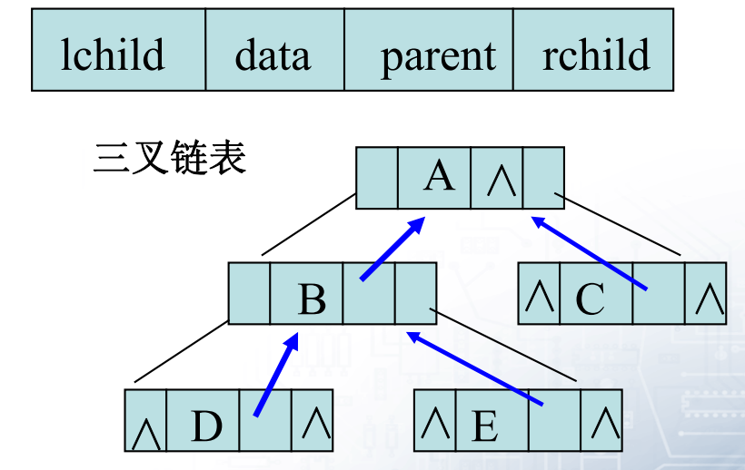

### 5.3 遍历二叉树

1.先序遍历二叉树

	1.访问根结点;
	2.先序遍历左子树;
	3.先序遍历右子树.

2.中序遍历二叉树

	1.中序遍历左子树;
	2.访问根结点;
	3.中序遍历右子树.

3.后序遍历二叉树

	1.后序遍历左子树;
	2.后序遍历右子树;
	3.访问根结点.

实例---遍历二叉树

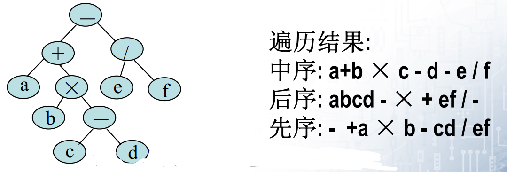

树的代码:

