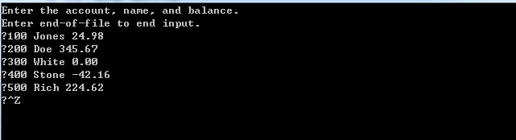
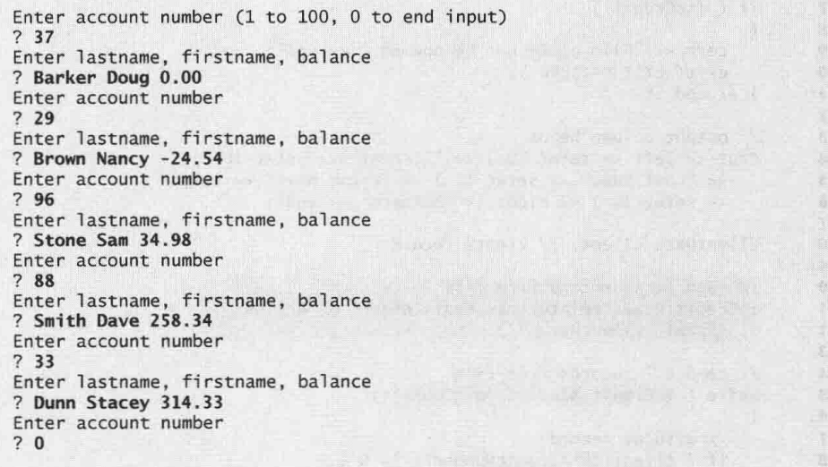
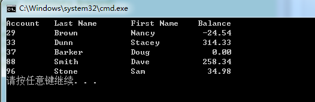

# C++ How to Program(C++大学教程)

## Chapter 1.计算机、Internet和万维网简介

### 1.1 C++标准库

C++程序由一系列类和函数的构件组成.

学习C++主要学习两方面知识:

	1.C++语言本身;
	2.C++标准库所提供的各种类和函数.

PS:多线程不是标准C++的一部分,需要通过扩展库(e.g.Boost)才可以使用.

### 1.2 典型的C++开发环境

C++程序包括6个阶段:

	1.编辑(edit):编写源代码;
	2.预处理(preprocess):处理"#include,#define,#error,#pragma"等代码;
	3.编译(compile):编译器创建目标代码;
	4.连接(link):连接目标代码和一些库函数或数据等信息,生成可执行文件;
	5.载入(load):载入器将可执行程序载入内存;
	6.执行(execute):CPU读取每条指令并执行.

### 1.3 软件技术

重构(refactoring):是指在保持程序原来功能的基础上,重构代码使代码更加清晰,更加容易维护.

设计模式(design patterns):指能够构造灵活的、可维护的面向对象软件的开发体系.

### 1.4 开源Boost库、TR1和C++0x的概念

Boost C++库:是C++社区成员创建的一个免费开源库.

TR1:是技术报告1.包括一些对C++标准库的修改意见.

C++0x:C++在2003指定的标准.

UML(Unified Modeling Language)统一建模语言:是一种让设计面向对象软件系统的人可以用计算机行业标准符号类表示系统的图形语言.

***

## Chapter 2.C++编程入门

### 2.1 第一个C++程序:打印一行文本

	#include <iostream>	//输入/输出流头文件(e.g.cout, cin, cerr等)--->C++标准头文件.

	int main()
	{
		std::cout << "Welcome to C++!\n";
		/*
		1.std:名字空间std.	std::cout:表示使用名字空间中的cout.
			多数用法为在包含头文件下面使用下面语句:
			using namespace std;就可以直接使用cout/cin/cerr/endl等.
		2.<<:流插入运算符.表示数据流动的方向.此处为字符串往cout(屏幕等)流动,即输出到屏幕.
		*/
		return 0;	//该句也可以省略.
	}

一些常用的转义字符:

	\n:换行;
	\t:水平制表符;
	\r:回车符,光标移动到当前行的开始处,并不转到下一行;
	\a:响铃赋给,系统发出响铃声.

### 2.2 另一个C++程序:两数相加

	#include <iostream>

	int main()
	{
		int number1, number2;
		std::cout << "Enter two integers: ";
		std::cin >> number1 >> number2;
		/*
		std::cin:cin为std中的输入流对象;
		>>:流提取运算符.将从标准输入(使用空格分开)的两个数据分别赋给number1和number2.
		*/
		std::cout << "Sum is" << number1 + number2 << std::endl;
		/*
			std::endl:流运算符,输出一个换行符(end line),并且刷新缓冲区.
			std::endl可以强制显示缓存输出到屏幕.
		*/
	}

### 2.3 std::cout/cin/endl等的使用

**1.方法1:每个需要使用的地方都用std::xxx来写--->比较麻烦.**

	#include <iostream>

	int main()
	{
		std::cin >> ...	;
		std::cout << ... << std::endl;
	}

**2.方法2:在程序开头部分用类似using std::cout/cin/endl;后面可以直接用cout/cin/endl--->稍微简单一点.**

	#include <iostream>

	using std::cout;
	using std::cin;
	using std::endl

	int main()
	{
		cin >> ...;
		cout << ... << endl;	//在之后可以直接使用cin/cout/endl等.
	}

**3.方法3:在程序开头部分用using namespace std(包含std中所有名字);后面可以直接用cout/cin/endl--->最简单.**

	#include <iostream>
	using namespace std;

	int main()
	{
		cin >> ...;
		cout << ... << endl;	//在之后可以直接使用cin/cout/endl等.
	}

***

## Chapter 3.类和对象介绍

### 3.1 定义具有成员函数的类

#### 3.1.1 类定义

	#include <iostream>
	using namespace std;

	class GradeBook		//类名:大写字母开头,随后每个单词首字母也大写.
	{
	public:	//成员访问说明符,其后有一个":"
		void displayMessage()	//函数名:以小写字母开头,随后每个单词首字母大写.
		{
			cout << "Welcome to the Grade Book!" << endl;
		}
	};	//类的定义是以分号";"结束

	int main()
	{
		GradeBook myGradeBook;	//类实例化对象
		myGradeBook.displayMessage();	//对象通过点运算符"."来调用类的成员函数
	}

#### 3.1.2 GradeBook类的UML类图

				GradeBook				//最上层类名
										//中部为类的属性(即成员变量),此处类中无
			+displayMessag()			//最下层为类的成员函数.前面的"+"表示public说明符.

### 3.2 定义具有形参的成员函数

#### 3.2.1 具有形参的成员函数

	#include <iostream>
	#include <string>	//包含C++标准的string类
	using namespace std;

	class GradeBook
	{
	public:
		void displayMessage(string courseName)
		{
			cout << "Welcome to the grade book for\n" << courseName << "!"
				<< endl;
		}
	};

	int main()
	{
		string nameOfCourse;
		/*
			string类型是一种类,string名字与cout一样属于名字空间std.因为使用了:
			using namespace std;因此可以不用写成std::string.
			string变量的初始值(即没有赋值时)是空串(即""),显示时屏幕不显示任何东西.
		*/
		GradeBook myGradeBook;
		cout << "Please enter the course name:" << endl;
		getline(cin, nameOfCourse);
		/*
			cin>>:读取字符,直到遇到第一个空白字符(空格/tab或回车等)为止.
			getline(cin, variable_name):从标准输入(即cin)读取连续字符(包括空格),
				直到遇到换行符为止.将读取的字符放到variable_name中,并丢弃换行符.
			PS:
				1.程序输入过程中,按下的回车键也会输入到输入流中(cin中);
				2.调用getline函数必须#include <string>;
				3.getline也属于名字空间std.
		*/
		cout << endl;
		
		myGradeBook.displayMessage(nameofCourse);
	}

#### 3.2.2 具有形参的成员函数的UML类图

				GradeBook				//最上层类名
										//中部为类的属性(即成员变量),此处类中无
			+displayMessag(courseName : String)
			/*
				1.最下层为类的成员函数.前面的"+"表示public说明符.
				2.形参表示方式:(形参名 : 参数类型).
				3.在UML中,string用String表示.
			*/

### 3.3 含有数据成员、构造函数的类

#### 3.3.1 含有数据成员、构造函数的类

	#include <iostream>
	#include <string>
	using namespace std;

	class GradeBook
	{
	public:
		/*构造函数:
			1.无返回值,函数名与类名相同.可以有参数;
			2.通常声明为public,最好写上.没有系统会有自动的默认构造函数;
			3.构造函数主要用于对数据成员进行初始化.
		*/
		GradeBook(string name)
		{
			setCourseName(name);	//调用setxxx函数比较好
		}
		
		void setCourseName(string name)
		{
			courseName = name;
		}

		string getCourseName()
		{
			return courseName;
		}

		void displayMessage()
		{
			cout << "Welcome to the grade book for\n" << getCourseName()
				<< "!" << endl;
		}
	private:
		string courseName;	//数据成员(或者成员变量).通常为private.
	};

	int main()
	{
		GradeBook gradeBook1("CS101 Introduction for C++ Programming");
		GradeBook gradeBook2("CS102 Data Structure in C++");
		
		cout << "gradeBook1 created for course: " << gradeBook1.displayMessage()
			<< "\ngradeBook2 created for course: " << gradeBook2.displayMessage()
			<< endl;
	}

#### 3.3.2 含有数据成员、构造函数的类的UML类图

				GradeBook				//最上层类名
			-------------------------------------
			-couseName : String			
			/*
				1.中部为类的属性(即数据成员/成员变量),前面的"-"表示private说明符.
				2.表示方法:(成员变量名 : 变量类型).
				3.在UML中,string用String表示.
			*/
			-------------------------------------
			<<constructor>>+GradeBook(name : String)
			/*
			<<constructor>>:表示构造函数
			*/
			+setCourseName(name : String)
			+getCourseName() : String
			/*
				+getCourseName : String:后面的String表示返回值为string类型
				在UML中,string用String表示.
			*/
			+displayMessag()
			/*
				1.最下层为类的成员函数.前面的"+"表示public说明符.
				2.形参表示方式:(形参名 : 参数类型).
			*/

### 3.4 接口与实现分离

C++对象通常只包含数据(数据成员/成员变量).编译器仅创建类的成员函数的一份副本,类的所有对象共享同一份副本的成员函数.因此,对象的大小依赖于数据成员所需内存大小.

#### 3.4.1 使用函数原型定义类的接口--->GradeBook.h文件

函数原型是函数的声明,告诉编译器函数的名字、返回类型和形参类型.

	//GradeBook.h
	#include <iostream>
	#include <string>
	using namespace std;

	class GradeBook
	{
	public:
		GradeBook(string name);	//函数原型.可以没有形参名(可选).e.g.GradeBook(string);
		void setCourseName(string name);	//一般会带有,方便编制文档
		string getCourseName();
		void displayMessage();
	private:
		string courseName;	//接口中通常会有数据成员.
							//因为编译器需要知道,以决定为类的每个对象保留多少内存.
	};

#### 3.4.2 在独立的源码文件中定义成员函数--->GradeBook.cpp文件

xxx.cpp文件名通常与接口文件名一样.

	//GradeBook.cpp
	#include <iostream>
	#include <string>
	#include "GradeBook.h"	//必须包含接口声明头文件.""在当前目录下寻找头文件.
	using namespace std;

	/*
		返回类型 类名::成员函数名(形参类型 形参)
		1.构造函数无返回类型,因此前面没有;
		2."::"二元作用域分辨运算符.用于将成员函数绑定到类.建立两者之间的一个联系.
	*/
	GradeBook::GradeBook(string name)
	{
		setCourseName(name);	//类内部可以直接调用成员.
	}

	void GradeBook::setCourseName(string name)
	{
		courseName = name;
	}

	string GradeBook::getCourseName()
	{
		return courseName;
	}

	void GradeBook::displayMessage()
	{
		cout << "Welcome to the grade book for\n" << getCourseName()
			<< "!" << endl;
	}

#### 3.4.3 测试文件--->test.cpp

	//test.cpp
	#include <iostream>
	#include <string>
	#include "GradeBook.h"
	using namespace std;

	int main()
	{
		GradeBook gradeBook1("CS101 Introduction for C++ Programming");
		GradeBook gradeBook2("CS102 Data Structure in C++");

		cout << "gradeBook1 created for course: " << gradeBook1.getCourseName()
			<< "\ngradeBook2 created for course: " << gradeBook2.getCourseName()
			<< endl;
	}

### 3.5 使用set函数确认数据的有效性(具有检查的类)

#### 3.5.1 类的定义(使用函数原型定义类的接口)--->GradeBook.h文件

不变,与之前的一样.

	//GradeBook.h
	#include <iostream>
	#include <string>
	using namespace std;

	class GradeBook
	{
	public:
		GradeBook(string name);	//函数原型.可以没有形参名(可选).e.g.GradeBook(string);
		void setCourseName(string name);	//一般会带有,方便编制文档
		string getCourseName();
		void displayMessage();
	private:
		string courseName;	//接口中通常会有数据成员.
							//因为编译器需要知道,以决定为类的每个对象保留多少内存.
	};

#### 3.5.2 类成员函数定义(在独立的源码文件中定义成员函数)--->GradeBook.cpp文件

	#include <iostream>
	#include <string>
	#include "GradeBook.h"
	using namespace std;

	GradeBook::GradeBook(string name)
	{
		setCourseName(name);
	}

	void GradeBook::setCourseName(string name)
	{
		if (name.length() <= 25)	//string.length():返回string对象中字符的个数.
		{						//此处为不能超过25个字符
			courseName = name;
		}

		if (name.length() > 25)	//超过25个字符
		{
			courseName = name.substr(0, 25); //此处为取前25个字符
			//string.substr(start, length):从start位置开始,取length个字符并返回.
			//字符串第一个字符为位置0
			cout << "Name \"" << name << "\"exceeds maximum length(25).\n"
				<< "Limiting courseName to first 25 characters.\n" << endl;
		}
	}

#### 3.5.3 测试文件--->test.cpp

	#include <iostream>
	#include <string>
	#include "GradeBook.h"
	using namespace std;

	int main()
	{
		GradeBook gradeBook1("CS101 Introduction to Programming in C++");
		GradeBook gradeBook2("CS102 C++ Data Structures");

		cout << "gradBook1's initial course name is: "
			<< gradeBook1.getCourseName()
			<< "\ngradeBook2's initial course name is: "
			<< gradeBook2.getCourseName() << endl;

		gradeBook1.setCourseName("CS101 C++ Programming");

		cout << "\ngradeBook1's course name is: "
			<< gradeBook1.getCourseName()
			<< "\ngradeBook2's course name is: "
			<< gradeBook2.getCourseName() << endl;
	}

	/*
		结果为:
		Name "CS101 Introduction to Programming in C++" exceeds maximum length(25).
		Limiting courseName to first 25 characters.
		
		gradBook1's initial course name is: CS101 Introduction to Pro
		gradeBook2's initial course name is: CS102 C++ Data Structures

		gradeBook1's course name is: CS101 C++ Programming
		gradeBook2's course name is: CS102 C++ Data Structures
	*/

***

## Chapter 4.控制语句(Part I)

### 4.1 伪代码

伪代码(pseudocode)是一种人为的、非正式的语言.目的是帮助程序员不必受C++语法细节的束缚而开发算法(相当于算法思想).

伪代码通常只描述可执行语句(executable statement)(即能引起特定动作的语句).

	int counter;	//声明语句不属于可执行语句.因此伪代码通常不包含声明语句.

当前开发用的伪代码比较少,后续有需要再深入.

### 4.2 控制结构

#### 4.2.1 一些注意点 

1.C++的关键字都只包含小写字母.

2.C++提供bool(布尔)类型,取值为true/false(也是C++的关键字).

3.条件运算符(?:).

	1.条件运算符是C++中唯一的三元运算符(ternary operator),即需要3个操作数;
	2.条件运算符优先级比较低,最好使用括号括起来.

4.if...else:应该把最有可能为true的条件放在开始,提升效率.

5.a++/++a(自增/自减)中间不能有空格.

#### 4.2.2 实例---标记控制的循环

标记控制:使用一个标记值(也称为信号值、标志值)的特殊值,指示数据输入结束.

标记控制的循环:循环次数在开始执行之前是未知的,由标记值来控制循环结束,也称为不定数循环.

实例:标记控制的循环

**1.类的定义--->GradeBook.h文件**

	#include <string>
	using namespace std;

	class GradeBook
	{
	public:
		GradeBook(string);
		void setCourseName(string);
		string getCourseName();
		void displayMessage();
		void determineClassAverage();
	private:
		string courseName;
	};

**2.类的实现--->GradeBook.cpp文件**

	#include <iostream>
	#include <iomanip>
	#include "GradeBoo.h"
	using namespace std;

	GradeBook::GradeBook(string name)
	{
		setCourseName(name);
	}

	void GradeBook::setCourseName(string name)
	{
		if (name.length() <= 25)
			courseName = name;
		else	//if name is longer than 25 characters
		{
			courseName = name.substr(0, 25);	//从0开始,截取25个字符
			cout << "Name \"" << name << "\" exceeds maximum length (25).\n"
				<< "Limiting courseName is first 25 characters.\n" << endl;
		}
	}

	string GradeBook::getCourseName()
	{
		return couseName;
	}

	void GradeBook::displayMessage()
	{
		cout << "Welcome to the grade book for\n" << getCourseName() << "!\n"
			<< endl;
	}

	void GradeBook::determineClassAverage()
	{
		int total;
		int gradeCounter;
		int grade;
		double average;

		total = 0;
		gradeCounter = 0;

		cout << "Enter grade or -1 to quit: ";
		cin >> grade;

		while (grade != -1)
		{
			total = total + grade;
			gradeCounter += 1;
			
			cout << "Enter grade or -1 to quit: ";
			cin >> grade;
		}

		if (gradeCounter != 0)
		{
			average = static_cast<double>(total) / gradeCounter;
			/*
			static_cast<类型>(变量):一元强制类型转换运算符.将变量强制转换为某类型.
			static_cast<double>(total):此处用于将total转换为一个临时的double浮点值.存储在total
				中的仍是一个int型数据.
			强制类型转换运算符优先级仅次于圆括号.
			*/

			cout << "\nTotal of all " << gradeCounter << "grades entered is "
				<< total << endl;
			cout << "Class average is " << setprecisions(2) << fixed << average
				<< endl;
			/*
			1.参数化的流运算符:
				1.setprecision(2):名为参数化的流运算符(带有参数2).指定后面double类型变量
				average输出时的精度(即显示小数后2位数字(四舍五入原则));
				2.不显示指定浮点精度时,默认的浮点数精度为6位数字的精度;
				3.参数化的流运算符包含的头文件为:#include <iomanip>.
			2.无参数化的流运算符:
				1.endl/fixed:属于无参数化的流运算符(后面不带参数);
				2.fixed:控制浮点数以定点格式输出(即强制浮点数显示指定数量的位数,此处为小数点后2位);
					e.g.如果为整数88,以setprecision(2)及fixed显示为:88.00.非定点为88
				3.showpoint:强制浮点数将小数点输出(e.g.88会输出为88.);
				4.无参数化的流运算符包含的头文件为:#include <iostream>.
			*/
		}
		else
			cout << "No grades were entered" << endl;
	}

**3 测试文件--->test.cpp**

	#include "GradeBook.h"	//因为这个头文件包含了iostream等头文件

	int main()
	{
		GradeBook myGradeBook("CS101 C++ Programming");

		myGradeBook.displayMessage();
		myGradeBook.determineClassAverage();
	}

**4.结果**

	Welcome to the grade book for
	CS101 C++ Programming
	
	Enter grade or -1 to quit: 97
	Enter grade or -1 to quit: 88
	Enter grade or -1 to quit: 72
	Enter grade or -1 to quit: -1

	Total of all 3 grades entered is 257
	Class average is 85.67	//保留小数点后2位,85.66666四舍五入得到85.67.

### 4.3 浮点数精度及存储空间

float/double类型

	1.float类型表示单精度浮点数,在32位系统中具有7位有效数字;
	2.double类型表示双精度浮点数,存储空间是float的2倍,在32位系统中具有15位有效数字;
	3.C++源代码中键入的所有浮点数默认均为double类型,因此程序员多用double类型表示浮点数;
	4.double比float表示数字更精确;
	5.计算机存储的浮点值是一个近似值,不能当做准确值来用(e.g.比较两个浮点数是否相等).

***

## Chapter 5.控制语句(Part II)

#### 5.1 一些注意点

1.在while/for语句的条件中使用终值,并使用"<=",有助于避免差1的错误.

	e.g.打印1~10的循环.循环条件为:counter <= 10(终值).counter从1开始.

2.逗号表达式在C++运算符中优先级最低.逗号表达式的值和类型是列表最右边的子表达式的值和类型.

3.switch(expression)中的expression(可以为字符常量和整数常量的组合),只要计算结果为一个整数常量即可.

### 5.2 cmath头文件及setw流运算符使用实例

	#include <iostream>
	#include <cmath>	//standard C++ math library
	#include <iomanip>	//setw()/setprecision()等参数化的流运算符的头文件
	using namespace std;

	int main()
	{
		double amount;
		double principal = 1000;
		doulbe rate = 0.05;	//也可以写成".05"

		cout << "Year" << setw(21) << "Amount on deposit" << endl;
		/*
		setw(number):设置下一个输出值占的域宽.仅对接下来的输出值有用.
		setw(4):占4个字符位置,如果后面的字符小于4个字符,输出默认右对齐.如果大于,则输出实际宽度.
		如果要左对齐,则:cout << left << ...(其他输出).
			left:无参数流运算符(在<iostream>中),指代后面的输出左对齐.
			right:无参数流运算符(在<iostream>中),指代后面的输出右对齐(默认即为右对齐).
		*/
		cout << fixed << setprecision(2);
		/*
		fixed/setprecision(2):粘性设置,对后面的输出一直有用.
		*/
		
		//计算10年的存款额
		for (int year=1; year<=10; year++)
		{
			amount = principal * pow(1 + rate, year);
			/*
			pow(x, y):计算x的y次幂.x,y均为double类型实参,返回值也为double类型.
			pow():需要包含<cmath>头文件.
			PS:
				1.1+rate可以提到外面,提升程序效率;
				2.在金融方面的计算使用float/double类型不是太精确.
			*/
			cout << setw(4) << year << setw(21) << amount << endl;
		}
	}

### 5.3 cin.get()及忽略换行、制表、空格符实例

**1.类的定义--->GradeBook.h文件**

	#include <string>
	using namespace std;

	class GradeBook
	{
	public:
		GradeBook(string);
		void setCourseName(string);
		string getCourseName();
		void displayMessage();
		void inputGrades();
		void displayGradeReport();
	private:
		string courseName;
		int aCount;
		int bCount;
		int cCount;
		int dCount;
		int fCount;
	};

**2.类的实现--->GradeBook.cpp文件**

	#include <iostream>
	#include <iomanip>
	#include "GradeBoo.h"
	using namespace std;

	GradeBook::GradeBook(string name)
	{
		setCourseName(name);
		aCount = 0;	//构造函数中做初始化
		bCount = 0;
		cCount = 0;
		dCount = 0;
		fCount = 0;
	}

	void GradeBook::setCourseName(string name)
	{
		if (name.length() <= 25)
			courseName = name;
		else	//if name is longer than 25 characters
		{
			courseName = name.substr(0, 25);	//从0开始,截取25个字符
			cout << "Name \"" << name << "\" exceeds maximum length (25).\n"
				<< "Limiting courseName is first 25 characters.\n" << endl;
		}
	}

	string GradeBook::getCourseName()
	{
		return couseName;
	}

	void GradeBook::displayMessage()
	{
		cout << "Welcome to the grade book for\n" << getCourseName() << "!\n"
			<< endl;
	}

	void GradeBook::inputGrades()
	{
		int grade;
		
		cout << "Enter the letter grades." << endl		//输入字母成绩
			<< "Enter the EOF character to end input." << endl;

		while ((grade = cin.get()) != EOF)
		{
		/*
		1.cin.get():从键盘读取一个字符,并保存到grade变量中.因为字符可以直接转换为整型,因此此处使用
			int型的grade保存.为了后面的EOF.
		2.EOF(end-of-file):
			1.标记"文件结束"的一个符号.是一个符号整数常量,一般取值为-1,但也不一定;
			2.EOF在linux下的组合键为:Ctrl+d;在windows下的组合键为:Ctrl+z.有时可能按下组合键后还需要
				按一次回车键;
			3.EOF定义在<iostream>头文件中.
		此处表示:用户键入回车键时,字符由cin.get()函数读入,一次读入一个字符.如果输入的为文件结束的组合键,
				则跳出循环,否则一直循环.
		*/
			switch(grade)
			{
				case 'A':
				case 'a':
					aCount++;
					break;
				case 'B':
				case 'b':
					bCount++;
					break;
				case 'C':
				case 'c':
					cCount++;
					break;
				case 'D':
				case 'd':
					dCount++;
					break;
				case 'F':
				case 'f':
					fCount++;
					break;
				case '\n':	//换行符
				case '\t':	//tab键
				case ' ':	//空格
					break;	//均忽略
				default:
					cout << "Incorrect letter grade entered."
						<< "Enter a new grade" << endl;
					break;					
			}
		}
	}

	void GradeBook::displayGradeReport()
	{
		cout << "\n\nNumbers of students who received each letter grade:"
			<< "\nA: " << aCount
			<< "\nB: " << bCount
			<< "\nC: " << cCount
			<< "\nD: " << dCount
			<< "\nF: " << fCount
			<< endl;
	}

**3 测试文件--->test.cpp**

	#include "GradeBook.h"	//因为这个头文件包含了iostream等头文件

	int main()
	{
		GradeBook myGradeBook("CS101 C++ Programming");

		myGradeBook.displayMessage();
		myGradeBook.inputGrade();
		myGradeBook.displayGradeReport();
	}

**4.结果**

	Welcome to the grade book for
	CS101 C++ Programming!

	Enter the letter grades.
	Enter the EOF character is end input.
	a
	B
	c
	C
	A
	d
	f
	C
	E
	Incorrect letter grade entered.Enter a new grade
	D
	A
	b
	^Z	//Ctrl+z

	
	Numbers of students who received each letter grade:
	A: 3
	B: 2
	C: 3
	D: 2
	F: 1

### 5.4 输出true/false(非1/0)的实例

默认情况下,布尔值true/false由cout<<输出会显示为1/0.

	#include <iostream>
	using namespace std;

	int main()
	{
		cout << boolalpha << "true && false: " << (true && false);
		/*
		boolalpha:流运算符,指定布尔表达式的值应该显示为true或者false的形式.为粘性设置,对后面的
					输出一直有用.
		此处会显示为:true && false: false
		*/
	}

***

## Chapter 6.函数和递归入门

### 6.1 数学库函数

全局函数:非类的成员函数且不使用static声明的函数是全局函数(即一般的函数).

	1.全局函数原型放在一个头文件中,其他需要使用该函数的包含该头文件即可;
	2.数学库头文件<cmath>中的所有函数都是全局函数.

一些数学库函数:

	ceil(x):x取整为不小于x的最小整数.->e.g.ceil(9.2)为10.0;ceil(-9.8)为-9.0
	cos(x):x的余弦.->e.g.cos(0.0)为1.0
	exp(x):指数函数e^x.->e.g.exp(1.0)为2.71828
	fabs(x):x的绝对值.->e.g.fabs(5.1)为5.1;fabs(-8.76)为8.76
	floor(x):x取整为不大于x的最大整数.->e.g.floor(9.2)为9.0;floor(-9.8)为-10.0
	fmod(x, y):x/y的浮点数余数.->e.g.fmod(2.6, 1.2)为0.2
	log(x):x的自然对数.->e.g.log(2.718282)为1.0
	log10(x):x(以10为底)的对数.->e.g.log10(10.0)为1.0
	pow(x, y):x的y次幂(x^y).->e.g.pow(2, 7)为128
	sin(x):x的正弦.->e.g.sin(0.0)为0
	sqrt(x):x的平方根(x非负数).->e.g.sqrt(9.0)为3.0
	tan(x):x的正切.->e.g.tan(0.0)为0

### 6.2 函数原型和实参类型的转换

函数原型(也称为函数声明):包括函数名称、返回类型、形参类型及个数和顺序等.

函数签名:由函数的名字和形参类型部分组成.

	1.函数签名不指定函数的返回类型;
	2.同一作用域内的函数必须有不同的签名.
	3.相同的签名但返回类型不同,会导致编译错误.

实参类型强制转换

	1.实参类型会强制转换成函数原型中声明的形参类型;
	2.从0开始的无符号整数的范围时相应有符号数范围的2倍.

### 6.3 C++标准头文件

在C++中,.h结尾的头文件是旧式的头文件,已经被C++标准头文件所取代了.

C++标准头文件:

	<iostream>:包含C++标准输入和输出的函数原型.
	<iomanip>:包含格式化数据流的流运算符的函数原型.
	<cmath>:包含数学库的函数原型.
	<cstdlib>:包含数转换为文本、文本转换为数、内存分配、随机数及其他各种工具函数的函数原型.
	<ctime>:包含时间和日期的函数原型及类型.
	<vector>,<list>,<deque>,<queue>,<stack>,<map>,<set>,<bitset>:
		包含了实现C++标准库容器的类.在程序执行期间,容器保存数据.
	<cctype>:包含测试字符特定属性(e.g.判断字符是否是数据或标点符号)以及字母大小写转换的函数原型.
	<cstring>:C式字符串处理函数的函数原型.
	<typeinfo>:包含运行时类型识别(在执行时确定数据类型)的类.
	<exception>,<stdexcept>:包含用于异常处理的类.
	<memory>:包含被C++标准库用来向C++标准库容器分配内存的类和函数.
	<fstream>:包含执行由磁盘文件输入和向磁盘文件输出的函数的函数原型.
	<string>:包含C++标准库的string类的定义.
	<sstream>:包含执行由内存字符串输入和向内存字符串输出的函数的函数原型.
	<functional>:包含C++标准库算法所用的类和函数.
	<iterator>:包含访问C++标准库容器中数据的类.
	<algorithm>:包含操作C++标准库容器中数据的函数.
	<cassert>:包含辅助程序调试的添加诊断的宏.
	<cfloat>:包含系统的浮点数长度限制.
	<climits>:包含系统的整数长度限制.
	<cstdio>:包含C式标准输入和输出库函数的函数原型.
	<locale>:包含流处理所用的类和函数,用来处理不同语言自然形式的数据(e.g.货币格式、排序字符串、
		字符表示等等).
	<limits>:包含为各计算机平台定义数字数据类型限制的类.
	<utility>:包含被许多C++标准库头文件所用的类和函数.

### 6.4 随机数生成

#### 6.4.1 rand()函数

rand()函数:生成0~RAND_MAX(定义在<cstdlib>头文件中的符号常量)之间的一个unsigned int数.

	i = rand();	//生成0~RAND_MAX之间的随机数.RAND_MAX最小是32767,两字节表示的最大值.

rand()函数生成的是伪随机数,即程序每次重新执行生成相同的随机数,因为使用相同的种子.

#### 6.4.2 srand()函数

srand()函数:接受一个unsigned int实参,作为rand()函数的种子,可以使程序每次重新执行时生成不同的随机数.

srand()函数也是位于<cstdlib>头文件中.

#### 6.4.3 实例

	#include <iostream>
	#include <cstdlib>
	#include <iomanip>
	using namespace std;

	int main()
	{
		unsigned seed;
		cout << "Enter seed: ";
		cin >> seed;
		srand(seed);	//seed random number generation(种子随机数产生器).
						//将seed变成rand()函数的种子.rand()产生的随机数基于该种子.
		for (int counter=1; counter<=10; counter++)
		{
			cout << setw(10) << (1+rand()%6);	//随机产生1~6之间的数
			if (counter % 5 == 0)
				cout << endl;
		}
	}

	/*
		输入种子:67,得到:
			6 1 4 6 2
			1 6 1 6 4
		输入种子:432,得到:
			4 6 3 1 6
			3 1 5 4 2
		再次输入种子:67,得到:
			6 1 4 6 2
			1 6 1 6 4
		PS:可以证明,种子相同,产生的随机数也是相同的.
	*/

根据机器时间来获取种子值,确保每次的种子都不一样.

	#include <ctime>	//包含time函数原型

	srand(time(0));
	/*
		time(0):返回从格林尼治时间1970年1月1日起到现在的秒数.该值被转换成unsigned类型,
		作为rand函数的种子.因此,每次值都不一样.
	*/

### 6.5 enum枚举简介

enum枚举类型是一组由标识符表示的整型常量.

	enum Status {	//枚举名字为Status.用户自定义的类型名标识符首字母大写.e.g.类名
		CONTINUE,	//枚举默认起始值为0.且常量名只使用大写字母.
		WON,		//后续的枚举值会依次+1.
		LOST
	};	//以大括号开头和结尾.

实例:

	#include <iostream>
	#include <cstdlib>
	#include <ctime>
	using namespace std;

	int rollDice();

	int main()
	{
		enum Status {CONTINUE, WON, LOST};
		int myPoint;
		Status gameStatus;	//枚举变量.可以取值为CONTINUE, WON, LOST.

		srand(time(0));	//以时间作为种子
		int sumOfDice = rollDice();

		switch(sumOfDice)
		{
			case 7:
			case 11:
				gameStatus = WON;	//此处不能直接赋值2(虽然值是一样的),否则会出现编译错误.
									//必须赋枚举中的常量.
				break;
			case 2:
			case 3:
			case 12:
				gameStatus = LOST;
				break;
			default:
				gameStatus = CONTINUE;
				myPoint = sumOfDice;
				cout << "Point is " << myPoint << endl;
				break;
		}

		while (gameStatus == CONTINUE)
		{
			sumOfDice = rollDice();
			if (sumOfDice == myPoint)
				gameStatus = WON;
			else
				if (sumOfDice == 7)
					gameStatus = LOST;
		}

		if (gameStatus == WON)
			cout << "Player wins" << endl;
		else
			cout << "Player loses" << endl;
	}

	int rollDice()
	{
		int die1 = 1 + rand() % 6;
		int die2 = 1 + rand() % 6;

		int sum = die1 + die2;
		cout << "Player rolled " << die1 << "+" << die2
			<< " = " << sum << endl;
		return sum;
	}

### 6.6 存储类别

存储类别和作用域的区别:

	存储类别:标识符的存储类别决定了标识符在内存中存在的时间;
	作用域:标识符的作用域是指标识符在程序中可以被引用的范围.

存储类别说明符包括:auto, register, extern, mutable(与类一起使用)和static.

存储类别分为静态存储类别(static)和自动存储类别(automatic).

	自动存储类别变量特点:程序执行到定义的位置创建,退出程序块时自动销毁.包括auto, register声明的变量.
	静态存储类别变量特点:一直存在于整个程序的执行过程中.包括extern, static声明的变量和函数.

#### 6.6.1 自动存储类别

**1.局部变量**

局部变量和形参都是自动存储类别的,可以在前面加auto来声明,一般省略auto.

	auto double x;	//声明自动存储类别变量x,一般省略auto.写成doulbe x;

**2.寄存器变量**

程序的机器语言版本中的数据一般都是加载到寄存器中进行计算和其他处理的.

声明形式如下:

	register int counter = 1;
	/*
		1.该定义建议整型变量counter放在计算机的一个寄存器中;
		2.寄存器变量声明频繁使用的变量;
		3.现在的优化编译器能够自动识别频繁使用的变量,会自动将这些变量放到寄存器中.
		PS:因此,现在register基本不用了.
	*/

register现在基本不用了.

#### 6.6.2 静态存储类别

extern和static用于给静态存储类别的变量和函数声明标识符.在整个程序执行过程中都存储,开始执行时就会被分配空间,而且是一次性初始化.

**1.extern函数或变量**

extern函数或变量:包括全局变量和全局函数.

	全局函数:不属于任何类的函数都是全局函数.一般不用extern修饰.如果其他文件需要引用,可以放到头文件中
		或者使用extern表示外部可以引用(此时与作用域相关,与存储类别无关).
	全局变量:把变量放在所有类和所有函数外部来创建的是全局变量.全局变量一般仅在本文件中使用.

**2.static变量**

static变量指使用static声明的局部变量,会一直保留调用之后的值.

	对于int的static变量,没有显示初始化会被自动初始化为0.建议显示初始化.

### 6.7 作用域规则

1.全局名字空间作用域(global namespace scope):声明于所有函数和类之外的标识符.在本文件内是已知的,可访问的;其他文件不行.

	包括:函数之外的全局变量、函数定义和函数原型.

2.函数作用域(function scope):标签(err:)是唯一具有函数作用域的标识符.仅在函数内引用,一般配合goto使用.

	xxx function()
	{
		if (xxx)
			goto err;
	err:	//函数作用域
		...
	}

3.局部作用域(local scope):语句块内声明的标识符,包括局部变量和函数形参.如果出现内、外层有相同名字的标识符,内层的会隐藏外层的标识符.

	static声明的局部变量具有局部作用域,但是在整个程序执行期间都存在.

4.函数原型作用域(function prototype scope):指代函数原型中形参的标识符.函数原型中的形参列表不需要形参名,仅需要类型即可(因为编译器也会忽略形参名).

### 6.8 内联函数

内联函数:在函数定义中把限定符inline放在函数返回类型前面的函数叫内联函数.

	内联函数"建议"编译器在适当的地方生成函数代码的副本以避免函数调用.因此在程序中会存在多份内联
	函数代码的副本,程序会变大.

内联函数适合于小的、经常调用的函数.可以减少调用的开销.

实例:

	#include <iostream>
	using namespace std;

	inline double cube(const double side)	//const修饰符告诉编译器不修改变量side的值
	{
		return side * side * side;
	}

	int main()
	{
		double sideValue;
		cout << "Enter the side length of your cude: ";
		cin >> sideValue;
		cout << "Volume of cube with side " << sideValue
			<< " is " << cube(sideValue) << endl;
	}

### 6.9 引用

#### 6.9.1 按值传递

按值传递(pass-by-value):按值传递形参时,会在函数调用堆栈上拷贝一份实参值的副本,然后将该副本传递给被调用函数进行运算.如果有大的数据项需要传递时,拷贝实参就需要花费大量的时间和内存.

#### 6.9.2 按引用传递

引用传递(pass-by-reference):形参是对实参的引用,指向同一个内存,不需要拷贝.而且被调用函数可以直接操作到实参的数据.可能具有破坏性.

引用传递具有破坏性.因此一般会使用const限定符防止被调用函数对实参的修改.

#### 6.9.3 按值传递和按引用传递实例

	#include <iostream>
	using namespace std;

	int squareByValue(int);	//函数原型,可以不带形参名.按值传递
	void squareByReference(int &);	//引用传递:类型 &.

	int main()
	{
		int x = 2;
		int z = 4;

		cout << "x = " << x << "before squareByValue\n";	//x = 2
		cout << "Value returned by squareByValue: "
			<< squareByValue(x) << endl;	//打出来4.
		cout << "x = " << x << "after squareByValue\n";		//x = 2

		cout << "z = " << z << "before squareByReference" << endl;	//z = 4
		squareByReference(z);
		cout << "z = " << z << "after squareByReference" << endl;	//z = 16
	}

	int squareByValue(int number)
	{
		return number *= number;
	}

	void squareByReference(int &numberRef)	//形参引用在原型和定义出均需要"&"符号
	{
		numberRef *= numberRef;
	}

#### 6.9.4 引用作为变量别名

	int count = 1;
	int &cRef = count;	//创建变量count的引用cRef.
	/*
		1.在引用变量声明时就必须完成初始化;
		2.并且不能再指定为其他变量的别名.
	*/
	cRef++;	//别名上的操作与实际变量是一样的.此处相当于:count++.

### 6.10 默认实参

	1.默认实参必须是形参列表中最靠右边的形参;
	2.默认实参应该在函数名第一次出现时指定,后续不用再指定.一般在函数原型中指定.

实例:

	#include <iostream>
	using namespace std;

	int boxVolume(int length = 1, int width = 1, int height = 1);	//默认实参在函数原型中指定

	int main()
	{
		cout << "The default box volume is: " << boxVolume();
		cout << "\n\nThe volume of box with length 10, \n"
			<< "width 1 and height 1 is: " << boxVolume(10);	//10
		cout << "\n\nThe volume of box with length 10, \n"
			<< "width 5 and height 1 is: " << boxVolume(10, 5);	//50
		cout << "\n\nThe volume of box with length 10, \n"
			<< "width 5 and height 2 is: " << boxVolume(10, 5, 2)	//100
			<< endl;
	}

	int boxVolume(int length, int width, int height)	//不需要再指定默认实参值了
	{
		return length * width * height;
	}

### 6.11 一元作用域分辨运算符

一元作用域分辨运算符(::):用于当局部变量和全局变量具有相同名字时访问全局变量.

	不能使用(::)访问外层语句块中具有相同名字的局部变量.

实例:

	#include <iostream>
	using namespace std;

	int number = 7;	//全局变量

	int main()
	{
		double number = 10.5;	//局部变量
		cout << "Local double value of number = " << number		//显示10.5
			<< "\nglobal int value of number = " << ::number << endl;	//显示7
	}

总是使用(::)来引用全局变量会更易于阅读和理解.

### 6.12 函数重载

函数重载(function overloading):函数名字相同,但形参不同(包括类型,个数,顺序等不同形式).此时会形成不同的签名.

	函数重载通常用于创建执行相似任务,在作用于不同数据类型(即形参不同)的具有相同名字的多个函数.

实例:

	#include <iostream>
	using namespace std;

	int square(int x)	//形参为int类型
	{
		cout << "square of integer " << x << " is ";
		return x * x;
	}

	double square(double y)	//形参为double类型
	{
		cout << "square of double " <<　y << " is ";
		return y * y;
	}

	int main()
	{
		cout << square(7);	//会调用int形参的函数
		cout << endl;
		cout << square(7.5);	//会调用double形参的函数
		cout << endl;
	}

PS:main函数不能被重载.

### 6.13 函数模板

如果对于每种数据类型程序逻辑和操作都是相同的,那么使用函数模板(function template)可以更简便地对函数进行重载.

1.函数模板头文件->maximum.h

	template <class T>
	/*
		template:声明定义函数模板.
		<class/typename T>:模板形参列表,可以有多个形参,但均由class/typename开头.
			T:占位符,用于指代基本数据类型或用户自定义类型.
	*/
	T maximun(T value1, T value2, T value3)	//函数maximum有三个参数.
	{										//后续的例化T可以被真正的数据类型或自定义类型所代替
		T maximumValue = value1;

		if (value2 > maximumValue)
			maximumValue = value2;

		if (value3 > maximumValue)
			maximumValue = value3;

		return maximumValue;
	}

2.函数模板测试文件

	#include <iostream>
	#include "maximum.h"	//包含函数模板头文件
	using namespace std;

	int main()
	{
		int int1, int int2, int int3;

		cout << "Input three integer value: ";
		cin >> int1 >> int2 >> int3;
		cout << "The maximum integer value is: "
			<< maximum(int1, int2, int3);	//会将int代替函数模板中的T,并例化一个函数.

		doulbe double1, double2, double3;
		cout << "\n\nInput three doulbe value: ";
		cin >> double1 >> double2 >> double3;
		cout << "The maximum doulbe value is: "
			<< maximum(double1, double2, double3); //会将double代替函数模板中的T,并例化一个函数.

		char char1, char2, char3;
		cout << "\n\nInput three char value: ";
		cin >> char1 >> char2 >> char3;
		cout << "The maximum doulbe value is: "
			<< maximum(char1, char2, char3); //会将char代替函数模板中的T,并例化一个函数.
	}

PS:1.618--->黄金比例.

***

## Chapter 7.数组和vector

### 7.1 数组的初始化

	int a[10] = {0};	//数组第一个元素显示初始化为0,之后的没有指明默认为0.
	int b[10] = {};		//全部没有指明,表示都为0.
	int c[5] = {1, 2, 3, 4, 5};	//表示c[0]~c[4]分别为:1, 2, 3, 4, 5
	int d[] = {1, 2, 3, 4, 5};	//表示数组d有5个元素(由元素个数确定数组大小),分别为:1, 2, 3, 4, 5

C++对数组不提供边界检查机制(e.g.访问了越界了(c[5]),不会产生警告).

### 7.2 常量

	const int arraySize = 10;	//const声明常量,且必须在声明时进行初始化.

常量在函数中的使用:

	#include <iostream>
	using namespace std;
	
	int main()
	{
		const int arraySize = 5;
		int total = 0;
		
		int n[arraySize] = {1, 2, 3, 4, 5};
		for (int i=0; i<arraySize; i++)
			total += n[i];

		cout << "Total of array element: " << total << endl;
	}

### 7.3 静态局部数组和自动局部数组

**1.静态局部数组**

静态局部数组:static应用于局部数组声明,数组就不会在每次函数被调用时都进行创建和初始化,也不会在该函数结束时被销毁.在大型数组时,可以提高性能.

	const int arraySize = 10;

	void xxx_fun(xxx)
	{
		static int array[arraySize];	//声明静态局部数组.默认会被初始化为全0.
		...
	}

**2.自动局部数组**

自动局部数组:不带static声明,一般地声明均为自动局部数组.自动创建和销毁.

	int n[10];	//自动局部数组
	for (int i=1; i<=10; i++)
		n[i] = 0;

### 7.4 将数组传递给函数

1.实例:

	#include <iostream>
	#include <iomanip>
	using namespace std;

	void modifyArray(int [], int);	//数组传递给函数
	/*
	函数原型,可以写成:
		void modifyArray(int arrayName[], int arraySize);
	但C++编译器会忽略函数原型中形参的变量名称.原型只是告诉编译器调用时实参的个数和每个实参的类型.
	*/
	void modifyElement(int);	//原型中省略形参变量名.

	int main()
	{
		const int arraySize = 5;
		int a[arraySize] = {0, 1, 2, 3, 4};
		cout << "Effects of passing entire array by reference: "
			<< "\n\nThe values of the original array are:\n";

		for (int i=0; i<arraySize; i++)
			cout << setw(3) << a[i];
		cout << endl;

		modifyArray(a, arraySize);
		cout << "The values of the modified array are:\n";
		
		for (int j=0; j<arraySize; j++)
			cout << setw(3) << a[j];	//结果为:0 2 4 6 8

		cout << "\n\nEffects of passing entire array by value: "
			<< "\n\na[3] before modifyElement: " << a[3] << endl;
		modifyElement(a[3]);
		cout << "na[3] after modifyElement: " << a[3] << endl;	//不变,仍为6
	}

	void modifyArray(int b[], int sizeOfArray)	//C++是按引用传递数组到函数,因此会改变原数组值.
	{
		for (int k=0; k<sizeOfArray; k++)
			b[k] *= 2;
	}

	void modifyElement(int e)	//不会改变原来的值
	{
		cout << "Value of element in modifyElement: " << (e *= 2) << endl;
	}

2.防止被调用函数修改调用者的数组值.

	void keepArray(const int []);	//函数原型.使用const防止修改调用者的数组值.

	void keepArray(const int b[])	//函数实现
	{
		...
	}

### 7.5 采用线性查找法查找数组

线性查找法:将目标值与数组中的每个元素进行比较,如果相等得到数组元素对应的下标;否则出错打印或者返回-1.

线性查找法适合于小型数组或未排序的数组.

### 7.6 采用插值排序法排序数组

实例:

	#include <iostream>
	#include <iomanip>
	using namespace std;

	int main()
	{
		const int arraySize = 10;
		int data[arraySize] = {34, 56, 4, 10, 77, 51, 93, 30, 5, 32};
		int insertVal;

		cout << "Unsorted array:\n";
		for (int i=0; i<arraySize; i++)
			cout << setw(4) << data[i];

		//插入排序
		for (int next=1; next<arraySize; next++)
		{
			insertVal = data[next];
			int insertPos = next;
			while ((insertPos>0) && (data[insertPos-1]>insertVal))
			{
				data[insertPos] = data[insertPos - 1];
				insertPos--; 
			}
			data[insertPos] = insertVal;
		}

		cout << "\nSorted array:\n";
		for (int i=0; i<arraySize; i++)
			cout << setw(4) << data[i];
		cout << endl;
	}

插入排序的优点:易于编码,但是速度慢.

### 7.7 多维数组

1.初始化:

	int a[2][2] = {{1, 2}, {3, 4}};
	int b[2][2] = {1, 2, 3, 4};	//1,2属于b[1]; 3,4属于b[2].
	int c[2][2] = {{1}, {3}};	//c[1]中有1,0; c[2]中有3,0

2.多维数组传递给函数

	const int columns = 4;

	void printArray(const int a[][columns])	//形参为多维数组,除了第一个维大小不需要有,
	{										//后面的所有维必须有大小.
		...
	}

### 7.8 二位数组的GradeBook类

**1.类的定义--->GradeBook.h文件**

	#include <string>
	using namespace std;

	class GradeBook
	{
	public:
		static const int students = 10;	//静态常量
		static const int tests = 3;

		GradeBook(string, const int [][tests]);
		void setCourseName(string);
		string getCourseName();
		void displayMessage();
		void processGrades();
		int getMinumum();
		int getMaximum();
		double getAverage(const int[], const int);
		void outputBarChart();
		void outputGrades();
	private:
		string courseName;
		int grades[students][tests];
	};

**2.类的实现--->GradeBook.cpp文件**

	#include <iostream>
	#include <iomanip>
	#include "GradeBook.h"
	using namespace std;

	GradeBook::GradeBook(string name, const int gradesArray[][tests])
	{
		setCourseName(name);
		
		for (int student=0; student<students; student++)
			for (int test=0; test<tests; test++)
				grades[student][test] = gradesArray[student][test];
	}

	void GradeBook::setCourseName(string name)
	{
		if (name.length() <= 25)
			courseName = name;
		else	//if name is longer than 25 characters
		{
			courseName = name.substr(0, 25);	//从0开始,截取25个字符
			cout << "Name \"" << name << "\" exceeds maximum length (25).\n"
				<< "Limiting courseName is first 25 characters.\n" << endl;
		}
	}

	string GradeBook::getCourseName()
	{
		return couseName;
	}

	void GradeBook::displayMessage()
	{
		cout << "Welcome to the grade book for\n" << getCourseName() << "!\n"
			<< endl;
	}

	void GradeBook::processGrades()
	{
		outputGrades();

		cout << "\nThe lowest grade in the grade book is " << getMinumum()
			<< "\nThe highest grade in the grade book is " << getMaximun() << endl;

		outputBarChart();
	}

	int GradeBook::getMinumum()
	{
		int lowGrade = 100;

		for (int student=0; student<students; student++)
		{
			for (int test=0; test<tests; test++)
			{
				if (grades[student][test] < lowGrade)
					lowGrade = grades[student][test];
			}
		}
	}
	int GradeBook::getMaximum()
	{
		int highGrade = 0;

		for (int student=0; student<students; student++)
		{
			for (int test=0; test<tests; test++)
			{
				if (grades[student][test] > highGrade)
					highGrade = grades[student][test];
			}
		}
	}

	double GradeBook::getAverage(const int setOfGrades[], const int countOfGrades)
	{
		int total = 0;
		for (int count=0; count<countOfGrades; count++)
			total += setofGrades[count];

		return static_cast<double>(total) / countOfGrades;
	}

	void GradeBook::outputBarChart()
	{
		cout << "\nOverall grade distribution: " << endl;

		const int frequencySize = 11;
		int frequency[frequencySize] = {};	//初始化为0
		for (int student=0; student<students; student++)
			for (int test=0; test<tests; test++)
				++frequency[grades[student][test] / 10];
		
		for (int count=0; count<frequencySize; count++)
		{
			if (count == 0)
				cout << "0-9: "
			else if (count == 10)
				cout << "100: "
			else
				cout << count * 10 <<　"-" << (count*10 + 9) << ": ";

			for (int stars=0; stars<frequency[count]; start++)
				cout << "*";

			cout << endl;
		}
	}

	void GradeBook::outputGrades()
	{
		cout << "\nThe grades are:\n\n";
		cout << "            ";	//用作对齐处理.12个空格
		
		for (int test=0; test<tests; test++)
			cout << "Test " << test + 1 << "  ";

		cout << "Average" << endl;

		for (int student=0; student<students; student++)
		{
			cout << "Student " << setw(2) << student + 1;

			for (int test=0; test<tests; test++)
				cout << setw(8) << grades[student][test];

			double average = getAverage(grades[student], tests);
			cout << setw(9) << setprecision(2) << fixed << average << endl;
		}
	}

**3 测试文件--->test.cpp**

	#include "GradeBook.h"	//因为这个头文件包含了iostream等头文件

	int main()
	{
		int gradeArray[GradeBook::students][GradeBook::tests] =
			{
				{87, 96, 70},
				{68, 87, 90},
				{94, 100, 90},
				{100, 81, 82},
				{83, 65, 85},
				{78, 87, 65},
				{91, 94, 100},
				{76, 72, 84},
				{87, 93, 73}
			};
		/*
			类中static声明的变量属于类本身,类的所有对象共享static变量.可以在成员函数中直接访问.
			在其他函数中(比如此处),可以透过:类名::static变量来访问.即GradeBook::students.
			Q:在其他函数中是否可以通过对象.static变量来访问呢???
		*/

		GradeBook myGradeBook("CS101 Introduction to C++ Programming", gradeArray);

		myGradeBook.displayMessage();
		myGradeBook.processGrades();
	}

### 7.9 C++标准库类模板vector

C++标准库类模板vector,表示一种更健壮的、有很多附加能力的数组.

标准类模板vector在头文件<vector>中定义,属于std名字空间.

实例:

	#include <iostream>
	#include <iomanip>
	#include <vector>
	using namespace std;

	void outputVector(const vecotr<int> &);
	/*
		vecotr<int>:表示一种能力更强大的数组.此处表示一种能力更强大的数组的引用,
			并且不能修改其中的数组元素(const属性).
	*/
	void inputVecotr(vector<int> &);	//函数原型

	int main()
	{
		vector<int> integers1(7);	//创建存储int值的vector对象,integers1含有7个元素.
		vector<int> integers2(10);	//创建存储int值的vector对象,integers2含有10个元素.

		cout << "Size of vector integers1 is " << integers1.size()
			<< "\nvector after initialization:" << endl;
		/*
			vector对象的size()函数:获取对象的大小(即元素个数).
			vector<int>对象,默认的元素值全为0.
		*/
		outputVetor(integers1);
		cout << "Size of vector integers2 is " << integers2.size()
			<< "\nvector after initialization:" << endl;
		outputVector(integers2);

		cout << "\nEnter 17 integers:" << endl;
		inputVector(integers1);
		inputVector(integers2);

		cout << "\nAfter input, the vectors contain:\n"
			<< "integers1:" << endl;
		outputVector(integers1);
		cout << "integers2:" << endl;
		outputVector(integers2);
		
		cout << "\nEvaluating: integers1 != integers2" << endl;

		if (integers1 != integers2)
			cout << "integers1 and integers2 are not equal!" << endl;
		//vector<int>对象可以直接比较大小.内容(元素和大小)相同,则两个vector对象相等,否则不等.

		vector<int> integers3(integers1);
		//创建一个vector3对象,并用integers1的一个副本初始化该对象.此时会调用vector的复制
		//构造函数来执行复制操作

		cout << "Size of vector integers3 is " << integers3.size()
			<< "\nvector after initialization:" << endl;
		outputVector(integers3);

		cout << "\nAssigning integers2 to integers1:" << endl;
		integers1 = integers2;	//可以直接使用赋值运算符将一个vector对象赋值给另一个vector对象
		cout << "integers1:" << endl;
		outputVector(integers1);
		cout << "integers2:" << endl;
		outputVector(integers2);

		cout << "\nEvaluating: integers1 == integers2" << endl;
		if (integers1 == integers2)
			cout << "integers1 and integers2 are equal" << endl;

		cout << "\nintegers1[5] is " << integers1[5];
		//vector对象可以直接像数组一样取数组元素.同样也不提供边界检查.

		cout << "\n\nAssigning 1000 to integers1[5]" << endl;
		integers1[5] = 1000;	//像数组一样赋值
		cout << "integers1:" << endl;
		outputVector(integers1);

		cout << "\nAttempt to assign 1000 to integers1.at(15)" << endl;
		integers1.at(15) = 1000;
		/*
			vector对象的at函数类似取元素[],但是提供边界检查.如果at()中的参数是非法的,
				则会抛出一个异常.
			此处at(15):15超出了vector对象的长度,抛出异常.
		*/
	}

	void outputVector(const vector<int> &array)
	{
		size_t i;	//size_t:unsigned int类型.
					//因为vector对象的size()函数返回的是size_t类型.防止类型不同出现警告信息
		for (i=0; i<array.size(); i++)
		{
			cout << setw(12) << array[i];
			if ((i+1) % 4 == 0)
				cout << endl;
		}
		if (i % 4 != 0)
			cout << endl;
	}

	void inputVector(vector<int> &array)
	{
		for (size_t i=0; i<array.size(); i++)
			cin >> array[i];
	}

***

## Chapter 9.类的深入剖析:抛出异常

### 9.1 Time类实例

良好编程习惯:

	1.public,private,protected等成员访问说明符在类定义中只使用一次.且public放在最前面;
	2.数据成员应该放在private中---最小权限原则.

1.Time类定义

	#ifndef _TIME_H_
	#define _TIME_H_	//防止发生多次包含同一个头文件的错误.
	
	class Time
	{
	public:
		Time();
		void setTime(int, int, int);
		void printUniversal() const;	//常量成员函数,表示该函数不允许修改数据成员
		void printStandard() const;
	private:
		unsigned int hour;
		unsigned int minute;
		unsigned int second;
	};
	
	#endif

2.Time类成员函数的定义

被定义在类定义内部的成员函数都被隐式地声明为inline.

	#include <iostream>
	#include <iomanip>
	#include <stdexcept>	//异常处理头文件
	#include "Time.h"
	using namespace std;
	
	Time::Time()
		: hour(0), minute(0), second(0)	//使用构造函数初始化列表初始化类的数据成员
	{			//如果是静态成员应该在声明的地方初始化
	}
	
	void Time::setTime(int h, int m, int s)
	{
		if ((h >= 0 && h <= 24) && (m >= 0 && m <= 60) &&
			(s >= 0 && s <= 60))
		{
			hour = h;
			minute = m;
			second = s;
		}
		else
			throw invalid_argument("hour, minute and/or second was out of range");
			/*
				invalid_argument:为一种异常类型.此处为创建一个类型为invalid_argument的异常对象.
				invalid_argument(""):()中的内容为要输出的字符串.可以通过:
				try...catch(invalid_argument &e)	//捕获到异常
					e.what();	//可以打印出之前设置的要输出的字符串.
			*/
	}
	
	void Time::printUniversal() const
	{
		cout << setfill('0') << setw(2) << hour << ":"
			<< setw(2) << minute << ":" << setw(2) << second;
		/*
			setfill('0'):表示当输出域宽(setw(x)设置的)大于数字个数时填充的字符.因为输出默认右对齐,
			因此会填充在数据的左边.
			setfill():为"黏性"设置,一旦设置,将应用到后续值得显示中.如需更改,重新设置即可.
			setw(2):"非黏性"设置,只对紧接着的显示起作用.
		*/
	}
	
	void Time::printStandard() const
	{
		cout << ((hour == 0 || hour == 12) ? 12 : hour % 12) << ":"
			<< setfill('0') << setw(2) << minute << ":" << setw(2)
			<< second << (hour < 12 ? " AM" : " PM");
	}

3.测试程序

	#include <iostream>
	#include <stdexcept>
	#include "Time.h"
	using namespace std;
	
	int main()
	{
		Time t;
		
		cout << "The initial universal time is ";
		t.printUniversal();	//00:00:00
		cout << "\nThe initial standard time is ";
		t.printStandard();	//12:00:00 AM
		
		t.setTime(13, 27, 6);
		cout << "\n\nUniversal time after setTime is ";
		t.printUniversal();	//13:27:06
		cout << "\nStandard time after setTime is ";
		t.printStandard();	//1:27:06 PM
		
		try
		{
			t.setTime(99, 99, 99);	//try可能出现异常的调用
		}
		catch(invalid_argument &e)	//捕获到invalid_argument异常对象.且是异常对象的引用
		{
			cout << "Exception: " << e.what() << endl;	
			/*
				e.what():调用异常对象引用的what()函数.会打印出创建时传给构造函数的字符
				(即为异常错误信息).
			*/
		}
		
		cout << "\n\nAfter attempting invalid settings:"
			<< "\nUniversal time: ";
		t.printUniversal();	//13:27:06--->与之前的一样
		cout << "\nStandard tiem: ";
		t.printStandard();	//1:27:06 PM
		cout << endl;
	}

PS:

	1.类的每个对象只包含自己单独的一份数据成员,类的成员函数所有的对象共享一份副本.因此,类的对象并不大;
	2.在成员函数中存在与数据成员相同的局部变量,如果需要访问到类的成员变量,可以使用:
		类名::成员变量名--->即可访问到.

### 9.2 Time类实例:具有默认实参的构造函数

1.Time类定义

	#ifndef __TIME_H__
	#define __TIME_H__
	
	class Time
	{
	public:
		explicit Time(int = 0, int = 0, int = 0);
		/*
			explicit:明确的.表示该构造函数在使用中必须匹配才能调用成功,不会发生隐式的构造函数调用.
				expicit在实现时也是去掉的.
			具有默认实参的构造函数(默认实参仅在声明时含有,在实现时只有形参变量).
			一个默认所有实参的构造函数是一个默认的构造函数,一个类最多只有一个默认构造函数.
		*/
		
		void setTime(int, int, int);
		void setHour(int);
		void setMinute(int);
		void setSecond(int);
		
		unsigned int getHour() const;	//常量成员函数,表示该函数不允许修改数据成员
		unsigned int getMinute() const;
		unsigned int getSecond() const;
		
		void printUniversal() const;
		void printStandard() const;
	private:
		unsigned int hour;
		unsigned int minute;
		unsinged int second;	
	};
	
	#endif

2.Time类成员函数的定义

	#include <iostream>
	#include <iomanip>
	#include <stdexcept>
	#include "Time.h"
	using namespace std;
	
	Time::Time(int hour, int minute, int second)	//实现时,默认实参和explicit都是去掉的
	{
		setTime(hour, minute, second);
	}
	
	void Time::setTime(int h, int m, int s)
	{
		setHour(h);
		setMinute(m);
		setSecond(s);
	}
	
	void Time::setHour(int h)
	{
		if (h >= 0 && h < 24)
			hour = h;
		else
			throw invalid_argument("hour must be 0-23");
	}

	void Time::setMinute(int m)
	{
		if (m >= 0 && m < 60)
			minute = m;
		else
			throw invalid_argument("minute must be 0-59");
	}
	
	void Time::setSecond(int s)
	{
		if (s >= 0 && s < 60)
			second = s;
		else
			throw invalid_argument("second must be 0-59");
	}
	
	unsigned int Time::getHour() const	//const成员函数在定义和实现均需要有const关键字
	{
		return hour;
	}
	
	unsigned int Time::getMinute() const	//const成员函数在定义和实现均需要有const关键字
	{
		return minute;
	}

	unsigned int Time::getSecond() const	//const成员函数在定义和实现均需要有const关键字
	{
		return second;
	}

	void Time::printUniversal() const
	{
		cout << setfill('0') << setw(2) << getHour() << ":"
			<< setw(2) << getMinute() << ":" << setw(2) << getSecond();
		/*
			setfill('0'):表示当输出域宽(setw(x)设置的)大于数字个数时填充的字符.因为输出默认右对齐,
			因此会填充在数据的左边.
			setfill():为"黏性"设置,一旦设置,将应用到后续值得显示中.如需更改,重新设置即可.
			setw(2):"非黏性"设置,只对紧接着的显示起作用.
		*/
	}
	
	void Time::printStandard() const
	{
		cout << ((getHour() == 0 || getHour() == 12) ? 12 : getHour() % 12) << ":"
			<< setfill('0') << setw(2) << getMinute() << ":" << setw(2)
			<< getSecond() << (getHour() < 12 ? " AM" : " PM");
	}

3.测试程序

	#include <iostream>
	#include <stdexcept>
	#include "Time.h"
	using namespace std;
	
	int main()
	{
		Time t1;				//使用全部的默认实参值.00:00:00
		Time t2(2);				//02:00:00
		Time t3(21, 34);		//21:34:00
		Time t4(12, 25, 42);	//12:25:42
		
		cout << "Constructed with:\n\nt1: all arguments defaulted\n ";
		t1.printUniversal();	//00:00:00
		cout << "\n ";
		t1.printStandard();		//12:00:00 AM
		
		cout << "\n\nt2: hour specified: minute and second defaulted\n ";
		t2.printUniversal();	//02:00:00
		cout << "\n ";
		t2.printStandard();		//2:00:00 AM
		
		cout << "\n\nt3: hour and minute specified: second defaulted\n ";
		t3.printUniversal();	//21:34:00
		cout << "\n ";
		t3.printStandard();		//9:34:00 PM
		
		cout << "\n\nt4: hour, minute and second specified\n ";
		t4.printUniversal();	//12:25:42
		cout << "\n ";
		t4.printStandard();		//12:25:42 PM
		
		try
		{
			Time t5(27, 74, 99);
		}
		catch (invalid_argument &e)
		{
			cerr << "\n\nException while initializing t5: " << e.what() << endl;
			//会打出"hour must be 0-23".
		}
	}

### 9.3 重载的构造函数和委托构造函数

**1.重载的构造函数**

	Time();
	Time(int);
	Time(int, int);
	Time(int, int, int);

**2.委托构造函数**

委托构造函数:在类中调用同一个类的其他构造函数来实现功能,即将自己的工作委托给其他构造函数.

	Time::Time()
		: Time(0, 0, 0)	//带类名称的成员初始化器(初始化列表),会调用Time(int,int,int)构造函数
	{
	}
	
	Time::Time(int hour)
		: Time(hour, 0, 0)
	{
	}

	Time::Time(int hour, int minute)
		: Time(hour, minute, 0)
	{
	}

### 9.4 析构函数及调用顺序

1.CreateAndDestroy类定义

	#include <string>
	using namespace std;
	
	#ifndef __CREATE_H__
	#define __CREATE_H__
	
	class CreateAndDestroy
	{
	public:
		CreateAndDestroy(int, string);		//构造函数没有返回值
		~CreateAndDestroy();	//析构函数无形参,无返回值.前面一个"~"
	private:
		int objectID;
		string message;
	};
	
	#endif

2.CreateAndDestroy类成员函数实现

	#include <iostream>
	#include "CreateAndDestroy.h"
	using namespace std;

	CreateAndDestroy::CreateAndDestroy(int ID, string messageString)
		: objectID(ID), message(messageString)	//初始化列表初始化类的数据成员
	{
		cout << "Object " << objectID << " constructor runs "
			<< message << endl;
	}
	
	CreateAndDestroy::~CreateAndDestroy()	//析构函数
	{
		cout << (objectID == 1 || objectID == 6 ? "\n" : "");
		
		cout << "Object " << objectID << " destructor runs "
			<< message << endl;
	}

3.测试程序

	#include <iostream>
	#include "CreateAndDestroy.h"
	using namespace std;
	
	void create(void);
	
	CreateAndDestroy first(1, "(global before main)");	//1.全局对象首先执行,先于main函数
		//全局最先构造,最后析构
	
	int main()
	{
		cout << "\nMAIN FUNCTION: EXECUTION BEGINS" << endl;
		CreateAndDestroy second(2, "(local automatic in main)");
		static CreateAndDestroy third(3, "(local static in main)");
		
		create();
		
		cout << "\nMAIN FUNCTION: EXECUTION RESUMES" << endl;
		CreateAndDestroy fourth(4, "(local automatic in main)");
		cout << "\nMAIN FUNCTION: EXECUTION ENDS" << endl;
	}
	
	void create(void)
	{
		cout << "\nCREATE FUNCTION: EXECUTION BEGINS" << endl;
		CreateAndDestroy fifth(5, "(local automatic in create)");
		static CreateAndDestroy sixth(6, "(local static in create)");
		CreateAndDestroy seventh(7, "(local automatic in create)");
		cout << "\nCREATE FUNCTION: EXECUTION ENDS" << endl;
	}

PS:析构的顺序:局部,static,全局.

### 9.5 返回private数据成员的引用或指针

1.类中的定义

	unsigned int &badSetHour(int);	//类中函数原型.返回成员变量的引用

2.成员函数实现

	unsigned int &Time::badSetHour(int h)
	{
		if (hh >= 0 && h < 24)
			hour = h;
		else
			throw invalid_argument("hour must be 0-23");
		return hour;	//返回成员变量.返回值带有"&",因此是成员变量的引用
	}

3.测试程序

	#include <iostream>
	#include "Time.h"
	using namespace std;
	
	int main()
	{
		Time t;
		
		int &hourRef = t.badSetHour(20);	//此时hourRef是成员变量hour的引用
		
		hourRef = 30;	//可以直接修改成员变量的值
		
		t.badSetHour(12) = 74;	//首先hour先被赋值12;然后返回引用时hour又被赋值非法制74.
	}

### 9.6 默认逐个成员赋值

1.Date类定义

	#ifndef __DATE_H__
	#define __DATE_H__
	
	class Date
	{
	public:
		explicit Date(int = 1, int = 1, int = 2000);	//显示构造函数
		void print();
	private:
		unsigned int month;
		unsigned int day;
		unsigned int year;
	};
	
	#endif

2.Date类的成员函数实现

	#include <iostream>
	#include "Date.h"
	using namespace std;
	
	Date::Date(int m, int d, int y)
		: month(m), day(d), year(y)	//初始化列表
	{
	}

	void Date::print()
	{
		cout << month << "/" << day << "/" << year;
	}

3.测试程序

	#include <iostream>
	#include "Date.h"
	using namespace std;
	
	int main()
	{
		Date date1(7, 4, 2001);
		Date date2;	//使用默认实参
		
		cout << "date1 = ";
		date1.print;	//"7/4/2001"
		cout << "date2 = ";
		date2.print;	//"1/1/2000"
		
		date2 = date1;	//相同类型的对象,可以直接赋值.对应的成员变量会做相应的赋值
		date2.print();	//"7/4/2001"
		cout << endl;
	}

### 9.7 const对象和const成员函数

	1.const对象可以仅可以调用const成员函数,调用non-const成员函数就会报错;
	2.non-const对象可以都可以调用(const成员函数和non-const成员函数均可以调用).

### 9.8 某个类的对象作为另一个类的成员

一个类将其他类的对象作为其成员,也叫组成.可以很好的实现软件的复用性.

	成员对象以在类定义中声明的对象顺序进行构造,而非以构造函数中成员的初始化列表顺序进行构造.且在宿主
	对象构造之前建立.

**实例**

1.Date类定义---用于生成某个类的成员对象

	#pragma once
	#ifndef __DATE_H__
	#define __DATE_H__
	class Date
	{
	public:
		static const unsigned int monthsPerYear = 12;
		explicit Date(int = 1, int = 1, int = 1990);
		void print() const;
		~Date();
	private:
		unsigned int month;
		unsigned int day;
		unsigned int year;
	
		unsigned int checkDay(int) const;
	};
	
	#endif

2.Date类的成员函数实现

	#include <array>
	#include <iostream>
	#include <stdexcept>
	#include "Date.h"
	using namespace std;
	
	Date::Date(int m, int d, int y)
	{
		if (m > 0 && m <= monthsPerYear)
			month = m;
		else
			throw invalid_argument("month must be 1-12");
	
		year = y;
		day = checkDay(d);
	
		cout << "Date object constructor for date ";
		print();
		cout << endl;
	}
	
	void Date::print() const
	{
		cout << month << "/" << day << "/" << year;
	}
	
	Date::~Date()
	{
		cout << "Date object destructor for date";
		print();
		cout << endl;
	}
	
	unsigned int Date::checkDay(int testDay) const
	{
		static const array<int, monthsPerYear + 1> daysPerMonth =
		{ 0, 31, 28, 31, 30, 31, 30, 31, 31, 30, 31, 30, 31 };
	
		if (testDay > 0 && testDay <= daysPerMonth[month])
			return testDay;
	
		if (month == 2 && testDay == 29 && (year % 400 == 0 ||
			(year % 4 == 0 && year % 100 != 0)))
			return testDay;
	
		throw invalid_argument("Invalid day for current month and year");
	}

3.Employee类定义---包含类对象的类

	#ifndef __EMPLOYEE_H__
	#define __EMPLOYEE_H__
	
	#include <string>
	#include "Date.h"
	
	class Employee
	{
	public:
		Employee(const std::string &, const std::string &,
			const Date &, const Date &);
		void print() const;
		~Employee();
	private:
		std::string firstName;
		std::string lastName;
		const Date birthDate;
		/*
			Date类对象成员,在构造Employee对象时,该对象就被构造.有隐式的调用Date类复制构造函数的
			过程,不会有构造函数的任何打印.在Employee对象析构时,会明确的调用析构函数,析构函数中存在
			的打印也会打出来.
		*/
		const Date hireDate;
	};
	
	#endif

4.Employee类成员函数实现

	#include <iostream>
	#include "Employee.h"
	#include "Date.h"
	using namespace std;
	
	Employee::Employee(const string &first, const string &last,
		const Date &dateOfBirth, const Date &dateOfHire)
		: firstName(first),
		  lastName(last),
		  birthDate(dateOfBirth),	//调用类的默认复制构造函数(每个类都有),将已经声明的对象传递进来
		  hireDate(dateOfHire)
	{
		cout << "Employee object constructor: " << firstName << " " << lastName << endl;
	}
	
	void Employee::print() const
	{
		cout << lastName << ", " << firstName << " Hired: ";
		hireDate.print();
		cout << " BirthDay: ";
		hireDate.print();
		cout << endl;
	}
	
	Employee::~Employee()
	{
		cout << "Employee object destructor: "
			<< lastName << ", " << firstName << endl;
	}

5.测试程序

	#include <iostream>
	#include "Date.h"
	#include "Employee.h"
	using namespace std;
	
	int main()
	{
		Date birth(7, 24, 1949);
		Date hire(3, 12, 1988);
		Employee manager("Bob", "Blue", birth, hire);
	
		cout << endl;
		manager.print();
	}

6.结果

	Date object constructor for date 7/24/1949
	Date object constructor for date 3/12/1988
	Employee object constructor: Bob Blue	
	//Employee对象构造时,原本成员对象Date也会有复制构造函数的调用,但是执行时是不会打印出来的.
	
	Blue, Bob Hired: 3/12/1988 BirthDay: 3/12/1988
	Employee object destructor: Blue, Bob
	Date object destructor for date3/12/1988
	Date object destructor for date7/24/1949
	Date object destructor for date3/12/1988
	Date object destructor for date7/24/1949
	/*
		析构的顺序:
			1.成员对象宿主类对象;
			2.成员对象;
			3.传递给成员对象的对象.
	*/

PS:

也可以在成员初始化列表中不对类成员对象进行初始化,这样定义的成员对象的默认构造函数就会被调用.但是这种情况不是太好,因为没有成员对象中的数据成员全是默认值,非想要的值.不推荐这样做.

### 9.9 friend函数和friend类

类的friend函数(友元函数)在类的作用域之外定义,却具有访问类的非public(包括public)成员的权限.单独的函数、整个类以及其他类的成员函数均可以被声明为另一个类的友元.

**1.friend的声明**

	1.声明一个函数为一个类的友元:
		class xxx
		{
			friend void func(parameter);	//声明函数func为类xxx的友元函数.
		};
	2.声明类ClassTwo为类ClassOne的友元类:
		class ClassOne
		{
			friend class ClassTwo;	//声明类ClassTwo为类ClassOne的友元类.
		};

**2.实例---使用friend函数修改类的private成员数据**

	#include <iostream>
	using namespace std;
	
	class Count
	{
		friend void setX(Count &, int);	
		/*
		1.friend函数不属于类,是一个独立的函数;
		2.类的friend函数在类中定义,以friend关键字开头.可以出现在类的任何位置,不受类的public,
			private以及protected管控.一般在public成员函数声明之前进行声明(即最前面),方便观看;
		3.friend函数可以直接操作类的数据成员;
		3.仅在声明时出现friend关键字,后续实现不能带friend关键字.
		*/
	public:
		Count()
			: x(0)
		{
		}
	
		void print() const
		{
			cout << x << endl;
		}
	private:
		int x;
	};
	
	void setX(Count &c, int val)	//友元函数的实现,不能带关键字friend
	{
		c.x = val;	//可以直接操作到类的数据成员.
	}
	
	int main()
	{
		Count counter;
	
		cout << "counter.x after instaniation: ";
		counter.print();
	
		setX(counter, 8);
		cout << "counter.x after call to setX friend function: ";
		counter.print();
	}

### 9.10 this指针

this指针的特点:

	1.this指针用于类中,隐式的直接指向实例化的对象,只能用于非static成员函数,不能用于static成员函数,
		因为static成员函数不依赖于对象而存在;
	2.this指针在类中用于访问类的数据成员和非static成员函数.

**实例1---this指针访问对象的数据成员**

	#include <iostream>
	using namespace std;
	
	class Test
	{
	public:
		explicit Test(int = 0);
		void print() const;
	private:
		int x;
	};
	
	Test::Test(int value)
		: x(value)
	{
	}
	
	void Test::print() const
	{
		cout << "x = " << x;
		cout << "\nthis->x = " << this->x;
		cout << "\n(*this).x = " << (*this).x << endl;
		/*
			(*this):取this的内容,即为对象.
			(*this).x:即为取对象的x成员.	//在类中访问.
		*/
	}
	
	int main()
	{
		Test testObject(12);
		testObject.print();
	}

**实例2---使用this指针串联调用成员函数**

1.Time类定义

	#ifndef __TIME_H__
	#define __TIME_H__
	
	class Time
	{
	public:
		explicit Time(int = 0, int = 0, int = 0);
	
		Time &setTime(int, int, int); //定义函数返回Time对象的引用.在实现时可以返回"*this"即可.
		Time &setHour(int);
		Time &setMinute(int);
		Time &setSecond(int);
	
		unsigned int getHour() const;
		unsigned int getMinute() const;
		unsigned int getSecond() const;
	
		void printUniversal() const;
		void printStandard() const;
	private:
		unsigned int hour;
		unsigned int minute;
		unsigned int second;
	};
	
	#endif

2.Time类成员函数实现

	#include <iostream>
	#include <iomanip>
	#include <stdexcept>
	#include "Time.h"
	using namespace std;
	
	Time::Time(int hr, int min, int sec)
	{
		setTime(hr, min, sec);
	}
	
	Time &Time::setTime(int h, int m, int s)
	{
		setHour(h);
		setMinute(m);
		setSecond(s);
		return *this;	//返回"*this",即对象.与返回值对象的引用符合.
	}
	
	Time &Time::setHour(int h)
	{
		if (h >= 0 && h < 24)
			hour = h;
		else
			throw invalid_argument("hour must be 0-23");
		return *this;
	}
	
	Time &Time::setMinute(int m)
	{
		if (m >= 0 && m < 60)
			minute = m;
		else
			throw invalid_argument("minute must be 0-59");
		return *this;
	}
	
	Time &Time::setSecond(int s)
	{
		if (s >= 0 && s < 60)
			second = s;
		else
			throw invalid_argument("second must be 0-59");
		return *this;
	}
	
	unsigned int Time::getHour() const
	{
		return hour;
	}
	
	unsigned int Time::getMinute() const
	{
		return minute;
	}
	
	unsigned int Time::getSecond() const
	{
		return second;
	}
	
	void Time::printUniversal() const
	{
		cout << setfill('0') << setw(2) << hour << ":"
			<< setw(2) << minute << ":" << setw(2) << second;
	}
	
	void Time::printStandard() const
	{
		cout << ((hour == 0 || hour == 12) ? 12 : hour % 12)
			<< ":" << setfill('0') << setw(2) << minute
			<< ":" << setw(2) << second << (hour < 12 ? " AM" : " PM");
	}

3.测试程序

	#include <iostream>
	#include "Time.h"
	using namespace std;
	
	int main()
	{
		Time t;
	
		t.setHour(8).setMinute(30).setSecond(22);	//成员函数串联调用
	
		cout << "Universal time: ";
		t.printUniversal();
	
		cout << "\nStandard time: ";
		t.printStandard();
	
		cout << "\n\nNew standard time: ";
		t.setTime(20, 20, 20).printStandard();
		cout << endl;
	}

4.结果

	Universal time: 08:30:22
	Standard time: 8:30:22 AM
	
	New standard time: 8:20:20 PM

### 9.11 static类成员

	1.类的static数据成员是所有对象共享;
	2.类的static成员函数(public)可以使用:
		类名::成员函数--->进行访问.
	3.类的static数据成员和成员函数不依赖于类而存在.

**实例---static数据成员和成员函数**

1.Employee类的定义

	#ifndef __EMPLOYEE_H__
	#define __EMPLOYEE_H__
	
	#include <string>
	
	class Employee
	{
	public:
		Employee(const std::string &, const std::string &);
		~Employee();
		std::string getFirstName() const;
		std::string getLastName() const;
	
		static unsigned int getCount();	//static成员函数
	private:
		std::string firstName;
		std::string lastName;
		static unsigned int count;
		/*
		static数据成员:可以在声明时进行初始化,也可以在类的实现中进行初始化.一般在实现中初始化的多.
		*/
	};
	
	#endif

2.Employee类的成员函数实现

	#include <iostream>
	#include "employee.h"
	using namespace std;
	
	unsigned int Employee::count = 0;
	//在类的实现中初始化static成员变量.此时前面不能有static关键字.
	
	unsigned int Employee::getCount()	//static成员函数的实现,此时前面也不能有static关键字
	{									//否则表示该函数仅在该文件中可见.
		return count;
	}
	/*
	1.static成员函数不能访问类的非static成员函数或非static数据成员.因为非static成员函数和非static
		数据成员依赖于对象而存在.static成员函数也不具有this指针;
	2.static成员函数也不能被声明为const类型,因为const指示函数不能修改它操作的对象,但是static成员函数
		不依赖于对象.
	PS:总之:static数据成员和static成员函数独立于类的对象而存在.而this指针和const与类的具体对象相关联.
	*/
	
	Employee::Employee(const string &first, const string &last)
		: firstName(first), lastName(last)
	{
		++count;	//在非static成员中引用static数据成员.
		cout << "Employee constructor for " << firstName
			<< " " << lastName << " called." << endl;
	}
	
	Employee::~Employee()
	{
		cout << "~Employee() called for " << firstName
			<< " " << lastName << endl;
		--count;
	}
	
	string Employee::getFirstName() const
	{
		return firstName;
	}
	
	string Employee::getLastName() const
	{
		return lastName;
	}

3.测试程序

	#include <iostream>
	#include "employee.h"
	using namespace std;
	
	int main()
	{
		cout << "Number of employee before instantiation of any objects is "
			<< Employee::getCount() << endl;
	
		{
			Employee e1("Susan", "Baker");
			Employee e2("Robert", "Jones");
	
			cout << "Number of employees after objects are instantiated is "
				<< Employee::getCount();
	
			cout << "\n\nEmployee 1:"
				<< e1.getFirstName() << " " << e1.getLastName()
				<< "\nEmployee 2:"
				<< e2.getFirstName() << " " << e2.getLastName() << "\n\n";
		}
	
		cout << "\nNumber of employees after objects are deleted is "
			<< Employee::getCount() << endl;
	}

4.结果

	Number of employee before instantiation of any objects is 0
	Employee constructor for Susan Baker called.
	Employee constructor for Robert Jones called.
	Number of employees after objects are instantiated is 2
	
	Employee 1:Susan Baker
	Employee 2:Robert Jones
	
	~Employee() called for Robert Jones
	~Employee() called for Susan Baker
	
	Number of employees after objects are deleted is 0

***

## Chapter 10.运算符重载: string类

### 10.1 使用标准库中string类的重载运算符

1.实例

	#include <iostream>
	#include <string>
	using namespace std;
	
	int main()
	{
		string s1("happy");		//使用"happy"初始化s1
		string s2(" birthday");
		string s3;	//创建一个空的string
	
		cout << "s1 is \"" << s1 << "\"; s2 is \"" << s2
			<< "\"; s3 is \"" << s3 << "\""
			<< "\n\nThe results of comparing s2 and s1:"
			<< "\ns2 == s1 yields " << (s2 == s1 ? "true" : "false")	//false
			<< "\ns2 != s1 yields " << (s2 != s1 ? "true" : "false")	//true
			<< "\ns2 > s1 yields " << (s2 > s1 ? "true" : "false")		//false(ASCII码比较)
			<< "\ns2 < s1 yields " << (s2 < s1 ? "true" : "false")		//true
			<< "\ns2 >= s1 yields " << (s2 >= s1 ? "true" : "false")	//false
			<< "\ns2 <= s1 yields " << (s2 <= s1 ? "true" : "false");	//true
		
		cout << "\n\nTesting s3.empty():" << endl;
		if (s3.empty())		//string的empty成员函数判断string是否为空,为空返回true;否则返回false.
		{
			cout << "s3 is empty; assigning s1 to s3;" << endl;
			s3 = s1;	//string重载了赋值运算符
			cout << "s3 is \"" << s3 << "\"";
		}
	
		cout << "\n\ns1 += s2 yields s1 = ";
		s1 += s2;	//string重载了"+="运算符. s2被追加到s1后面.
		cout << s1;
	
		cout << "\n\ns1 += \" to you\" yields" << endl;
		s1 += " to you";
		cout << "s1 = " << s1 << "\n\n";
	
		cout << "The substring of s1 starting at location 0 for\n"
			<< "14 character, s1.substr(0, 14), is:\n"
			<< s1.substr(0, 14) << "\n\n";	//从位置0开始的14个字符长
	
		cout << "The substring of s1 starting at\n"
			<< "location 15, s1.substr(15), is: \n"
			<< s1.substr(15) << endl;	//从位置15开始的剩余所有字符
	
		string s4(s1);
		cout << "\ns4 = " << s4 << "\n\n";
	
		cout << "assigning s4 to s4" << endl;
		s4 = s4;	//自我赋值
		cout << "s4 = " << s4 << endl;
	
		s1[0] = 'H';	//字符串0位置重新赋值为'H'.
		s1[6] = 'B';	//字符串6位置重新赋值为'B'.
		cout << "\ns1 after s1[0] = 'H' and s1[6] = 'B' is: "
			<< s1 << "\n\n";
	
		try
		{
			cout << "Attemp to assign 'd' to s1.at(30) yields:" << endl;
			s1.at(30) = 'd';	//s1.at(30)='d':传递了一个无效的下标,会抛出"out_of_range"的异常.
		}
		catch (out_of_range &ex)	//捕捉到"out_of_range"的异常
		{
			cout << "An exception occured: " << ex.what() << endl;
		}
	}

2.结果

	s1 is "happy"; s2 is " birthday"; s3 is ""
	
	The results of comparing s2 and s1:
	s2 == s1 yields false
	s2 != s1 yields true
	s2 > s1 yields false
	s2 < s1 yields true
	s2 >= s1 yields false
	s2 <= s1 yields true
	
	Testing s3.empty():
	s3 is empty; assigning s1 to s3;
	s3 is "happy"
	
	s1 += s2 yields s1 = happy birthday
	
	s1 += " to you" yields
	s1 = happy birthday to you
	
	The substring of s1 starting at location 0 for
	14 character, s1.substr(0, 14), is:
	happy birthday
	
	The substring of s1 starting at
	location 15, s1.substr(15), is:
	to you
	
	s4 = happy birthday to you
	
	assigning s4 to s4
	s4 = happy birthday to you
	
	s1 after s1[0] = 'H' and s1[6] = 'B' is: Happy Birthday to you
	
	Attemp to assign 'd' to s1.at(30) yields:
	An exception occured: invalid string position

### 10.2 运算符重载的基础知识

运算符重载函数构成:

	operator+要重载的运算符	->operator+		//重载加法运算符的重载函数

类的运算符重载函数必须是:

	1.非static的成员函数(因为运算符重载函数必须由类的对象调用,并作用在这个对象上);
	2.非成员函数(一般为friend函数).
	PS:当重载()、[]、->或任何赋值操作符时,重载函数必须被声明为类成员.其他没有限制.

### 10.3 重载二元运算符

二元运算符有两种方式可以被重载:

**1.作为成员函数的二元重载运算符**

该函数必须为非static成员函数.且带有一个参数.

	e.g.自定义String类,需要比较String类的两个对象x,y.x<y就会被处理成:x.operator(y).该成员函数声明为:
	class String
	{
	public:
		bool operator<(const String &) const;
		...
	};
	PS:因为x<y,其做操作数x是String类的对象.因此该运算符重载函数可以作为类的成员函数.

**2.作为非成员函数的二元重载运算符**

此时的函数一般为类的友元函数.且接受两个参数(其中一个为类的对象或者对象的引用,不然就没有重载的必要).

	e.g.自定义String类,需要比较String类的两个对象x,y.x<y就会被处理成:operator(x,y).该成员函数声明为:
	bool operator(const String &, const String &);

### 10.4 重载>>和<<

1.PhoneNumber类定义

	#ifndef __PHONENUMBER_H__
	#define __PHONENUMBER_H__
	
	#include <iostream>
	#include <string>
	
	class PhoneNumber
	{
		friend std::ostream &operator<<(std::ostream &, const PhoneNumber &);
		//重载>>为友元函数.接受两个参数,前一个为ostream对象的引用,后一个为定义类对象的引用
		friend std::istream &operator>>(std::istream &, PhoneNumber &);
	private:
		std::string areaCode;
		std::string exchange;
		std::string line;
	};
	
	#endif

2.PhoneNumber类的友元函数的实现

	#include <iomanip>
	#include "PhoneNumber.h"
	using namespace std;
	
	ostream &operator<<(ostream &output, const PhoneNumber &number)
	{
		output << "(" << number.areaCode << ") "
			<< number.exchange << "-" << number.line;
		return output;
	}
	
	istream &operator>>(istream &input, PhoneNumber &number)
	{
		input.ignore();	//忽略的字符个数,不带参数的为默认1个.
		input >> setw(3) >> number.areaCode;	//setw(3)限制读入的字符个数,此处为3个.
		input.ignore(2);	//忽略2个字符.
		input >> setw(3) >> number.exchange;
		input.ignore();
		input >> setw(4) >> number.line;
		return input;
	}

3.测试程序

	#include <iostream>
	#include "PhoneNumber.h"
	using namespace std;
	
	int main()
	{
		PhoneNumber phone;
	
		cout << "Enter phone number in the form (123) 456-7890:" << endl;
	
		cin >> phone;	//此处会产生"operator>>(cin, phone)"非成员函数的调用
	
		cout << "The phone number entered was: ";
	
		cout << phone << endl;	//此处会产生"operator<<(cout, phone)"非成员函数的调用
	}

4.结果

	Enter phone number in the form (123) 456-7890:
	(800) 555-1212
	The phone number entered was: (800) 555-1212

### 10.5 重载一元运算符

一元运算符有两种方式可以被重载:

**1.作为成员函数的一元重载运算符**

该函数必须为非static成员函数.且不带参数.

	e.g.自定义String类,!s求s对象是否为空.!s就会被处理成:s.operator!().该成员函数声明为:
	class String
	{
	public:
		bool operator!() const;
		...
	};
	PS:因为!s,其做操作数s是String类的对象.因此该运算符重载函数可以作为类的成员函数.

**2.作为非成员函数的一元重载运算符**

此时的函数一般为类的友元函数.且只接受一个参数(该参数必须为类的对象或者对象的引用,不然就没有重载的必要).

	e.g.自定义String类,!s求s对象是否为空.!s就会被处理成:operator!(s).该成员函数声明为:
	bool operator!(const String &);

### 10.6 重载一元前置与后置运算符:++和--

分析Date类的前置与后置自增运算符:

**1.前置自增:**

	假想Date对象d1的天数+1,前置自增"++d1"的实现:
		1.非static成员函数实现调用:
			产生的函数调用为:
				d1.operator++();
			该运算符函数原型为:
				Date &operator++();	//前置按引用返回Date对象,因为前置返回的值为真实更新后的值.
		2.非成员函数实现调用:
			产生的函数调用为:
				operator++(d1);
			函数原型为:
				Date &operator++(Date &);

**2.后置自增:**

	假想Date对象d1的天数+1,前置自增"d1++"的实现:
		1.非static成员函数实现调用:
			产生的函数调用为:
				d1.operator++(0);	//带一个0参数仅仅用于区分前置和后置的标记.没有其他含义.
			该运算符函数原型为:
				Date operator++(int);
				//后置按值返回Date对象,因为后置返回为更新前的值(一般为一个临时对象),且耗空间.
		2.非成员函数实现调用:
			产生的函数调用为:
				operator++(d1, 0);	//带一个0参数仅仅用于区分前置和后置的标记.没有其他含义.
			函数原型为:
				Date operator++(Date &, int);

PS:后置操作会创建临时对象,对性能会造成很大影响.一般使用前置会好一点.

### 10.7 实例研究: Date类

1.Date类的定义

	#ifndef __DATE_H__
	#define __DATE_H__
	
	#include <array>
	#include <iostream>
	
	class Date
	{
		friend std::ostream &operator<<(std::ostream &, const Date &);
	public:
		Date(int m = 1, int d = 1, int y = 1900);
		void setDate(int, int, int);
		Date &operator++();
		Date operator++(int);
		Date &operator+=(unsigned int);
		static bool leapYear(int);
		bool endOfMonth(int) const;
	private:
		unsigned int month;
		unsigned int day;
		unsigned int year;
	
		static const std::array<unsigned int, 13> days;
		void helpIncrement();
	};
	
	#endif

2.Date类成员函数的实现

	#include <iostream>
	#include <string>
	#include "Date.h"
	using namespace std;
	
	const array<unsigned int, 13> Date::days =
	{0, 31, 28, 31, 30, 31, 30, 31, 31, 30, 31, 30, 31};
	
	Date::Date(int month, int day, int year)
	{
		setDate(month, day, year);
	}
	
	void Date::setDate(int mm, int dd, int yy)
	{
		if (mm >= 1 && mm <= 12)
			month = mm;
		else
			throw invalid_argument("Month must be 1-12");
	
		if (yy >= 1900 && yy <= 2100)
			year = yy;
		else
			throw invalid_argument("Year must be >= 1900 and <= 2100");
	
		if ((month == 2 && leapYear(year) && dd >= 1 && dd <= 29) ||
			(dd >= 1 && dd <= days[month]))
			day = dd;
		else
			throw invalid_argument("Day is out of range for current month and year");
	}
	
	Date &Date::operator++()	//返回的为对象的引用
	{
		helpIncrement();
		return *this;
	}
	
	Date Date::operator++(int)
	{
		Date temp = *this;
		helpIncrement();
		return temp; //返回之前保存的对象(为一个值).不能返回引用,因为该函数一旦退出temp对象就不存在了.
		//返回局部对象的引用或者指针会报错.返回值就没问题.
	}
	
	Date &Date::operator+=(unsigned int additionalDays)
	{
		for (int i = 0; i < additionalDays; ++i)
			helpIncrement();
	
		return *this;
	}
	
	bool Date::leapYear(int testYear)	//判断闰年
	{
		if (testYear % 400 == 0 ||
			(testYear % 100 != 0 && testYear % 4 == 0))
			return true;
		else
			return false;
	}
	
	bool Date::endOfMonth(int testDay) const
	{
		if (month == 2 && leapYear(year))
			return testDay == 29;
		else
			return testDay == days[month];
	}
	
	void Date::helpIncrement()
	{
		if (!endOfMonth(day))
			++day;
		else if (month < 12)
		{
			++month;
			day = 1;
		}
		else
		{
			++year;
			month = 1;
			day = 1;
		}
	}
	
	ostream &operator<<(ostream &output, const Date &d)
	{
		static string monthName[13] = { "", "February",
			"March", "April", "May", "June", "July", "August",
			"September", "October", "November", "December" };
		output << monthName[d.month] << " " << d.day << ", " << d.year;
		return output;
	}

3.测试程序

	#include <iostream>
	#include "Date.h"
	using namespace std;
	
	int main()
	{
		Date d1(12, 27, 2010);
		Date d2;
	
		cout << "d1 is " << d1 << "\nd2 is" << d2;
		cout << "\n\nd1 += 7 is " << (d1 += 7);
	
		d2.setDate(2, 28, 2008);
		cout << "\n\n d2 is " << d2;
		cout << "\n++d2 is " << ++d2 << " (leap year allows 29th)";
	
		Date d3(7, 13, 2010);
	
		cout << "\n\nTesting the prefix increment operator:\n"
			<< "  d3 is " << d3 << endl;
		cout << "++d3 is " << ++d3 << endl;
		cout << "  d3 is " << d3;
	
		cout << "\n\nTesting the postfix increment operator:\n"
			<< "  d3 is " << d3 << endl;
		cout << "d3++ is " << d3++ << endl;
		cout << "  d3 is " << d3 << endl;
	}

4.结果

	d1 is  27, 2010
	d2 isFebruary 1, 1900
	
	d1 += 7 is February 3, 2011
	
	d2 is March 28, 2008
	++d2 is March 29, 2008 (leap year allows 29th)
	
	Testing the prefix increment operator:
	  d3 is August 13, 2010
	++d3 is August 14, 2010
	  d3 is August 14, 2010
	
	Testing the postfix increment operator:
	  d3 is August 14, 2010
	d3++ is August 14, 2010
	  d3 is August 15, 2010

### 10.8 动态内存管理

动态内存管理通过new与delete实现,是在堆上分配内存.

**1.使用new动态获取内存**

	Time *timePtr = new Time();
	//从堆上为Time类型的对象分配空间,调用默认构造函数进行初始化.返回一个指向Time类型的指针(即Time *).

**2.使用delete销毁动态分配的内存**

	delete timePtr;	//后面带一个指针即可.先调用析构函数,再收回对象占用的内存.
	PS:delete后的对象应该设为nullptr???

**3.动态内存初始化**

	double *ptr = new double(3.14159);	//建立double对象并初始化为3.14159
	Time *timePtr = new Time(12, 25, 0);	//新建一个Time对象并初始化为12:45PM.

**4.使用new[]动态分配内置数组**

	int *gradesArray = new int[10](); //分配10个元素整数数组的空间.
	/*
		new int[10]():后面的"()"表示初始化数组元素,没有填写默认整数为0、bool类型为false、指针类型为
		nullptr对象则通过默认构造函数进行初始化.
	*/

**5.C++11使用列表初始化动态分配的数组**

	int *gradesArray = new int[10]{};	//后面带的{}表示初始化列表,用分号分隔

**6.使用delete[]释放动态分配的数组内存**

	delete [] gradesArray;	//删除gradesArray指向的动态分配的数组的内存

### 10.9 实例研究:Array类

1.Array类定义:

	#ifndef __ARRAY_H__
	#define __ARRAY_H__
	
	#include <iostream>
	
	class Array
	{
		friend std::ostream &operator<<(std::ostream &, const Array &);
		friend std::istream &operator>>(std::istream &, Array &);
		//重载的"<<或>>"不可以是Array类的成员函数(为友元函数).因为Array对象总是位于"<<或>>"的右侧.
	public:
		explicit Array(int = 10);	//默认构造函数.接受一个int实参,默认值为10.
		Array(const Array &);	//拷贝构造函数,参数为类的一个常量对象引用.
		/*
			如果不想要该成员函数可以按如下声明方式删除:
				Array(const Array &) = delete;
		*/
		~Array();
		size_t getSize() const;
	
		const Array &operator=(const Array &);
		bool operator==(const Array &) const;
	
		bool operator!=(const Array &right) const
		{
			return !(*this == right);	//函数定义位于头文件中,编译器可以产生内联函数,减少函数调用开销.
		}
	
		int &operator;	//返回一个引用,该引用可作为可修改的左值使用.
		int operator const;	//返回一个值,主要用于输出用,为常量函数(不能修改对象的数据成员).
		/*
		cout << obj[3] << endl; =>会调用该函数,因为operator<<(...),接受一个const对象.const对象只能
		调用const成员函数.
		*/
	private:
		size_t size;
		int *ptr;
	};
	
	#endif

2.Array类成员函数实现

	#include <iostream>
	#include <iomanip>
	#include <stdexcept>
	
	#include "Array.h"
	using namespace std;
	
	Array::Array(int ArraySize)
	:size(ArraySize > 0 ? ArraySize :
	throw invalid_argument("Array size must be greater than 0")),
	ptr(new int[size])
	{
		for (size_t i = 0; i < size; ++i)
			ptr[i] = 0;
	}
	
	Array::Array(const Array &arrayToCopy)
	:size(arrayToCopy.size),
	ptr(new int[size])
	{
		for (size_t i = 0; i < size; i++)
			ptr[i] = arrayToCopy.ptr[i];
	}
	
	Array::~Array()
	{
		delete[] ptr;	//此处不把ptr设置为nullptr,是因为析构函数执行后Array对象已不在内存中.
	}
	
	size_t Array::getSize() const
	{
		return size;
	}
	
	const Array &Array::operator=(const Array &right)
	{
		if (&right != this)
		{
			if (size != right.size)
			{
				delete[] ptr;
				size = right.size;
				ptr = new int[size];
			}
	
			for (size_t i = 0; i < size; ++i)
				ptr[i] = right.ptr[i];
		}
	
		return *this;
		//返回当前对象的(*this)常量引用.可以允许"x=y=z"串联赋值,但是不能(x=y)=z,这种会有错.
	}
	
	bool Array::operator==(const Array &right) const
	{
		if (size != right.size)
			return false;
	
		for (size_t i = 0; i < size; ++i)
		{
			if (ptr[i] != right.ptr[i])
				return false;
		}
	
		return true;
	}
	
	int &Array::operator
	{
		if (subscript < 0 || subscript >= size)
			throw out_of_range("Subscript out of range");
	
		return ptr[subscript];
	}
	
	int Array::operator const
	{
		if (subscript < 0 || subscript >= size)
			throw out_of_range("Subscript out of range");
	
		return ptr[subscript];
	}
	
	istream &operator>>(istream &input, Array &a)
	{
		for (size_t i = 0; i < a.size; ++i)
			input >> a.ptr[i];
	
		return input;
	}
	
	ostream &operator<<(ostream &output, const Array &a)
	{
		for (size_t i = 0; i < a.size; ++i)
		{
			output << setw(12) << a.ptr[i];
	
			if ((i + 1) % 4 == 0)
				output << endl;
		}
	
		if (a.size % 4 != 0)
			output << endl;
	
		return output;
	}

3.测试程序

	#include <iostream>
	#include <stdexcept>
	#include "Array.h"
	using namespace std;
	
	int main()
	{
		Array integers1(7);
		Array integers2;
	
		cout << "Size of Array integers1 is "
			<< integers1.getSize()
			<< "\nArray after initialization:\n" << integers1;
	
		cout << "\nSize of Array integers2 is "
			<< integers2.getSize()
			<< "\nArray after initialization:\n" << integers2;
	
		cout << "\nEnter 17 integers:" << endl;
		cin >> integers1 >> integers2;
	
		cout << "\nAfter input, the Arrays contain:\n"
			<< "integers1:\n" << integers1
			<< "integers2:\n" << integers2;
	
		cout << "\nEvaluating: integers1 != integers2" << endl;
	
		if (integers1 != integers2)
			cout << "integers1 and integers2 are not equal" << endl;
	
		Array integers3(integers1);
		/*
		该句等价于: Array integers3 = integers1;	->此处(=)不是赋值运算符.当等号出现在对象声明中时,
		调用该对象的构造函数.并把等号右边的值当做构造函数的参数.
		*/
	
		cout << "\nSize of Array integers3 is "
			<< integers3.getSize()
			<< "\nArray after initialization:\n" << integers3;
	
		cout << "\nAssigning integers2 to integers1:" << endl;
		integers1 = integers2;
	
		cout << "integers1:\n" << integers1
			<< "integers2:\n" << integers2;
	
		cout << "\nEvaluating: integers1 == integers2" << endl;
	
		if (integers1 == integers2)
			cout << "integers1 and integers2 are equal" << endl;
	
		cout << "\nintegers1[5] is " << integers1[5];
	
		cout << "\n\nAssigning 1000 to integers1[5]" << endl;
		integers1[5] = 1000;
		cout << "integers1:\n" << integers1;
	
		try
		{
			cout << "\nAttempt to assign 1000 to integers1[15]" << endl;
			integers1[15] = 1000;
		}
		catch (out_of_range &ex)
		{
			cout << "An exception occured: " << ex.what() << endl;
		}
	}

4.结果

	Size of Array integers1 is 7
	Array after initialization:
	           0           0           0           0
	           0           0           0
	
	Size of Array integers2 is 10
	Array after initialization:
	           0           0           0           0
	           0           0           0           0
	           0           0
	
	Enter 17 integers:
	1 2 3 4 5 6 7 8 9 10 11 12 13 14 15 16 17
	
	After input, the Arrays contain:
	integers1:
	           1           2           3           4
	           5           6           7
	integers2:
	           8           9          10          11
	          12          13          14          15
	          16          17
	
	Evaluating: integers1 != integers2
	integers1 and integers2 are not equal
	
	Size of Array integers3 is 7
	Array after initialization:
	           1           2           3           4
	           5           6           7
	
	Assigning integers2 to integers1:
	integers1:
	           8           9          10          11
	          12          13          14          15
	          16          17
	integers2:
	           8           9          10          11
	          12          13          14          15
	          16          17
	
	Evaluating: integers1 == integers2
	integers1 and integers2 are equal
	
	integers1[5] is 13
	
	Assigning 1000 to integers1[5]
	integers1:
	           8           9          10          11
	          12        1000          14          15
	          16          17
	
	Attempt to assign 1000 to integers1[15]
	An exception occured: Subscript out of range

### 10.10 类型转换

**1.类型转换方法**

	static_cast<int>(var);	//将变量var转换成int类型

**2.类中转换运算符函数声明**

	MyClass::operator char*() const;
	/*
	声明一个重载的强制类型转换运算符函数.将用户自定义类型MyClass对象转换成一个临时的char *对象.声明为
		const是保证不修改原始的对象.
	如果s是该类的对象,调用方法为:
		static_cast<char *>(s);
	会产生函数调用:
		s.operator char*();	//将s转换成char *.
	*/

**3.重载强制类型转换运算符函数**

	MyClass::operator int() const;	//自定义类型对象转换为int类型
	MyClass::operator OtherClass() const;	//自定义类型对象转换为OtherClass类型

### 10.11 explicit构造函数与转换运算符

任何单参数的不被声明为explicit构造函数都可以被编译器执行隐式转换,传进去的实参会生成一个不想要的对象.

	/*Array.h中的定义的构造函数去掉了explicit*/
	#include <iostream>
	//#include <stdexcept>
	#include "Array.h"
	using namespace std;
	
	void outputArray(const Array &);
	
	int main()
	{
		Array integers1(7);
		outputArray(integers1);
		outputArray(3);	
		/*
		去掉explicit后,编译器认为接受单个int参数的Array构造函数是一个转换构造函数.将参数3看成一个包含
		3个元素的临时Array对象.
		*/
	}
	
	void outputArray(const Array &arrayToOutput)
	{
		cout << "The Array received has " << arrayToOutput.getSize()
			<< " elements. The contents are:\n" << arrayToOutput << endl;
	}
	/*
		结果为:
		The Array received has 7 elements. The contents are:
           0           0           0           0
           0           0           0
		
		The Array received has 3 elements. The contents are:
		           0           0           0
	*/

**声明成explicit的构造函数不能再隐式转换中使用,因此可以避免这个问题.**

### 10.12 重载函数调用运算符()

函数调用运算符"()"的重载函数必须是一个非静态的成员函数.

	String String::operator()(size_t index, size_t length) const;
	/*
	该函数可以用于选择一个String的子类.选择从index开始的length个字符.
	e.g. string1包含字符串"AEIOU",则string(2, 3),生成如下成员函数调用:
		string1.operator()(2, 3);	结果为:"IOU"
	*/

***

## Chapter 11.面向对象编程:继承

### 11.1 基类和派生类

派生类的定义方式:

	class Derived_class : public Base_class
	//表示类Derived_class由Base_class继承而来(属于pulibc继承)

public继承特点:

	1.基类的所有成员成为派生类的成员,且保持其原始的成员访问权限;
	2.友元函数不能被继承;
	PS:各种类型的继承中,基类的private成员都不能被派生类直接访问(即派生类对基类的private成员没有直接访问
		权限),但是可以通过继承得到的基类成员函数去访问.

### 11.2 基类和派生类的实例

#### 11.2.1 基类定义及实现

1.基类头文件CommissionEmployee.h

	#ifndef __COMMISSION_H__
	#define __COMMISSION_H__
	
	#include <string>
	
	class CommissionEmployee
	{
	public:
		CommissionEmployee(const std::string &, const std::string &, const std::string &,
				double = 0.0, double = 0.0);
		void setFirstName(const std::string &);
		std::string getFirstName() const;
	
		void setLastName(const std::string &);
		std::string getLastName() const;
	
		void setSocialSecurityNumber(const std::string &);
		std::string getSocialSecurityNumber() const;
	
		void setGrossSales(double);
		double getGrossSales() const;
	
		void setCommissionRate(double);
		double getCommissionRate() const;
	
		double earnings() const;
		void print() const;
	protected:	//如果定义为private,由于派生类没有访问权限就会报错(派生类不能直接访问基类的private数据).
				//此处protected,派生类可以访问到.但是不安全.protected尽量少用.
		std::string firstName;
		std::string lastName;
		std::string socialSecurityNumber;
		double grossSales;
		double commissionRate;
	};
	
	#endif

2.基类类实现CommissionEmployee.cpp

	#include <iostream>
	#include <stdexcept>
	
	#include "CommissionEmployee.h"
	using namespace std;
	
	CommissionEmployee::CommissionEmployee(const string &first, const string &last,
										   const string &ssn, double sales, double rate)
	{
		firstName = first;
		lastName = last;
		socialSecurityNumber = ssn;
		setGrossSales(sales);
		setCommissionRate(rate);
	}
	
	void CommissionEmployee::setFirstName(const string &first)
	{
		firstName = first;
	}
	
	string CommissionEmployee::getFirstName() const
	{
		return firstName;
	}
	
	void CommissionEmployee::setLastName(const string &last)
	{
		lastName = last;
	}
	
	string CommissionEmployee::getLastName() const
	{
		return lastName;
	}
	
	void CommissionEmployee::setSocialSecurityNumber(const string &ssn)
	{
		socialSecurityNumber = ssn;
	}
	
	string CommissionEmployee::getSocialSecurityNumber() const
	{
		return socialSecurityNumber;
	}
	
	void CommissionEmployee::setGrossSales(double sales)
	{
		if (sales >= 0.0)
			grossSales = sales;
		else
			throw invalid_argument("Gross sales must be >= 0.0");
	}
	
	double CommissionEmployee::getGrossSales() const
	{
		return grossSales;
	}
	
	void CommissionEmployee::setCommissionRate(double rate)
	{
		if ((rate > 0.0) && (rate < 1.0))
			commissionRate = rate;
		else
			throw invalid_argument("Commission rate must be > 0.0 and < 1.0");
	}
	
	double CommissionEmployee::getCommissionRate() const
	{
		return commissionRate;
	}
	
	double CommissionEmployee::earnings() const
	{
		return commissionRate * grossSales;
	}
	
	void CommissionEmployee::print() const
	{
		cout << "commission employee: " << firstName << ' ' << lastName
			<< "\nsocial security number: " << socialSecurityNumber
			<< "\ngross sales: " << grossSales
			<< "\ncommission rate: " << commissionRate;
	}

#### 11.2.2 派生类定义及实现

1.派生类头文件BasePlusCommissionEmployee.h

	#ifndef __BASEPLUS_H__
	#define __BASEPLUS_H__
	
	#include <string>
	#include "CommissionEmployee.h"
	
	class BasePlusCommissionEmployee : public CommissionEmployee	//public继承
	{
	public:
		BasePlusCommissionEmployee(const std::string &, const std::string &,
			const std::string &, double = 0.0, double = 0.0, double = 0.0);
	
		void setBaseSalary(double);
		double getBaseSalary() const;
	
		double earnings() const;
		void print() const;
	private:
		double baseSalary;
	};
	
	#endif

2.派生类类实现BasePlusCommissionEmployee.cpp

	#include <iostream>
	#include <stdexcept>
	#include "BasePlusCommissionEmployee.h"
	using namespace std;
	
	BasePlusCommissionEmployee::BasePlusCommissionEmployee(
		const string &first, const string &last, const string &ssn,
		double sales, double rate, double salary)
		: CommissionEmployee(first, last, ssn, sales, rate)
		//调用基类的构造函数.基类初始化器语法.
	{
		setBaseSalary(salary);
	}
	
	void BasePlusCommissionEmployee::setBaseSalary(double salary)
	{
		if (salary >= 0.0)
			baseSalary = salary;
		else
			throw invalid_argument("Salary must be >= 0.0");
	}
	
	double BasePlusCommissionEmployee::getBaseSalary() const
	{
		return baseSalary;
	}
	
	double BasePlusCommissionEmployee::earnings() const
	{
		return baseSalary + (commissionRate * grossSales);
	}
	
	void BasePlusCommissionEmployee::print() const
	{
		cout << "commission employee: " << firstName << ' ' << lastName
			<< "\nsocial security number: " << socialSecurityNumber
			<< "\ngross sales: " << grossSales
			<< "\ncommission rate: " << commissionRate
			<< "\nbase salary: " << baseSalary;
	}

#### 11.2.3 测试程序test.cpp

	#include <iostream>
	#include <iomanip>
	#include "BasePlusCommissionEmployee.h"
	using namespace std;
	
	int main()
	{
		BasePlusCommissionEmployee employee("Bob",
			"Lewis", "333-33-3333", 5000, .04, 300);
	
		cout << fixed << setprecision(2);
	
		cout << "Employee information obtained by get functions:\n"
			<< "\nFirst name is " << employee.getFirstName()
			<< "\nLast name is " << employee.getLastName()
			<< "\nSocial security number is " << employee.getSocialSecurityNumber()
			<< "\nGross sales is " << employee.getGrossSales()
			<< "\nCommission rate is " << employee.getCommissionRate()
			<< "\nBase salary is " << employee.getBaseSalary() << endl;
	
		employee.setBaseSalary(1000);
	
		cout << "\nUpdated employee information output by print function: \n" << endl;
		employee.print();
	
		cout << "\n\nEmployee's earnings: $" << employee.earnings() << endl;
	}

### 11.3 更好的基类和派生类的实例

#### 11.3.1 基类定义及实现

1.基类头文件CommissionEmployee.h

	private:	//基类的数据成员使用private权限
		std::string firstName;
		std::string lastName;
		std::string socialSecurityNumber;
		double grossSales;
		double commissionRate;
	};

2.基类类实现CommissionEmployee.cpp
	
	CommissionEmployee::CommissionEmployee(
		const string &first, const string &last, const string &ssn,
		double sales, double rate)
		: firstName(first), lastName(last), socialSecurityNumber(ssn)
	{
		setGrossSales(sales);
		setCommissionRate(rate);
	}
	
	double CommissionEmployee::earnings() const
	{
		return getCommissionRate() * getGrossSales();
		//使用get函数使代码具有健壮性.
	}
	
	void CommissionEmployee::print() const
	{
		cout << "commission employee: " << getFirstName() << ' ' << getLastName()
			<< "\nsocial security number: " << getSocialSecurityNumber()
			<< "\ngross sales: " << getGrossSales()
			<< "\ncommission rate: " << getCommissionRate();
		//使用get函数使代码具有健壮性.
	}

#### 11.3.2 派生类定义及实现

1.派生类头文件BasePlusCommissionEmployee.h

与之前的相同.

2.派生类类实现BasePlusCommissionEmployee.cpp
	
	double BasePlusCommissionEmployee::earnings() const
	{
		return getBaseSalary + CommissionEmployee::earnings();
		/*
			使用CommissionEmployee::earnings();调用基类的earnings函数.
			格式为"基类类名::基类成员函数"
		*/
	}
	
	void BasePlusCommissionEmployee::print() const
	{
		cout << "base-salaried ";

		CommissionEmployee::print();	//调用基类的print()函数

		cout << "\nbase salary: " << getBaseSalary();
	}

#### 11.3.3 测试程序test.cpp

直接复用就好.

### 11.4 派生类中的构造函数和析构函数

派生类中不会继承基类的东西包括:

	1.构造函数和析构函数;
	2.基类的友元函数.

派生类对象的实例及析构过程:

	1.构造时按照派生顺序依次调用(即基类构造函数最先调用,最后是派生类的构造函数调用);
	2.析构时派生类析构函数先调用,最后才是基类的析构函数被调用(顺序与构造相反).

### 11.5 public、protected和private继承

略.

***

## Chapter 12 面向对象编程:多态性

### 12.1 类继承层次中对象之间的关系

#### 12.1.1 基类指针指向派生类对象

因为派生类对象也是基类对象

	1.可以直接将派生类对象直接赋值给基类指针,此时调用成员函数必须调用基类的成员函数.不能调用派生类的成员函
	数,会报错.
	2.如果基类和派生成员函数名相同,句柄类型决定哪个类的函数被调用(即句柄类型为基类指针,所以调用基类的成员
	函数).即使指向的是派生类对象.

#### 12.1.2 派生类指针指向基类对象

编译器会报错,不允许这样做

#### 12.1.3 向下转换

	基类指针指向派生类对象,如果需要调用派生类成员函数.采用向下转换(downcasting)技术,将基类指针强制转换
	为派生类指针,即可访问.

### 12.2 virtual函数和virtual析构函数

#### 12.2.1 函数调用情形

基类指针指向派生类对象的成员函数调用情形如下:

	1.一般的成员函数声明时(即无virtual声明),调用的是基类的成员函数;
	2.当使用virtual声明成员函数时,调用的是派生类对象的成员函数.

#### 12.2.2 virtual函数声明

对于相同的基类成员函数,在不同的派生类中功能不一样.为了达到使用指向派生类的基类指针去调用不同的派生类的成员函数.可以在基类中将该成员函数声明为virtual类.

	1.在基类中声明virtual成员函数形式:
		virtual void draw() const;
	2.基类中声明了virtual成员函数,派生类为了程序清晰可读.最好在派生类中也将该成员函数声明为virtual,且使用
	override关键词进行检查:
		virtual void draw() const override;
		/*
		1.派生类中也是用virtual关键词;
		2.派生类中后面使用override关键词,用于检查基类中是否存在一个相同函数签名的成员函数,不存在就报错.
			达到检查的目的;
		*/
	3.对于基类中virtual成员函数,派生类也可以不添加virtual,默认继承而来的也是virtual类型,只是不易读.

#### 12.2.3 基类指针/引用调用virtual函数

对于virtual函数,可以使用指向派生类对象的基类指针或指向派生类对象的基类引用调用,可达到多态的目的.也叫动态绑定.

	DerivedClass derivedObj;
	1.基类指针指向派生类对象
	BaseClass *ptr1 = &derivedObj;	//基类指针指向派生类对象
	ptr1.virtFunc();		//会调用派生类的virtFunc();
	2.派生类对象的基类引用
	BaseClass derivedRef = &derivedObj;	//派生类对象的基类引用
	derivedRef.virtFunc();	//会调用派生类的virtFunc();

#### 12.2.4 实例

**1.CommissionEmployee.h**

	#ifndef __COMMISSION_H__
	#define __COMMISSION_H__
	
	#include <string>
	#include <iostream>
	
	class CommissionEmployee
	{
	public:
		CommissionEmployee(const std::string &, const std::string &, const std::string &,
				double = 0.0, double = 0.0);
		void setFirstName(const std::string &);
		std::string getFirstName() const;
	
		void setLastName(const std::string &);
		std::string getLastName() const;
	
		void setSocialSecurityNumber(const std::string &);
		std::string getSocialSecurityNumber() const;
	
		void setGrossSales(double);
		double getGrossSales() const;
	
		void setCommissionRate(double);
		double getCommissionRate() const;
	
		virtual double earnings() const;	//virtual函数,只在头文件中需要添加.
		virtual void print() const;			//virtual函数,只在头文件中需要添加.
	protected:
		std::string firstName;
		std::string lastName;
		std::string socialSecurityNumber;
		double grossSales;
		double commissionRate;
	};
	
	#endif

**2.CommissionEmployee.cpp**

	#include "CommissionEmployee.h"
	using namespace std;
	
	CommissionEmployee::CommissionEmployee(const string &first, const string &last,
										   const string &ssn, double sales, double rate)
	{
		firstName = first;
		lastName = last;
		socialSecurityNumber = ssn;
		setGrossSales(sales);
		setCommissionRate(rate);
	}
	
	void CommissionEmployee::setFirstName(const string &first)
	{
		firstName = first;
	}
	
	string CommissionEmployee::getFirstName() const
	{
		return firstName;
	}
	
	void CommissionEmployee::setLastName(const string &last)
	{
		lastName = last;
	}
	
	string CommissionEmployee::getLastName() const
	{
		return lastName;
	}
	
	void CommissionEmployee::setSocialSecurityNumber(const string &ssn)
	{
		socialSecurityNumber = ssn;
	}
	
	string CommissionEmployee::getSocialSecurityNumber() const
	{
		return socialSecurityNumber;
	}
	
	void CommissionEmployee::setGrossSales(double sales)
	{
		if (sales >= 0.0)
			grossSales = sales;
		else
			throw invalid_argument("Gross sales must be >= 0.0");
	}
	
	double CommissionEmployee::getGrossSales() const
	{
		return grossSales;
	}
	
	void CommissionEmployee::setCommissionRate(double rate)
	{
		if ((rate > 0.0) && (rate < 1.0))
			commissionRate = rate;
		else
			throw invalid_argument("Commission rate must be > 0.0 and < 1.0");
	}
	
	double CommissionEmployee::getCommissionRate() const
	{
		return commissionRate;
	}
	
	double CommissionEmployee::earnings() const
	{
		return commissionRate * grossSales;
	}
	
	void CommissionEmployee::print() const
	{
		cout << "commission employee: " << firstName << ' ' << lastName
			<< "\nsocial security number: " << socialSecurityNumber
			<< "\ngross sales: " << grossSales
			<< "\ncommission rate: " << commissionRate;
	}

**3.BasePlusCommissionEmployee.h**

	#ifndef __BASEPLUS_H__
	#define __BASEPLUS_H__
	
	#include <string>
	#include "CommissionEmployee.h"
	
	class BasePlusCommissionEmployee : public CommissionEmployee
	{
	public:
		BasePlusCommissionEmployee(const std::string &, const std::string &,
			const std::string &, double = 0.0, double = 0.0, double = 0.0);
	
		void setBaseSalary(double);
		double getBaseSalary() const;
	
		virtual double earnings() const override;	//派生类头文件也添加virtual,可读性好
		virtual void print() const override;
	private:
		double baseSalary;
	};
	
	#endif

**4.BasePlusCommissionEmployee.cpp**

	#include <iostream>
	#include <stdexcept>
	#include "BasePlusCommissionEmployee.h"
	using namespace std;
	
	BasePlusCommissionEmployee::BasePlusCommissionEmployee(
		const string &first, const string &last, const string &ssn,
		double sales, double rate, double salary)
		: CommissionEmployee(first, last, ssn, sales, rate)
	{
		setBaseSalary(salary);
	}
	
	void BasePlusCommissionEmployee::setBaseSalary(double salary)
	{
		if (salary >= 0.0)
			baseSalary = salary;
		else
			throw invalid_argument("Salary must be >= 0.0");
	}
	
	double BasePlusCommissionEmployee::getBaseSalary() const
	{
		return baseSalary;
	}
	
	double BasePlusCommissionEmployee::earnings() const
	{
		return baseSalary + (commissionRate * grossSales);
	}
	
	void BasePlusCommissionEmployee::print() const
	{
		cout << "commission employee: " << firstName << ' ' << lastName
			<< "\nsocial security number: " << socialSecurityNumber
			<< "\ngross sales: " << grossSales
			<< "\ncommission rate: " << commissionRate
			<< "\nbase salary: " << baseSalary;
	}

**5.test.cpp**

	#include <iostream>
	#include <iomanip>
	#include "CommissionEmployee.h"
	#include "BasePlusCommissionEmployee.h"
	using namespace std;
	
	int main()
	{
		CommissionEmployee commissionEmployee("Sue", "Jones", "222-22-2222", 10000, 0.06);
		CommissionEmployee *commissionEmployeePtr = nullptr;
	
		BasePlusCommissionEmployee basePlusCommissionEmployee("Bob", "Lewis", "333-33-3333",
			5000, .04, 300);
		BasePlusCommissionEmployee *basePlusCommissionEmployeePtr = nullptr;
	
		cout << fixed << setprecision(2);
		cout << "Invoking print function on base-class and derived-class "
			<< "\nobjects with static binding\n\n";
		commissionEmployee.print();
		cout << "\n\n";
		basePlusCommissionEmployee.print();
	
		cout << "\n\nInvoking print function on base-class and "
			<< "derived-class \nobjects with dynamic binding";
		commissionEmployeePtr = &commissionEmployee;
		cout << "\n\nCalling virtual function print with base-class pointer"
			<< "\nto base-class object invokes base-class "
			<< "print function:\n\n";
		commissionEmployeePtr->print();
	
		basePlusCommissionEmployeePtr = &basePlusCommissionEmployee;
		cout << "\n\nCalling virtual function print with derived-class pointer"
			<< "\nto derived-class object invokes derived-class "
			<< "print function:\n\n";
		basePlusCommissionEmployeePtr->print();
	
		commissionEmployeePtr = &basePlusCommissionEmployee;
		cout << "\n\nCalling virtual function print with base-class pointer"
			<< "\nto derived-class object invokes derived-class "
			<< "print function:\n\n";
		commissionEmployeePtr->print();
		cout << endl;
	}

#### 12.2.5 virtual析构函数

对于含有virtual函数的基类,当使用new申请派生类对象的空间,赋值给基类指针.如果delete基类指针,此时就会报错.

**1.virtual析构函数**

	virtual ~CommissionEmployee();
	//基类声明virtual析构函数,当删除基类指针指向的对象时,自动删除对应的new的派生类对象空间.

**2.final成员函数和类**

略.

### 12.3 抽象类和纯virtual函数

	virtual void draw() const = 0;	//在virtual函数的基础上,后面添加" = 0",即可变成纯virtual函数.
	/*
		1.基类中只有纯virtual函数的定义,无实现;
		2.派生类必须实现纯virtual函数成为具体类(可以实例化对象),否则也会成为抽象类;
		3.含有纯virtual函数的基类会成为抽象类,不能实例化对象.但是可以定义指针或引用,用于实现多态性;
		4.抽象类用于定义类的公共接口,包含一个或多个纯virtual函数;
		5.可以使用抽象基类来声明指向派生具体类的指针或引用,实现多态性.
	*/

### 12.4 实例研究:应用多态性的工资发放系统

**1.employee.h**

	#ifndef __EMPLOYEE_H__
	#define __EMPLOYEE_H__
	
	#include <string>
	#include <iostream>
	
	class Employee
	{
	public:
		Employee(const std::string &, const std::string &, const std::string &);
		virtual ~Employee(){ };
		void setFirstName(const std::string &);
		std::string getFirstName() const;
	
		void setLastName(const std::string &);
		std::string getLastName() const;
	
		void setSocialSecurityNumber(const std::string &);
		std::string getSocialSecurityNumber() const;
	
		virtual double earnings() const = 0;	//纯virtual函数,抽象类.定义接口
		virtual void print() const;
	protected:
		std::string firstName;
		std::string lastName;
		std::string socialSecurityNumber;
	};
	
	#endif

**2.employee.cpp**

	#include "employee.h"
	using namespace std;
	
	Employee::Employee(const string &first, const string &last, const string &ssn)
		:firstName(first), lastName(last), socialSecurityNumber(ssn)
	{
	}
	
	void Employee::setFirstName(const string &first)
	{
		firstName = first;
	}
	
	string Employee::getFirstName() const
	{
		return firstName;
	}
	
	void Employee::setLastName(const string &last)
	{
		lastName = last;
	}
	
	string Employee::getLastName() const
	{
		return lastName;
	}
	
	void Employee::setSocialSecurityNumber(const string &ssn)
	{
		socialSecurityNumber = ssn;
	}
	
	string Employee::getSocialSecurityNumber() const
	{
		return socialSecurityNumber;
	}
	
	void Employee::print() const
	{
		cout << getFirstName() << " " << getLastName()
			<< "\nsocial security number: " << getSocialSecurityNumber();
	}

**3.salariedEmployee.h**

	#ifndef __SALARIED_H__
	#define __SALARIED_H__
	
	#include <string>
	#include "employee.h"
	
	class SalariedEmployee : public Employee
	{
	public:
		SalariedEmployee(const std::string &, const std::string &, const std::string &, double = 0.0);
		virtual ~SalariedEmployee() { };
	
		void setWeeklySalary(double);
		double getWeeklySalary() const;
	
		virtual double earnings() const override;
		virtual void print() const override;
	private:
		double weeklySalary;
	};
	
	#endif

**4.salariedEmployee.cpp**

	#include <iostream>
	#include <stdexcept>
	#include "salariedEmployee.h"
	using namespace std;
	
	SalariedEmployee::SalariedEmployee(const string &first,
		const string &last, const string &ssn, double salary)
		: Employee(first, last, ssn)	//对基类数据成员进行初始化.属于private属性
	{
		setWeeklySalary(salary);
	}
	
	void SalariedEmployee::setWeeklySalary(double salary)
	{
		if (salary >= 0.0)
			weeklySalary = salary;
		else
			throw invalid_argument("Weekly salary must be >= 0.0");
	}
	
	double SalariedEmployee::getWeeklySalary() const
	{
		return weeklySalary;
	}
	
	double SalariedEmployee::earnings() const
	{
		return getWeeklySalary();
	}
	
	void SalariedEmployee::print() const
	{
		cout << "salaried employee: ";
		Employee::print();	//调用基类的print函数
		cout << "\nweekly salary: " << getWeeklySalary();
	}

**5.commissionEmployee.h**

	#ifndef __COMMISSION_H__
	#define __COMMISSION_H__
	
	#include <string>
	#include <iostream>
	#include "employee.h"
	
	class CommissionEmployee : public Employee
	{
	public:
		CommissionEmployee(const std::string &, const std::string &, const std::string &,
				double = 0.0, double = 0.0);
		virtual ~CommissionEmployee() { };
	
		void setGrossSales(double);
		double getGrossSales() const;
	
		void setCommissionRate(double);
		double getCommissionRate() const;
	
		virtual double earnings() const override;
		virtual void print() const override;
	private:
		double grossSales;
		double commissionRate;
	};
	
	#endif

**6.commissionEmployee.cpp**

	#include "commissionEmployee.h"
	using namespace std;
	
	CommissionEmployee::CommissionEmployee(const string &first, const string &last,
		const string &ssn, double sales, double rate)
		: Employee(first, last, ssn)	//对基类数据成员进行初始化.属于private属性
	{
		setGrossSales(sales);
		setCommissionRate(rate);
	}
	
	void CommissionEmployee::setGrossSales(double sales)
	{
		if (sales >= 0.0)
			grossSales = sales;
		else
			throw invalid_argument("Gross sales must be >= 0.0");
	}
	
	double CommissionEmployee::getGrossSales() const
	{
		return grossSales;
	}
	
	void CommissionEmployee::setCommissionRate(double rate)
	{
		if ((rate > 0.0) && (rate < 1.0))
			commissionRate = rate;
		else
			throw invalid_argument("Commission rate must be > 0.0 and < 1.0");
	}
	
	double CommissionEmployee::getCommissionRate() const
	{
		return commissionRate;
	}
	
	double CommissionEmployee::earnings() const
	{
		return getCommissionRate() * getGrossSales();
	}
	
	void CommissionEmployee::print() const
	{
		cout << "commission employee: ";
		Employee::print();
		cout << "\ngross sales: " << getGrossSales()
			<< "; commission rate: " << getCommissionRate();
	}

**7.baseCommissionEmployee.h**

	#ifndef __BASEPLUS_H__
	#define __BASEPLUS_H__
	
	#include <string>
	#include "commissionEmployee.h"
	
	class BasePlusCommissionEmployee : public CommissionEmployee
	{
	public:
		BasePlusCommissionEmployee(const std::string &, const std::string &,
			const std::string &, double = 0.0, double = 0.0, double = 0.0);
		virtual ~BasePlusCommissionEmployee() { };
		void setBaseSalary(double);
		double getBaseSalary() const;
	
		virtual double earnings() const override;
		virtual void print() const override;
	private:
		double baseSalary;
	};
	
	#endif

**8.baseCommissionEmployee.cpp**

	#include <iostream>
	#include <stdexcept>
	#include "basePlusCommissionEmployee.h"
	using namespace std;
	
	BasePlusCommissionEmployee::BasePlusCommissionEmployee(
		const string &first, const string &last, const string &ssn,
		double sales, double rate, double salary)
		: CommissionEmployee(first, last, ssn, sales, rate)
		//对基类数据成员进行初始化.属于private属性
	{
		setBaseSalary(salary);
	}
	
	void BasePlusCommissionEmployee::setBaseSalary(double salary)
	{
		if (salary >= 0.0)
			baseSalary = salary;
		else
			throw invalid_argument("Salary must be >= 0.0");
	}
	
	double BasePlusCommissionEmployee::getBaseSalary() const
	{
		return baseSalary;
	}
	
	double BasePlusCommissionEmployee::earnings() const
	{
		return getBaseSalary() + CommissionEmployee::earnings();
	}
	
	void BasePlusCommissionEmployee::print() const
	{
		cout << "base-salaried ";
		CommissionEmployee::print();
		cout << "; base salary: " << getBaseSalary();
	}

**9.test.cpp**

	#include <iostream>
	#include <iomanip>
	#include <vector>
	#include "employee.h"
	#include "salariedEmployee.h"
	#include "commissionEmployee.h"
	#include "basePlusCommissionEmployee.h"
	using namespace std;
	
	void virtualViaPointer(const Employee *const);
	void virtualViaRef(const Employee &);
	
	int main()
	{
		cout << fixed << setprecision(2);
	
		SalariedEmployee salariedEmployee(
			"John", "Smith", "111-11-1111", 800);
		CommissionEmployee commissionEmployee(
			"Sue", "Jone", "333-33-3333", 10000, .06);
		BasePlusCommissionEmployee basePlusCommissionEmployee(
			"Bob", "Lewis", "444-44-4444", 5000, .04, 300);
		cout << "Employees processed individually using static binding:\n\n";
		salariedEmployee.print();
		cout << "\nearned $" << salariedEmployee.earnings() << "\n\n";
		commissionEmployee.print();
		cout << "\nearned $" << commissionEmployee.earnings() << "\n\n";
		basePlusCommissionEmployee.print();
		cout << "\nearned $" << basePlusCommissionEmployee.earnings() << "\n\n";
	
		vector<Employee *> employees(3);	//抽象类指针的vector,含有3个指针.
	
		employees[0] = &salariedEmployee;
		employees[1] = &commissionEmployee;
		employees[2] = &basePlusCommissionEmployee;
	
		cout << "Employee processed polymorphically via dynamic binding:\n\n";
		cout << "Virtual function calls made off base-class pointers:\n\n";
		for (const Employee *employeePtr : employees)
			virtualViaPointer(employeePtr);
	
		cout << "Virtual function calls made off base-class references:\n\n";
		for (const Employee *employeePtr : employees)
			virtualViaRef(*employeePtr);
		return 0;
	}
	
	void virtualViaPointer(const Employee *const baseClassPtr)
	{
		baseClassPtr->print();
		cout << "\nearned $" << baseClassPtr->earnings() << "\n\n";
	}
	
	void virtualViaRef(const Employee &baseClassRef)
	{
		baseClassRef.print();
		cout << "\nearned $" << baseClassRef.earnings() << "\n\n";
	}

### 12.5 实例研究:dynamic_cast, typeid, type_info的使用

	#include <iostream>
	#include <iomanip>
	#include <vector>
	#include <typeinfo>
	#include "employee.h"
	#include "salariedEmployee.h"
	#include "commissionEmployee.h"
	#include "basePlusCommissionEmployee.h"
	using namespace std;
	
	int main()
	{
		cout << fixed << setprecision(2);
		vector<Employee *> employees(3);
	
		employees[0] = new SalariedEmployee("John", "Smith", "111-11-1111", 800);
		employees[1] = new CommissionEmployee("Sue", "Jones", "333-33-3333", 10000, .06);
		employees[2] = new BasePlusCommissionEmployee("Bob", "Lewis", "444-44-4444", 5000, .04, 300);
	
		for (Employee *employeePtr : employees)
		{
			employeePtr->print();
			cout << endl;
	
			BasePlusCommissionEmployee *derivedPtr = 
				dynamic_cast<BasePlusCommissionEmployee *>(employeePtr);
			/*
				dynamic_cast<BasePlusCommissionEmployee *>(employeePtr):动态的把employeePtr从
				类型Employee *向下强制转换为类型BasePlusCommissionEmployee *.如果employeePtr指向
				的对象是一个BasePlusCommissionEmployee对象,则将该地址赋给指针derivedPtr,否则,
				derivedPtr赋值为nullptr.
				因此:dynamic_cast具有基对象的类型检查功能.
				static_cast:直接进行强制类型转换.
			*/
			if (derivedPtr != nullptr)
			{
				double oldBaseSalary = derivedPtr->getBaseSalary();
				cout << "old base salary: $" << oldBaseSalary << endl;
				derivedPtr->setBaseSalary(1.10 * oldBaseSalary);
				cout << "new base salary with 10% increase is: $"
					<< derivedPtr->getBaseSalary() << endl;
			}
			cout << "earned $" << employeePtr->earnings() << "\n\n";
		}
	
		for (const Employee *employeePtr : employees)
		{
			cout << "deleting object of " << typeid(*employeePtr).name() << endl;
			/*
			typeid(*employeePtr):返回一个type_info类对象的引用.用于获得一些参数类型的一些信息;
			typeid(*employeePtr).name():获得参数类型的名称(e.g.class BasePlusCommissionEmployee).
			typeid包含在<typeinfo>头文件中.
			*/
			delete employeePtr;
		}
	}

***

## Chapter 13 输入/输出流的深入剖析

程序可以通过重载流插入运算符(<<)和流提取运算符(>>)来实现对自定义类型对象的I/O操作.

### 13.1 流

#### 13.1.1 字符类型

	char:存储ASCII字符集,占据1字节;
	wchar_t:存储2字节的Unicode字符,新增加的;
	char16_t,char32_t:C++11添加的表示Unicode的新类型,表示2/4字节的字符类型.

char类型的输出

	char a = 0xaa;	//char a占据1字节,存放0xaa的值.
	printf("%x", a);	//c风格打印.以16进制打印,打印出来的值为:0xaa
	print("%s", a);		//打印结果为???
	cout << a;		//使用c++风格直接打印,默认打印为ASCII字符集中的值.因此打印出来的为一个笑脸?.
	cout << int(a);	//打印a的值,此时打印出来为"170".

#### 13.1.2 iostream库的头文件

	<iostream>:定义了cin,cout,cerr(无缓冲标准错误流),clog(有缓冲的标准错误流)对象;
	<iomanip>:声明了参数化流操作符(e.g.setw,setprecision),用于向格式化I/O提供有用的服务;
	<fstream>:声明了文件处理服务.

### 13.2 输出流

### 13.2.1 char *变量的输出

**1.cout输出char的数组**

	unsigned char a[2] = {0x11, 0xbb};
	//此处必须使用unsigned char(无符号);使用char(有符号)输出时会出现"0xffffffbb"的错误.
	cout << a[0] << a[1] << endl; //会显示0x11,0xbb所代表的ascii码的值.
								  //0xbb由于超过了128,因此不会显示.
	cout << hex << int(a[0]) << int(a[1]) << endl; //此时才会显示正确的值0x11,0xbb;
	printf("%x, %x", a[0], a[1]); //printf显示正确的0x11,0xbb.

**2.char \*变量的输出**

	#include <iostream>
	#include <stdio.h>
	using namespace std;
	
	int main()
	{
		const char *const word = "again";
		unsigned char a[2] = {0x11, 0xbb};
		cout << "Value of word is: " << word << endl //默认输出char *所代表的字符串(again).
			<< "Valud of static_cast<const word *>(word) is: "
			<< static_cast< const void *>(word) << endl;
		//将const char *转成const void *,可以打印char *所代表字符串的首地址(e.g.
		//012EDC74->十六进制显示).且此处必须转换为const void *,否则会报错.
		cout << hex << a[0] << a[1] << endl;
		printf("%x, %x", a[0], a[1]);
	}

### 13.2.2 put成员函数使用

cout的put成员函数用于输出单个字符.

	cout.put('A');	//输出字符'A'
	cout.put('A').put('B').put('\n'); //输出AB以及一个换行符
	cout.put(65);	//输出65所带的ASCII字符(即:A).

### 13.3 输入流

#### 13.3.1 get和getline成员函数

**1.无实参的cin.get()函数**

	#include <iostream>
	using namespace std;
	
	int main()
	{
		int character;
		cout << "Before input, cin.eof() is: " << cin.eof() << endl
		//cin.eof():未到文件尾其值为0(即false),到文件尾时其值为1(即true).无文件或输入操作为0.
			<< "Enter a sentence followed by end-of-file:" << endl;
		while ((character = cin.get()) != EOF)
			cout.put(character);
		/*
			cin.get():无实参时,读取一个一个字符,返回读取到的字符,保存到character中.当读取到文件尾时,
			返回EOF.
		*/
	
		cout << "\nEOF in this system is: " << character << endl; //打印EOF的值,为-1.
		cout << "After input of EOF, cin.eof() is: " << cin.eof() << endl;
		//到文件尾,值为1.
	}

	/*结果为:
	Before input, cin.eof() is: 0
	Enter a sentence followed by end-of-file:
	Testing the get and put member functions
	Testing the get and put member functions
	^Z	//此处输入Ctrl+Z(Windows表示文件尾).
	
	EOF in this system is: -1
	After input of EOF, cin.eof() is: 1
	*/

**2.cin与带参数的cin.get()函数**

	#include <iostream>
	using namespace std;
	
	int main()
	{
		const int SIZE = 80;
		char buffer1[SIZE];
		char buffer2[SIZE];
	
		cout << "Enter a sentence: " << endl;
		cin >> buffer1;	//cin读取字符,遇到空白字符本次读取结束.且会丢弃前面的空白字符.
	
		cout << "\nThe string read with cin was: " << endl
			<< buffer1 << endl << endl;
	
		cin.get(buffer2, SIZE);
		/*
			cin.get(buffer, SIZE, "\n");
			para1:指定存放的buffer;	para2:读取的字符最大个数; para3:制定分隔符,默认为"\n",可不写.
			cin.get():读取时不会丢弃前面的空白字符.
		*/
		cout << "The string read with cin.get was: " << endl
			<< buffer2 << endl;
	}

	/*结果为:
	Enter a sentence:
	Constrasting string input with cin and cin.get
	
	The string read with cin was:
	Constrasting
	
	The string read with cin.get was:
	 string input with cin and cin.get
	*/

**3.cin.getline()函数**

	cin.getline(buffer, SIZE);	
	/*
	与cin.get函数一样使用,只是:
	cin.get():以分隔符为界,读取分隔符前面的字符.分隔符会保留在输入流中,下次仍可以读取到.
	cin.getline():以分隔符为界,读取分隔符前面的字符.分隔符会从输入流中去掉.
	*/

#### 13.3.2 cin.ignore, cin.peek, cin.putback

**1.cin.ignore(para1, para2)**

para1:跳过的字符个数; para2:指定结束符.且会将结束符从流中删除.

**2.cin.peek()**

返回输入流中的下一个字符(即cin将要读取的字符).只查看不抽取.

**3.cin.putback(char para)**

将字符para插入到流的当前指针位置.

**4.实例**

	#include <iostream>
	using namespace std;
	
	int main()
	{
		char buf[1024];
		cin.get(buf, 10, '/');	//流前面的直到'/'的字符已经被get走.
		cout << buf << endl;
		memset(buf, 0, sizeof(buf));
		cin.ignore(100, 'i');	//忽略get走后的紧接着的100个字符.且当前位置的'i'也被删除.
		cin.putback('i');	//将'i'插入到当前指针的位置.
	
		char peek = cin.peek();	//返回当前位置的字符,即'i'.
		cout << "peek = " << peek << "---" << endl;
		cin.get(buf, 1024, '/');
		cout << buf << endl;
	}

	/*结果为:
		i like c/   i like c++/
		i like c
		peek = i---
		i like c++
	*/

#### 13.3.3 cin.read, cout.write, cin.gcount

	cin.read(buffer, 20);	//读取20个字符到buffer中
	cout.write(buffer, cin.gcount());
	/*
		cin.gcount():统计cin中含有的字符数.
		cout.write(buffer, cin.gcount()):输出buffer中的20个字符.
	*/
### 13.4 流操纵符

流操纵符的使用需要包含<iomanip>头文件.

#### 13.4.1 整数的基数设置:dec, oct, hex, setbase

一旦更改基数设置,后续的输出均使用该基数.

	cout << hex << var;	//输出十六进制
	cout << oct << var; //输出八进制
	cout << dec << var; //输出十进制
	cout << setbase(10) << var; //设置基数为10,输出十进制

#### 13.4.2 浮点精度(cout.precision, setprecision)

即控制浮点数的精度(小数点后边的位数).具有"粘性",直到下一个精度设置为止.

	cout << fixed; //设置定点标记
	...
	cout.precision(4);	//保留小数点后4位
	cout << var;	//输出变量,此时保留小数点后4位

	cout << setprecision(4) << var;	//保留小数点后4位

#### 13.4.3 域宽(width, setw)

	1.width		//不具有黏性,仅对后面的操作有效.
	cin.width(5);	//从流中读取最多5个字符
	...
	cin >> sentence;
	//sentence为char sentence[10];的一个数组.则只读取4个字符,最后一个为空字符.同时cin遇到不在开头的空白
	//字符时,提取操作结束.
	cout.width(5);	//输出宽度为5.字符数不够填充空白,多的正常打印.
	2.setw
	setw(5);	//设置宽度为5,具有黏性.

### 13.5 各种流操纵符

	skipws		//跳过输入流的空白字符
	left		//输出左对齐
	right		//输出右对齐
	internal	//字符左对齐,数字右对齐
	boolalpha	//bool值以true/false显示
	dec			//十进制显示
	oct			//八进制显示
	hex			//十六进制显示
	showbase	//显示基数(O:八进制;0x/0X:十六进制)
	showpoint	//浮点数必须显示小数点(e.g.9.00000正常显示9,但是如果是showpoint则显示9.00000)
	uppercase	//十六进制数显示大写字母(0X,A~F).科学计数法显示E.
	showpos		//整数前显示"+"
	scientific	//科学计数法显示浮点数
	fixed		//以定点小数形式显示浮点数
	setfill('*')	//设置填充为"*"

### 13.6 流的错误状态

流包括iostream和fstream.

	比如:istream的对象cin和ifstream的对象fin,相关的成员函数说明如下:
		1.cin.eof():判断流是否遇到了文件尾.到文件尾返回true,否则返回false;
		2.cin.bad():判断数据是否发生丢失错误.丢失了返回true,否则返回false.
			发生丢失的错误不能修复,一般抛出异常:
				if (in.bad())
					throw runtime_error("IO error!");
		3.cin.bad():判断流中发生格式错误.(e.g.程序要求输入整数,但是输入了非数字字符(比如"字符")).
			发生格式错误时,错误字符不会丢失.一般处理如下:
				if (in.bad) {
					cerr << "data error, please retry: " << endl;
					in.clear();	//清除错误状态.设置为good
					in.ignore(100, '\n');	//忽略之后的100个字符,遇到'\n'结束.
					continue;
				}
		4.cin.good():判断流没有错误.没有错误返回true,否则返回false.一般只有流是good才能进行后面的操作.
		5.cin.clear():清除流的错误状态.

***

## Chapter 14 文件处理

### 14.1 创建顺序文件(即写顺序文件)

	#include <iostream>
	#include <string>
	#include <fstream>	//执行文件处理,必须包含<iostream>和<fstream>
	#include <cstdlib>	//包含有exit函数原型
	using namespace std;
	
	int main()
	{
		ofstream outClientFile("clients.txt", ios::out);
		/*
			para1:文件名;
			para2:打开模式:
				ios::out:打开一个文件作为输出文件(即写文件),会清空原有内容,ofstream的默认模式;
					因此,也可以:
						ofstream outClinentFile("clients.txt");	//使用默认模式
				ios::app:将数据添加到文件的末尾;
				ios::ate:打开一个文件作为输出文件,并移动到文件末尾(ios:app使用的方式)--->使用较少;
				ios::in:打开一个文件作为输入文件(即读文件),ifstream的默认模式;
				ios:trunc:丢弃文件的内容(ios::out使用的方式);
				ios:binary:打开一个文件进行二进制输入或输出.
			PS:通过open成员函数打开一个文件:
				ofstream outClientFile;	//先创建一个ofstream对象
				outClientFile.open("clients.txt", ios::out);	//通过open函数打开一个文件
		*/
	
		if (!outClientFile) {	//类似c中的open函数,判断文件是否被成功打开
			cerr << "File open fail!" << endl;
			exit(EXIT_FAILURE);
			/*
				exit(EXIT_SUCCESS):表示程序正常退出;
				exit(EXIT_FAILURE):表示程序遇到错误而退出.
				PS:EXIT_SUCCESS/FAILURE在<cstdlib>中定义.
			*/
		}
	
		cout << "Enter the account, name, and balance." << endl
			<< "Enter end-of-file to end input.\n?";
		int account;
		string name;
		double balance;
	
		while (cin >> account >> name >> balance) {
			/*
				当输入"Ctrl+z"文件结束符,cin接收到空,此时判断为false而退出循环.
				文件结束符:
					UNIX/Linux/Mac OSX: Ctrl+d
					Windows: Ctrl+z(有时后面需要加回车键)
			*/
			outClientFile << account << ' ' << name << ' ' << balance << endl;
			//通过"<<"将数据写入到文件.
			cout << "?";
		}

		outClientFile.close();	//显示关闭文件.程序退出,默认也会关闭.显示关闭会更好点.
	}

输入的信息如下:

### 14.2 从顺序文件读取数据

**1.从顺序文件读取数据**

	#include <iostream>
	#include <fstream>
	#include <iomanip>
	#include <string>
	#include <cstdlib>
	using namespace std;
	
	void outputLine(int, const string &, double);
	
	int main()
	{
		ifstream inClientFile("clients.txt", ios::in);
		/*
			打开一个文件用于输入,也可以:
				ifstream inClientFile("clients.txt");	//因为ios::in是ifstream默认打开模式
		*/
	
		if (!inClientFile) { //判断文件是否被成功打开
			cerr << "File open fail!" << endl;
			exit(EXIT_FAILURE);
		}
	
		int account;
		string name;
		double balance;
	
		cout << left << setw(10) << "Account" << setw(13)
			<< "Name" << "Balance" << endl << fixed << showpoint;
	
		while (inClientFile >> account >> name >> balance) {
			//会跳过空格和换行,当到文件尾时返回空指针(bool值为false).
			outputLine(account, name, balance);
		}

		inClientFile.close();	//显示调用关闭比较好
	}
	
	void outputLine(int account, const string &name, double balance)
	{
		cout << left << setw(10) << account << setw(13) << name
			<< setw(7) << setprecision(2) << right << balance << endl;
	}

**2.文件定位指针**

1.seekg成员函数:仅能用于istream.一般用于ifstream,因为ifstream继承自istream.

	seekg:用于指定读文件时读指针的位置;
	ifstream inClientFile("clients.txt", ios::in);
	1.inClientFile.seekg(0):将读指针重定位于文件的起始位置(即位置0);
	2.inClientFile.seekg(0, ios::beg):和前面一样,因为默认就是"ios::beg",可省略;
	3.inClientFile.seekg(n, ios::cur):将读指针重定位与相对于当前位置偏移n的位置;
	4.inClientFile.seekg(n, ios::end):将读指针重定位与相对于文件末尾偏移n的位置;
	5.inClientFile.seekg(0, ios::end):将读指针重定位与文件末尾.

2.seekp成员函数:仅能用于ostream.一般用于ofstream,因为ofstream继承自ostream.

	seekp:用于指定写文件时写指针的位置;
	ofstream outClientFile("clients.txt", ios::out);
	//操作和seekg类似

3.tellg和tellp成员函数:返回当前读/写指针的位置.

	long location = inClientFile.tellg();	//返回当前读指针的位置,返回值为long类型
	long location = outClientFile.tellp();	//返回当前写指针的位置,返回值为long类型

**3.贷款查询程序**

	#include <iostream>
	#include <fstream>
	#include <iomanip>
	#include <string>
	#include <cstdlib>
	using namespace std;
	
	enum RequestType {
		ZERO_BALANCE = 1,
		CREDIT_BALANCE,
		DEBIT_BALANCE,
		END
	};
	
	int getRequest();
	bool shouldDisplay(int, double);
	void outputLine(int, const string &, double);
	
	int main()
	{
		ifstream inClientFile("clients.txt", ios::in);
		if (!inClientFile) {
			cerr << "File open fail" << endl;
			exit(EXIT_FAILURE);
		}
	
		int account;
		string name;
		double balance;
	
		int request = getRequest();
		while (request != END) {
			switch (request) {
			case ZERO_BALANCE:
				cout << "\nAccounts with zero balances:\n";
				break;
			case CREDIT_BALANCE:
				cout << "\nAccounts with credit balances:\n";
				break;
			case DEBIT_BALANCE:
				cout << "\nAccounts with debit balances:\n";
				break;
			}
	
			inClientFile >> account >> name >> balance;
			while (!inClientFile.eof()) {
				/*
					inClientFile.eof():判断是否到了文件尾,文件尾返回true;非文件尾返回false.
					此处也可以:
					while (inClientFile >> account >> name >> balance) {
						...//此时前面的输入和后面的输入均可去掉.
					}
				*/
				if (shouldDisplay(request, balance)) {
					outputLine(account, name, balance);
				}
				inClientFile >> account >> name >> balance;
			}
			inClientFile.clear();
			inClientFile.seekg(0);
			request = getRequest();
		}
	
		cout << "End of run." << endl;
	}
	
	int getRequest()
	{
		int request;
		cout << "\nEnter request" << endl
			<< " 1 - List accounts with zero balances" << endl
			<< " 2 - List accounts with credit balances" << endl
			<< " 3 - List accounts with debit balances" << endl
			<< " 4 - End of run" << fixed << showpoint;
	
		do {
			cout << "\n? ";
			cin >> request;
		} while (request < ZERO_BALANCE && request > END); //不在范围内就重新输入
		return request;
	}
	
	bool shouldDisplay(int type, double balance)
	{
		if (type == ZERO_BALANCE && balance == 0)
			return true;
	
		if (type == CREDIT_BALANCE && balance < 0)
			return true;
	
		if (type == DEBIT_BALANCE && balance > 0)
			return true;
	
		return false;
	}
	
	void outputLine(int account, const string &name, double balance)
	{
		cout << left << setw(10) << account << setw(13) << name
			<< setw(7) << setprecision(2) << right << balance << endl;
	}

### 14.3 创建随机存取文件

**1.利用ostream的write成员函数写入字节数据**

	ofstream outFile("filename", ios::out | ios::binary);
		//需要以binary模式打开,随机存取文件(即write)是以二进制写入的.
	int number = 5;
	outFile.write(reinterpret_cast<const char *>(&number), sizeof(number));
	/*
		para1:写入的对象(常规类型或自定义类型).必须是const char*类型,此处为将int *转成
			const char*对象写入;
		para2:写入的大小.一个size_t类型的整数.一般sizeof(对象)即可.
		PS:write函数可以指定大小,可以一次性写入一个类对象的大小.
	*/

**2.使用reinterpret_cast运算符转换指针类型**

	1.reinterpret_case:用于转换指针:
		reinterpret_cast<const char *>(&number):将int *指针转换为const char *;
	2.static_cast:用于转换类型:
		static_case<double>(number):用于将int类型转换为double,不会影响原数据.

**3.实例---贷款处理程序**

创建一个固定记录格式(ClientData中所定义的),共100条但全初始化为空的贷款处理程序.

1.ClientData.h

	#ifndef _CLIENTDATA_H_
	#define _CLIENTDATA_H_
	
	#include <string>
	class ClientData
	{
	public:
		ClientData(int = 0, const std::string & = "",
			const std::string & = "", double = 0.0);
		void setAccountNumber(int);
		int getAccountNumber() const;
		void setLastName(const std::string &);
		std::string getLastName() const;
		void setFirstName(const std::string &);
		std::string getFirstName() const;
		void setBalance(double);
		double getBalance() const;
	private:
		int accountNumber;
		char lastName[15];
		char firstName[10];
		double balance;
	};
	
	#endif /* _CLIENTDATA_H_ */

2.ClientData.cpp

	#include <string>
	#include "ClientData.h"
	using namespace std;
	
	ClientData::ClientData(int accountNumberValue, const string &lastName,
		const string &firstName, double balanceValue)
		: accountNumber(accountNumberValue),
		balance(balanceValue)
	{
		setLastName(lastName);
		setFirstName(firstName);
	}
	
	int ClientData::getAccountNumber() const
	{
		return accountNumber;
	}
	
	void ClientData::setAccountNumber(int accountNumberValue)
	{
		accountNumber = accountNumberValue;
	}
	
	string ClientData::getLastName() const
	{
		return lastName;
	}
	
	void ClientData::setLastName(const string &lastNameString)
	{
		int length = lastNameString.size();
		length = (length < 15 ? length : 14);
		lastNameString.copy(lastName, length);
		/*
		VS2012/2013使用string类的copy函数时,编译会出现以下错误:
			error C4996:'std::basic_string<char,std::char_traits<char>,std::allocator<char>>::copy'
			: Function call with parameters that may be unsafe - this call relies on the 
			caller to check that the passed values are correct. To disable this warning,
			use -D_SCL_SECURE_NO_WARNINGS. See documentation on how to use Visual C++ '
			Checked Iterators'
		解决办法:
		调试--->xxx属性--->弹出的属性页依次"配置属性"--->--->C/C++--->预处理器--->"预处理器定位"右边
		下拉菜单中选择"编辑"--->在预处理器定义中添加"_SCL_SECURE_NO_WARNINGS"即可.
		PS:添加"_SCL_SECURE_NO_WARNINGS"是为了去掉提示错误"D_SCL_SECURE_NO_WARNINGS"前面的"-D".
		*/
		lastName[length] = '\0'; //最后一个字符为"null"
	}
	
	string ClientData::getFirstName() const
	{
		return firstName;
	}
	
	void ClientData::setFirstName(const string &firstNameString)
	{
		int length = firstNameString.size();
		length = (length < 10 ? length : 9);
		firstNameString.copy(firstName, length);
		firstName[length] = '\0';
	}
	
	double ClientData::getBalance() const
	{
		return balance;
	}
	
	void ClientData::setBalance(double balanceValue)
	{
		balance = balanceValue;
	}

3.ClientTest.cpp

	#include <iostream>
	#include <fstream>
	#include <cstdlib>
	#include "ClientData.h"
	using namespace std;
	
	int main()
	{
		ofstream outCredit("credit.dat", ios::out | ios::binary);
		//以定长写入记录,须以binary打开
	
		if (!outCredit) {
			cerr << "File open fail!" << endl;
			exit(EXIT_FAILURE);
		}
	
		ClientData blankClient;
		for (int i=0; i<100; i++) {
			outCredit.write(reinterpret_cast<const char *>(&blankClient),
				sizeof(ClientData));
			//使用reinterpret_cast运算符转换指针类型(ClientData *)为const char*类型.
		}
	}

### 14.4 向随机存取文件随机写入数据

	#include <iostream>
	#include <fstream>
	#include <cstdlib>
	#include "ClientData.h"
	using namespace std;
	
	int main()
	{
		int accountNumber;
		string lastName;
		string firstName;
		double balance;
	
		fstream outCredit("credit.dat", ios::in | ios::out | ios::binary);
		if (!outCredit) {
			cerr << "File open failed!" << endl;
			exit(EXIT_FAILURE);
		}
	
		cout << "Enter account number(1 to 100, 0 to end input)\n?";
		ClientData client;
		cin >> accountNumber;
	
		while (accountNumber > 0 && accountNumber <= 100) {
			cout << "Enter lastname, firstname, balance\n?";
			cin >> lastName;
			cin >> firstName;
			cin >> balance;
			client.setAccountNumber(accountNumber);
			client.setLastName(lastName);
			client.setFirstName(firstName);
			client.setBalance(balance);
	
			outCredit.seekp((client.getAccountNumber() - 1) * sizeof(ClientData));
			/*
				ofstream对象的seekp设置写文件定位指针,表示从文件的哪个位置使用write输出数据.
				计算时,需要账号-1,因为记录都是从0开始的(和数组的index类似).
			*/
			outCredit.write(reinterpret_cast<const char *>(&client), sizeof(ClientData));
	
			cout << "Enter account number\n?";
			cin >> accountNumber;
		}
	}

运行结果为:

### 14.5 从随机存取文件顺序读取数据

	#include <iostream>
	#include <iomanip>
	#include <fstream>
	#include <cstdlib>
	#include "ClientData.h"
	using namespace std;
	
	void outputLine(ostream &, const ClientData &);
	int main()
	{
		ifstream inCredit("credit.dat", ios::in | ios::binary);
		if (!inCredit) {
			cerr << "File open failed!" << endl;
			exit(EXIT_FAILURE);
		}
	
		cout << left << setw(10) << "Account" << setw(16)
			<< "Last Name" << setw(11) << "First Name" << left
			<< setw(10) << right << "Balance" << endl;
		ClientData client;
	
		inCredit.read(reinterpret_cast<char *>(&client),
			sizeof(ClientData));
		/*
			ifstream的read函数从文件的当前位置读入指定数目的字节数据到一个对象中,同时读位置会不断更新.
			read函数的第一个参数要求为"char *"类型,因此:
				reinterpret_cast<char *>(&client):将ClientData*转换为char *类型.
		*/
		while (inCredit && !inCredit.eof()) { //出错或到达文件尾则退出循环
			if (client.getAccountNumber() != 0)
				outputLine(cout, client);
	
			inCredit.read(reinterpret_cast<char *>(&client), sizeof(ClientData));
		}
	}
	
	void outputLine(ostream &output, const ClientData &record)
	{
		output << left << setw(10) << record.getAccountNumber()
			<< setw(16) << record.getLastName()
			<< setw(11) << record.getFirstName()
			<< setw(10) << setprecision(2) << right << fixed
			<< showpoint << record.getBalance() << endl;
	}

运行结果为:

### 14.6 实例:事务处理程序

	#include <iostream>
	#include <fstream>
	#include <iomanip>
	#include <cstdlib>
	#include "ClientData.h"
	using namespace std;
	
	int enterChoice();
	void createTextFile(fstream &);
	void updateRecord(fstream &);
	void newRecord(fstream &);
	void deleteRecord(fstream &);
	void outputLine(ostream &, const ClientData &);
	int getAccount(const char *const);
	
	enum Choices{PRINT = 1, UPDATE, NEW, DELETE, END};
	
	int main()
	{
		fstream inOutCredit("credit.dat", ios::in | ios::out | ios::binary);
		if (!inOutCredit) {
			cerr << "File open failed!" << endl;
			exit(EXIT_FAILURE);
		}
	
		int choice;
		while ((choice = enterChoice()) != END) {
			switch(choice) {
			case PRINT:
				createTextFile(inOutCredit);
				break;
			case UPDATE:
				updateRecord(inOutCredit);
				break;
			case NEW:
				newRecord(inOutCredit);
				break;
			case DELETE:
				deleteRecord(inOutCredit);
				break;
			default:
				cerr << "Incorrect choice" << endl;
				break;
			}
			inOutCredit.clear();
		}
	}
	
	int enterChoice()
	{
		cout << "\nEnter your choice" << endl
			<< "1 - store a formatted text file of accounts" << endl
			<< "    called \"print.txt\" for printing" << endl
			<< "2 - update an account" << endl
			<< "3 - add a new account" << endl
			<< "4 - delete an account" << endl
			<< "5 - end program\n? ";
		int menuChoice;
		cin >> menuChoice;
		return menuChoice;
	}
	
	void createTextFile(fstream &readFromFile)
	{
		ofstream outPrintFile("print.txt", ios::out);
		if (!outPrintFile) {
			cerr << "File open failed!" << endl;
			exit(EXIT_FAILURE);
		}
	
		outPrintFile << left << setw(10) << "Account" << setw(16)
			<< "Last Name" << setw(11) << "First Name" << right
			<< setw(10) << "Balance" << endl;
	
		readFromFile.seekg(0);
		ClientData client;
		readFromFile.read(reinterpret_cast<char *>(&client),
			sizeof(ClientData));
	
		while (!readFromFile.eof()) {
			if (client.getAccountNumber() != 0)
				outputLine(outPrintFile, client);	//将ofstream对象实参传给osteam形参
			readFromFile.read(reinterpret_cast<char *>(&client),
			sizeof(ClientData));
			
		}
	}
	
	void updateRecord(fstream &updateFile)
	{
		int accountNumber = getAccount("Enter account to update");
		updateFile.seekg((accountNumber - 1) * sizeof(ClientData));
	
		ClientData client;
		updateFile.read(reinterpret_cast<char *>(&client),
			sizeof(ClientData));
	
		if (client.getAccountNumber() != 0) {
			outputLine(cout, client);
			cout << "\nEnter charge (+) or payment (-): ";
			double transaction;
			cin >> transaction;
			
			double oldBalance = client.getBalance();
			client.setBalance(oldBalance + transaction);
			outputLine(cout, client);
	
			updateFile.seekp((accountNumber - 1) * sizeof(ClientData));
			updateFile.write(reinterpret_cast<const char *>(&client),
				sizeof(ClientData));
		} else {
			cerr << "Account #" << accountNumber
				<< " has no information." << endl;
		}
	}
	
	void newRecord(fstream &insertInFile)
	{
		int accountNumber = getAccount("Enter new account number");
		insertInFile.seekg((accountNumber - 1) * sizeof(ClientData));
		ClientData client;
		insertInFile.read(reinterpret_cast<char *>(&client),
			sizeof(ClientData));
	
		if (client.getAccountNumber() == 0) {
			string lastName;
			string firstName;
			double balance;
	
			cout << "Enter lastName, firstName, balance\n?";
			cin >> setw(15) >> lastName;
			cin >> setw(10) >> firstName;
			cin >> balance;
	
			client.setLastName(lastName);
			client.setFirstName(firstName);
			client.setBalance(balance);
			client.setAccountNumber(accountNumber);
			insertInFile.seekp((accountNumber - 1) * sizeof(ClientData));
			insertInFile.write(reinterpret_cast<const char *>(&client),
				sizeof(ClientData));
		} else {
			cerr << "Account #" << accountNumber
				<< " already contains information." << endl;
		}
	}
	
	void deleteRecord(fstream &deleteFromFile)
	{
		int accountNumber = getAccount("Enter account to delete");
		deleteFromFile.seekg((accountNumber - 1) * sizeof(ClientData));
	
		ClientData client;
		deleteFromFile.read(reinterpret_cast<char *>(&client),
			sizeof(ClientData));
	
		if (client.getAccountNumber() != 0) {
			ClientData blankClient;
			deleteFromFile.seekp((accountNumber - 1) * sizeof(ClientData));
			deleteFromFile.write(reinterpret_cast<const char *>(&blankClient),
				sizeof(ClientData));
			cout << "Account #" << accountNumber << " deleted.\n";
		} else {
			cerr << "Account #" << accountNumber << " is empty.\n";
		}
	}
	
	void outputLine(ostream &output, const ClientData &record)
	{
		output << left << setw(10) << record.getAccountNumber()
			<< setw(16) << record.getLastName()
			<< setw(11) << record.getFirstName()
			<< setw(10) << setprecision(2) << right << fixed
			<< showpoint << record.getBalance() << endl;
	}
	
	int getAccount(const char *const prompt)
	{
		int accountNumber;
		do {
			cout << prompt << " (1 - 100): ";
			cin >> accountNumber;
		}while (accountNumber < 1 || accountNumber > 100);
	
		return accountNumber;
	}

***

## Chapter 15 标准库的容器和迭代器

### 15.1 标准模板库(STL)简介

STL定义了强大的、基于模板的、可复用的组件,实现了许多通用的数据结构以及处理这些数据结构的算法.

**1.容器(container)**

是一种流行的模板数据结构.是能存放几乎所有类型的数据的数据结构.包括:

	首类容器、适配器和近容器.

常用的容器例子:array, vector(动态的可变长度的数据), list(双向链表), deque(双端队列).

**2.迭代器(iterator)**

STL迭代器与指针有着类似的属性,用于操作STL容器的元素.

**3.算法(algorithm)**

STL算法是对容器执行通用操作的函数模板.比如对容器执行:搜索, 排序或比较元素等操作,就具有专门的函数提供调用.

STL中的算法大部分是使用迭代器来访问容器中的元素,因此一个容器所支持的迭代器类型就决定了这个容器是否可以用于某一个特定的算法.

### 15.2 容器简介

容器可以分为4类:序列容器(sequence container)、有序关联容器(ordered associative container)、无序关联容器(unordered associative container)和容器适配器(container adapter).

**1.各类容器包含的类型**

	1.序列容器
		array:固定大小,直接访问任意元素;
		deque:从头部或尾部进行快速插入和删除操作,直接访问任意元素;
		forward_list:单链表,在任意位置快速插入和删除操作.C++11标准新出的容器;
		list:双向链表,在任意位置快速插入和删除操作;
		vector:从尾进行快速插入和删除操作,直接访问任意元素.
	2.有序关联容器(key按顺序保存)
		set:快速查找,无重复元素;
		multiset:快速查找,可有重复元素;
		map:一对一映射,无重复元素,基于key快速查找;
		multimap:一对一映射,可有重复元素,基于key快速查找.
	3.无序关联容器
		unordered_set:快速查找,无重复元素;
		unordered_multiset:快速查找,可有重复元素;
		unordered_map:一对一映射,无重复元素,基于key快速查找;
		unordered_multimap:一对一映射,可有重复元素,基于key快速查找.
	4.容器适配器
		stack(栈):后进先出(LIFO);
		queue(队列):先进先出(FIFO);
		priority_queue(优先级队列):优先级最高的元素先出.

**2.各类容器特点**

	1.序列容器
		描述线性的数据结构.
	2.关联容器
		描述非线性的数据结构,可以快速锁定其中的元素.
		存储值的集合或key-value对.关联容器中得key是不可变的(不能被修改的).
	3.容器适配器
		是在序列容器的基础上加上某些约束条件得到.包括stack和queue.
	PS:
		序列容器和关联容器一起成为首类容器;
		string类型类似线性容器,但是只能存储字符数据.

**3.STL容器的通用函数**

	1.默认构造函数
		对容器进行默认初始化的构造函数.
	2.拷贝构造函数
		将容器初始化为同类型已有容器的副本的构造函数.
	3.转移构造函数
		将一个已经在某容器中的元素转移到同类型的新容器中.
	4.析构函数
		在容器不再需要时执行清理工作.
	5.empty
		判断容器是否为空.即没有元素返回true,有则返回false.
	6.insert
		在容器中插入一个元素.
	7.size
		返回当前容器中得元素个数.
	8.copy operator =
		把一个容器赋值给另一个
	9.move operator =
		将元素从一个容器移动到另一个容器.
	10.operator <
		若第一个容器小于第二个容器则返回true,否则返回false.
	11.operator <=
		若第一个容器小于或等于第二个容器则返回true,否则返回false.
	12.operator >
		若第一个容器大于第二个容器则返回true,否则返回false.
	13.operator >=
		若第一个容器大于或等于第二个容器则返回true,否则返回false.
	14.operator ==
		若第一个容器等于第二个容器则返回true,否则返回false.
	15.false operator != 
		若第一个容器不等于第二个容器则返回true,否则返回false.
	16.swap
		交换两个容器中得元素.
	17.max_size
		返回一个容器中得最大元素个数.
	18.begin
		返回引用容器中第一个元素的iterator或const_iterator.该函数有两个版本.
	19.end
		返回引用容器中末端之后位置的iterator或const_iterator.该函数有两个版本.
	20.cbegin--->C++11新加的
		返回引用容器第一个元素的const_iterator
	21.cend--->C++11新加的
		返回引用容器末端之后位置的const_iterator
	22.rbegin
		返回引用容器末端位置的reverse_iterator或const_reverse_iterator.该函数有两个版本.
	23.rend
		返回引用容器第一个元素之前位置的reverse_iterator或const_reverse_iterator.该函数有两个版本.
	24.crbegin--->C++11新加的
		返回引用容器末端的const_reverse_iterator.
	25.crend--->C++11新加的
		返回引用容器第一个元素之前位置的const_reverse_iterator.
	26.erase
		删除容器中的一个或多个元素.
	27.clear
		删除容器中所有元素.

PS:

	1.priority_queue没有提供重载的<,<=,>,>=,==和!=运算符;
	2.无序关联容器没有提供重载的<,<=,>和>=运算符;
	3.forward_list没有提供成员函数rbegin,rend,crbegin和crend.
	
**4.首类容器的通用typedef**

首类容器中通用的typedef(用于为过长的类型名创建别名)主要用于基于模板的变量、函数参数以及返回的声明中使用.主要的typedef如下:

	allocator_type:用来分配容器内存的对象的类型--->什么意思???
	value_type:容器中元素的类型;
	reference:对容器中元素的类型的引用;
	const_reference:对容器中元素的类型的常量引用;
	pointer:指向容器中元素的类型的指针;
	const_pointer:指向容器中元素的类型的常量指针;
	iterator:指向容器中元素的类型的迭代器;
	const_iterator:指向容器中元素的类型的常量迭代器;
	reverse_iterator:指向容器中元素的类型的反向迭代器;
	const_reverse_iterator:指向容器中元素的类型的常量反向迭代器;
	difference_type:两个引用相同容器的迭代器之差的类型;
	size_type:用于计算容器中的项目数及索引序列容器的类型.

### 15.3 迭代器简介

实例---使用istream_iterator输入,ostream_iterator输出.

	#include <iostream>
	#include <iterator>
	using namespace std;
	
	int main()
	{
		cout << "Enter two integers: ";
	
		istream_iterator<int> inputInt(cin);
		//创建一个istream_iterator迭代器对象,从标准输入cin以类型安全的方式输入int类型的数值.
	
		int number1 = *inputInt;	//引用迭代器inputInt读取cin中的第一个整数,并赋值给number1
		++inputInt;
		//迭代器inputInt移动到输入流的下一个位置.使用++inputInt性能较好,不会创建临时对象.
		int number2 = *inputInt;	//引用迭代器inputInt读取cin中的第二个整数,并赋值给number2
	
		ostream_iterator<int> outputInt(cout);
		//创建一个ostream_iterator迭代器对象,向标准输出cout以类型安全的方式输出int类型的数值.
		
		cout << "The sum is: ";
		*outputInt = number1 + number2;	//使用*outputInt将这个整数送到cout输出.
		//如果要输出另一个数值,需要使用++outputInt进行递增操作.
		cout << endl;
	}

### 15.4 算法简介

作用在容器元素上的算法只是间接地通过迭代器来实现.

### 15.5 序列容器

C++序列容器包括:array,vector,deque,list和forward_list.

	array,vector和deque的类模板是基于数组的;
	list和forward_list是基于链表的.

使用情况:

	vector适用于在尾部进行插入操作;
	deque适用于在容器前后两端进行插入和删除操作;
	list适用于在中间或两端进行插入和删除操作.

#### 15.5.1 序列容器vector

vector是一种占用连续内存地址的数据结构,与数组类似.适合于需要执行随机存储.

	当一个vector的内存空间耗尽时,系统会分配一个更大的连续空间给到vector,病将原先的数据复制到新的空间,
	并把原空间释放.

实例1---使用vector和迭代器

	#include <iostream>
	#include <vector>
	using namespace std;
	
	template<typename T>
	void printVector(const vector<T> &integers2);	//函数模板
	
	int main()
	{
		const size_t SIZE = 6;
		int values[SIZE] = {1, 2, 3, 4, 5, 6};
		vector<int> integers;	//创建vector类模板的integers实例来保存int型的值.
	
		cout << "The initial size of integers is: " << integers.size()
			<< "\nThe initial capacity of integers is: " << integers.capacity();
		/*
		vector的size()成员函数返回当前容器中存储的元素个数.
		vector的capacity()成员函数返回了vector为容纳更多元素调整空间前可以存储的元素数.即当前的
			vector空间大小.
		PS:此处均为0, 0.
		*/
	
		integers.push_back(2);	//从vector末端插入元素.
		integers.push_back(3);
		integers.push_back(4);
	
		cout << "\nThe size of integers is: " << integers.size()
			<< "\nThe capacity of integers is: " << integers.capacity();
		/*
		一般capacity大于等于size.如果capacity过大,可以调用resize()成员函数来控制空间大小.
		*/
		cout << "\n\nOutput build-in array using pointer notation: ";
	
		for (const int *ptr = begin(values); ptr != end(values); ++ptr)
			cout << *ptr << ' ';
		/*
		begin(values):返回指向数组第一个元素的迭代器(数组中的指针可以视为迭代器);
		end(values):返回指向数组末端后一位的迭代器.
		ptr != end(values):检测指针是否到达数组的末端.
		begin/end函数也可以将容器作为参数输入.
		*/
	
		cout << "\nOutput vector using iterator notation: ";
		printVector(integers);
		cout << "\nReversed contents of vector integers: ";
	
		for (auto reverseIterator = integers.crbegin();
			reverseIterator != integers.crend(); ++reverseIterator)
			cout << *reverseIterator << ' ';
		/*反向遍历vector.*/
	
		cout << endl;
	}
	
	template<typename T>
	void printVector(const vector<T> &integers2)
	{
		for (auto constIterator = integers2.cbegin();
			constIterator != integers2.cend(); ++constIterator)
			cout << *constIterator << ' ';
		/*
		integers2.cbegin():返回指向容器的第一个元素的const_iterator(常量迭代器).
		auto:推断控制变量的类型.
		integers2.cend():返回指向容器的最后一个元素之后的const_iterator.
		constIterator != integers2.cend():检测迭代器是否达到vector末端.
		
		该语句也可以由下面语句替换:
		for (auto const &item : integers2)	//用的比较少???
			cout << item << ' ';
		*/
	}

实例2---vector的元素操作函数

	#include <iostream>
	#include <array>
	#include <vector>
	#include <algorithm>
	#include <iterator>
	#include <stdexcept>
	using namespace std;
	
	int main()
	{
		const size_t SIZE = 6;
		array<int, SIZE> values = { 1, 2, 3, 4, 5, 6 };
		vector<int> integers(values.cbegin(), values.cend());
		/*
		使用array的cbegin()到cend()(cend()指向values中最后一个元素之后的位置)位置(不包括cend()位置)
		的内容来初始化integers变量.
		*/
		ostream_iterator<int> output(cout, " ");
		/*
		ostream_iterator<int>是一个类型安全的输出机制.
		para1:指定输出流,即cout; para2:指定输出值之前的分隔符,此处为一个空格.
		*/
		
		cout << "Vector integers contains: ";
		copy(integers.cbegin(), integers.cend(), output);
		/*
		copy算法位于<algorithm>.
		para1迭代器参数指定的元素到para2迭代器参数(不包括)之间的所有元素拷贝到第三个参数迭代器(即输出
		迭代器).
		*/
	
		cout << "\nFirst element of integers: " << integers.front()
			<< "\nLast element of integers: " << integers.back();
		/*
		integers.front():vector的第一个元素;
		integers.back():vector的最后一个元素.
		*/
	
		integers[0] = 7;
		integers.at(2) = 10;
	
		integers.insert(integers.cbegin() + 1, 22);
		/*
		插入22到第一个迭代器参数指定的位置.本例中即为:下标为1的位置.其他元素会往后移.
		*/
	
		cout << "\n\nContents of vector integers after changes: ";
		copy(integers.cbegin(), integers.cend(), output);
	
		try
		{
			integers.at(100) = 777;
			/*
			vector的at()成员函数有边界检查,检查参数值是否在vector的下标范围内,不在则抛出out_of_range
			异常.定义在<stdexcept>中.
			异常类型:
				1.out_of_range:超过下标范围;
				2.invalid_argument:参数无效;
				3.length_error:试图创建过长的容器、字符串等;
				4.bad_alloc:内存不够导致new内存失败.
			*/
		}
		catch (out_of_range &outOfRange)	//捕获到out_of_range异常.
		{
			cout << "\n\nException: " << outOfRange.what();	
			//打印出异常的字符.会输出"invalid vector<T> subscript".
		}
	
		integers.erase(integers.cbegin());
		/*
			从容器中删除迭代器参数指向的元素.
		*/
		cout << "\n\nVector integers after erasing first element: ";
		copy(integers.cbegin(), integers.cend(), output);
	
		integers.erase(integers.cbegin(), integers.cend());
		/*
			从容器中删除第一个迭代器参数到第二个迭代器参数(不包括)之间的所有元素.
		*/
		cout << "\nAfter erasing all elements, vector integers "
			<< (integers.empty() ? "is" : "is not") << " empty";
		/*
			integers.empty():判断vector是否为空.为空返回true,非空返回false.
		*/
	
		integers.insert(integers.cbegin(), values.cbegin(), values.cend());
		/*
			para1:插入的迭代器位置;
			para2和para3:某一序列的开始和结束位置.结束位置为最后一个元素的后一个位置,插入操作不包含
			该位置.
		*/
		cout << "\n\nContents of vector integers before clear: ";
		copy(integers.cbegin(), integers.cend(), output);
	
		integers.clear();	//清空vector.clear或者erase都不会将内存返回给系统.
		cout << "\nAfter clear, vector integers "
			<< (integers.empty() ? "is" : "is not") << " empty" << endl;
	}

#### 15.5.2 序列容器list

实例---list的成员函数

	#include <iostream>
	#include <array>
	#include <list>
	#include <algorithm>
	#include <iterator>
	using namespace std;
	
	template<typename T>
	void printList(const list<T> &listRef);
	
	int main()
	{
		const size_t SIZE = 4;
		array<int, SIZE> ints = { 2,6,4,8 };
		list<int> values;
		list<int> otherValues;
	
		values.push_front(1);	//从头部插入整数值
		values.push_front(2);
		values.push_back(4);	//从尾部插入整数值
		values.push_back(3);
	
		cout << "values contains: ";
		printList(values);
	
		values.sort();	//sort函数对list中的元素进行升序排序
		cout << "\nvalues after sorting contains: ";
		printList(values);
	
		otherValues.insert(otherValues.cbegin(), ints.cbegin(), ints.cend());
		cout << "\nAfter insert, otherValues contains: ";
		printList(otherValues);
	
		values.splice(values.cend(), otherValues);
		/*
			list的splice函数删除para2容器中的元素,并把元素插入到para1迭代器参数指定的位置之前.
			此处为最后一个元素的后一个位置之前,即为紧跟着最后一个元素.
		*/
		cout << "\nAfter splice, values contains: ";
		printList(values);
	
		values.sort();
		cout << "\nAfter sort, values contains: ";
		printList(values);
	
		otherValues.insert(otherValues.cbegin(), ints.cbegin(), ints.cend());
		otherValues.sort();
		cout << "\nAfter insert and sort, otherValues contains: ";
		printList(otherValues);
	
		values.merge(otherValues);
		/*
			merge函数:将para list的元素删除,并把元素按以排序的顺序插入到values中.
			merge函数调用前,两个list必须已经使用相同的顺序排过一次序.
		*/
		cout << "\nAfter merge:\nValues contains: ";
		printList(values);
		cout << "\notherValues contains: ";
		printList(otherValues);
	
		values.pop_front();	//删除list中的第一个元素
		values.pop_back();	//删除list中的最后一个元素
		cout << "\nAfter pop_front and pop_back:\nvalues contains: ";
		printList(values);
	
		values.unique();	//删除list中重复的元素
		cout << "\nAfter unique, values contains: ";
		printList(values);
	
		values.swap(otherValues);	//交换两个list
		cout << "\nAfter swap:\nvalues contains: ";
		printList(values);
		cout << "\notherValues contains: ";
		printList(otherValues);
	
		values.assign(otherValues.cbegin(), otherValues.cend());
		/*
			用迭代器参数指定的起始位置和结束位置之间的内容取代某容器中原有的内容.
		*/
		cout << "\nAfter assign, values contains: ";
		printList(values);
	
		values.merge(otherValues);
		cout << "\nAfter merge, values contains: ";
		printList(values);
	
		values.remove(4);	//删除所有值为4的元素
		cout << "\nAfter remove(4), values contains: ";
		printList(values);
		cout << endl;
	}
	
	template<typename T>
	void printList(const list<T> &listRef)
	{
		if (listRef.empty())
			cout << "List is empty";
		else
		{
			ostream_iterator<T> output(cout, " ");
			copy(listRef.cbegin(), listRef.cend(), output);
		}
	}

#### 15.5.3 序列容器deque

deque的内存分布不连续.

	#include <iostream>
	#include <deque>
	#include <algorithm>
	#include <iterator>
	using namespace std;
	
	int main()
	{
		deque<double> values;
		ostream_iterator<double> output(cout, " ");
	
		values.push_front(2.2);	//从头部插入double值
		values.push_front(3.5);
		values.push_back(1.1);	//从尾部插入double值
	
		cout << "value contains: ";
	
		for (size_t i = 0; i < values.size(); ++i)
			cout << values[i] << ' ';	//支持类似vector使用下标来访问元素.
	
		values.pop_front();	//删除deque中得第一个元素
		cout << "\nAfter pop_front, values contains: ";
		copy(values.cbegin(), values.cend(), output);
	
		values[1] = 5.4;
		cout << "\nAfter values[1] = 5.4, values contains: ";
		copy(values.cbegin(), values.cend(), output);
		cout << endl;
	}

### 15.6 关联容器

有序关联容器:multiset, set, multimap, map.

无序关联容器:unordered_multiset, unordered_set, unordered_multimap, unordered_map.

### 15.6.1 关联容器multiset

multiset位于<set>,允许出现重复的关键字.

	#include <array>
	#include <iostream>
	#include <set>
	#include <algorithm>
	#include <iterator>
	using namespace std;
	
	int main()
	{
		const size_t SIZE = 10;
		array<int, SIZE> a = { 7, 22, 9, 1, 18, 30, 100, 22, 85, 13 };
		multiset<int, less<int>> intMultiset;
		/*
			less<int>为函数对象.此处表示创建按照升序排序的multiset的整数对象.
			递增顺序是multiset的默认顺序,因此less<int>也可省略.
		*/
		ostream_iterator<int> output(cout, " ");
	
		cout << "There are currently " << intMultiset.count(15)
			<< " values of 15 in the multiset\n";
		/*
			intMultiset.count(15):表示计算值为15的个数.
		*/
	
		intMultiset.insert(15);	//在multiset中插入15.
		intMultiset.insert(15);
		cout << "After inserts, there are " << intMultiset.count(15)
			<< " values of 15 in the multiset\n\n";
	
		auto result = intMultiset.find(15);
		/*
			intMultiset.find(15):返回一个指向15最早出现的iterator会const_iterator.
			没找到则返回一个与intMultiset.end()相同的迭代器.
		*/
	
		if (result != intMultiset.end())
			cout << "Found value 15\n";
	
		result = intMultiset.find(20);
		/*
			此处没找到,因此返回一个与intMultiset.end()相同的迭代器.
		*/
	
		if (result == intMultiset.end())
			cout << "Did not find value 20\n";
	
		intMultiset.insert(a.cbegin(), a.cend());
		/*
			把array对象a的元素插入到intMultiset中.
		*/
		cout << "\nAfter insert, intMultiset contains:\n";
		copy(intMultiset.cbegin(), intMultiset.cend(), output);
	
		cout << "\n\nLower bound of 22: "
			<< *(intMultiset.lower_bound(22));
		/*
		intMutiset.lower_bound(22):确定intMultiset中22最早出现的位置(是一个迭代器),类似cbegin.
		因此此处*(intMutiset.lower_bound(22))为22.
		*/
		cout << "\nUpper bound of 22: " << *(intMultiset.upper_bound(22));
		/*
		intMutiset.upper_bound(22):确定intMultiset中22最后出现的位置的后一个位置(是一个迭代器),
		类似cend.因此此处*(intMutiset.upper_bound(22))为30.
		*/
	
		auto p = intMultiset.equal_range(22);
		/*
		intMultiset.equal_range(22):返回一个包含函数lower_bound和upper_bound返回值的pair对象.
		*/
		cout << "\n\nequal_range of 22: " << "\nLower bound: "
			<< *(p.first) << "\nUpper bound: " << *(p.second);
		/*
		p.first:相当于intMutiset.lower_bound(22);
		p.second:相当于intMutiset.upper_bound(22).
		*/
		cout << endl;
	}

### 15.6.2 关联容器set

set位于<set>,仅有唯一的关键字.如果插入一个重复的关键字,则会忽略该关键字.

	#include <array>
	#include <iostream>
	#include <set>
	#include <algorithm>
	#include <iterator>
	using namespace std;
	
	int main()
	{
		const size_t SIZE = 5;
		array<double, SIZE> a = { 2.1, 4.2, 9.5, 2.1, 3.7 };
		set<double, less<double>> doubleSet(a.begin(), a.end());
		/*
		使用函数对象less<double>创建递增排列的doublez值集合doubleSet.
		*/
		ostream_iterator<double> output(cout, " ");
	
		cout << "doubleSet contains: ";
		copy(doubleSet.cbegin(), doubleSet.cend(), output);
	
		auto p = doubleSet.insert(13.8);
		cout << "\n\n" << *(p.first)
			<< (p.second ? " was" : " was not") << " inserted";
		/*
		doubleSet.insert(13.8):返回值为一个pair对象.
		p.first:表示指向插入项的const_iterator;
		p.second:表示是否插入成功的bool值(插入项不在集合中则为true,否则为false).
		*/
		cout << "\ndoubleSet contains: ";
		copy(doubleSet.begin(), doubleSet.end(), output);
	
		p = doubleSet.insert(9.5);
		cout << "\n\n" << *(p.first)
			<< (p.second ? " was" : " was not") << " inserted";
		/*
			因为9.5在集合中,因此返回false.
		*/
		cout << "\ndoubleSet contains: ";
		copy(doubleSet.begin(), doubleSet.end(), output);
		cout << endl;
	}

### 15.6.3 关联容器multimap

multimap用于快速存取key-value值对,以pair对象存取.multimap允许多个key对应一个value.位于<map>.

	#include <iostream>
	#include <map>
	using namespace std;
	
	int main()
	{
		multimap<int, double, less<int>> pairs;
		/*
			创建key是int,value为double,升序排序的multimap对象pairs.
		*/
		cout << "There are currently " << pairs.count(15)
			<< " pairs with key 15 in the multimap\n";
	
		pairs.insert(make_pair(15, 2.7));
		/*
			make_pair(15, 2.7):创建一个pair对象.该pair对象的first为15,second为2.7.
			此处也可以被简写为:
			pairs.insert({15, 2.7});	//类似python的dict.
		*/
		pairs.insert(make_pair(15, 99.3));
	
		cout << "After inserts, there are " << pairs.count(15)
			<< " pairs with key 15\n\n";
		/*
		pairs.count(15):统计key为15的key-value的个数.
		*/
	
		pairs.insert(make_pair(30, 111.11));
		pairs.insert(make_pair(10, 22.22));
		pairs.insert(make_pair(25, 33.333));
		pairs.insert(make_pair(20, 9.345));
		pairs.insert(make_pair(5, 77.54));
	
		cout << "Multimap pairs contains:\nKey\tValue\n";
	
		for (auto mapItem : pairs)
			cout << mapItem.first << "\t" << mapItem.second << "\n";
		cout << endl;
	}

### 15.6.4 关联容器map

map用于快速存取唯一的key-value值对,以pair对象存取.map中的key-value一对一映射.位于<map>.

	#include <iostream>
	#include <map>
	using namespace std;

	int main()
	{
		map<int, double, less<int>> pairs;
	
		pairs.insert(make_pair(15, 2.7));
		pairs.insert(make_pair(30, 111.11));
		pairs.insert(make_pair(5, 1010.1));
		pairs.insert(make_pair(10, 22.22));
		pairs.insert(make_pair(25, 33.333));
		pairs.insert(make_pair(5, 77.54));	//重复的key-value不会插入进去.
		pairs.insert(make_pair(20, 9.345));
		pairs.insert(make_pair(15, 99.3));
	
		cout << "pairs contains:\nKey\tValue\n";
	
		for (auto mapItem : pairs)
			cout << mapItem.first << "\t" << mapItem.second << "\n";
		
		/*
			map除了使用auto进行遍历外,一般的遍历方法如下:
			map<int, double>::iterator iter;
			iter = pairs.begin();
			while (iter != pairs.end()) {
				cout << iter->first << "\t" << iter->second << "\n";
			}
		*/

		pairs[25] = 9999.99;	//下标引用key,如果key存在则会将value替换.
		pairs[40] = 8765.43;	//下标引用key,key不存在则在map中插入新的key-value对.
	
		cout << "\nAfter subscript operation, pairs contains:\nKey\tValue\n";
	
		for (auto mapItem : pairs)
			cout << mapItem.first << "\t" << mapItem.second << "\n";
	
		cout << endl;
	}

### 15.7 容器适配器

容器适配器包括:stack, queue和priority_queue.

	1.适配器不是首类容器,没有提供真正用于存储元素的数据结构实现,而且不支持迭代器;
	2.适配器支持成员函数push和pop;
	3.适配器一般配合序列容器一起使用.
		stack<int, vector<int>> xxx;

#### 15.7.1 适配器stack

stack:后进先出.可以使用deque,vector,list等来实现.头文件<stack>.

	#include <iostream>
	#include <stack>
	#include <vector>
	#include <list>
	using namespace std;
	
	template<typename T>
	void pushElements(T &stackRef);
	
	template<typename T>
	void popElements(T &stackRef);
	
	int main()
	{
		stack<int> intDequeStack;
		/*
			stack需要使用一种容器来存储数据(e.g.deque,vector,list等).
			此处使用默认的deque.
		*/
		stack<int, vector<int>> intVectorStack;	//使用vector来实现stack
		stack<int, list<int>> intListStack;		//使用list来实现stack
	
		cout << "Pushing onto intDequeStack: ";
		pushElements(intDequeStack);
		cout << "\nPushing onto intVectorStack: ";
		pushElements(intVectorStack);
		cout << "\nPushing onto intListStack: ";
		pushElements(intListStack);
		cout << endl << endl;
	
		cout << "Popping from intDequeStack: ";
		popElements(intDequeStack);
		cout << "\nPopping from intVectorStack: ";
		popElements(intVectorStack);
		cout << "\nPopping from intListStack: ";
		popElements(intListStack);
		cout << endl;
	}
	
	template<typename T>
	void pushElements(T &stackRef)
	{
		for (int i = 0; i < 10; ++i)
		{
			stackRef.push(i);	//push(i):把元素插入到stack顶端.
			cout << stackRef.top() << ' ';	//top():获得stack顶端元素引用.
		}
	}
	
	template<typename T>
	void popElements(T &stackRef)
	{
		while (!stackRef.empty())	//empty():判断stack是否为空,为空返回true,非空返回false.
		{
			cout << stackRef.top() << ' ';
			stackRef.pop();	//pop():从顶端删除元素.
			/*
				stack.size():获得stack内元素个数.
			*/
		}
	}

#### 15.7.2 适配器queue

queue:队列,先进先出.可以用list或deque(默认)来实现.头文件<queue>.

	#include <iostream>
	#include <queue>
	using namespace std;
	
	int main()
	{
		queue<double> values;
	
		values.push(3.2);	//push(3.2):往queue的末端插入元素.
		values.push(9.8);
		values.push(5.4);
	
		cout << "Popping from values: ";
	
		while (!values.empty())	//empty():判断queue是否为空.空返回true,非空返回false.
		{
			cout << values.front() << ' ';	//front():获得queue的第一个元素
			values.pop();	//pop():从queue的头部删除元素
			/*
				back():获得queue的最后一个元素;
				size():获得queue中元素个数.
			*/
		}
	
		cout << endl;
	}

#### 15.7.3 适配器priority_queue

priority_queue按序插入元素和在头部删除元素.使用vector和deque实现.当元素插入到priority_queue中时,会自动按照优先顺序排序(使用堆排序)---默认为less<T>,即递增排序.优先级最高的元素首先被删除.

	#include <iostream>
	#include <queue>
	using namespace std;
	
	int main()
	{
		priority_queue<double> priorities;
		//实例存储double值的priority_queue.默认使用less<T>递增排序.
	
		priorities.push(3.2);	//push(3.2):插入元素.
		priorities.push(9.8);
		priorities.push(5.4);
	
		cout << "Popping from priorities: ";
	
		while (!priorities.empty())	//empty():判断priority_queue是否为空.为空返回true,
		{							//非空返回false.
			cout << priorities.top() << ' ';	//top():获得优先级最高的元素
			priorities.pop();	//弹出优先级最高的元素
		}
		cout << endl;
	}
	PS:
		结果为:Popping from priorities: 9.8 5.4 3.2

### 15.8 bitset类

略.

***

## Chapter 16.标准库算法

### 16.1 fill, fill_n, generate和generate_n函数

	#include <iostream>
	#include <algorithm>	//包含标准库算法的头文件
	#include <array>
	#include <iterator>
	using namespace std;
	
	char nextLetter();
	
	int main()
	{
		array<char, 10> chars;
		ostream_iterator<char> output(cout, " ");
		fill(chars.begin(), chars.end(), '5');
		/*
			fill/fill_n:把容器中某个范围的元素设置为一个指定的值.
			fill(chars.begin(), chars.end(), '5'):把从chars.begin()到chars.end()(不包括)
			之间的每一个元素都设置为字符'5'.
			此处不能为chars.cbegin()/chars.cend():因为const是不能修改元素值.
		*/
		cout << "chars after filling with 5s:\n";
		copy(chars.cbegin(), chars.cend(), output);
	
		cout << "\n\nchars after filling five elements with As:\n";
		fill_n(chars.begin(), 5, 'A');
		/*
			fill_n(chars.begin(), 5, 'A'):把从chars.begin()开始的5个元素设置为字符'A'.
			此处不能为chars.cbegin():因为const是不能修改元素值.
		*/
		copy(chars.cbegin(), chars.cend(), output);
	
		generate(chars.begin(), chars.end(), nextLetter);
		/*
			generate(chars.begin(), chars.end(), nextLetter):把从chars.begin()到chars.end()
			(但不包括)之间的元素设置为依次调用nextLetter函数的结果.
			para3函数无参数,返回值为容器中元素值的类型.
			nextLetter()函数定义了一个初始化为'A'的static局部变量letter,每次调用letter会递增,返回
			递增前的旧值.
		*/
		cout << "\n\nchars after generating letters A-J:\n";
		copy(chars.cbegin(), chars.cend(), output);
	
		generate_n(chars.begin(), 5, nextLetter);
		/*
			generate_n(chars.begin(), 5, nextLetter):把从chars.begin()开始的5个元素设置为依次
			调用nextLetter函数的结果.
		*/
		cout << "\n\nchars after generating K-O for the"
			<< " first five elements:\n";
		copy(chars.cbegin(), chars.cend(), output);
		cout << endl;
	}
	
	char nextLetter()
	{
		static char letter = 'A';
		return letter++;
	}

### 16.2 equal, mismatch和lexicographical_compare函数

	#include <iostream>
	#include <algorithm>
	#include <array>
	#include <iterator>
	using namespace std;
	
	int main()
	{
		const size_t SIZE = 10;
		array<int, SIZE> a1 = {1, 2, 3, 4, 5, 6, 7, 8, 9, 10};
		array<int, SIZE> a2(a1);
		array<int, SIZE> a3 = {1, 2, 3, 4, 1000, 6, 7, 8, 9, 10};
		ostream_iterator<int> output(cout, " ");
	
		cout << "a1 contains: ";
		copy(a1.cbegin(), a1.cend(), output);
		cout << "\na2 contains: ";
		copy(a2.cbegin(), a2.cend(), output);
		cout << "\na3 contains: ";
		copy(a3.cbegin(), a3.cend(), output);
		
		bool result = equal(a1.cbegin(), a1.cend(), a2.cbegin());
		/*
			equal(a1.cbegin(), a1.cend(), a2.cbegin()):比较两个序列是否相等.
			para1和para2指定序列1的起始和结束; para3:指定序列2的起始.
			两个序列完全相同(长度、字母)返回true,否则返回false.
		*/
		cout << "\na1 " << (result ? "is" : "is not")
			<< " equal to a2.\n";
	
		result = equal(a1.cbegin(), a1.cend(), a3.cbegin());
		cout << "a1 " << (result ? "is" : "is not")
			<< " equal to a3.\n";
	
		auto location = mismatch(a1.cbegin(), a1.cend(), a3.cbegin());
		/*
			mismatch(a1.cbegin(), a1.cend(), a3.cbegin()):指出两个序列第一个不匹配元素所在的位置.
			返回一个迭代器的pair对象.此处使用auto让编译器推断这个pair对象location的类型.
			location.first:表示不匹配的元素在第一个序列中的位置,*location.first:获取元素值;
			location.seconde:表示不匹配的元素在第一个序列中的位置,*location_second:获取元素值;
			location.first-a1.cbegin():在第一个序列中计算不匹配元素与起始元素之间的元素个数.
		*/
		cout << "\nThere is a mismatch between a1 and a3 at location "
			<< (location.first - a1.cbegin()) << "\nwhere a1 contains "
			<< *location.first << " and a3 contains " << *location.second
			<< "\n\n";
	
		char c1[SIZE] = "HELLO";
		char c2[SIZE] = "BYE BYE";
		result = lexicographical_compare(begin(c1), end(c1), begin(c2), end(c2));
		/*
			lexcographical_compare(begin(c1), end(c1), begin(c2), end(c2)):此处比较两个字符
			数组的内容.
			para1,para2:序列1的起始和结束; para3,para4:序列2的起始和结束.
			如果序列1的元素比序列2的元素小,返回true;如果大则返回false.
			lexicographical_compare():算法通常用于按照字典书序排列序列.
		*/
		cout << c1 << (result ? " is less than " :
			" is greater than or equal to ") << c2 << endl;
	}

### 16.3 remove, remove_if, remove_copy和remove_copy_if

	#include <iostream>
	#include <algorithm>
	#include <array>
	#include <iterator>
	using namespace std;
	
	bool greater9(int);
	
	int main()
	{
		const size_t SIZE = 10;
		array<int, SIZE> init = {10, 2, 10, 4, 16, 6, 14, 8, 12, 10};
		ostream_iterator<int> output(cout, " ");
	
		array<int, SIZE> a1(init);
		cout << "a1 before removing all 10s:\n";
		copy(a1.cbegin(), a1.cend(), output);
	
		auto newLastElement = remove(a1.begin(), a1.end(), 10);
		/*
			remove(a1.begin(), a1.end(), 10):删除所有值为10的元素.
			返回一个迭代器,定位在最后一个未被删除的元素之后的位置上.
			因此,从起始到该位置的元素是正确的.但之后的元素是不确定的值.
		*/
		cout << "\na1 after removing all 10s:\n";
		copy(a1.begin(), newLastElement, output);	//输出2 4 16 6 14 8 12
		/*
			copy(a1.begin(), a1.end(), output);
			此时输出:2 4 16 6 14 8 12(后面3个值是不确定的值)
		*/
	
		array<int, SIZE> a2(init);
		array<int, SIZE> c = {0};
		cout << "\na2 before removing all 10s and copying:\n";
		copy(a2.cbegin(), a2.cend(), output);
		remove_copy(a2.cbegin(), a2.cend(), c.begin(), 10);
		/*
			把删除元素值为10的其他元素拷贝到c数组中,从c.begin()开始的位置.
			返回值为最后一个复制元素之后的位置上.
		*/
		cout << "\nc after removing all 10s from a2:\n";
		copy(c.cbegin(), c.cend(), output); //结果为:2 4 16 6 14 8 12 0 0 0
	
		array<int, SIZE> a3(init);
		cout << "\n\na3 before removing all elements greater than 9:\n";
		copy(a3.cbegin(), a3.cend(), output);
	
		newLastElement = remove_if(a3.begin(), a3.end(), greater9);
		/*
			remove_if(a3.begin(), a3.end(), greater9):将a3.begin()到a3.end()之间的元素作用在函数
			greater9(接收一个元素作为参数),如果返回true则删除,返回false则保留.此处为删除所有大于9的元素.
			返回一个迭代器,定位在最后一个未被删除的元素之后的位置上.
			因此,从起始到该位置的元素是正确的.但之后的元素是不确定的值.
		*/
		cout << "\na3 after removing all elements greater than 9:\n";
		copy(a3.begin(), newLastElement, output); //结果为:2 4 6 8
	
		array<int, SIZE> a4(init);
		array<int, SIZE> c2 = {0};
		cout << "\na4 before removing all elements"
			<< "\ngreater than 9 and copying:\n ";
		copy(a4.cbegin(), a4.cend(), output);
	
		remove_copy_if(a4.cbegin(), a4.cend(), c2.begin(), greater9);
		/*
			remove_copy_if(a4.cbegin(), a4.cend(), c2, greater9):将a4.begin()到a4.end()之间的
			元素作用在函数greater9(接收一个元素作为参数),如果返回true则删除,返回false则保留.并将保留拷
			贝到c2.begin()中.
			返回一个迭代器,定位在最后一个未被删除的元素之后的位置上.
			因此,从起始到该位置的元素是正确的.但之后的元素是不确定的值.
		*/
		cout << "\nc2 after removing all elements"
			<< "\ngreater than 9 from a4:\n ";
		copy(c2.cbegin(), c2.cend(), output); //结果为:2 4 6 8 0 0 0 0 0 0 
		cout << endl;
	}
	
	bool greater9(int x)
	{
		return x > 9;
	}

### 16.4 replace, replace_if, replace_copy和replace_copy_if

	#include <iostream>
	#include <algorithm>
	#include <array>
	#include <iterator>
	using namespace std;
	
	bool greater9(int);
	
	int main()
	{
		const size_t SIZE = 10;
		array<int, SIZE> init = {10, 2, 10, 4, 16, 6, 14, 8, 12, 10};
		ostream_iterator<int> output(cout, " ");
	
		array<int, SIZE> a1(init);
		cout << "a1 before replacing all 10s:\n";
		copy(a1.cbegin(), a1.cend(), output);
	
		replace(a1.begin(),a1.end(), 10, 100);
		/*
			replace(a1.begin(),a1.end(), 10, 100):在a1.begin()到a1.end()范围内将所有元素值10替换
			为100.
		*/
		cout << "\na1 after replacing 10s with 100s:\n";
		copy(a1.cbegin(), a1.cend(), output); //结果为:100, 2, 100, 4, 16, 6, 14, 8, 12, 100
	
		array<int, SIZE> a2(init);
		array<int, SIZE> c1;
		cout << "\na2 before replacing all 10s and copying:\n";
		copy(a2.cbegin(), a2.cend(), output);
		replace_copy(a2.cbegin(), a2.cend(), c1.begin(), 10, 100);
		/*
			replace_copy(a2.cbegin(),a2.cend(), c1.begin(), 10, 100):在a2.cbegin()到a2.cend()
			范围所有元素值为10的替换为100,拷贝到c1(a2元素值是保持不变的).位置从c1.begin()开始.
		*/
		cout << "\nc after replacing all 10s in a2:\n";
		copy(c1.cbegin(), c1.cend(), output); //结果为:100, 2, 100, 4, 16, 6, 14, 8, 12, 100
	
		array<int, SIZE> a3(init);
		cout << "\n\na3 before replacing values greater than 9:\n";
		copy(a3.cbegin(), a3.cend(), output);
	
		replace_if(a3.begin(), a3.end(), greater9, 100);
		/*
			replace_if(a3.begin(),a3.end(), greater9, 100):在a3.begin()到a3.end()范围所有元素值
			大于9的替换为100.
			a3.begin()到a3.end()所有元素会作用在greater9函数上(接收一个元素作为参数).返回true表示该
			值被替换为100;返回false则不变.
		*/
		cout << "\na3 after replacing all values greater than 9 with 100s:\n";
		copy(a3.cbegin(), a3.cend(), output); //结果为:100, 2, 100, 4, 100, 6, 100, 8, 100, 100
	
		array<int, SIZE> a4(init);
		array<int, SIZE> c2;
		cout << "\na4 before replacing all values "
			<< "\ngreater than 9 and copying:\n ";
		copy(a4.cbegin(), a4.cend(), output);
	
		replace_copy_if(a4.cbegin(), a4.cend(), c2.begin(), greater9, 100);
		/*
			replace_if(a4.cbegin(),a4.cend(), c2.begin(), greater9, 100):在a4.cbegin()到
			a4.cend()范围所有元素值大于9的替换为100,拷贝到c2(a4元素值保持不变),c2.begin()指定起始位置.
			a4.cbegin()到a4.cend()所有元素会作用在greater9函数上(接收一个元素作为参数).返回true表示该
			值被替换为100;返回false则不变.
		*/
		cout << "\nc2 after replacing all values"
			<< "\ngreater than 9 in a4:\n ";
		copy(c2.cbegin(), c2.cend(), output); //结果为:100, 2, 100, 4, 100, 6, 100, 8, 100, 100
		cout << endl;
	}
	
	bool greater9(int x)
	{
		return x > 9;
	}

***

## Chapter 17. 异常处理深入剖析

### 17.1 实例:处理除数为0的异常处理

**1.DivideByZeroException.h定义**

	#include <stdexcept>
	/*
		runtime_error标准异常库类在头文件<stdexcept>中定义,是C++用于描述运行时错误的标准基类.
		runtime_error派生于exception类(在头文件<exception>中定义).
	*/

	class DivideByZeroException : public std::runtime_error
	{	//表示DivideByZeroException以public形式派生于runtime_error
	public:
		DivideByZeroException()
			: std::runtime_error("attempted to divide by zero"){}
		/*
			所有异常类的基类是exception类,含有一个virtual函数what(),返回一个异常对象的错误信息.
			此处在构造函数中将字符串传递给基类(runtime_error),在对象中调用what()函数会显示
				该字符串.
		*/
	};

**2.测试程序**

	#include <iostream>
	#include "DivideByZeroException.h"
	using namespace std;
	
	double quotient(int numerator, int denominator)
	{
		if (denominator == 0)
			throw DivideByZeroException();
		//除数为0则抛出DivideByZeroException()对象,即抛出异常.后续的代码不会再继续执行.
	
		return static_cast<double>(numerator) / denominator;
	}
	
	int main()
	{
		int number1;
		int number2;
	
		cout << "Enter two integers (end-of-file to end): ";
	
		while (cin >> number1 >> number2) {
			try {	//将可能出现异常的代码放在try语句块中,用于异常处理.
				double result = quotient(number1, number2);
				cout << "The quotient is: " << result << endl;
			} catch(DivideByZeroException &divideByZeroException) {
				//捕获异常以catch开始,括号中是一个异常类型对象的引用(避免复制).
				cout << "Exception occurred: "
					<< divideByZeroException.what() << endl;
				/*
					divideByZeroException.what():异常对象的what函数,用于显示异常信息.
				*/
			}
	
			cout << "\nEnter two integers (end-of-file to end): ";
		}
	
		cout << endl;
	}

***

## Chapter 21. string类和字符串流处理的深入剖析

### 21.12 字符串流处理

#### 21.12.2 stringstream的使用实例

stringstream一般用于string和int类型相互转换.

**1.clear()和str()使用**

	#include <iostream>
	#include <sstream>	//要使用stringstream必须包含<sstream>和<iostream>
	#include <string>
	using namespace std;
	int main()
	{
		string strIn;
		int value;
		cout << "Please input three integers: " << endl; //input 1 2 3
		getline(cin, strIn);
		//stringstream ss(strIn);
		stringstream ss;
		ss << strIn;
		/*
			stringstream流内部维护了一个读写指针:
				1)使用stringstream ss(strIn);初始化,此时写指针在0的位置;
				2)使用stringstream ss; ss << strIn;进行初始化,此时写指针在移动,
					输入1 2 3后,写指针移动到3的位置(从0开始);
		*/
	<1>	while (ss >> value) {
			// ss >> value:每输出一次,读指针会向前移动一次,最终移动到3的位
			//置(如果位置没被更新,则会一直在3的位置).
			cout << value << " ";
		}
	<2>	ss.str(""); //将stringstream流清空,读写指针会移动到0的位置
	<3>	ss.clear(); //用于设置stringstream的good位,如果没有调用ss.clear(),ss不会再接收其他的输入
		cout << "\nss size:" << ss.str().length(); //ss.str().length():获取ss字符串的长度
		cout << "\nPlease input thress integers: " << endl; //input 4 5 6
		getline(cin, strIn);
		//cout << strIn << endl;
		ss << strIn;
		cout << "ss size:" << ss.str().length(); //获取ss字符串的长度
		cout << "\nss strIn: " << ss.str() << endl;
	<4>	while (ss >> value) {
			cout << value << " ";
		}
	}

分析:

	1.如果注释掉<2>和<3>的代码:则<4>处的代码不会执行.因为<1>在执行时已经将ss的读指针移动到了3的位置,且
		后续的输入(4 5 6)由于没有ss.clear()的调用,ss对象不会接收;
	2.如果仅注释掉<2>保留<3>:此时(4 5 6)会与(1 2 3)一起保留在ss中,ss中的为"1 2 34 5 6"(不会被清空).
		此时<4>输出"4 5 6".从读指针的位置3开始输出;
	3.如果仅注释掉<3>保留<2>:则<4>处的代码不会执行,且ss为空(ss.str("")将流清空),且后续的输入(4 5 6),
		ss对象不会接收;
	4.如果<2>和<3>都保留:则输出正确.因为ss.str("")将流清空(使读写指针回到0的位置),ss.clear()使得ss可
		以接收新的输入.
	PS:如果要重复使用stringstream,则ss.str("")和ss.clear()一起使用,避免出错.

**2.字符串转数字**

	#include <iostream>
	#include <string>
	#include <sstream>
	#include <stdint.h>	//可以使用uint8_t, uint64_t, uint32_t等格式
	#include <algorithm>	//使用transform函数需要包含的头文件
	using namespace std;
	
	uint64_t string_to_int(string str)
	{
		uint64_t retval;
		if ((str.substr(0, 2)=="0x") || (str.substr(0, 2)=="0X")) {
			//indicate the string is hex number.取前两个字符进行分析
			stringstream ss;
			transform(str.begin(), str.end(), str.begin(), ::tolower);
			/*
				将所有字母转换为小写.
				para1:起始位置,是一个iterator;
				para2:结束位置,一个iterator;
				para3:存放的位置,一个iterator(此处存放在原来的位置);
				::tolower:转换为小写.转换为大写"::toupper",也是可以的.
			*/
			ss << hex << str;	//以16进制输出到ss(类似cout << hex ...)
			ss >> retval;	//输入到retval
		} else { // assume it is decimal number.其他时候假设为10进制
			istringstream iss(str);
			if (!(iss >> retval))	//输入失败返回null,此时赋值为0.
				retval = 0;
		}
		return retval;
	}
	
	int main()
	{
		cout << "transform \"0x34\" " << showbase << hex << string_to_int("0x34") << endl;
		cout << "transform \"34\" " << dec << string_to_int("34") << endl;
		return 0;
	}

***

## Chapter 22. 编程问题记录

### 22.1 uint8_t通过cout只能打印ascii字符

C++中的uint8_t变量通过cout不能打印出数字,只能打印出ascii码字符

	C++中的uint8_t是unsigned char的typedef,使用cout打印时实际是输出变量的ascii码字符,而不是值;
	解决办法:将uint8_t转换成unsigned就可以打印出数字了.

### 22.2 从某个数据中提取hi->low之间的bit

	#define get_field_value(data, hi, low)	(((data>>low)) & ((1<<((hi)-(low)+1))-1))
	e.g. get_field_value(0x60, 7, 5)	//提取出5, 6bit的值,结果为:0b11

