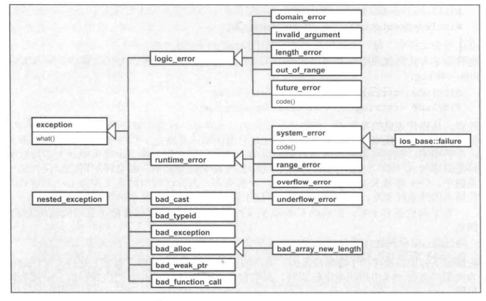

# C++ Standard Library

## Chapter 1 C++及标准库简介

C++11批准于2011年,是第二份C++标准.C++0x标准长时间被称为C++0x,因此C++11或C++0x是一个东西.

***

## Chapter 2 语言新特性

### 2.1 C++11语言新特性

#### 2.1.1 语法提升

**1.template表达式内的空格**

	vector< list < int > >	//旧C++版本要求的语法(两个template表达式的闭符之间放一个空格)
	vector<list<int>>		//C++11之后的语法(无空格要求--->更好看)

**2.nullptr和std::nullptr_t**

C++11使用nullptr取代0或NULL,是一个指针指向no value.

NULL和nullptr的区别:

	#include <iostream>
	#include <stddef.h>		//C++中使用NULl必须包含的头文件
	using namespace std;
	
	void foo(int)
	{
		cout << "int" << endl;
	}
	void foo(char *)
	{
		cout << "pointer" << endl;
	}
	
	int main()
	{
		foo(NULL);
		/*
			NULL是空指针常量:C语言中的NULL定义为((void *)0),而在C++中直接定义为0.
			因此在C++看来,0既是整数常量,也是指针常量.在调用时,会解析为0从而调用foot(int),这就
			产生了歧义,空指针调用整数参数的函数.
			--->结果为"int".
		*/
		foo(nullptr);
		/*
			nullptr是一个空指针常量,可以转换为各种指针类型,但不会被转换为整数类型.
			--->结果为"pointer".
		*/
	}

nullptr的类型是std::nullptr_t,定义于<cstddef>头文件.

#### 2.1.2 auto完成类型的自动推导

auto是C语言的一个旧关键字,便是某变量为局部,因为变量默认就是局部的,从未被真正用过.

1.普通自动推导

	double f();
	auto d = f();	//自动推导出d是double类型

2.auto声明的变量必须初始化

	auto i;		//错误,这样没办法做推导

3.加上额外限定符

	static auto vat = 0.19;

4.用于类型很长或表达式很复杂的情况

	vector<string> v;
	...
	auto pos = v.begin();	//pos的类型为vector<string>::iterator
	
	auto l = [] (int x) -> bool {
		...
	};
	/*
		l是一个lambda类型,接收一个int参数,返回一个bool值.
	*/

#### 2.1.3 一致性初始化和初值列的使用

**1.一致性初始化(uniform initialization)**

一致性初始化:使用相同的语法进行初始化(一般指代使用大括号"{}").

**2.初值列**

初值列:使用一致性初始化(即{})得到一系列的值.

1.初值列的使用

	int values[]{1, 2, 3};
	std::vector<int> v{2, 3, 5, 6, 7};
	std::vector<std::string> cities{"Berlin", "New York", "London", "Cairo", "Cologne"};
	std::complex<double> c{4.0, 3.0};	//复数类

2.使用一致性初始化对变量进行初始化

	int i{};	//j被初始化为0
	int *p{};	//p被初始化为nullptr

**3.一致性初始化使用的要求**

{}中的数据必须与类型一致(强制转换的不行).

	int x = 5.3;	//这种赋值可以
	int x{5.3};		//一致性初始化不行
	int x4 = {5.3};	//这种更不行
	char c1{7};		//可以,因为7也可表示ASCII字符
	char c2{9999};	//不行,因为7777在ASCII码中不存在
	std::vector<int> v1{1, 2, 3, 4, 5};	//可以
	std::vector<int> v2{1, 2, 3, 4, 5.6};	//不可以,因为5.6(double)与int不一致.

**4.用户自定义类型初值列---std::initializer_list<>**

	class P
	{
	public:
		P(int, int);
		P(std::initializer_list<int>);	//可以接受一个初值列的构造函数
	};

	P p(77, 5);		//调用P(int, int)
	P q{77, 5};		//调用P(std::initializer_list<int>),因为初值列的优先级高
	p r{77, 5, 43};	//调用P(std::initializer_list<int>)
	P s = {77, 5};	//调用P(std::initializer_list<int>)

**5.explicit(显示)构造函数取消"={}"赋值**

	class P
	{
	public:
		P(int a, int b)
		{
			...
		}
		explicit P(int a, int b, int c)
		{
			...
		}
	};

	P x(77, 5);	//合法,调用P(int a, int b)
	P y{77, 5};	//合法,调用P(int a, int b)
	P z{77, 5, 42};	//合法,调用:explicit P(int a, int b, int c)
	P v = {77, 5};	//合法,调用P(int a, int b)
	P w = {77, 5, 42};	//不合法,3个参数构造函数有explicit修饰,不允许这种赋值.

#### 2.1.4 Range-Based for循环

类似于Python的foreach循环.

**1.for打印初值列的值**

	for (int i : {2, 3, 4, 5, 6, 7,, 8, 9}) {
		std::cout << i << std::endl;
	}

	std::vector<double> vec;
	...
	for (auto &elem : vec) {	//使用引用,可以改变原值,否则就是拷贝
		elem *= 3;
	}

**2.打印某集合内元素的泛型函数**

	template <tyname T>
	void print_elements(const T&coll)
	{
		for (const auto &elem : coll) {	//使用常量引用可以避免值传递的拷贝
			std::cout << elem << std::endl;
		}
	}

**3.for循环不能有explicit类型转换(显示类型转换,explicit构造函数也不行)**

	class C
	{
	public:
		explicit C(const std::string& s);
		...
	}

	std::vector<std::string> vs;
	for (const C& elem : vs) {	//因为C为explicit,会报错.
		std::cout << elem << std::endl;
	}

#### 2.1.5 Move语义和Rvalue Reference

略--->有点看不懂.

#### 2.1.6 String Literal(新式的字符串字面常量)

**1.Raw String Literal**

主要用于简化一些转译字符的编写.

	/* 两个反斜杠和一个n组成的字符串 */
	1.寻常字符串的编写
		"\\\\n"
	2.使用raw string literal
		R"(\\n)"	//表示的字符串为"\\n",但如果中间有括号(e.g."\\()n")就会出问题.

**2.字符串中间含有括号的写法**

	R"delim(...)delim"	//delim表示字符序列(类似标签):表示字符串中间可带有括号的写法.

	/* 带括号的字符串写法 */
	1.寻常字符串的编写
		"a\\\n	b\\nc()\"\n	"
	2.使用raw string literal
		R"nc(a\
			 b\nc()"
			 )nc";
		//nc()nc--->nc仅表示一个标签.
	PS:此处string的内容为:一个a,一个反斜线,一个换行符,若干空格,一个b,一个反斜线,一个n,一个c,一对(),
		一个引号,一个换行符,若干空格

因此一般Raw String Literal的写法为R"xxx(...)xxx",括号中间可以有任何字符.

**3.Encoded String Literal(编码的String Literal)**

	u8"a"--->一个utf-8编码的字符串'a',字符类型为const char;
	u"hello"--->string literal,字符类型为char16_t;
	U"hello"--->string literal,字符类型为char32_t;
	L"hello"--->wide string literal,字符类型为wchar_t.

#### 2.1.7 关键字noexcept

略.

#### 2.1.8 关键字constexpr

constexpr:将变量或函数声明为constexpr,表示为一个常量表达式(在编译过程中就能得到计算结果的表达式).这样可以得到更好的效率和安全性.

	constexpr int square(int x)	//x在编译时能确定,则返回值可以是constexpr,此时编译可以通过.
	{
		return x * x;
	}

	float a[sqaure(9)];	//传递了一个常量9,此时表示a有81个元素.
	
#### 2.1.9 新的template特性

C++11起,tempalte可拥有"个数不定的template实参"的参数.成为variadic tempalte.

**1.print()函数,允许调用时给与不定个数的实参且各具不同类型**

	void print()	//必须提供一个non-template的print()函数,只为了结束递归.
	{
	}

	template <typename T, typename... Types>
	void print(const T &firstArg, const Types &...args)
	{
		std::cout << firstArg << std::endl;
		print(args...);	//递归调用print,调用到最后需要调用non-template的重载函数print(),结束整个递归.
	}

	//调用
	print(7.4, "hello", std::bitset<16>(377), 42);
	结果为:
		7.4
		hello
		0000000101111001

**2.sizeof...(args)的使用**

在variadic template中,sizeof...(args)会得到实参的个数.

**3.Alias Template(或者叫Template Typedef)**

	Template <typename T>
	using Vec = std::vector<T, MyAlloc<T>>;	//使用using来为后面的模板命别名为Vec.

	Vec<int> coll;
	--->等价于:
		std::vector<int, MyAlloc<int>> coll;

#### 2.1.10 Lambda

**1.Lambda语法**

1.最小型的lambda函数

	[]{
		std::cout << "hello lambda" << std::endl;
	}

	调用:
	[]{
		std::cout << "hello lambda" << std::endl;
	}();	//这种调用用的比较少,不实用.

2.lambda函数传递给一个对象,调用方便

	auto l = []{
				std::cout << "hello lambda" << std::endl;
			};	//传递给auto对象,会自动指明类型.
	...
	l();	//调用

3.带参数的lambda函数

	auto l =  {
				std::cout << s << std::endl;
			};
	l("hello lambda");

4.指定lambda返回类型

	 -> double {	//指定返回类型为double.
		return 42;
	}

**2.capture--->访问外部作用域的变量**

lambda中[]可以指明一个captue用来处理外部作用域未被传递给实参的数据.

1.by value和by reference传递

	[=]:表示by value传递,可读取但不能修改;
	[&]:表示by reference传递,可读可修改.

2.实例

	int x = 0;
	int y = 42;
	auto qqq = [x, &y] {
	/*
		x以by value传递; y以by reference传递.
	*/
				std::cout << "x: " << x << std::endl;
				std::cout << "y: " << y << std::endl;
				++y;
			};
	x = y = 77;
	qqq();
	qqq();
	std::cout << "final y: " << y << std::endl;
	/*
		结果为:
		x: 0
		y: 77
		x: 0
		y: 78
		final y: 79
	*/
	PS:此处也可以写成:[=, &y]代替[x, &y],表示y是by reference传递,其他以by value传递.

3.mutable

如果生命lambda为mutable,则以by value方式传递的对象也可以在lambda中修改.

	int id = 0;
	auto f = [id] () mutalbe {
				std::cout << "id: " << id << std::endl;
				++id;
			};
	id = 42;
	f();
	f();
	f();
	//结果为:
	id: 42
	id: 43
	id: 44

**3.Lambda类型**

略.

#### 2.1.11 关键字decltype

decltype让编译器找到表达式的类型(类似typeof,但是比typeof更好).

	std::map<std::string, float> coll;
	decltype<coll>::value_type elem;
	/*
		decltype<coll>:找到coll的类型.
	*/

decltype的应用:

	让函数的返回类型取决于某个表达式对实参的处理:
	template<typename T1, typename T2>
	auto add(T1 x, T2 y) -> decltype(x+y);	//函数的返回类型由x+y的值决定.

#### 2.1.12 带领域的(Scoped) Enumeration

略.

#### 2.1.13 新的基础类型

C++11增加了新的基础类型:

	char16_t和char32_t;
	long long和unsigned long long;
	std::nullptr_t.

### 2.2 虽旧犹新的语言特性

没什么新东西,暂略.

## Chapter 3 一般概念

### 3.1 命名空间(namespace)std

**using namespace std存在的问题**

	1.在复杂代码中,使用"using namespace std"可能导致意外的名称冲突,一般尽量避免使用using
		namespace std;
	2.比较好的方式:
		1)直接指定标识符
			std::cout << std::hex << 3.2 << std::endl;
		2)使用using declaration
			using std::cout;	//先指定,后面再使用就不用全部写出来了.
			using std::endl;
			cout << std::hex << 3.4 << endl;

### 3.2 头文件

C++中使用C标准头文件是在前面采用前缀字符c,不再使用扩展名.h.

	#include <cstdlib>	//即为C中的<stdlib.h>
	#include <cstring>	//即为C中的<string.h>

C++中也可以直接包含旧式C标准头文件:

	#include <stdlib.h>

### 3.3 差错和异常的处理

#### 3.3.1 标准的Exception Class(异常类)

C++所有异常都派生自基类exception,头文件为<exception>.

标准异常的层次结构:

**1.标准异常如下**

	std::exception--->所有异常的基类;
	std::bad_alloc---->通过new抛出,new不到内存;
	std::bad_cast--->通过dynamic_cast抛出;
	std::bad_exception--->处理C++程序中无法预期的异常时使用;
	std::bad_typeid--->通过typeid抛出;
	std::logic_error--->通过读取代码来检测到的异常;
	std::domain_error--->使用了无效的数学域时,抛出该异常;
	std::invalid_argument--->使用了无效参数,抛出该异常;
	std::length_error--->创建了太长的std::string时,抛出该异常;
	std::out_of_range--->访问超过vector/deque等的范围抛出该异常;
	std::runtime_error--->不能通过读取代码来检测到的异常;
	std::overflow_error--->发生数学上溢时,抛出该异常;
	std::range_error--->尝试存储超过范围的值时,会抛出该异常;
	std::underflow_error--->发生数学下溢时,抛出该异常.
	/*
	PS:在gdb调试时,碰到out_of_range的异常的打断点方法如下:
		b std::out_of_range::out_of_range
	其他的类似:
		b std::invalid_argument::invalid_argument
	*/

**2.实例**

	#include <iostream>
	#include <vector>
	#include <exception>
	using namespace std;

	int main()
	{
		vector<int> v = {1, 2, 3};
		try {
			cout << "v[3] = " << v.at(3) << endl;
		} catch(std::out_of_range e) {	//捕获到out_of_range的异常
			cout << e.what() << endl;
		}
	}

#### 3.3.2 异常类的成员

标准异常类都提供了成员函数what()--->用来获取类型以外的附加信息.某些异常类还提供了code()--->用的比较少.

	namespace std {
		class exception {
			public:
				virtual const char *what() const noexcept;
				...
		};
	};
	//what()返回的string内容由编译器决定.

其他:略.

### 3.4 Callable Object(可被调用的对象)

Callable Object:可被某种方式调用其某些函数的对象.

**1.可调用对象包括**

	1.函数:
		void func(int x, int y);
	2.lambda:
		auto l = [] (int x, int y) {
			...
		};
	2.成员函数和重载():
		class C {
			public:
				void operator() (int x, int y) const;
				void mem_func(int x, int y) const;
		};

**2.调用**

	int main()
	{
		C c;
		std::shared_ptr<C> sp(new C);

		/* 使用bind()函数调用可调用对象 */
		std::bind(func, 77, 33)();	//调用函数: func(77, 33)
		std::bind(l, 77, 33)();		//调用lambda: l(77, 33)
		std::bind(C(), 77, 33)();
		/*
			C():会找到class C重载的operator() (int x, int y),即:C::operator()(77, 33).
		*/
		std::bind(&C::mem_func, c, 77, 33)();
		/*
			para0--->&C::mem_func(为成员函数指针),此处调用: c.mem_func(77, 33)
		*/
		std::bind(&C::mem_func, sp, 77, 33)();
		//此处调用: sp->mem_func(77, 33);

		/* 使用async()函数调用可调用对象(会在后台启动task) */
		std::async(func, 42, 77);	//调用函数: func(77, 33)
		std::async(l, 42, 77);		//调用lambda: l(77, 33)
		std::async(C(), 42, 77);	//调用C::operator()(77, 33)
		std::async(&C::mem_func, &c, 42, 77);	//调用: c.mem_func(77, 33)
		std::async(&C::mem_func, sp, 42, 77);	//调用: sp->mem_func(77, 33)
	}

### 3.5 并发与多线程

略.

### 3.6 分配器(Allocator)

略.

## Chapter 4 通用工具

