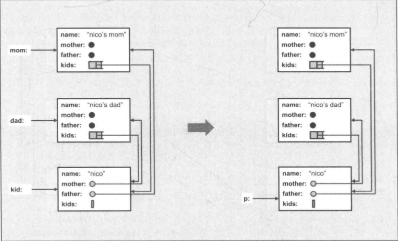
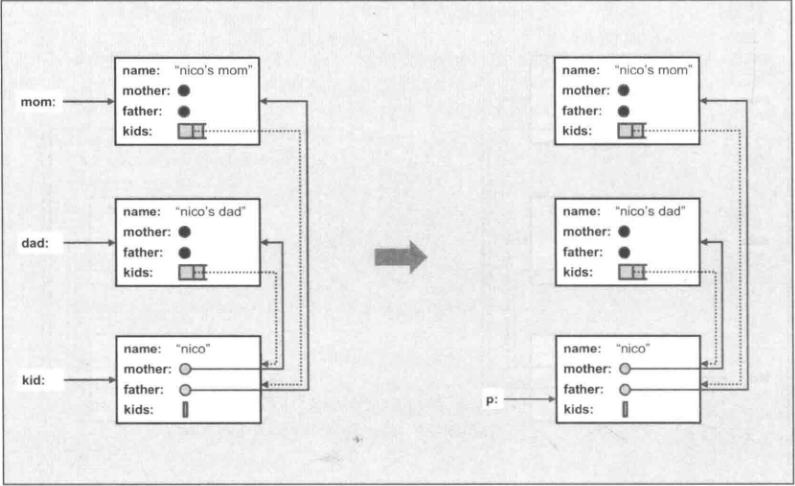

# C++ Standard Library

## Chapter 1 C++及标准库简介

C++11批准于2011年,是第二份C++标准.C++0x标准长时间被称为C++0x,因此C++11或C++0x是一个东西.

***

## Chapter 2 语言新特性

### 2.1 C++11语言新特性

#### 2.1.1 语法提升

**1.template表达式内的空格**

	vector< list < int > >	//旧C++版本要求的语法(两个template表达式的闭符之间放一个空格)
	vector<list<int>>		//C++11之后的语法(无空格要求--->更好看)

**2.nullptr和std::nullptr_t**

C++11使用nullptr取代0或NULL,是一个指针指向no value.

NULL和nullptr的区别:

	#include <iostream>
	#include <stddef.h>		//C++中使用NULl必须包含的头文件
	using namespace std;
	
	void foo(int)
	{
		cout << "int" << endl;
	}
	void foo(char *)
	{
		cout << "pointer" << endl;
	}
	
	int main()
	{
		foo(NULL);
		/*
			NULL是空指针常量:C语言中的NULL定义为((void *)0),而在C++中直接定义为0.
			因此在C++看来,0既是整数常量,也是指针常量.在调用时,会解析为0从而调用foot(int),这就
			产生了歧义,空指针调用整数参数的函数.
			--->结果为"int".
		*/
		foo(nullptr);
		/*
			nullptr是一个空指针常量,可以转换为各种指针类型,但不会被转换为整数类型.
			--->结果为"pointer".
		*/
	}

nullptr的类型是std::nullptr_t,定义于<cstddef>头文件.

#### 2.1.2 auto完成类型的自动推导

auto是C语言的一个旧关键字,便是某变量为局部,因为变量默认就是局部的,从未被真正用过.

1.普通自动推导

	double f();
	auto d = f();	//自动推导出d是double类型

2.auto声明的变量必须初始化

	auto i;		//错误,这样没办法做推导

3.加上额外限定符

	static auto vat = 0.19;

4.用于类型很长或表达式很复杂的情况

	vector<string> v;
	...
	auto pos = v.begin();	//pos的类型为vector<string>::iterator
	
	auto l = [] (int x) -> bool {
		...
	};
	/*
		l是一个lambda类型,接收一个int参数,返回一个bool值.
	*/

#### 2.1.3 一致性初始化和初值列的使用

**1.一致性初始化(uniform initialization)**

一致性初始化:使用相同的语法进行初始化(一般指代使用大括号"{}").

**2.初值列**

初值列:使用一致性初始化(即{})得到一系列的值.

1.初值列的使用

	int values[]{1, 2, 3};
	std::vector<int> v{2, 3, 5, 6, 7};
	std::vector<std::string> cities{"Berlin", "New York", "London", "Cairo", "Cologne"};
	std::complex<double> c{4.0, 3.0};	//复数类

2.使用一致性初始化对变量进行初始化

	int i{};	//j被初始化为0
	int *p{};	//p被初始化为nullptr

**3.一致性初始化使用的要求**

{}中的数据必须与类型一致(强制转换的不行).

	int x = 5.3;	//这种赋值可以
	int x{5.3};		//一致性初始化不行
	int x4 = {5.3};	//这种更不行
	char c1{7};		//可以,因为7也可表示ASCII字符
	char c2{9999};	//不行,因为7777在ASCII码中不存在
	std::vector<int> v1{1, 2, 3, 4, 5};	//可以
	std::vector<int> v2{1, 2, 3, 4, 5.6};	//不可以,因为5.6(double)与int不一致.

**4.用户自定义类型初值列---std::initializer_list<>**

	class P
	{
	public:
		P(int, int);
		P(std::initializer_list<int>);	//可以接受一个初值列的构造函数
	};

	P p(77, 5);		//调用P(int, int)
	P q{77, 5};		//调用P(std::initializer_list<int>),因为初值列的优先级高
	p r{77, 5, 43};	//调用P(std::initializer_list<int>)
	P s = {77, 5};	//调用P(std::initializer_list<int>)

**5.explicit(显示)构造函数取消"={}"赋值**

	class P
	{
	public:
		P(int a, int b)
		{
			...
		}
		explicit P(int a, int b, int c)
		{
			...
		}
	};

	P x(77, 5);	//合法,调用P(int a, int b)
	P y{77, 5};	//合法,调用P(int a, int b)
	P z{77, 5, 42};	//合法,调用:explicit P(int a, int b, int c)
	P v = {77, 5};	//合法,调用P(int a, int b)
	P w = {77, 5, 42};	//不合法,3个参数构造函数有explicit修饰,不允许这种赋值.

#### 2.1.4 Range-Based for循环

类似于Python的foreach循环.

**1.for打印初值列的值**

	for (int i : {2, 3, 4, 5, 6, 7,, 8, 9}) {
		std::cout << i << std::endl;
	}

	std::vector<double> vec;
	...
	for (auto &elem : vec) {	//使用引用,可以改变原值,否则就是拷贝
		elem *= 3;
	}

**2.打印某集合内元素的泛型函数**

	template <tyname T>
	void print_elements(const T&coll)
	{
		for (const auto &elem : coll) {	//使用常量引用可以避免值传递的拷贝
			std::cout << elem << std::endl;
		}
	}

**3.for循环不能有explicit类型转换(显示类型转换,explicit构造函数也不行)**

	class C
	{
	public:
		explicit C(const std::string& s);
		...
	}

	std::vector<std::string> vs;
	for (const C& elem : vs) {	//因为C为explicit,会报错.
		std::cout << elem << std::endl;
	}

#### 2.1.5 Move语义和Rvalue Reference

略--->有点看不懂.

#### 2.1.6 String Literal(新式的字符串字面常量)

**1.Raw String Literal**

主要用于简化一些转译字符的编写.

	/* 两个反斜杠和一个n组成的字符串 */
	1.寻常字符串的编写
		"\\\\n"
	2.使用raw string literal
		R"(\\n)"	//表示的字符串为"\\n",但如果中间有括号(e.g."\\()n")就会出问题.

**2.字符串中间含有括号的写法**

	R"delim(...)delim"	//delim表示字符序列(类似标签):表示字符串中间可带有括号的写法.

	/* 带括号的字符串写法 */
	1.寻常字符串的编写
		"a\\\n	b\\nc()\"\n	"
	2.使用raw string literal
		R"nc(a\
			 b\nc()"
			 )nc";
		//nc()nc--->nc仅表示一个标签.
	PS:此处string的内容为:一个a,一个反斜线,一个换行符,若干空格,一个b,一个反斜线,一个n,一个c,一对(),
		一个引号,一个换行符,若干空格

因此一般Raw String Literal的写法为R"xxx(...)xxx",括号中间可以有任何字符.

**3.Encoded String Literal(编码的String Literal)**

	u8"a"--->一个utf-8编码的字符串'a',字符类型为const char;
	u"hello"--->string literal,字符类型为char16_t;
	U"hello"--->string literal,字符类型为char32_t;
	L"hello"--->wide string literal,字符类型为wchar_t.

#### 2.1.7 关键字noexcept

略.

#### 2.1.8 关键字constexpr

constexpr:将变量或函数声明为constexpr,表示为一个常量表达式(在编译过程中就能得到计算结果的表达式).这样可以得到更好的效率和安全性.

	constexpr int square(int x)	//x在编译时能确定,则返回值可以是constexpr,此时编译可以通过.
	{
		return x * x;
	}

	float a[sqaure(9)];	//传递了一个常量9,此时表示a有81个元素.
	
#### 2.1.9 新的template特性

C++11起,tempalte可拥有"个数不定的template实参"的参数.成为variadic tempalte.

**1.print()函数,允许调用时给与不定个数的实参且各具不同类型**

	void print()	//必须提供一个non-template的print()函数,只为了结束递归.
	{
	}

	template <typename T, typename... Types>
	void print(const T &firstArg, const Types &...args)
	{
		std::cout << firstArg << std::endl;
		print(args...);	//递归调用print,调用到最后需要调用non-template的重载函数print(),结束整个递归.
	}

	//调用
	print(7.4, "hello", std::bitset<16>(377), 42);
	结果为:
		7.4
		hello
		0000000101111001

**2.sizeof...(args)的使用**

在variadic template中,sizeof...(args)会得到实参的个数.

**3.Alias Template(或者叫Template Typedef)**

	Template <typename T>
	using Vec = std::vector<T, MyAlloc<T>>;	//使用using来为后面的模板命别名为Vec.

	Vec<int> coll;
	--->等价于:
		std::vector<int, MyAlloc<int>> coll;

#### 2.1.10 Lambda

**1.Lambda语法**

1.最小型的lambda函数

	[]{
		std::cout << "hello lambda" << std::endl;
	}

	调用:
	[]{
		std::cout << "hello lambda" << std::endl;
	}();	//这种调用用的比较少,不实用.

2.lambda函数传递给一个对象,调用方便

	auto l = []{
				std::cout << "hello lambda" << std::endl;
			};	//传递给auto对象,会自动指明类型.
	...
	l();	//调用

3.带参数的lambda函数

	auto l =  {
				std::cout << s << std::endl;
			};
	l("hello lambda");

4.指定lambda返回类型

	 -> double {	//指定返回类型为double.
		return 42;
	}

**2.capture--->访问外部作用域的变量**

lambda中[]可以指明一个captue用来处理外部作用域未被传递给实参的数据.

1.by value和by reference传递

	[=]:表示by value传递,可读取但不能修改;
	[&]:表示by reference传递,可读可修改.

2.实例

	int x = 0;
	int y = 42;
	auto qqq = [x, &y] {
	/*
		x以by value传递; y以by reference传递.
	*/
				std::cout << "x: " << x << std::endl;
				std::cout << "y: " << y << std::endl;
				++y;
			};
	x = y = 77;
	qqq();
	qqq();
	std::cout << "final y: " << y << std::endl;
	/*
		结果为:
		x: 0
		y: 77
		x: 0
		y: 78
		final y: 79
	*/
	PS:此处也可以写成:[=, &y]代替[x, &y],表示y是by reference传递,其他以by value传递.

3.mutable

如果生命lambda为mutable,则以by value方式传递的对象也可以在lambda中修改.

	int id = 0;
	auto f = [id] () mutalbe {
				std::cout << "id: " << id << std::endl;
				++id;
			};
	id = 42;
	f();
	f();
	f();
	//结果为:
	id: 42
	id: 43
	id: 44

**3.Lambda类型**

略.

#### 2.1.11 关键字decltype

decltype让编译器找到表达式的类型(类似typeof,但是比typeof更好).

	std::map<std::string, float> coll;
	decltype<coll>::value_type elem;
	/*
		decltype<coll>:找到coll的类型.
	*/

decltype的应用:

	让函数的返回类型取决于某个表达式对实参的处理:
	template<typename T1, typename T2>
	auto add(T1 x, T2 y) -> decltype(x+y);	//函数的返回类型由x+y的值决定.

#### 2.1.12 带领域的(Scoped) Enumeration

略.

#### 2.1.13 新的基础类型

C++11增加了新的基础类型:

	char16_t和char32_t;
	long long和unsigned long long;
	std::nullptr_t.

### 2.2 虽旧犹新的语言特性

没什么新东西,暂略.

## Chapter 3 一般概念

### 3.1 命名空间(namespace)std

**using namespace std存在的问题**

	1.在复杂代码中,使用"using namespace std"可能导致意外的名称冲突,一般尽量避免使用using
		namespace std;
	2.比较好的方式:
		1)直接指定标识符
			std::cout << std::hex << 3.2 << std::endl;
		2)使用using declaration
			using std::cout;	//先指定,后面再使用就不用全部写出来了.
			using std::endl;
			cout << std::hex << 3.4 << endl;

### 3.2 头文件

C++中使用C标准头文件是在前面采用前缀字符c,不再使用扩展名.h.

	#include <cstdlib>	//即为C中的<stdlib.h>
	#include <cstring>	//即为C中的<string.h>

C++中也可以直接包含旧式C标准头文件:

	#include <stdlib.h>

### 3.3 差错和异常的处理

#### 3.3.1 标准的Exception Class(异常类)

C++所有异常都派生自基类exception,头文件为<exception>.

标准异常的层次结构:

**1.标准异常如下**

	std::exception--->所有异常的基类;
	std::bad_alloc---->通过new抛出,new不到内存;
	std::bad_cast--->通过dynamic_cast抛出;
	std::bad_exception--->处理C++程序中无法预期的异常时使用;
	std::bad_typeid--->通过typeid抛出;
	std::logic_error--->通过读取代码来检测到的异常;
	std::domain_error--->使用了无效的数学域时,抛出该异常;
	std::invalid_argument--->使用了无效参数,抛出该异常;
	std::length_error--->创建了太长的std::string时,抛出该异常;
	std::out_of_range--->访问超过vector/deque等的范围抛出该异常;
	std::runtime_error--->不能通过读取代码来检测到的异常;
	std::overflow_error--->发生数学上溢时,抛出该异常;
	std::range_error--->尝试存储超过范围的值时,会抛出该异常;
	std::underflow_error--->发生数学下溢时,抛出该异常.
	/*
	PS:在gdb调试时,碰到out_of_range的异常的打断点方法如下:
		b std::out_of_range::out_of_range
	其他的类似:
		b std::invalid_argument::invalid_argument
	*/

**2.实例**

	#include <iostream>
	#include <vector>
	#include <exception>
	using namespace std;

	int main()
	{
		vector<int> v = {1, 2, 3};
		try {
			cout << "v[3] = " << v.at(3) << endl;
		} catch(std::out_of_range e) {	//捕获到out_of_range的异常
			cout << e.what() << endl;
		}
	}

#### 3.3.2 异常类的成员

标准异常类都提供了成员函数what()--->用来获取类型以外的附加信息.某些异常类还提供了code()--->用的比较少.

	namespace std {
		class exception {
			public:
				virtual const char *what() const noexcept;
				...
		};
	};
	//what()返回的string内容由编译器决定.

其他:略.

### 3.4 Callable Object(可被调用的对象)

Callable Object:可被某种方式调用其某些函数的对象.

**1.可调用对象包括**

	1.函数:
		void func(int x, int y);
	2.lambda:
		auto l = [] (int x, int y) {
			...
		};
	2.成员函数和重载():
		class C {
			public:
				void operator() (int x, int y) const;
				void mem_func(int x, int y) const;
		};

**2.调用**

	int main()
	{
		C c;
		std::shared_ptr<C> sp(new C);

		/* 使用bind()函数调用可调用对象 */
		std::bind(func, 77, 33)();	//调用函数: func(77, 33)
		std::bind(l, 77, 33)();		//调用lambda: l(77, 33)
		std::bind(C(), 77, 33)();
		/*
			C():会找到class C重载的operator() (int x, int y),即:C::operator()(77, 33).
		*/
		std::bind(&C::mem_func, c, 77, 33)();
		/*
			para0--->&C::mem_func(为成员函数指针),此处调用: c.mem_func(77, 33)
		*/
		std::bind(&C::mem_func, sp, 77, 33)();
		//此处调用: sp->mem_func(77, 33);

		/* 使用async()函数调用可调用对象(会在后台启动task) */
		std::async(func, 42, 77);	//调用函数: func(77, 33)
		std::async(l, 42, 77);		//调用lambda: l(77, 33)
		std::async(C(), 42, 77);	//调用C::operator()(77, 33)
		std::async(&C::mem_func, &c, 42, 77);	//调用: c.mem_func(77, 33)
		std::async(&C::mem_func, sp, 42, 77);	//调用: sp->mem_func(77, 33)
	}

### 3.5 并发与多线程

略.

### 3.6 分配器(Allocator)

略.

## Chapter 4 通用工具

### 4.1 pair和tuple

#### 4.1.1 pair

class pair将两个value视为一个单元.map, multimap, unordered_map和unordered_multimap就是使用pair来管理其以key-value pair形式存在的元素.

	1.任何需要返回两个value的地方都可以用到pair(e.g.minmax()函数);
	2.struct pair定义于<utility>,由于为struct,因此其所有成员都是public.

**1.struct pair的定义**

	namespace std {
		template <typename T1, typename T2>
		struct pair {
			T1 first;	//first数据成员可以访问到pair的第一个元素
			T2 second;	//second数据成员可以访问到pair的第二个元素
		};
	};

**2.pair对象的构造**

1.pair<T1, T2> p构造

	pair<int, string> p(42, "hello");

2.make_pair()构造--->更常用

	1.一般的构造为:
		std::pair<int, char> p(42, '@');
	2.使用make_pair()构造:
		std::make_pair(42, '@');	//直接写出两个元素值即可
	3.但是,如果:
		std::pair<int, float> p(42, 7.77);
		使用:
		std::make_pair(42, 7.77);	//不等价,因为7.77默认认为的类型为double,与float不相符.

**3.pair的比较**

pair重载的==, !=, <, >, <=, >=等符号,可以直接比较两个pair对象.内部实现为:

	namespace std {
		template <typename T1, typename T2>
		bool operator== (const pair<T1, T2> &x, const pair<T1, T2> &y) {
			return x.first == y.first && x.second == y.second;
		}
	};

	//使用方法为:
	p1 == p2	//p1, p2为相同类型pair的两个对象

**4.实例---将一个value pair写入一个stream内**

	template <typename T1, typename T2>
	std::ostream &operator << (std::ostream &strm, const std::pair<T1, T2> &p)
	{
		return strm << "[" << p.first << ", " << p.second << "]";
	}

**5.pair为特殊的tuple(只有两个元素的tuple),因此可以使用tuple的某些函数**

	typedef std::pair<int, float> int_float_pair;
	int_float_pair p(42, 3.14);

	std::get<0>(p)	//等价于p.first,获取p的第一个元素
	std::get<1>(p)	//等价于p.second,获取p的第二个元素
	std::tuple_size<int_float_pair>::value	//获取tuple的元素个数,此处为pair,结果为2
	std::tuple_element<0, int_float_pair>::type
		//获取tuple指定元素的类型,此处为pair第0个,结果为int.

**6.vector<pair<int, string>>的初始化**

	const vector<pair<int, string>> value_symbol {
		{1000, "M"},	// 可使用[]生成pair
		{900, "CM"},
		{500, "D"},
		{400, "CD"},
		{100, "C"},
		{90, "XC"},
		{50, "L"},
		{40, "XL"},
		{10, "X"},
		{9, "IX"},
		{5, "V"},
		{4, "IV"},
		{1, "I"}	
	};

#### 4.1.2 tuple(不定数的值组)

tuple为拥有任意数量个元素,且元素类型可以被单独指定.

**1.tuple的操作**

1.make_tuple():用于创建一个tuple; get<>()用于访问tuple的元素.

	#include <tuple>
	#include <iostream>
	#include <complex>	//复数
	#include <string>
	using namespace std;

	int main()
	{
		tuple<string, int, int, complex<double>> t;	//实例一个tuple对象,元素全部为默认值
		
		tuple<int, float, string> t1(41, 6.3, "nico");	//实例一个tuple对象,并带有初始化的值
		
		cout << get<0>(t1) << " ";	//获取第一个元素--->41
		cout << get<1>(t1) << " ";	//获取第二个元素--->6.3
		cout << get<2>(t1) << " ";	//获取第三个元素--->nico

		auto t2 = make_tuple(22, 44, "nico");
		//auto自动推断tuple元素类型,t2的元素类型为(int, int, const char *)

		get<1>(t1) = get<1>(t2);	//给tuple某个元素赋值

		if (t1 < t2) {
			t1 = t2;	//比较两个tuple并赋值
		}
	}

2.tuple元素的引用

	std::string s;

	auto x = std::make_tuple(s);
	std::get<0>(x) = "my value";	//可以更改x中的0元素值,但是不能更改s的值

	auto y = std::make_tuple(ref(s));	//tuple中的第一个元素为s的引用.ref(s)->表示s的引用
	std::get<0>(y) = "my value";	//此时也会更改s的值

3.tie--->更方便的引用

	std::tuple<int, float, std::string> t(77, 1.1, "more light");
	int i;
	float f;
	std::string s;
	std::tie(i, f, s) = t;	//tie(type...):表示某个tuple的引用,元素排布与tuple必须一致

	PS:
		std::ignore--->忽略tuple中的某些元素
	std::tuple<int, float, std::string> t(77, 1.1, "more light");
	int i;
	std::string s;
	std::tie(i, std::ignore, s) = t;	//表示忽略tuple中的第二个元素

**2.tuple的初始化**

tuple不允许使用赋值语法来初始化.

	1.简单初始化
		std::tuple<int, double> t1{42, 3.14};	//允许
		std::tuple<int, double> t2 = {42, 3.14};	//赋值语法,不允许
	2.复杂初始化
		std::vector<std::tuple<int, float>> v{std::make_tuple(1, 1.0),
											  std::make_tuple(2, 2.0)};
			//允许
		std::vector<std::tuple<int, float>> v{{1, 1.0}, {2, 2.0}};
			//不允许,和赋值一样的原理
	3.函数返回值
		std::tuple<int, int, int> foo() {
			return std::make_tuple(1, 2, 3);	//允许
		}
		std::tuple<int, int, int> foo() {
			return {1, 2, 3};	//不允许,和赋值一样的原理
		}

**3.其他tuple特性**

1.tuple_size<tuple_name>::value--->获得元素个数

	typename std::tuple<int, float, std::string> tuple_type;

	cout << std::tuple_size<tuple_type>::value;	//结果为3

2.tuple_element<idx, tuple_name>::type--->获得第idx个元素的类型(即get<>()的返回值类型)

	typename std::tuple<int, float, std::string> tuple_type;

	cout << tuple_element<1, tuple_type>::type;	//结果为float

3.tuple_cat()--->将多个tuple连接成一个tuple

	int n;
	auto tt = std::tuple_cat(std::make_tuple(42, 7.7, "hello"), std::tie(n));
		//此时tt tuple中的元素为(42, 7.7, "hello", 0)	--->n默认值为0

#### 4.1.3 tuple的输入/输出

使用"<<"打印任何tuple的实现.

	// printtuple.h
	#include <tuple>
	#include <iostream>

	template <int IDX, int MAX, typename... Args>
	struct PRINT_TUPLE {	//默认该结构体例化需要3个参数
		//结构体里的静态函数
		static void print(std::ostream &strm, const std::tuple<Args...> &t) {
			strm << std::get<IDX>(t) << (IDX + 1 == MAX ? "" : ",");
			PRINT_TUPLE<IDX+1, MAX, Args...>::print(strm, t);
				//直接调用静态函数,此处为递归调用
		}
	};

	//无操作的模板,用于结束递归
	tempate <int MAX, typename... Args>
	struct PRINT_TUPLE<MAX, MAX, Args...> { //指定结构体例化需要3个参数
		static void print(std::ostream &strm, const std::tuple<Args...> &t) {
		}
	};

	//使用"<<"打印任何tuple
	template <typename... Args>
	std::ostream &operator << (std::ostream &strm, const std::tuple<Args...> &t)
	{
		strm << "[";
		PRINT_TUPLE<0, sizeof...(Args), Args...>::print(strm, t);
		return strm << "]";
	}

测试代码:

	// printtuple.cpp
	#include "printtuple.h"
	#include <tuple>
	#include <iostream>
	#include <string>
	using namespace std;

	int main()
	{
		tuple<int, float, string> t(77, 1.1, "more light");
		cout << "io: " << t << endl;
	}

	//结果为: io: [77, 1.1, more light]

### 4.2 Smart Pointer(智能指针)

自C++11起,C++标准库提供了两大类型的smart pointer:

	1.class shared_ptr:实现共享式拥有概念.多个smart pointer可以指向相同对象,在最后一个reference被销
		毁时所有资源被释放;
	2.class unique_ptr:实现独占式拥有概念.保证同一时间只有一个smart pointer可以指向该对象,可以移交拥
		有权.对于避免资源泄漏(e.g.以new创建对象后因为发生异常而忘记调用delete)特别有用.

#### 4.2.1 class shared_ptr

多个shared_ptr可以共享同一对象,对象的最后一个拥有者有责任销毁对象,并清理与该对象相关的所有资源.

**1.shared_ptr的使用**

	#include <iostream>
	#include <string>
	#include <vector>
	#include <memory>	//shared_ptr的头文件
	using namespace std;

	int main()
	{
		shared_ptr<string> p_nico(new string("nico"));
		/*
			shared_ptr接收单一pointer作为实参的构造函数是explicit(显示的,此时默认的删除指针的是直接
				调用delete,与new对应).
			shared_ptr的初始化:
				1.新式语法"{}":
					shared_ptr<string> p_nico{new string("nico")};
					PS--->下面的是不正确的:
					shared_ptr<string> p_nico = new string("nico");	//赋值是不合法的
				2.使用make_shared<...>():
					shared_ptr<string> p_nico = make_shared<string>("nico");
					--->这种方式比较快且安全.
				3.先声明,再调用reset:
					shared_ptr<string> p_nico;
					p_nico.reset(new string("nico"));	//用的比较少
		*/
		shared_ptr<string> p_jutta(new string("jutta"));

		(*p_nico)[0] = 'N';		//和一般指针用法一样,更改第一个字母为"N".
		p_jutta->replace(0, 1, "J");	//替换第0个字符为"J".

		vector<shared_ptr<string>> who_made_coffee;
		who_made_coffee.push_back(p_jutta);
		/*
			凡是压入容器的均为元素的拷贝.如果改变原始元素的内容是不会更改容器中的元素内容.
			此处压入shared_ptr,一旦指向的元素内容更改了,读取该容器中的指针指向的内容也跟着改了.
		*/
		who_made_coffee.push_back(p_jutta);
		who_mode_coffee.push_back(p_nico);
		who_mode_coffee.push_back(p_jutta);
		who_mode_coffee.push_back(p_nico);
		
		for (auto ptr_iter : who_made_coffer) {
			cout << *ptr_iter << " ";
		}
		/*
			结果为:
				jutta jutta	nico jutta nico
		*/
		cout << endl;

		*p_nico = "nicolai";	//更改共享指针的内容为"nicolai"

		for (auto ptr_iter : who_mode_coffer) {
			cout << *ptr_iter << " ";
		}
		//结果为:jutta jutta	nicolai jutta nicolai
		cout << endl;
		cout << "use_count: " << who_mode_coffer[0].use_count() << endl;
		/*
			shared_ptr的use_count方法统计某个shared_ptr所指对象的当前拥有者数量.
			此处为4个,vector中有3个和p_jutta.
		*/

		//结束时shared_ptr会自动调用默认的delete来删除指针.
	}

**2.指定deleter**

声明一个属于自己的deleter,在"删除被指对象"之前打印一条消息.

	shared_ptr<string> p_nico(new string("nico"),
					 {
						cout << "delete " << *p << endl;
						delete p;
					});
	/*
		将一个lambda函数作为shared_ptr构造函数的第二个参数,用于指定删除对象时调用的delete函数.默认是直接
		调用delete.
	*/

**3.给array指定deleter**

	shared_ptr<int> p(new int[10],
					 {
						delete []p;
					});
	/*
		shared_ptr默认只能删除由new创建的单一对象.对于array是不能使用默认的deleter.此处传入一个lambda
		用于指定deleter array的函数.
	*/

**4.指定属于自己的析构策略**

	#include <string>
	#include <fstream>
	#include <memory>
	#include <cstdio>

	class file_deleter {
	private:
		std::string filename;
	public:
		file_deleter(const std::string &fn) :
			filename(fn) {}
		
		void operator()(std::ofstream *fp) {
			fp->close();
			std::remove(filename.c_str());
		}	//重载括号运算符
	};

	int main()
	{
		std::shared_ptr<std::ofstream> fp(new std::ofstream("tmpfile.txt"),
										file_deleter("tmpfile.txt"));
		/*
			此处deleter为先创建file_deleter类的对象inst.当需要delete时,会自动调用该对象的括号运算符,
				并传入fp指针(即:--->inst(fp)).因此会调用类的重载括号运算符函数.
		*/
	}

#### 4.2.2 class weak_ptr

weak_ptr的设计目的是为了配合shared_ptr而引入的一种smart pointer,用来协助shared_ptr工作.可以从一个shared_ptr或另一个weak_ptr构造,weak_ptr的构造和析构不会引起引用计数的增加或减少.

**1.weak_ptr的简单使用**

	std::shared_ptr<int> sp(new int(10));
	std::weak_ptr<int> wp(sp);	//由shared_ptr构造
	wp = sp;
	printf("%d\n", wp.use_count());	//结果为1,因为weak_ptr不会增加引用计数
	wp.reset();	//重置
	printf("%d\n", wp);	//结果为0

**2.使用weak_ptr解决shared_ptr因循环引用不能释放资源的问题**

1.shared_ptr导致循环引用

	#include <iostream>
	#include <string>
	#include <memory>
	#include <vector>
	using namespace std;

	class person {
	public:
		string name;
		shared_ptr<person> mother;
		shared_ptr<person> father;
		vector<shared_ptr<person>> kids;

		person(const string &n,
			shared_ptr<person> m = nullptr,
			shared_ptr<person> f = nullptr) :
			name(n),
			mother(m),
			father(f)
		{}

		~person()
		{
			cout << "delete" << name << endl;
		}
	};

	shared_ptr<person> init_family(const string &name)
	{
		shared_ptr<person> mom(new person(name + "'s mom"));
		shared_ptr<person> dad(new person(name + "'s dad"));
		shared_ptr<person> kid(new person(name, mom, dad));
		mom->kids.push_back(kid);
		dad->kids.push_back(kid);
		return kid;
	}

	int main()
	{
		shared_ptr<person> p = init_family("nico");

		cout << "nico's famliy exists" << endl;
		cout <<"- nico is shared " << p.use_count() << " times" << endl;
		cout << "- name of 1st kid of nico's mom: "
			<< p->mother->kids[0]->name << endl;

		p->init_family("jim");
		cout << "jim's family exists" << endl;
	}

	//结果为:
		nico's famliy exists
		- nico is shared 3 times
		- name of 1st kid of nico's mom: nico
		jim's family exists
	--->析构函数从未被调用过(有循环指向).

指向关系如图:

	指向均为实线,表示存在真实的引用关系.

2.使用weak_ptr避免循环引用

	class person {
	public:
		string name;
		shared_ptr<person> mother;
		shared_ptr<person> father;
		vector<weak_ptr<person>> kids;

		person(const string &n,
			shared_ptr<person> m = nullptr,
			shared_ptr<person> f = nullptr) :
			name(n),
			mother(m),
			father(f)
		{}

		~person()
		{
			cout << "delete" << name << endl;
		}
	};

	shared_ptr<person> init_family(const string &name)
	{
		shared_ptr<person> mom(new person(name + "'s mom"));
		shared_ptr<person> dad(new person(name + "'s dad"));
		shared_ptr<person> kid(new person(name, mom, dad));
		mom->kids.push_back(kid);
		dad->kids.push_back(kid);
		return kid;
	}

	int main()
	{
		shared_ptr<person> p = init_family("nico");

		cout << "nico's famliy exists" << endl;
		cout <<"- nico is shared " << p.use_count() << " times" << endl;
		//p.use_count()效率有时不高,C++标准库不推荐使用,仅在调试时使用.
		cout << "- name of 1st kid of nico's mom: "
			<< p->mother->kids[0].lock()->name << endl;
		/*
			此处: p->mother->kids[0]为weak_ptr,使用其取访问类的成员需要加上lock(),即:
				p->mother->kids[0].lock()->name.
			避免不明确的行为发生.
		*/

		p->init_family("jim");
		cout << "jim's family exists" << endl;
	}

使用weak_ptr后的指向关系:

	此时循环引用的实现被weak_ptr替换为虚线,无循环引用.
	//结果为:
		nico's famliy exists
		- nico is shared 1 times
		- name of 1st kid of nico's mom: nico
		delete nico
		delete nico's dad
		delete nico's mom
		jim's family exists
		delete jim
		delete jim's dad
		delete jim's mom

#### 4.2.3 误用shared_ptr

	//错误用法:
		int *p = new int;
		shared_ptr<int> sp1(p);
		shared_ptr<int> sp2(p);
		/*
			此处sp1和sp2都有对p的拥有权,释放时相应资源会被执行两次.这是错误的用法.
		*/
	//正确用法:
		shared_ptr<int> sp1(new int);
		shared_ptr<int> sp2(sp1);	//sp2由sp1初始化

#### 4.2.4 class unique_ptr

class unique_ptr实现了独占式拥有,确保一个对象和其资源在同一时间只被一个pointer拥有.一旦拥有者被销毁或变成empty,或开始拥有另一个对象,先前拥有的那个对象就会被销毁,其相应资源也会被自动释放.

**1.class unique_ptr与传统指针对比**

	//传统指针:
		void f()
		{
			class_a *ptr = new class_a;
			...
			delete ptr;	//主动释放指针及其资源
		}
	//使用unique_ptr
		void f()
		{
			std::unique_ptr<class_a> ptr(new class_a);	//定义一个unique_ptr
			...	//后面不需要主动释放,系统会自动释放unique_ptr的资源
		}

**2.使用unique_ptr**

1.访问成员(可以像普通指针一样访问)

	std::unique_ptr<std::string> up(new std::string("nico"));

	(*up)[0] = 'N';
	up->append("lai");
	std::cout << *up << std::endl;

2.初始化

	std::unique_ptr<int> up = new int;	//错误,赋值语法不可以
	std::unique_ptr<int> up(new int);	//正确,必须使用该种语法初始化

3.其他操作

	std::unique_ptr<std::string> up(new std::string("nico"));
	...
	std::string *sp = up.release();
		//放弃拥有的对象,返回该对象给到普通指针(今后由普通指针负责释放资源).

	if (up) {	//和普通指针一样,判断是否为empty
		...
	}

	if (up != nullptr) {	//判断非空
		...
	}

	if (up.get() != nullptr) {	//up.get()--->拿到unique_ptr内的raw_pointer,判断非空
		...
	}

**3.转移unique_ptr的拥有权**

使用move转移

	1.错误的使用copy
		std::unique_ptr<class_a> up1(new class_a);
		std::unique_ptr<class_a> up2(up1);
		/*
			错误:使用copy,unique_ptr要求独占式拥有,此处copy是用于shared_ptr的.
		*/
	2.正确的转移
		std::unique_ptr<class_a> up3(std::move(up1));
		/*
			使用move将对象拥有权由up1移到up3.
		*/
	3.move的赋值也可以
		std::unique_ptr<class_a> up2;	//定义一个unique_ptr
		up2 = std::move(up1);	//返回up1拥有的对象,并转移给up2
	4.指针另一个对象
		std::unique_ptr<class_a> up1(new class_a);
		std::unique_ptr<class_a> up2(new class_a);
		up2 = std::move(up1);	//up2原先指代的会被自动释放,转而指向up1的对象

**4.使用自己的deleter**

	#include <iostream>
	#include <string>
	#include <memory>	// for unique_ptr
	#include <dirent.h>	// for opendir()
	#include <cstring>	// for strerror()
	#include <cerrno>	// for errno
	using namespace std;

	class dir_closer {
	public:
		void operator() (DIR *dp)	// DIR是dirent.h中的结构体
		{
			if (closedir(dp) != 0) {	//closedir()关闭目录
				std::cerr << "oops: closedir() failed" << std::endl;
			}
		}
	};

	int main()
	{
		unique_ptr<DIR, dir_closer> p_dir(opendir("."));
		/*
			unique_ptr的para1:unique_ptr指代的类型;	para2:指定deleter.当释放该对象时,
			dir_closer()会被自动调用.
		*/
		struct dirent *dp;
		while ((dp = readdir(p_dir.get())) != nullptr) {
			/*
				dp = readdir(p_dir.get()):用于读取目录中的单个文件信息
				dp->d_name:得到文件名.
			*/
			string filename(dp->d_name);
			cout << "process " << filename << endl;
		}
	}

#### 4.2.5 class auto_ptr

C++11明确声明不再支持.

### 4.3 数值的极值

暂略.

### 4.4 Type Trait和Type Utility

暂略.

### 4.5 辅助函数

暂略.

### 4.6 Clock和Timer

暂略.

### 4.7 头文件

暂略.

## Chapter 5 标准模板库

### 5.1 STL组件

**1.容器(Container)**

用来管理某类对象的集合(e.g. array, queue, deque, vector等).

**2.迭代器(Iterator)**

用来在一个对象集合(e.g.容器, 集合等)内遍历元素.

**3.算法(Algorithm)**

用来处理集合内的元素.

**4.STL基本思想**

将数据和操作分离.

	数据由容器加以管理;
	操作由算法实现;
	迭代器使得两者可以交互运作.

### 5.2 容器(Container)

