# CHI protocol

# Chapter 1 CHI基本概念介绍

CHI协议是AMBA的第5代协议,可以说是ACE协议的进化版,将所有的信息传输采用包(packet)的形式来完成.packet里分各个域段来传递不同信息,本质是用于解决多个CPU(RN-F)之间的数据一致性问题.

## 1.1 CHI特点

### 1.1.1 CHI架构

基于CHI协议的系统架构可以包含独立CPU、处理器簇(Cluster)、图形处理器(GPU)、memory控制器、I/O桥、PCIe子系统和CHI互联线(NoC).具有以下特性:

```
1.架构扩展方便;
2.独立的分层实现,包括协议层、网络层和链路层,各自具有不同的功能;
3.基于包传输;
4.HN(Home Node)协调所有的传输请求,包括snoop请求,访问cache和memory;
5.支持64Byte的一致性粒度、Snoop filter和directory、MESI和MOESI cache模型、增加partial和empty cacheline状态;
6.支持Retry机制来管理协议层资源;
7.支持端到端的Qos(Quality of Service);
8.可配置的数据宽度以满足系统需求;
9.支持ARM TrustZone;
10.低功耗信号,可以使能flit级别门控、组件之间的建、断链来支持时钟门控和电源门控、协议层的活动信号来控制电源和时钟.
```

### 1.1.2 CHI层次

CHI层次按功能可以划分为:协议层(Protocol)、网络层(Network)、链路层(Link).

| Layer    | Communication granularity | Primary function                                             |
| -------- | ------------------------- | ------------------------------------------------------------ |
| Protocol | Transaction               | 协议层是CHI架构里的最顶层,协议层功能:<br />1.在协议节点产生并处理请求与响应;<br />2.定义协议节点允许的cache状态和状态转换;<br />3.定义每个请求类型的传输流程;<br />4.管理协议层的流控. |
| Network  | Packet                    | 网络层功能:<br />1.打包协议层信息;<br />2.确定并增加源节点和目的节点的ID到packet中,确保这些packets能正确在互联线上路由. |
| Link     | Flit                      | 链路层功能:<br />1.提供Network devices之间的流控;<br />2.管理链路通道以提供跨网络的无死锁切换. |

### 1.1.3 Topology(拓扑结构)

Crossbar/Ring/Mesh--->待补充.

## 1.2 Terminology(术语)

| terms                     | Explanation                                                  |
| ------------------------- | ------------------------------------------------------------ |
| Transaction               | 一个transaction执行一个单独的操作,如一个transaction可以是读memory或写memory |
| Message                   | 协议层术语.用于定义两个组件之间交换信息的粒度,如Request/Data response/Snoop request.一个数据响应message可能由多个packets组成 |
| Packet                    | 端到端跨越interconnect的传输粒度.一个message可能由一个或多个packets组成,每个packet包含有源和目的节点的ID来保证在interconnect上独立路由 |
| Flit                      | 最小流控单位.一个packet可以由一个或多个flits组成,对于同一个packet的所有flits在interconnect上传输必须遵循同样的路径.对于CHI,所有的packets都是由一个flit组成 |
| Phit                      | 物理层传输单位.一个flit可以由一个或多个phits组成,phit定义为两相邻网络设备之间的一个传输,对于CHI,所有的flits都是由一个phit组成 |
| PoS                       | Point of Serialization.位于ICN内,用于Requests之间的保序      |
| PoC                       | Point of Coherence(一致性节点).用于保证所有访问同一个memory地址的请求都可以得到同一份数据 |
| Downstream cache          | downstream cache是以RN的视角定义的.RN的downstream cache可以通过CHI请求访问 |
| Requester                 | Requester可以指独立产生原始transactions的组件(master),也可以指ICN |
| Completer                 | Completer可以指ICN,也可以是SN                                |
| Master                    | Master是独立产生transactions的agent,和Requester差不多.       |
| Slave                     | Slave是接受transactions的agent.和Completer/Endpoint差不多.   |
| Endpoint                  | slave的另一个名字.指的是一个transaction的最终目的地          |
| Protocol Credit           | 一个P-credit用于保证completer有能力接收一个transaction       |
| Link layer Credit         | 一个L-credit用于保证另一边的link可以接收一个flit             |
| ICN                       | interconnect的简称.用于协议节点之间的通讯的CHI传输机构,ICN可能也包含协议节点,如HN和MN |
| IPA                       | intermediate physical address(中间物理地址).在两级地址系统中,第一级产生IPA,第二级产生物理地址 |
| RN                        | Request Node.产生协议transaction,包含读和写                  |
| HN                        | Home Node.位于ICN,用于接收来自RN的协议transaction,完成相应的一致性操作并返回一个响应 |
| SN                        | Slave Noe.用于接收来自HN的请求,完成相应的操作并返回一个响应  |
| MN                        | 位于ICN,用于接收来自RN的DVM操作,完成相应的操作并返回一个响应 |
| IO Coherent node          | IO一致性节点产生的snoop请求不会导致数据被cache,因此IO一致性节点也不会接收到任何snoop请求 |
| Write-Invalidate protocol | 该协议是指当RN往一个共享地址写数据时,必须先把所有共享的数据备份都无效掉,然后再进行写操作,CHI采用的就是该协议 |
| In a timely manner        | 协议中没有定义在某个绝对的时间后,某件事必须发生,但是及时发生可以使系统效率更高 |
| Don’t Care                | 表示该域段可以设置为任何值,包括非法值和保留值.任何组件收到的包中如果包含设为Don’t care的域段,都必须忽略该域段 |
| Inapplicable              | 表示该域段值不会用于信息处理                                 |
| CMO                       | Cache Maintenance Operation(Cache维护操作)                   |

## 1.3 传输类型

### 1.3.1 Read的request

#### 1.3.1.1 特点

```
1.Requester会获得一个数据响应;
2.会导致数据在系统其它agents之间的搬移;
3.会导致Requester中cacheline状态的改变;
4.会导致系统中其它Requesters的cacheline状态改变.
```

#### 1.3.1.2 Read包含的request类型

```
ReadNoSnp
ReadOnce
ReadOnceCleanInvalid
ReadOnceMakeInvalid
ReadClean
ReadNotSharedDirty
ReadShared
ReadUnique
```

### 1.3.2 Dataless的request

#### 1.3.2.1 特点

```
1.Requester不会获得一个数据响应;
2.会导致数据在系统其它agents之间的搬移;
3.会导致Requester中cacheline状态的改变;
4.会导致系统中其它Requesters的cacheline状态改变.
```

#### 1.3.2.2 Dataless包含的request类型

```
CleanUnique
MakeUnique
Evict
StashOnceUnique
StashOnceShared
CleanShared
CleanSharedPersist
CleanInvalid
MakeInvalid
```

### 1.3.3 Write的request

#### 1.3.3.1 特点

```
1.Requester会提供一个数据响应;
2.会导致数据在系统其它agents之间的搬移;
3.会导致Requester中cacheline状态的改变;
4.会导致系统中其它Requesters的cacheline状态改变.
```

#### 1.3.3.2 Write包含的request类型

```
WriteNoSnpPtl
WriteNoSnpFull
WriteUniquePtl
WriteUniqueFull
WriteUniquePtlStash
WriteUniqueFullStash
WriteBackPtl
WriteBackFull
WriteCleanFull
WriteEvictFull
```

### 1.3.4 Atomic的request

#### 1.3.4.1 特点

```
1.Requester会提供一个数据响应;
2.在有些命令中,Requester会得到一份数据响应;
3.会导致数据在系统其它agents之间的搬移;
4.会导致Requester中cacheline状态的改变;
5.会导致系统中其它Requesters的cacheline状态改变.
```

#### 1.3.4.2 Atomic包含的request类型

```
AtomicStore
AtomicLoad
AtomicSwap
AtomicCompare
```

### 1.3.5 Other request

#### 1.3.5.1 特点

```
1.不会导致系统中任何的数据搬移;
2.用于帮助Distributed Virtual Memory管理;
3.用于读请求提前去给memory controller热身;
4.用于返回P-Credit
```

#### 1.3.5.2 Other包含的request类型

```
DVMOp
PrefetchTgt
PCrdReturn
```

### 1.3.6 Snoop的Request

Snoop request主要是由ICN产生.

#### 1.3.6.1 特点

```
1.对来自RN request的响应;
2.内部cache或snoop filter维护操作:
	Snoop transaction(除了SnpDVMOp)是在RN-F的cached data上操作;
	SnpDVMOp transaction是在target node上执行DVM维护操作;
3.CHI协议允许对Non-snoopable address区间进行snoop.
```

#### 1.3.6.2 Snoop包含的request类型

```
SnpOnceFwd
SnpOnce
SnpStashUnique
SnpStashShared
SnpCleanFwd
SnpClean
SnpNotSharedDirtyFwd
SnpNotSharedDirty
SnpSharedFwd
SnpShared
SnpUniqueFwd
SnpUnique
SnpUniqueStash
SnpCleanShared
SnpCleanInvalid
SnpMakeInvalid
SnpMakeInvalidStash
SnpDVMOp
```

#### 1.3.6.3 Snoop操作(CMO操作)需要注意的点

```
1.对相同地址,只有前面所有的transactions都已经完成之后,CMO(Cache Maintenance Operation)操作才能发送到ICN上;
2.对相同地址,只有前面所有CMO操作都已经完成之后,transaction(除了Evict、WriteEvictFull和PrefetchTgt)才能发送到ICN上;
3.ReadNoSnp和ReadOnce可以将读到的数据保留在local cache,但该份数据不在保持一致性;
4.ReadOnceCleanInvalid相对ReadOnce的优点是:
    如果cacheline的数据在近期不会使用,该命令可以将cacheline数据刷到memory中,从而提高cache利用率;
  ReadOnceMakeInvalid相对ReadOnce的优点是:
    如果cacheline的数据以后都不会使用,该命令可以将cacheline的数据失效掉,从而提高cache利用率且减少不必须     要的WriteBack到memory操作;
  但上述两者命令的invalidation都只是hint,它们的完成并不保证所有cache中的该cacheline拷贝都已经移除,因	     此它们不能用于替代CMO命令;
5.CMO操作的ExpCompAck域不能置位,即传输流程中不包含CompAck响应;
6.CopyBack transaction只是将coherent data从cache搬移到下一级cache或memory中,不需要去snooping系统中的其它agents.
```

## 1.4 一致性实现模型

硬件一致性使得共享memory空间的系统组件不需要执行软件缓存保持来保证cache之间的一致性.如果两个组件往相同地址的memory发起写操作,这些操作可以被所有的组件以相同的顺序观察到,那么这个memory区域就是一致性的.

### 1.4.1 Coherency model

下图为包含3个master组件的一致性系统,每个mater组件包含一份local cache和一致性协议节点.

```
CHI协议允许将memory数据存放在一处或多出master cache中.
```

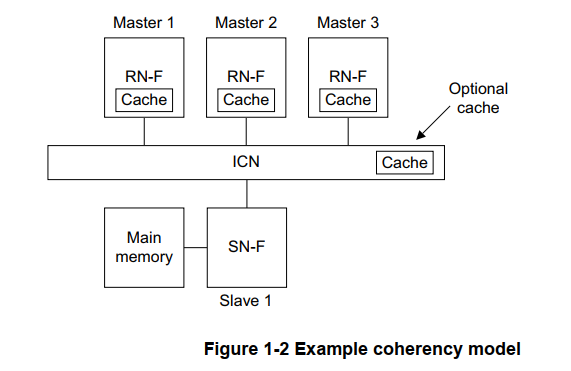

一致性模型的特点:

```
1.当某个master需要存数据时,需要先把所有其它masters的local cache数据备份失效掉,这样一致性协议可以使得所有的masters获取到任何地址的正确的数据值.在存储完成后,其它masters可以获取到新的数据到自己local cache;
2.CHI协议允许(不强求)主存的数据不是实时更新,只有在所有master的cache都不需要该数据备份时,才把数据刷新到主存中;
3.协议可以使master确定一份cacheline是否是唯一的或者存在多份拷贝.如果是唯一的,master可以直接改变它的值不需要知会系统中其它masters;如果不是唯一的,master必须使用恰当的transaction知会其它masters;
4.所有的一致性是以cacheline粒度对齐(e.g. cacheline大小为64Byte).
```

### 1.4.2 Cache state model

#### 1.4.2.1 Cache state

CHI定义的cache状态如下:

| cache state         | 描述                                                         |
| ------------------- | ------------------------------------------------------------ |
| Valid, Invalid      | Valid表示该cacheline在cache中<br />Invalid表示该cacheline不在cache中 |
| Unique, Shared      | Unique表示cacheline单独存放于该cache中<br />Shared表示其它cache中也可能存在该cacheline,但不保证一定有 |
| Clean, Dirty        | Clean表示该cache不用去更新主存数据<br />Dirty表示该cacheline数据相对于主存已经发生了改变,需要确保该cacheline数据最终更新到主存中 |
| Full, Partial, Full | Full表示cacheline全部byte有效<br />Partial表示可能只有部分byte有效,不是全部有效<br />Empty表示没有byte有效； |

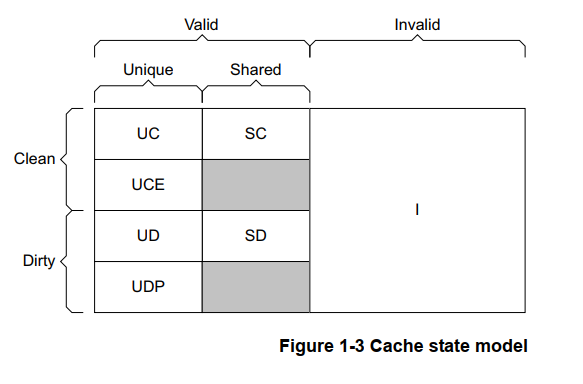

#### 1.4.2.2 Cacheline状态

```
I态:Invalid,表示该cacheline无效,cacheline的数据不在当前cache中;

UC态:Unique Clean,该cacheline的数据只在当前cache中,且和memory的数据一致.可以不知会其它RN就对该cacheline的数据进行修改.在收到snoop请求时,该cacheline不需要返回数据给HN或fwd data给其他RN;

UCE:Unique Clean Empty,该cacheline的数据只在当前cache中,但是所有的数据都是无效的,可以不知会其它RN就对该cacheline的数据进行修改.在收到snoop请求时,该cacheline不能返回数据给HN或fwd data给其他RN--->因为数据是无效的;

UD:Unique Dirty,该cacheline的数据只在当前cache中,且和memory的数据不一致,已经被修改过了.如果该cacheline的数据不用了,那需要写回到下级cache或memory,可以不知会其它RN就对该cacheline的数据进行修改.在收到snoop请求时,该cacheline必须返回数据给HN或fwd data给其他RN;

UDP:Unique Dirty Partial,该cacheline的数据只在当前cache中,且和memory的数据不一致,部分被修改且有效.如果该cacheline的数据不用了,那需要和下级cache或memory的数据merge成一个完整有效的cacheline,可以不知会其它RN就对该cacheline的数据进行修改.在收到snoop请求时,该cacheline必须返回数据给HN(HN来merge成一个完整的cacheline),但不能直接将数据fwd给Requester;

SC:Shared Clean,其它cache可能也存在该cacheline的拷贝;该cacheline可能已经被修改了(数据改变了,但是状态没改变).当不需要该cacheline数据时,cache没有义务必须将该数据写回到memory,必须对其它cache中的该cacheline进行无效后,获得U态才能将该cacheline进行改写.在收到snoop请求时,该cacheline在RetToSrc没有置位时不需要返回数据;如果RetToSrc置位,则需要返回数据,可以直接fwd数据给Requester;

SD:Shared Dirty,其它cache可能也存在该cacheline的拷贝;该cacheline相对于memory已经被修改了.当该cacheline不需要的时候,cache需要将它写回到下游cache或memory;必须对其它cache的该cacheline进行无效后,获得U态后才能将该cacheline进行改写.在收到snoop请求时,该cacheline必须返回数据给HN和fwd data给Requester.
```

#### 1.4.2.3 各状态的解析

```
1.UC态和UD态:Requester发出Read Unique后获取的是UC态(HA记录的是E态),一般数据写入该cacheline,cacheline状态就会变为UD态;
2.UCE态:
	a.Requester故意产生UCE态,在Requester对cacheline写数据前,为了节省系统带宽,Requester获得UCE态而不是UC态,就可以对该cacheline进行写操作;
	--->Requester发出CleanUnique/MakeUnique获取的是UCE态(HA记录的是E态),因为不需要数据,一旦数据写入该cacheline,cacheline状态就会变为UD态;
	b.如果Requester已经有该cacheline的拷贝(SC态),且正在申请获取写权限(获取U态),但是在获得写权限之前该数据已经被失效掉了,这样会使得该cacheline变为UCE态;---???
3.UDP态:UCE态写进行partial写就会变为UDP态;
4.SC态:Requester发出Read Shared后获取的是SC态;
5.SD态:cache1中的cacheline是UD态,Requester2发出Read Shared后获取数据是从cache1直接fwd过来的,此时cache1的cacheline状态变为SD态,cache2中的cacheline的状态变为SC态.
```

## 1.5 组件分类命名

### 1.5.1 RN---Request Node

RN(Request Node):产生协议transactions,包含读和写.进一步分类如下:

| classification | Functions                                                    |
| -------------- | ------------------------------------------------------------ |
| RN-F           | 全一致性请求节点<br />1.包含硬件一致性cache<br />2.允许产生所有协议定义的transactions<br />3.支持所有的snoop transactions |
| RN-D           | IO一致性请求节点<br />1.不包含硬件一致性cache<br />2.可以接收DVM操作<br />3.可以产生协议定义的一部分transactions |
| RN-I           | IO一致性请求节点<br />1.不包含硬件一致性cache<br />2.不能接受DVM操作<br />3.可以产生一部分协议定义的transactions<br />4.不要求具有snoop功能 |

### 1.5.2 HN---Home Node

HN(Home Node):位于ICN内,用于接收来自于RN产生的transactions.进一步分类为:

| classification | Functions                                                    |
| -------------- | ------------------------------------------------------------ |
| HN-F           | 用于接收所有的请求操作(除了DVM操作)<br />1.PoC点,通过监听RN-Fs,管理各Master一致性,完成所有的snoop响应后,发送一个响应给发出请求的RN<br />2.PoS点,用于管理多个memory请求的顺序<br />3.可能包含目录或监听过滤,以此来减少大量的snoop request |
| HN-I           | 处理有限的一部分协议定义的Request请求<br />1.PoS点,管理访问IO subsystem的顺序<br />2.不包含PoC点,也不能处理snoop请求 |
| MN             | 用于接收来自RN发送的DVM操作,完成相应的操作后返回一个响应     |

### 1.5.3 SN---Slave Node

SN(Slave Node):用于接收来自于HN的请求,完成相应的操作并返回一个响应.进一步分类为:

| classification | Functions                                                    |
| -------------- | ------------------------------------------------------------ |
| SN-F           | 1.指的是Normal memory<br />2.可以处理Non-snoop读写请求、atomic请求、以及这些命令的其它形式、CMO请求 |
| SN-I           | 1.指的是Peripheral或Normal Memory<br />2.可以处理Non-snoop读写请求、atomic操作、以及这些命令的其它形式、CMO请求 |

#### 1.5.4 各协议节点在ICN的连接

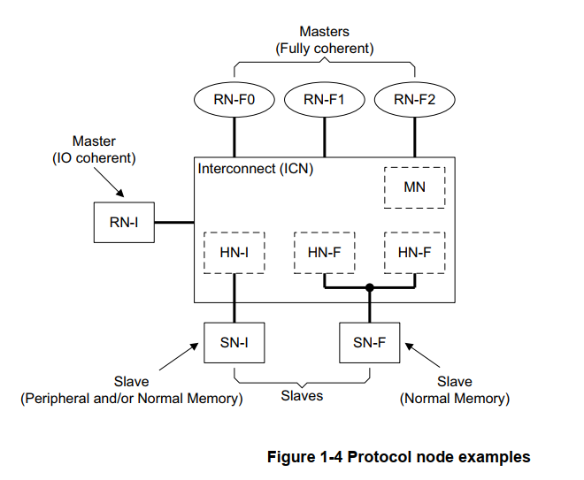

## 1.6 读数据来源

在基于CHI的系统中,读请求的数据可以来源于以下3个地方:

```
1.Cache within ICN:直接从cache中返回;
2.Slave Node:两种方式返回
	1.SN返回的读数据先发送给HN,再有HN转发给原始的Requester;
	2.DMT(Direct Memory Transfer):SN直接将数据返回给原始的Requester.
3.Peer RN-F:两种方式返回
	1.SN返回的读数据先发送给HN,再有HN转发给原始的Requester;
	2.DCT(Direct Cache Transfer):Peer RN-F直接将数据返回给原始的Requester.
		PS:DCT方式中,Peer RN-F需要通知HN它已经将数据发送给原始的Requester,某些情况下还需要将一份拷贝数据发给HN.
```

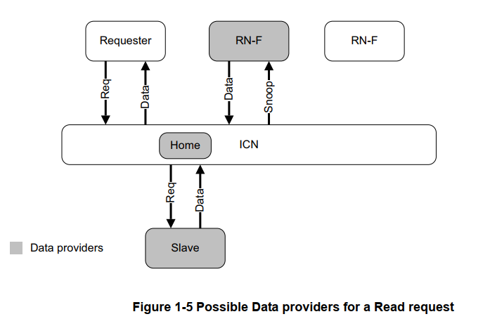

# Chapter 2 Transactions

协议层主要的东西是transactions,因此有时候也叫协议层.

transactions章节的内容主要包含:传输通道和相关重要的域段、各transaction类型的传输结构、传输响应类型、cache状态转换等.

## 2.1 传输通道

| Channel | RN channel designation                                       | SN channel designation                                       |
| ------- | ------------------------------------------------------------ | ------------------------------------------------------------ |
| REQ     | TXREQ. Outbound Request                                      | RXREQ. Inbound Request                                       |
| WDAT    | TXDAT. Outbound Data<br />Used for write data, atomic data, snoop data, forward data | RXDAT. Inbound Data.<br />Used for write data, atomic data   |
| SRSP    | TXRSP. Outbound Response.<br />Used for snoop response and completion acknowledge | —                                                            |
| CRSP    | RXRSP. Inbound Response.<br />Used for response from completer | TXRSP. Outbound Response.<br />Used for responses from the completer |
| RDAT    | RXDAT. Inbound Data.<br />Used for read data, atomic data    | TXDAT. Outbound Data.<br />Used for read data, atomic data   |
| SNP     | RXSNP. Inbound Snoop Request                                 | —                                                            |

## 2.2 各通道域段信息

### 2.2.1 Request通道域段

| Field          | Description                                                  |
| -------------- | ------------------------------------------------------------ |
| QoS            | Quality of Service priority. 总共有16个等级的QoS.            |
| TgtID          | Target ID.用于packet在ICN上的路由                            |
| SrcID          | Source ID.用于packet在ICN上的路由                            |
| TxnID          | Transaction ID. 每个SrcID发出的每个transaction都是通过TxnID进行标识,相当于transaction的身份证. |
| LPID           | Logical Process ID.用于标识Cluster内的逻辑处理器(一个Cluster可能有4个Core,每个Core用不同的ID标识). |
| ReturnNID      | Return Node ID. 表示带数据的响应应该送到的节点ID.--->还不清楚如何使用??? |
| ReturnTxnID    | Return Transaction ID.--->如何使用???                        |
| StashNID       | Stash Node ID.标识Stash的目的节点.                           |
| StashNIDValid  | Stash Node ID valid.表明StashNID是valid.                     |
| StashLPID      | Stash Logic Processor ID.标识Stash的目的逻辑处理器.          |
| StashLPIDValid | Stash Logic Processor ID valid.表明StashLPID是valid.         |
| Opcode         | Request opcode.                                              |
| Addr           | CHI支持的PA的位宽:44-bit到52-bit;支持的VA的位宽:49-bit到53-bit.<br />对于Req通道中的addr直接表示地址信息,Snp通道与Req通道存在不同. |
| NS             | Non-secure. Req通道中用于指定操作是安全还是非安全的.<br />1.Read、Dataless、Write、Atomic transaction指定设置安全或非安全;<br />2.PrefetchTgt transaction中的DVMOp和PCrdReturn中不用该域段,必须为0. |
| Size           | Data Size.决定了Req访问多少Bytes.编码如下:<br />0x0--->1Bytes;<br />0x1--->2 Bytes;<br />0x2--->4 Bytes;<br />0x3--->8 Bytes;<br />0x4--->16 Bytes;<br />0x5--->32 Bytes;<br />0x6--->64 Bytes;<br />0x7--->128 Bytes(协议中是reserved,可以自定义)<br />PS:Snp的transaction中不包含size域段,因此所有的Snp data传输的都是64 Bytes. |
| AllowRetry     | 用于Retry(重传)机制.                                         |
| PCrdType       | Protocol Credit Type.用于Retry的机制中.                      |
| ExpCompAck     | Expect CompAck.指示transaction是否需要一个Completion Acknowledge message(完成确认信息). |
| MemAttr        | 内存属性.                                                    |
| SnpAttr        | Snoop属性.                                                   |
| SnoopMe        | 指示HN(Home Node)需要决定是否要发送一个Snoop到RN.            |
| LikelyShared   | 提供一个allocation的hint给到下游cache.                       |
| Excl           | Excluvise access.排他性的访问.                               |
| Order          | Order Requirement.--->怎么使用???                            |
| Endian         | Endianness.表明data packet中的数据是小端.                    |
| TraceTag       | Trace Tag.主要用于debug、tracing、系统性能的检测.            |
| RSVDC          | User Defined.用户自定义.                                     |

### 2.2.2 Snoop通道域段

| Field          | Description                                                  |
| -------------- | ------------------------------------------------------------ |
| QoS            | Quality of Service priority. 总共有16个等级的QoS.            |
| SrcID          | Source ID.用于packet在ICN上的路由                            |
| TxnID          | Transaction ID. 每个SrcID发出的每个transaction都是通过TxnID进行标识,相当于transaction的身份证. |
| FwdNID         | Forward Node ID.表示带数据的响应应该送到的节点ID.--->还不清楚如何使用??? |
| FwdTxnID       | Forward Transaction ID. 填充Req带过来的ID.                   |
| StashLPID      | Stash Logic Processor ID.标识Stash的目的逻辑处理器.          |
| StashLPIDValid | Stash Logic Processor ID valid.表明StashLPID是valid.         |
| Opcode         | Snoop opcode.                                                |
| Addr           | Snoop request中,除了SnpDVMPOp.Add[(43-51):6]用于Snoop cacheline(Snoop以cacheline为粒度).<br />1.Addr[5:4]标识transaction要访问的critical chunk;<br />2.DVMOp操作中,Addr信息是用于携带DVM操作的相关信息;<br />3.PCrdReturn transaction的addr域段必须为0;<br />4.因为Snoop以cacheline为粒度,因此不需要size域段. |
| NS             | Non-secure. Req通道中用于指定操作是安全还是非安全的.<br />1.Read、Dataless、Write、Atomic transaction指定设置安全或非安全;<br />2.PrefetchTgt transaction中的DVMOp和PCrdReturn中不用该域段,必须为0. |
| VMIDExt        | Virtual Machine ID Extension.VMID的扩展.                     |
| DoNotGoToSD    | Do Not Go To SD state.控制Snoopee的SD状态.                   |
| DoNotDataPull  | Do Not Data Pull.用于Stash.                                  |
| RetToSrc       | Return to Source.                                            |
| TraceTag       | Trace Tag.主要用于debug、tracing、系统性能的检测.            |

### 2.2.3 Data通道域段

| Field      | Description                                                  |
| ---------- | ------------------------------------------------------------ |
| QoS        | Quality of Service priority. 总共有16个等级的QoS.            |
| TgtID      | Target ID.用于packet在ICN上的路由                            |
| SrcID      | Source ID.用于packet在ICN上的路由                            |
| TxnID      | Transaction ID.<br />dat通道中的TxnID是直接使用Resp中的DBID. |
| HomeNID    | Home Node ID.标识CompAck应该送到的节点.                      |
| DBID       | Data Buffer ID.<br />对于读操作,HN回了rdat后,如果需要再回一个Resp,此时dat通道中的DBID域段会作为回Resp中的TxnID;<br />对于写操作应该没什么用. |
| Opcode     | Data opcode.                                                 |
| RespErr    | Response Error status.指示与数据传输相关的错误状态.          |
| Resp       | Response status.指示与数据传输相关的cacheline状态.           |
| FwdState   | Forward state.指示与Forward相关的cacheline状态.              |
| DataPull   | Data Pull.--->暂时没用到....                                 |
| DataSource | Data Source.表明rdat中的数据源.                              |
| CCID       | Critical Chunk ID.标识一个transaction内的data packets.--->现在基本不关心了. |
| DataID     | Data ID.标识一个transaction内的data packets.                 |
| BE         | Byte Enable.                                                 |
| Data       | Data payload.                                                |
| DataCheck  | Data Check.对data packet进行纠错.                            |
| Poison     | Poison.                                                      |
| TraceTag   | Trace Tag.主要用于debug、tracing、系统性能的检测.            |
| RSVDC      | User Defined.用户自定义.                                     |

### 2.2.4 Response通道域段

| Field    | Description                                         |
| -------- | --------------------------------------------------- |
| QoS      | Quality of Service priority. 总共有16个等级的QoS.   |
| TgtID    | Target ID.用于packet在ICN上的路由                   |
| SrcID    | Source ID.用于packet在ICN上的路由                   |
| TxnID    | Transaction ID.将Req发过来的txnid填充进行返回给Req. |
| DBID     | Data Buffer ID.                                     |
| PCrdType | Protocol Credit Type.                               |
| Opcode   | Response opcode.                                    |
| RespErr  | Response Error status.指示与数据传输相关的错误状态. |
| Resp     | Response status.指示与数据传输相关的cacheline状态.  |
| FwdState | Forward state.指示与Forward相关的cacheline状态.     |
| DataPull | Data Pull.--->暂时没用到....                        |
| TraceTag | Trace Tag.主要用于debug、tracing、系统性能的检测.   |

## 2.3 关键域段解析

### 2.3.1 addr

CHI协议支持的地址范围:

```
PA:地址范围44-bit到52-bit;
VA:地址范围49-bit到53-bit.
```

Req和Snp packet的地址范围:

```
Req:addr[(MPA-1):0]--->MPA:max PA,Req对应的地址位宽为44-bit到52-bit;
Snp:addr[(MPA-1):3]--->MPA:max PA,Snp对应的地址位宽为41-bit到49-bit.
```

PS:Snoop request的大小是以cacheline为粒度的,因此snp通道里不包含size信息.

### 2.3.2 Memory Attribute

memattr是有EWA(Early Write Acknowledge)、Device、Cacheable和Allocate组成的.

| MemAttr[3:0] | Description                                                  |
| ------------ | ------------------------------------------------------------ |
| [3]          | Allocate hint bit. Indicates whether or not the cache receiving the transaction is recommended to allocate the transaction:<br/>0    Recommend that it does not allocate.<br/>1    Recommend that it allocates. |
| [2]          | Cacheable bit. Indicates a Cacheable transaction for which the cache, when present, must be looked up in servicing the transaction:<br/>0 Non-cacheable. Looking up a cache is not required.<br/>1 Cacheable. Looking up a cache is required. |
| [1]          | Device bit. Indicates if the memory type associated with the transaction is Device or Normal:<br/>0 Normal memory type.<br/>1 Device memory type. |
| [0]          | Early Write Acknowledge bit. Specifies the Early Write Acknowledge status for the transaction:<br/>0 Early Write Acknowledge not permitted.<br/>1 Early Write Acknowledge permitted. |

#### 2.3.2.1 EWA---Early Write Acknowledge

EWA用于指示写完成信号从哪个节点返回--->对读写均有效.

```
1.EWA置位,写完成信号可以来自中间节点(如：HN),也可以来自endpoint(最终节点),来自中间节点的完成信号必须提供同样的Comp响应来保证;
2.EWA不置位,写完成响应必须来自最终节点;
3.如果不实现EWA功能的话,写完成响应必须来自endpoint.
```

EWA置位情况与transaction类型有关:

```
1.ReadNoSnpSep、ReadNoSnp、WriteNoSnp、CMO、Atomic transaction可以采用任意值--->即不关心,均由endpoint返回完成信号;
2.除了上述的操作外的所有Read、Dataless和Write transaction必须将EWA置位;
3.在DVMOp或PcrdReturn transaction中该域段不使用,需要固定为0;
4.在PrefetchTgt中不适用,可以为任意值.
```

#### 2.3.2.2 Device

Device域段指示访问的memory属性是Device还是Normal.

**1.Device Memory Type**

Device memory type空间必须用于地址相关性的memory空间,当然用于地址不相关性的空间也允许.

访问Device memory type空间的特点:

```
1.访问Device memory type空间读使用ReadNoSnp,写使用WriteNoSnpFull/WriteNoSnpPtl;
	1.Read操作不能读到比要求更多的数据,且数据必须来自endpoint,不能来自同地址write操作的中间节点;
	2.写操作不能merge,不能将多笔访问不同地址的请求组合成一笔,也不能将访问同一个地址的多个不同请求组合
		成一个;
	3.写操作的完成信号可以来自于中间节点,但需要写数据对endpoint节点可见;
2.CMO和Atomic操作允许访问Device空间;
3.PrefetchTgt不允许访问Device空间,不关心该bit可以为任意值.
```

**2.Normal Memory Type**

Normal memory type空间只能用于地址不相关的memory空间,不能用于地址相关的memory空间.

访问Normal memory type空间的特点:

```
1.EWA的读数据可以来自同地址write操作的中间节点;
2.写操作可以被merge;
3.任何Read、Dataless、Write、PrefetchTgt、Atomic transaction类型都可以去访问Normal memory空间.
```

#### 2.3.2.3 cacheable

cacheable域段用于指示一个transaction是否需要执行cache查找.

```
1.cacheable被置位,transaction必须执行cache查找;
2.cacheable没有被置位,transaction必须访问endpoint节点.
```

cacheable域段特点:

```
1.对于任何的Device memory transaction,不能置位;
2.除了ReadNoSnpSep和ReadNoSnp,其他的Read transaction必须置位;
3.除了CMO操作,其他Dataless操作必须置位;
4.除了WriteNoSnpFull和WriteNoSnpPtl,其他的Write transaction必须置位;
5.ReadNoSnpSep、ReadNoSnp、WriteNoSnpFull、WriteNoSnpPtl访问Normal memory空间时,该域段可以为任		意值--->不关心;
6.在CMO和Atomic transactions中可以为任意值;
7.在DVMOp和PCrdReturn transaction中必须为0;
8.在PrefetchTgt中不会用到该值,可以为任意值.
```

#### 2.3.2.4 Allocate

allocate域段是cache缓存分配指示,它指示一笔transaction是否推荐缓存到cache中.

```
1.allocate置位,出于性能考虑,建议该笔transaction的数据应该被缓存到cache中,但也可以不bypass cache;
2.allocate不置位,出于性能考虑,建议该笔transaction的数据bypass cache,但其实也可以缓存到cache中.sa
```

allocate域段特点:

```
1.cacheable被置位的transaction,allocate可以被被置位;
2.WriteEvictFull操作必须置位,如果WriteEvictFull的allocate没有被置位,RN会将其转换为Evict操作;
3.Device memory transaction不能置位;
4.Normal memory中的Non-cacheable transaction不能置位;
5.DVMOp、PCrdReturn和Evict操作中不使用该域段,但必须设置为0;
6.PrefetchTgt不使用该域段,可以为任意值.
```

### 2.3.3 LikelyShared

LikelyShared是一种cache分配指示.在置位时指示requested data可能在其它RN节点中也共享着.是为了性能提供的一种指示作用.

LikeyShared的特点:

```
1.可以被置位包含的请求:ReadClean、ReadNotSharedDirty、ReadShared、StashOnceUnique、
	StashOnceShared、WriteUniquePtl、WriteUniqueFull、WriteUniquePtlStash、
	WriteUniqueFullStash、WriteBackFull、WriteCleanFull、WriteEvictFull,除此之外的其他Read
	和Write操作不能被置位;
2.Dataless和Atomic操作中不能被置位;
3.DVMOp和PCrdReturn transaction中不使用该域段,但需要设置为0;
4.PrefetechTgt transaction中不使用该域段,可以为任意值.
```

### 2.3.4 Snoop Attribute

Snoop Attribute(SnpAttr)指示一笔transaction是否需要snoop,有Non-snoopable和Snoopable两种.

| SnpAttr | Snoop attribute |
| ------- | --------------- |
| 0       | Non-snoopable   |
| 1       | Snoopable       |

不同的transaction的snoop属性:

| Transaction                                                  | Non-snoopable | Snoopable |
| ------------------------------------------------------------ | ------------- | --------- |
| ReadNoSnp, ReadNoSnpSep                                      | Y             | -         |
| ReadOnce*, ReadClean, ReadShared, ReadNotSharedDirty, ReadUnique | -             | Y         |
| CleanUnique, MakeUnique, StashOnce                           | -             | Y         |
| CleanShared, CleanSharedPersist, CleanInvalid, MakeInvalid   | Y             | Y         |
| Evict                                                        | -             | Y         |
| WriteNoSnp                                                   | Y             | -         |
| WriteBack, WriteClean, WriteEvictFull                        | -             | Y         |
| WriteUnique                                                  | -             | Y         |
| Atomic transactions                                          | Y             | Y         |
| DVMOp                                                        | 必须设置为0   |           |
| PrefetchTgt                                                  | 可以为任意值  |           |

PS:HN发送给SN的CMO、ReadNoSnpSep和ReadNoSnp的SnpAttr域值必须设置为0.

### 2.3.5 Transaction attribute combinations

transaction属性组合是由memattr、snpattr、likelyshared、order等域段组合而成.

```
有时会出现nGnRnE:
G:Gathering--->表示多个memory的访问是否可以合并;
R:Re-ordering--->表示内存访问指令的重排;
E:Early Write Acknowledgement.参考"2.3.2.1".
```

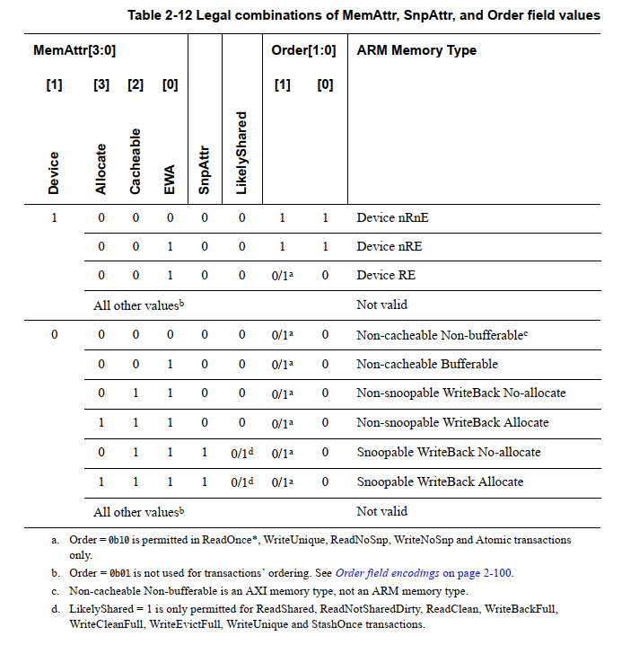

#### 2.3.5.1 Device nRnE

特点:

```
1.写响应必须从最终节点获得;
2.读数据必须从最终节点获得;
3.读数据不能得到比预期要求的更多;
4.读操作不能被预取;
5.写操作不能被merged;
6.写操作不能写大于原始transaction的地址范围;
7.来自同源的所有读和写transaction去往同一个endpoint必须要保序.
```

#### 2.3.5.2 Device nRE

特点:

```
1.写响应可以从中间节点获得--->此条与Device nRnE不一样;
2.读数据必须从最终节点获得;
3.读数据不能得到比预期要求的更多;
4.读操作不能被预取;
5.写操作不能被merged;
6.写操作不能写大于原始transaction的地址范围;
7.来自同源的所有读和写transaction去往同一个endpoint必须要保序.
```

#### 2.3.5.3 Device RE

特点:

```
1.写响应可以从中间节点获得--->此条与Device nRnE不一样;
2.读数据必须从最终节点获得;
3.读数据不能得到比预期要求的更多;
4.读操作不能被预取;
5.写操作不能被merged;
6.写操作不能写大于原始transaction的地址范围;
7.来自同源的读和写transaction发往同一个endpoint不需要保序--->不一样;
8.来自同源的读和写transaction发往有交叠地址的需要保序.
```

#### 2.3.5.4 Normal Non-cacheable Non-bufferable

特点:

```
1.写响应必须来自最终节点;
2.读数据必须来自最终节点;
3.写操作可以被merged;
4.同一个源的读和写transactions发往有交叠地址的需要保序.
```

#### 2.3.5.5 Normal Non-cacheable Bufferable

特点:

```
1.写响应可以从中间节点返回;
2.写transaction必须对最终节点及时可见,但没有机制能够决定何时写transaction可以被最终节点可见;
3.读数据可以从几个地方获取:
	1.最终节点;
	2.正在发往最终节点的写transaction,如果数据是从写transaction中获得,那么它必须来自最近的写transaction,
		而且数据不能被后期读缓存起来.
4.写操作可以被merged;
5.同一个源的读和写transactions发往有交叠地址的需要保序.
```

#### 2.3.5.6 Write-back No-allocate

特点:

```
1.写响应可以从中间节点返回;
2.写transaction不要求对最终节点可见;
3.读数据可以从中间cahce获得;
4.读操作可以prefetch预取;
5.写可以被merged;
6.读和写transaction需要查找cache;
7.同一个源的读和写transactions发往有交叠地址的需要保序;
8.No-allocate只是一种cache分配暗示,为了性能考虑,建议不缓存到cache中,但是也可以被allocate到cache中.
```

#### 2.3.5.7 Write-back Allocate

特点:

```
1.写响应可以从中间节点返回;
2.写transaction不要求对最终节点可见;
3.读数据可以从中间cahce获得;
4.读操作可以prefetch预取;
5.写可以被merged;
6.读和写transaction需要查找cache;
7.同一个源的读和写transactions发往有交叠地址的需要保序;
8.Allocate只是一种cache分配暗示,为了性能考虑,建议缓存到cache中,但是也可以不allocate到cache中.
```

### 2.3.6 dataid

dataid域段是以16 B为单位,即每隔16 Byte dataid的值需要加1.与addr[~:4]对应.

| dataid | data width(128-bit)      | data width(256-bit)      | data width(512-bit)    |
| ------ | ------------------------ | ------------------------ | ---------------------- |
| 0x0    | data[127:0]--->16 Byte   | data[255:0]--->32 Byte   | data[511:0]--->64 Byte |
| 0x1    | data[255:128]--->16 Byte | reserved                 | reserved               |
| 0x2    | data[383:256]--->16 Byte | data[511:256]--->32 Byte | reserved               |
| 0x3    | data[511:384]--->16 Byte | reserved                 | reserved               |

```
对于req中的size可以达到128Byte,甚至于256Byte的情况,此时dataid的值为:
1.对于req中的size为64 Byte,data的值为0x4;
2.对于req中的size为128 Byte,data的值为0x0和0x4;
3.对于req中的size为256 Byte,data的值为0x0、0x4、0x8、0xC(每个表示64 Byte).
```

### 2.3.7 Request Retry

为了防止request transactions将req通道堵住,CHI协议提供了一种request retry机制.当Completer无法接收request transaction时,可以发RetryAck响应.除了PrefetchTgt和PCrdReturn,其它命令都可以被Retry.

特点:

```
1.除了PrefetchTgt,Requester需要记录所有已发送的request(因为需要确保收到RetryAck时重新再次发送该req);
2.除了PrefetchTgt,其他的request需要将allowretry域段置位,即允许retry;
3.Completer通常是在没有足够空间来存放当前的request transaction时,才会对request进行retry.如果
	earlier transactions完成并释放了资源,就可以发送PCrdGrant响应告知request重新发送request;
4.Requester收到PCrdGrant后,重发reques时不能将allowretry域段置位,因为该request一定可以保证能被接收;
5.由于ICN可能reorder PCrdGrant和RetryAck,会导致Requester先收到PCrdGrant后收到RetryAck,Requester
	需要记录已经收到的P-Crdit,当收到RetryAck后才能发该请求;
6.P-Credit和transaction之间没有固定的关系.如果Requester收到多个RetryAck,但只收到一个PCrdGrant,
	Requester可以自由选择一个被retry的transaction来消耗这个P-Credit;
7.Requester重新发送请求时,需要注意的域段总结:
	AlloRetry不能置位;
	PCrdType必须设置为Retry response中的值.
```

retry的流程图:

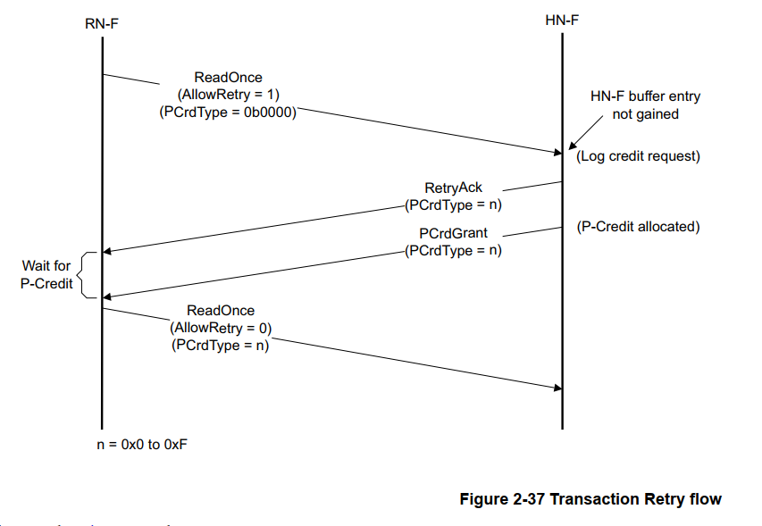

## 2.4 Transaction Structure

根据transaction的不同可以分类为:Read、Dataless、Write、Atomic、Other、Snoop等.

### 2.4.1 Read Transactions

#### 2.4.1.1 Snoop reads excluding ReadOnce

除了ReadOnce之外,snoopable读操作如下:

```
ReadClean
ReadNotSharedDirty
ReadShared
ReadUnique
PS:ReadOnce类的(ReadOnce,ReadOnceCleanInvalid,ReadOnceMakeInvalid)的保序和CompAck与上面的不一样,后面单独描述.
```

snoopable读操作通常是RN-F发出,用于获取其它RN或SN的数据,该数据会被cache所缓存.
根据数据来源的不同可以分为以下三类:

**1.Read transaction structure with DMT**

DMT(Direct Memory Transfer)用于当数据可以直接从SN发送给原始Requester,传输结构如下图:

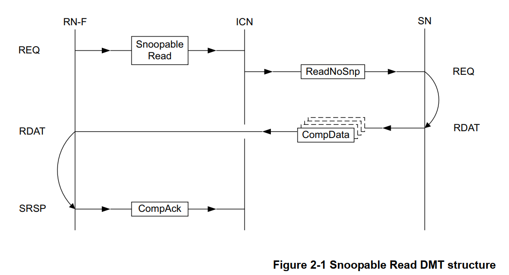


需要遵循的原则如下:

```
1.Completer必须收到读请求后,才能发送相应的CompData;
2.Requester必须收到至少一个CompData后,才能发送CompAck.在issueC之前,是必须全部收到数据包后,才能发送;
3.必须所有带txnid的Response都返回后,Requester才能重复利用该txnid;
4.HN只有满足以下条件才能发送DMT请求给SN-F:
	1.Snoop请求不需要发送;
	2.如果snoop请求已经发送了,所有的snoop响应都已经回来,且没有Dirty数据;
	3.如果snoop响应包含有Partial Dirty数据,Partial Dirty数据必须写到SN-F,且收到completion响应后,HN才能发送DMT请求;
	4.如果是Forwarding类型的snoop请求,只有没有forward传输给Requester,HN才允许发送DMT请求.
5.HN可以同时使能DMT和DCT,但是必须等DCT响应回来后,才能发送DMT请求给SN-F.
```

**2.Read transaction structure with DCT**

DCT(Direct Cache Transfer)用于被snoop的RN-F可以直接返回数据给原始Requester,传输结构如下图:

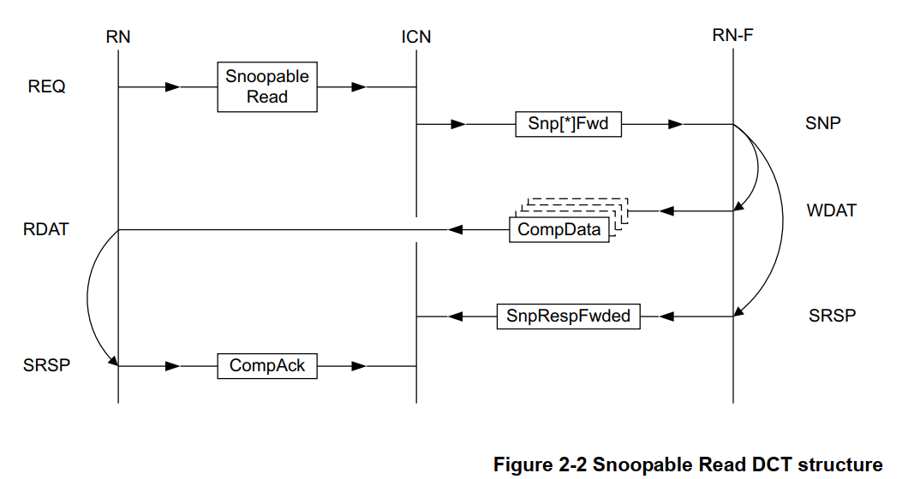

需要遵循的原则如下:

```
1.Completer必须收到snoop请求后,才能发送CompData;
2.Requester必须收到至少一个CompData后,才能发送CompAck.在issueC之前,是必须全部收到数据包后,才能发送.
```

**3.Read transaction structure without Direct Data Transfer**

除了DMT和DCT,read transaction中的数据可以由HN提供,传输结构如下图:

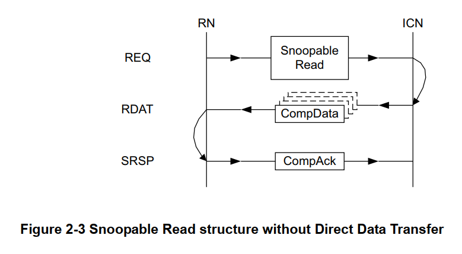

需要遵循的原则如下:

```
1.Requester必须收到至少一个CompData后,才能发送CompAck.在issueC之前,是必须全部收到数据包后,才能发送.
```

#### 2.4.1.2 ReadNoSnp, ReadOnce

ReadNoSnp和ReadOnce两者都有可选的保序需求和可选的CompAck.

```
1.保序:ReadNoSnp和ReadOnce要求具有保序功能(order域段被置上),HN需要确保当前保序transaction对于后续的保序transactions
	是可见的;
2.CompAck:ReadNoSnp和ReadOnce将ExpCompAck置位,那么它们将支持DMT和分离的Comp与Data响应.
```

ReadNoSnp和ReadOnce的区别:

```
1.ReadNoSnp不会去snoop其它master,只是简单的执行读传输流程,所获得的数据可以直接来自SN,也可以来自ICN;
2.ReadOnce需要去snoop其它master,但是Requester不会缓存该数据,同样它所获得的数据可以直接来自SN,也可以来自ICN.
```

**1.ReadNoSnp and ReadOnce structure with DMT**

传输结构如下图:

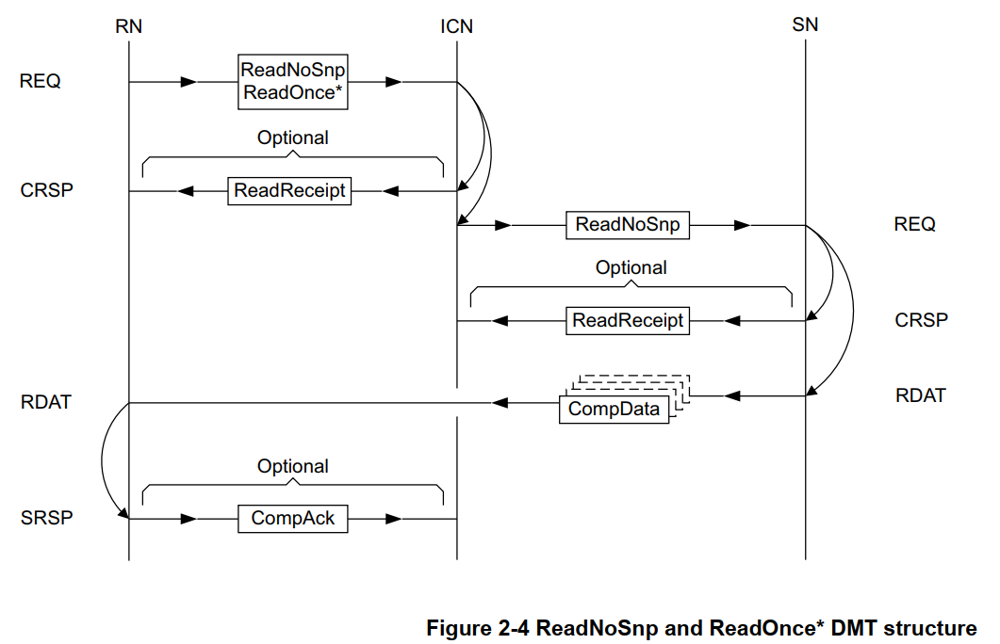

需要遵循的原则如下:

```
1.如果Requester置起order域,那么HN必须通过CRSP通道返回ReadReceipt,表示保序已经在HN上建立;
2.如果HN往SN发送ReadNoSnp操作时置起order域,那么SN也需要返回ReadReceipt表示该笔transaction已经接收,不会被Retry了;
3.使用DMT的ReadNoSnp和ReadOnce命令在HN上的生命周期可以通过SN发送的ReadReceipt来缩短,即HN收到ReadReceipt后,就可以提前
	释放这些命令的资源,不需要等到后续的CompAck.
```

**2.ReadOnce structure with DCT**

传输结构如下图:

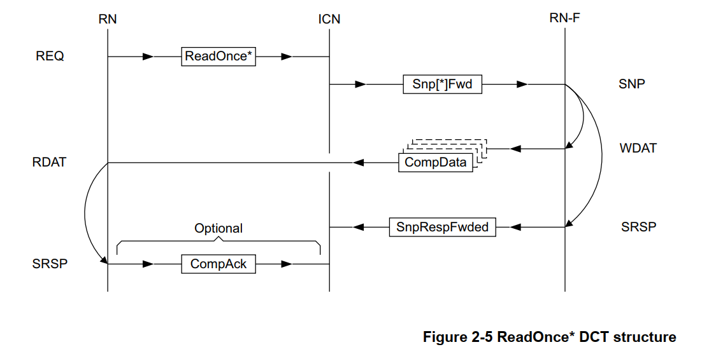

需要遵循的原则如下:

```
1.ReadNoSnp不需要snoop transaction,所以就没有DCT说法了;
2.ReadOnce DCT传输需要被snoop的RN返回response表示当前DCT是否成功进行.
```

**3.ReadNoSnp and ReadOnce structure without Direct Data transfer**

传输结构如下图:

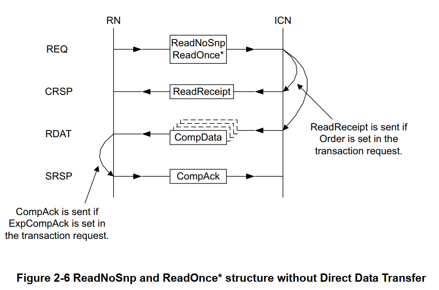

需要遵循的原则如下:

```
1.ReadReceipt必须在相应的请求接收后才能发送,返回ReadReceipt和CompData之间的顺序无要求;
2.CompData必须在响应的请求接收后才能发送;
3.CompAck必须在requester接收至少一个CompData之后才能发送,Requester发送CompAck可以不需要等待ReadReceipt;
4.Completer发送ReadReceipt不能等待CompAck.
```

**4.order、CompAck、DMT、DCT对ReadNoSnp和ReadOnce的影响**

| order[1:0] | ExpCompAck | DMT  | DCT  | Notes                                                        |
| ---------- | ---------- | ---- | ---- | ------------------------------------------------------------ |
| 0b00       | 0          | Y    | Y    | 不需要通知HN该transaction是否结束.对于DMT,HN必须获得ReadReceipt响应,确保SN不会Retry该transaction |
| 0b00       | 1          | Y    | Y    | 不需要通知HN该transaction是否结束.对于DMT,HN可以通过的SNReadReceipt或RN的CompAck知道该transaction是否被Retry |
| 0b01       | -          | -    | -    | Not permitted                                                |
| 0b10或0b11 | 0          | N    | Y    | 对于DCT,HN通过SnpRespFwded或SnpRespDataFwded响应来决定该transaction的结束 |
| 0b10或0b11 | 1          | Y    | Y    | 对于DMT,HN使用CompAck来决定该transaction结束.<br />对于DCT,HN使用SnpRespFwd或SnpRespDataFwd响应来决定该transaction结束 |

#### 2.4.1.3 Read with separate Non-data and Data-only responses

从issueC开始,对于所有的读类型transaction.CHI支持分离的来自HN的non-data response和来自HN或SN的Data-only response.但下列transaction不支持该特性:

```
Atomic transactions
Exclusive tranctions
Ordered ReadNoSnp and ReadOnce* transactions without CompAck
PS:该特性主要针对ReadNoSnp和ReadOnce请求类型.
```

分离的Non-data和Data-only响应有以下两种方式:

**1.Comp来自HN,Data来自SN**

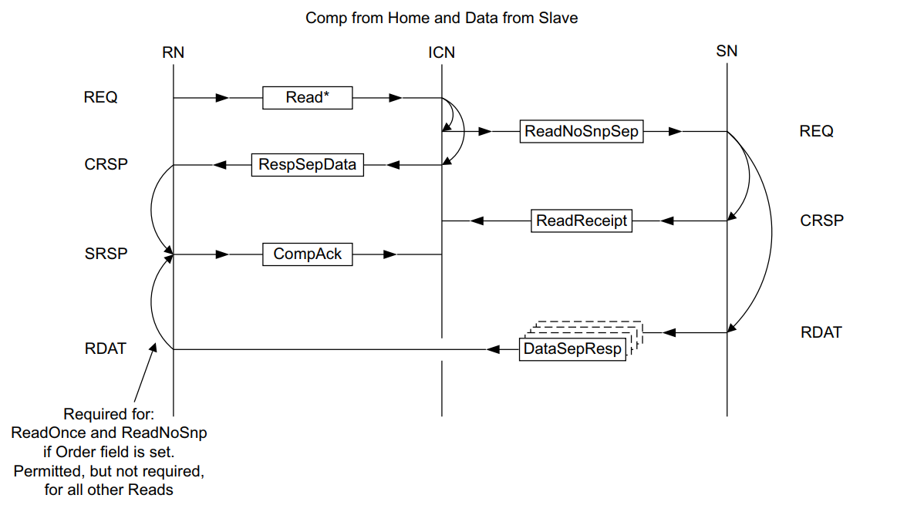

**2.Comp和Data都来自HN**

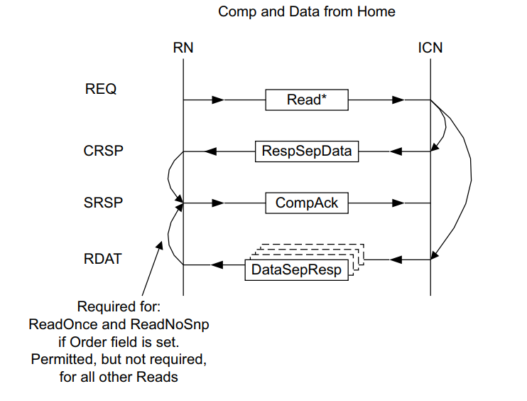

PS:对于非保序的带CompAck的ReadOnce*和ReadNoSnp命令,requester发送CompAck不需要等待DataSepResp.

**3.分离的Comp和Data响应需要遵循的原则**

```
1.DataSepResp和RespSepData必须在completer接收到相应的请求后才能发送,RespSepData只能由HN发送,DataSepResp可以由SN或
	HN发送;
2.在ReadNoSnp和ReadOnce*中,对于无保序的请求,CompAck可以不等待data返回就发送;对于有保序的请求,CompAck必须等待data返回
	后才发送;
3.Completer不能等待收到CompAck后才发送Data;
4.ReadNoSnpSep必须在HN收到所有的Snoop响应后,由HN发往SN;SN在收到ReadNoSnpSep后,必须返回Readreceipt,表明该笔
	transaction不会被retry;
5.SN不能发送分离的comp响应给HN,对于保序的ReadOnce*和ReadNoSnp请求,HN通过收到CompAck可以知道该transaction已经结束;
6.对于保序的ReadOnce和ReadNoSnp命令,如果采用分离的Comp和Data响应,HN不能发送ReadReceipt响应给requester,因为HN发送
	的RespSepData响应已经蕴含了ReadReceipt;
7.在所有可以使用分离回data和comp响应的地方,也都可以使用CompData响应.
```

### 2.4.2 Dataless Transactions

Dataless transactions的主要功能如下:

```
1.获取对cache的写权限,主要的req:CleanUnique、MakeUnique;
2.cache维护(即CMO操作),主要的req:CleanShared、CleanSharedPersist、CleanInvalid、Makeinvalid;
3.更新snoop filter的状态,主要的req:Evict;
4.将数据移到更接近的地方,方便可预见的将来使用,主要的req:StashOnceUnique、StashOnceShared.
```

传输结构如下图:

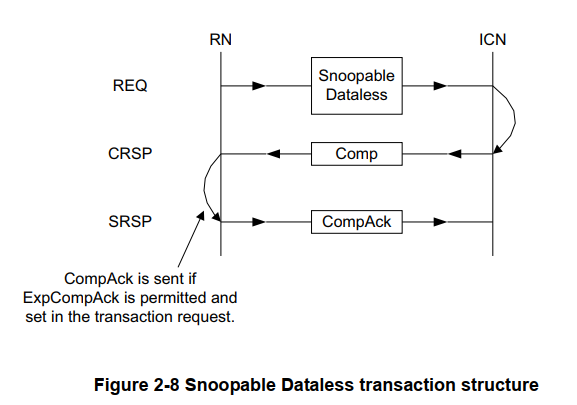

需要遵循的原则如下:

```
1.Completer必须在收到dataless请求后,才能发送Comp;
2.Requester必须在收到Comp后,才能发送CompAck;
3.CleanUnique、MakeUnique一定需要置起ExpCompAck,此时Requester在收到Comp后需要发送CompAck;
4.CleanShared、CleanSharedPersist、CleanInvalid、Makeinvalid、Evict、StashOnceUnique、StashOnceShared等请求
	不能置ExpCompAck,因此Requester收到Comp后也不需要回CompAck.
```

### 2.4.3 Write Transactions

#### 2.4.3.1 WriteNoSnp

当对某个地址进行写操作,且不需要监听其它master是否有该地址的数据时,可以用WriteNoSnp命令.

```
1.对于WriteNoSnp req,completer可以返回CompDBID,也可以将Comp和DBID分开返回;
2.Comp表示该transaction可以被其它Requester观察到,DBID表示该Completer有足够data buffer接收写数据;
3.WriteNoSnp包含的请求:WriteNoSnpPtl, WriteNoSnpFull.
```

传输结构如下图:

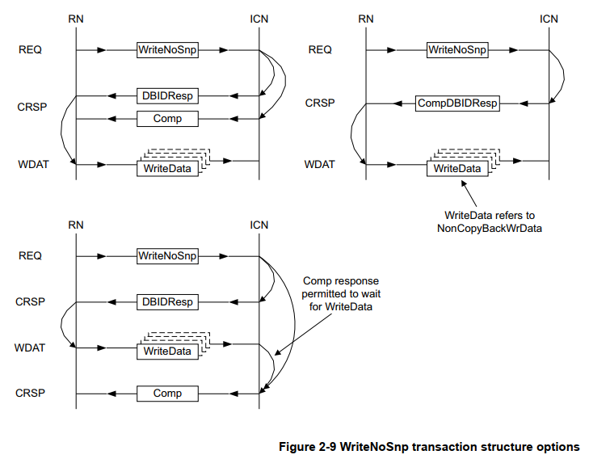

需要遵循的原则如下:

```
1.分离的DBID和Comp,或者CompDBID都必须在Completer收到相应的请求后,才能由Completer发送;
2.Reuqester只有在收到CompDBID或DBIDResp后,才能发送写数据;
3.如果Comp和DBID分开发送,Requester等到DBIDResp后,就需要发送写数据,不能等到Comp之后才发送;DBIDResp和Comp对于Requester的接收和Completer的发送都是in any order(即可以乱序发送或接收);
4.Completer允许在收到WriteData后才发送Comp响应.
```

#### 2.4.3.2 WriteUnique

当对某个地址进行写操作,且需要监听其它master时,可以使用WriteUnique命令.

```
1.riteUnique命令可以使用分离的Comp和DBID响应,或CompDBID响应;
2.如果ExpCompAck域段置位,那么WriteUnique需要发送CompAck来结束命令;
3.issueC开始,有一个取巧方式是CompAck和Data可以组合为NCBWrDataCompAck一块发送,省的发两次.
	PS:NCBWriteDataCompAck需要等到DBID和Comp都收到才能发送.
```

传输结构如下图:

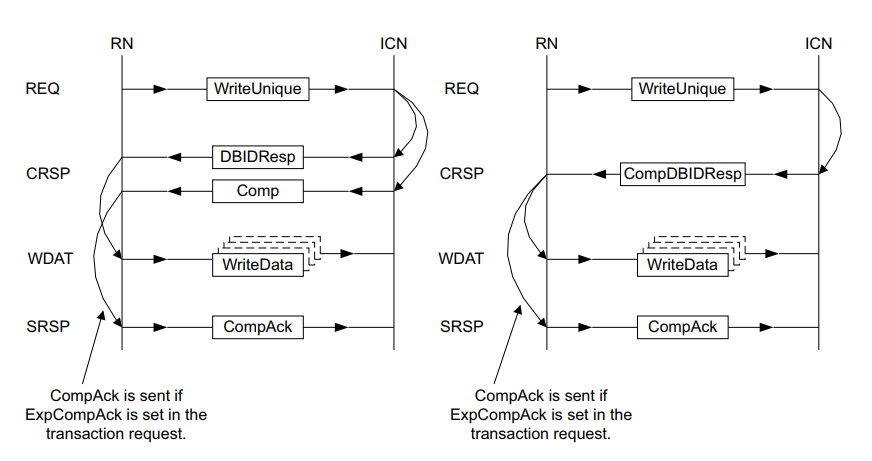

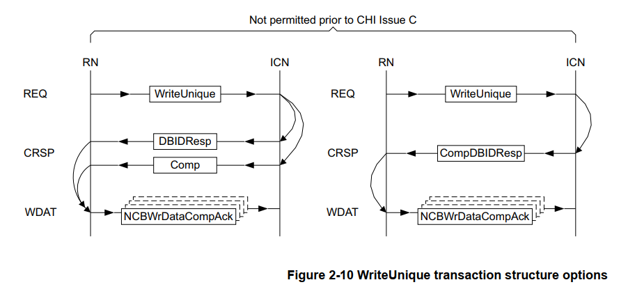

需要遵循的原则如下:

```
1.分离的DBID和Comp,或者CompDBID都必须在Completer收到相应的请求后,才能由Completer发送;
2.Reuqester只有在收到CompDBID或DBIDResp后,才能发送写数据;
3.如果Comp和DBID分开发送,Requester等到DBIDResp后,就需要发送写数据,不能等到Comp之后才发送;DBIDResp和Comp对于Requester的接收和Completer的发送都是in any order(即可以乱序发送或接收);
4.WriteUnique中Completer不能在等到WriteData后才发送Comp响应.这样回面临死锁风险:
	比如:Data是以NCBWrDataCompAck的形式返回:
	1.Requester发送NCBWrDataCompAck需要收到DBID和Comp,因此需要等待Completer发送的Comp;
	2.Completer如果发送Comp需要等待Requester发送的Data(即NCBWrDataCompAck),就造成等待死锁.
5.Requester必须在收到Comp或CompDBIDResp后才能发送CompAck.
```

#### 2.4.3.3 CopyBack

CopyBack操作包括WriteBackFull、WriteBackPartial、WriteCleanFull、WriteEvcitFull(WriteClean和WriteEvict没有partial操作).

```
1.除了WriteEvictFull命令,CopyBack操作通常用于更新主存或下游cache;
2.WriteEvictFull单单用于更新下游cache,该命令产生的效果不会超过它的snoop domain.
```

传输结构如下图:

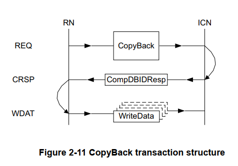

需要遵循的原则如下:

```
1.Comp和DBID必须一起返回,即为CompDBIDResp;
2.Requester收到CompDBIDResp后,表明Completer可以接收该命令的,而且在该命令结束前,不会接收到同地址的snoop命令.
```

### 2.4.4 Atomic Transactions

Atomic操作可以分为两类:

```
1.一类是返回只有completion响应(即只有DBID+Comp(合并或分开)),e.g. AtomicStore;
2.一类是返回有completion和Data响应(即有DBID+CompData),e.g. AtomicLoad/AtomicSwap/AtomicCompare;
3.Atomic总共就4个操作:AtomicStore、AtomicLoad、AtomicSwap、AtomicCompare.
```

传输结构如下图:

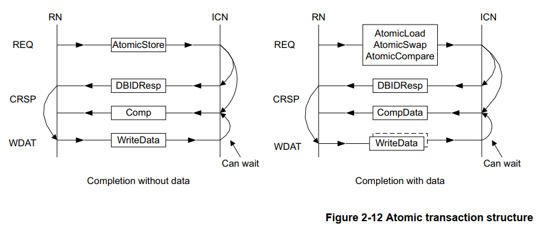

需要遵循的原则如下:

```
1.对于AtomicStore操作,允许Completer分开返回DBID和Comp响应,或组合的CompDBID;
2.对于AtomicLoad/AtomicSwap/AtomicCompare操作,Completer只能返回DBIDResp,Comp是通过CompData返回的;
3.图中的can wait表示completer允许等到Data之后再发送Comp,这样做的话,就是使用Comp来传递原子操作结果或数据接收是否有错误;
4.Requester在收到DBIDResp或CompDBIDRes之后,就可以发送Data,不能等CompData或Comp响应;
5.Completer在返回read data时可以采用两种方式--->针对AtomicLoad/AtomicSwap/AtomicCompare:
	1.在收到命令之后的任何节点返回Read data;
	2.直到收到所有的write data之后再返回read data.
```

Atomic操作的self-snoop--->在Atomic操作中,CHI协议允许Requester对自己进行self-snooping.

```
1.如果SnoopMe域段置位,则允许self-snooping;
2.如果RN在发送Atomic操作之前无法失效掉自己的cacheline的话,则需要self-snooping,主要目的:
	1.失效掉自己的cache line拷贝;
	2.如果cache line是Dirty,则获取一份拷贝;
3.HN收到SnoopMe置位的Atomic操作时,如果Requester里该cache line有数据,则必须发送snoop请求,反之可以不需要;如果SnoopMe为0,
	则不能发送snoop给Requester;
4.HN发送给Requester的snoop命令可以是SnpUnique或SnpCleanInvalid;
5.如果Atomic命令的SnoopMe置位,则RN可以同时并行发送同地址的CopyBack命令和Atomic操作,不需要等待同地址的其中某个操作完成后再
	发送下一个.
```

### 2.4.5 Miscellaneous request types(混杂的请求类型)

混杂的transaction主要包含以下2种:

```
1.DVM;
2.PrefetchTgt.
```

#### 2.4.5.1 DVM

DVM是Distributed Virtual Memory的缩写.

传输结构如下图:

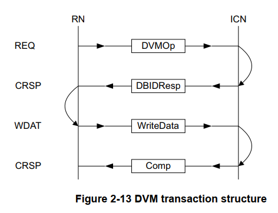

需要遵循的原则如下:

```
1.Completer必须收到相应的请求命令后才能发送DBIDResp;
2.Requester必须收到DBIDResp之后才能发送WriteData;
3.Completer必须收到Data后才能发送Comp响应.
```

#### 2.4.5.2 PrefetchTgt

PrefetchTgt是由RN直接发给SN,SN收到该命令可以采用两种做法:

```
1.去主存取数据,并将数据缓存起来,等待接下来同地址的读请求;
2.直接将命令丢弃掉,不做任何处理.
```

传输结构如下图:

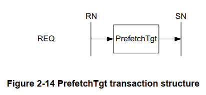

需要遵循的原则如下:

```
1.Requester在发送完PrefetchTgt命令后,马上释放资源;
2.SN不会将PrefetTgt命令retry;
3.SN可以将PrefetchTgt命令丢弃掉,不做任何处理.
```

### 2.4.6 Transaction Retry sequence

retry的特点:

```
1.除了PCrdReturn和PrefetchTgt命令,其它request命令都可以被retry;
2.Request命令第一次发送时是不带Protocol Credit（P-Credit）;
3.如果该命令不能被Completer接收,Completer必须发送RetryAck响应表明暂时无法接收该命令,等到有合适的Credit后再发;
4.当Completer可以接收的话,发送PCrdGrant响应给Requester.
```

CHI协议允许Requester决定被retry的命令是否重发.

#### 2.4.6.1 Retry sequence

Requester决定被retry的命令重发,此时必须携带PCrdGrant的Credit,确保该命令肯定能被接收.

传输结构如下图:

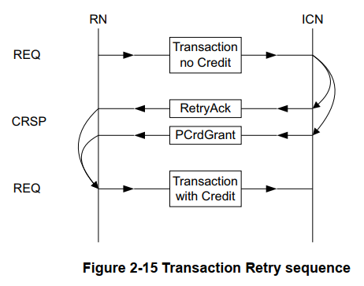

需要遵循的原则如下:

```
1.Completer必须收到相应的请求命令后才能发送RetryAck;
2.Completer必须收到相应的请求命令后才能发送PCrdGrant;
3.Completer发送和Requester接收的RetryAck和PCrdGrant之间的顺序没有要求;
4.Requester必须收到RetryAck和PCrdGrant之后,才能重新发送带Credit的transaction.
```

#### 2.4.6.2 Not retrying a transaction

如果Requester在收到RetryAck和PCrdGrant后,并不想重新发送被retry的transaction,可以使用PCrdReturn命令将P-Credit返回给Completer,这样相当于发了一笔空操作.

传输结构如下图:

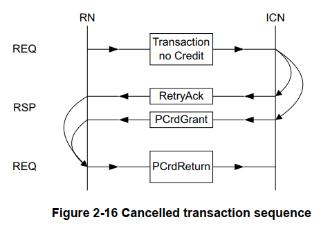

### 2.4.7 Snoop transactions

Snoop操作是由HN发给RN的transaction,交互方式分为:

```
1.如果是RN-F(e.g. L3)需要接收所有的Snoop transaction;
2.如果是RN-D(e.g. SMMU)要只接收SnpDVMOp transaction;
3.RN-F和RN-D在收到snoop request(除了DVMOp Sync)时,必须要及时返回snoop响应,不能和其它oustanding requests有任何的
	完成依赖关系.
```

Snoop transaction的传输结构分为几种:

```
1.Snoop with response to Home
2.Snoop with Data to Home
3.Snoop with Data return to Requester and response to Home
4.Snoop with Data return to Requester and Data to Home
5.Snoop DVM operation and response to Misc Node
```

Snoop transaction也可用于Stash类型的传输,分为:

```
1.Stashing snoop with Data from Home
2.Stashing snoop with Data using DMT
```

#### 2.4.7.1 Snoop with response without Data to Home

RN在收到Snoop请求后只需要回SnpResp即可,SnpResp是不携带数据的response.

传输结构如下图:

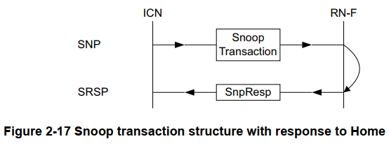

需要遵循的原则如下:

```
RN必须在收到相应的Snoop请求后才能发送SnpResp响应.
```

#### 2.4.7.2 Snoop with response with Data to Home

RN在收到Snoop请求后需要回SnpRespData,SnpRespData是携带数据的response.

该种类型的snoop请求包含如下几种:

```
1.SnpOnceFwd,SnpOnce
2.SnpCleanFwd,SnpClean
3.SnpNotSharedDirtyFwd,SnpNotSharedDirty
4.SnpSharedFwd,SnpShared
5.SnpUniqueFwd,SnpUnique
6.SnpCleanShared
7.SnpCleanInvalid
```

传输结构如下图:

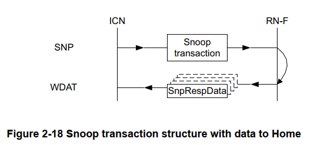

需要遵循的原则如下:

```
1.RN可以通过SnpRespData和SnpRespDataPtl响应返回数据;
2.同样的SnpRespData*只有在RN收到相应的snoop请求后才能发送.
```

#### 2.4.7.3 Snoop with Data forwarded to Requester without or with Data to Home

RN收到此种Snoop请求的处理流程如下:

```
1.Snoop的RN将forward数据通过CompData opcode走WDAT通道返回给Requester;
2.因为forward是DCT传输,被snoop的RN需要通知HN是否DCT成功,有两种方式:
	1.被snoop RN单单只回通过SRSP通道将SnpRespFwded opcode告知HN;
	2.被snoop RN将数据和响应都都回给HN,此时通过WDAT通道将SnpRespDataFwded opcode告知HN.
```

传输结构如下图:


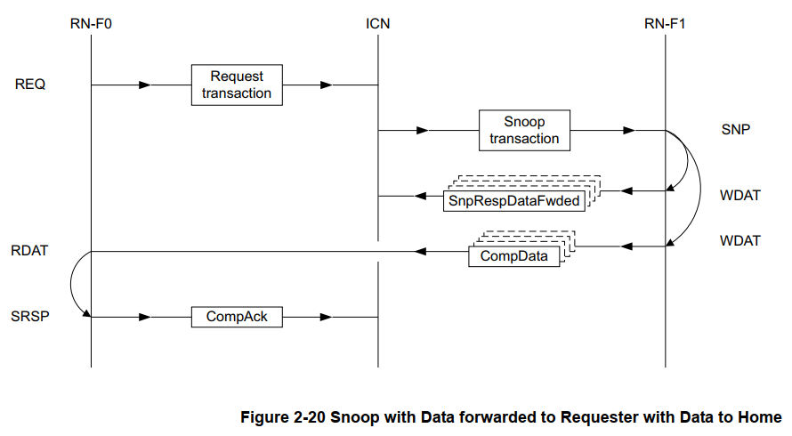

需要遵循的原则如下:

```
1.被snoop的RN只有在收到相应的snoop请求后,才能发送SnpRespFwded或SnpRespDataFwded响应,CompData同理;
2.被snoop的RN发SnpRespDataFwded或SnpRespFwded与CompData可以为任何顺序;
3.Requester只有收到Data的第一笔数据后,才能发送CompAck.
```

#### 2.4.7.4 Stash Snoop

Stash Snoop当前使用的主要包含2种请求类型:

```
SnpUniqueStash
SnpStashShared
```

**1.SnpUniqueStash**

传输结构如下图:

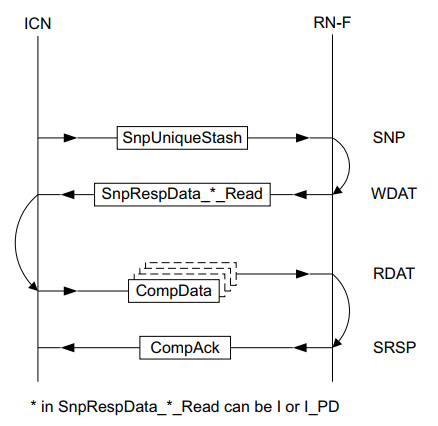

需要遵循的原则如下:

```
1.SnpUniqueStash发到RN后,由于是Unique操作,RN需要将数据返回给HN,此时其opcode为:SnpRespData;
2.RN在回SnpRespData中,同时蕴含读操作,因此其opcode最终为:SnpRespData_Read;
3.后续的步骤就是读操作的步骤.
```

**2.SnpStashShared**

传输结构如下图:

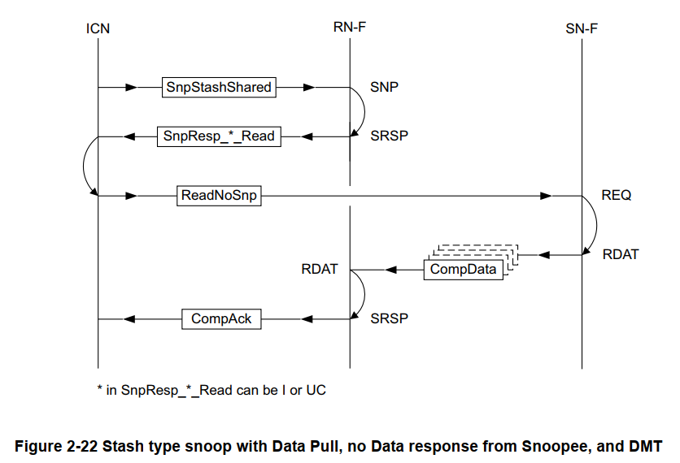

需要遵循的原则如下:

```
1.SnpStashShared发到RN后,由于是Shared操作,RN不需要将数据返回给HN,此时其opcode为:SnpResp;
2.RN在回SnpResp中,同时蕴含读操作,因此其opcode最终为:SnpResp_Read;
3.HN采用DMT的方式向RN-F提供读数据,因此提供数据的流程为:
	1.HN发ReadNoSnp给SN(e.g. memory);
	2.SN通过RDAT将CompData返回给RN;
	3.RN负责回一个CompAck给到HN,表示操作结束.
```

#### 2.4.7.5 Snoop DVMOp

传输结构如下图:

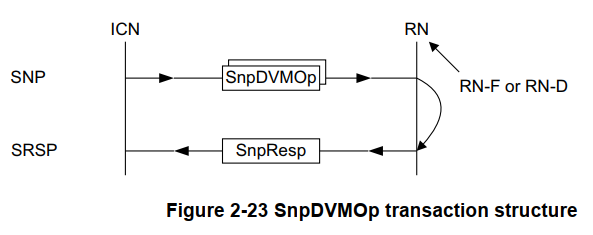

需要遵循的原则如下:

```
1.ICN需要发送两个opcode为SnpDVMOp的snoop request;
2.被snoop的RN需要接收到两个snoop请求后,才能发送SnpResp响应.
```

## 2.5 传输响应类型

除了PrefetchTgt,每一笔request transaction都会产生一个或多个响应,有一些响应可能还带有数据(通过RDAT通道传输,e.g. CompData).主要的响应类型如下:

### 2.5.1 Completion response

除了PCrdReturn和PrefetchTgt,其它request transaction都需要completion response标识requester完成.

```
1.完成响应通常是由Completer发送的,是传输的最后一笔message,用于结束一笔request transaction;
2.对于Requester中置位了ExpCompAck,需要发送CompAck响应来结束该笔transaction;
3.完成响应表示request transaction已经到达PoS或PoC点,它们会对系统中其它requester发送的同地址requests进行保序.
```

#### 2.5.1.1 Read and Atomic transaction completion

**1.完成响应的来源**

```
1.Read transactions完成响应要么来自CompData(RDAT通道),要不分离的响应RespSepData(CRSP通道)和数据DataSepResp(RDAT通道);
2.此处的Atomic包含的请求是:AtomicLoad、AtomicSwap、AtomicCompare,这些请求的的完成信号来自CompData(RDAT通道).
```

**2.Resp域段信息**

CompData和DataSepResp完成信号的Resp域包含了如下信息--->这两个均从RDAT通道返回:

```
1.Cache state：the final permitted state of the cache line at the Requester for all reads except
	ReadNoSnp and ReadOnce*;
2.Pass Dirty：Indicates if the responsibility for updating memory is passed to the Requester. The
	assertion of the PassDirty bit is shown by _PD in the response name.
```

**3.特点**

```
1.当使用分离的Comp和Data响应时,RespSepData(CRSP通道)中也有Resp域段,此时的Resp域可以设置为0(没什么用),也可以和DataSepResp
	中的Resp域一样--->以DataSepResp中的Resp域段为主;
2.如果完成响应含有error indication,那么cache state可以为任意值.
```

#### 2.5.1.2 Dataless transaction completion

**1.完成响应的来源**

```
Dataless transaction完成响应是来自Comp.
```

**2.Resp域段信息**

Comp的Resp域包含了如下信息:

```
1.Cache state：The final state the cache line is permitted to be in at the Requester，except for CMO
	transaction. For CMO transactions，the cache state field value is ignored and the cache state
	remains unchanged;
2.Pass Dirty：Dateless transactions do not pass responsibility for a Dirty cache line.
```

**3.特点**

```
如果完成响应含有error indication,那么cache state可以为任意值.
```

#### 2.5.1.3 Write and Atomic transaction completion

**1.完成响应的来源**

PS:此处的Atomic请求特指AtomicStore.

```
Write and AtomicStore完成响应是来自Comp或CompDBID.
```

**2.Resp域段信息**

```
1.Write和Atomic transaction没有传递cache state和pass dirty信息,在Comp和CompDBIDResp响应中的Resp域必须全部设置为0;
2.所有的cache state和pass dirty信息使用WriteData中的Resp域段传递.
```

**3.特点**

```
1.Comp:用于分离的Comp和DBIDResp返回响应;
2.CompDBIDResp:用于组合完成响应;
3.Non-CopyBack Write(e.g. WriteUnique)和AtomicStore的Comp和DBIDResp响应可以分开回,也可以组合的CompDBIDResp返回;
4.对于CopyBack Write(e.g. WriteBack)只能组合的CompDBIDResp响应返回.
```

#### 2.5.1.4 Miscellaneous transaction completion

对于DVMOp transaction的Comp中的Resp域段必须设置为0.

### 2.5.2 WriteData response

WriteData response是Write request和DVMOp transactions的一部分.

**1.特点**

```
1.Requester在收到DBIDResp响应后就可以将WriteData发往Completer;
2.WriteData response是通过WDAT通道传输的.
```

**2.write data response的类型**

```
1.CopyBackWrData类型特点:
	1.用于CopyBack transactions(e.g. WriteBack);
	2.传输一致性数据从RN的cache到ICN;
	3.包含WriteData响应发送之前的cache line状态信息.
2.NonCopyBackWrData类型特点:
	1.用于WriteUnique和WriteNoSnp transactions;
	2.用于DVMOp transaction;
	3.响应中的cache state必须是I态.
3.NCBWrDataCompAck类型特点:
	1.用于WriteUnique transactions;
	2.组合NonCopyBackWrData和CompAck;
	3.响应中的cache state必须是I态.
```

**3.Resp域段信息**

```
1.Cache state:
	1.指示在WriteData响应发送之前的cache line状态信息;
	2.这个状态信息不同于Requester最开始发送request时的cacheline状态信息,因为在发送request和发送WriteData之间可能会收到
		同地址的snoop请求,snoop请求可能会将cache line状态改变;
2.Pass Dirty:
	1.指示Requester是否将pass dirty传递给其它人,Pass Dirty bit置位的话在响应名字上会带有_PD;
3.在Write transaction完成后,Requester的cache line状态信息不是由WriteData响应中cache state信息决定的,而是由
	transaction opcode决定该transaction完成后cache line是有效或无效;
4.WriteBack或WriteEvictFull的opcode类型完成后cacheline状态必须是I态;
5.WriteCleanFull的opcode类型完成后cacheline状态可以保持clean态;
6.如果WriteData的RespErr域指示有data error,WriteData响应的cache line状态可以为任意值.
```

**4.WriteDataCancel说明**

Requester在发送WriteUniquePtl、WriteUniquePtlStash、WriteNoSnpPtl之后,Requester可以选择取消该transaction的进行.在收到DBIDResp后Requester发送WriteDataCancel用于通知HN取消该transaction.

WriteDataCancel规则如下:

```
1.只能用于WriteUniquePtl、WriteUniquePtlStash和WriteNoSnpPtl(non-cacheable类型)等请求类型;
2.不能用于Device memory type的WriteNoSnp transaction;
3.所有原先打算传送的data packets必须发送;
4.WriteNoSnpPtl transaction不管是发送取消还是非取消的数据,都必须是等到DBIDResp,而不能等Comp;
5.WriteUniquePtl和WriteUniquePtlStash transactions不管是发送取消还是非取消的数据,都必须是等到DBIDResp,而不能等Comp;
6.对external interfaces可见的WriteDataCancel message必须将BE和Data域的值设置为0(表示数据全部无效).
	External interfaces包括:
	1.External RN to ICN;
	2.ICN to an external SN.
```

### 2.5.3 Snoop response

snoop response可以带或不带data.

**1.Resp域段信息**

```
1.Cache state: the final state of the cache line at the snooped node after sending the Snoop response;
2.Pass Dirty: Indicates that the responsibility for updating memory is passed to the Requester or ICN.
	Pass Dirty must only be asserted for a Snoop response with data. The assertion of the Pass Dirty
	bit is shown by _PD in the response name.
```

**2.FwdState域段信息**

```
该域段用于DCT传输,用于指示DCT传送给Requester的CompData中的cache state和pass dirty信息,即等于CompData的Resp域的值.
```

如果RespErr域指示有个错误,此时的处理要求是:

```
1.如果是Snoop response with data,此时cacheline state必须是合法的值;
2.如果是Snoop response without data,此时cacheline state可以为任意值.
```

### 2.5.4 Miscellaneous reponse

Miscellaneous reponse的Resp和RespErr域段必须设置为0(没有任何意义).主要包含的response如下:

```
1.CompAck:
	1.Requester收到完成响应之后就可以发送;
	2.用于Read、Dataless、WriteUnique等transaction;
2.RetryAck:
	1.用于Completer在缺乏资源来接收request时,发送给Requester;
	2.除了PCrdReturn和PrefetchTgt,其余request都可以被Retry;
3.PCrdGrant:
	1.传递P-Credit,Requester收到后可以重新发送被Retry的命令;
4.ReadReceipt:
	1.HN对要求保序(Order)的请求返回的保序保证;
	2.SN发送ReadReceipt表示它已经接收read request,不会发送RetryAck响应;
	3.只用于ReadNoSnp、ReadNoSnpSep、ReadOnce*等request类型;
5.DBIDResp:
	1.用于Write和Atomic transaction,告知Request此时Completer有足够的资源来接收WriteData响应.
```

## 2.6 Cache state transitions--->cache状态的切换

### 2.6.1 Silence cache state transitions

Silence cache state transitions主要针对内部事件,cache可以悄悄转换而不用通知系统中的其他master.

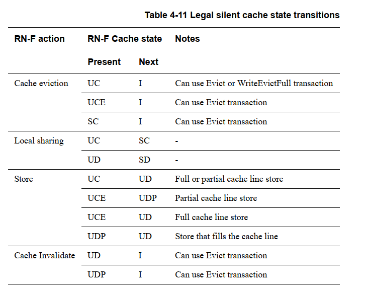

解析如下:

```
1.cache eviction:
	UC->I:当前cacheline状态是UC(Unique Clean)态,当将数据通过Evict或WriteEvictFull从当前cache evict
		到下级cache或memory就变成了I态;
	UCE->I:当前cacheline状态是UCE(Unique Clean Empty)态,当发Evict操作时,因为数据是Empty,数据不用,
		直接就可以变成了I态;
	SC->I:当前cacheline状态是SC(Shared Clean)态,当发Evict操作时,数据不用,直接变成I态.
2.Local Sharing:
	UC->SC:如果共享在local,直接将状态从UC切到SC即可;
	UD->SD:如果共享在local,直接将状态从UD切到SD即可.
3.Store:
	UC->UD:因为已经拿到了U态,可以直接更改数据.无论是full还是partial写,都是变成UD态;
	UCE->UDP/UD:当RN发CleanUnique/MakeUnique拿到UCE态后,如果是partial写,就变成UDP态,full写就变成UD态;
	UDP->UD:如果在UDP的基础上写整cacheline数据就变成UD态.
4.Cache Invalidate:
	UD/UDP->I:当收到Invalidate时,cache需要将数据Evict到下一级,同时将状态切为I态;
```

### 2.6.2 Read request transactions

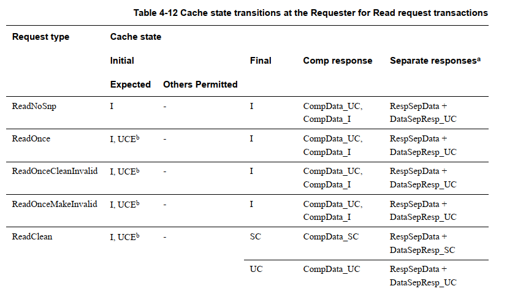


解析如下:

```
1.ReadNoSnp、ReadOnce*:
	对于CompData或RespSepData+DataSepResp(分离的Comp+Data),直接忽略Data域段中的cache state,最终的状态为I态;
2.ReadClean:
	因为是要变成Clean的状态,因为最终的状态为SC或UC态;
3.ReadNotSharedDirty:
	最终变成SC态:其他Cache中有数据,且是Clean,此时HA通过RDAT中的Resp域段回的是SC态;
	最终变成UC态:其他Cache中没有数据(Unique),且是Clean,此时HA通过RDAT中的Resp域段回的是UC态;
	最终变成UD态:其他Cache中没有数据(Unique),且是Clean,此时HA通过RDAT中的Resp域段回的是UC态.但是数据后面会被更改.
	不能变成SD态:因为NotSharedDirty.
4.ReadShared:
	最终变成SC态:其他Cache中有数据,且是Clean,此时HA通过RDAT中的Resp域段回的是SC态;
	最终变成UC态:其他Cache中没有数据(Unique),且是Clean,此时HA通过RDAT中的Resp域段回的是UC态;
	最终变成SD态:其他Cache中有数据,且是Clean,此时HA通过RDAT中的Resp域段回的是SC态.但是数据后面被更改了变成SD态;
	最终变成UD态:其他Cache中没有数据(Unique),且是Clean,此时HA通过RDAT中的Resp域段回的是UC态.但是数据后面会被更改.
5.ReadUnique:
	如果本身状态是I/SC态,此时变成UC/UD态;
	如果本身状态时SD态,此时变成UD态.
```

### 2.6.3 Dataless request transactions

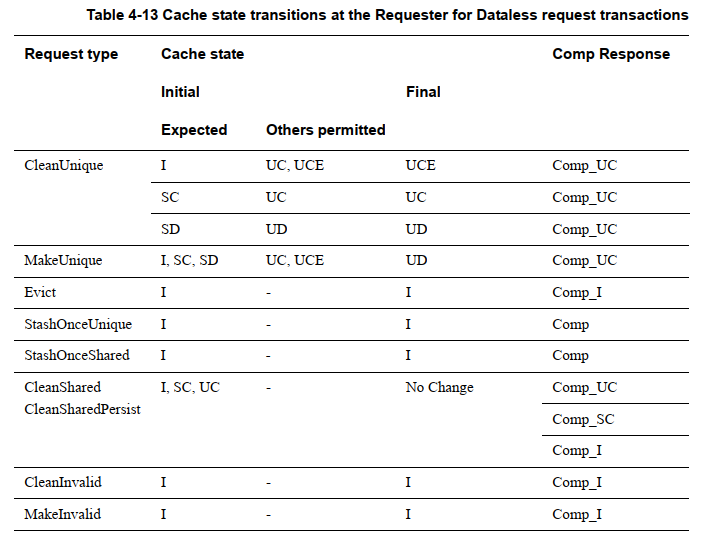

### 2.6.4 Write request transactions

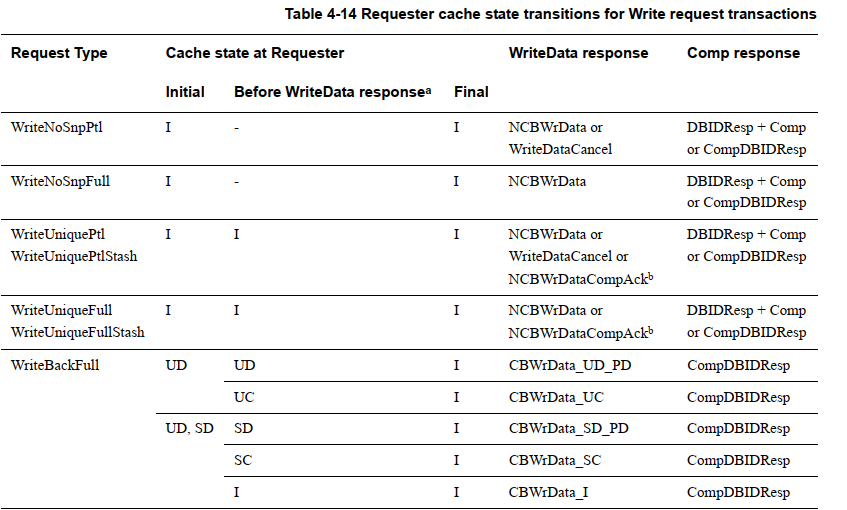

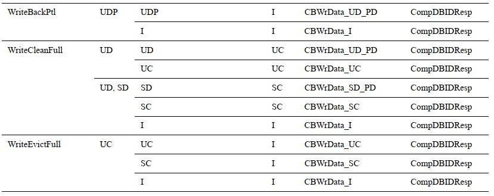

### 2.6.5 Atomic transactions

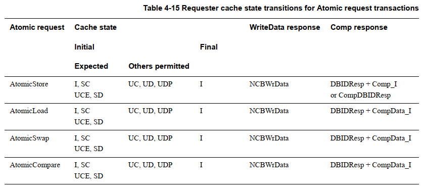

### 2.6.6 Other request transactions

DVMOp和PrefetchTgt requests没有任何的cache state transitions.

### 2.6.7 Snoop request transactions

Snoop的cache状态切换需要注意以下几点:

```
1.RN在UC态被Snoop返回不带data的SnpResp;
2.在收到snoop request之前,RN silent transition到SC或I态时,返回不带data的SnpResp.
```

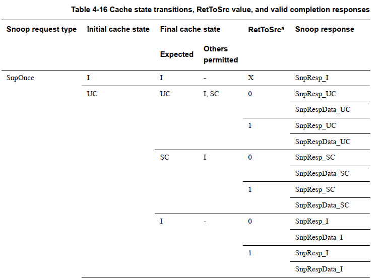

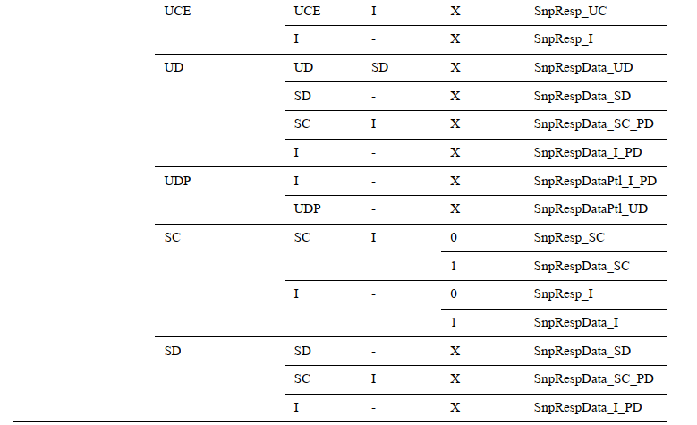

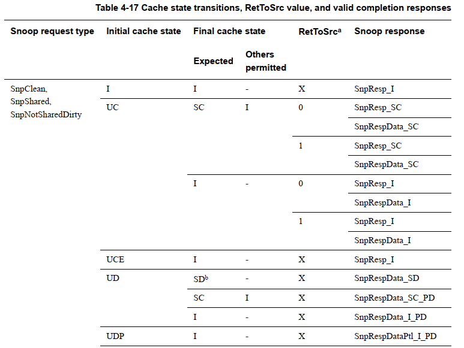

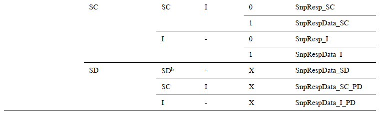

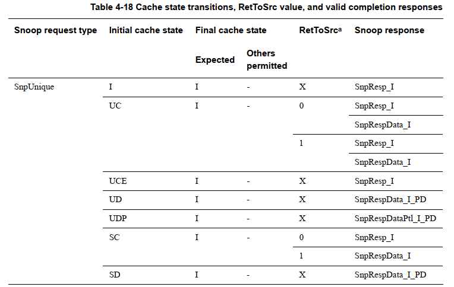

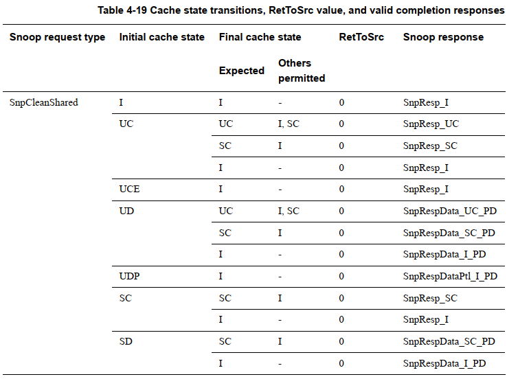

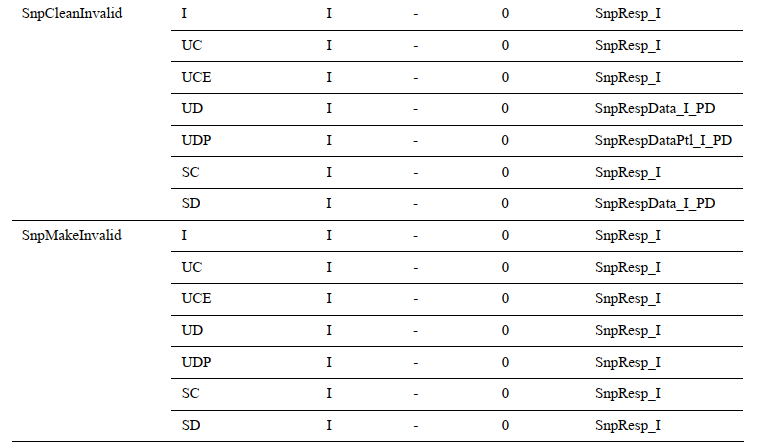

### 2.6.8 Stash type snoops

暂略.

[参考:4.8 Stash type snoops](https://aijishu.com/a/1060000000125634)

### 2.6.9 Forwarding type snoops

暂略.

[参考:4.9 Forwarding type snoops](https://aijishu.com/a/1060000000125634)
