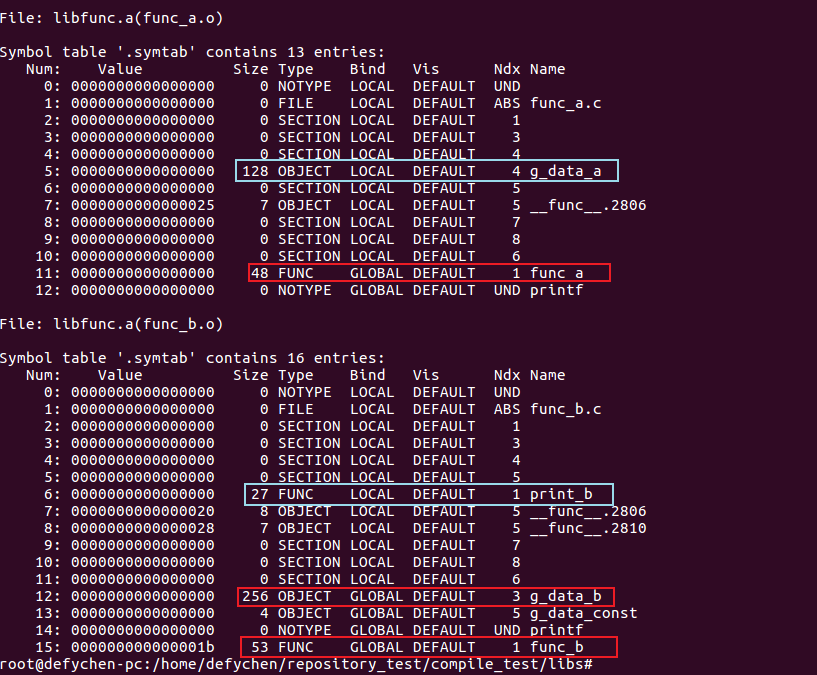
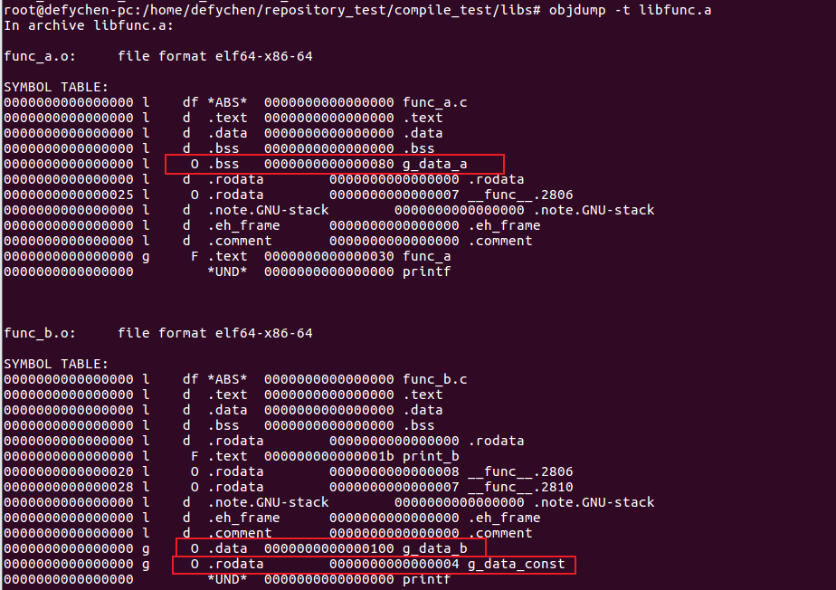

# Compiler Learning

# Chapter 1. 编译器概述及常用参数

## 1.1 编程语言类别

编译型:C/C++、Pascal、Fortan,使用编译器,编译结果是机器码,执行速度快,不能跨CPU平台(一套源码、多次编译、多次运行).

解释型:使用解析器,执行速度慢,可以跨CPU平台(一套源码、一次编译、多次运行).

	Basic、Java、C#:半解析型,伪编译,产生中间文件(也称字节码(byte code)).
	Python、PHP、Perl、CMake:纯解析型,没有中间文件.

## 1.2 编译器工作流程(3步)

1.预处理(Preprocess):展开宏、include、#ifdef等;

2.编译(Compile):将源文件编程.o文件;

3.链接(link):将.o组合起来,变成一个可执行文件.

## 1.3 编译器类别(gcc和llvm)

gcc:linux下的老牌编译器,采用GPL协议;

llvm:llvm的前端叫clang(负责编译C/C++/Objetive-C,类似gcc中的gcc/g++等tool,是llvm的一部分,还需要后端优化,clang采用BSD协议).

	苹果是llvm的赞助者,也是开发者.Andriod现在也切到llvm.

## 1.4 GNU toolchain

GNU toolchain由一系列的工具组成:

	gcc:C编译器(.c--->.o);
	as:汇编编译器(.asm--->.o);
	cpp:C语言预处理器(C PreProcessor),不是cpp文件的编译器;
	g++:c++编译器(.cpp--->.o);
	ld:链接器(.o--->.so);
	ar:把.o串成.a(.o--->.a);
	strip:去除二进制文件中的符号表;
	objcopy:目标文件从二进制格式复制成另一个种格式;
	objdump:显示目标文件中的各种信息(反汇编);
	strings:显示文件中的字符串;
	readelf:显示elf文件中的信息.

## 1.5 gcc编译选项

-c:将c文件编译成.o;

-D:等同于文件里的#define(代码中定义宏).使用-D,对代码架构不友好;

-E:预编译,展开代码里的宏、include、处理#ifdef.有时候,代码里的宏嵌套难以阅读,用-E将代码展开,方便理解别人的代码;

-g:生成debug info,gdb调试的时候可以看到源码;

-s:所生成的elf文件不包含Symbol table,也不含debug info.可以发布,一般商业版本发布前都会用-s的编译选项.也可以使用arm-linux-gnueabi-strip处理elf文件,去掉相关信息;

	Symbol table和debug info在运行阶段不是必须的.

-S:将C编译成汇编,不输出.o.经常被用来查看c语言对应的汇编指令,做深度性能优化;

-M:查看文件关联的信息.当需要查看某个c文件依赖于哪些.h文件时,可以用这个参数;

-MM:同-M,但是不会输出系统头文件;

-MF:把-M/-MM的结果写入指定文件中,经常被用来生成依赖描述文件;

-I:指定寻找头文件的路径(i的大写);

	INCLUDE_DIR := module_a/include module_b/include	//头文件包含模块A、B的include
	CXXFLAGS += $(addprefix -I, $(INCLUDE_DIR))
		//为每个文件名添加前缀,解析为:-Imodule_a/include; -Imodule_b/include

-L:指定要搜索库的路径;

-l:指定要链接的库的名字(L的小写);

	1.静态库
		1)linux下的后缀为.a,windows下的后缀是.lib;
		2)每个可执行程序包含一份库文件;
		3)通过ar命令将.o压成.a;
		4)直接使用-L和-l链接静态库.
	2.动态库
		1)linux下的后缀为.so,windows下的后缀是.dll;
		2)所有可执行程序共享一份代码;
		3)编译:gcc -shared -fpic func.c -o libfunc.so
	3.静态库的链接
		gcc a.c b.c -Iinclude -Llib -lfunc -o a.out
		//-I:头文件目录include; -L:库文件目录lib; -lfunc:库文件为libfunc.a
	4.动态库的链接
		gcc a.c b.c -Iinclude -Llib -lfunc -o a.out
		/*
			运行时不能自动找到libfunc.so,需要执行运行时搜索路径:
				export LD_LIBRARY_PATH=./lib	//export链接库路径
		*/
		查看a.out可执行文件依赖的动态库:
			ldd a.out
	5.rpath--->设置lib目录(开源软件喜欢,但不建议使用)
		gcc a.c b.c -Iinclude -Llib -lfunc -Wl,-rpath=lib -o a.out
		/*
			rpath指定动态库路径为lib,此时可以变为:export LD_LIBRARY_PATH=	//库路径为空.
		*/
	6.搜索动态库路径
		1.rpath
		2.LD_LIBRARY_PATH
		3./etc/ld.so.cache
		4./lib
		5./usr/lib

## 1.6 Makefile/Autotools/Scons/CMake

进化过程:

	shell--->Makefile--->Scons--->CMake

CMake介绍

CMake可以在linux上生成Makefile,在Windows上生成visual studio的Workspace和Project文件,并不直接参与代码构建,把专业的事情留给专业的人做,得到业界的追捧.

	1.众多开源软件选用CMake:OpenCV、dlib、Qt、KDE4、fast-dnn...
	2.Android OS底层的Frameworks,凡是C/C++部分,全部用CMake构建;
	3.Android App开发中凡是用到C/C++代码,全部用CMake构建,Java部分用Gradle构建.

# Chapter 2. 静态库、动态库

## 2.1 示例代码

### 2.1.1 目录结构

	.
	├── include
	│   ├── func_a.h
	│   └── func_b.h
	├── libs
	│   ├── func_a.c
	│   ├── func_a.o
	│   ├── func_b.c
	│   ├── func_b.o
	│   └── libfunc.a
	└── test.c

### 2.1.2 func_a.h代码

	int func_a(int val);	//只有一行代码

### 2.1.3 func_b.h代码

	nt func_b(int val);		//只有一行代码

### 2.1.4 func_a.c代码

	#include <stdio.h>
	#include <stdlib.h>
	
	static unsigned char g_data_a[128];	//静态全局数组,未被初始化的会被初始化为0,放在bss段.
	
	int func_a(int val)
	{
	        printf("func:%s, val=%d, sizeof g_data_a=%d\n", __func__, val, sizeof(g_data_a));
	        return 0;
	}

### 2.1.5 func_b.c代码

	#include <stdio.h>
	#include <stdlib.h>
	
	char g_data_b[256] = {0x11};	//全局数组,被初始化为非0,放在data段.
	const int g_data_const = 0x22;	//常量数据(变量),放在rodata段.
	
	static void print_b()
	{
	        printf("func:%s\n", __func__);
	}
	
	int func_b(int val)
	{
	        print_b();
	        printf("func:%s, val=%d\n", __func__, val);
	        return 0;
	}

### 2.1.6 test.c代码

	#include <stdio.h>
	#include <stdlib.h>
	
	#include "func_a.h"
	#include "func_a.h"
	
	int test_id = 0x255;
	
	int main()
	{
	        printf("hello world! test_id = 0x%x\n", test_id);
	        func_a(128);
	        func_b(256);
	        return 0;
	}

## 2.2 静态库的构成

### 2.2.1 编译并生成静态库

	1.编译
	cd libs
	gcc -c func_a.c func_b.c	//编译生成func_a.o和func_b.o
	2.合成静态库
	ar -rcs/rcs libfunc.a func_a.o func_b.o

### 2.2.2 解析静态库的符号表信息

	命令:readelf -s libfunc.a

	1.这是含有symbol talbe的libfunc.a,如果strip后大部分信息就没有了;
	2.该libfunc.a由func_a.o和func_b.o组成;
	3.g_data_a是个128 Byte的LOCA OBJECT,作用域仅限于func_a.o;
	4.g_data_b是个256 Byte的GLOBAL OBJECT,全局可引用;
	5.func_a、func_b是GLOBAL FUNCTION,全局可引用;
	6.print_b是LOCAL FUNCTION,作用域仅限于func_b.o.

### 2.2.3 解析静态库的section信息

解析静态库的section信息时也必须还有symbol table,不能做strip处理.

	命令:objdump -t libfunc.a		// dump出符号表信息

	1).text:代码段;
	2).data:数据段,被初始化的全局变量(必须初始化为非0), e.g. g_data_b,占用0x100(256)byte;
	3).bss:数据段,未被初始化的或被初始化为0的全局变量(未被初始化的全局变量初值总是0), e.g. g_data_a,
		占用0x80(128)byte;
	4).rodata:常量数据(即只读数据),e.g. g_const_data,大小为4byte.

## 2.3 静态库的用法

对于商业软件来说,一般SDK包会包含以下文件(此处不包含.so文件的用法):

	1).h:提供给开发商的函数、数据结构;
	2).a:开发商需要链接到自己的可执行文件里的库.

由于ld(程序链接)是通过symbol talbe进行链接的,如果使用strip去掉符号表信息就会出现链接出错:

	1.没有去掉符号表前
		gcc test.c -Llibs -lfunc -Iinclude -o test	//编译及链接正确
	2.去掉符号表后
		strip libs/libfunc.a	//去除symbol table
		gcc test.c -Llibs -lfunc -Iinclude -o test
		/*
		libs/libfunc.a: error adding symbols: Archive has no index; run ranlib to add one
		collect2: error: ld returned 1 exit status
		添加symbol时出错了,因为strip将symbol table去除了
		*/