# Compute Organization and Design(The Hardware/Software Interface)

## Chapter 1 计算机概要与技术

### 1.1 引言

#### 1.1.1 常用容量表示方法

1.KB/MB/GB/TB/PB/EB/ZB/YB的意思

	KB(kilobyte):数值为10^3;
	MB(megabyte):数值为10^6;
	GB(gigabyte):数值为10^9;
	TB(terabyte):数值为10^12;
	PB(petabyte):数值为10^15;
	EB(exabyte):数值为10^18;
	ZB(zettabyte):数值为10^21;
	YB(yottabyte):数值为10^24.

2.KiB/MiB/GiB/TiB/PiB/EiB/ZiB/YiB的意思

	KiB(kibibyte):数值为2^10;
	MiB(mebibyte):数值为2^20;
	GiB(gibibyte):数值为2^30;
	TiB(tebibyte):数值为2^40;
	PiB(pebibyte):数值为2^50;
	EiB(exbibyte):数值为2^60;
	ZiB(zebibyte):数值为2^70;
	YiB(yobibyte):数值为2^80.

#### 1.1.2 一些常用概念

	1.PMD(Personal Mobile Device):个人移动设备;
		e.g.智能手机或平板电脑;
	2.云计算(cloud computing):替代传统的服务器,建立在WSG(Warehouse Scale Compute:仓储规模计算机)巨
	型数据中心之上.Amazon和Google构建了含有100 000台服务器的WSG,一些公司可以租用其中不部分为PMD提供软
	件服务,而不用自己构建WSG;
	3.SaaS(Software as a Service):软件即服务,在网络上以服务的方式提供软件和数据.运行方式通常不是在本地
	设备上运行所有的二进制代码,而是通过诸如运行在本地客户端的浏览器等小程序登录到远程服务器上执行.
		e.g.Web搜索和社交网络.

### 1.2 计算机系统结构中的8个伟大思想

	1.面向摩尔定律的设计;
	2.使用抽象简化设计;
	3.加速大概率事件;
	4.通过并行提高性能;
	5.通过流水线提高性能;
	6.通过预测提高性能;
	7.存储器层次;
	8.通过冗余提高可靠性.

### 1.3 制造技术相关概念

#### 1.3.1 概念

**1.晶体管(transistor)**

晶体管:一种由电信号控制的简单开关.

**2.集成电路(IC:ingerated circuit)**

集成电路:由成千上万个晶体管组成的芯片.

**3.超大规模集成电路(VLSI:very large-scale integrated circuit)**

超大规模集成电路:由数十万到数百万晶体管组成的电路.

#### 1.3.2 芯片制造

用化学方法对硅添加某些材料,是硅的某些区域转变为:

	1.良好的导电体(类似细微的铜线或铝线);
	2.良好的绝缘体(类似塑料或玻璃膜);
	3.可控的导电体或绝缘体(类似开关).

制造流程:

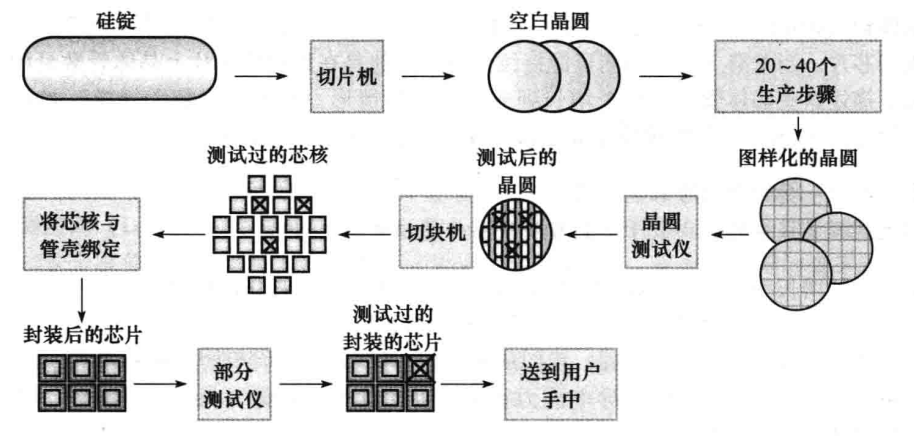

硅锭/晶圆/Die/Socket:

	1.硅锭(silicon crystal ingot):一块由硅晶体组成的棒.直径约8-12英寸,长度约12-24英寸;
	2.晶圆(wafer):厚度不超过0.1英寸的硅锭片,用来制造芯片;
	3.Die:从晶圆(wafer)上切割下来的一个个的小方块(方形的原因是便于切割),并在该Die上面将逻辑电路刻在
		上面构成真正的Die.如果Die的面积足够小,wafer的利用率可以接近于100%;
	4.Socket:将1个或N个CPU Die封装起来形成一个CPU Package,也叫CPU Socket;
	PS:Die的大小越大,CPU Die出错的概率越高,良品率也越低,成本相应就越高.

Intel和AMD芯片区别:

	1.Intel Xeon系列(服务器芯片)将整个CPU Socket做到一个CPU Die上.优点是:CP内部直接各组件的连接是片内
		总线互联,有更多资源共享(e.g.所有的CPU内核共享L3),整体的性能更高;缺点是成本大,价格高.
	2.AMD EYPC CPU每个CPU Socket有4个CPU Die,每个CPU Die包含4个CPU 内核.CPU Die之间通过片外总线
		(Infinity Fabric)互联,不同Die上的CPU内核不能共享CPU Cache.这种分布导致虽然单Core与Intel差不
		多,性能却赶不上Intel Xeon处理器.但是好处是便宜.

### 1.4 性能

#### 1.4.1 性能度量

**1.个人计算机与数据中心的区别**

个人计算机关心的是响应时间(response time),数据中心关心的是吞吐率(throughout).

	响应时间:也叫执行时间(execution time),是计算机完成某任务所需的总时间(包括硬盘访问、内存访问、IO
		活动、操作系统开销和CPU执行时间等);
	吞吐率:也叫带宽(bandwidth),表示单位时间内完成的任务数量.

**2.CPU时钟周期(clock cycle)和时钟频率(clock rate)**

	CPU时钟周期为250ps,对应的CPU时钟频率为4GHz.

#### 1.4.2 CPU的性能

CPU的性能度量方法是:一个程序的CPU执行时间,执行时间越短,CPU的性能越好;反之越差.

一个程序的CPU执行时间公式:

	1.一个程序的CPU执行时间 = 一个程序的CPU时钟周期数 x CPU的时钟周期
	2.一个程序的CPU执行时间 = 一个程序的CPU时钟周期数 / CPU的时钟频率

实例:

	某程序在一台时钟频率为2GHz的计算机A上运行需10s.在B上通过提高时钟频率,希望运行时间缩短为6s,但是周期数
	会提升为A的1.2倍.求B的时钟频率提高到多少?
		1.程序在A上运行的时间 = 周期数 / 频率
			即:10s = 周期数 / 2GHz	=> 周期数 = 10s * 2GHz
		2.程序在B上运行的时间 = 周期数 / 频率
			即:6s = 1.2周期数 / f	=> f = (1.2 * 10s * 2G) / 6s = 4GHz
		因此:B的时钟频率需要提高为A的2倍.

#### 1.4.3 指令的性能

	1.一个程序的CPU时钟周期数 = 程序的指令数 x 每条指令的平均时钟周期数(即CPI);
	2.CPI(clock cycle per instruction):一个程序全部指令所用时钟周期数的平均值.

实例:

	一个程序使用相同指令集.在时钟周期为250ps的A计算机上的CPI为2.0;而在时钟周期为500ps的B计算机上的CPI
		为1.2.求哪台计算机的速度更快?
	1.程序在A上的运行时间 = 周期数 * 周期; 而:周期数 = I(指令数) * CPI
		因此: 在A上运行时间 = I * 2.0 * 250ps = 500I
	2.程序在B上的运行时间 = 周期数 * 周期; 而:周期数 = I(指令数) * CPI
		因此: 在B上运行时间 = I * 1.2 * 500ps = 600I
	因此:对该程序A是B的1.2倍.

#### 1.4.4 经典的CPU性能公式

	1.CPU时间 = 指令数 x CPI X CPU时钟周期
	2.CPU时间 = 指令数 x CPI / CPU时钟频率

有时候也用IPC来代替CPI:

	IPC(instruction per clock cyle):表示每个时钟周期可执行的指令数,为CPI的倒数.

### 1.5 衡量CPU的基准

#### 1.5.1 SPEC CPU基准测试程序

1.benchmark

基准测试程序,用于比较计算机性能的程序.

2.SPECint2006--->最新的为SPECint2017

整数基准程序集.描述为:

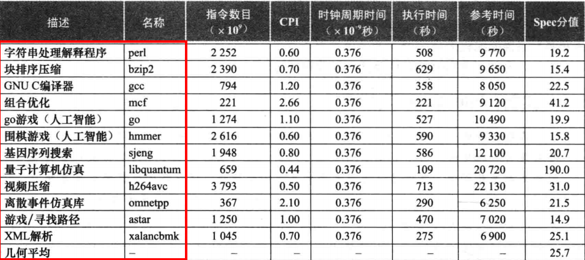

3.SPECfp2006

浮点基准程序集.

#### 1.5.2 SPEC功耗基准测试程序

SPECpower

评估功耗的基准测试程序.

***

## Chapter 2 指令:计算机的语言

指令集:一个给定的计算机体系结构所包含的指令集和.

### 2.1 计算机硬件的操作

字:计算机中的基本访问单位,通常是32-bit(x86的word是16-bit).

```
寄存器个数限制原因:寄存器多时可能会使时钟周期变长,因为电信号传输更远的距离必然花费更长的时间.
```

#### 2.1.1 存储操作数

MIPS的算数运算指令只对寄存器进行操作(ARM也是一样).因此,MIPS包含在储存器和寄存器之间传送数据的指令,叫做数据传送指令(data transfer instruction).

```
数据传送指令(load/store):在储存器和寄存器之间移动数据的命令.
	ldr x0, =0x81000000		// 此处将值0x81000000(是一个地址)放到x0寄存器中
	ldr x1, =0x0060000000000001	// 此处将值0x0060000000000001(是一个数据)放到x0寄存器中
	str x1, [x0, 0x00]		//  此处将x1寄存器中的内容储存到x0寄存器中的内容(为一个地址)偏移0x00所表示地址中.
PS:ldr和str都是寄存器在前,数据信息在后.
因此:
	1.ldr:将数据(数据可能直接能获取(e.g.ldr x0, =0x81000000)或者从地址中获取(ldr x1, [x0],从x0寄存器中的内容(是一个地址)中获取数据))搬移到寄存器中;
	2.str:(str x1, [x0])将寄存器中x1的内容(放的一个值)存到x0寄存器的内容(x0寄存器的内容是一个地址)所表示的地址中去.
```

PS:许多程序的变量个数要远多于计算机的存储器个数.因此,编译器会尽量将最常用的变量保持在寄存器中,而将其他的变量放在存储器中,方法是使用ldr/str指令在寄存器和存储器之间传送变量.

```
1.将不常用的变量(或稍后才使用的变量)存回到存储器的过程叫寄存器溢出(spilling);
2.寄存器与存储器相比:访问时间短、吞吐率高,寄存器中的数据访问速度快并易于利用,且功耗更小.
```

#### 2.1.2 常数或立即数操作数

使用常数前必须先将其从存储器中取出(常数可能在程序被加载时放入存储器的).

PS:MIPS寄存器也分为32-bit和64-bit,分别称为MIPS-32和MIPS-64,ARM应该就是借鉴MIPS的命名规则来的.

### 2.2 有符号数和无符号数

```
LSB(least significant bit):最低有效位,在字中最右边的1 bit;
MSB(most significant bit):最高有效位,在字中最左边的1 bit.
```

计算机中有符号数的表示方法:

```
1.正数:MSB为0的表示正数,直接表示即可;
2.负数:MSB为1的表示负数,用补码表示.
	1.负的二进制数计算出相应的十进制数:
        1111 1111 1111 1111 1111 1111 1111 1100
        --->表示的负数为:
        1.取反:
            0000 0000 0000 0000 0000 0000 0000 0011
        2.+1:
            0000 0000 0000 0000 0000 0000 0000 0100
        3.最后表示的负数为:
            -4
	2.负的十进制数转换为相应的二进制数:
		1.十进制数:
			-2
		2.2的十进制数的表示:
			0000 0000 0000 0000 0000 0000 0000 0010
		3.取反:
			1111 1111 1111 1111 1111 1111 1111 1101
		4.+1:
			1111 1111 1111 1111 1111 1111 1111 1110
		5.最后的二进制数即为:
			1111 1111 1111 1111 1111 1111 1111 1110
3.正数最大的数:
	0111 1111 1111 1111 1111 1111 1111 1111--->即最大的正数为:2^31-1;
4.负数最大的数:
	1000 0000 0000 0000 0000 0000 0000 0000--->即最大的负数为:-2^31.
```

### 2.3 计算机中指令的表示

计算机中几乎所有的指令都要用到寄存器.

```
1.MIPS的指令长度是32-bit;ARM的指令长度也是32-bit;
2.把指令的数字形式称为机器语言(也叫机器指令),这样组成的指令序列叫做机器码.
```

#### 2.3.1 MIPS的指令解析

MIPS的指令解析(机器指令的解析)---->总共32-bit:

| op(6-bit) | rs(5-bit) | rt(5-bit) | rd(5-bit) | shamt(5-bit) | funct(6-bit) |
| --------- | --------- | --------- | --------- | ------------ | ------------ |

```
op:指令的操作码(opcode),用来表示操作和格式的字段;
rs:第一个源操作数寄存器;
rt:第二个源操作数寄存器;
rd:存放操作结果的目的寄存器;
shamt:位移量(仅用于移位指令);
funct:功能码(function code),用于指明op字段中操作的特定变式.
```

#### 2.3.2 MIPS的指令解析实例

```
// 反汇编码
8000021c:	8d2a0000 	lw	t2,0(t1)
1.第1个域段表示地址信息,每条指令存放的地址,4Byte递增(因为指令是32-bit);
2.第2个域段表示指令码,解析如下:
	op(高6-bit):8d右移2bit得到35--->表示lw;
	其他bit暂略--->没解析出来.
3.第3个域段表示汇编代码,表示load word操作.
```

#### 2.3.3 寄存器数量规则

寄存器的数量的选取是有规则的:

```
寄存器数量的增长就需要在指令格式的各个寄存器字段中至少增加1-bit,因此综合考虑.当前的大多数指令系统中的通用寄存器为16/32个.
```

### 2.4 逻辑操作

对bit进行操作称为逻辑操作.

```
按位与:按bit进行与操作,仅当两个bit均为1时结果才是1;
按位或:按bit进行或操作,当两个bit中任意一位为1时结果就为1;
按位取反:按bit进行取非操作,只需要一个bit,即将1变为0,0变为1;
或非:按bit先或后非操作,两个bit或后得到一个bit,之后再对这一个bit进行取反;
异或(XOR):当两个bit不同时结果是1,相同时结果为0.
```

### 2.5 计算机硬件对过程的支持

过程:根据提供的参数执行一定任务的存储的子程序.

#### 2.5.1 过程支持的必要信息

```
跳转和链接指令:跳转到某个地址的同时将下一条指令的地址保存到寄存器中的指令(e.g. MIPS保存到$ra寄存器);
返回地址:指向调用点的链接,使过程可以返回到合适的地址(在MIPS中它存储在寄存器$ra中);
程序计数器(PC):一个寄存器包含正在被执行指令的地址.
```

#### 2.5.2 栈

栈:具有后进先出的特点,用于寄存器换出的数据结构.

```
栈指针:指示寄存器被换出的位置,在MIPS中栈指针是寄存器$SP;
入栈:向栈中增加元素;
出栈:从栈中移除远处;
栈增长:一般栈增长是按照地址从高到低增长,所以入栈时,栈指针是减小的;出栈时,栈指针变大.
```

### 2.6 人机交互

在C语言中,用一个值0(ASCII码中的null)的字节来结束字符串.

```
字符串"Cal"在C中用4字节表示,分别是十进制的:67,97,108,0(结尾的0).
```

实例:

```
// 将null接为的字符串y复制到字符串x
void strcpy(char x[], char y[])
{
	int i = 0;
	while ((x[i] = y[i]) != '\0') {	// 赋值y[i]到x[i],并判断是否为'\0'(结束字符,数字0的字符表示为'\0')
		i += 1;
	}
}
```

数字0的各种表示:

```
1.数字表示:0;
2.指针表示:null;
3.字符表示:'\0'
```

 PS:当今的大部分web页面采用Unicode编码,而不是ASCII编码.

```
在SPEC基准测试程序中,大概一半条件分支的跳转距离小于16条指令.
```

### 2.7 翻译并执行程序

#### 2.7.1 编译器

编译器:将C程序编译成一种机器能理解的符号形式的汇编语言程序.

#### 2.7.2 汇编器

汇编器:将汇编语言程序汇编成目标文件.

Unix/Linux的目标文件通常包含以下6部分:

```
1.目标文件头:描述目标文件其他部分的大小和位置;
2.代码段:包含机器语言代码;
3.静态数据段:包含在程序生命周期内一直存在的数据;
4.重定位信息:标记了一些在程序加载进内存时依赖于绝对地址的指令和数据;
5.符号表:包含未定义的剩余标记(e.g. 外部引用);
6.调试信息:包含一份说明目标模块如何编译的简明描述,这样调试器能够将机器指令关联到C源文件,并使数据结构也变得可读.
```

#### 2.7.3 链接器

链接器:一个系统程序,把各个独立汇编的机器语言程序组合起来并解决所有未定义的标记,最后生成可执行程序.

#### 2.7.4 加载器

加载器:把目标程序加载到内存中以准备运行的系统程序.

加载器(loader)的工作步骤如下:

```
1.读取可执行文件头来确定代码段和数据段的大小;
2.为正文和数据创建一个足够大的地址空间;
3.将可执行文件中的指令和数据复制到内存中;
4.把主程序的参数(如果存在)复制到栈顶;
5.初始化机器寄存器,将栈指针指向第一个空位置;
6.跳转到启动例程,将参数复制到参数寄存器并且调用程序的main函数.当main函数返回时,启动例程通过系统调用exit终止程序.
```

#### 2.7.5 动态链接库

动态链接库:在程序执行过程中才被链接的例程库.

## Chapter 3 计算机的算数运算

## Chapter 4 处理器

### 4.1 概述

#### 4.1.1 计算机的性能

决定一台计算机性能的3个关键因素:

```
指令数目、时钟周期和每条指令所需的时钟周期数(CPI).
即一台计算机性能的本质就是CPU运行时间:
	CPU时间 = 指令数 x CPI X CPU时钟周期
指令数目:编译器和指令集决定了一个程序所需的指令数目;
时钟周期和CPI:由处理器的实现方式决定.
```

#### 4.1.2 处理器实现方式

处理器对每条指令实现的前两步基本都是一样的,即:

```
1.PC(程序计算器)指向指令所在的存储单元,并从中取出指令;
2.通过指令字段内容,选择读取一个或两个寄存器(e.g 对于取字指令,只需读取一个寄存器,而其他绝大多数指令都需要读取两个寄存器).
```

在RTL中,asserted(有效)表示信号为逻辑高(即1,高电平);deasserted(无效)表示信号为逻辑低(即0,低电平).

### 4.2 数据通路

#### 4.2.1 基本概念

```
存储单元:存储程序的指令,并在给定地址时提供指令;
PC(程序计数器):保存当前指令(当前指令指的是正在执行或者马上要被执行)的地址的寄存器;
加法器:计算PC的值,以指向下一条指令的地址.
```

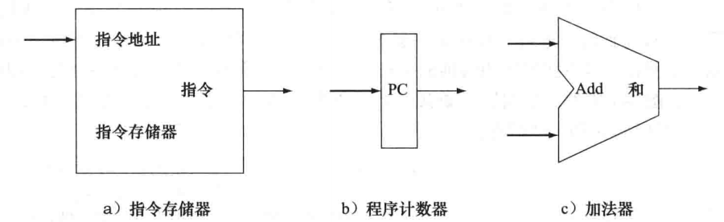

#### 4.2.2 数据通路

数据通路部件:一个用来操作或保存处理器中数据的单元.在MISP实现中,数据通路部件包括指令存储器、数据存储器、寄存器堆、ALU和加法器.

**寄存器堆**

包含一系列寄存器的单元状态,可以通过提供寄存器号进行读写.

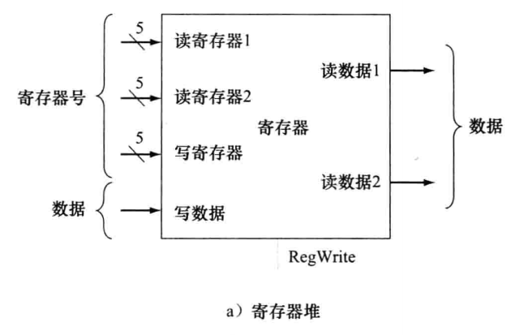

### 4.3 流水线

流水线(pipeline):是一种实现多条指令重叠执行的技术.

一条MIPS指令执行的5个步骤:

```
1.取指(IF):从指令存储器中读取指令;
2.译码(ID):指令译码的同时读取寄存器(MIPS指令格式允许同时进行指令译码和读寄存器);
3.执行(EX):执行操作或计算地址;
4.访存(MEM):从数据存储器中读取操作数;
5.写回(WB):将结果写回寄存器.
```

**1.流水线实例**

假设存储器访问:200ps,ALU操作:200ps;寄存器堆的读写:100ps.因此各种不同指令所消耗时间为:

| 指令类型                | 取指令 | 读寄存器 | ALU操作 | 数据存取 | 写寄存器 | 总时间 |
| ----------------------- | ------ | -------- | ------- | -------- | -------- | ------ |
| lw(取字)                | 200ps  | 100ps    | 200ps   | 200ps    | 100ps    | 800ps  |
| sw(存字)                | 200ps  | 100ps    | 200ps   | 200ps    |          | 700ps  |
| R型(add/sub/and/or/slt) | 200ps  | 100ps    | 200ps   |          | 100ps    | 600ps  |
| beq(分支)               | 200ps  | 100ps    | 200ps   |          |          | 500ps  |

**2.流水线与非流水线对比**

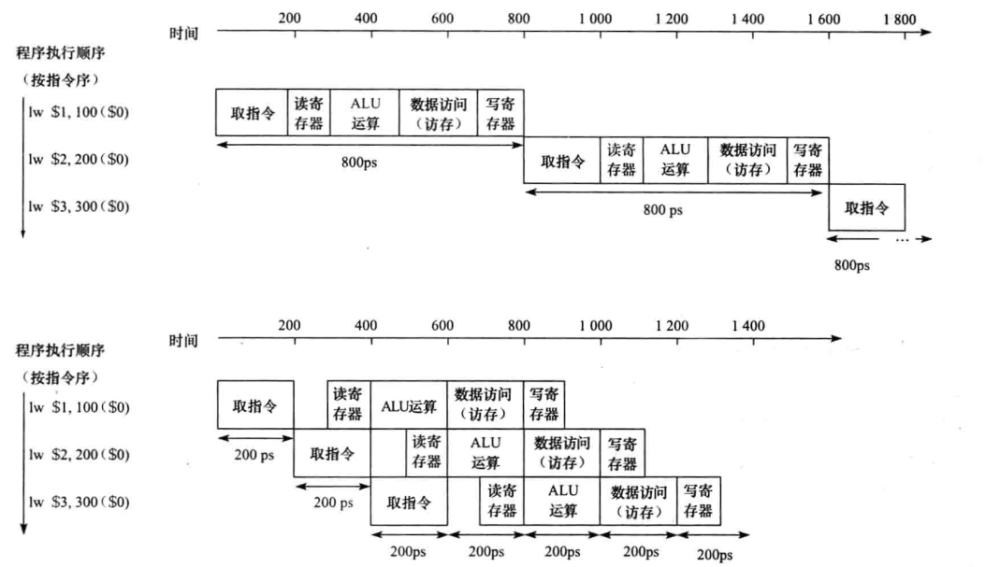

```
执行4条指令后:
非流水线第1条指令结束是在800ps处,第4条指令结束是在3200ps.第1条与第4条结束时间差为2400ps;
流水线第1条指令结束是在1000ps处,第4条指令结束是在1600ps,第1条与第4条结束时间差为600ps.
此时流水线将性能提高了4倍.
```

PS:理论上一个5级流水线可以获得的加速比为5(即相比于非流水线只需要总时间的1/5).

```
流水线所带来的性能提升是通过增加指令的吞吐率,而不是减少单条指令的执行时间来实现的.
```

### 4.4 指令级并行

#### 4.4.1 多发射

**1.多发射**

一个cycle发射多条指令的一种机制.

```
流水线:充分利用每个cycle,目标是每个cycle能执行一条指令.多发射与流水线配合可以让一个cycle执行多条指令.
因此:多发射与流水线配合后,CPI可以小于1.
```

**2.多发射实例**

```
一个4GHz的4路多发射微处理器能以每秒160亿指令的峰值速率运行:
	1.1 cycle可以执行4条指令(4路发射);
	2.1 cycle的时间是1/(4G)s,因此,1s含有的cycle数是:4G个cycle;
	3.1s可以执行的指令数为: 4*4G=160亿(即上述说的每秒160亿指令);
	4.最好的CPI为:0.25,即IPC可以达到4;
	5.假设该处理器是5级流水线,则每个cycle有20条指令在同时执行.只是平摊到每个cycle为4条指令(4发射).
```

PS:现在高端的微处理器的发射数为3-6,中端的为2.

#### 4.4.2 speculation(投机/推测)

speculation(推测):一种为了使依赖与被推测指令的其他指令可以执行,而允许编译器或处理器"猜测"指令结果的方法.

**1.speculation实例**

```
1.我们可以推测分支指令的结果,这样分支后的其他指令就可以提前执行;
2.假设load指令前有一条store指令,我们可以推测他们不对同一存储器地址进行访问,这样就可以把load指令提前到store指令前执行.
```

**2.speculation存在的问题**

推测的问题在于可能会猜错.所以,任何推测技术都必须包含一种机制,它能检查推测的正确行,并在推测错误时能取消根据原推测结果执行指令的影响.

**3.speculation的处理流程**

推测可以由编译器(软件)或硬件来完成.

```
1.软件:对软件来说,编译器经常插入额外的指令检查推测的正确行并提供专门的修复例程供推测错误时使用;
2.硬件:处理器缓存推测的结果直至推测的结果得到确认.如果推测正确,缓存的结果写回寄存器堆或存储器;如果推测错误,硬件将清除缓存并重新执行正确的指令序列.
```

#### 4.4.3 superscalar(超标量)

**1.superscalar**

superscalar:动态多发射处理器也叫超标量处理器.

```
超标量:一种高级流水线技术,可以使每个cycle能执行的指令数超过一条(但是不固定);
```

**2.动态流水线调度**

动态流水线调度选择下一条要执行的指令,可能的话会重排指令以避免阻塞.在这种处理器中,流水线被划分为3个主要单元:取指与发射单元、多个功能单元和一个提交单元(commit unit).

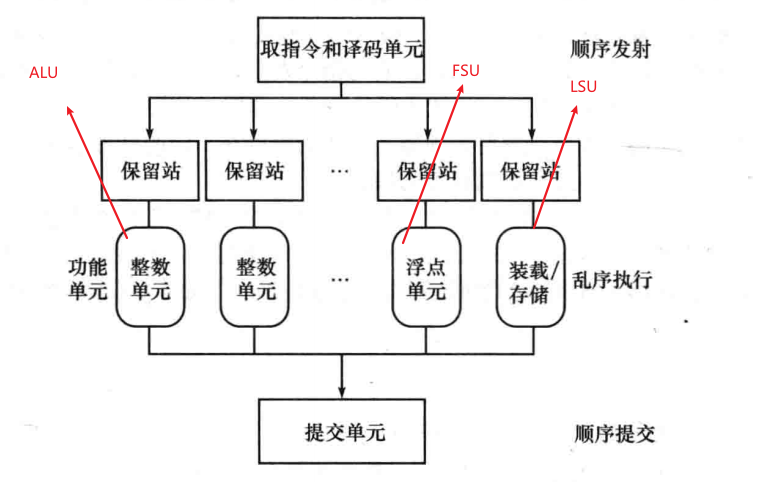

```
1.取指与发射单元:取指并译码,然后将每条指令发射到相对应的功能单元(ALU/FSU/LSU等);
2.功能单元(ALU/FSU/LSU):每个功能单元都有自己的缓冲区(称为保留站(reservation station)),用来保存操作数和操作,当缓冲区中
包含了所有的操作数,并且功能单元就绪时,结果就被计算出来.结果得到后,就被发送到等待该结果的保留站或提交单元;
3.提交单元:提交单元中的reorder buffer缓存功能单元发送的结果,在确定安全后,再将这个结果写回寄存器堆或存储器(对store指令).
	提交单元中的缓冲区通常称为重排序缓冲区(reorder buffer),也可以用来提供操作数.
```

**3.乱序执行与顺序提交**

```
乱序执行(out-of-order execution):指令执行的顺序可以与取指的顺序不同
	出现的情况是:执行的指令被阻塞时不会导致后面的指令等待,此时就会出现乱序
	乱序发生的位置:主要是在功能单元(ALU/FSU/LSU)的位置
顺序提交(in-order commit):提交单元必须按照程序顺序将结果写回寄存器堆或存储器
	程序顺序:取指和译码单元是按照顺序发射指令,记录程序中的依赖关系
	顺序提交:提交时也需要按照顺序写回程序员可见的寄存器
	reorder buffer:重排序缓冲区就是用于将之前的乱序结果进行重排序,按顺序提交
```

PS:指令延迟:执行一条指令所真正花费的时间.

## Chapter 5 存储器层次结构

### 5.1 引言

时间局部性(temporal locality):某个数据项被访问之后可能很快被再次访问的特性.

空间局部性(spatial locality):某个数据项被访问之后,与其地址相近的数据项可能很快被访问的特性.

存储器层次结构:一种由多存储器层次组成的结构,存储器的容量和访问时间随着离处理器距离的增加而增加.

命中时间:访问某存储器层次结构所需的时间,包括了判断当前访问是命中还是缺失所需的时间.

缺失代价(miss penalty):将相应的块从低层存储器替换到高层存储器所需的时间,包括访问块、将数据逐层传输、将数据插入发生缺失的层和将信息块传送到请求者的时间.

### 5.2 存储器技术

存储器技术的对比:

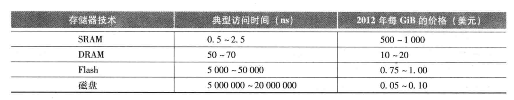

#### 5.2.1 SRAM技术

SRAM(静态随机存储器)是一种组织成存储器阵列结构的简单电路.具有以下特点:

```
1.通常具有一个读写端口;
2.对任何数据访问时间都是固定的;
3.不需要刷新,并且访问时间与周期时间非常相近;
4.空闲模式下,只需要最小的功率来保持电荷.
```

#### 5.2.2 DRAM技术

DRAM(动态随机存储器):使用电容保存电荷的方式来存储数据.具有以下特点:

```
1.DRAM存储的每1 bit都只使用一个晶体管,SRAM需要6-8个晶体管.所以DRAM密度比SRAM要高得多,且价格也要便宜很多;
2.DRAM使用电容保存电荷,由于电容具有自放电的特性.因此不能长久地保存数据,需要周期新的刷新.
3.DRAM的刷新:将DRAM中的内容读出来再写回就叫DRAM的刷新.
```

SDRAM(同步DRAM):使用时钟对存储器和处理器保持同步.

DDR SDRAM(double data rate:双数据速率SDRAM):在时钟的上升沿和下降沿都要传送数据,可以获得双倍的数据带宽.

#### 5.2.3 闪存

闪存:一种电可擦除的可编程只读存储器(EEPROM).具有以下特点:

```
1.对闪存的写操作会使存储位损耗;
2.损耗均衡(wear leveling):大多数闪存产品都有一个控制器,用来将写操作从已经写入很多次的块中映射到写入次数较少的块中,从而使
	写操作尽量分散;
3.采用损耗均衡技术后,个人移动设备很难超过闪存的写极限.
```

#### 5.2.4 磁盘

磁盘具有以下特点:

```
1.访问速度慢;
2.价格便宜.
```

### 5.3 Cache基本原理

#### 5.3.1 为什么需要cache

如果CPU需要将一个变量(假设地址是A)加1,一般分为以下3个步骤:

```
1.CPU从主存中读取地址A的数据到内部通用寄存器x0(ARM64架构的通用寄存器之一);
2.通用寄存器x0加1;
3.CPU将通用寄存器x0的值写入主存.
```

整个过程如下图:


CPU通用寄存器和主存的速度对比如下:

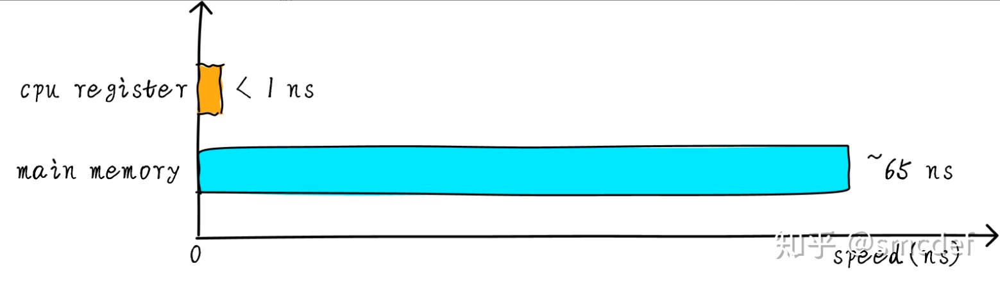

由于CPU register的速度一般是<1ns,主存的速度一般是65ns左右,速度差很多.所以衍生出了一种方法,在CPU与主存之间放置一块cache,其速度处于register和主存之间,同时由于其容量小,成本不会特别高.整个流程如下:


```
此时:CPU与主存之间直接数据传输方式变为--->CPU与cache之间数据传输,cache负责和主存直接数据传输.
```

#### 5.3.2 多级cache存储结构

1.多级cache存储结构如下图:

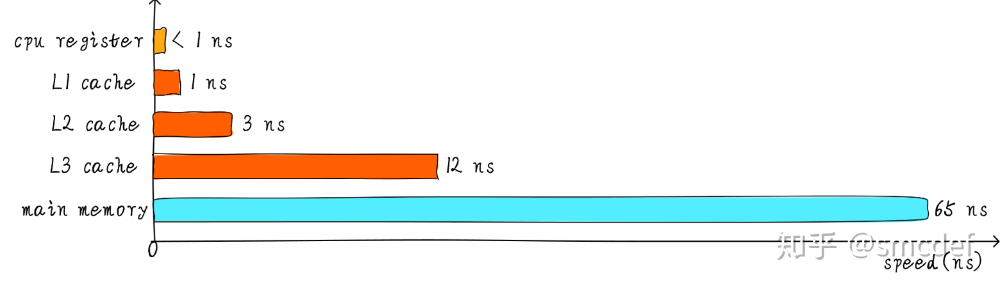

```
特点:
1.cache等级越高,速度越慢,容量越大;
2.各个cache速度:
	CPU register: < 1ns;
	L1 cache: 1ns;
	L2 cache: 3ns;
	L3 cache: 12ns;
	main memory: 65ns.
```

2.Cortex-A53各级cache硬件结构

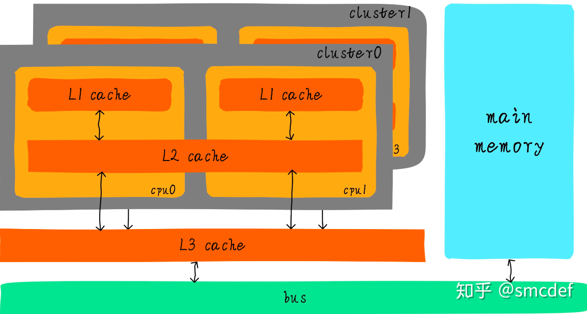

```
1.L1 cache分为单独的instruction cache(ICache)和data cache(DCache),L1 Cache是CPU私有的,每个CPU都有一个L1 Cache;
2.一个cluster内所有的CPU共享一个L2 Cache,L2 Cache不区分指令还是数据,都可以缓存;
3.所有的cluster之间共享L3 cache,L3 cache通过总线与main memory相连.
```

#### 5.3.3 多级cache之间的配合

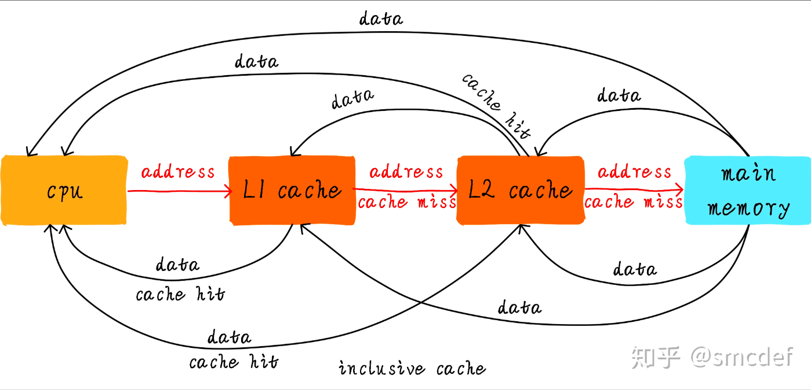

```
1.CPU试图从地址addr load数据,首先查询L1 cache,看是否hit.hit直接将数据返回给CPU,miss则继续查找L2 cache;
2.如果L2 cache hit,从将数据返回给L1 cache以及CPU;如果miss则需要从主存load数据;
3.从main memory读取数据后,将数据返回给L2 cache、L1 cache以及CPU.
上述的方法是inclusive cache,某一地址的数据可能存在多级cache中.
PS:exclusive cache:保证某一地址的数据缓存只存在与多级cache中的其中一级,即任意地址的数据不可能同时存在L1和L2 cache中.
```

### 5.4 缓存映射方式

cachline是cache和主存之间数据传输的最小单位.当CPU load一个字节的数据时,如果发生了cache miss,cache控制器会从主存中一次性load cacheline大小的数据到cache中.

#### 5.4.1 直接映射缓存(direct mapped cache)

**1.直接映射的结构**

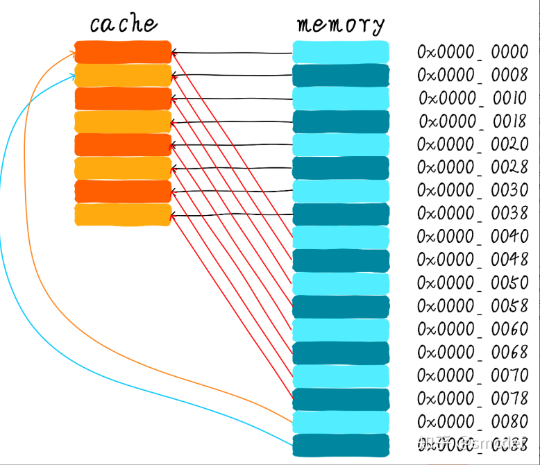

```
假设cache大小为64B,cacheline大小为8B.
1.cache中总共有8条cacheline,每条cacheline覆盖8B数据;
2.直接映射方式每个地址的数据存放在cache中的固定cacheline位置;
3.如果访问的地址依次是:0x00, 0x40, 0x80.由于这3个地址映射到同一条cacheline,每次都会发生cacheline的替换(该现象叫做cache颠簸(cache thrasing)).因此,直接映射的性能不是很好.
```

**2.直接映射实例1**

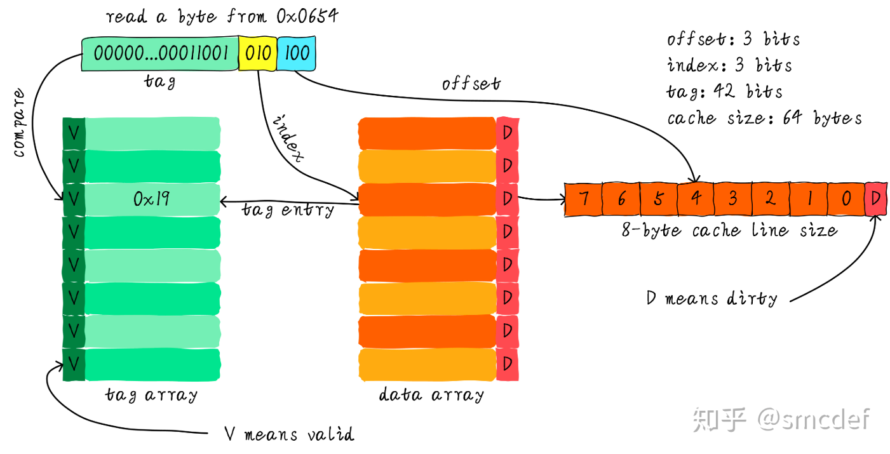

```
假设cache大小为64B,cacheline大小为8B.
1.offset:cacheline中的偏移,表示所需的数据从哪个byte开始,因为cacheline是8B,因此offset为3-bit;
2.index:查找cache中的某一行cacheline,因为总共有8条cacheline,因此index为3-bit;
3.tag:当通过index查找到某一行cacheline,需要匹配tag信息确定该cacheline是否是所需的cacheline,此处地址宽度为48-bit,因此tag为:48-3-3=42-bit;
4.V:tag array中的V表示该cacheline有效与否.当通过index找到某行cacheline后,先检查V是否为valid,如果为valie再匹配tag;否则直接miss,访问memory;
5.D:data array中的dirty bit,如果hit时发现D被置位了,此时需要将该数据刷回到memory中;否则直接将数据写入到data array中,将D置位即可.
6.图中CPU需要load 0x654(0b110, 0101, 0100),load 1B:
	index为0b010:访问cache中的第2条cacheline,如果此时V被置位,需要匹配tag,在tag array中存放的是0x19,刚好匹配.可以直接
	data array中取出数据(假设数据为0x11223344556677),取出来的数据为:0x33(偏移4B)返回给CPU.
```

**3.直接映射实例2**

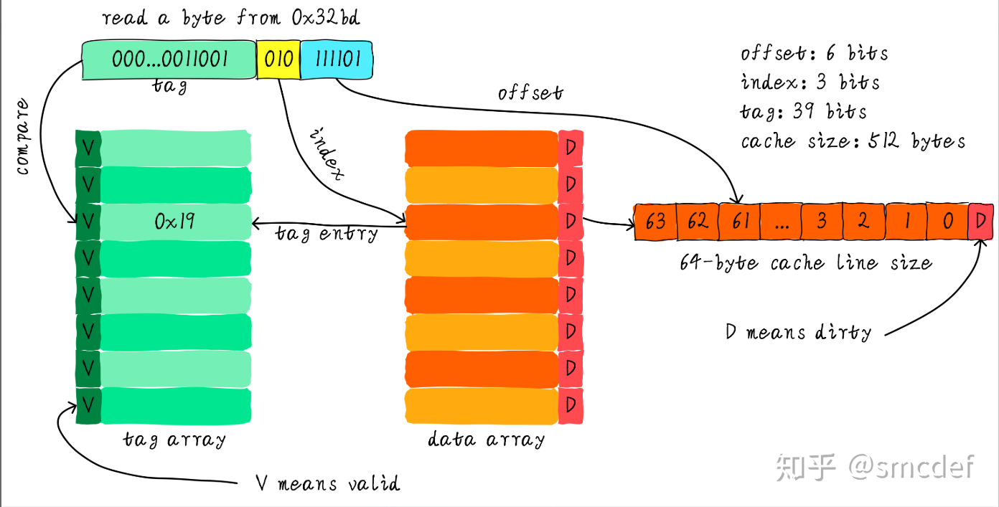

```
cache大小为512B,cacheline大小为:64B.
1.offset: 6-bit;
2.index: 3-bit(总共8条cacheline);
3.tag: 48-6-3=39-bit
```

#### 5.4.2 组相联缓存(set associative cache)

直接映射当访问的是同一条cacheline时,会发生cache颠簸.为了降低cache的颠簸,引入了组相联.

**1.两路组相联结构**

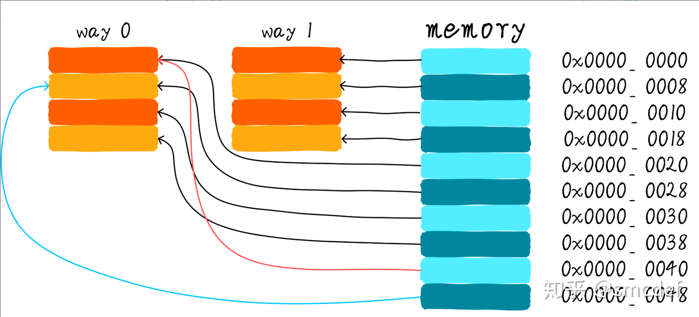

```
两路即为两条way,表示一个set里面有2条way.
如果访问的地址依次是:0x00, 0x40, 0x80.由于这3个地址映射到同一个set,此时0x00可以加载到way1,0x40可以加载到way0.0x00和0x40都缓存到了cache里,如果0x80来访问,此时就会发生替换.但很大程度上缓解了cache颠簸.
组相联的缺点:硬件成本相比直接映射要高,硬件设计复杂度也要高.
```

**2.两路组相联实例**

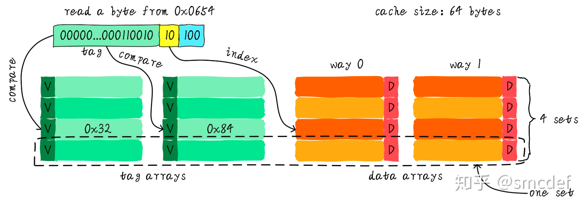

```
假设cache大小为64B,cacheline大小为8B.
1.way数:2-way;
2.set数:4-set,总共8条cacheline;
3.offset:3-bit,因为cacheline是8B;
4.index:2-bit,与set数对应,也叫set index;
4.tag:会比较2-way中的每一个tag,任意一个相等则hit;
5.V/D与直接映射一样.
```

#### 5.4.3 全相连缓存(full associative cache)

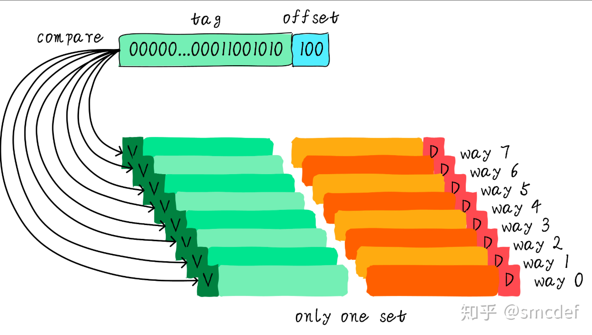

```
1.所有的cacheline在同一个set里,因此不需要index索引;
2.offset:3-bit,因为cacheline是8B;
3.tag:48-3=45-bit,地址可以存放在cache里的任意一条cacheline里,因此在对比时需要比较所有cacheline的tag.
	因此比较的开销很大,硬件成本很高.
```


## Chapter n: 常用的队列调度算法

常用的队列调度算法为:SP(strict priority,严格优先级),RR(Round Robin,循环调度),WRR(Weighted Round Robin,加权循环调度算法).

### n.1 SP调度

SP:对不同的队列设置不同的优先级,高优先级的会优先出队,只有高优先级的全部出队后,低优先级的才会出队.

	优点:配置简单,绝对保证高优先级的带宽;
	缺点:低优先级的可能会被饿死,不公平.
	PS:一般会设置防饿死机制.

### n.2 RR调度

依次调度各队列的数据包,绝对公平的调度算法.

	优点:绝对公平;
	缺点:分不清轻重急缓,高优先级的得不到优点调度.

### n.3 WRR调度

WRR:为每个队列设置一个count,根据权重weight机型初始化.每次轮询一个队列,该队列输出一个报文,且count减1.当count为0时停止调度该队列,继续调度不为0的队列.当所有的队列的count都为0时,重新初始化count,开始新一轮的调度.

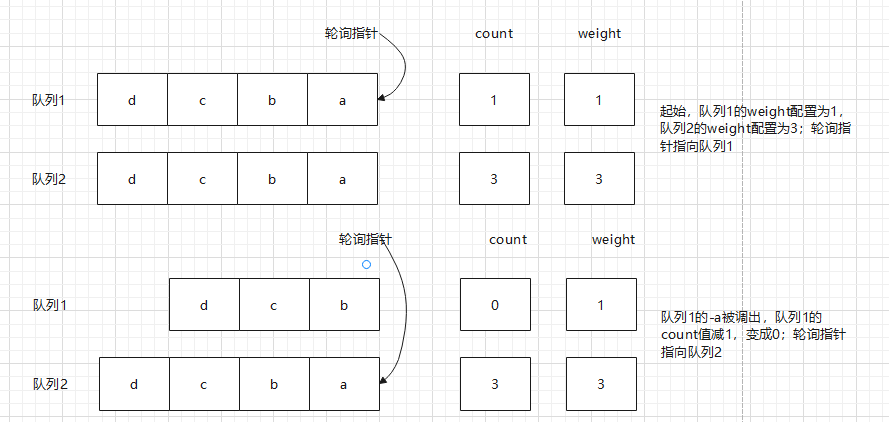

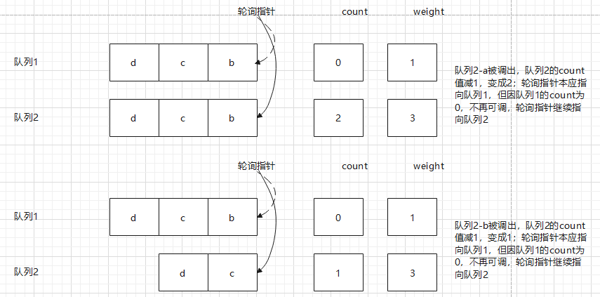

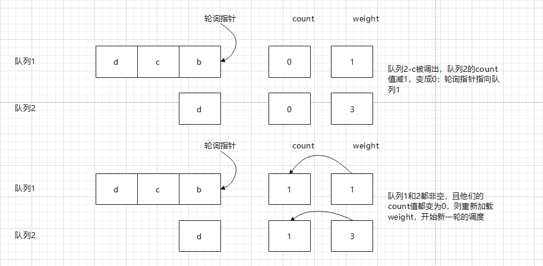