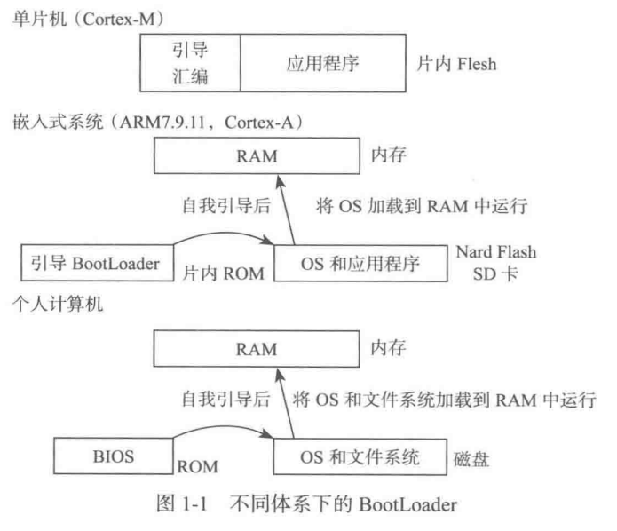
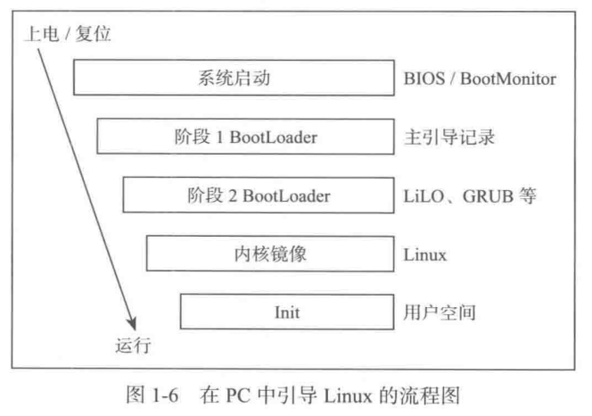

# Deep Understanding of BootLoader

## Chapter 1 BootLoader的概念

### 1.1 BootLoader的角色

	1.BootLoader提供最初的初始化代码(初始化代码由处理器体系结构下的汇编语言写成),初始化单板;
	2.BootLoader完成基本的处理器和平台的初始化之后,开始引导操作系统.主要是定位、加载操作系统,并将控制权
		转交给操作系统.

### 1.2 BootLoader的来历

BootLoader=Boot(引导)+Loader(加载器).

Boot是BootStrap(鞋带)的缩写,来源于一句谚语"Pull oneself up by one's own bootstraps"(拖着鞋带把自己拉起来).因为早期计算机存在一个问题:

	必须先运行成,计算机才能启动;但是计算机不启动就无法运行程序.后来人们想到办法将一段小程序装进内存,之后
	计算机就能正常运行了.

**1.存储技术**

1.ROM(Read only memory)

	根据能否擦除分为:ROM、PROM、EPROM和EEPROM等.

2.RAM(Random access memory)

	根据存储单元的工作原理分为:SRAM(静态随机存储器)和DRAM(动态随机存储器).
	SRAM的存取速度要比DRAM快,但价格高.在计算机中,SRAM常用作cache,DRAM用作内存.

3.Flash memory(闪存)

闪存是一种高密度、非易失性的读/写半导体存储器.既有EEPROM的特点,又有RAM的特点,是一种全新的存储结构.

	Flash主要有两种:Nor Flash(由Intel开发的)和Nand Flash(由东芝开发的).
	1.Nor Flash带有SRAM接口,可通过地址进行存寻址,可以容易的存取内部的每一个字节,可以XIP(片内执行),即应
		用程序可以直接在Nor Flash内运行;
	2.Nand Flash使用复杂的I/O来串行存取数据,读写操作都是块操作,无法做到XIP;
	3.Nor Flash的读取速度比Nand Flash稍快,但写入速度慢很多;
	4.Nand Flash的存储密度比Nor Flash更高,成本更低;
	5.很多嵌入式单板使用小容量的Nor Flash来运行启动代码,使用Nand Flash存储其他信息.

### 1.3 BootLoader的概念

不同体系下的BootLoader.

**1.PC的引导流程**

## Chapter 2 Linux开发环境

### 2.1 编辑器Vim

#### 2.1.1 Vim的两种基本模式

1.Normal模式:进入Vim后默认处于Normal模式.

2.Insert模式:输入a/A/i/I/o/O进入Insert模式.

	a:在光标所在位置后输入;
	i:在光标所在位置前输入;
	A:在光标所在行的行末输入;
	I:在光标所在行的行首输入;
	o:在光标所在行的往下新增一行输入;
	O:在光标所在行的往上新增一行输入;

Insert模式按Esc可以退回到Normal模式.

#### 2.1.2 Vim的两个常用模式

1.Command-line模式

	/--->正向搜索;
	?--->反向搜索;
	:--->一般命令;
	:set nu--->显示行号;
	:sp--->横向显示两个窗口;
	:vsp--->垂直显示两个窗口.

2.Visual模式

Visual模式进行复制/粘贴非常方便.

	V--->按行选择的Visual模式,底部显示"---VISUAL LINE---"的提示;
	v--->按字符选择的Visual模式,底部显示"---VISUAL---"的提示;
	Ctrl+v--->按块选择的Visual模式,底部显示"---VISUAL BLOCK---"的提示.

#### 2.1.3 Vim下的光标移动

1.普通移动

	h--->左移一个字符;
	j--->上移一行;
	k--->下移一行;
	l--->右移一个字符;
	10h--->左移10个字符;
	15j--->下移15行;
	Ctrl+b--->向上翻页;
	Ctrl+f--->向下翻页.

2.进阶的移动

	0/Home--->移至行首;
	^--->移至行首第一个非空白字符;
	$--->移至行尾;
	G--->移至文档尾部(最后一行的第一个非空白字符处);
	Gg--->移至文档首部(第一行的第一个非空白字符处);
	W--->移至一个word的头部;
	e--->移至后一个word的词尾;
	b--->移至前一个word的词首;
	H--->移至屏幕顶第一个非空白字符;
	M--->移至屏幕中间的第一个非空白字符;
	L--->移至屏幕底第一个非空白字符;
	:n/nG--->移至第n行行首.

3.特殊移动

	}--->移至下一个段落首;
	{--->移至上一个段落首;
	%--->匹配'{'、'}'、'['、']'、'('、')',光标停在"("上时按"%",光标会自动跳转到匹配的")"上.

#### 2.1.4 Vim下的复制、粘贴和删除

1.复制

	yy--->复制整行;
	yw--->复制光标所在位置到单词尾的字符(即复制一个单词);
	y$--->复制光标所在位置到行尾;
	y^--->复制光标所在位置到行首;
	5yy--->复制5行;
	5yw--->复制2个单词.

2.粘贴

	p--->粘贴到下一行;
	P--->粘贴到上一行.

3.删除

	x--->删除光标处的单个字符;
	dd--->删除整行;
	dw--->删除光标到单词尾的字符;
	5x--->删除光标向右的3个字符;
	5dd--->向下删除5行.

#### 2.1.5 Vim下的撤销和重复

	u--->撤销;
	Ctrl+v--->重复.

#### 2.1.6 Vim下的查找和替换

1.查找

	/--->自上而下查找;
	?--->自下而上查找.

2.替换

	:s/old/new--->new替换行中首次出现的old;
	:s/old/new/g--->new替换行中所有出现的old;
	:#,#s/old/new/g--->new替换从第#行到第#行出现的old;
	:%s/old/new/g--->new替换整个文档中出现的old;
	:s/old/new/c或:s/old/new/gc--->需要用户在替换时确认.

#### 2.1.7 Vim下的文件的恢复

vim编辑文件时会生成一个临时文件(文件后缀尾.swp),正常退出自动删除,意外退出则不会删除.下一次编辑时处理如下:

	O--->只读打开;
	E--->继续编辑文件,不恢复.swp文件保存的内容;
	R--->恢复上次编辑以后未保存的文件内容(恢复使用这个即可);
	Q--->退出vim;
	D--->删除.swp文件;
	vim -r filename/vim -r filename.swp--->也可以恢复未保存的文件内容.

### 2.2 编译器GCC和交叉编译器

#### 2.2.1 常用编译选项

1.总体选项

	-x language--->指定后续输入文件的语言(C/C++/Ojective-C/assembler/go/Java等);
	-c--->预处理+编译+汇编,不链接;
	-S--->预处理+编译,生成汇编代码;
	-E--->仅预处理;
	-o file--->指定输出的目标文件名称为file.

2.专业选项

	-ansi--->C语言下等价于-std=c90,C++等价于-std=c++98;
	-std=--->确定语言标准(e.g. -std=c++11);
	--ffreestanding--->按独立环境编译,包含声明了"-fno-builtin"选项,没有main函数也可以编译通过.

3.警告选项

	-fsyntax-only--->检查代码中的语法错误,但不产生错误信息;
	-w--->屏蔽所有警告信息;
	-Werror--->所有警告当作错误;
	-Werror=xxx--->指定的警告(xxx)当作错误;
	-Wpedantic--->拒绝所有不遵循ISO C/C++标准的程序;
	-pedantic-errors--->和-Wpedantic类似,但警告当错误处理;
	-Wall--->打开所有类型的语法警告,建议编译时将该选项作为默认选项.

4.调试选项

	-g--->gdb使用该选项做调试用;
	-p--->用于输出profile信息,供分析程序prof使用;
	-pg--->gdb+prifile的用途.

5.优化选项

	-O0--->不做任何优化,减少编译时间,调试时使用该选项可以看到中间变量的值;
	-O1--->第一级优化,优化编译会占用较多的时间和较多的内存,但代码执行快;
	-O2--->第二级优化;
	-O3--->第三级优化(最大优化),调试时不适合使用该参数.

6.目录选项

	-Idir--->头文件搜索路径列表添加dir目录(适用于#inclue "xxx");
	-Ldir--->指定库搜索路径(自己的库),不然只在标准库的目录中找.

7.链接选项

	-llibrary--->指定链接时使用的库;
		gcc -lcurses hello.c	//使用curses库编译程序

### 2.3 常用shell命令和脚本

find/grep/管道在"linux_command_usage.md"中有使用方法.

### 2.4 Make和Makefile

GNU+make有详细的说明.

## Chapter 3 ARM体系结构

略.

## Chapter 4 ARM指令集

### 4.1 数据处理指令

**1.移动指令**

用于给寄存器设置立即数或在寄存器之间传输数据.

	mov r9, sp	//将sp寄存器中的值复制到r9中
	mov r0, #0	//将寄存器r0的值设为0
	mvn r1, #0	//mvn为取反,将0取反后赋给r1,即将寄存器r1的值设为0xFFFF_FFFF

**2.移位器**

共有5中移位操作:LSL(逻辑左移)、LSR(逻辑右移)、ASR(算数右移)、ROR(循环右移)、RRX(扩展的循环右移).通常与数据处理指令一起使用.

	mov r1, r1, LSL #9	//r1的值逻辑左移9位后仍然赋值给r1(LSL后面直接跟立即数,不能加逗号)

**3.算数指令**

算数指令执行32-bit的有符号和无符号数的加减法.

	inst Rd, Rn, N
	ADC--->带进位的加法		Rd = Rn + N + carry
	ADD--->加法				Rd = Rn + N
	RSB--->反向减法			Rd = N - Rn
	RSC--->带错位的反向减法	Rd = N - Rn - !(carry flag)
	SBC--->带错位的减法		Rd = Rn - N - !(carry flag)
	SUB--->减法				Rd = Rn - N
	//实例
	#define S_FRAME_SIZE	(72)
	sub sp, sp, #S_FRAME_SIZE	//sp = sp - 72
	add r0, sp, #S_FRAME_SIZE	//r0 = sp + 72

**4.使用移位器的算数指令**

	add r0, r1, r1, LSL #2	//r0 = r1 + (r1 << 2),即r0 = r1 * 5

**5.逻辑运算指令**

执行两个源寄存器的逻辑位运算.

	inst Rd, Rn, N
	AND--->逻辑与操作		Rd = Rn & N
	ORR--->逻辑或操作		Rd = Rn | N
	EOR--->逻辑异或操作		Rd = Rn ^ N
	BIC--->逻辑清位操作		Rd = Rn & (~N)
	//实例
	and r1, r0, #0x1f		//r1 = r0 & 0x1f
	orr r0, r0, #0xc0		//r0 = r0 | 0xc0

**6.比较指令**

将寄存器与一个32-bit的数做比较或测试,根据结果更新cpsr的标志位,但不影响其他的寄存器.

	inst Rn, N
	CMN--->否定比较,依照Rn + N的结果来设定标志位
	CMP--->比较,依照Rn - N的结果来设定标志位
	TEQ--->测试两个32-bit的数是否相等,依照Rn ^ N的结果来设定标志位
	TST--->测试一个32-bit的数的位,依照Rn & N的结果来设定标志位
	//实例
	teq r1, #0x1a	//比较r1与0x1a是否相等,并设定标志位

**7.乘法指令**

乘法指令将一对寄存器的值相乘,将结果存入到另一个寄存器中.长乘法累加指令将一对寄存器相乘后得到一个64-bit的值,结果存入一对寄存器中.

乘法指令

	MLA--->乘法和累加
	MLA Rd, Rm, Rs, Rn	// Rd = (Rm * Rs) + Rn
	MUL--->乘法
	MUL Rd, Rm, Rs		// Rd = Rm * Rs

长乘法指令

	inst RdLo, RdHi, Rm, Rs
	SMLAL--->有符号的长乘法累加		[RdHi, RdLo] = [RdHi, RdLo] + (Rm * Rs)
	SMULL--->有符号的长乘法			[RdHi, RdLo] = Rm * Rs
	UMLAL--->无符号的长乘法累加		[RdHi, RdLo] = [RdHi, RdLo] + (Rm * Rs)
	UMULL--->无符号的长乘法			[RdHi, RdLo] = (Rm * Rs)
	//实例
	mla r3, r4, r1, r3	// r3 = (r4 * r1) + r3

### 4.2 分支指令

	