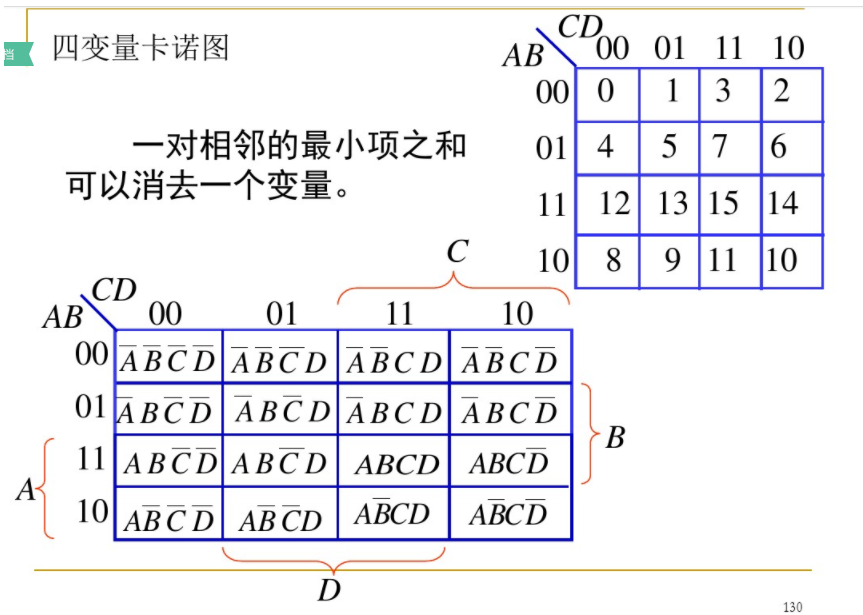
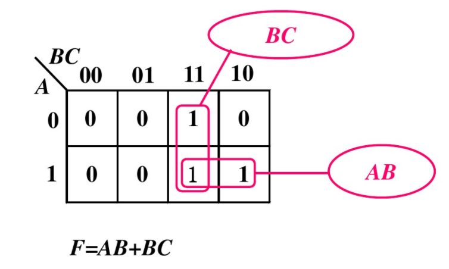
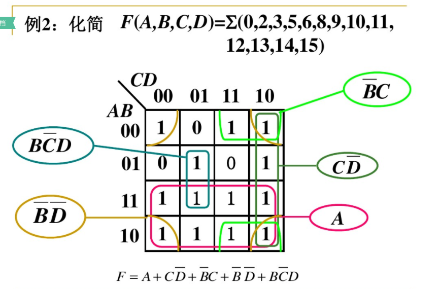
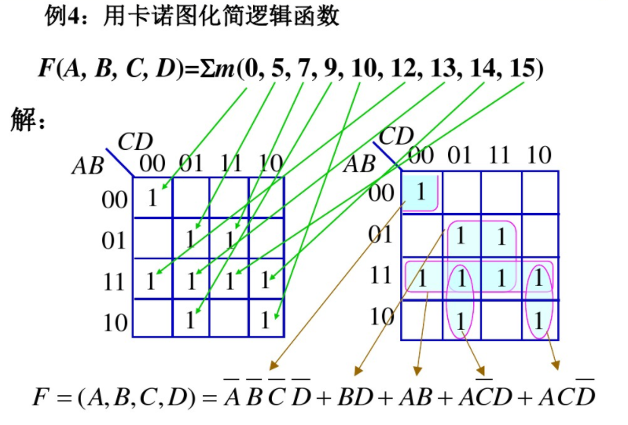

# Digital Circuit Learning

## Chapter 1 数制与编码

### 1.1 进位计数制

主要有十进制、二进制、八进制、十六进制.

二进制数的特点:

	1.运算规则简答;
	2.节省设备.
		e.g.表示数字0~999.
		十进制:需要3位,每位10个数字.共需要30个数字设备;
		二进制:需要10位,每位2个数字.共需要20个数字设备.

### 1.2 数制转换

#### 1.2.1 多项式替代法(R--->10)

一般用于任意进制--->10进制.

	(11011.11)2=1x2^4+1x2^3+0x2^2+1+2^1+1x2^0+1x2^-1+1x2^-2=(27.72)10
	(321.4)8=3x8^2+2x8^1+1x8^0+4x8^-1=(209.5)10

#### 1.2.2 基数乘除法(10--->R)

一般用于10进制--->任意进制.

**1.整数转换--->基数除法**

规则:除基取余,商零为止.

1.10进制到2进制

	2	|	25	--->余1	低位
	2	|	12	--->余0
	2	|	6	--->余0
	2	|	3	--->余1
	2	|	1	--->余1	高位
			0	--->商为0(结束)
	因此:	(25)10=(11001)2

2.10进制到16进制

	16	|	54	--->余6	低位
	16	|	3	--->余3	高位
			0	--->商为0(结束)
	因此:	(54)10=(36)16

**2.小数转换--->基数乘法**

规则:乘基取整,满足精度要求为止.

1.10进制到2进制

		0.125
	x		2
		0.25	--->取整数(此处为0).小数点后第1位
	x		2
		0.5		--->取整数(此处为0).小数点后第2位
	x		2
		1.0		--->取整数(此处为1).小数点后第3位
	因此:	(0.125)10=(0.001)2

2.10进制到4进制

		0.125
	x		4
		0.5		--->取整数(此处为0).小数点后第1位
	x		4
		2.0		--->取整数(此处为2).小数点后第2位
	因此:	(0.125)10=(0.02)4

**3.综合转换(29.93)10--->转成二进制**

1.整数部分

	2	|	29	--->余1	低位
	2	|	14	--->余0
	2	|	7	--->余1
	2	|	3	--->余1
	2	|	1	--->余1	高位
			0	--->商为0(结束)
	因此: (29)10=(11101)2

2.小数部分

		0.93
	x		2
		1.86	--->取出整数(此处为1).小数点后第1位
	x		2
		1.72	--->取出整数(此处为1).小数点后第2位
	x		2
		1.44	--->取出整数(此处为1).小数点后第3位
	x		2
		0.88	--->取出整数(此处为0).小数点后第4位
	x		2
		1.76	--->取出整数(此处为1).小数点后第5位
		...		--->到达第五位,后面省略
	因此: (0.93)10=(0.11101)2

3.最终的数

	(29.93)10=(11101.11101)2

#### 1.2.3 混合法(a--->10--->b)

a进制先转成10进制再转成b进制.

	(2022)3=(62)10=(76)8

#### 1.2.4 直接转换法

一般在2,8,16进制之间转换.

1.8进制<--->2进制之间转换

规则:3位2进制位表示一个8进制数.

	(010 011 100 101 101 001 000.010)B=
	(  2   3   4   5   5   1   0.  2)O
	因此:	(010011100101101001000.01)B=(2345510.2)O

2.16进制<--->2进制之间转换

规则:4位2进制位表示一个16进制数.

	(1001 1100 1011 0100 1000.0100)B=
	(   9    C    B    4    8.   4)H
	因此:	(10011100101101001000.01)B=(9CB48.4)H

PS:注意从小数点开始向前后向后数3/4位,不足的补0.

### 1.3 带符号数的代码表示

符号位为0表示正数;符号位为1表示负数.--->一般符号位为多出的一个位.

#### 1.3.1 原码

1.组成

	符号位	+	数值位
	正-->0		不变
	负-->1		不变

	x1=+1101	[x1]原=01101
	x2=-1101	[x2]原=11101

2.特点

	1.直观易辨认;
	2.有2个0;
		[+0]原=00000
		[-0]原=10000
	3.符号不参与运算--->因此很少用原码来进行算数运算;
	4.数值范围:-(2^(n-1)-1)~+(2^(n-1)-1).

#### 1.3.2 反码

1.组成

	符号位	+	数值位
	正-->0		不变
	负-->1		取反

	x1=+1101	[x1]反=01101
	x2=-1101	[x2]反=10010

2.特点

	1.正数的反码同原码,负数的反码数值位按位取反;
	2.有2个0;
		[+0]反=00000
		[-0]反=11111
	3.反码的反码为原码;
		x1=-1101	[x1]反=10010
		[[x1]反]反=11101=[x1]原
	4.数值范围:-(2^(n-1)-1)~+(2^(n-1)-1).
	5.两数和的反码等于两数反码之和;
	6.符号位参与运算,有进位时循环相加(会用于算数运算).

3.实例

	x1=1100,x2=1010.求y1=x1-x2; y2=x2-x1?
	[x1]反=01100,	[-x1]反=10011;
	[x2]反=01010,	[-x2]反=10101;

	[y1]反=[x1]反+[-x2]反=
			01100
		+	10101
		   100001	--->有一个进位,循环相加(去掉进位1,值+1)
		+		1
			00010
	因此:
	[y1]反=[x1]反+[-x2]反=00010--->[y1]原=[[y1]反]反=00010--->y1=+0010

	[y2]反=[x2]反+[-x1]反=
			01010
		+	10011
			11101
	因此:
	[y2]反=[x2]反+[-x1]反=11101--->[y2]原=[[y2]反]反=10010--->y1=-0010

#### 1.3.3 补码

1.组成

	符号位	+	数值位
	正-->0		不变
	负-->1		取反+1

	x1=+1101	[x1]补=01101
	x2=-1101	[x2]补=10011

2.特点

	1.正数的补码同原码,负数的补码数值位按位取反+1;
	2.只有1个0;
		[+0]补=00000
		[-0]补=11111+1=00000
	3.补码的补码为原码;
		x1=-1101	[x1]补=10011
		[[x1]补]补=11101=[x1]原
	4.数值范围:-(2^(n-1)-1)~+(2^(n-1)-1).
	5.两数和的补码等于两数补码之和;
	6.符号位参与运算,有进位时丢弃.

3.实例

	x1=1100,x2=1010.求y1=x1-x2; y2=x2-x1?
	[x1]补=01100,	[-x1]补=10100;
	[x2]补=01010,	[-x2]补=10110;

	[y1]补=[x1]补+[-x2]补=
			01100
		+	10110
		   100010	--->有一个进位,直接丢弃
	因此:
	[y1]补=[x1]补+[-x2]补=00010--->[y1]原=[[y1]补]补=00010--->y1=+0010

	[y2]补=[x2]补+[-x1]补=
			01010
		+	10100
			11110
	因此:
	[y2]补=[x2]补+[-x1]补=11110--->[y2]原=[[y2]补]补=10010--->y1=-0010

### 1.4 常用的一般编码

#### 1.4.1 二~十进制编码

**BCD码---Binary Coded Decimal**

四个二进制位表示一位十进制数(0~9),称为BCD码.

	主要有:8421码、5421码、2421码、余3码.

**1.8421码**

4位二进制位表示的前10个数表示10进制的0~9.

	二进制数		8421码
	0000		0
	0001		1
	0010		2
	0011		3
	0100		4
	0101		5
	0110		6
	0111		7
	1000		8
	1001		9
	1010		后面的都是冗余码		
	1011
	1100
	1101
	1110
	1111

1.特点:

	1.有权码.从左到右为8,4,2,1;
	2.与自然二进制数排列一致.1010~1111为冗余码;
	3.8421码与10进制具有直接转换关系:
		(0001 0011.0110 0100)8421BCD=(13.64)10	--->4个二进制位表示一个十进制数
	4.运算时逢10进1的原则.当有进位或出现冗余码时,+6进行调整.

2.8421运算例子:

	1.8+9=17
			1000
		+	1001
		   10001	--->有进位.+6进行调整
		+	0110
			0111	--->因此最终的结果为:1 0111
	2.7+6=13
			0111
		+	0110
			1101	--->1101是一个冗余码.+6进行调整
		+	0110
		   10011	--->因此最终的结果为:1 0011

**2.2421码**

4位二进制位表示的前后各5个数表示10进制的0~9.

	二进制数		8421码
	0000		0
	0001		1
	0010		2
	0011		3
	0100		4
	0101
	0110
	0111
	1000
	1001
	1010
	1011		5
	1100		6
	1101		7
	1110		8
	1111		9

**3.余3码**

由8421码加3形成.其他略.

#### 1.4.2 可靠性编码

能减少错误,发现错误,甚至纠正错误的编码称为可靠性编码.

**1.格雷码**

1.格雷码转换---二进制数到二进制格雷码

在一组数的编码中,如果任意相邻的代码只有一位二进制数不同,即为格雷码.特点:编码本身不易出错.

编码规则:

	1.最高位不动--->Gn-1=Bn-1;
	2.其他位从低位开始,每一位与前一个比特做异或得到当前位.--->Gi=Bi⊕Bi+1

实例---13的格雷码

	(1   1   0   1)B
	   ⊕   ⊕   ⊕
	 1   0   1   1
	说明:
	1.最高位1不动,即格雷码最高为"1";
	2.第0位与第1位异或得到格雷码第0位为"1";
	3.第1位与第2位异或得到格雷码第1位为"1";
	2.第2位与第3位(此处为最高位)异或得到格雷码第2位为"0";
	因此:	(1101)B=(1011)G.

2.二进制格雷码到二进制数的转换

转换规则:

	1.最高位不动---Bn-1=Gn-1;
	2.从次高位开始,每一位(格雷码)与前一个二进制数(已经计算出来的)做异或得到当前位.--->Bi=Bi+1⊕Gi

实例---7的格雷码为(0100)G转换为二进制数
	
	(0   1   0   0)G
	   ⊕   ⊕   ⊕
	 0   1   1   1
	说明:
	1.最高位0不同,即二进制数最高位为"0";
	2.第2位(次高位)与二进制数的第3位(最高位)做异或得到二进制数第2位为"1";
	3.第1位与二进制数的第2位做异或得到二进制数第1位为"1";
	4.第0位与二进制数的第1位做异或得到二进制数第0位为"1";
	因此:	(0100)G=(0111)B

3.步进码

略.

**2.奇偶校验码**

奇偶校验码由信息位+校验位(最后1位)组成.特点:出错能检查出来.

	在形成的奇偶校验码中:
	1.1的个数为奇数--->奇校验码;
	2.1的个数为偶数--->偶校验码.

1.校验位的形成(8421BCD码为例)

	1.奇校验位为:
		P=B8 ⊕ B4 ⊕ B2 ⊕ B1 ⊕ 1	--->最后需要异或上一个1.
		e.g.
		0101--->奇校验位为:P=0 ⊕ 1 ⊕ 0 ⊕ 1 ⊕ 1 = 1;
		因此最终的奇校验码为:01011.	--->其1的个数为奇数.
	2.偶校验位为:
		P=B8 ⊕ B4 ⊕ B2 ⊕ B1		--->各个位的异或即可.
		e.g.
		0101--->偶校验位为:P=0 ⊕ 1 ⊕ 0 ⊕ 1 = 0;
		因此最终的奇校验码为:01010.	--->其1的个数为偶数.

2.实例---奇校验传送1001.

	1.校验位为: P=1 ⊕ 0 ⊕ 0 ⊕ 1 ⊕ 1 = 1;
	2.奇校验码为:10011.会将这个校验码进行传送.
	3.传送过程中的校验:
		P'=B8 ⊕ B4 ⊕ B2 ⊕ B1 ⊕ P = 1.因此接收到"10011"是正确的.
		如果接收到:10111,校验:
		p'=1 ⊕ 0 ⊕ 1 ⊕ 1 ⊕ 1 = 0.表明接收到的数据是错误的.

**3.汉明码**

特点:检查并能纠错.

其他略.

***

## Chapter 2 逻辑代数基础

### 2.1 基本逻辑运算

#### 2.1.1 "与"运算(逻辑乘)

逻辑代数中的"与"逻辑关系使用运算符"·"或"∧"表示.

两变量的"与"可表示为:

	F=A·B	或 F=A∧B	--->简写为:F=AB.读作:F等于A与B.

#### 2.1.2 "或"运算(逻辑加)

逻辑代数中的"或"逻辑关系使用运算符"+"或"∨"表示.

两变量的"或"可表示为:

	F=A+B	或 F=A∨B	--->读作:F等于A或B

#### 2.1.3 ""非运算(逻辑非)

逻辑代数中的"非"逻辑关系使用运算符"-(字母上面的一横线)"或"¬"表示.

一个变量的"非"可表示为:

	  _	
	F=A		或 F=¬A		--->读作:F等于A非.

### 2.2 逻辑代数的基本公式和规则

#### 2.2.1 基本公式

**1.基本运算公式**

1.与

	0·0 = 0
	0·1 = 0
	1·0 = 0
	1·1 = 1

2.或

	0+0 = 0
	0+1 = 1
	1+0 = 0
	1+1 = 1

3.非

	_
	1 = 0
	_
	0 = 1

4.0-1律

	0·A = 0
	1·A = A
	0+A = A
	1+A = 1

5.重叠律

	A·A = A
	A+A = A
	  _
	A·A = 0
	  _
	A+A = 1

**2.与普通代数相类似的公式**

1.交换律

	A+B = B+A

2.结合律

	A+(B+C) = (A+B)+C

3.分配律

	A(B+C) = AB + AC
	A+BC = (A+B)(A+C)
	证明:
	(A+B)(A+C)=A+AC+BA+BC=A(1+C)+BA+BC=A+BA+BC=(1+B)A+BC=A+BC

**3.逻辑代数的特有公式**

1.摩根定理

	___   _ _
	A+B	= A·B
	___   _ _
	A·B = A+B

2.吸收律

	A+A·B = A
	A·(A+B) = A+A·B = A
	  _
	A+A·B = A+B		--->这是为什么???
	   _
	A·(A+B) = A·B

3.包含律

		_			 _	    _		  _	 	 _		  _
	A·B+A·C+BC = A·B+A·C+(A+A)BC = AB+AC+ABC+ABC = AB+AC
		   _				   _
	(A+B)·(A+C)·(B+C) = (A+B)·(A+C)

4.尾部交换

	  _		__		__	    _ _		 _
	A·B = A·AB	=>A·AB = A·(A+B) = A·B

**4.两种常用的运算公式**

1.异或(变量相异为1,相同为0)

	          _	  _
	A ⊕ B = A·B = A·B

2.同或(变量相同为1,相异为0)

				  _ _
	A ⊙ B = A·B + A·B

3.距离

	A ⊕ 0 = A
			_
	A ⊕ 1 = A
			_
	A ⊙ 0 = A
	A ⊙ 1 = A
			______
	A ⊕ B = A ⊙ B
			______
	A ⊙ B = A ⊕ B

#### 2.2.2 逻辑代数的重要规则

反演、对偶、代入--->略.

### 2.3 逻辑函数的化简

#### 2.3.1 代数化简法

函数表达式一般化简成与或视,满足两个条件:

	1.表达式中"与项"的个数最少;
	2.满足1的前提下,每个"与项"中的变量个数最少.
	PS:难以判断结果是否为最简.

化简实例1
	     _		     _		    _			 _	
	F = AC + ABC + ACD + CD = A(C + BC) + C(AD + D)
		  _								  _
	  = A(C + B) + C(A + D)		//使用:A + AB = A + B
		 _					  _
	  = AC + AB + AC + CD = A(C + C) + AB + CD

	  = A(1 + B) + CD = A + CD

化简实例2

			  _	  _		_	_	  _
	F = AB + AC + BC + BC + BD + BD + ADE(F+G)
		 —————
		 —————
		    _	 _	   _   _	 _
	  = A(B+C) + BC + BC + BD + BD + ADE(F+G)
		 __
		 _	  _		_	_	  _
	  = ABC + BC + BC + BD + BD + ADE(F+G)
			_	  _	  _		_						  _
	  = A + BC + BC + BD + BD + ADE(F+G)	//使用:A + AB = A + B
			_  _	   _   _	 _	 _
	  = A + BC(D+D) + BC + BD + BD(C+C)
			 _	 _	   _
	  = A + CD + BD + BC

#### 2.3.2 卡诺图化简法

**1.卡诺图**

1.二变量卡诺图(A, B)表示如下:

	  A
	B  ____0____1____
	0 |   m0    m2  |
	1 |   m1    m3	|
	  |_____________|
					   _ _
	1.m0表示A,B均为0.即为A·B,也就是00--->刚好等于0;
						_
	2.m1表示A为0,B为1.即为A·B,也就是01--->刚好等于1;
						  _
	3.m2表示A为1,B为0.即为A·B,也就是10--->刚好等于2;

	4.m3表示A为1,B为1.即为A·B,也就是11--->刚好等于3;

2.三变量卡诺图(A, BC)表示如下:

	  BC
	A  ____00____01____11____10____
	0 |    m0    m1    m3	 m2   |
	1 |    m4    m5    m7    m6   |
	  |___________________________|
		
	PS:三变量的卡诺图在BC(两个一起的变量)取到00, 01后先11,再10.符合先最外层变量再最里层变量规则.
		   				_ _ _
	1.m0表示A,BC均为0.即为A·BC,也就是000--->刚好等于0;
						  _ _
	2.m1表示A为0,BC为01.即为A·BC,也就是001--->刚好等于1;
						  _   _
	3.m2表示A为0,BC为10.即为A·BC,也就是010--->刚好等于2;
						  _
	4.m3表示A为0,BC为11.即为A·BC,也就是011--->刚好等于3;

	4.5.6.7依次类推.

3.四变量卡诺图(AB, CD)表示如下:

**2.卡诺图化简**

1.例1

					_			   _
	函数表达式为: F = ABC + ABC + ABC
	画出卡诺图为:

	  BC
	A  ____00____01____11____10____
	0 |    0     0     1	 0    |
	1 |    0     0     1     1    |
	  |___________________________|

	在逻辑表达式中存在一项则在卡诺图中标注为1;不存在的为0.

卡诺图计算如下:

2.例2

3.例3

***

## Chapter 3 逻辑门电路

