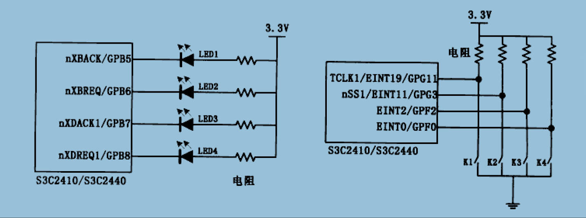
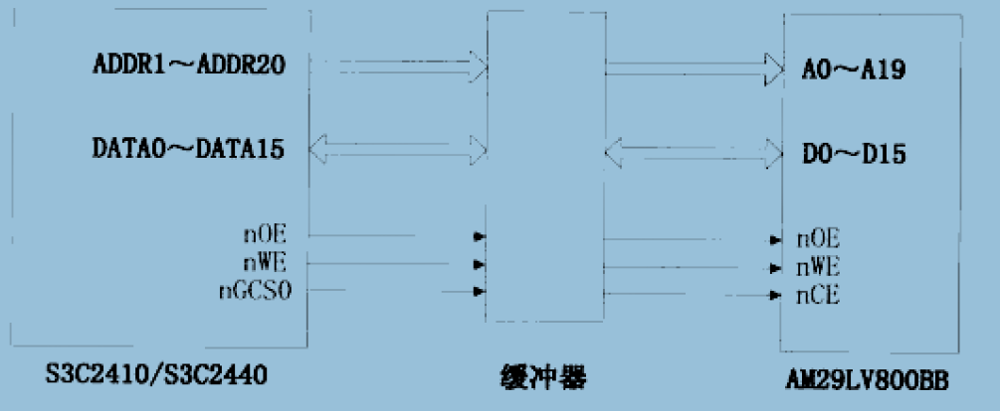
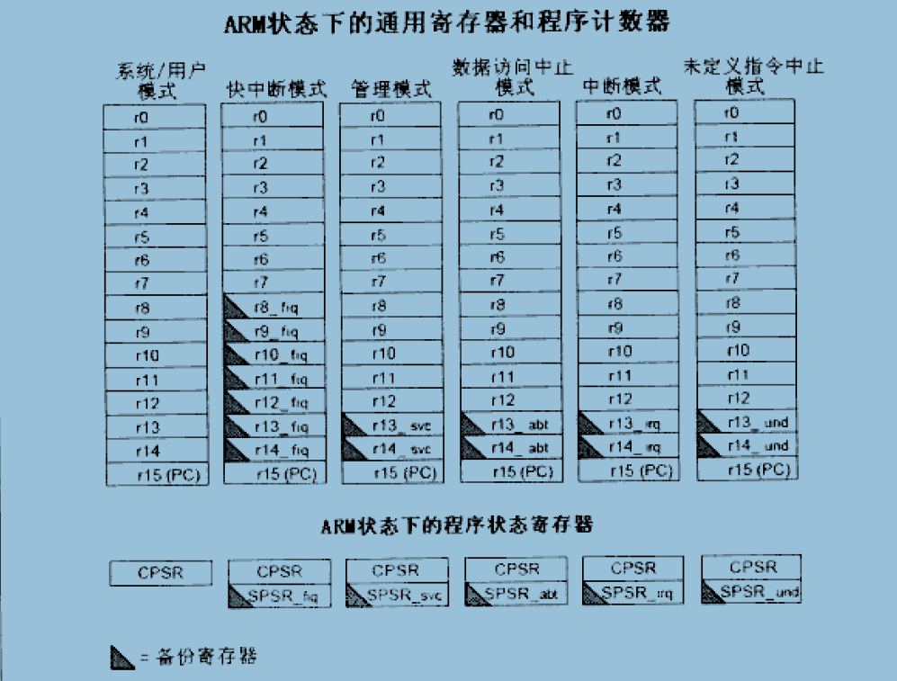
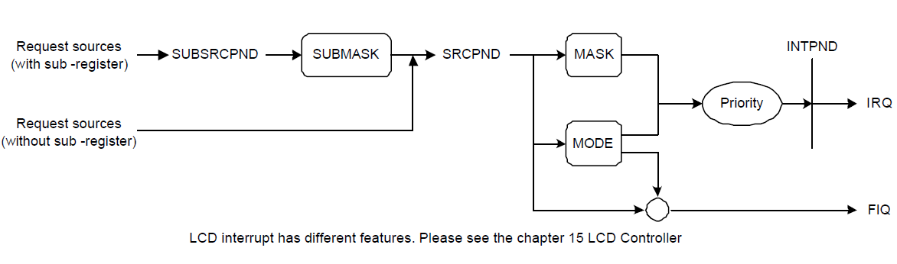
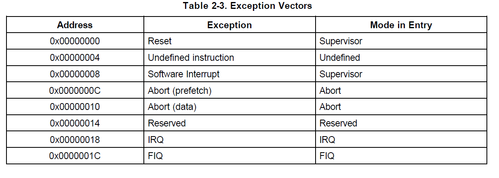
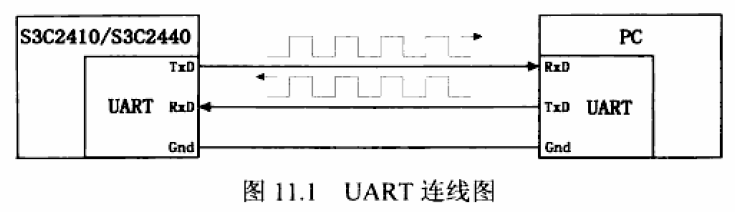
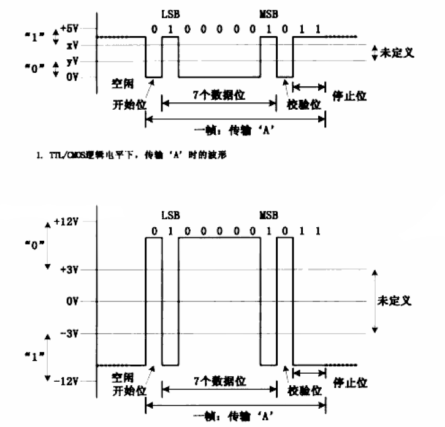
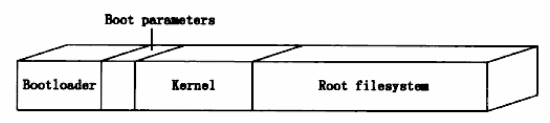

# Embedded Linux Fully Development Manual

# 第1篇 嵌入式Linux开发环境构建篇

## Chapter 1 嵌入式Linux开发概述

略--->主要是一些介绍性的内容.

## Chapter 2 嵌入式Linux开发环境构建

***

***

# 第2篇 ARM9嵌入式系统基础实例篇

## Chapter 5 GPIO接口

### 5.1 GPIO硬件介绍

GPIO(General Purpos I/O ports):通用输入/输出端口.可以通过这些端口输出高低电平/读入引脚状态(高低电平).

S3C2440有130个I/O端口,分为GPA、GPB、...、GPJ.

**5.1.1 通过寄存器来操作GPIO引脚**

1)GPxCON寄存器---配置(Configure)寄存器,即选择引脚功能.

	1)GPACON---每一位对应一根引脚(共23跟引脚).当某个置0时,相应引脚为输出引脚,此时可以在GPADAT中相应为写1或0让该引脚输出
	高/低电平;当某个置1时,相应引脚为地址线/或用于地址控制(此时GPADAT无用).一般GPACON全设为1,用于访问外部存储器件.
	2)GPxCON(B~J):每两位控制一根引脚.00(输入)、01(输出)、10(特殊功能)、11(reserved).

2)GPxDAT寄存器---数据(Data)寄存器,读写引脚.

	1)如果引脚设为输入,读对应的GPxDAT寄存器可知相应引脚的电平的状态为高电平还是低电平.
	2)如果引脚设为输出,写对应的GPxDAT寄存器可令相应的引脚输出高电平或低电平.

3)GPxUP寄存器---上拉(Up)寄存器,保护.

	1)GPxUP某位为1时,相应引脚内部无上拉电阻.
	2)GPxUP某位为0时,相应引脚使用内部上拉电阻.

上拉电阻/下拉电阻作用---当GPIO引脚处于第三态(非输出高低电平(只有在输出才存在),处于高阻态,即相当于没接芯片)时,此时的电平状态有上拉/下拉电阻确定.

**5.1.2 使用软件来访问硬件**

1)访问单个引脚

单个引脚的操作有3中:输出高低电平、检测引脚状态(输入)、中断.---最终都是通过读写寄存器来完成.

实例---点亮LED1

	#define GPBCON		(*(volatile unsigned long *)0x56000010)		//GPB的配置寄存器	
	//volatile:确保每次去内存中读取变量的值,而不是从cache或寄存器中读取
	#define GPBDAT		(*(volatile unsigned long *)0x56000014)		//GPB的数据寄存器
	GPBCON = ((GPBCON | (1<<10)) & (~(1<<11)));		//GPBCON的[11:10] = 01为设置GPB5为输出
	GPBDAT &= (~(1<<5))		//GPBDAT[5]=0表示设置GPB5输出低电平,此时点亮LED1.

2)以总线方式访问硬件---Nor Flash

地址线ADD1~ADDR20,可寻址1MB的大小,因此Nor Flash大小为1MB.

	1)缓冲器作用:提高驱动能力、隔离前后级信号;
	2)Nor Flash(AM29LV800BB)的片选信号使用S3C2410/S3C2440的nGCS0信号.当CPU发出的地址信号处于0x0000_0000~0x07FFF_FFFF时,
	nGCS0信号有效(低电平有效),此时Nor Flash被选中(因为Nor Flash的地址范围刚好在这段区域).
	3)当nGCS0信号有效时,CPU发出的处于Nor Flash的地址范围的地址会送到Nor Flash.当需要写Nor Flash时,nWE信号为低,数据由CPU发给
	Nor Flash;当需要读Nor Flash时,nWE信号为高,数据由Nor Flash发给CPU.
	4)图中的读写地址线16根(D0~D15),因此读写操作都是以16 bit(2 byte)为单位.

实例1---地址对齐的16 bit读操作(2 byte读)

	unsigned short *pwAddr = (unsigned short *)0x2;	//0x2(10)地址.因为CPU上是从ADDR1~ADDR20(ADDR0为0,
		//但没有接到Nor Flash上),因此传到Nor Flash的A0~A19为1,0,...,0.Nor FLash上接收到的地址为0x1(第一个16 bit).
		//但由于Nor Flash是16 bit对齐,因此该地址需要"*2",即最终操作的地址为:0x1*2=0x2.
	unsgined short wVal;
	wVal = *pwAddr;		//读取Nor Flash上0x1位置的数据---真正读取Nor Flash的地址为:0x2(10B),0x3(11B)---一次2byte数据.

	//Nor Flash:因为数据线是16根(外设位宽16),因此在对Nor Flash进行操作时是地址2 byte对齐的,每次读写2 byte数据.
			读写时只需要地址2 byte对齐即可,硬件有自己的转换方法
	//DRAM:数据线32根(位宽32),对DRAM操作时是地址4 byte对齐.每次读写4 byte数据.读写时只需要地址4 byte对齐即可,
			硬件有自己的转换方法.
	//CPU位数:表示CPU一次性可以处理的字节数(e.g.32位CPU一次处理4 byte的数据).

实例2---地址不对齐的16 bit读(会有异常,一般不要这样操作)

	unsigned shor *pwAddr = (unsigned short *)0x1;		//0x1此时不是地址2 byte对齐,会导致异常.
		//要读到0x1位置的数据.需要异常处理函数.先读0x0---得到0x00,0x01两字节数据;在读0x2---得到0x10,0x11量字节数据.
		//再取0x01,0x10组成一个16 bit的数据返回.

实例3---8 bit读操作(地址2 byte对齐)

	unsigned char *pucAddr = (unsigned char *)0x6;	//0x6为2 byte对齐的地址.
	unsigned char ucVal;	//8 bit的数据一般声明为"unsigned char"
	ucVal = *pucAddr;	//pucAddr得到2 byte数据,会将低字节(即0x6地址的数据)赋给变量ucVal.0x7地址的数据丢掉.

实例4---32 bit读操作(地址2 byte对齐)

	unsigned int *pdAddr = (unsigned int *)0x6;	//读取0x6和0x8地址上的数据(32 bit---4 byte)
	unsigned int udwVal;	//32 bit的数据一般声明为"unsigned int"
	udwVal = *pdAddr;

实例5---16 bit写操作

	unsigned short *pwAddr = (unsigned short *)0x6;
	*pwAddr = 0x1234;		//给0x6写入0x1234(16 bit)---只需要给地址中的内容赋值即可.

### 5.2 GPIO操作实例:LED和按键

**实例1---使用汇编代码点亮一个LED**

	/*led_on.S---汇编代码*/
	.text
	.global _start
	_start:
		LDR	R0, =0x56000010		@LDR指令总是由右向左loader(<---).设置R0为GPBCON寄存器.设置寄存器使用"LDR"指令
		MOV R1, #0x00000400		@设置寄存器R1的值为立即数(#标识)0x00000400.设置寄存器为某个值使用"MOV"指令
		STR R1, [R0]			@STR指令总是从左向右(--->).将R1的立即数写入到[R0]寄存器中.
		//上面是配置GPB5用于输出
		LDR R0, =0x56000014		@设置R0为GPBDAT寄存器
		MOV R1, #0x00000000		@让GPBDAT(5)输出0,点亮LED1.如果改变值为0x00000020([5]=1)---熄灭
		STR R1, [R0]			@LED1点亮
	MAIN_LOOP:
		B MAIN_LOOP				@死循环

Makefile内容:

	led_on.bin:led_on.S
		arm-linux-gcc -g -c -o led_on.o led_on.S		//编译
		arm-linux-ld -Ttext 0x00000000 -g led_on.o -o led_on.elf		//连接
		arm-linux-objcopy -O binary -S led_on_elf led_on.bin		
		//将elf格式的可执行文件led_on_elf转成二进制可执行文件led_on.bin

**实例2---使用C语言代码点亮一个LED**

C程序执行的第一条指令并不在main函数中,在生成一个C程序的可执行文件时,编译器通常会在C代码中加上几个启动文件的代码(e.g. crt1.o、ctri.o、crtend.o等等---都是标准库文件).这些代码主要用于设置C程序的堆栈等,然后再调用main函数.

由于在裸板上启动代码无法运行(此时堆栈等无法设置,main函数无法调用),因此需要自己编写一个设置堆栈、跳转main函数的启动文件.

	//启动文件crt0.S---设置堆栈,跳转到C程序的main函数
	.text
	.global _start
	_start:
		ldr r0, =0x53000000		@r0设为watchdog寄存器地址
		mov r1, #0x0			@r1存放立即数
		str r1, [r0]			@写入0,清watchdog.否则CPU会不断重启
		
		ldr sp, =1024*4			@设置堆栈大小最大到4K.现在可用内存为0~4K---steppingstone
								@nandflash中的代码在复位后会搬到CPU内部的ram中,此ram只有4K

		bl main					@调用C程序中的main函数(跳转).C程序执行前必须设置好栈.
		halt_loop:
			b halt_loop			@死循环

	//C程序led_on_c.c
	#define GPBCON		(*(volatile unsigned long *)0x56000010)
	#define GPBDAT		(*(volatile unsigned long *)0x56000014)

	int main()
	{
		GPBCON = 0x00000400;	//设置GPB5为输出,[11:10]=01
		GPBDAT = 0x00000000;	//GPB5输出0,LED1点亮

		return 0;
	}

	//反汇编:arm-linux-objdump -d a.out...

**实例3---使用按键来控制LED**

	#define GPBCON		(*(volatile unsigned long *)0x56000010)
	#define GPBDAT		(*(volatile unsigned long *)0x56000014)
	#define GPFCON		(*(volatile unsigned long *)0x56000050)
	#define GPFDAT		(*(volatile unsigned long *)0x56000054)
	#define GPGCON		(*(volatile unsigned long *)0x56000060)
	#define GPGDAT		(*(volatile unsigned long *)0x56000054)

	//配置GPB5~8全部为输出
	#define GPB5_OUT	(1<<(5*2))		//配置[11:10]=01---LED1
	#define GPB6_OUT	(1<<(6*2))		//配置[13:12]=01---LED2
	#define GPB7_OUT	(1<<(7*2))		//配置[15:14]=01---LED3
	#define GPB8_OUT	(1<<(8*2))		//配置[17:16]=01---LED4

	//配置GPF2、GPF0、GPG3、GPG11为输入
	#define GPF0_IN		(~(3<<(0*2)))		//配置[01:00]=00---K4
	#define GPF2_IN		(~(3<<(2*2)))		//配置[05:04]=00---K3
	#define GPG3_IN		(~(3<<(3*2)))		//配置[07:06]=00---K2
	#define GPG11_IN	(~(3<<(11*2)))		//配置[23:22]=00---K1

	int main()
	{
		unsigned long dwDat;
		GPBCON |= (GPB5_OUT | GPB6_OUT | GPB7_OUT | GPB8_OUT);	//GPB对应引脚设为输出
		GPFCON |= (GPF0_IN | GPF2_IN);		//GPF对应的引脚设为输入
		GPGCON |= (GPG3_IN | GPG11_IN);		//GPG对应的引脚设为输入

		while(1)
		{
			//检测按下状态
			dwDat = GPGDAT;
			
			if(dwDat & (1<<11))			//表示K1没有被按下
				GPBDAT |= (1<<5);		//LED1熄灭
			else						//表示K1被按下
				GPBDAT &= (~(1<<5));	//点亮LED1

			if(dwDat & (1<<3))			//K2没有被按下
				GPBDAT |= (1<<6);		//LED2熄灭
			else
				GPBDAT &= (~(1<<6));	//点亮LED2

			dwDat = GPFDAT;
			
			if(dwDat & (1<<2))			//K3没有被按下
				GPBDAT |= (1<<7);		//LED3熄灭
			else
				GPBDAT &= (~(1<<7));	//点亮LED3
			
			if(dwDat & (1<<0))			//LED4没有被按下
				GPBDAT |= (1<<8);		//LED4熄灭
			else
				GPBDAT &= (~(1<<8));	//点亮LED4
		}
	
		return 0;
	}

***

## Chapter 6 存储控制器

### 6.1 使用存储控制器访问外设的原理

**1.S3C2410/S3C2440的地址空间**

1.S3C2410/S3C2440按BANK来划分地址空间(每个BANK为128MB),有8个BANK供1GB的地址空间.

2.S3C2410/S3C2440对外引出27根地址线ADDR0~ADDR26,其访问范围为128MB(刚好一个BANK大小).CPU还对外引出8根片选信号线(nGCS0~nGCS7---低电平有效,会选中对应的BANK),对应于BANK0~BANK7(8个BANK),构成1GB的地址空间.

**S3C2410/S3C2440存储控制器地址空间分布图---物理地址空间**

	------------------------------------------------------------------------------------------
					OM[1:0]=01,10		
				---------------------
					Boot Internal
					 SRAM(4KB)								OM[1:0]=00	
	0x4000_0000	---------------------					---------------------
					SROM/SDRAM								SROM/SDRAM 2MB/4MB/8MB/16MB---BANK7
					  (nGCS7)								  (nGCS7)	/32MB/64MB/128MB(可变)
	0x3800_0000	---------------------					---------------------
					SROM/SDRAM								SROM/SDRAM 2MB/4MB/8MB/16MB---BANK6
					  (nGCS6)								  (nGCS6)	/32MB/64MB/128MB(可变)
	0x3000_0000	---------------------					---------------------
					   SROM									    SROM				
					  (nGCS5)								  (nGCS5)		   128MB(固定)BANK5
	0x2800_0000	---------------------					---------------------
					   SROM									    SROM				
					  (nGCS4)								  (nGCS4)			128MB(固定)BANK4
	0x2000_0000	---------------------					---------------------
					   SROM										SROM				
					  (nGCS3)								  (nGCS3)			128MB(固定)BANK3
	0x800_0000	---------------------					---------------------
					   SROM										SROM				
					  (nGCS2)								  (nGCS2)			128MB(固定)BANK2
	0x1000_0000	---------------------					---------------------
					   SROM										SROM				
					  (nGCS1)								  (nGCS1)			128MB(固定)BANK1
	0x0800_0000	---------------------					---------------------
					   SROM									Boot Internal				
					  (nGCS0)								  SRAM(4KB)			128MB(固定)BANK0
	0x0000_0000	---------------------					---------------------

		[Not using NAND Flash for Boot ROM]				[Using NAND flash for Boot ROM]
	------------------------------------------------------------------------------------------
	//从上图可以看到,CPU可访问的物理地址为1GB---0~29的地址范围

S3C2410/S3C2440的寄存器地址范围处于0x4800_0000~0x5FFF_FFFF.

	//S3C2440几个重要的功能部件的寄存器地址范围
			---------------------------------------------------
			功能部件				起始地址				结束地址
			---------------------------------------------------
			中断控制器		0x4A00_0000				0x4A00_001C
			---------------------------------------------------
				DMA			0x4B00_0000				0x4B00_00E0
			---------------------------------------------------
			Watchdog		0x5300_0000				0x5300_0008
			---------------------------------------------------
				IIC			0x5400_0000				0x5400_000C
			---------------------------------------------------
				...			...						...
			---------------------------------------------------

**2.物理地址(存储控制器)与外设的关系**

1.外设容量的计算---e.g.Nor Flash

	//Nor Flash有20根地址线,16位的数据线.因此其容量的计算为:
	容量 = 2^20(地址线) * 16(数据位数)bit
	    = 1M * 16bit = 2MB

	//DRAM有13根行地址线,9根列地址线,2根用于L-Bank选择,32位的位宽(其实是两片16位的SDRAM芯片并联形成32位位宽)
	容量 = 2^(13+9+2) * 32(数据位数)bit
		= 16M * 32bit = 64MB

2.物理地址(存储控制器)各个BANK所接外设情况如下:

	-------------------------------------------------------------------------------
	BANKx	外设名称		起始地址			结束地址			大小(byte)		位宽		地址线
	-------------------------------------------------------------------------------
	BANK0	Nor Flash	0x0000_0000		0x001F_FFFF		2M				16		20
	-------------------------------------------------------------------------------
	BANK1	IDE			0x0800_0000		0x0800_000F		16				16		3
	-------------------------------------------------------------------------------
	BANK2	IDE			0x1000_0000		0x1000_000F		16				16		3
	-------------------------------------------------------------------------------
	BANK3	10M网卡		0x1900_0000		0x190F_FFFF		1M				16		20---很奇怪
	-------------------------------------------------------------------------------
	BANK4	10/100M网卡	两个地址0x2000_0000和0x2000_0004					16		1---奇怪
	-------------------------------------------------------------------------------
	BANK5	扩展串口A	0x2800_0000		0x2800_0007		8				8		3---片选决定
	-------------------------------------------------------------------------------
	BANK5	扩展串口B	0x2900_0000		0x2900_0007		8				8		3--片选决定
	-------------------------------------------------------------------------------
	BANK6	SDRAM		0x3000_0000		0x33FF_FFFF		64M				32		13+9+2=24
	-------------------------------------------------------------------------------

3.SDRAM的选择

	1)SDRAM内部是一个存储阵列(如同表格一样).整个表格由行、列划分(13根行地址、9根列地址).
	2)SDRAM内部有4个表格,称为L-Bank(逻辑Bank),由两根地址线控制
	3)搜寻方法是先确定表格,再由行、列确定存储单元,每个存储单元存放4字节数据(4字节对齐).因此才有总容量64MB

### 6.2 存储控制器操作实例: 使用SDRAM

从Nand Flash启动CPU时,CPU会通过内部的硬件将Nand Flash开始的4KB数据复制到CPU内部的RAM中(该段RAM称为Steppingstone,起始地址为0),然后跳转到该段RAM中执行.

程序编写步骤:

1)使用汇编设置好存储控制器,使外接的SDRAM可用---物理地址每段划分及每段的相应配置

2)把程序本身从Steppingstone复制到SDRAM处

3)跳转到SDRAM中执行

**程序代码**

	//head.S:设置SDRAM,将程序复制到SDRAM,然后跳转到SDRAM继续执行
	.equ		MEM_CTL_BASE		0x48000000		//存储控制寄存器基址---用于配置每个BANK的作用
	.equ		SDRAM_BASE			0x30000000		//SDRAM的基址(物理地址)
	
	.text
	.global _start
	_start:
		bl disable_watch_dog		@关闭watchdog,否则CPU会不断重启
									@代码段的起始地址(0x3000_0000-在Makefile中指定),SDRAM中的位置.
		bl memsetup					@设置存储控制器---0x3000_0004(4 byte对齐??).在steppingstone里是4
		bl copy_steppintstone_to_sdram	@复制代码到SDRAM中---0x3000_0008
		ldr pc, =on_sdram			@跳到SDRAM继续执行---0x3000_000C.on_sdram在连接时会被确定为0x3000_0010
	on_sdram:						
		ldr sp, =0x34000000			@设置栈---解析该指令时,其地址会解析为:0x3000_0010.
		bl main						@跳转到main函数执行

	halt_loop:
		b halt_loop

	/*后面的指令都是由位置无关的指令跳转到,因为全部在steppingstone里执行*/
	disable_watch_dog:			@bl跳转是位置无关的相对跳转指令,因此这些均在Steppingstone里执行
								@无地址信息
		mov r1, #0x53000000		@watchdog寄存器0x5300_0000,该指令等价于ldr r1, =0x53000000.此时r1=0x5300_0000
		mov r2, #0x0			@r2=0x0
		str r2, [r1]			@将r2的值(0x0)写入到[r1]这个地址里,即让0x5300_0000里的值为0x0.
		mov pc, lr				@让PC指针指向lr(链接位置).每次跳转会将返回地址放入lr指令.因此返回只需要mov pc, lr即可

	copy_steppingstone_to_sdram:
		@复制steppingstone的4KB数据到SDRAM中
		@steppingstone的起始地址为0x0000_0000，SDRAM的起始地址为0x3000_0000
		mov r1, #0				@r1保存steppingstone中的地址
		ldr r2, =SDRAM_BASE		@r2保存SDRAM中的地址
		mov r3, #4*1024			@r3保存steppingstone的终止地址(即4K处的地址)
	1:		@实现循环
		ldr r4, [r1], #4		@实现将r1的4 byte数据复制到r4,并让r1地址+4
		str r4, [r2], #4		@实现将r4的4 byte数据复制到r2,并让r2地址+4
		//上面两步实现将steppingstone的数据以4 byte为单位复制到SDRAM
		cmp r1, r3				@检测r1地址与r3是否相等,决定数据是否复制完成
		bne 1b					@bne:检测结果不为0,1b:跳转到1
		mov pc, lr				@返回

	/*初始化SDRAM*/
	memsetup:		@配置存储控制器的寄存器以便使用SDRAM等外设---使用物理地址挂上的设备需要配置存储控制器
					@的一些寄存器
		mov r1, #MEM_CTL_BASE	@存储控制器的13个寄存器的起始地址
		adrl r2, mem_cfg_val	@adr:指定地址,后面的l:表示数据为long.相当于r2存放mem_cfg_val标号的地
			址地址
		add r3, r1, #52			@r1+52(13*4---13个寄存器,每个寄存器4byte).然后存放到r3.此时r3为存储控制器的终止地址
	1:	@实现循环
		ldr r4, [r2], #4		@复制r2的4 byte到r4,并让r2地址+4
		str r4, [r1], #4		@复制r4的4 byte到r1,并让r1地址+4
		cmp r1, r3				@判断是否设置完13个寄存器
		bne 1b					@没有完成,继续
		mov pc, lr				@返回

	.align 4		@声明为4 byte对齐
	mem_cfg_val:
		@ 存储控制器13个寄存器的设置值
		.long	0x22011110			@BWSON寄存器的设置值
		.long	0x00000700			@BANKCON0寄存器的设置值
		.long	0x00000700			@BANKCON1寄存器的设置值
		.long	0x00000700			@BANKCON2寄存器的设置值
		.long	0x00000700			@BANKCON3寄存器的设置值
		.long	0x00000700			@BANKCON4寄存器的设置值
		.long	0x00000700			@BANKCON5寄存器的设置值
		.long	0x00018005			@BANKCON6寄存器的设置值
		.long	0x00018005			@BANKCON1寄存器的设置值
		.long	0x008C07A3			@REFRESH寄存器的设置值
		.long	0x000000B1			@BANKSIZE寄存器的设置值
		.long	0x00000030			@MRSRB6寄存器的设置值
		.long	0x00000030			@MRSRB7寄存器的设置值

**Makefile**

	sdram.bin : head.S leds.c		//leds.c与之前的一样
		arm-linux-gcc -c -o head.o head.S
		arm-linu-gcc -c -o leds.o leds.c
		arm-linux-ld -Ttext 0x30000000 head.o leds.o -o sdram.elf
		//arm-linux-ld:指定链接; -Ttext 0x3000000:指定代码段起始地址
		arm-linux-objcopy -O binary -S sdram_elf sdram.bin	//复制sdram_elf成sdram.bin
		arm-linux-objdump -D -m arm sdram_elf > sdram.dis	//反汇编
	clean:
		rm -f sdram.dis sdram.bin sdram_elf *.o
***
## Chapter 7 内存管理单元MMU

***
## Chapter 9 中断体系结构

### 9.1 S3C2410/S3C2440中断体系结构

**1.ARM体系CPU的7种工作模式**

1)用户模式(usr):ARM处理器正常的程序执行状态;

2)快速中断模式(fiq):用于高速数据传输或通道处理;

3)中断模式(irq):用于通用的中断处理;

4)管理模式(svc):操作系统使用的保护模式;

5)数据访问终止模式(abt):当数据/指令预取终止时进入该模式,用于虚拟存储及存储保护;

6)系统模式(sys):运行具有特权的操作系统任务;

7)未定义指令终止模式(und):当未定义的指令执行时进入该模式,用于支持硬件协处理器的软件仿真.

	除了用户模式(大多数程序运行于此)外,其他6种模式都属于特权模式(主要用于处理中断、异常或者访问了被保护的系统资源).

ARM CPU两种工作状态:

1.ARM状态:CPU执行32 bit字对齐(32 bit对齐)的ARM指令;	---一般CPU运行在ARM状态.

2.Thumb状态:CPU执行16 bit半字对齐(16 bit对齐)的Thumb指令.

ARM920T有31个通用寄存器和6个程序状态寄存器(32位,属于CPU的寄存器).37个寄存器被分为7组,不同的模式下可以使用不同的特定寄存器.

	1---37个寄存器:
		1---31个通用寄存器:
		r0 ~ r15(PC)---16个
		r8_fiq ~ r14_fiq---7个,用于快速中断模式
		r13_svc ~ r14_svr---2个,用于管理模式
		r13_abt ~ r14_abt---2个,用于数据访问终止模式
		r13_irq ~ r14_irq---2个,用于中断模式
		r13_und ~ r14_und---2个,用于未定义指令终止模式
		2---6个程序状态寄存器
		CPSR---(Current Program Status Register):当前程序状态寄存器
		SPSR_fiq, SPSR_svc, SPSR_abt, SPSR_irq, SPSR_und---(Saved Program Status Register):程序保存状态寄存器
	2---特殊寄存器说明
		r13---栈指针寄存器(sp),用于保存栈指针
		r14---链接寄存器(lr),用于子程序返回,保存前一个工作模式r15寄存器中的值.
		r15---程序计数器(pc指针).
	3---CPSR某些位说明(32位寄存器)
		[4:0]---用于模式选择
			10000---用于模式
			10001---快速中断模式
			10010---中断模式
			10011---管理模式
			10111---数据访问终止模式
			11111---系统模式
		[5]---T位,用于选择CPU工作状态
			= 1---Thumb状态
			= 0---ARM状态,一般为0
		[6]---F位,用于禁止/使能快速中断
			= 1---禁止快速中断(关快速中断)
			= 0---使能快速中断(开快速中断)
		[7]---I位,用于禁止/使能中断
			= 1---禁止中断(关普通中断)
			= 0---使能中断(开普通中断)

**CPU异常的处理过程**

	//进入异常CPU所做的事情
	1)在异常工作模式的lr寄存器(r14)保存前一个工作模式的下一条将执行指令的地址(一般这个地址为当前PC+4或者+8);
	2)将CPSR的值复制到异常模式的SPSR中;
	3)将CPSR的工作模式位[4:0]设为对应的异常模式
	4)令PC值等于该异常模式在异常向量表中的地址,也就是跳去异常向量中的相应指令
	
	//从异常返回CPU所做的事情
	1)将异常模式中的lr寄存器中的值减去一个适当的值然后赋给PC寄存器;
	2)将异常模式中的SPSR的值赋给CPSR.

**2.S3C2410/S3C2440中断控制器**

CPU运行过程中,检测外设发生某些不预期事件的方法:

1)查询方式:程序循环的检测设备的状态并做出相应的反应.---占用CPU资源高,浪费资源

2)中断方式:当某事件发生时,硬件会设置某个寄存器;CPU在执行完每一个指令时,通过硬件查看该寄存器的状态,如果状态改变了就中断当前程序流程,跳转到一个固定的地址处理该事件,处理完后返回继续执行被中断的程序.---实现复杂,效率高

中断处理过程:

	1)中断控制器汇集外设发出的中断信号,并告诉CPU;
	2)CPU保存当前程序运行环境(各个寄存器),调用中断服务程序(ISR---Interrupt Service Routine)来处理中断;
	3)在ISR中通过读取中断控制器、外设相关寄存器识别具体中断,进行相应处理;
	4)清理中断:通过读写中断控制器、外设相关寄存器来清理中断;
	5)恢复被中断程序,继续执行.

**中断处理流程及相关中断控制器寄存器**

1)处理流程:

	1)Request sources:中断源,分为带子寄存器和非带子寄存器;
	2)SUBSRCPND(SUB SOURCE PENDING)寄存器:0X4A000018---用来标识INT_RXD0、INT_TXD0等中断的发生.针对子中断,
		子中断还会汇集到SRCPND(多个SUBSRCPND汇集到SRCPND的某一位).清除某个中断时,往对应位写"1"即可令该位为0,写0无效果.
	3)SUBMASK:真正的名字为INTSUBMSK(INTERRUPT SUB MASK)寄存器:	0X4A00001C---屏蔽SUBSRCPND标识的中断,
		某位为1对应的中断被屏蔽.
	4)SRCPND寄存器:0X4A000000---标识某一个/某一类中断发生.清除往对应位写1.
	5)INTMSK寄存器:0X4A000008---屏蔽SRCPND寄存器所标识的中断.设为1即屏蔽.只能屏蔽IRQ中断,不能屏蔽FIQ中断.
	6)INTMOD寄存器:0X4A000004---标识FIQ中断,某位为1对应的中断即为FIQ.同一时间里,INTMOD只能有一位设为1.
	7)PRIORITY寄存器:0x4A00000C---处理IRQ中断的优先级.
	8)INTPND寄存器:0X4A000010---经过优先级处理后的IRQ中断最终会在INTPND寄存器对应位置1,同一时间该寄存器只有一位被置1;
		在ISR(中断处理函数中)可以根据这个位确定是哪个中断,清中断往该位写1.
	9)INTOFFSET寄存器:0x4A000014---用来标识INTPND寄存器哪位被置1(INTPND寄存器中位[x]=1,INTOFFSET寄存器的值为x(0~31)).
		在ISR中使用该寄存器.清除SRCPND、INTPND寄存器时,该寄存器自动被清除.

2)如果为外部中断,Request sources还需要从外部中断源过来(e.g. EINT0~EINT23),此时还包括EINTPEND和EINTMASK的设置.

	EINTPEND:0x560000A8
	EINTMASK:0x560000A4

### 9.2 中断控制器操作实例:外部中断

**S3C2440异常向量表:**

1)head.S代码---设置中断向量表

	@***********************************************
	@File:head.S
	@功能:初始化,设置中断模式、系统模式的栈,设置好中断处理函数
	@***********************************************
	IMPORT	Main	;声明外部函数.IMPORT伪操作,告诉编译器Main是在别的源文件中定义的
	IMPORT init_led
	IMPORT init_irq
	IMPORT EINT_Handle	;ISR---中断处理函数.";"为注释
	IMPORT disable_watch_dog

	AREA head, CODE, READONLY
	ENTRY
	CODE32
	
	.text
	.global _start
	_start:		/*程序开始*/
	@***********************************************
	@异常向量表(Exception Vectors),本程序只使用Reset和HandleIRQ,其他异常没有使用
	@***********************************************
		b	Reset	/*Reset---0x0000_0000.系统一上电就在此处,并跳去Reset标号执行*/
	HandleUndef:
		b	HandleUndef		/*未定义指令终止异常的向量地址:0x0000_0004.此处地址为该值*/
	HandleSWI:
		b	HandleSWI		/*管理模式向量地址:0x0000_0008.通过SWI指令进入该模式*/
	HandlePrefetchAbort:
		b	HandlePrefetchAbort		/*指令预取终止异常地址:0x0000_000C*/
	HandleDataAbort:
		b	HandleDataAbort			/*数据访问终止异常地址:0x0000_0010*/
	HandleNotUsed:
		b	HandleNotUsed			/*保留:0x0000_0014*/
	
		b	HandleIRQ				/*IRQ中断异常地址:0x0000_0018.产生该异常时,CPU的PC指针指向0x0000_0018,*/
									/*之后跳去HandleIRQ标号执行*/
	HandleFIQ:
		b	HandleFIQ				/*FIQ异常地址:0x0000_001C*/

	@*****************Reset******************************
	Reset:		/*完成一些初始化*/
		ldr	sp, =4096		@设置栈指针,C函数调用前需要设置好栈
		bl	disable_watch_dog	@关watchdog,否则CPU会不断重启

		msr	cpsr_c, #0xd2	@CPSR值为0xd2([7:6]=00;[4:0]=10010)
		ldr	sp, =3072		@设置中断模式的栈指针

		msr cpsr_c, #0xdf	@进入系统模式
		ldr sp, =4096		@设置系统模式栈指针.系统复位CPU即处于系统模式,前面已经设置,该句可省略

		bl init_led			@调用初始化LED管脚函数
		bl init_irq			@调用中断初始化函数
		msr cpsr_c, #0x5f	@I-bit=0,开IRQ中断.处于系统模式

		ldr lr, =halt_loop	@设置返回地址
		ldr pc, =main		@调用main函数,如果main返回时就会回到上述设置的返回地址
		
	halt_loop:
		b halt_loop
	@*****************IRQ******************************
	HandleIRQ:
		sub lr, lr, #4				@计算返回地址
		stmdb sp!, {r0-r12, lr}		@保存使用到的寄存器,sp为sp_irq(中断模式下的sp).初始值为3072

		ldr lr, =int_return			@设置调用ISR即EINT_Handle函数后的返回地址
		ldr pc, =EINT_Handle		@调用中断服务函数EINT_Handle,在interrupt.c中
	int_return:
		ldmia sp!, {r0-r12, pc}^		@中断返回,^表示将spsr的值复制到cpsr
	END		@结束

2)init.c代码---进行一些初始化

	#include "s3c24xx.h"
	//配置GPB5~8全部为输出
	#define GPB5_OUT	(1<<(5*2))		//配置[11:10]=01---LED1
	#define GPB6_OUT	(1<<(6*2))		//配置[13:12]=01---LED2
	#define GPB7_OUT	(1<<(7*2))		//配置[15:14]=01---LED3
	#define GPB8_OUT	(1<<(8*2))		//配置[17:16]=01---LED4

	//配置GPF2、GPF0、GPG3、GPG11为10---表示EINT(外部中断)
	#define GPF0_IN		(2<<(0*2))		//GPF配置[01:00]=10---EINT0---K4
	#define GPF2_IN		(2<<(2*2))		//GPF配置[05:04]=10---EINT2---K3
	#define GPG3_IN		(2<<(3*2))		//GPG配置[07:06]=10---EINT11---K2
	#define GPG11_IN	(2<<(11*2))		//GPG配置[23:22]=10---EINT19---K1

	//关闭watchdog
	void disable_watch_dog(void)
	{
		WTCON = 0;	//关闭watchdog,往寄存器写0即可
	}

	void init_led()
	{
		GPBCON = GPB5_OUT | GPB6_OUT | GPB7_OUT | GPB8_OUT;
		GPBDAT = 0xffff;	//初始化GPBDAT为0xffff,熄灭LED
	}

	/*
	 * 初始化GPIO引脚为外部中断.
	 * GPIO引脚用作外部中断时,默认低电平触发(因此一旦按下按键,就会触发外部中断)、IRQ方式(因此不需要设置INTMOD)
	*/
	void init_irq()
	{
		GPFCON = GPF0_IN | GPF2_IN;		//配置为EINT(外部中断)引脚
		GPGCON = GPG3_IN | GPG11_IN;	//配置为EINT(外部中断)引脚
		
		//对于EINT11、EINT19,需要在EINTMASK寄存器使能他们(写0---enalbe interrupt),对外部中断源不屏蔽
		//设置外部中断屏蔽寄存器
		EINTMASK &= (~(1<<11)) & (~(1<<19));	//因为INT0、EINT2处于reserved,是使能的

		/*
		 *	设定优先级:
		 *	EINT0、EINT2接到ARBITER0上(只有REQ1~REQ4,没有REQ0和REQ5),需要设置ARBITER0中REQ1(EINT0)、REQ3(EINT2)的优先级
		 *	ARB_SEL0 = 00b, ARB_MODE0 = 0:REQ1 > REQ3,即EINT0 > EINT2
		 *	其他ARBITER不需设置.EINT11和EINT19属于EINT8~EINT23,都接在ARBITER1的REQ1上.
		 *	最终优先级为:EINT0 > EINT2 > EINT11和EINT19(相同优先级)
		*/
		PRIORITY = ((PRIORITY & (~0x01)) & (~(0x3 << 7));

		//使能EINT0、EINT2、EINT8_23.设置内部中断屏蔽寄存器
		INTMSK &= (~(0x1<<0)) & (~(0x1<<2)) & (~(0x1<<5));	//INTMSK的[0],[2],[5]=0
	}

3)interrupt.c---中断处理函数(ISR---也叫中断服务函数)

	#include "s3c24xx.h"

	void EINT_Handle()
	{
		unsigned long oft = INTOFFSET;	//INTOFFSET:标识具体的中断号(INTPND哪一位被置1)---针对IRQ
		unsigned long val;			//用于进一步判断中断号

		switch(oft)
		{
			case 0:		//EINT0,表示K4被按下
			{
				GPBDAT |= (0x0f << 5);	//所有LED熄灭
				GPBDAT &= (~(1<<8));	//LED4点亮
				break;
			}
			case 2:		//EINT2,表示K3被按下
			{
				GPBDAT |= (0x0f << 5);	//所有LED熄灭
				GPBDAT &= (~(1<<7));	//LED3点亮
				break;
			}
			case 5:		//EINT11或EINT19,表示K2或K1被按下
			{
				GPBDAT |= (0x0f << 5);	//所有LED熄灭
				//进一步判断K1还是K2被按下
				val = EINTPEND;		//外部PEND寄存器,区分EINT8~EINT23
				if (val & (1<<11))	//EINT11,表示K2被按下
					GPBDAT &= (~(1<<6));	//LED2点亮

				if (val & (1<<19))	//EINT19,表示K1被按下
					GPBDAT &= (~(1<<5));	//LED1点亮

				break;
			}
			default:
				break;
		}

		//清除中断
		//对于外部中断,如果在EINT8~EINT23之间,应该为:EINTPEND--->SRCPND--->INTPND
		//EINT0~EINT7,应该为:SRCPND--->INTPND
		if (oft == 5)
			EINTPEND = (1<<11) | (1<<19);	//最原始的位置---EINTPEND
		SRCPND = 1 << oft;
		INTPND = 1 <<oft;
	}

4)main.c---死循环

	int main()
	{
		while(1);
		return 0;
	}

5)s3c24xx.h---定义一些寄存器

	/*****************s3c24xx.h******************************/
	
	/*Watch dog register*/
	#define		WTCON				(*(volatile unsigned long *)0x53000000)

	/*SDRAM register*/
	#define		MEM_CTL_BASE		0x48000000
	#define		SDRAM_BASE			0x30000000

	/*NAND Flash register*/
	#define		NFCONF				(*(volatile unsigned long *)0x4e000000)
	#define		NFCMD				(*(volatile unsigned long *)0x4e000004)
	#define		NFADDR				(*(volatile unsigned long *)0x4e000008)
	#define		NFDATA				(*(volatile unsigned long *)0x4e00000c)
	#define		NFSTAT				(*(volatile unsigned long *)0x4e000010)

	/*GPIO register*/
	#define		GPBCON				(*(volatile unsigned long *)0x56000010)
	#define		GPBDAT				(*(volatile unsigned long *)0x56000014)
	#define		GPFCON				(*(volatile unsigned long *)0x56000050)
	#define		GPFDAT				(*(volatile unsigned long *)0x56000054)
	#define		GPFUP				(*(volatile unsigned long *)0x56000058)
	#define		GPGCON				(*(volatile unsigned long *)0x56000060)
	#define		GPGDAT				(*(volatile unsigned long *)0x56000064)
	#define		GPGUP				(*(volatile unsigned long *)0x56000068)
	#define		GPHCON				(*(volatile unsigned long *)0x56000070)
	#define		GPHDAT				(*(volatile unsigned long *)0x56000074)
	#define		GPHUP				(*(volatile unsigned long *)0x56000078)

	/*interrupt register*/
	#define 	SRCPND				(*(volatile unsigned long *)0x4A000000)
	#define		INTMOD				(*(volatile unsigned long *)0x4A000004)
	#define		INTMSK				(*(volatile unsigned long *)0X4A000008)
	#define		PRIORITY			(*(volatile unsigned long *)0X4A00000C)
	#define		INTPND				(*(volatile unsigned long *)0X4A000010)
	#define		INTOFFSET			(*(volatile unsigned long *)0X4A000014)
	#define		SUBSRCPND			(*(volatile unsigned long *)0X4A000018)
	#define		INTSUBMSK			(*(volatile unsigned long *)0X4A00001C)

	/*external interrupt register*/
	#define		EINTMASK			(*(volatile unsigned long *)0x560000A4)
	#define		EINTPEND			(*(volatile unsigned long *)0x560000A8)

***

## Chapter 11 通用异步收发器UART

### 11.1 UART原理及UART部件使用方法

**1.UART原理**

UART(Universal Asynchronous Receiver Transmitter):通用异步收发器,用来传输串行数据.

UART特点:

	发送数据:CPU将并行数据写入UART,UART按照一定格式在一根电线上串行发出;
	接收数据:UART检测另一根线上的信号,将串行数据收集放在缓冲区中,CPU读取UART缓冲区获得这些数据.
	UART之间是以全双工方式传输数据.

最精简的UART连线:

	只有3根电线:
	TxD--->用于发送数据;
	RxD--->用于接收数据;
	Gnd--->给双方提供参考电平(接地)

UART使用标准的TTL/CMOS逻辑电平(0-5V、0-3.3V、0-2.5V或0-1.8V)来表示数据.高电平表示1,低电平表示0.

	TTL/CMOS逻辑电平稳定性(抗干扰能力、传输距离等)不如RS-232逻辑电平(串口线使用的电平),因此通常将TTL/CMOS
	逻辑电平转换为RS-232逻辑电平(3-12V表示0,-3~-12表示1).

**2.UART传输流程**

UART传输特点:

	1.UART是以帧(frame)作为衡量单位在设备两端进行数据传输.但TxD、RxD数据线以"bit"为单位来发送/接收数据.
	2.帧(frame)包括开始位、数据位、校验位和停止位;
	3.UART之间传输需要约定好的传输速率(每位传输所占据的时间,其倒数是波特率)、数据传输格式(多少个数据位、
		是否使用校验位、奇/偶较验、多少个停止位)等.

UART传输流程:

	1)数据线平时处于"空闲"状态(1状态);
	2)发送数据时,UART改变TxD线的状态(由1变为0),并维持1位的时间;
	3)UART一帧可有5,6,7或8位的数据,发送方一位一位地改变数据线状态将他们发送出去,首先发送最低位;
	4)如果有较验位,发送完数据位还需要发送1位的校验位.
		奇较验:数据位连同较验位中,"1"的数目为奇数;
		偶较验:数据位连同较验位中,"1"的数目为偶数.
	5)最后发送停止位,停止位长度有3种(1位,1.5位,2位).然后数据线恢复到"空闲"状态(1状态).

e.g.UART数据发送波形实例:

	UART使用7个数据位、偶较验、2个停止位的格式传输字符'A'(其值为65,二进制为0b1000001),TTL/CMOS逻辑电平和RS-232逻辑电平.

**3.S3C2410/S3C2440 UART的特性**

1.有3个独立的通道(即3个UART),每个通道都可以工作与中断模式或DMA模式;

2.UART有波特率发生器、发送器、接收器和控制逻辑组成.使用系统时钟时,S3C2410的UART波特率可以达到230.4Kbit/s,S3C2440可以达到115.2Kbit/s;如果使用外部时钟(由UEXTCLK引脚提供)可以达到更高波特率.波特率可以通过编程进行控制.

3.S3C2410的UART通道各有16 byte的发送和接收FIFO,S3C2440 FIFO深度为64 byte.FIFO作用:发送数据时,CPU先将数据写入发送FIFO,然后UART自动将FIFO中的数据转换成一位一位地发送到TxDn数据线上;接收数据时,UART会将RxDn接收到的数据放到接收FIFO中,等待CPU取数据.

**4.S3C2410/S3C2440 UART相关的寄存器**

1.将UART通道管脚设为UART功能

	UART通道0,需要设置GPHCON寄存器的GPH2、GPH3引脚功能为TXD0、RXD0,即这两个位置分别写入10.

2.UBRDIVn寄存器(UART BAUD RATE DIVISOR):设置波特率

3.ULCONn寄存器(UART LINE CONTROL):设置传输格式

4.UCONn寄存器(UART CONTROL):UART控制寄存器

5.UFCONn寄存器(UART FIFO CONTROL)、UFSTATn寄存器(UART FIFO STATUS):FIFO控制和状态寄存器

6.UMCONn寄存器(UART MODEM CONTROL)、UMSTATn寄存器(UART MODEM STATUS):流量控制寄存器---一般不需要设置

7.UTRSTATn寄存器(UART TX/RX STATUS):发送/接收状态寄存器

8.UESTATn寄存器(UART ERROR STATUS):错误状态寄存器

9.UTXHn寄存器(UART TRANSMIT BUFFER REGISTER):CPU将数据写入这个寄存器,UART会将数据保存到缓冲区并自动发送出去.

10.URXHn寄存器(UART RECEIVE BUFFER REGISTER):当UART接收到数据时,CPU读取这个寄存器即可获得数据.

### 11.2 UART实例

**1.UART初始化**

	#define PCLK		50000000	//在init.c中的clock_init函数设置了PCLK为50MHz
	#define UART_CLK	PCLK		//UART0的时钟源设为PCLK
	#define UART_BAUD_RATE	115200	//波特率
	#define UART_BRD	((UART_CLK / (UART_BAUD_RATE * 16)) - 1)		//需要这样计算,最终将该值写入UBRDIV0寄存器
	
	/*初始化UART
		115200, 8N1(8个数据位,一个停止位), 无流控
	*/
	void uart0_init(void)
	{
		//必须要在之前定义下面的宏代表的寄存器地址值
		GPHCON |= 0xa0;		//GPH2、GPH3用作TXD0、RXD0
		GPHUP = 0x0c;		//GPH2、GPH3内部上拉

		ULCON0 = 0x03;		//8位数据位,无流控,一个停止位

		UCON0 = 0x05;		//查询方式,设置为中断或者轮询
		UFCON0 = 0x00;		//不使用FIFO
		UMCON0 = 0x00;		//不实用流控
		UBRDIV0 = UART_BRD;	//设置波特率为115200.---需要注意,写入的值是一个按固定公式计算得到的值
	}

**2.发送字符函数**

	#define TXD0READY	(1<<2)	//因为不使用FIFO,因此在发送字符前需要检测上一个字符是否已经被发送出去

	void putc(unsigned char c)
	{
		while (!(UTRSTAT0 & TXDREADY));		//UTRSTAT0[2]=1表示字符发送完毕;=0表示还没有发送完毕,此时处于循环状态

		UTXH0 = c;	//向UTXH0寄存器写入数据,UART会自动发送出去
	}

**3.接收字符函数**

	#define RXD0READY	(1)		//检测缓冲区是否有数据
	
	unsigned char getc(void)
	{
		while (!(UTRSTAT0 & RXD0READY));	//UTRSTAT0[0]=1表示接收缓冲区有数据;=0表示无数据,此时处于循环状态

		return URXH0;	//直接读取URXH寄存器,即可获得接收到的数据
	}

**4.主函数**

	#include "serial.h"

	int main()
	{
		unsigned char c;
		uart0_init();	//uart初始化
		
		while (1)
		{
			c = getc();	//从串口接收一个字符,并判断是否为数字或字母.若是则+1后输出
	
			if (isdigit(c) || isalpha(c))	//该句可以简化为:if (isalnum(c))
				putc(c+1);
		}

		return 0;
	}

***
## Chapter 15 移植U-boot

### 15.1 Bootloader简介

**1. Bootloader概念**

Bootloader:是一段小程序,在系统上电时开始执行,初始化硬件设备、准备好软件环境、最后调用操作系统内核.其主要作用:关闭watchdog、改变系统时钟、初始化存储控制器、将更多的代码复制到内存中等.

Bootloader启动:MIPS CPU上电从0xBFC0_0000(虚拟地址)执行;ARM CPU则从0x0000_0000(虚拟地址)开始执行.

**2.Bootloader的结构和启动过程**

1.嵌入式linux系统的典型分区结构

	1.Bootloader:引导加载程序,上电后执行的第一个程序;
	2.Boot parameters:存放一些可设置的参数,e.g.IP地址、串口波特率、要传递给内核的命令行参数等;
	3.Kernel:linux内核以及内核的启动参数;
	4.Root filesystem:根文件系统.
	/*启动过程:*/
	Bootloader首先运行,然后将内核复制到内存中(有些内核可以直接在Nor Flash上运行),并且会在内存的某个固定地址设置好要传递
	给内核的参数,最后运行内核.内核启动后,会挂载根文件系统,启动文件系统中的应用程序.

2.Bootloader启动的两个阶段:
	
	1.Bootloader第一阶段---汇编实现
		硬件设备初始化;	---包括:关闭watchdog,关中断,设置CPU速度和时钟频率,RAM初始化等.
		为加载Bootloader的第二阶段代码准备RAM空间;
		复制Bootloader的第二阶段代码到RAM空间;
		设置好栈;
		跳转到第二阶段代码的C入口点.
	2.Bootloader第二阶段---C代码实现
		初始化本阶段要使用到的硬件设备;
		检测系统内存映射(memory map);	---确定板上使用了多少内存、地址空间是什么.
		将内核映像和根文件系统映像从Flash上读到RAM空间;
		为内核设置启动参数;
		调用内核.
		/*调用内核之前需要满足的条件:
		1.CPU寄存器的设置:
			R0=0
			R1=机器类型ID---ID参见"./linux/arch/arm/tools/mach-types"---目前没怎么使用了
			R2=启动参数标记列表在RAM中的起始地址
		2.CPU工作模式
			必须禁止中断(IRQs和FIQs)
			CPU必须为SVC模式
		3.Cache和MMU的设置
			MMU必须关闭
			指令Cache可以打开也可以关闭
			数据Cache必须关闭	
		*/
		调用内核方法(linux 2.6.x)---linux 3.x及以上估计不一样了
		void (*theKernel)(int zero, int arch, u32 param_addr) = (void (*)(int, int, u32))KERNEL_RAM_BASE;
		...
		theKernel(0, ARCH_NUMBER, (u32) kernel_params_start);
	
**3.Bootloader与内核的交互**

Bootloader与内核的交互是单向的,Bootloader将各类参数传递给内核.Bootloader会将参数放在某个约定的地方之后,在启动内核,内核启动后从这个地方获得参数.

Bootloader与内核交互参数的2要素:

1.参数存放地址---为一个约定好的固定地址

2.参数结构---以多个标记(为一种称为tag的数据结构)构成的标记列表(tagged list)传递

标记列表:以标记"ATAG_CORE"开始,以标记"ATAG_NONE"结束.

tag结构(标记结构):

	/*tag由tag_header结构和一个union构成,其源码位于"./arch/arm/include/uapi/asm/setup.h"*/
	struct tag_header{
		__u32 size;
		__u32 tag;
	};

	struct tag{		/*tag结构体*/
		struct tag_header hdr;
		union{
			struct tag_core			core;
			struct tag_mem32		mem;		//内存使用
			struct tag_videotext	videotext;
			struct tag_ramdisk		ramdisk;
			struct tag_initrd		initrd;
			struct tag_serialnr		serialnr;
			struct tag_revision		revision;
			struct tag_videolfg		videolfb;
			struct tag_cmdline		cmdline;	//命令行使用

			/*
			 * Acorn specific
			 */
			struct tag_acorn		acorn;

			/*
			 * DC21285 specific
			 */
			struct tag_memclk		memclk;
		}u;
	};

实例---设置内存标记、命令行标记为参数进行参数传递

	struct tag *params;
	
	/*1)标记列表起始---ATAG_CORE*/
	params = (struct tag *)0x30000100;	//Bootloader与内核约定的参数存放地址为0x30000100
	
	params->hdr.tag = ATAG_CORE;		//表示标记列表开始---ATAGE_CORE
	params->hdr.size = tag_size(tag_core);	//选择tag_core的大小
	
	params->u.core.flags = 0;		//flags为core里的成员
	params->u.core.pagesize = 0;		//pagesize为core里的成员
	params->u.core.rootdev = 0;		//rootdev为core里的成员

	params = tag_next(params);		//params指针移动到末尾---tag_next(t)指向当前标记末尾

	/*2)设置内存标记---ATAG_MEM*/
	params->hdr.tag = ATAG_MEM;		//表示内存标记
	params->hdr.size = tag_size(tag_mem32);		//选择tag_mem的大小

	params->u.mem.start = 0x30000000;	//内存起始地址0x30000000
	params->u.mem.size = 0x4000000;		//内存的大小

	params = tag_next(params);		//params指针移动到末尾

	/*3)设置命令行标记---ATAG_CMDLINE*/
	//命令行为一个字符串,用来控制内核的一些行为
	char *p = "root=/dev/mtdblock 2 init=/linuxrc console=ttySAC0";
	//根文件系统在MTD2分区上; 系统启动后第一个程序为linuxrc; 第一个串口为ttySAC0
	params->hdr.tag = ATAG_CMDLINE;
	parans->hdr.size = (sizeof(struct tag_header) + strlen(p) + 1 + 4) >> 2;
	
	strcpy(params->u.cmdline.cmdline, p);	//将命令行拷贝到params->u.cmdline.cmdline中
	
	params = tag_next(params);	//params指针移动到末尾

	/*4)标记列表结束---ATAG_NONE*/
	params->hdr.tag = ATAGE_NONE;
	params->hdr.size = 0;

### 15.2 uboot分析与移植

**1. uboot的配置、编译、连接过程---下面的全部都是针对uboot-1.1.5,新的uboot结构不一样了.**

1.uboot编译---uboot-1.1.5

	1.配置(需要选择与板子对应的config文件)
		make smdk2410_config //make <board_name>_config进行uboot的编译的配置.在Makefile中有这个编译选项---uboot 1.1.5
		//新的uboot配置文件在顶层目录的configs中,需要make xxx_defconfig.而且提供menuconfig
	2.编译
		make all	
		/*编译完成后在顶层目录生成3个文件*/
		/*
		1.u-boot.bin---二进制可执行文件,该文件就是直接烧入ROM、Nor Flash的文件
		2.u-boot---ELF格式的可执行文件
		3.u-boot.srec---Motorola S-Record格式的可执行文件
		*/

2.uboot的配置过程---uboot-1.1.5

在顶层Makefile中有如下代码:

	SRCTREE		:= $(CURDIR)	//变量CURDIR没有定义,为空,空指代当前的目录.
	...
	MKCONFIG	:= $(SRCTREE)/mkconfig		//当前目录下的mkconfig
	...
	smdk2410_config :	unconfig		//smdk2410_config编译选项
		@echo $(@:_config=)		
		//@echo:取消回显; $(@:_config=):表示替换目标(smdk2410_config)后的"_config"为空.即为smdk2410
		@$(MKCONFIG) $(@:_config=) arm arm920t smdk2410 NULL s3c24x0
		//实际执行的命令为./mkconfig smdk2410 arm arm920t smdk2410 NULL s3c24x0

mkconfig有如下的代码:

	# Parameters: Target Architecture CPU Board [VENDOR] [SOC]
	// ./mkconfig(命令) smdk2410 arm arm920t smdk2410 NULL s3c24x0	//参数一一对应
	//mkconfig文件中的代码
	
	//1. BOARD_NAME的设置
	APPEND=no		#default: Create new config file
	BOARD_NAME=""	#Name to print in make output
	
	while [ $# -gt 0 ] ; do		//$#代表参数个数
		case "$1" in
		--) shift ; break ;;		//shift:每执行一次会将参数依次左移
		-a)	shift ; APPEND=yes ;;
		-n) shift ; BOARD_NAME="${l%%_config}"; shift ;;		//截断$1后面的"_config"字符串
		*) break;;
		esac
	done
	
	[ "${BOARD_NAME}" ] || BOARD_NAME="$1"	//board_name选择为$1参数,即为smdk2410

	//2. 创建平台/开发板相关的头文件连接
	if [ "$SRCTREE" != "$OBJTREE" ] ; then	//源目录和目标目录不相同
		...
	else
		cd ./include
		rm -f asm	//删除asm文件(上一次配置时建立的连接文件)
		ln -s asm-$2 asm		//建立asm文件,并链接到asm-$2(即asm-arm)目录
	fi

	ln -s ${LNPREFIX}arch-$6 asm-$2/arch		//$(LNPREFIX)为空.
	//因此为:建立asm-$2/arch文件,并链接到arch-s3c24x0
	...
	if [ '$2' = 'arm' ]; then
		rm -f asm-$2/proc	//删掉proc目录
		ln -s ${LNPREFIX}proc-armv asm-$2/proc	//建立链接文件
	fi

	// 3. 创建顶层Makefile包含的文件include/config.mk
	echo "ARCH		= $2" >		config.mk
	echo "CPU		= $3" >>	config.mk
	echo "BOARD		= $4" >>	config.mk

	[ "$5" ] && [ "$5" != "NULL" ] && echo "VENDOR = $5" >> config.mk
	[ "$6" ] && [ "$6" != "NULL" ] && echo "SOC= $6" >> config.mk

	// 4. 创建开发板相关的头文件include/config.h
	if [ "$APPEND" = "yes" ]        # Append to existing config file
	then
	        echo >> config.h
	else
	        > config.h              # Create new config file
	fi
	echo "/* Automatically generated - do not edit */" >>config.h
	echo "#include <configs/$1.h>" >>config.h

总结如下:

1)开发板名称BOARD_NAME为$1;

2)创建到平台/开发板相关的头文件的链接

	ln -s asm-$2 asm
	ln -s arch-$6 asm-$2/arch
	ln -s proc-armv asm-$2/proc

3)创建顶层Makefile包含的文件include/config.mk

	ARCH = $2
	CPU = $3
	BOARD = $4
	VENDOR = $5		//为空或者NULL则此行没有
	SOC = $6		//为空或者NULL则此行没有

4)创建开发板相关的头文件include/config.h

	echo "/* Automatically generated - do not edit */" >>config.h
	echo "#include <configs/$1.h>" >>config.h

配置文件进行相关的配置(include/configs/smdk2410.h)---最新的uboot可以使用make menuconfig进行配置

	CONFIG_:设置一些参数,设置uboot的功能;
	CFG_:设置更细节的参数.

3.uboot的编译、链接过程

	1.编译cpu/$(CPU)/start.S,对于不同的CPU可能编译cpu/$(CPU)下的其他文件;
	2.对平台/开发板相关的每个目录都使用各自的Makefile生成相应的库;
	3.将1、2步骤生成的.o、.a文件按照board/$(BOARDDIR)/config.mk文件中指定的代码段起始地址、board/$(BOARDDIR)/u-boot.lds
	链接脚本进行链接.
	/*
	board/smdk2410/config.mk中:TEXT_BASE = 0x33F80000	---指定代码段起始地址为:0x33F80000
	board/smdk2410/u-boot.lds指定了text段、rodata段、bss段起始.
	*/
	4.第3步得到ELF格式的u-boot,后面的Makefile会将它转换为二进制格式、S-Record格式的u-boot.

**2. uboot源码分析**

***
## Chapter 17 构建linux根文件系统

### 17.1 linux文件系统概述

linux系统将磁盘、Flash等存储设备划分为若干个分区,在不同的分区存放不同类别的文件(类似于windows的C/D/E盘).

	//linux分区
	1.boot分区---存放boot文件
	2.kernel分区---存放linux系统文件
	3.rootfs分区---存放根文件系统文件,在系统启动后会将这个分区挂载(mount)到"/"目录(根目录)

**1. linux支持多种文件系统类型:**

	1.实际在分区存在的文件系统类型:fat16、fat32、NTFS、ext2、ext3、ext4、jffs2、yaffs等;
		这种文件系统由特定的工具制作.不同的类型具有的性能、系统资源占有率、处理速度等不相同.
	2.虚拟的文件系统类型:proc、sysfs等;
		这种文件系统并不存储在实际的设备上,只是在访问时由内核临时生成
		e.g./proc/uptime文件,cat /proc/uptime得到两个时间(系统启动运行的秒数和空闲的秒数)

**2. linux根文件系统目录结构**

1./bin目录

存放所有用户(系统管理员和一般用户)都可以使用的、基本的命令./bin目录必须和根文件系统在同一个分区.

	cat、chgrp、chmod、cp、ls...等命令

2./sbin目录

存放系统命令,只有管理员才能够使用的命令./sbin目录也必须和根文件系统在同一个分区.

	shutdown、reboot、fdisk、fsck等

3./dev目录

存放设备文件.通过读写该目录下的某个设备文件实现操作某个具体的硬件设备.

	1)透过/dev/ttySAC0文件可以操作串口0;
	2)透过/dev/mtdblock1可以访问MTD设备(Nand Flash、Nor Flash等)的第2个分区.

设备文件的创建---使用mknod命令创建

	mknod /dev/ttySAC0 c 4 64
	mknod /dev/hda1 b 3 1

4./etc目录

存放各种配置文件

5./lib目录

存放共享库和可加载模块(驱动程序),共享库用于启动系统、运行根文件系统中的可执行程序(/bin、/sbin目录下的程序).

	libc.so.*---动态链接C库
	ld*---链接器、加载器
	modules---内核可加载模式存放的目录

/usr/lib、/var/lib等存放的是非根文件系统所必须的库文件.

6./home目录、/root目录

/home---存放普通用户相关的配置文件

/root---根用户目录

7./usr目录

存放共享的、只读的程序和数据./usr目录的内容可以存在另一个分区中,可以在系统启动后再挂载到/usr目录下

	/usr/bin---用户命令
	/usr/inclue---C程序头文件
	/usr/lib---库文件

8./var目录

存放可变的数据

9./proc目录

是一个空目录,作为proc文件系统的挂载点.proc文件系统是一个虚拟的文件系统,没有实际的存储设备,里面的目录、文件都是由内核临时生成的,用来表示系统的运行状态.

	//挂载proc文件系统
	mount -t proc none /proc
	/*一般在/etc/fstab进行设置实现自动挂载*/

10./mnt目录

用于临时挂载某个文件系统的挂载点.通常为空目录

11./tmp目录

存放临时文件,通常是空目录.一些需要生成临时文件的程序就使用到/tmp目录.

	/*为了减少对flash的操作,在/tmp目录挂载内存文件系统*/
	mount -t tmpfs none /tmp

### 17.2 移植Busybox

Busybox可以将众多的Unix命令(ls、cp...等)集合到一个很小的可执行程序中.

内核启动的第一个进程是init进程(进程ID为1),该程序位于"/sbin/init".

**编译安装Busybox**

1)解压

	tar -xvjf busybox-1.25.1.tar.bz2

2)配置Busybox
	
	/*进入busybox-1.25.1目录后*/
	make menuconfig--->进入配置界面,配置选项说明:
	1.Busybox Settings--->General Configuration
		一些通用的设置,不需理会
	2.Busybox Settings--->Build Options
		编译选项、连接方式等
	3.Busybox Settings--->Debugging Options
		调试选项,默认即可(一般没有选上的)
	4.Busybox Settings--->Installation Options
		Busybox的安装路径,不需设置
	5.Busybox Settings--->Busybox Library Tuning
		Busybox性能微调(e.g.设置控制台可以输入的最大字符个数, tab不全功能),一般默认即可
	6.Archival Utilities
		压缩、加压缩工具
	7.Coreutils
		核心命令(e.g.ls、cp等)
	8.Console Utilities
		控制台相关命令(e.g.clear命令),不需理会
	9.Debian Utilities
		Debian(linux一种发型版本)的命令,不需理会
	10.Editors
		编辑命令,一般都选中vi
	11.Finding Utilities
		查找命令,一般不用
	12.Init Utilies
		init程序配置选项,默认即可
	13.Login/Password Management Utilities
		登录、用户帐号/密码等方面的命令
	14.Linux Ext2 FS Progs
		Ext2文件系统的一些工具
	15.Linux Module Utilities
		加载/卸载模块的命令,一般都选中
	16.Linux System Utilities
		一些系统命令(dmesg---显示内核打印信息命令、fdisk---分区命令、mdev---构建dev目录)
	17.Miscellaneous Utilities
		一些不好分类的命令
	18.Networking Utilities
		网络方面的命令(telnetd、ping、ftfp等)
	19.Process Utilities
		进程相关命令(ps,free(查看内存使用情况)、kill、top等)
	20.Shells
		多种shell,一般选中ash
	21.System Logging Utilities
		系统记录(log)方面的命令
	22.ipsvd Utilities
		监听TCP、DPB端口,发现有新的连接时启动某个程序

3)编译Busybox

	/*注意Busybox顶层Makefile中的ARCH和CROSS_COMPILE,需要与CPU匹配*/
	make	/*执行make命令即可编译Busybox*/

4)安装
	
	make CONFIG_PREFIX=pathname install		/*在pathname路径下安装Busybox*/
	//e.g. make CONFIG_PREFIX=./../test install	//在./../test目录下安装Busybox
	//会在./../test目录下有"bin  linuxrc  sbin  usr"这几个目录,里面都是一些linux的命令

### 17.3 使用glibc库

**需再深入**

### 17.4 构建根文件系统

Busybox构建了"bin/、linuxrc/、sbin/、usr/"等目录;glibc库建立了"lib/"目录.剩下的目录按如下进行构建:

**1.etc/目录:**

init进程根据/etc/inittab文件创建其他子进程.

1)etc/inittab文件

	::sysinit:/bin/mount -t proc proc /proc	/*sysinit:系统启动后最先执行;	/bin/mount:执行的命令.此处表示挂载proc*/
	::sysinit:/bin/mkdir -p /dev/pts
	::sysinit:/bin/mkdir -p /dev/shm
	::sysinit:/bin/mount -a
	::sysinit:/bin/hostname -F /etc/hostname
	::sysinit:/etc/init.d/rcS		/*执行/etc/init.d/rcS这一个脚本*/
	
	ttyS0::respawn:-/bin/sh		/*启动shell(/bin/sh),以ttyS0作为控制台*/
	
	::ctrlaltdel:/sbin/reboot	/*ctrl+alt+del重启,命令行无此应用*/
	32 null::shutdown:/etc/init.d/rcK
	33 null::shutdown:/bin/umount -a -r
	34 null::shutdown:/sbin/swapoff -a

2)etc/init.d/rcS文件

	for i in /etc/init.d/S??* ;do		//遍历/etc/init.d/S??(S打头的文件)
	
	     # Ignore dangling symlinks (if any).
	      [ ! -f "$i" ] && continue
	 
	      case "$i" in
	         *.sh)
	             # Source shell script for speed.
	             (
	                 trap - INT QUIT TSTP
	                 set start
	                 . $i
	             )
	             ;;
	         *)
	             # No sh extension, so fork subprocess.
	             $i start		//根据遍历的结果,创建子进程
	             ;;
	     esac
	done   

3)etc/fstab文件

表示在执行/etc/inittab中mount -a命令后将挂载的文件的系统:
	# <file system> <mount pt>     <type>   <options>         <dump> <pass>
	proc            /proc          proc     defaults          0      0
	devpts          /dev/pts       devpts   defaults,gid=5,mode=620   0      0
	tmpfs           /dev/shm       tmpfs    mode=0777         0      0
	tmpfs           /tmp           tmpfs    mode=1777         0      0
	tmpfs           /mnt           tmpfs    mode=0777         0  0
	sysfs           /sys           sysfs    defaults          0      0  

**2.dev/目录:**

方法1:静态创建设备文件---在/dev目录下静态创建各种设备节点(即设备文件)

	/*系统启动涉及的设备有:/dev/mtdblock(MTD块设备)、/dev/ttySAC(串口设备)、/dev/console、/dev/null**/
	/*建立以下设备就可以启动系统*/
	mkdir -p ../target/dev		/*创建一个dev目录*/
	cd ../target/dev			/*切到dev目录*/
	mknod console c 5 1			/*创建console节点*/---必须在root权限下才能这么操作
	mknod null c 1 3			/*创建null节点*/---必须在root权限下才能这么操作
	mknod ttySAC0 c 204 64		/*ttySAC0设备节点---可能有设备没有这个节点*/---必须在root权限下才能这么操作
	mknod mtdblock0 b 31 0		/*mtdblock设备节点*/---必须在root权限下才能这么操作
	mknod mtdblock1 b 31 1		/*mtdblock设备节点*/---必须在root权限下才能这么操作
	mknod mtdblock2 b 31 2		/*mtdblock设备节点*/---必须在root权限下才能这么操作

	/*系统启动后,查看内核中注册了哪些设备:*/
	cat /proc/devices		/*查看系统中注册了哪些设备*/---然后可以手动创建设备节点

方法2:使用mdev创建设备文件---mdev是通过sysfs文件系统获取设备信息,然后在/dev目录生成内核支持的所有设备的节点

	1.编译busybox加上对mdev的支持---默认是支持的
		make menuconfig->Linux System Utilities->mdev
	2.在启动时加上使用mdev的命令
		1)在启动脚本文件rcS文件中增加启动命令挂载sysfs和tmpfs文件系统
			/bin/mount -n -t tmpfs tmsfs /dev/shm	//可能不是在rcS脚本中挂载,在其他地方挂载	
			/bin/mount -n -t sysfs none /sys			//可能不是在rcS脚本中挂载,在其他地方挂载	
		2)启动mdev应用程序
			echo /sbin/mdev > /proc/sys/kernel/hotplug
			/sbin/mdev -s		/*启动mdev应用程序*/
			/bin/hotplug
	3.在设备驱动程序中增加对类设备接口的支持
		#define CA_TEST_PATHNAME	"ca_test"
		#define CA_TEST_BASENAME	"test0"
		struct class *g_test_class;		//设备类
		struct ca_test_dev{
			dev_t devt;					//设备号
			struct device *dev;			//device结构体
			struct cdev cdev;			//字符设备
		};
		struct ca_test_dev *test;

		/*1.创建设备类---class_create()*/
		g_test_class = class_create(THIS_MODULE, CA_TEST_PATHNAME);		//创建设备类函数
		
		/*2.依据设备类创建一个设备文件---device_create()----一般会在probe()函数*/
		test->dev = device_create(g_test_class, NULL, test->devt, test, CA_TEST_BASENAME);		
		/*device_create()函数原型:
			struct device *device_create(struct class *class, struct device *parent, dev_t devt, 
				void *drvdata, const char *fmt...);
			para1:设备类指针; para2:父设备; para3:设备号; para4:设备的数据(一般是设备结构体); para5:设备名字
			//经过此步后,在/dev下面就会有"/dev/CA_TEST_BASENAME"这一个设备文件
		*/
		/*3.删除设备文件和设备类*/
		void device_destroy(struct class *class, dev_t devt);	//删除设备文件:参数为设备类和设备号
		void class_destroy(struct class *cls);		//删除设备类:参数为设备类

**3.其他目录**

其他目录为空目录:

	mkdir proc mnt tmp sys root

### 17.5 制作/使用yaffs和jffs2文件系统映像文件

制作文件系统映像文件:就是将一个目录下(前面的构建的根文件系统目录)的所有内容按照一定的格式存放到一个文件中,这个文件可以直接烧写到存储设备上去.启动启动挂载这个设备,就可以看到与源目录一样的内容.

制作不同类型的文件系统映像文件需要使用不同的工具.

**1.yaffs**

	1)网上下载mkyaffs2image源码,然后执行"make"命令即可生成mkyaffs2image---该工具用于将
	2)将mkyaffs2image拷贝到需要生成yaffs文件系统的根文件系统较近的位置,执行:
		$ ./mkyaffs2image ./test/ test.yaffs		//命令 需要生成映像文件的根文件系统目录	生成的映像文件名
		
	3)此时在当前目录就可产生了"test.yaffs"文件映像,可以在uboot中下载
		
**2.jffs2**

略.
		