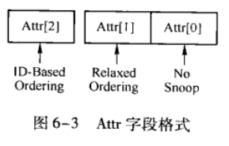

# Introduction to PCIe Architecture System

## Chapter 6. PCIe总线的事务层

PCIe总线报文(TLP)形成过程:

	1.PCIe总线使用的数据报文首先在TL层(事务层)中形成TLP(事务层数据报文);
	2.TLP在经过DL层(数据链路层)时被加上Sequence Number前缀和CRC后缀,然后发现MAC层(物理层);

PCIe DLLP报文的形成过程:

	1.DL层(数据链路层)还可以产生DLLP(Data Link Layer Packet),DLLP和TLP没有直接关系;
	2.DLLP产生于DL层,终止于DL层,不会传递到TL层,且DLLP不是TLP加上前缀后后缀形成的;
	3.DL层的DLLP报文通过物理层时,需要经过8/10b编码,然后再发送;
	PS:数据接收虽然是发送的逆过程,但是在具体实现上,接收过程和发送过程并不完全相同.

### 6.1 TLP的格式

**1.TLP格式**

	1.一个完整的TLP由一个或多个TLP Prefix(可选)、TLP头、Data Payload和TLP Digest(可选)组成;
	2.TLP头包含了当前TLP的总线事物类型、路由信息等一系列信息;
	3.Data Payload长度可变,最小为0,最大为1024 DW;
		Data Payload0的情况为:存储器读请求、配置和I/O写完成TLP等.
	4.TLP Digest是可选的,是否需要TLP Digest由TLP头决定.

**2.通用TLP头格式**

	1.TLP头由3个或4个DW组成.第一个DW保存通用TLP头,其他字段与通用TLP头的Type字段相关;
	2.一个通用TLP头由Fmt, Type, TC, Length等字符组成.
	3.如果存储器读写TLP支持64-bit地址,TLP头长度为4DW,否则为3DW(e.g.完成报文的TLP头不包含
		地址信息,使用3DW的TLP头).

#### 6.1.1 通用的TLP头的Fmt字段和Type字段

**1.Fmt字段**

决定TLP的格式,第一个DW的[31:29].

	Fmt[2:0]				TLP格式
	0b000					TLP头大小为3DW,不带数据
	0b001					TLP头大小为4DW,不带数据
	0b010					TLP头大小为3DW,带数据
	0b011					TLP头大小为4DW,带数据
	0b100					TLP Prefix
	其他						Reserved

**2.Type字段**

决定TLP的类型,即PCIe总线支持的总线事务,第一个DW的[28:24].

	TLP类型		Fmt[2:0]		Type[4:0]		描述
	MRd			0b000			0b0 0000		存储器读请求,TLP头大小为3DW,不带数据
				0b001							存储器读请求,TLP头大小为4DW,不带数据

	MRdLk		0b000			0b0 0001		带锁的存储器读请求,TLP头大小为3DW,不带数据(不使用)
				0b001							带锁的存储器读请求,TLP头大小为4DW,不带数据(不使用)

	MWr			0b010			0b0 0000		存储器写请求,TLP头大小为3DW,带数据
				0b011							存储器写请求,TLP头大小为4DW,带数据

	IORd		0b000			0b0 0010		IO读请求,TLP头大小为3DW,不带数据

	IOWr		0b010			0b0 0010		IO写请求,TLP头大小为3DW,带数据

	...

	Cpl			0b000			0b0 1010		完成报文,TLP头大小为3DW,不带数据.包括存储器、配置
												和I/O写完成
	
	CplD		0b001			0b0 1010		带数据的完成报文,TLP头大小为3DW,带数据.包括存储器读
												、I/O读、配置读和原子操作读完成
	...

	PS:MRd使用Non-Posted方式传送,RWr使用Posted方式传送.

#### 6.1.2 TC字段

TC字段表示当前TLP的传送类型(第一个DW的[22:20]),PCIe总线规定了8种传输类型,分别为TC0~TC7.默认为TC0.

	一般使用TC0即可.

#### 6.1.3 Attr字段

Attr字段由3-bit组成(第一个DW的[18]和[13:12]构成3个bit),描述该TLP支持的Ordering和No Snoop信息.

**1.TLP支持的ordering信息**

Attr字段关于TLP支持的序描述如下:

	Attr[2](即18-bit)	Attr[1](即13-bit)		类型
	0					0						强序模型(Strong Ordering模型)
	0					1						Relaxed Ordering模型
	1					0						ID-Based Ordering(IDO)模型
	1					1						RO+IDO模型

SO和RO的区别:

	1.SO时,同类型的TLP后一个处理必须等待前一个处理完成才能开始处理(e.g.写请求);不同类型的可以乱序,但是
		仅限于存储器写可以超越前面的存储读请求(如果前面的读请求被阻塞),读不能超越写;
	2.RO时,同类型的TLP可以超越前一个进行处理(e.g.后一个写可以超越前一个写,读没明确说),其他限制也少很多.

**2.TLP支持的No Snoop信息**

Attr字段关于TLP支持的No Snoop描述如下:

	Attr[0](即12-bit)	说明
	0					No Snoop Attr为0,表示需要Snoop Cache,与Cache中数据保持一致.
	1					No Snoop Attr为1,表示不会将TLP中的数据与Cache进行一致性处理,此时软件需要保证
							Cache一致性.

**3.No Snoop的应用**

当PCIe对存储器进行DMA读操作时,如果传送的数据非常大(e.g.512MB).Cache的一致性操作会降低DMA读的效率,因为此时的DMA读访问的数据在绝大多数的情况下,并不会在Cache中命中.而处理器进行Cache一致性操作时会占用一定的时钟周期,最好的操作方法是:

	1.使用软件指令保证Cache与主存的一致性,然后PCIe置"No Snoop Attribute"为1;
	2.再进行DMA操作.
	PS:对于大数据的DMA写,此种方法也可提高效率.

#### 6.1.4 其他字段

**1.TH位、TD位和EP位**

	1.TH位为1,表示当前TLP中含有TPH(TLP Processing Hint)信息;
		PS:TLP的发送端可以使用TPH信息,通知接收端即将访问数据的特性,以便接收端合理地预读和管理数据;
	2.TD位表示TLP中的TLP Digest是否有效(1:表示有效;0:表示无效);
	3.EP位表示TLP中的数据是否有效(1:表示无效;0:表示有效).

**2.AT字段**

AT字段与PCIe总线的地址转换相关.

	1.在一些PCIe设备中设置了ATC(Address Translation Cache)部件,用于地址转换.只有在支持IOMMU的处理器
		系统中,PCIe设备才会使用该字段;
	2.AT字段用作存储器域与PCIe总线域之间的地址转换,目的是为了方便多个虚拟主机共享同一个PCIe设备.

**3.Length字段**

Length字段用来描述TLP的有效负载(Data Payload)的大小.

	1.PCIe总线规范规定一个TLP的Data Payload的大小在1 B~4096 B之间;
	2.Length字段以DW为单位,最小单位为1DW;
	3.如果PCIe主设备传送的Payload小于1个DW或传送的数据不以DW对齐时,需要使用"DW BE"字段(字节使能字段).

### 6.2 TLP的路由

PCIe一共定义了3中路由方法:基于地址路由,基于ID路由,隐式路由(Implicit).

	1.地址路由:存储器和I/O读写其你去TLP使用基于地址路由;;
	2.基于ID路由:配置读写报文、"Vendor_Defined Message"报文、Cpl和CpID报文使用基于ID路由;
	3.隐式路由:用于Message报文的传递(包括:INTx Interrupt Signaling, Power Management Message,
		Error Signal Messages等报文).

### 6.2.1 基于地址的路由

### 6.2.2 基于ID的路由

### 6.2.3 隐式路由