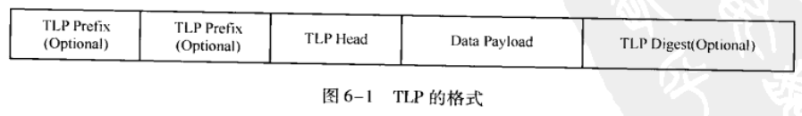
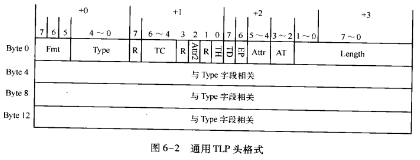

# Introduction to PCIe Architecture System

## Chapter 6. PCIe总线的事务层

PCIe总线报文(TLP)形成过程:

	1.PCIe总线使用的数据报文首先在TL层(事务层)中形成TLP(事务层数据报文);
	2.TLP在经过DL层(数据链路层)时被加上Sequence Number前缀和CRC后缀,然后发现MAC层(物理层);

PCIe DLLP报文的形成过程:

	1.DL层(数据链路层)还可以产生DLLP(Data Link Layer Packet),DLLP和TLP没有直接关系;
	2.DLLP产生于DL层,终止于DL层,不会传递到TL层,且DLLP不是TLP加上前缀后后缀形成的;
	3.DL层的DLLP报文通过物理层时,需要经过8/10b编码,然后再发送;
	PS:数据接收虽然是发送的逆过程,但是在具体实现上,接收过程和发送过程并不完全相同.

### 6.1 TLP的格式

**1.TLP格式**

	1.一个完整的TLP由一个或多个TLP Prefix(可选)、TLP头、Data Payload和TLP Digest(可选)组成;
	2.TLP头包含了当前TLP的总线事物类型、路由信息等一系列信息;
	3.Data Payload长度可变,最小为0,最大为1024 DW;
		Data Payload0的情况为:存储器读请求、配置和I/O写完成TLP等.
	4.TLP Digest是可选的,是否需要TLP Digest由TLP头决定.

**2.通用TLP头格式**

	1.TLP头由3个或4个DW组成.第一个DW保存通用TLP头,其他字段与通用TLP头的Type字段相关;
	2.一个通用TLP头由Fmt, Type, TC, Length等字符组成.
	3.如果存储器读写TLP支持64-bit地址,TLP头长度为4DW,否则为3DW(e.g.完成报文的TLP头不包含
		地址信息,使用3DW的TLP头).

#### 6.1.1 通用的TLP头的Fmt字段和Type字段

