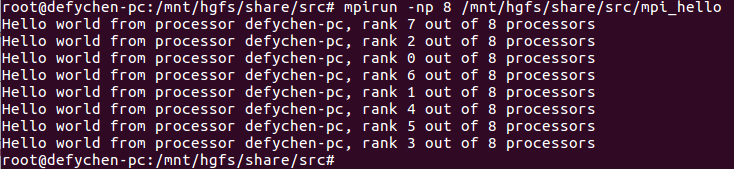

# MPI Learning

# 1. MPI介绍

## 1.1 MPI简介

多线程是一种便捷的模型,其中每个线程都可以访问其它线程的存储空间.

	1.多线程模型只能在共享存储系统之间移植;
	2.一般来讲,并行机不一定在各处理器之间共享存储,当面向非共享存储系统开发并行程序时,程序的各部分之间需要通过来回传递消息的方式通信.

因此,要使得消息传递方式可移植,就需要采用标准的消息传递库.这就促成了MPI(Message Passing Interface,消息传递接口)的面世,MPI是一种被广泛采用的消息传递标准.

MPI是一种基于消息传递的并行编程技术.它不是一种具体的编程语言,而是一种编程接口标准,即接口已经定义好,内部由程序员自己实现.

	1.MPI标准定义了一组具有可移植性的编程接口;
	2.各个厂商或组织遵循这些标准实现自己的MPI软件包,典型的实现包括开放源代码的MPICH、LAM MPI以及不开放源代码的Intel MPI;
	3.由于MPI提供了统一的编程接口,程序员只需要设计好并行算法,使用相应的MPI库就可以实现基于消息传递的并行计算;
	4.MPI支持多种操作系统,包括大多数的类UNIX(e.g. linux)和Windows系统.

## 1.2 MPICH的安装

MPI是一个标准.它不属于任何一个厂商,不依赖于某个操作系统,也不是一种并行编程语言.不同的厂商和组织遵循着这个标准推出各自的实现,而不同的实现也会有其不同的特点.MPICH是影响最大、用户最多的MPI实现.

### 1.2.1 ubuntu通过命令安装--->这种方法最好

	sudo apt-get install mpich

### 1.2.2 通过下载源码的方式安装--->尽量不要使用这种方法

试过,但是失败了,此处略.

### 1.2.3 windows下的安装

略.

## 1.3 MPI的hello world

### 1.3.1 代码

	#include <stdio.h>
	#include <mpi.h>
	
	int main(int argc, char **argv)
	{
		MPI_Init(NULL, NULL);
		int world_size;
		MPI_Comm_size(MPI_COMM_WORLD, &world_size);
		int world_rank;
		MPI_Comm_rank(MPI_COMM_WORLD, &world_rank);
		char processor_name[MPI_MAX_PROCESSOR_NAME];
		int name_len;
		MPI_Get_processor_name(processor_name, &name_len);
		printf("Hello world from processor %s, rank %d out of %d processors\n",
			processor_name, world_rank, world_size);
		MPI_Finalize();
		return 0;
	}

### 1.3.2 编译及执行

#### 1.3.2.1 编译

```
mpicc mpic_hello.c -o mpi_hello	//使用mpicc编译mpi程序
```

#### 1.3.2.2 执行

```
mpirun -np 8 /mnt/hgfs/share/src/mpi_hello
/*
	-np:执行要加载的进程个数,后面的8表示加载8个进程.
	后面的可执行程序需要指定为绝对路径,否则可能会报错"execvp error on file mpi_hello (No such file or directory)"
*/
```

#### 1.3.2.3 结果

执行之后的结果为:



### 1.3.3 重要的函数介绍

#### 1.3.3.1 头文件

要编写MPI程序,必须包含该头文件:

	#include <mpi.h>

#### 1.3.3.2 MPI_Init

MPI_Init用来初始化MPI执行环境,建立多个MPI进程之间的联系,为后续通信做准备.执行该行之后,所有MPI的全局变量和内部变量都会被创建.

	原型:
		int MPI_Init(int *argc, char **argv[]);
	调用:
		MPI_Init(&argc, &argv)
	当前传入两个NULL,只是保留位置,没有使用上.

#### 1.3.3.3 MPI_Comm_size

该函数用来获得指定的进程组中子进程的个数size.

```
原型:
	int MPI_Comm_size(MPI_Comm comm, int *size);
	/*
		para1:MPI_Commo类型的通信域,标识参数计算的MPI进程组(group).一般为:MPI_COMM_WORLD;
		para2:获得对应进程组(第一个参数指定的group)中的进程数.para1指定后,该值就是确定的.
		retval:未知.
	*/
```

#### 1.3.3.4 MPI_Comm_rank

获得某进程在通信空间中的rank值(rank值类似于进程的ID,rank值为0到p-1的整数).

```
原型:
	int MPI_Comm_rand(MPI_Comm comm, int *rank);
	/*
		para1:MPI_Commo类型的通信域,标识参数计算的MPI进程组(group).一般为:MPI_COMM_WORLD;
		para2:获得某进程的rank值.
		retval:未知.
	*/
```

#### 1.3.4.4 MPI_Get_processor_name

获得计算机名,长度为*name_len,名字为name.

	原型：
		void MPI_Get_processor_name(char *name, int *name_len);
		/*
			para1:存放获取到的计算机名;
			para2:存在计算机名的长度.
		*/
	调用:
	    char processor_name[MPI_MAX_PROCESSOR_NAME];
	    /*
	    	MPI_MAX_PROCESSOR_NAME:是机器名的最大长度.
	    */
	    int name_len;
	    MPI_Get_processor_name(processor_name, &name_len);

#### 1.3.3.5 MPI_Send

```
原型:
	int MPI_Send( void *buff, int count, MPI_Datatype datatype, int dest, int tag, MPI_Comm comm);
	/*
		para1:发送的数据指针;
		para2:发送的消息个数,不是长度(e.g. 发送一个int整数,此处填写1;如果发送"hello"字符串,此处填写6--->要加上末尾的结束符);
		para3:发送的数据类型(使用MPI定义的数据类型);
		para4:目的进程号(需要发给的进程);
		para5:消息标签,接收方需要有相同的消息标签才能接收该消息;
		para6:通讯域,表示要向哪个组发送消息.
	*/
```

#### 1.3.3.6 MPI_Recv

```
原型:
	int MPI_Recv( void *buff, int count, MPI_Datatype datatype, int source, int tag, MPI_Comm comm, MPI_Status *status)
	/*
		para1:接收到的消息保存到哪个变量;
		para2:接收的消息个数,不是长度(e.g. 发送一个int整数,此处填写1;如果发送"hello"字符串,此处填写6--->要加上末尾的结束符);
			--->此处表示接收数据长度的上限,具体接收到的数据长度可以通过调用MPI_Get_count函数得到.
		para3:接收的数据类型(使用MPI定义的数据类型);
		para4:接收端进程号(表示哪个进程接收消息)--->与MPI_Send的para4应该是相同的;
		para5:消息标签,需要与发送方相同的tag值才能接收到该消息;
		para6:通讯域;
		para7:消息状态,接收函数返回时,接收到的消息的状态信息存在该变量中(e.g.消息的源进程标识,消息标签,包含的数据项个数等).
	*/
```

#### 1.3.3.7 MPI_Finalize

MPI_Finalize函数用于退出MPI系统,所有进程正常退出都必须调用该函数.表明并行代码的结束,结束除主进程外其它进程.串行代码仍可在主进程(rank = 0)上运行,但不能再有MPI函数(包括MPI_Init()).

```
原型:
	int MPI_Finalize(void)
```

