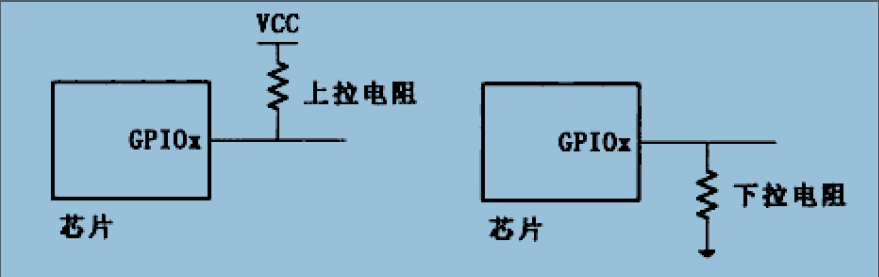

# Markdown usage

## 1 标题--在前面加"#"，不同"#"代表几级标题

### e.g.如本usage中的各种标题

## 2 列表--无序列表文字前加"-或*",有序在文件前加"1,2,3"即可

### 无序列表:

* 1

* 2

* 3

### 有序列表:

1. 1

2. 2

3. 3

## 3 引用，文本前加">"

> 这里是引用

## 4 链接，语法为:

### e.g.[baidu](http://baidu.com)

欢迎来到[百度](http://baidu.com)

## 5 插入图片

语法
	
	 //路径一般采用相对路径即可.

## 6 粗体与斜体,**xxx**为粗体;*xxx*为斜体

### e.g. 粗体：**hello**；斜体：*hello*;

## 7 代码框,将代码整体缩进一个tab键即可

### e.g.

 	static int xxx_fetch_streamId(struct xxx_session *s)
 	{
		xxx
 	}

## 8 分割线，三个"*"号

## 9 更改字体大小

显示我为4号字体我