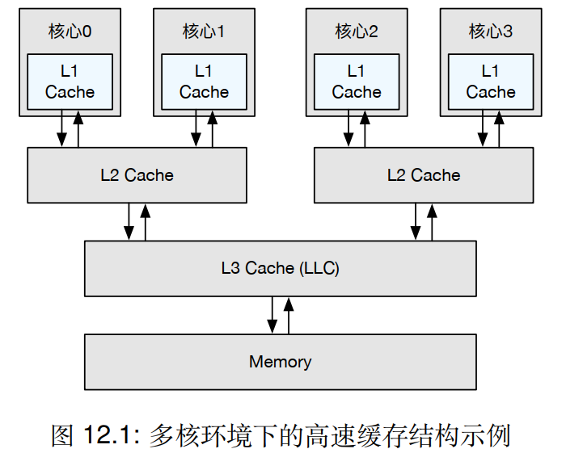
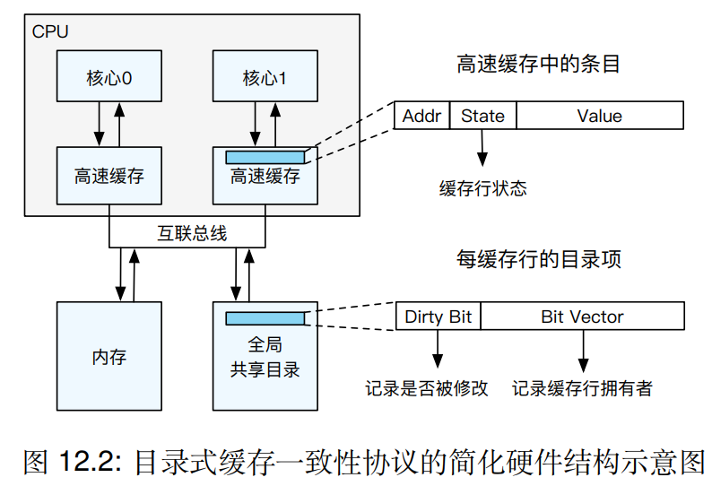
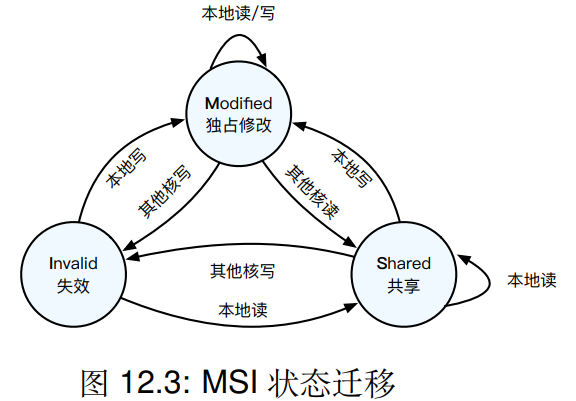
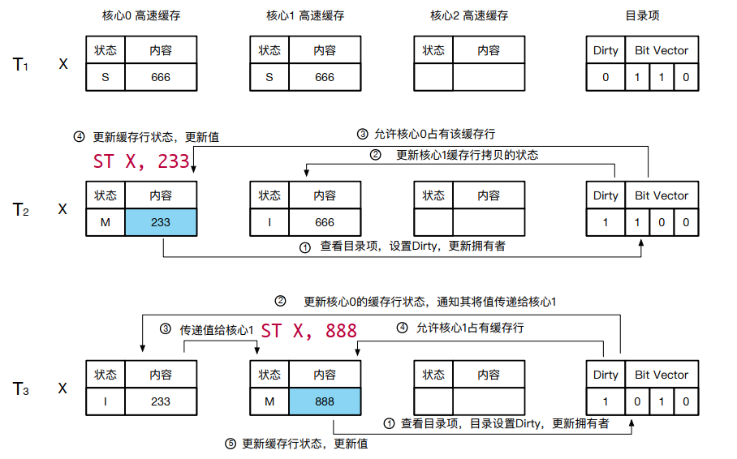
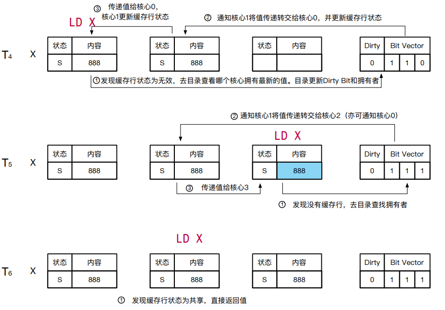

# Modern operating system principle and implementation

# Chapter 12 多核与处理器

## 12.1 缓存一致性

### 12.1.1 多核高速缓存架构

1.当前主流的多核处理器采用了共享内存,即不同的核心共享相同的内存资源,核心间可以通过访问同一个地址来共享数据.

	1.由于访问内存耗时较长,使用多级高速缓存(Multilevel Cache)来缓存高频访问的数据;
	2.cache以cacheline为最小的操作粒度,其大小往往是64B.

2.CPU写地址的两种策略

	1.直写策略(WriteThrough):立刻将修改的值刷回内存(该值会同时保留在cache中);
	2.写回策略(WriteBack):将修改的值暂时存在cache中,避免高时延的内存写操作.只有在出现高速缓存逐出
		(Cache Eviction)或是CPU核心调用写回指令时,修改才会被更新至物理内存.

3.多核环境下的cache结构

	1.私有L1,2个核共享L2,4个核共享L3/LLC(Last Level Cache);
	2.NUCA(Non-Uniform Cache Access):非一致性访问.
		e.g. Core 0访问Local L2会快于访问Core 2、Core 3共享的L2.

### 12.1.2 目录式缓存一致性

缓存一致性协议有多种实现方案:包括目录式缓存一致性(Directory-based Cache Coherence)与嗅探式缓存一致性(Snoop-based Cache Coherence).缓存一致性是由硬件保证,对上层系统软件是透明的.

目录式缓存一致性协议的硬件结构图:

#### 12.1.2.1 MSI协议

MSI协议cacheline的三种状态(M/S/I态).

	1.M态(Modified,独占修改):当前cacheline在全局只有本地cache这一份拷贝.当前的核心独占该cacheline;
		可直接进行读/写操作,不会触发cacheline的状态变化.
	2.S态(Shared,共享):当前cacheline在全局可能存在多份拷贝,且本地的拷贝是有效的;
		读操作:当前核心可直接读该cacheline;
		写操作:
		1.当前核心查找全局共享目录,找到所有拥有该cacheline拷贝的核心,并通知这些核心将cacheline状态
			转换为I态;
		2.设置全局共享目录中该项的Dirty Bit为1,并将拥有者更新到Bit Vector;
		3.将本地的cacheline状态转换为M态,方能对cacheline进行写操作.
	3.I态(Invalid,失效):当前cacheline本地的拷贝失效,当前核心不能直接读/写该cacheline;
		读操作:
		1.在全局共享目录找到拥有该cacheline的核心并索要数据,同时更新该核心的cacheline状态改为S态;
		2.更新全局共享目录中的Dirty Bit为0,并将拥有者更新到Bit Vector;
		3.将本核心的cacheline状态设置为S态,再读取cacheline数据.
		写操作:
		1.在全局共享目录找到拥有该cacheline的核心通知他们将cacheline状态改为I态;
		2.该为I态后可以拿到对应cacheline的数据;
		3.拿到该cacheline的数据后,将全局共享目录中该项的Dirty Bit为1,并将拥有者更新到Bit Vector;
		4.将本地的cacheline状态设置为M态,将数据与cacheline数据合并后再写入该cacheline.

#### 12.1.2.2 全局共享目录

MSI协议用于说明当前cacheline的状态.全局共享目录用于记录所有cacheline所处位置及状态,每条缓存行都对应目录中的一个目录项,目录项包含两项内容:

	1.用于记录是否有处理器已经修改过这个cacheline的Dirty Bit(1表示被修改,0表示未被修改);
		--->只有某cacheline是M态时才是1,其他均是0;
	2.用于记录cacheline的拥有者的Bit Vector(拥有者对应位被置为1,其余置为0).

#### 12.1.2.3 MSI状态迁移

#### 12.1.2.4 目录式缓存一致性协议实例

### 12.1.3 系统软件视角下的缓存一致性