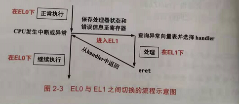
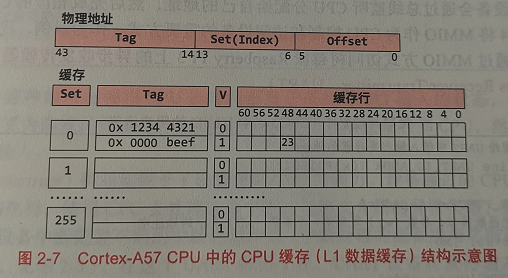
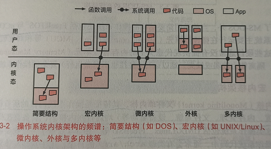
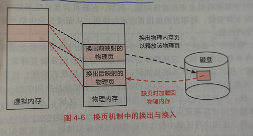
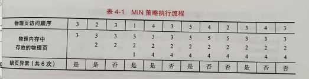
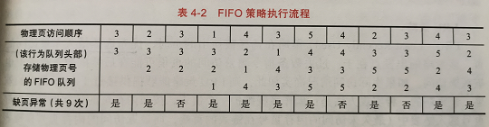
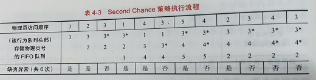
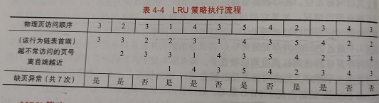
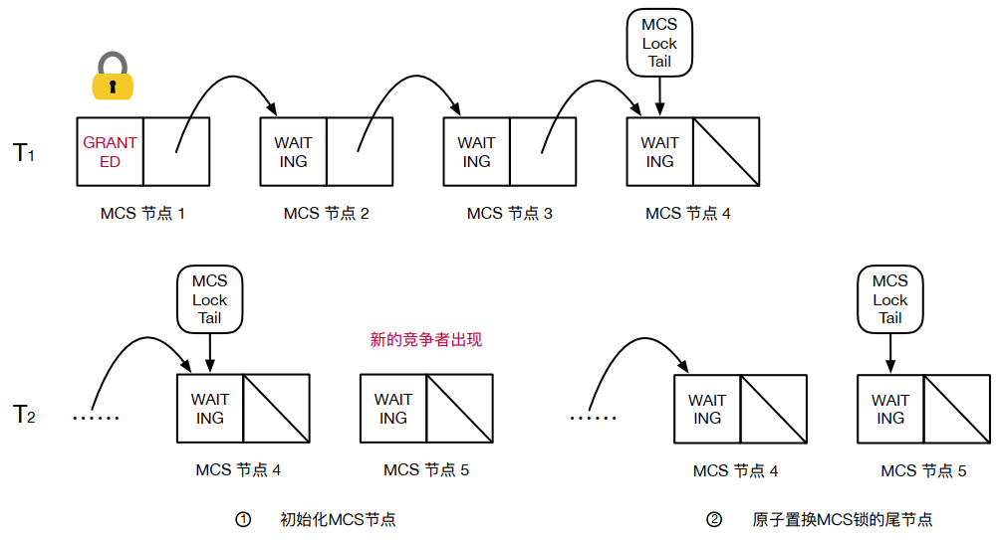

# Modern operating system principle and implementation

# Chapter 1 操作系统概述

## 1.1 操作系统的职责

操作系统的两个职责

	1.对硬件进行管理和抽象;
	2.为应用提供服务并进行管理.

## 1.2 操作系统接口

从应用的角度来看,操作系统提供了不同层次的接口,包括:系统调用接口、POSIX接口、领域应用接口等.

### 1.2.1 系统调用接口

系统调用执行过程分解如下:

#### 1.2.1.1 应用程序

	#include <stdio.h>
	int main()
	{
		printf("Hello World!\n");
		return 0;
	}

#### 1.2.1.2 libc

	write(1, "Hello World!\n", 13) {
		...
		/* 传参过程 */
		mov x0, #__NR_write		/* 第1个参数:系统调用ID */
		mov x1, #1				/* 第2个参数:文件描述符 */
		mov x2, x4				/* 第3个参数:字符串首地址 */
		mov x3, #13				/* 第4个参数:字符串长度 */
		svc #0					/* 执行svc指令,进入内核 */
		...
	}

#### 1.2.1.3 下陷处理及系统调用处理

	/* 下陷处理 */
	sys_syscall:
		...
		bl syscall_table(__NR_write)
		...
	/* 系统调用处理 */
	sys_write {
		...
		return error_no;
	}

#### 1.2.1.4 执行过程描述

	1.printf调用标准库libc中的write函数;
	2.libc在准备好相关的参数后,执行svc指令使用控制流从用户地址空间下陷到内核地址空间;
	3.操作系统内核的下陷处理函数根据系统调用传入的第一个参数,识别出该调用需要执行内核提供的sys_write函数,
		从而通过系统调用表(syscall_table)调用对应的函数.
	PS:应用程序和libc均属于用户地址空间.

### 1.2.2 POSIX接口

POSIX(Portable Operating System Interface for uniX,可移植操作系统接口,X表示对UNIX API的传承).

	常见的POSIX有:libc, musl, eglibc, bionic(Andriod的POSIX接口).

### 1.2.3 领域应用接口

#### 1.2.3.1 领域应用接口

领域应用接口:为各个应用领域定义的应用开发接口与软件架构.

	1.AUTOSAR(AUTomotive Open System Architecture):面向汽车领域遵循的软件架构及标准;
	2.Andriod系统框架:用于开发Android APP;
	3.iOS:为苹果手机平台定义的应用开发接口.

#### 1.2.3.2 API vs. ABI

	API(Application Programming Interface):应用编程接口.
		用于定义两层软件(e.g.libc与linux内核)之间源码层面的交互接口;
	ABI:应用二进制接口.定义某个特定体系结构下两层软件之间二进制层面的交互接口
		e.g.二进制文件格式(ELF或windows的EXE)、数据模式(大小端模式)等.

# Chapter 2 硬件结构

## 2.1 CPU与指令集架构

ISA(Instruction Set Architecture,指令集架构):是CPU与软件之间的桥梁.包括指令集、特权级、寄存器、执行模式、安全扩展、性能加速扩展等诸多方面.

### 2.1.1 指令集

AArch64中的每条指令的长度固定为4 Byte.

### 2.1.2 特权级

AArch64的特权级分为EL0、EL1、EL2、EL3.

#### 2.1.2.1 EL0->EL1的切换场景

EL0(应用程序)到EL1(操作系统)的切换场景如下:

	1.应用程序调用OS提供的系统调用:应用程序通过执行svc(特权调用,supervisor call)指令将CPU特权从EL0
		切换到EL1;
	2.应用程序执行一条指令,该指令触发了异常,导致CPU特权级从EL0切换到EL1;
		e.g.应用程序执行一条访存指令时,触发了缺页异常(page fault),从而切换到OS内核进行处理.
	3.应用程序在执行的过程中,CPU受到一个外设中断,该中断也会导致CPU特权级从EL0切换到EL1.

#### 2.1.2.2 同步和异步的切换

	同步的CPU特权级切换:系统调用和异常均属于同步切换,因为都是由CPU中正在执行的指令导致的;
	异步的CPU特权级切换:中断属于异步切换.因为不是由CPU执行应用程序中的指令导致的.

#### 2.1.2.3 EL0->EL1的切换基本流程

**1.保存状态**

在发生特权切换的时刻,CPU负责保存当前执行状态,以便OS在处理异常时使用并在处理结束后能够恢复应用程序的执行.主要保存的状态包括:

	1.触发异常的指令地址(即PC(Program Counter)程序计数器中的值)保存到ELR_EL1(Exception Link 
		Register:异常链接寄存器)中;
	2.异常原因(由于执行svc指令还是访存缺页导致的)保存到ESR_EL1(Exception Syndrome Register:异常症状
		寄存器)中;
	3.CPU将栈指针(SP)从SP_EL0(应用程序使用的栈)切换到SP_EL1(OS使用的栈);
	4.保存一些其他的状态:
		1.将CPU的相关状态保存在SPSR_EL1;
		2.将引发缺页异常的地址保存在FAR_EL1(Fault Address Register:错误地址寄存器)中.

**2.异常处理**

发生特权切换时,CPU会读取VBAR_EL1(Vector Base Address Register:向量基址寄存器)来获取异常向量表(exception vector table)的基地址,然后根据异常原因(ESR_EL1中保存的内容)调用OS设置的对应的异常处理函数进行处理.

	1.如果是系统调用导致的切换:执行相应的系统调用即可;
	2.如果是缺页异常导致的切换:执行相应的缺页异常处理函数即可.

异常处理完成后,OS会恢复应用程序的上下文,然后执行eret(exception return,异常返回)指令以恢复CPU自动保存的EL0状态(包括PC和SP等),并切回到EL0,继续执行.

### 2.1.3 寄存器

略.

## 2.2 物理内核与CPU缓存

### 2.2.1 缓存结构

物理地址用于索引cacheline的划分如下:

	offset:索引cacheline中的某byte数(e.g. cacheline 64B,用物理地址0b[5:0]索引);
	set(也叫index):表示cache中组数(e.g.物理地址0b[13:6]表示set数为256个);
	Tag:用于在同一set中匹配物理地址(e.g.物理地址0b[43:14]表示Tag信息);
	way:同一set中包含的cacheline数目.

### 2.2.2 缓存寻址

AArch64架构的Cortext-A57 CPU的中L1-D cache结构参数:

	物理地址长度:44-bit
	cache大小:32KB,cacheline大小:64B
	set数:256,way数:2

如果要读取物理地址:0x2fbbc030开始的4字节的物理内存数据的解析:

	Offset:0x30--->0b[5:0];
	Set:0--->0b[13:6];
	Tag:0xbeef--->0b[43:14];
	1.根据Set定位到Set=0的两个cacheline(way:2),对比Tag并检查Valid是否为1(表示该cacheline是否有效);
	2.然后根据offset进行提取对应的数据(本例为提取4字节的字为23);
	PS:如果Set和Tag都匹配上了,但是Valid为0(cacheline为无效的),则必须读取内存来获得有效数据.

## 2.3 设备与中断

### 2.3.1 内存映射输入输出

MMIO(Memory-Mapped I/O,内存映射输入输出):把输入输出设备和物理内存放到同一个地址空间,为设备内部的内存和寄存器也分配相应的地址.

CPU通过MMIO的方式为一个设备分配了设备地址,CPU就可以使用和访问物理内存一样的指令(ldr和str)去读写这些属于设备的地址.

### 2.3.2 轮询与中断

略.

# Chapter 3 操作系统结构

## 3.1 操作系统内核结构

常见的操作系统内核结构包括:

	简要结构、宏内核、微内核、外核、多内核.

### 3.1.1 简要结构

简要结构包括:MS-DOS、FreeRTOS、uCos等.主要运行在MCU(MicroController Unit,微控制器)上.没有MMU等复杂功能.

### 3.1.2 宏内核架构

宏内核(Monolithic kernel),也称单内核.特征是OS内核的所有模块(e.g. 进程调度、内存管理、文件系统、设备驱动等)均运行在内核态,具备直接操作硬件的能力.主要包括:Unix/Linux、FreeBSD等.

### 3.1.3 微内核架构

微内核(Microkernel):对宏内核架构进行解耦,将单个功能或模块(e.g.文件系统、设备驱动等)从kernel中拆分出来,作为一个独立的服务部署到独立的运行环境中;内核仅保留极少的功能,为这些服务提供通信等基础能力,使其能够互相协作以完成OS所必须的功能.e.g.Linux开发的UIO与VFIO的用户态驱动模型就具有微内核架构特征.

### 3.1.4 外核架构

外核架构(Exokernel):直接由硬件来控制硬件资源的抽象.LibOS(库操作系统)将硬件的抽象封装到LibOS中,与应用直接链接,降低应用开发的复杂度;OS内核只负责对硬件资源在多个LibOS之间的多路复用的支持,并管理这些LibOS的声明周期.

	外核的劣势:LibOS通常是为某种应用定制的,缺乏跨场景的通用性,应用生态差.同时不同的LibOS通常会实现相同
		或相似的功能,容易造成代码冗余.

### 3.1.5 其他操作系统内核架构

多内核(Multikernel)架构和混合内核架构暂略.

## 3.2 操作系统框架结构

### 3.2.1 Android系统框架

Android采用的是Apache Software License.

	Apache Software License:与GPL(GNU Public License)不同,其不要求使用并修改源码的使用者重新开放源
		码,而只需要在每个修改的文件中保留license并表明所修改的部分即可.

#### 3.2.1.1 Android系统架构

**1.硬件抽象层(HAL)**

Android在linux内核之上提供了一层硬件抽象层.封装了一些硬件实现的细节,实现了linux内核与Android系统框架的解耦;并通过用户态驱动模型,使得设备厂商不需要开放源码就能为Android操作系统提供设备驱动,从而促使更多的设备厂商加入到Android生态.

实现HAL层的主要原因:

	1.由于Linux的设备驱动都运行在Linux内核态(宏内核特点),设备驱动的接口依赖于linux内核设备驱动接口的演
		进,导致Android系统框架与Linux内核版本紧密耦合,不利于Android系统框架的独立演进与升级;
	2.linux内核采用GPLv2协议,需要开放所有的源代码,HAL采用Apache Software License,有利于保护设备厂商
		的利益.

**2.Android库(Android library)**

Android库提供了一些方便Android应用开发的自定义库;又重新实现了一些标准库(e.g. glibc等),从而规避了LGPL协议.

**3.Android运行环境(Android RunTime, ART)**

Android开发语言是Java,提供了一个ART用于将字节码转换成可执行代码.

**4.Android应用框架(Android Application Framework)**

Android应用框架提供了应用运行所需要的基础服务(e.g.服务管理(service manager),活动管理(activity manager),包管理(package manager),窗口管理(window manager)等).

### 3.2.2 ROS系统框架

ROS(Robot Operating System):机器人操作系统.

# Chapter 4 内存管理

## 4.1 虚拟地址与物理地址

### 4.1.1 虚拟地址访问物理内存原理

以Hello World程序的第一条指令为例:

	1.OS首先将程序从磁盘/SSD装载到物理内存中;
	2.CPU去执行程序的第一条指令,但此时该指令存在与内存中;
	3.在使用虚拟内存的情况下,CPU取指令时发出的是指令的虚拟地址;
	4.该虚拟地址被MMU翻译为对应的物理地址;
	5.包含该物理地址的内存读请求被发送到物理内存设备;
	6.物理内存设备把该物理地址对应的内容(i.e. Hello World程序的第一条指令)发送给CPU,完成取指动作.

TLB(Translation Lookaside Buffer):地址旁路缓存,用于加速地址翻译.

### 4.1.2 分段与分页机制

分段和分页举例(笔记本有100张纸,用于记录语文、数学、英语三门课程)

	分段机制:从本子的第一张纸开始用,并且事先在本子上做划分:第2张到第30张纸记语文笔记,第31到60张纸记数学
		笔记,第61到100张纸记英语笔记,最后在第一张纸做个列表,记录着三门笔记各自的范围.这就是分段管理,第
		一张纸叫段表.
	分页机制:从第二张纸开始做笔记,各种课的笔记是连在一起的:第2张纸是数学,第3张是语文,第4张英语...最后呢,
		在第一张纸做了一个目录,记录着语文笔记在第3、7、14、15张纸...,数学笔记在第2、6、8、9、11...,英语笔记
		在第4、5、12...这就是分页管理,第一张纸叫页表.

现代处理器分段机制基本不用了,主要用分页机制.

## 4.2 基于分页的虚拟内存

### 4.2.1 AArch64架构下的4级页表

参考"ARMv8 Architecture Learning.md".

	如果整个应用程序的虚拟地址空间只有两个虚拟页被使用(分别对应于最低和最高的两个虚拟地址).在使用4级页
	表后,整个页表实际上只需要1个0级页表(存储TTBR0_EL1+9-bit,4K页表只有1个0级页表),2个1级页表,2个
	2级页表,2个3级页表,共7个页表(整个页表大部分是"空洞"),仅占用7*4K=28K的物理内存空间.

### 4.2.2 TLB

多级页表是一种"时间换空间"的权衡结果(单级页表占用的物理内存很大,多级页表增加了访存次数,但占的空间小).

#### 4.2.2.1 TLB刷新

当发生应用程序切换时(e.g.应用程序A切换到应用程序B),需要更新CPU使用的TTBR0_EL1(应用程序A使用的页表基地址和应用程序B使用的不一样),同时还需要刷新TLB,防止切换后的应用程序的VA地址翻译成错误的PA地址.

#### 4.2.2.2 ASID

ASID(Address Space Identifier):对应于x86-64上的PCID(Process Context Identifier).

由于在应用程序发生切换时需要刷新TLB,会造成切换后的应用程序发生TLB miss的情况,导致性能损失.借助ASID可以避免TLB的刷新,方法如下:

	1.OS为不同的应用程序分配不同的ASID作为应用程序的标签(即ID号);
	2.ASID写入到应用程序的页表基址寄存器中(TTBR_EL0的高16-bit);
	3.TLB的缓存项中的Tag也会包含ASID的标签,使得不同应用程序的entry被区分开来;
	4.最终在应用程序发生切换后,OS不再需要刷新TLB.

ASID最多16-bit,ASID的位数由TCR_EL1寄存器中的信息决定,最多2^16(65536)个标签.

在修改页表内容之后,OS需要主动刷新TLB以保证TLB中的缓存项和页表项内容一致.刷新TLB分为:

	1.刷新全部TLB;
	2.刷新指定ASID的TLB;
	3.刷新指定VA的TLB等.

### 4.2.3 换页与缺页异常

#### 4.2.3.1 换页(page swapping)

换页(page swapping):当物理内存容量不够时,OS应该把若干物理的内容写到类似磁盘这种容量更大且更加便宜的存储设备中,然后回收这些物理页并继续使用.

	e.g. OS希望从应用程序A那里回收物理页P(对应于应用程序A中的虚拟页V)时,OS需要将物理页P的内容写道磁盘
		上的一个位置,并且在应用程序A的页表中去除虚拟页V的映射,同时记录该物理页被换到磁盘上的对应位置.这
		一过程称为把物理页P换出(swap out),物理页P就可以被OS回收,并且分配给别的应用程序使用.
		此时,虚拟页V处于已分配但未映射到物理内存的状态.

换页机制的用途:

	利用换页机制,OS可以把物理内存放不下的数据临时存放到磁盘上,等到需要的时候再放回到物理内存中,从而能够为
		应用程序提供超过物理内存容量的内存空间.

#### 4.2.3.2 缺页异常(page fault)

缺页异常:当应用程序访问已分配但未映射至物理内存的虚拟页时,会触发缺页异常.

	缺页异常处理:发生缺页异常后,CPU会运行OS预先设置的缺页异常处理函数(page fault handler),该函数会找
		到(页可能通过换页的方式)一个空闲的物理页,将之前写到磁盘上的数据内容重新加载到该物理页中,并且在
		页表中填写虚拟地址到这一物理页的映射.该过程被称为换入(swap in).之后CPU回到发生缺页异常的地方
		继续运行.

AArch64体系结构上,缺页异常无一个专门的异常号,与用户态同步异常共享一个异常号(即8号同步异常).OS根据ESR(Error Syndrome Register)寄存器中存储的信息来判断发生的异常是否为缺页异常.如果是,则从FAR_EL1寄存器中取出发生缺页异常时访问的虚拟地址.

#### 4.2.3.3 预取(prefetching)机制

由于换页过程涉及耗时的磁盘操作,OS会引入预取进行优化.

预取机制:当发生换入操作时,预测还有哪些页即将被访问,提前将他们一并换入到物理内存,减少发生缺页异常的次数.

#### 4.2.3.4 按需页分配

按需页分配(demand paging):当应用程序申请分配内存时,OS可选择将新分配的虚拟页标记为已分配但未映射至物理内存状态,而不必为这个虚拟页分配对应的物理页.当应用程序访问这个虚拟页的时候,会触发换页异常,此时OS才真正为这个虚拟页分配对应的物理页,并在页表中填入对应的映射.

虚拟页处于未分配状态或者已分配但未映射至物理内存状态的区分:

	在linux中,应用程序的虚拟地址空间被实现成由多个VMA(Virtual Memory Area,虚拟内存区域)组成的数据结构.
		vma主要包含该区域的起始虚拟地址、结束虚拟地址、访问权限等.当应用程序发生缺页异常时(假设访问虚拟
		页P),OS通过判断该虚拟页P是否属于该应用程序的某个VMA来区分该页所处的分配状态:
		1.该虚拟页属于某个VMA,则处于已分配但未映射到物理内存的状态;
		2.若不属于,则处于未分配状态.

### 4.2.4 页替换策略

当需要分配物理页时,若空闲的物理页已用完或小于某个阈值,则OS将根据页替换策略选择一个或一些物理页换出到磁盘以便让出空间.已被换出的内存也如果再次被访问,必须重新从磁盘换入到物理内存中,这一过程很耗时.因此页替换粗略对性能具有较大影响.

#### 4.2.4.1 MIN策略/OPT策略

MIN(Minimum)策略又称为OPT(Optimal策略,最优策略):属于理想策略,设想选择未来不会再访问的页或最长时间不会再访问的页作为换出的页.实际场景很难实现.

#### 4.2.4.2 FIFO策略

维护一个FIFO,换入的页放在对尾,选择对头的页换出.实际使用时效果不好.

#### 4.2.4.3 Second Chance策略

Second Chance是FIFO策略的一种改进版本.每个物理页号维护一个访问标志位,一旦物理页被访问则将访问标志位置上.在选择对头页时,先查看访问标志位,如果存在则将该页放到对尾并清除掉访问标志位.直到对头出现没有访问标志位的页则将其换出.

#### 4.2.4.4 LRU策略

LRU(Least Recently Used):优先选择换出最久未被访问的页.维护一个链表,按照内存页的访问顺序将内存页号插入链表中(最久未访问的内存页在链表的首端,最近访问的内存页号在链表的尾端).每次访问某内存页后,则将该内存页调整到链表尾端,换出时则选择位于链表首端的内存页号.

#### 4.2.4.5 MRU策略

MRU(Most Recently Used):优选选择换出最近访问的页.基于的假设是:程序不会反复地访问相同的地址.主要应用视频播放器播放视频时,视频的每一帧数据都只会读取一次,不会重复读取.

#### 4.2.4.6 时钟算法策略

略.

### 4.2.5 工作集模型

略.

## 4.3 虚拟内存功能

# Chapter 12 多核与处理器

## 12.1 缓存一致性

### 12.1.1 多核高速缓存架构

1.当前主流的多核处理器采用了共享内存,即不同的核心共享相同的内存资源,核心间可以通过访问同一个地址来共享数据.

	1.由于访问内存耗时较长,使用多级高速缓存(Multilevel Cache)来缓存高频访问的数据;
	2.cache以cacheline为最小的操作粒度,其大小往往是64B.

2.CPU写地址的两种策略

	1.直写策略(WriteThrough):立刻将修改的值刷回内存(该值会同时保留在cache中);
	2.写回策略(WriteBack):将修改的值暂时存在cache中,避免高时延的内存写操作.只有在出现高速缓存逐出
		(Cache Eviction)或是CPU核心调用写回指令时,修改才会被更新至物理内存.

3.多核环境下的cache结构

	1.私有L1,2个核共享L2,4个核共享L3/LLC(Last Level Cache);
	2.NUCA(Non-Uniform Cache Access):非一致性访问.
		e.g. Core 0访问Local L2会快于访问Core 2、Core 3共享的L2.

### 12.1.2 目录式缓存一致性

缓存一致性协议有多种实现方案:包括目录式缓存一致性(Directory-based Cache Coherence)与嗅探式缓存一致性(Snoop-based Cache Coherence).缓存一致性是由硬件保证,对上层系统软件是透明的.

目录式缓存一致性协议的硬件结构图:

#### 12.1.2.1 MSI协议

MSI协议cacheline的三种状态(M/S/I态).

	1.M态(Modified,独占修改):当前cacheline在全局只有本地cache这一份拷贝.当前的核心独占该cacheline;
		可直接进行读/写操作,不会触发cacheline的状态变化.
	2.S态(Shared,共享):当前cacheline在全局可能存在多份拷贝,且本地的拷贝是有效的;
		读操作:当前核心可直接读该cacheline;
		写操作:
		1.当前核心查找全局共享目录,找到所有拥有该cacheline拷贝的核心,并通知这些核心将cacheline状态
			转换为I态;
		2.设置全局共享目录中该项的Dirty Bit为1,并将拥有者更新到Bit Vector;
		3.将本地的cacheline状态转换为M态,方能对cacheline进行写操作.
	3.I态(Invalid,失效):当前cacheline本地的拷贝失效,当前核心不能直接读/写该cacheline;
		读操作:
		1.在全局共享目录找到拥有该cacheline的核心并索要数据,同时更新该核心的cacheline状态改为S态;
		2.更新全局共享目录中的Dirty Bit为0,并将拥有者更新到Bit Vector;
		3.将本核心的cacheline状态设置为S态,再读取cacheline数据.
		写操作:
		1.在全局共享目录找到拥有该cacheline的核心通知他们将cacheline状态改为I态;
		2.该为I态后可以拿到对应cacheline的数据;
		3.拿到该cacheline的数据后,将全局共享目录中该项的Dirty Bit为1,并将拥有者更新到Bit Vector;
		4.将本地的cacheline状态设置为M态,将数据与cacheline数据合并后再写入该cacheline.

#### 12.1.2.2 全局共享目录

MSI协议用于说明当前cacheline的状态.全局共享目录用于记录所有cacheline所处位置及状态,每条缓存行都对应目录中的一个目录项,目录项包含两项内容:

	1.用于记录是否有处理器已经修改过这个cacheline的Dirty Bit(1表示被修改,0表示未被修改);
		--->只有某cacheline是M态时才是1,其他均是0;
	2.用于记录cacheline的拥有者的Bit Vector(拥有者对应位被置为1,其余置为0).

#### 12.1.2.3 MSI状态迁移

#### 12.1.2.4 目录式缓存一致性协议实例

### 12.1.3 系统软件视角下的缓存一致性

系统软件对于缓存一致性的影响如下:

	1.多核心竞争同一cacheline带来的性能开销--->e.g.自旋互斥锁;
	2.伪共享(False Sharing):本身无需共享的内容被错误地划分到同一个cacheline中进行了共享;
	3.多核环境下的时间局部性和空间局部性:
		时间局部性:指访问一个地址后程序在一段时间内还会访问相同的地址;
		空间局部性:指地址相邻的内存很可能会被再次访问;
		PS:良好的局部性能保证较高的cache命中率,减少访存开销.反之命中率低,访存开销大,影响性能.

## 12.2 内存一致性与硬件内存屏障

### 12.2.1 多核中的访存乱序

LockOne算法存在的问题:

	1.仅能保证互斥访问(即两个线程不会同时进入临界区);
	2.不能保证有限等待与空闲让进(如果两个线程均在读到对方flag之前设置了自己的标志位.此时两个线程
		都不能进入临界区,陷入了无限等待);
	PS:如果出现乱序访问,互斥也没办法保证:
		如果线程0、1中,第3行的读在第2行的写之前发生(访存乱序),此时读到的flag均为false.导致两个线程同时
		进入临界区,打破LockOne的互斥访问.

### 12.2.2 内存一致性模型

内存一致性模型(Memory Consistency Model)主要针对读写操作之间的4种顺序(读读、读写、写读、写写).

#### 12.2.2.1 严格一致性模型(Strict Consistency)

严格一致性模型要求所有访存操作都是严格按照程序编写的顺序可见.所有核心对一个地址的任意读操作都能读到这个地址最近一次写的数据.

	缺点:需要使用全局的时钟确定不同核心上访存的先后顺序,实现难度.

#### 12.2.2.2 顺序一致性模型(Sequential Consistency)

保证核心自己的读写顺序与程序顺序一致(无乱序),但核间的读不一定能读到其他核上最新的数据,能保证互斥访问.

#### 12.2.2.3 TSO一致性模型(Total Store Ordering)

TSO保证不同地址且无依赖的读读、读写、写写操作之间的全局可见顺序,只有写读不能得到保证.因此顺序模型种的最后一种情况有可能发生,不能保证互斥访问.

#### 12.2.2.4 弱序一致性模型(Weak-ordering Consistency)

读读、读写、写写、写读均可以乱序.

	int data = 0;
	int flag = NOT_READY;
	void proc_a(void)
	{
		data = 666;
		flag = READY;
	}

	void proc_b(void)
	{
		while (flag != READY)
			;
		handle(data);
	}

	上述代码,TSO可以保证正确(写写、读写顺序保证),弱序一致性不能保证正确.

#### 12.2.2.5 4种内存模型总结

### 12.2.3 内存屏障

硬件内存屏障(Barrier/Fence):用于指示硬件保证访存操作之间的顺序.

内存屏障例子(针对弱序一致性模型,保证操作的正确性):

	int data = 0;
	int flag = NOT_READY;
	void proc_a(void)
	{
		data = 666;
		barrier();	//保证访存顺序
		flag = READY;
	}

	void proc_b(void)
	{
		while (flag != READY)
			;
		barrier();	//保证访存顺序
		handle(data);
	}

### 12.2.4 常见架构使用的内存模型

### 12.2.5 硬件视角下的内存模型与内存屏障

ROB(Re-Order Buffer)重排序缓冲区,让指令按照程序顺序退役(Retire).

Retire(退役):意味着对应顺序执行中的执行结束,该条指令对系统的影响终将全局可见.

LSU(Load/Store Unit):存取单元,包含读写缓冲区.用于暂存还没有满足缓存一致性的访存指令.

	LSU主要用于解决访存指令等待缓存一致性结束后再退役进而阻塞后续指令进去ROB,导致性能受损的问题.

Commit(提交):一个访存操作完成缓存一致性流程、真正变得全局可见的过程称为Commit.

整个流程为:

#### 12.2.5.1 x86架构下的TSO一致性模型

#### 12.2.5.2 ARM架构下的弱序一致性模型

ARM架构下的保序通过barrier指令来保证(dmb/dsb/isb).

linux kernel里的汇编实现:

	#define isb()		asm volatile("isb" : : : "memory")
	#define dmb(opt)	asm volatile("dmb" #opt : : : "memory")
	#define dsb(opt)	asm volatile("dsb" #opt : : : "memory")
	PS:有时会写成:
		#define dsb(opt) asm volatile("dsb sy" #opt : : : "memory")
		// sy表示完整的系统dsb操作,默认就是,所以一般不写.
	使用:
	#define __smp_mb()	dmb(ish)	//ish: Inner Shareable Domain
	#define __smp_rmb()	dmb(ishld)
	#define __smp_wmb()	dmb(ishst)

## 12.3 非一致性访问

NUMA的介绍参考"Run Linux Kernel.md"

## 12.4 操作系统性能的可扩展性

阿姆达尔定律(Amdahl's Law):并行计算领域用于描述并行计算的加速比.

	S:加速比;	p:程序种可并行的部分所占比例(0 <= p <= 1);
	s:硬件可并行部分的加速比(N核时,此时s=N).
	1.如果程序可完全并行,即p=1,此时应用的加速比为:S=N;
	2.实际情况下,p≠1,如果N足够大,此时:S=1 / (1 - p).

### 12.4.1 单一cacheline高度竞争导致的可扩展性问题

每个核心运行一个线程,该线程不断执行一个循环争抢一个全局的互斥锁global_lock.

	while (1) {
		lock(global_lock);
		global_cnt++;
		random_access_cacheline(global_cacheline);
		unlock(global_lock);
		nops();
	}

#### 12.4.1.1 spinlock分析

spinlock在12核时测试程序性能达到峰值,核数进一步增加时,出现断崖式下坠.

	断崖式原因:由于spinlock是通过修改全局单一变量*lock来获取以及释放锁.因此自旋锁的获取与释放操作均会
	造成对单一cacheline拥有权的竞争(同一时刻,只有一个核心能够"独占修改"该cacheline--->即M态).多个核心
	对同一cacheline进行高频的访问与修改时,缓存一致性的维护开销巨大,导致性能受损.

#### 12.4.1.2 Back-Off(回退策略)分析

Back-Off策略:当竞争者拿不到锁时,它就不再继续尝试修改该cacheline,而是选择等一段时间再去拿锁.为避免多个竞争者等待时间相同,为不同的竞争者设置不同的等待时间(随机时长或依次增加时长等).

	存在的问题:当核心较少时(<14),由于竞争会导致等待,此时会出现锁无人获取的timming,而导致Back-Off开始
	时性能不如spinlock.

#### 12.4.1.3 MCS锁分析

MCS锁拥有一个等待队列.MCS为每一个竞争者都准备了一个节点,并插入到一个链表中.锁的持有者可以通过链表找到下一任竞争者并将锁传递.竞争者只需等待在自己的节点上,由前任锁的持有者通过修改自己节点上的标记来完成锁的传递.

MCS锁代码:

	void *atomic_XCHG(void **addr, void *new_valud)
	{
		void *tmp = *addr;
		*addr = new_value;
		return tmp;
	}

	struct MCS_node {
		volatile int flag;
		volatile struct MCS_node *next;
	}__sttribute__((aligned(CACHELINE_SZ)));

	struct MCS_lock {
		struct MCS_node *tail;
	};

	void lock(struct MCS_lock *lock, struct MCS_node *me)
	{
		struct MCS_node *tail = 0;
		me->next = NULL;
		me->flag = WAITING;
		// 为每个线程调用atomic_XCHG时,会将me加入到lock链表的tail
		tail = atomic_XCHG(&lock->tail, me);
		
		if (tail) {
			tail->next = me;
			//加入me之前lock链表存在线程等待,当前线程处于WAITING(me),等待变为GRANTED.否则,直接跳出
			//函数,进入临界区
			while (me->flag != GRANTED)
				;
		}
	}

	void unlock(struct MCS_lock *lock, struct MCS_node *me)
	{
		if (!me->next) {
			if (atomic_CAS(&lock->tail, me) == me)	//判断链表是否为空,为空则返回,否则取出me
				return;
			while (!me->next)
				;
		}
		me->next->flag = GRANTED;	//链表不为空,设置下一个节点的flag为GRANTED.
	}

#### 12.4.1.4 MCS锁获取及释放过程

### 12.4.2 NUMA架构中频繁远程内存访问导致的可扩展性问题

暂略.

### 12.5 案例分析:Linux内核中的NUMA感知设计

暂略.

# Chapter 14 网络协议栈与系统

## 14.1 一个网络包的生命周期

	1.应用层:HTTPS的应用(e.g.网页请求),会将HTTPS请求先封装一个HTTPS的头(用于识别HTTPS请求),然后传递给
		下一层;
	2.传输层(TCP协议/UDP协议):增加TCP/UDP头(识别TCP/UDP报文),传递给下一层;
	3.网络层:增加源和目标的IP地址,网络层可以看成是使用IP协议进行点对点的通信,负责一台设备到另一台设备的
		网络通信;
	4.链路层(也叫MAC层):增加MAC地址.MAC地址和IP地址都具有寻址作用,MAC地址通常认为是物理地址,而IP地址
		被认为是逻辑地址;
		MAC地址是每块网卡设备在出厂时被设备厂商赋予的身份号码(独一无二),可以理解为网络ring上的
			Cross Station;
	5.物理层:用于真正的传输.

DNS(Domain Name System):域名系统,DNS服务器会将人类容易看懂的网络字符串解析成对应的IP地址;

nslookup命令可以查看DNS服务器的域名记录,找到网站服务器对应的IP地址:
			nslookup ipads.se.sjtu.edu.cn	//查看ipads网站所在服务器对应的IP地址

## 14.2 网络协议栈

### 14.2.1 协议栈设计经验:端到端观点

网络传输的可靠性应该由上层来保证(e.g.传输层的TCP保证传输的可靠性),越下层应该设计的越简洁(KISS, Keep It Simple and Stupid).

### 14.2.2 TCP/IP网络协议栈

国际标准化组织制定的OSI七层模型(Open System Interconnection Reference Model,开放系统互联参考模型)和美国国防部创建的TCP/IP五层模型对应如下:

#### 14.2.2.1 物理层

物理层是负责将不同计算机连接起来的物理介质(e.g.WiFi信号中的电磁波、网线中的光纤材料等).

#### 14.2.2.2 链路层/MAC层

链路层的主体是以太网网卡(NIC,Network Interface Controller).每张网卡在出厂时都分配了唯一的MAC地址.

链路层会包装成数据帧(Frame),数据帧是最终在物理层传输的格式.

数据帧格式如下:

**1.数据帧头部(14 Byte)**

	1.6 Byte的target MAC地址,表示发给哪个网络设备(IP层的目标IP地址与MAC的target MAC地址具有对应关系);
	2.6 Byte的source MAC地址,表示自己的网卡;
	3.2 Byte的以太网类型(e.g. 10Mbps, 100Mbps, 1000Mbps).

**2.载荷(46-1500 Byte)**

	包含IP头、TCP头、HTTPS头、HTTPS请求体等所有数据构成payload,大小为46-1500 Byte之间.

**5.尾部(4 Byte)**

	用于检测数据帧在传输过程中是否出错,出现问题会直接丢弃.

PS:网络数据包的大小为:64 Byte-1518 Byte.

#### 14.2.2.3 网络层

**1.IP协议**

IP协议包括IPv4和IPv6两个版本.

1.1 IPv4介绍

	1.IPv4共32-bit地址,前24-bit是网络号,后8-bit是主机号;
		e.g. 192.168.0.1--->192.168.0表示网络号,1表示主机号.
	2.子网:IPv4地址短缺,为了提高IP地址的利用率,IP网络进一步划分更小的子网(Subnet);
		子网类似网络号,如果两个IP地址在同一个子网内,则网络号一定相同.

1.2 MAC地址与IP地址的关系

	1.MAC地址描述网络设备的绝对地址(物理地址);IP地址描述了机器间的网络拓扑关系(逻辑地址)--->e.g.两台
		机器是否处于同一子网;
	2.如果网卡坏了,只需要为该主机更换网卡即可解决问题.原本使用的IP地址可以直接复用(软件设置一下),只须
		在子网内部广播更新后的映射.

1.3 NAT(网络地址转换)

将来自私网数据包的IP地址转换为公网IP地址.

	1.私网IP:指该IP只在某子网内可见;公网IP:意味着一个互联网全局可达的地址;
	2.NAT技术:NAT技术可以节省IP地址资源,允许多台私网主机共享同一公网IP地址.此外,NAT也有利于保护私网
		主机免受外部网络攻击,因为NAT隐藏了私网内部结构和私网主机的真实IP地址.

1.4 IPv6

IPv6提供了更大的IP地址空间(128-bit),同时在安全和性能上做了改进.目前IPv6还未完成.

**2.IP数据包**

用IP协议封装的数据称为IP数据包(IP Packet).

	1.IP数据包是网络协议栈的主要处理对象,头部使用了2Byte描述数据包的大小,数据包最大为2^16=64KB;
	2.链路层/MAC的数据帧最大的payload是1500B,因此在网络层需要进行分片处理(Fragmentation).

**3.ICMP协议**

网络层引入ICMP协议(也叫心跳协议)用于测试对方机器是否在线(e.g. ping addr).

	icmp_seq字段:从0开始计数,表示这是第几次ping对方从对方收到的回音(echo).如果网络发生拥塞的情况,则会
		有部分icmp_seq没有显示,表示这些序号的ICMP数据包没有收到.

#### 14.2.2.4 传输层

I地址用于标识机器在互联网空间中的具体位置,但当数据包到达机器后,由传输层来确定数据包应该发给哪个应用程序.

**1.端口号**

端口号:用于定位一台机器上不同进程.传输层协议利用这些端口号识别本机中正在进行通信的应用程序,并进行准确地数据传输.传输层端口号的分配方法有两种:

	1.静态分配法:给每个网络应用分配固定端口号(e.g. HTTP、 FTP、 SSH等使用的就是静态分配法);
	2.动态分配法:应用程序的端口号由操作系统进行分配.

**2.TCP/UDP协议**

根据应用程序的特点,传输层提供TCP/UDP协议的选择.

1.TCP协议

TCP是面向连接的、可靠的字节流协议(字节流(Stream)是指不间断的数据结构.

	1.IP协议传输数据时是不可靠的,可能存在丢包、乱序到达等问题,TCP使用确认应答和超时重传的机制来提供
		可靠传输;
	2.确认应答:是指接收方收到TCP包后向发送方回应确认(Acknowledge)信息,发送方收到确认信息后再发送
		后续TCP包;
	3.为了避免每次发包都需要对方确认,TCP设计了可动态调整的滑动窗口(Window),容纳多个未确认的TCP包,
		再统一发送一个确认信息;
	4.超时重传:指发送方为每个TCP包设置一个定时器,如果在规定时间内没有收到接收方的确认应答,则认为该
		数据包丢失,发送方会选择重新发送该数据包并再次设置定时器,直至确认发送成功为止.

2.UDP协议

	1.无连接的,即通信双方无需建立虚拟通信链路即可进行通信;
	2.没有流量控制和拥塞控制机制,因此能以稳定的速率发送数据包,在丢包率较低的情况下能够较好地支持恒定
		的视频分辨率;
	3.头部较小,通信时数据报的载荷比(有效载荷大小与整个数据报的比)更高,因此通信效率更高;
	PS:UDP不适合要求可靠性很好的场合,比较适合视频等实时传输场景.

PS:网络字节序使用大端格式--->因为TCP/IP协议要求的.

## 14.3 网络编程模型

参考"Advanced Programming in the UNIX Environment.md"--->Chapter 16 网络IPC:套接字.

I/O多路复用--->暂略.

## 14.4 操作系统的网络实现

### 14.4.1 案例分析:Linux内核协议栈

Linux属于宏内核设计,网络协议栈和网卡驱动都运行在内核态.

#### 14.4.1.1 struct sk_buff

用于管理和跟踪内核数据.

	1.sk_buff是socket buffer的简称,也被缩写为skb;
	2.sk_buff是Linux网络协议栈的核心数据结构,协议栈根据sk_buff就能获得数据包的所有相关信息(e.g.数据
		包的内存地址、数据包大小等);

数据结构如下:

	struct sk_buff {
		union {
			struct {
				struct sk_buff *next;
				struct sk_buff *prev;
				/*
					next/prev构成双向链表,将各个分片合成为完整的数据包.
				*/
				...
			};
			struct rb_node rbnode;	/* 红黑树,用于替换双向链表 */
		};
		unsigned int len, data_len;
		__u16 transport_header;
		__u16 network_header;
		__u16 mac_header;
		sk_buff_data_t tail;	/* tail:指向数据包的尾地址 */
		sk_buff_data_t end;		/* end:指向包含数据包的内存卡的尾地址 */
		unsigned char *head, *data;
		/*
			head:指向缓冲区里保存数据包的首地址;
			data:指向当前协议层所要处理的头部首地址,协议栈通过移动data指针来处理不同协议层对
			应的头部
		*/
		...
	};

说明:

	1.sk_buff本身不存储数据包内容,通过多个指针指向真正的数据包内存空间;
	2.协议栈通过sk_buff里的指针成员就能完成数据包的拆包和封装操作,避免协议栈中每一层的处理都需要执行内存
		拷贝操作,提升内核处理网络包的速度.

#### 14.4.1.2 struct net_device

Linux将网卡设备统一抽象为net_device结构体,使得网络协议栈能够通过操作net_device结构体和实际网卡设备进行交互,屏蔽硬件设备的差异性和驱动程序的实现细节.

	struct net_device {
		/* 硬件相关信息 */
		char name[IFNAMSIZ];	//设备名,如eth0
		int irq;	// 设备中断号
		/* 统计相关信息,包括收发的数据包数目、字节数、丢包数等 */
		struct net_device_stats stats;
		/* 回调函数,包括设备的注册及下载、数据包的收发等 */
		const struct net_device_ops *netdev_ops;
		/*
		struct net_device_ops包括以下重要的回调函数实现:
			dev_queue_xmit():发送数据包函数;
			netif_receive_skb():接收数据包函数.
		*/
		...
	};

#### 14.4.1.3 NAPI

NAPI(New API):是Linux用于提升网络包接收速度的处理机制(接收机制包含两种:中断和轮询).

	1.中断:中断响应及时,数据量较小时不会占用太多CPU周期;数据量大时,处理中断会消耗大量的CPU周期;
	2.轮询:适合处理高负载的场合.缺点:负载较低时轮询会一直占用CPU,导致无意义的空转;
	3.NAPI:中断发生时,关中断,调度软中断,软中断调用轮询函数处理数据包,NAPI在软中断中分配了单次处理最大配
		额(即最大处理能力)和轮询超时机制,当配额用满或轮询超时会结束软中断退出轮询.软中断结束前会再次开中
		断,接收下一次中断.
	PS:NAPI有效避免了每次接收数据包时都发生中断,同时减少了长期轮询导致的浪费CPU周期的问题.

#### 14.4.1.4 Linux网络包收发过程概述

**1.Linux收包过程**

	1.网卡收到数据包后,通过DMA将数据拷贝到内核驱动事先分配好的接收队列(RX Ring),随后产生硬中断,
		触发netif_rx()中断处理函数;
	2.中断处理函数中会调用软中断处理函数内的net_rx_action()函数,会为数据包申请sk_buff缓冲区对象,同时
		将数据从接收队列拷贝至sk_buff对象;
	3.驱动层将sk_buff上抛给内核协议栈,由协议栈负责完成协议解析处理并根据传输层信息查找到套接字对象;
	4.套接字对象的用户态进程被wake_up_interruptible()函数唤醒,唤醒后用户态进程请求读网络数据把数据从
		位于内核空间的sk_buff对象拷贝到用户内存.

**2.Linux发包过程**

	1.用户态应用程序使用套接字操作发送数据,操作系统内核为要发送的数据申请sk_buff对象,并将数据从用户空
		间拷贝至内核的sk_buff中;
	2.Linux协议栈根据sk_buff对象对数据包进行协议头封装处理,并将数据包拷贝到网卡驱动事先分配好的发送队
		列(TX Ring);
	3.网卡通过DMA将发送队列上封装好的数据包拷走并发出.

### 14.4.2 案例分析:ChChore用户态协议栈

暂略.

## 14.5 网络系统的性能优化

当前网络系统面临着来自底层硬件和上层应用两方面的挑战.

**1.硬件层面**

随着摩尔定律的失效,通用处理器的性能提升逐渐放缓,但网络设备的带宽却有了明显提升(10Mbps提升到1000Mbps).

**2.应用层面**

大数据与机器学习等领域对算力的需求与日俱增,这些计算通常需要计算节点间进行大量通信,消耗了大量算力,使得留给应用逻辑的CPU资源和内存资源变得紧张.

**3.解决方法**

专用计算芯片(TPN和NPU等)、专为网络服务的智能网卡(SmartNICs)以及其他的网络加速方式.

### 14.5.1 常用的网络加速方案

#### 14.5.1.1 RDMA

RDMA(Remote Direct Memory Access):传统DMA技术是本地网卡访问本地内存,而RDMA允许网卡直接访问远端服务器的内存.这一特性允许网卡绕过操作系统内核,直接和用户程序进行通信,从而提供高带宽和低时延的优势.

#### 14.5.1.2 RSS

RSS(Receive-side Scaling):为了利用处理器的多核算力,网卡引入了RSS技术,又称“多队列网卡”,允许将网卡上的不同接收队列分配给不同的CPU核心进行处理,从而共同分担网络收包的压力.

#### 14.5.1.3 Jumbo Frames

Jumbo Frames(巨帧):将数据帧的长度从1500字节提升到4074字节甚至9000字节(不考虑尾部).主要用于数据中心的网络.

	MTU(Maximum Transmission Unit,最大传输单元):互联网标准规定MTU为1500字节,从数据中心发往互联网的数
		据帧需要重新调整为1500字节.

#### 14.5.1.4 中断优化

中断的频繁触发,会引发"中断风暴".中断优化是将多个连续中断进行合并(Interrupt Coalescing),即等网络包积累到一定程度再产生一个中断,通知网卡驱动进行处理.

	linux的NAPI也是中断优化的一种方式.

#### 14.5.1.5 Scatter/Gather(SG)

SG用于发包的优化.允许数据从离散的多个区域分别读取,而不再是一块连续的内存空间,减少不必要的内存拷贝.

#### 14.5.1.6 用户态网络

用户态网络即为kernel bypass.

### 14.5.2 系统设计:控制平台与数据平台分离

暂略.

### 14.5.3 软件加速方案:Intel DPDK

#### 14.5.3.1 linux网络协议栈存在的性能瓶颈问题

**1.中断开销**

高频中断意味着高频模式切换.尽管linux引入了软中断,但软中断的频繁调度仍导致缓存一致性(cache coherence)、锁竞争(lock contention)等一系列压力.

**2.内存拷贝**

数据包在内核空间被协议栈处理后,会将数据最终拷贝到进程对应的缓冲区内(user space),数据包在不同空间下的拷贝存在一定开销.

**3.跨核处理**

一个数据包的生命周期可能横跨多个处理器核心,甚至于跨NUMA节点.

**4.TLB invalidate**

linux系统默认使用4KB的页表配置,由于TLB空间有限,TLB映射条目的频繁变更会产生大量的TLBmiss.

#### 14.5.3.2 DPDK

**1.DPDK介绍**

DPDK(Data Plane Development Kit):Intel联合其他厂商提出的一套全新的高效转发数据包的数据平面开发套件.

	1.网卡不再使用中断机制通知CPU(中断会产生一次模式切换,进入中断上下文)--->减少中断时间;
	2.数据处理bypass内核协议栈,用户态程序可以直接访问网卡队列上的数据包,实现了数据零拷贝.

**2.DPDK性能优化的主要技术点**

1.UIO

UIO(用户空间驱动):UIO是linux提供给运行在用户空间的驱动代码访问设备I/O区间的机制.对于注册好的UIO设备,linux 内核会对用户空间暴露/dev/uioX文件接口,对该文件的读写就是对设备内存的读写访问.借助UIO机制,DPDK可以绕过内核协议栈直接和网卡交互,收发并处理网卡收发队列上的数据帧.

2.轮询模式驱动

DPDK设计了使用轮询模式的PMD(Poll Mode Drivers)网卡驱动.思路和NAPI十分类似,即当第一次中断通知到来后切换为轮询模式收包.

3.任务绑核

DPDK借助pthread线程库将任务线程和CPU进行亲和性(Affinity)绑定,避免被调度器跨核迁移造成的性能损失.

4.大页内存

DPDK使用linux提供的"持久性大页"(Persistent Huge Pages, 2M页面),持久性大页不会发生换页,永远驻留在内存上,因此不会导致内存访问时的缺页中断,也能提高性能.

5.无锁环形队列

对于队列的enqueue()和dequeue()操作上,DPDK 使用了批处理技巧(即将多个对象用一个操作来完成).同时使用硬件原子指令和内存屏障来保证并行结果的正确性.

### 14.5.4 硬件加速方案:智能网卡

智能网卡集成了网络处理的加速单元和可编程单元.把原来在宿主处理器(Host CPU)执行的计算逻辑卸载到智能网卡,实现 CPU－智能网卡的异构协同计算.