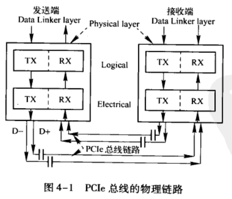
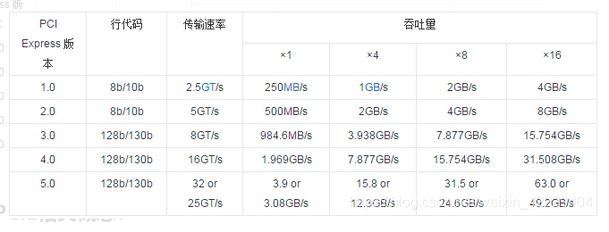
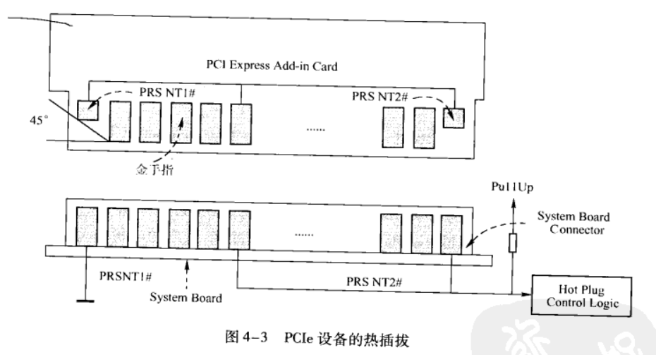
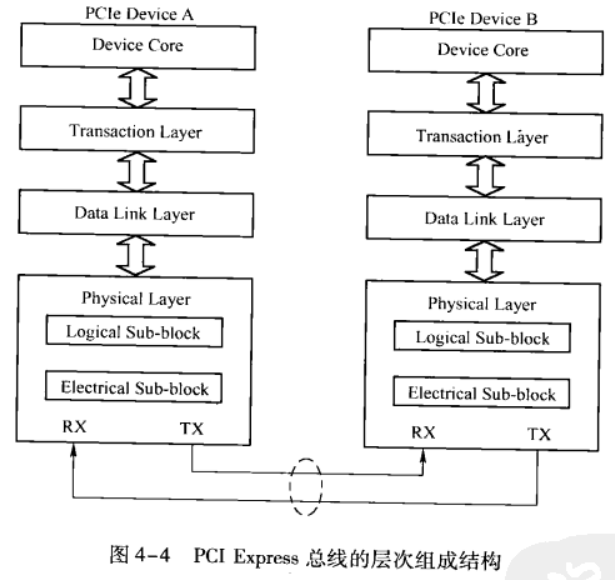
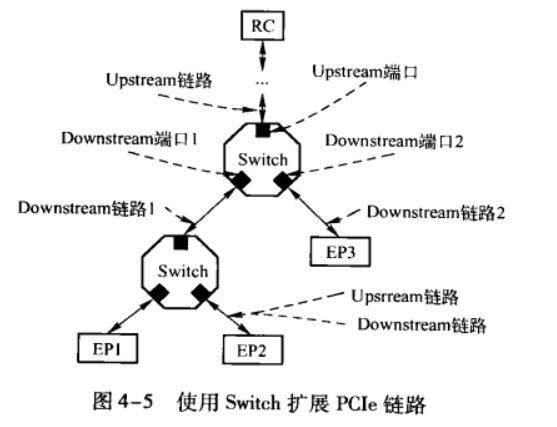

# PCI Express Learning

## Chapter 1 PCI总线的基本知识

PCI总线作为处理理器系统的局部总线,其主要目的是为了连接外部设备,而不是作为处理器的系统总线连接Cache和主存储器.

	现代处理器局部总线的设计的重点和难点:Cache共享一致性和数据完整性.

**1.PCI总线的特点**

1.PCI总线空间与处理器空间隔离

	1.PCI设备具有独立的地址空间,即PCI总线地址空间,该空间与存储器地址空间通过HOST主桥隔离;
	2.处理器访问PCI设备时,必须通过HOST主桥进行地址转换;
	3.PCI设备访问主存储器时,也需要通过HOST主桥进行地址转换;
	4.PCI设备使用的地址空间是属于PCI总线域,主存使用的属于存储器域.

## Chapter 4 PCIe总线概述

PCIe和PCI总线区别:

	1.PCI总线使用并行总线结构,在同一条总线上的所有外部设备共享总线带宽;
	2.而PCle总线使用了高速差分总线,采用端到端的连接方式,因此在每一条PCle链路中只能连接两个设备.
	3.PCle总线除了在连接方式上与PCI总线不同之外,还使用了一些在网络通信中使用的技术:
		e.g.支持多种数据路由方式;基于多通路的数据传递方式;和基于报文的数据传送方式;并充分考虑了在数据
		传送中出现的服务质量Qos(Quality of Service)问题.

### 4.1 PCIe总线的基础知识

与PCI总线不同,PCle总线使用端到端的连接方式.PCle链路的两端只能各连接一个设备,这两个设备互为数据发送端和数据接收端.PCle总线具有多个层次,发送端发送数据时将通过这些层次,而接收端接收数据时也使用这些层次.

#### 4.1.1 端到端的数据传递

**1.端到端的数据传递**

PCle链路使用"端到端的数据传送方式",发送端和接收端中都含有TX(发送逻辑)和RX(接收逻辑).

	在PCle总线的物理链路的一个数据通路(Lane)中,有两组差分信号(4根信号线);
	1.发送端的TX部件与接收端的RX部件使用一组差分信号连接,称为发送端的发送链路,也是接收端的接收链路;
	2.发送端的RX部件与接收端的TX部件使用另一组差分信号连接,称为发送端的接收链路,也是接收端的发送链路;
	PS:PCIe链路可以由多条lane组成.

使用差分信号的优点

	1.相比单端信号,差分信号的抗干扰能力更强;
	2.可以使用更高的总线频率;
	3.能有效抑制电磁干扰(EMI, Electro Magnetic Interference).

**2.PCIe规范**

PCle链路可以由多条Lane 组成,目前PCle链路可以支持1、2、4、8、12、16和32条lane(即:x1, x2, x4, x8, x16, x32).总线频率与版本相关.

1.相关概念

传输速率为每秒传输量GT/s,而不是每秒位数Gbps.因为传输量包括不提供额外吞吐量的开销位.e.g.PCIe 1.x和PCIe 2.x使用8b/10b编码方案,导致占用了20%(=2/10)的原始信道带宽.

	GT/s:Giga transaction per second,描述的是物理层通信协议的速率(即每一秒内传输的次数).
		--->一般在链路上是一个bit一个bit的传输(链路上使用串行方式进行数据传输).
	Gbps:Giga bits per second(千兆位/秒).GT/s与Gbps之间不存在成比例的换算关系.

2.带宽计算

PCIe吞吐量(可用带宽)计算方法: 带宽 = 传输速率 * 编码方案

	1.PCIe v2.0支持5.0GT/s,即每条lane上支持每秒钟传输5G个bit,采用了8b/10b的编码方案(即每传输8-bit需
		要发送10-bit,多个的2-bit对上层无意义).
		单条lane支持的带宽为:
			5 * 8 / 10 = 4Gbps = 500MBps
		x8的可用带宽为:
			8 * 4 = 32Gbps = 4GBps
	2.PCIe v3.0支持8.0GT/s,采用128b/130b的编码方案(即每传输128-bit需要发送130-bit).
		单条lane支持的带宽为:
			8 * 128 / 130 = 7.877Gbps = 984.6MB/s
		x16的可用带宽为:
			7.877 * 16 = 126.031Gbps = 15.754GBps
	3.PCIe v4.0支持16.0GT/s,采用128b/130b的编码方案(即每传输128-bit需要发送130-bit).
		单条lane支持的带宽为:
			16 * 128 / 130 = 15.754Gbps = 1.969GBps
		x16的可用带宽为:
			15.754 * 16 = 252.064Gbps = 31.508GBps
	4.PCIe v5.0支持32.0GT/s,采用128b/130b的编码方案(即每传输128-bit需要发送130-bit).
		单条lane支持的带宽为:
			32 * 128 / 130 = 31.507Gbps = 3.938GBps
		x16的可用带宽为:
			51.507 * 16 = 504.112Gbps = 63.014GBps

#### 4.1.2 PCIe总线使用的信号

**6. PRSNT1#和PRSNT2#**

这组信号与PCIe设备的热插拔相关.

	1.基于PCIe总线的Add-In卡中,PRSNT1#和PRSNT#2信号直接相连;在处理器主板中,PRSNT1#接地,PRSNT2#通过
		上拉电阻接高电平;
	2.当Add-In卡每插入时,主板上的PRSNT2#信号由上拉电阻接为高.当Add-In卡插入时,主板上的PRSNT2#信号通过
		Add-In卡与主板上的PRSNT1#信号接通.此时PRSNT2#信号为低.主板上的热插拔控制逻辑捕获到这个"低电平",
		得知Add-In卡已插入,触发系统软件进行相应处理;
	3.当Add-In卡连接在处理器主板时,处理器主板的PRSNT2#信号为低.当Add-In卡拔出后,主板上的PRSNT2#被拉高,
		主板上的热插拔控制逻辑捕获到这个"高电平",得到卡被拔出,触发系统软件进行相应处理.

#### 4.1.3 PCIe总线的层次结构

PCIe总线采用串行连接方式,并使用数据包(Packet)进行数据传输.在接收和发送过程中,需要通过的层次为:事务层、数据链路层、物理层.

PCIe总线层次结构和网络中的层次结构类似(PCIe总线层次使用硬件逻辑实现,实现方式和网路不同).数据报文产生于核心层(Device Core),经过TL、DL、PL,最终发送出去;接收端的数据也需要经过PL、DL、TL,并最终达到核心层.

**1.事务层(TL)**

	1.接收来自核心层的数据,并封装成TLP(Transaction Layer Packet),发向链路层;或者从DL层接收报文,转发
		至核心层;
	2.处理PCIe总线的"序";
	3.TL层传递报文时可以乱序;
	4.使用流量控制机制保证PCIe链路的使用效率.

**2.数据链路层(DL)**

	1.保证发送端TL层的报文可以可靠、完整地发送到接收端的DL层;
	2.来自TL层的报文在通过DL层时,将被添加Sequence Number前缀和CRC后缀;
	3.DL层使用ACK/NAK协议保证报文的可靠传递;
	4.DL层定义了多种DLLP(Data Link Layer Packet),DLLP产生于DL层,终止于DL层;
	5.TLP和DLLP不相同,DLLP并不是由TLP加上Sequence Number前缀和CRC后缀.

**3.物理层(PL层)**

	1.PL层是总线的最底层,将PCIe设备连接在一起;
	2.PL层定义了LTSSM(Link Training and Status State Machine)状态机,用于管理链路状态,进行链路训练、
		链路恢复和电源管理;
	3.PL定义了一些专门的"序列"---PLP(Physical Layer Packet),用于同步PCIe链路、并进行链路管理.

#### 4.1.4 PCIe链路的扩展

PCIe链路的一端只能连接一个发送/接收设备.需要使用switch扩展PCIe链路后,才能连接多个设备.

	1.switch中与RC直接或间接相连的端口称为上游端口(Upstream Port);下游端口一般与EP相连,或者连接
		下一级switch继续扩展PCIe链路;
	2.与上游端口相连的PCIe链路称为上游链路,与下游端口相连的PCIe链路称为下游链路;
	3.Egress/Ingress端口:与通过switch的数据流向相关:
		Egress端口:指发送端口,即数据离开switch使用的端口;
		Ingress端口:指接收端口,即数据进入switch使用的端口.
		e.g.
			RC对EP3的内部寄存器进行写操作时,switch的上游端口为Ingress端口;
			EP3对主存进行DMA写操作时,switch的上游端口为Egress端口,而下游端口为Ingress端口.

#### 4.1.5 PCIe设备的初始化