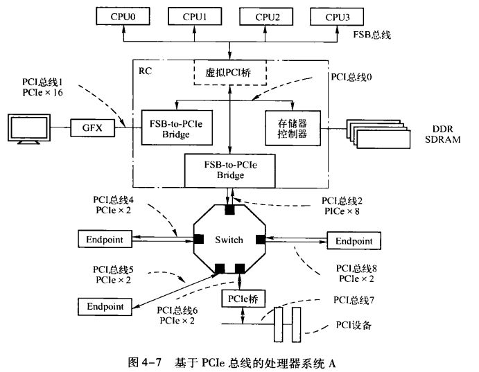
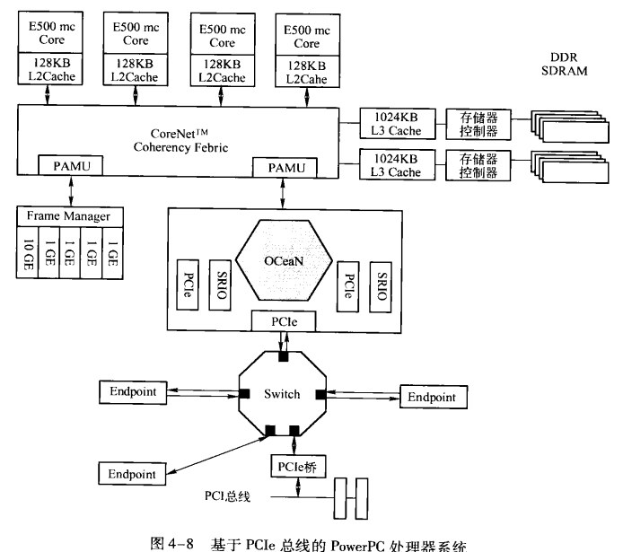

# PCI Express Learning

## Chapter 1 PCI总线的基本知识

PCI总线作为处理理器系统的局部总线,其主要目的是为了连接外部设备,而不是作为处理器的系统总线连接Cache和主存储器.

	现代处理器局部总线的设计的重点和难点:Cache共享一致性和数据完整性.

**1.PCI总线的特点**

1.PCI总线空间与处理器空间隔离

	1.PCI设备具有独立的地址空间,即PCI总线地址空间,该空间与存储器地址空间通过HOST主桥隔离;
	2.处理器访问PCI设备时,必须通过HOST主桥进行地址转换;
	3.PCI设备访问主存储器时,也需要通过HOST主桥进行地址转换;
	4.PCI设备使用的地址空间是属于PCI总线域,主存使用的属于存储器域.

## Chapter 4 PCIe总线概述

PCIe和PCI总线区别:

	1.PCI总线使用并行总线结构,在同一条总线上的所有外部设备共享总线带宽;
	2.而PCle总线使用了高速差分总线,采用端到端的连接方式,因此在每一条PCle链路中只能连接两个设备.
	3.PCle总线除了在连接方式上与PCI总线不同之外,还使用了一些在网络通信中使用的技术:
		e.g.支持多种数据路由方式;基于多通路的数据传递方式;和基于报文的数据传送方式;并充分考虑了在数据
		传送中出现的服务质量Qos(Quality of Service)问题.

### 4.1 PCIe总线的基础知识

与PCI总线不同,PCle总线使用端到端的连接方式.PCle链路的两端只能各连接一个设备,这两个设备互为数据发送端和数据接收端.PCle总线具有多个层次,发送端发送数据时将通过这些层次,而接收端接收数据时也使用这些层次.

#### 4.1.1 端到端的数据传递

**1.端到端的数据传递**

PCle链路使用"端到端的数据传送方式",发送端和接收端中都含有TX(发送逻辑)和RX(接收逻辑).

	在PCle总线的物理链路的一个数据通路(Lane)中,有两组差分信号(4根信号线);
	1.发送端的TX部件与接收端的RX部件使用一组差分信号连接,称为发送端的发送链路,也是接收端的接收链路;
	2.发送端的RX部件与接收端的TX部件使用另一组差分信号连接,称为发送端的接收链路,也是接收端的发送链路;
	PS:PCIe链路可以由多条lane组成.

使用差分信号的优点

	1.相比单端信号,差分信号的抗干扰能力更强;
	2.可以使用更高的总线频率;
	3.能有效抑制电磁干扰(EMI, Electro Magnetic Interference).

**2.PCIe规范**

PCle链路可以由多条Lane 组成,目前PCle链路可以支持1、2、4、8、12、16和32条lane(即:x1, x2, x4, x8, x16, x32).总线频率与版本相关.

1.相关概念

传输速率为每秒传输量GT/s,而不是每秒位数Gbps.因为传输量包括不提供额外吞吐量的开销位.e.g.PCIe 1.x和PCIe 2.x使用8b/10b编码方案,导致占用了20%(=2/10)的原始信道带宽.

	GT/s:Giga transaction per second,描述的是物理层通信协议的速率(即每一秒内传输的次数).
		--->一般在链路上是一个bit一个bit的传输(链路上使用串行方式进行数据传输).
	Gbps:Giga bits per second(千兆位/秒).GT/s与Gbps之间不存在成比例的换算关系.

2.带宽计算

PCIe吞吐量(可用带宽)计算方法: 带宽 = 传输速率 * 编码方案

	1.PCIe v2.0支持5.0GT/s,即每条lane上支持每秒钟传输5G个bit,采用了8b/10b的编码方案(即每传输8-bit需
		要发送10-bit,多个的2-bit对上层无意义).
		单条lane支持的带宽为:
			5 * 8 / 10 = 4Gbps = 500MBps
		x8的可用带宽为:
			8 * 4 = 32Gbps = 4GBps
	2.PCIe v3.0支持8.0GT/s,采用128b/130b的编码方案(即每传输128-bit需要发送130-bit).
		单条lane支持的带宽为:
			8 * 128 / 130 = 7.877Gbps = 984.6MB/s
		x16的可用带宽为:
			7.877 * 16 = 126.031Gbps = 15.754GBps
	3.PCIe v4.0支持16.0GT/s,采用128b/130b的编码方案(即每传输128-bit需要发送130-bit).
		单条lane支持的带宽为:
			16 * 128 / 130 = 15.754Gbps = 1.969GBps
		x16的可用带宽为:
			15.754 * 16 = 252.064Gbps = 31.508GBps
	4.PCIe v5.0支持32.0GT/s,采用128b/130b的编码方案(即每传输128-bit需要发送130-bit).
		单条lane支持的带宽为:
			32 * 128 / 130 = 31.507Gbps = 3.938GBps
		x16的可用带宽为:
			51.507 * 16 = 504.112Gbps = 63.014GBps

#### 4.1.2 PCIe总线使用的信号

**6. PRSNT1#和PRSNT2#**

这组信号与PCIe设备的热插拔相关.

	1.基于PCIe总线的Add-In卡中,PRSNT1#和PRSNT#2信号直接相连;在处理器主板中,PRSNT1#接地,PRSNT2#通过
		上拉电阻接高电平;
	2.当Add-In卡每插入时,主板上的PRSNT2#信号由上拉电阻接为高.当Add-In卡插入时,主板上的PRSNT2#信号通过
		Add-In卡与主板上的PRSNT1#信号接通.此时PRSNT2#信号为低.主板上的热插拔控制逻辑捕获到这个"低电平",
		得知Add-In卡已插入,触发系统软件进行相应处理;
	3.当Add-In卡连接在处理器主板时,处理器主板的PRSNT2#信号为低.当Add-In卡拔出后,主板上的PRSNT2#被拉高,
		主板上的热插拔控制逻辑捕获到这个"高电平",得到卡被拔出,触发系统软件进行相应处理.

#### 4.1.3 PCIe总线的层次结构

PCIe总线采用串行连接方式,并使用数据包(Packet)进行数据传输.在接收和发送过程中,需要通过的层次为:事务层、数据链路层、物理层.

PCIe总线层次结构和网络中的层次结构类似(PCIe总线层次使用硬件逻辑实现,实现方式和网路不同).数据报文产生于核心层(Device Core),经过TL、DL、PL,最终发送出去;接收端的数据也需要经过PL、DL、TL,并最终达到核心层.

**1.事务层(TL)**

	1.接收来自核心层的数据,并封装成TLP(Transaction Layer Packet),发向链路层;或者从DL层接收报文,转发
		至核心层;
	2.处理PCIe总线的"序";
	3.TL层传递报文时可以乱序;
	4.使用流量控制机制保证PCIe链路的使用效率.

**2.数据链路层(DL)**

	1.保证发送端TL层的报文可以可靠、完整地发送到接收端的DL层;
	2.来自TL层的报文在通过DL层时,将被添加Sequence Number前缀和CRC后缀;
	3.DL层使用ACK/NAK协议保证报文的可靠传递;
	4.DL层定义了多种DLLP(Data Link Layer Packet),DLLP产生于DL层,终止于DL层;
	5.TLP和DLLP不相同,DLLP并不是简单的由TLP加上Sequence Number前缀和CRC后缀.

**3.物理层(PL层)**

	1.PL层是总线的最底层,将PCIe设备连接在一起;
	2.PL层定义了LTSSM(Link Training and Status State Machine)状态机,用于管理链路状态,进行链路训练、
		链路恢复和电源管理;
	3.PL定义了一些专门的"序列"---PLP(Physical Layer Packet),用于同步PCIe链路、并进行链路管理.

#### 4.1.4 PCIe链路的扩展

PCIe链路的一端只能连接一个发送/接收设备.需要使用switch扩展PCIe链路后,才能连接多个设备.

	1.switch中与RC直接或间接相连的端口称为上游端口(Upstream Port);下游端口一般与EP相连,或者连接
		下一级switch继续扩展PCIe链路;
	2.与上游端口相连的PCIe链路称为上游链路,与下游端口相连的PCIe链路称为下游链路;
	3.Egress/Ingress端口:与通过switch的数据流向相关:
		Egress端口:指发送端口,即数据离开switch使用的端口;
		Ingress端口:指接收端口,即数据进入switch使用的端口.
		e.g.
			RC对EP3的内部寄存器进行写操作时,switch的上游端口为Ingress端口;
			EP3对主存进行DMA写操作时,switch的上游端口为Egress端口,而下游端口为Ingress端口.

#### 4.1.5 PCIe设备的初始化

PCIe两大类复位方式:传统的复位方式(Conventional Reset)和FLR(Function-Level Reset)方式.

**1.传统复位方式**

分为:Cold、Warm和Hot Reset.Cold Reset时间最长,Hot Reset时间最短.

	Cold Reset:PCIe设备从断电中通过上电来复位.是一种彻底的复位方式;
	Warm Reset:通过类似Watchdog的方式对PCIe设备进行复位;
	Hot Reset:当PCIe设备出现某种异常,使用软件手段对该设备进行复位.

**2.FLR方式**

软件过填写某寄存器FLR位(Function Level Reset),PCIe设备将使用FLR的方式复位PCIe设备的内部逻辑.

	FLR方式主要用于复位整个系统中一部分的资源,而且被复位的资源不能影响其他的资源.

### 4.2 PCIe体系结构的组成部件

基于PCIe总线的设备,也叫EP(Endpoint).

#### 4.2.1 基于PCIe架构的处理器系统

**1.处理器系统A--->与Intel的x86处理器系统类似**

**2.PowerPC处理器系统**

**3.基于PCIe总线的通用处理器结构**

#### 4.2.2 RC的组成结构

RC只在x86中有明确的RC,其他的处理器系统中不明确.

#### 4.2.3 Switch

使用Switch进行链路扩展后,PCIe链路可挂接多个EP.

switchn内部由于需要进行链路扩展,使用了虚拟多通路VC(Virtual Channel)技术.数据报文使用TC(Traffic Class)标签(3-bit)将数据报文优先级分为8类.

	8个独立的VC和8个TC进行绑定,TC和VC是"多对一"的关系(即多个TC可透过一个VC进行传输).

#### 4.2.4 VC和端口仲裁

**1.仲裁算法**

	Strict Priority:严格的优先级仲裁,发向VC7的数据报文具有最高优先级,发向VC0的优先级最低;
	RR(Round Robin):所有VC具有相同优先级,乱转调度;
	WRR(Weighted Round Ronbin):对每个VC进行加权处的RR,此时会适当提高VC7的优先级,降低VC0的优先级.

**2.仲裁实例**

## Chapter 6 PCIe总线的事务层

### 6.1 TLP的格式

处理器或其他PCIe设备访问PCIe设备时,所传送的数据报文首先通过TL层被封装为一个或多个TLP,然后通过PCIe总线的其他层次发送出去.

TLP基本格式:

**1.TLP Prefix**

由PCIe v2.1引入,分为Local TLP Prefix和EP-EP TLP Prefix.

	Local TLP Prefix:在PCIe链路的两端传递消息;
	EP-EP TLP Prefix:在发送设备和接收设备之间传递消息.

**2.TLP Head**

TLP最终的标志.包含当前TLP的总线事务类型、路由信息等.

	1.TLP头由3/4个word组成(现在一个word为4B,书中的DW是以前1DW=4B);
	2.第一个word保存通用的TLP头,由Fmt、Type、TC、Length等组成;
	3.其他字段与通用TLP头的Type字段相关;
	4.在64-bit地址模式下,TLP头的长度为4 word,否则为3 word;
	5.完成报文的TLP头不含有地址信息,此时TLP头长度为3 word.

**3.Data Payload**

Data Payload长度可变,最小为0,最大为1024 word.

	Data Payload是个可选项,有些TLP不需要Data Payload(e.g.存储器读请求).

**4.TLP Digest**

一个TLP是否需要TLP Digest由TLP头决定,TLP Digest是一个可选项.

#### 6.1.1 通用TLP头的Fmt字段和Type字段

**1.Fmt字段**

	Fmt[2:0]						TLP格式
	0b000							TLP头大小为3 word,不带数据
	0b001							TLP头大小为4 word,不带数据
	0b010							TLP头大小为3 word,带数据
	0b011							TLP头大小为4 word,带数据
	0b100							TLP Prefix
	其他								Reserved

**2.Type字段--->一般和Fmt组合使用**

	TLP类型		Fmt[2:0]		Type[4:0]		含义
	MRd			0b000			0b0 0000		存储器读,TLP头大小为3 word,不带数据
				0b001							存储器读,TLP头大小为4 word,不带数据

	MWr			0b010			0b0 0000		存储器写,TLP头大小为3 word,带数据
				0b011							存储器写,TLP头大小为4 word,带数据

	Cpl			0b000			0b0 1010		完成报文,TLP头大小为3 word,不带数据.用于写完成
	CplD		0b001			0b0 1010		带数据的完成报文,TLP头大小为4 word,带数据.用于读完成

**3.Posted/Non-Posted**

	1.存储器写一般用Posted方式传送,存储器读一般用Non-Posted方式传送;
	2.写操作的完成报文为Cpl,读操作的完成报文为CplD.

#### 6.1.2 TC字段

略.

#### 6.1.3 Attr字段

	attr[2]:表示该TLP是否支持PCIe总线的ID-based ordering;
	attr[1]:表示是否支持Relaxed ordering;
	attr[0]:表示该TLP经过RC到达存储器时,是否需要进行Cache共享一致性处理.

TLP支持的序如下:

	attr[2:1]为0b00:表示SO;
	attr[2:1]为0b01:表示RO;
	其他暂不用.

**1.SO强序模型**

当attr[2:1]为0b00时,表示强序模型.此时PCIe设备在处理相同类型的TLP时,后面的存储器写必须等前一个写完成才能处理,即便当前报文在传送过程中被阻塞,后一个报文也必须等待.

**2.Relaxed ordering模型**

当attr[2:1]为0b01时,表示Relaxed ordering模型.后一个存储器写可以跨越前一个写操作,提高PCIe总线的利用率.

**3.TLP间乱序**

不同种类的TLP间可以乱序通过同一条链路(SO模型写也可以).

	1.存储器写TLP可以跨越存储器读TLP;
	2.存储器读TLP不能跨越存储器写TLP.

**4.No Snoop位**

表示该TLP经过RC到达存储器时,是否需要进行Cache共享一致性处理.

大数据量的DMA操作:PCIe设备对存储器进行DMA读操作,读取大小为512M,此时绝大多数情况下,不会在Cache中命中.若进行Snoop会浪费CPU时钟周期.

	正确做法:
	软件保证Cache和主存储器的一致性,并置"No Snoop attr"位为1,在进行DMA读操作.--->同样适用于写操作.

PS:如果访问的存储器空间是"Non-Cacheable",也置"No Snoop attr"位为1即可.

#### 6.1.4 其他字段

**1.TH、TD和EP位**

	TH:是否含有TPH(TLP Processing Hint)信息;
	TD:TLP中的TLP Digest是否有效(0b1:有效;0b0:无效);
	EP:TLP中的数据是否有效(0b1:无效;0b0:有效).

**2.AT字段**

与ATC(Address Translation Cache)相关.

**3.Length字段**

描述TLP的有效负载大小.TLP的Data Payload大小在1B-4096B之间.

	PCIe设备进行DMA写操作,写4KB时,会以标准TLP包大小(64B/128B/256B等)进行拆分,然后写DDR.

### 6.2 TLP的路由

三种路由方式:基于地址的路由、基于ID的路由和隐式路由.

	基于地址的路由:存储器和I/O读写请求TLP使用该种路由方式;
	基于ID的路由:配置读写报文、Cpl和CplD等报文使用该种路由方式;
	隐式路由:主要用于Message报文的传递.

#### 6.2.1 基于地址的路由

	1.TLP1:处理器访问EP的BAR空间使用该类报文,从RC发向EP1;
	2.TLP2:一般DMA操作(访问内存),从EP2发向RC;
	3.TLP3:EP2访问EP1.

#### 6.2.2 基于ID的路由

	1.基于ID路由主要用于配置读写请求TLP、Cpl和CplD报文;
	2.Bus Number(8-bit):表示PCI总线,最多有256条PCI总线;
	3.Device Number(5-bit):表示一条总线的设备数量,最多有32个设备;
	4.Function Number(3-bit):表示每个设备的功能,最多8个功能.

#### 6.2.3 隐式路由

隐式路由用于消息报文.

### 6.3 存储器、I/O和配置读写请求TLP

TLP报文类型:

	1.存储器读请求TLP和读完成TLP
		使用Non-Posted总线事务.主设备访问目标设备的存储器空间.目标设备收到存储器读请求TLP后,发送存储器
		读完成TLP(读完成TLP中携带数据).
	2.存储器写请求TLP
		使用Posted总线事务.主设备发送存储器写请求TLP给目标设备,不需要目标设备的回应报文.
	3.原子操作请求和完成报文
		和Non-Posted总线事务类似.主设备发送原子操作请求给目标设备,目标设备向主设备发送原子操作完成报文.
	4.I/O读写请求TLP和读写完成TLP
		I/O读写使用Non-Posted总线事务,都需要完成报文;
		I/O写请求的完成报文不需要携带数据,仅含有是否成功的状态信息.
	5.配置读写请求TLP和配置读写完成TLP
		与I/O读写操作类似.
	6.消息报文
		略.

#### 6.3.1 存储器读写请求TLP

分32-bith和64-bit地址模式.

**1.Length字段**

	1.存储器读请求TLP中不包含data payload,Length表示需要读取的数据长度;
	2.存储器写请求TLP,Length表示当前报文的data payload长度;
	3.Length字段最小单位为word(4B),当长度为n时(0 <= n <= 0x3FF):
		n=0表示数据长度为1024 word,即4KB.

**2.DW BE字段**

word中的字节使能(byte enable),因为Length中的最小单位为word.

	1.传送1byte时:
		Last DW BE为:0b0000; First DW BE为:0b0001/0b0010/0b0100/0b1000.
	2.传送5byte时:
		Last DW BE为:0b1111; First DW BE为:0b0001/0b0010/0b0100/0b1000;
		Last DW BE为:0b0001/0b0010/0b0100/0b1000; First DW BE为:0b1111.
		或其他,但First DW BE不能为:0b0000.

Zero-Length读请求:Length字段为1 word,First DW BE和Last DW BE均为0b0000(所有字节都不使能).

	此时表示:存储器读请求TLP对应的读完成TLP不包含有效数据.主要用于确保Posted写数据达到目的地.
	PS:Length不能为0是因为为0表示数据长度为1024个word.

**3.Requester ID字段**

	1.Requester ID由Bus Number+Device Number+Function Number构成;
	2.Requester ID对于存储器写操作无意义,因为写操作需要完成报文作为应答;
	3.Requester ID对于同一个设备一般是一样的.因此多数使用Tag作为Transaction ID当作包的标识.

**4.I/O读写请求TLP的规则**

略.

#### 6.3.2 完成报文

**1.完成报文需求**

以下2类请求需要提供完成报文:

	1.所有的读请求(存储器读、I/O读、配置读和原子操作):此类完成报文必须包含Data payload;
	2.部分写请求(I/O写、配置写):此类完成不包含数据,仅包含应答信息.

**2.Requester ID和Tag字段**

和请求中一样.

**3.Completer ID字段**

与Requester ID类似.

**4.Status字段**

表示当前完成报文的状态.

**5.BCM位与Byte Count字段**

略.

**6.Lower Address字段**

略.

#### 6.3.3 配置读写请求TLP

配置读写请求TLP由RC发起,用来访问PCIe设备的配置空间.支持两种配置请求报文:Type 00h和Type 01h.

	1.Ext Register和Register Number存访寄存器号;
	2.TC[2:0]必须为0;
	3.TH:Reserved; Attr2:Reserved; Attr[1:0]必须为:00b; AT[1:0]:必须为:0b00,表示不进行地址转换;
	4.Length[9:0]:为0b00 0000 0001,表示最大Payload为1word;
	5.Last DW BE为0b0000,First DW BE根据配置读写大小进行设置.

#### 6.3.4 消息请求报文

略.

#### 6.3.5 PCIe总线的原子操作

支持3种原子操作:FetchAdd、Swap和CAS原子操作.

#### 6.3.6 TLP Processing Hint

略.

### 6.4 TLP中与数据负载相关的参数

#### 6.4.1 Max_Payload_Size参数

规定最大负载.总线规定最大为4KB,设计时会根据实际应用场景进行设置.

	Max_Payload_Size参数仅与存储器写请求和读请求完成报文相关.

#### 6.4.2 Max_Read_Request_Size参数

规定PCIe设备一次最大能从目标设备读取多少数据.与Max_Payload_Size无直接联系.

#### 6.4.3 RCB参数

略.

