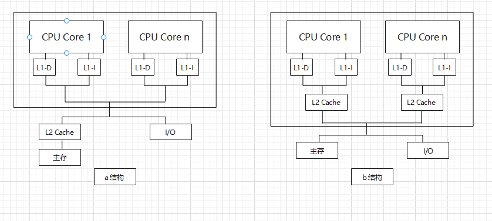
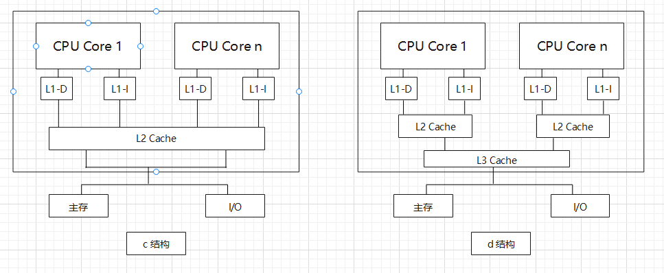

# Processor architecture and programming

## Chapter 1. 服务器与处理器

### 1.1 服务器体系结构

#### 1.1.1 服务器的分类

机架式服务器(Rack Server)也称为机架安装服务器(Rack-mounted Server),是服务器主流机械结构之一.

	1.机架式服务器安装在标准的19英寸(1 inch = 2.54 cmd)机架内;
	2.服务器的宽度为19英寸,高度以1U为单位,1U等于1.75英寸(4.45cm).高度通常有1U、2U、4U、8U等规格.1U和2U
		最为常见.

#### 1.1.2 服务器的性能评价

**1.TPC测试基准**

用的很少.

**2.SPEC测试基准**

SPEC指的是标准性能评估机构(Standard Performance Evaluation Corporation).SPEC CPU测试基准通过不同方式度量处理器性能:

	SPECspeed Metrics(SPEC速度测量):测量计算机完成单一任务时间的方式,通过SPECint 2006 benchmark指
		标呈现,用于比较不同计算机完成单一任务的能力;
	SPECrate:衡量在特定时间长度内能够完成多少任务的方式(也叫吞吐率(Throughtput)测量、容量(Capacity)
		测量或速度(Rate)测量),通过SPECint_rate 2006 benchmark指标呈现,评价机器承载大量任务的能力,
		通常用于多CPU系统的评价.

SPEC CPU 2006给出的测试结果有"基础(Base)"和"峰值(Peak)"两种.在基础测试时需要限制编译时的优化参数,以保证测试的公平,而在峰值测试的限制则比较宽松.

SPEC CPU 2017(包含多大43项工业标准的基准测试),主要分为:

	1.针对整数计算的SPECspeed 2017 Integer和SPECrate 2017 Integer测试组;
	2.针对浮点运算的SPECspeed 2017 Floating Point和SPECrate 2017 Floating Point测试组;
	PS:
		1.SPECspeed 2017 Integer和SPECspeed 2017 Floating Point测试组用于比较完整的单一任务在计算
			机系统上的执行时间的测试;
		2.SPECrate 2017 Integer和SPECrate 2017 Floating Point测试组用于吞吐量度量,也即测试单位时
			间的工作任务量.

#### 1.1.3 服务器的可靠性和管理

RAS特性:Reliability(可靠性)、Availabitiy(可用性)、Serviceability(可服务性).

RAS技术可以通过以下方式有效减少故障出现的概率:

	1.在造成系统失效之前检测并修正瞬时错误;
	2.定位和替换失效部件;
	3.提前预测失效,以便在计划的维护时间内更换系统或部件.

### 1.2 服务器处理器

#### 1.2.1 指令流水线

指令内部的并行:一条指令执行时各微操作之间的并行.

指令级并行:并行执行两条或多条指令.

任务级并行:并行执行两个或两个以上的任务(程序段).

作业或程序级并行(最高级):并行执行两个或两个以上的作业或程序.

超标量(superscalar)设计采用多发射技术,在处理器内部设置多条并行执行的指令流水线,通过在每个时钟周期内向执行单元发射多条指令实现指令级并行.

#### 1.2.2 多线程处理器

SMT(Simultaneous Multi-Threading):同时多线程,允许在一个时钟周期内发送来自不同线程的多条指令.

#### 1.2.3 同构多核处理器与异构多核处理器

同构多核处理器(Homogenous Multi-Core):处理器内的所有计算核心结构相同,对位对等;

异构多核处理器(Heterogeneous Multi-Core):处理器通过配置不同特点的核心来优化处理器内部结构,实现处理器性能的最优化,并能有效降低系统功耗.

	e.g. GPU+CPU集成在一颗芯片上.

#### 1.2.4 多核处理器的对称性

对称多处理(Symmetric Multi-Processing, SMP)结构:指处理器片内包含相同结构的核(低位均等),多个核紧密耦合并运行一个统一的操作系统.

非对称多处理结构(Asymmetric Multi-Processing, AMP)结构:异构多核处理器或同构多核运行不同的操作系统.

### 1.3 服务器技术基础

#### 1.3.1 多核系统的存储结构

**1.片内私有L1 Cache结构**

由L1和L2两级组成(a结构).每个核有自己私有的L1 Cache(分为L1 I-Cache核L1 D-Cache).多核共享L2 Cache,放在处理器之外--->基本已经废弃了.

**2.片内私有L2 Cache结构**

保留私有L1 I-Cache和L1 D-Cache,L2为各个核私有(b结构).多核共享主存.

**3.片内共享L2 Cache结构**

与片内私有L2 Cache结构.区别在于处理器内的私有L2 Cache变为多核共享(c结构).

**4.片内共享L3 Cache结构**

在片内私有L2 Cache结构的基础上增减片内多核共享L3 Cache,使存储系统的性能有了较大的提高(d结构).

#### 1.3.2 多核处理器的Cache一致性

**1.单处理器系统**

Cache一致性问题主要是在内存操作过程中如何保持各级Cache中的数据副本与主存内容的一致--->使用全写法(写穿式)可解决.

**2.多核处理器系统**

1.写数据的共享

某个处理器采用全写法或写回法修改某一个数据块时,会引起其他处理器的Cache中同一副本的不一致--->采用总线监听(Bus Snooping)协议或目录协议(Directory)解决.

2.输入/出活动

如果输入/输出设备直接连接在系统总线上,输入/输出活动也会导致Cache不一致--->采用禁止输入/输出通道解决.

3.核间线程迁移

核间线程迁移就是把一个尚未执行完的线程调度到另一个空间的处理器去执行.这有可能引起Cache的不一致--->采用禁止核间线程迁移来解决.

#### 1.3.3 UMA架构与NUMA架构

参考"Run Linux Kernel.md".

#### 1.3.4 内存顺序模型与内存屏障

略.

#### 1.3.5 服务器虚拟化技术

略.

#### 1.3.6 PCI Express技术

略.

## Chapter 2. ARMv8-A体系结构

### 2.1 ARMv8-A处理单元的核心架构

无论是AArch32还是AArch64,其指令长度都是32-bit(4B).

	AArch32与AArch64的本质区别:
	AArch32指令集使用32-bit寄存器;AArch64指令集使用64-bit寄存器,并使用64-bit计算模式.

## Chapter 3. 服务器与处理器