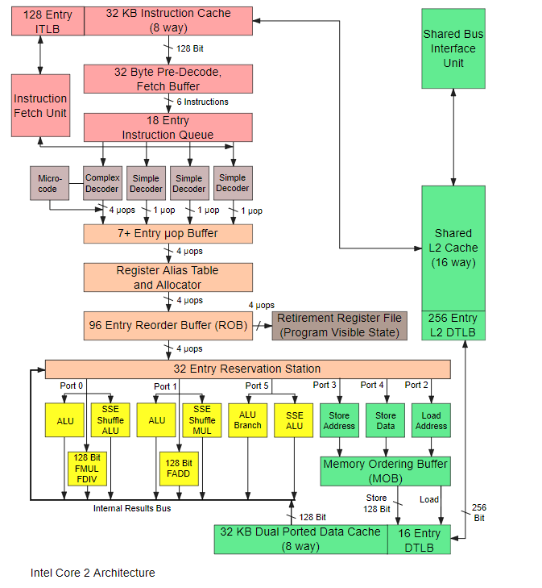
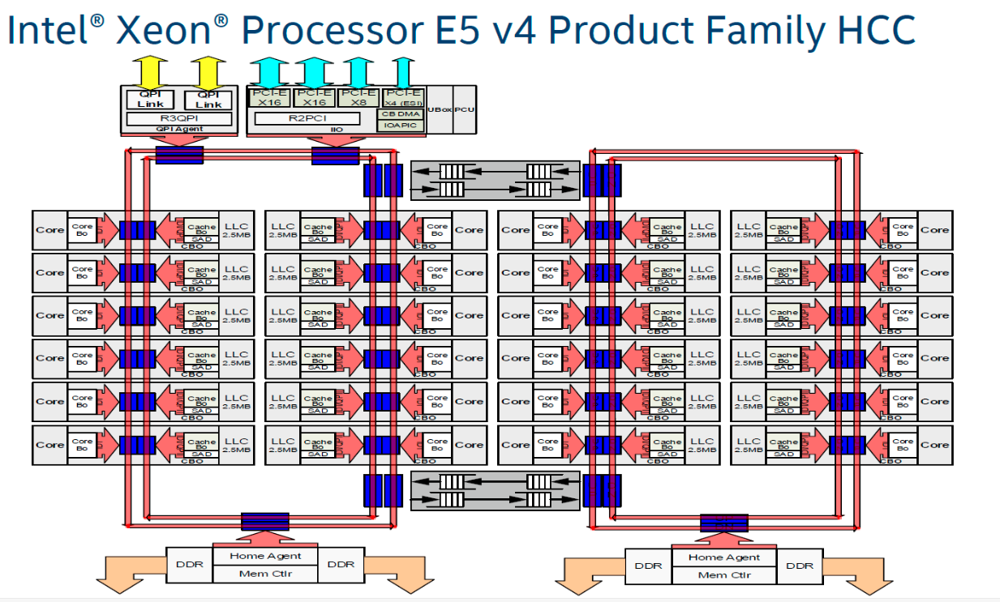
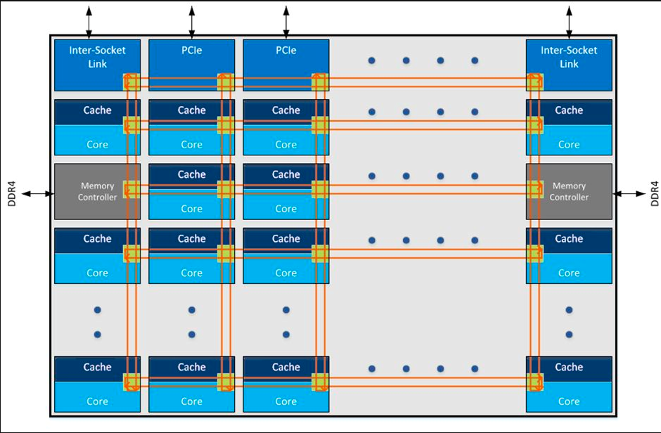
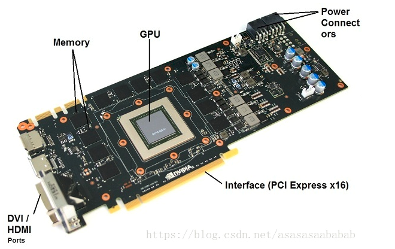
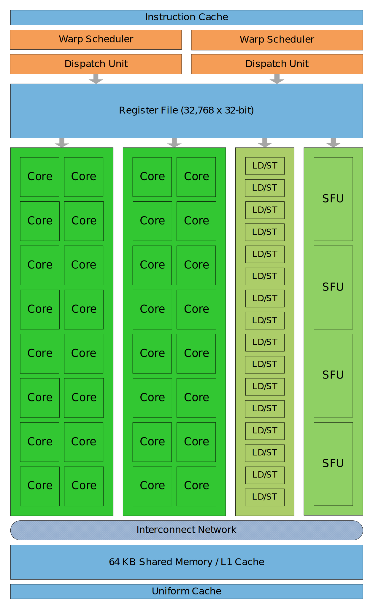
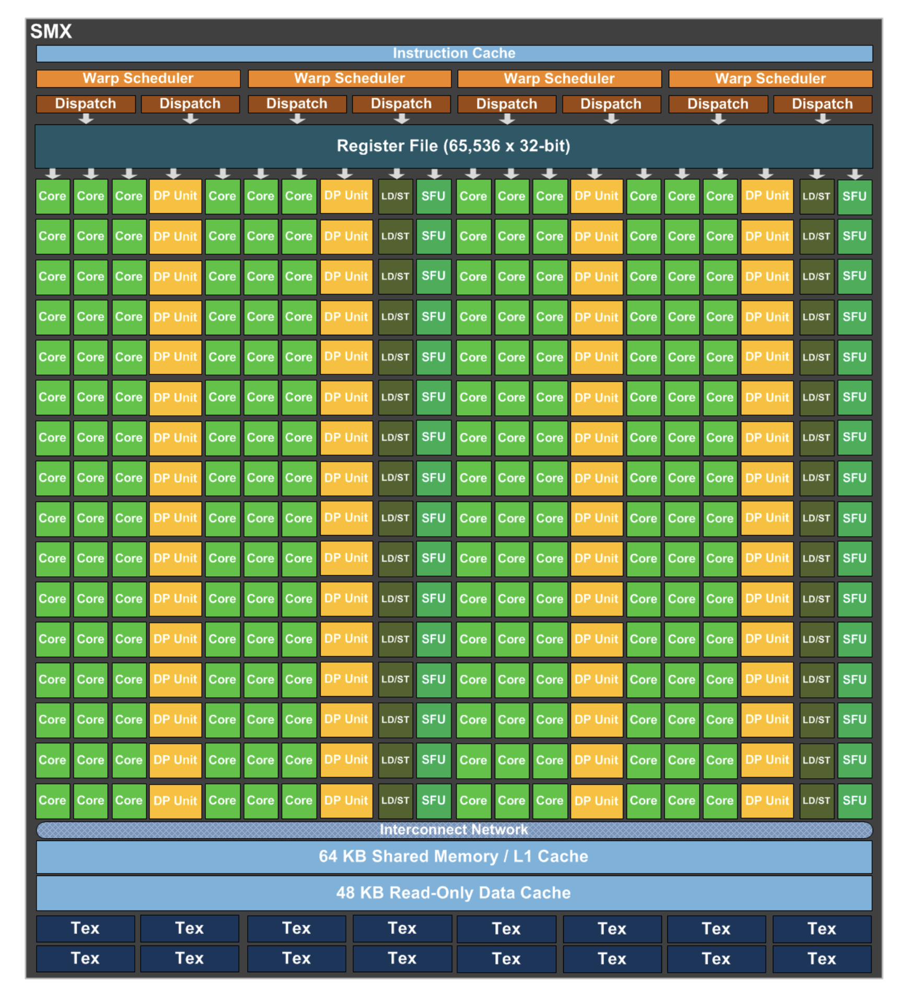
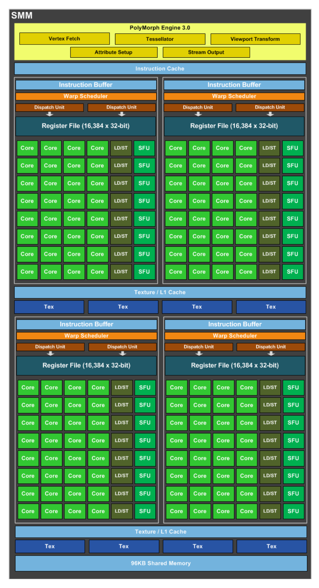
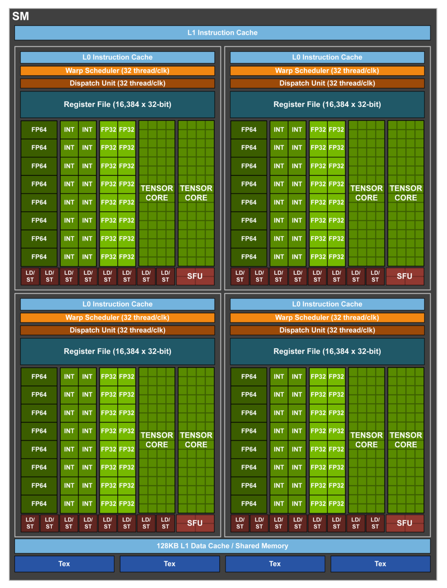
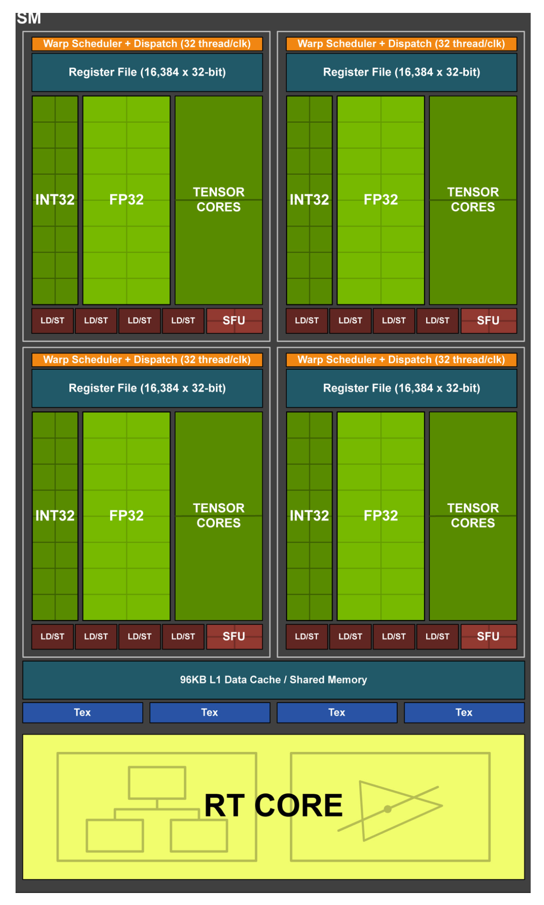
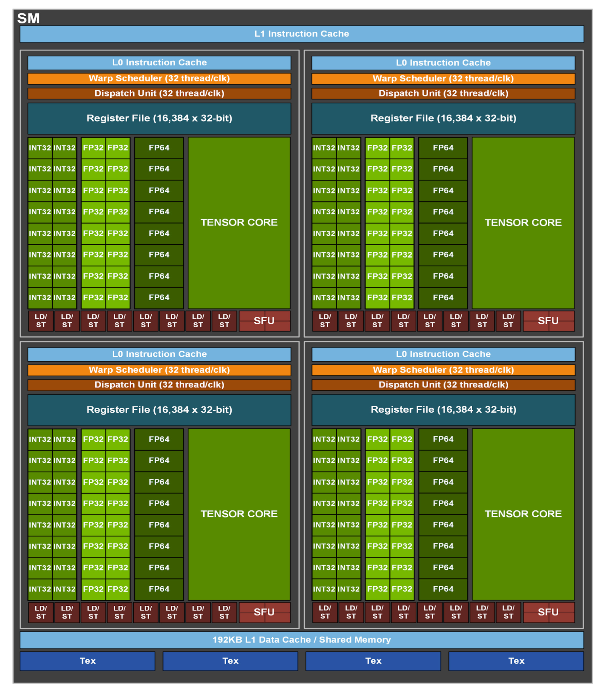

# Processor Architecture Evolution

## 1. Intel处理器架构演进

### 1.1 Intel架构演进规律

大约10年前,Intel宣布了著名的"滴答"(Tick-Tock)战略模式(也叫制程-架构节奏)."嘀嗒"意为钟摆的一个周期,"嘀"(Tick)代表芯片工艺提升、晶体管变小(e.g. 22nm到14nm),而"嗒"(Tock)代表工艺不变,芯片核心架构的升级(即微架构的升级).一个"嘀嗒"代表完整的芯片发展周期,耗时两年.

但是发展到14nm制程后,Intel已经力不从心了,从skylake架构开始,Intel打破了"制程-架构"节奏,采用"制程-架构-优化"(PAO)三步走战略.

### 1.2 Intel历史架构演进图

<style type="text/css">
.tg  {border-collapse:collapse;border-spacing:0;}
.tg td{border-color:black;border-style:solid;border-width:1px;font-family:Arial, sans-serif;font-size:14px;
  overflow:hidden;padding:10px 5px;word-break:normal;}
.tg th{border-color:black;border-style:solid;border-width:1px;font-family:Arial, sans-serif;font-size:14px;
  font-weight:normal;overflow:hidden;padding:10px 5px;word-break:normal;}
.tg .tg-9wq8{border-color:inherit;text-align:center;vertical-align:middle}
</style>
<table class="tg">
<thead>
  <tr>
    <th class="tg-9wq8" rowspan="2">Architectural change</th>
    <th class="tg-9wq8" rowspan="2">Fabrication process</th>
    <th class="tg-9wq8" rowspan="2">Micro-architecture</th>
    <th class="tg-9wq8" rowspan="2">Code names</th>
    <th class="tg-9wq8" rowspan="2">Release date</th>
    <th class="tg-9wq8" colspan="5">Processors</th>
  </tr>
  <tr>
    <td class="tg-9wq8">8P/4P<br>Server</td>
    <td class="tg-9wq8">4P/2P<br>Server/<br>Workstation</td>
    <td class="tg-9wq8">Enthusiast/<br>Workstation</td>
    <td class="tg-9wq8">Desktop</td>
    <td class="tg-9wq8">Mobile</td>
  </tr>
</thead>
<tbody>
  <tr>
    <td class="tg-9wq8">Tick(new<br>fabrication<br>process)</td>
    <td class="tg-9wq8" rowspan="2">65nm</td>
    <td class="tg-9wq8">P6, NetBurst</td>
    <td class="tg-9wq8">Presle,<br>Cedar,<br>Mill,<br>Yonah</td>
    <td class="tg-9wq8">2006-01-05</td>
    <td class="tg-9wq8"></td>
    <td class="tg-9wq8"></td>
    <td class="tg-9wq8">Presler</td>
    <td class="tg-9wq8">Cedar<br>Mill</td>
    <td class="tg-9wq8">Yonah</td>
  </tr>
  <tr>
    <td class="tg-9wq8">Tock(new<br>micro-<br>architecture)</td>
    <td class="tg-9wq8" rowspan="2">Core</td>
    <td class="tg-9wq8">Merom</td>
    <td class="tg-9wq8">2006-07-27</td>
    <td class="tg-9wq8">Tigerton</td>
    <td class="tg-9wq8">Woodcrest<br>Clovertown</td>
    <td class="tg-9wq8">Kentsfield</td>
    <td class="tg-9wq8">Conroe</td>
    <td class="tg-9wq8">Merom</td>
  </tr>
  <tr>
    <td class="tg-9wq8">Tick</td>
    <td class="tg-9wq8" rowspan="2">45nm</td>
    <td class="tg-9wq8">Penryn</td>
    <td class="tg-9wq8">2007-11-11</td>
    <td class="tg-9wq8">Dunnington</td>
    <td class="tg-9wq8">Harpertown</td>
    <td class="tg-9wq8">Yorkfield</td>
    <td class="tg-9wq8">Wolfdale</td>
    <td class="tg-9wq8">Penryn</td>
  </tr>
  <tr>
    <td class="tg-9wq8">Tock</td>
    <td class="tg-9wq8" rowspan="2">Nehalem</td>
    <td class="tg-9wq8">Nehalem</td>
    <td class="tg-9wq8">2008-11-17</td>
    <td class="tg-9wq8">Beckton</td>
    <td class="tg-9wq8">Gainestown</td>
    <td class="tg-9wq8">Bloomfield</td>
    <td class="tg-9wq8">Lynnfield</td>
    <td class="tg-9wq8">Clarksfield</td>
  </tr>
  <tr>
    <td class="tg-9wq8">Tick</td>
    <td class="tg-9wq8" rowspan="2">32nm</td>
    <td class="tg-9wq8">Westmere</td>
    <td class="tg-9wq8">2010-01-04</td>
    <td class="tg-9wq8">Westmere-<br>EX</td>
    <td class="tg-9wq8">Westmere-<br>EP</td>
    <td class="tg-9wq8">Gulftown</td>
    <td class="tg-9wq8">Clarkdale</td>
    <td class="tg-9wq8">Arrandale</td>
  </tr>
  <tr>
    <td class="tg-9wq8">Tock</td>
    <td class="tg-9wq8" rowspan="2">Sandy Bridge</td>
    <td class="tg-9wq8">Sandy Bridge</td>
    <td class="tg-9wq8">2011-01-09</td>
    <td class="tg-9wq8">(Skipped)</td>
    <td class="tg-9wq8">Sandy<br>Bridge-EP</td>
    <td class="tg-9wq8">Sandy<br>Bridge-E</td>
    <td class="tg-9wq8">Sandy<br>Bridge</td>
    <td class="tg-9wq8">Sandy<br>Bridge-M</td>
  </tr>
  <tr>
    <td class="tg-9wq8">Tick</td>
    <td class="tg-9wq8" rowspan="3">22nm</td>
    <td class="tg-9wq8">Ivy Bridge</td>
    <td class="tg-9wq8">2012-04-29</td>
    <td class="tg-9wq8">Ivy Bridge-<br>EX</td>
    <td class="tg-9wq8">Ivy Bridge-<br>EP</td>
    <td class="tg-9wq8">Ivy Bridge-<br>E</td>
    <td class="tg-9wq8">Ivy Bridge</td>
    <td class="tg-9wq8">Ivy Bridge-<br>M</td>
  </tr>
  <tr>
    <td class="tg-9wq8">Tock</td>
    <td class="tg-9wq8" rowspan="3">Haswell</td>
    <td class="tg-9wq8">Haswell</td>
    <td class="tg-9wq8">2013-06-02</td>
    <td class="tg-9wq8">Haswell-EX</td>
    <td class="tg-9wq8">Haswell-EP</td>
    <td class="tg-9wq8">Haswell-E</td>
    <td class="tg-9wq8">Haswell-DT</td>
    <td class="tg-9wq8">Haswell-MB<br>(notebooks)<br>Haswell-LP<br>(ultrabooks)</td>
  </tr>
  <tr>
    <td class="tg-9wq8">Refresh</td>
    <td class="tg-9wq8">Haswell,<br>Refresh,<br>Devil's<br>Canyon</td>
    <td class="tg-9wq8">2014-05-11,<br>2014-06-02</td>
    <td class="tg-9wq8"></td>
    <td class="tg-9wq8"></td>
    <td class="tg-9wq8"></td>
    <td class="tg-9wq8"></td>
    <td class="tg-9wq8"></td>
  </tr>
  <tr>
    <td class="tg-9wq8">Tick</td>
    <td class="tg-9wq8" rowspan="5">14nm</td>
    <td class="tg-9wq8">Broadwell</td>
    <td class="tg-9wq8">2014-09-05</td>
    <td class="tg-9wq8">Broadwell-EX</td>
    <td class="tg-9wq8">Broadwell-EP</td>
    <td class="tg-9wq8">Broadwell-E</td>
    <td class="tg-9wq8"></td>
    <td class="tg-9wq8"></td>
  </tr>
  <tr>
    <td class="tg-9wq8">Tock</td>
    <td class="tg-9wq8" rowspan="5">Skylake</td>
    <td class="tg-9wq8">Skylake</td>
    <td class="tg-9wq8">2015-08-05</td>
    <td class="tg-9wq8">Skylake-SP</td>
    <td class="tg-9wq8">Skylake-SP</td>
    <td class="tg-9wq8">Skylake-X</td>
    <td class="tg-9wq8">Skylake</td>
    <td class="tg-9wq8"></td>
  </tr>
  <tr>
    <td class="tg-9wq8" rowspan="3">Optimizations<br>(refreshed)</td>
    <td class="tg-9wq8">Kaby Lake</td>
    <td class="tg-9wq8">2017-01-03</td>
    <td class="tg-9wq8"></td>
    <td class="tg-9wq8"></td>
    <td class="tg-9wq8">KabyLake-X</td>
    <td class="tg-9wq8">Kaby Lake</td>
    <td class="tg-9wq8"></td>
  </tr>
  <tr>
    <td class="tg-9wq8">Kaby Lake<br>R</td>
    <td class="tg-9wq8">2017-08-21</td>
    <td class="tg-9wq8"></td>
    <td class="tg-9wq8"></td>
    <td class="tg-9wq8"></td>
    <td class="tg-9wq8"></td>
    <td class="tg-9wq8"></td>
  </tr>
  <tr>
    <td class="tg-9wq8">Coffee Lake</td>
    <td class="tg-9wq8">2017-10-05</td>
    <td class="tg-9wq8"></td>
    <td class="tg-9wq8"></td>
    <td class="tg-9wq8"></td>
    <td class="tg-9wq8">Coffee Lake</td>
    <td class="tg-9wq8"></td>
  </tr>
  <tr>
    <td class="tg-9wq8">Process</td>
    <td class="tg-9wq8" rowspan="3">10nm</td>
    <td class="tg-9wq8">Cannon Lake</td>
    <td class="tg-9wq8">2018</td>
    <td class="tg-9wq8"></td>
    <td class="tg-9wq8"></td>
    <td class="tg-9wq8"></td>
    <td class="tg-9wq8"></td>
    <td class="tg-9wq8"></td>
  </tr>
  <tr>
    <td class="tg-9wq8">Architecture</td>
    <td class="tg-9wq8" rowspan="3">Ice Lake</td>
    <td class="tg-9wq8">Ice Lake</td>
    <td class="tg-9wq8">2018/<br>2019?</td>
    <td class="tg-9wq8"></td>
    <td class="tg-9wq8"></td>
    <td class="tg-9wq8"></td>
    <td class="tg-9wq8"></td>
    <td class="tg-9wq8"></td>
  </tr>
  <tr>
    <td class="tg-9wq8">Optimization</td>
    <td class="tg-9wq8">Tiger Lake</td>
    <td class="tg-9wq8">2019?</td>
    <td class="tg-9wq8"></td>
    <td class="tg-9wq8"></td>
    <td class="tg-9wq8"></td>
    <td class="tg-9wq8"></td>
    <td class="tg-9wq8"></td>
  </tr>
  <tr>
    <td class="tg-9wq8">Process</td>
    <td class="tg-9wq8" rowspan="3">7nm</td>
    <td class="tg-9wq8"></td>
    <td class="tg-9wq8"></td>
    <td class="tg-9wq8"></td>
    <td class="tg-9wq8"></td>
    <td class="tg-9wq8"></td>
    <td class="tg-9wq8"></td>
    <td class="tg-9wq8"></td>
  </tr>
  <tr>
    <td class="tg-9wq8">Architecture</td>
    <td class="tg-9wq8" rowspan="3"></td>
    <td class="tg-9wq8"></td>
    <td class="tg-9wq8"></td>
    <td class="tg-9wq8"></td>
    <td class="tg-9wq8"></td>
    <td class="tg-9wq8"></td>
    <td class="tg-9wq8"></td>
    <td class="tg-9wq8"></td>
  </tr>
  <tr>
    <td class="tg-9wq8">Optimization</td>
    <td class="tg-9wq8"></td>
    <td class="tg-9wq8"></td>
    <td class="tg-9wq8"></td>
    <td class="tg-9wq8"></td>
    <td class="tg-9wq8"></td>
    <td class="tg-9wq8"></td>
    <td class="tg-9wq8"></td>
  </tr>
  <tr>
    <td class="tg-9wq8">Process</td>
    <td class="tg-9wq8" rowspan="3">5nm</td>
    <td class="tg-9wq8"></td>
    <td class="tg-9wq8"></td>
    <td class="tg-9wq8"></td>
    <td class="tg-9wq8"></td>
    <td class="tg-9wq8"></td>
    <td class="tg-9wq8"></td>
    <td class="tg-9wq8"></td>
  </tr>
  <tr>
    <td class="tg-9wq8">Architecture</td>
    <td class="tg-9wq8" rowspan="2"></td>
    <td class="tg-9wq8"></td>
    <td class="tg-9wq8"></td>
    <td class="tg-9wq8"></td>
    <td class="tg-9wq8"></td>
    <td class="tg-9wq8"></td>
    <td class="tg-9wq8"></td>
    <td class="tg-9wq8"></td>
  </tr>
  <tr>
    <td class="tg-9wq8">Optimization</td>
    <td class="tg-9wq8"></td>
    <td class="tg-9wq8"></td>
    <td class="tg-9wq8"></td>
    <td class="tg-9wq8"></td>
    <td class="tg-9wq8"></td>
    <td class="tg-9wq8"></td>
    <td class="tg-9wq8"></td>
  </tr>
</tbody>
</table>

### 1.3 各代处理器架构介绍

#### 1.3.1 P6架构

P6是 Intel 的第六代微架构,最早用于1995 年的Pentium Pro处理器,后面2000的NetBurst感觉应该也算是包含在P6这个大系列里面,直到 2006 年的Core为止.这个横跨了将近10年的架构系列最早是600nm的工艺,一直到最后达到了 65nm,是Intel走上比较规则的架构发展之路的一个起点.

P6相对于之前的架构加入了很多新的技术:	

```
1.预测执行(Speculation)和乱序执行;
2.14级流水线,第一代奔腾的流水线只有5级,P6的14级在当时是最深的;
3.片内的L2 cache;
4.物理地址扩展到最大36-bit,理论上这个位宽最大可以支持到64G的内存(虽然制程的地址空间还是只能用到4G);
5.寄存器重命名;
6.MMX和SSE指令集扩展,开始SIMD的思路.
```

从这代开始,奠定了Intel沿着摩尔定律发展的Tick-Tock架构演进道路:

```
Tick:改进制程工艺,微架构基本不做大改,重点在把晶体管的工艺水平往上提升;
Tock:改进微架构设计,保持工艺水平不变,重点在使用更复杂、更高级的架构设计.
```

P6的末尾阶段,首次出现了双核,不过当时的双核基本上像是把两个单核用胶水粘在一起的感觉.

#### 1.3.2 Core架构



最早的名字里面带Core这个牌子的处理器是Core Duo,它的架构代号是Yonah,其实是NetBurst的改版,只是跟后期的NetBurst走向了不同的发展道路.虽然名字上有Core但不是Core架构.

```
主要的设计目标是面向移动平台,因此很多设计都是偏向低功耗、高能效.
```

再后来的Core 2 Duo才是采用Core架构的新一代处理器,全线 65nm,然后微架构在Yonah之上做了比较大的改动.

```
1.Core架构把NetBurst做深了的流水线级数砍下来;
2.主频虽然降下来了(即使后来工艺提升到45nm主频也没有超过NetBurst的水平),但是却提高了整个流水线中的资源利用率,所以性能还是提升了;
3.把奔腾4上曾经用过的超线程也砍掉了;
4.双核共享L2 cache.
```

从Core架构开始Intel是真的走向多核了,不再是以前“胶水粘的”伪双核了,这时候已经有最高4核的处理器设计.

#### 1.3.3 Nehalem架构


Core从65nm改到45nm之后,基于45nm又推出了新一代架构叫Nehalem,这一代的提升引入了相当多的新技术,是一个非常重要的里程碑.

Core这个名字变成了桌面PC以及笔记本处理器的系列名,后面架构继续更新.Core(酷睿)这个名字就留下来了,并推出了第一代的Core i7.

相对上一代的主要改进:

```
1.引入了片内4-12MB的L3 cache;
2.重新加入超线程(奔腾4代有,后来砍掉了,这一代又重新引入);
3.Intel Turbo Boost 1.0;
4.分支预测器分级;
5.二级的TLB;
6.每个核上有3个整数ALU,2个向量ALU和2个AGU;
7.采用Intel QPI来代替原来的前端总线;
8.PCIe和DMI控制器直接做到片内了,不再需要北桥;
9.IMC(集成内存控制器),内存控制也从北桥移到了片内;
10.第二代的Intel虚拟化技术;
11.流水线加到20到24级;
12.其他指令扩展升级等等.
```

相比上一代的性能:

```
1.同等功耗下,10-25%的单线程性能提升,20-100%的多线程性能提升;
2.同等性能下功耗降低30%;
3.15-20%的clock-to-clock性能提升.
```

工艺提升到32nm的Westmere后,推出了第一代的i5和i3.

Xeon系列也从Westmere开始推出了第一代E命名的E7-x8xx系列.

#### 1.3.4 Sandy Bridge


32nm的下一代Tock是Sandy Bridge.二代Core i系列以及第一代Xeon E3、E5 系列也基于这个架构:

```
1.Intel Turbo Boost 2.0;
2.增大了L1和L2 cache;
3.共享的L3 cache也同时支持片上的核芯显卡;
4.IMC强化成了GMCH(integrated graphics and memory controller),片上显卡共用主存作为它的显存;
5.每个核上的运算部件增强;
6.分支预测增强;
7.微操作译码部分新增了一个cache(uop cache);
8.14到19级指令流水线;
9.多个核间、核芯显卡、cache间用了环状总线(ring bus);
10.Intel Quick Sync Video,支持视频的硬解码;
11.其他指令扩展升级等等.
```

**Ring Bus**


相比上一代的性能:

```
1.11.3%的clock-to-clock性能提升;
2.2倍的显示性能提升.
```

**Ivy Bridge**

Tick到22nm的架构叫Ivy Bridge,包括三代Core i系列和二代XeonE 系列.主要特点为:

```
1.支持16位浮点指令;
2.片内硬件随机数生成器;
3.PCIE 3.0;
4.其他各个部分都做了很多提升.
```

#### 1.3.5 Haswell


22nm的Tock到了Haswell,四代Core i 系列和三代Xeon E系列.主要特点为:

```
1.每个核内的部分进一步升级,更多的ALU、各种带宽增加等等;
2.支持DDR4内存;
3.提供部分雷电接口(Thunderbolt)支持;
4.完整集成电压调节器(FIVR),把主板上的一部分电源控制做到了片内;
5.更高级的功耗控制系统,增加了L6和L7两级CPU睡眠状态;
6.其他指令扩展升级等等.
```

相对上一代的性能:

```
1.8%的向量运算能力提升;
2.5%的单线程性能和6%的多线程性能提升.
```

从这开始,Intel开始挤牙膏了.

**Broadwell**

Tick到14nm的架构叫Broadwell,五代Core i系列和四代Xeon E系列.各种指令集升级、支持了很多新功能特性.

#### 1.3.6 Skylake

14nm的Tock到了Skylake,进入 XXlake 时代,六代Core i系列.

```
1.一系列指令集升级、新功能特性等等(e.g.雷电3.0升级);
2.上一代的一些特性又被拿掉了(上一代加入的FIVR这代又拿掉了);
3.从比较粗粒度的架构图来看,Skylake的架构基本上跟前面那张Haswell的没什么差别,大概就是寄存器什么的数字上往上涨了一些.
```

Intel开始了挤牙膏.这个阶段的微架构除了升级指令、加上更多扩展功能以外,不像Nehalem和Sandy Bridge那时候能有更多革新的设计,

由于制程已经达到了很小的程度,再往下可能很快就要碰到工艺极限了,所以摩尔定律开始放缓,性能很难有特别大的提升了.所以Intel开始从Tick-Tock两步升级战略转变到Process-Architecture-Optimization(PAO)的三步升级战略,分别是提升工艺制程、升级微架构、再在微架构基础上进行优化.其实这个三步战略从上面 Haswell 时代就已经开始了,Broadwell前面还有个refresh的Haswell升级版(e.g. i3/i5/i7 4x20系列).

**KabyLake**

Skylake优化版的下一代是Kaby Lake,即七代 Core i 系列.相比 Skylake 提升了主频,频率切换更快、提升了显示核心等等.

**CofferLake**

Kaby Lake继续优化到了Coffee Lake,八代Core i系列.这个系列的i3升级到了4 核,i5、i7都从6核开始,然后继续提升主频、各种优化等等.

#### 1.3.7 What's new?

在KabyLake和Coffee Lake这几代,Intel又推出了新的Core i系列,命名为**Core i9**,第一代的桌面版Core i9是Skylake架构(Skylake-X),第一代笔记本版i9是Coffee Lake架构.

**1.服务器版本改动**

本该在这个时候推出的第五代Xeon,也就是E3/E5/E7的xxxx v5版本.但是Intel更改了策略:

```
Skylake的第五代Xeon摆脱了原本的系列名,而是重新改成了Bronze、Silver、Gold、Platinum(白金)4个系列.青铜和白银系列支持双路(i.e. 原本的E5-24xx、E7-28xx系列),黄金系列支持四路(i.e. 原本的E5-46xx、E7-48xx系列),白金系列支持八路(i.e. 原本的E7-88xx系列).
```

**2.总线改动**

从Sandy Bridge开始,Intel在微架构设计上全面采用了Ring Bus,主要用于解决多核之间的共享、扩展等等的问题.然而随着CPU的发展,核越来越多,一个CPU内可能存在多个Die,每个Die一个Ring Bus用于互联(Core多了,在Ring上走的Node就变多了,延迟就变大了).如下图所示:

```
1.HCC:High Core Count,核很多的版本;
2.图中两个Ring Bus之间采用双向Pipe Line连接,保证通讯顺畅;
3.Ring 0的模块访问Ring 1中的模块延迟明显高于本Ring,亲和性不同.所以两个Ring分属于不同的NUMA(Non-Uniform Memory Access Architecture) node.
```



当核的数量持续增长,Ring Bus 的延迟也会越来越高,终究不是个办法.Intel 在KNL上已经试过2D Mesh的总线结构了,估计是效果比较好.于是从Skylake-X开始,之后的系列开始全部改用Mesh结构.



## 2. NVIIDA GPU架构演进

NV的GPU都是使用历史上杰出的科学家的名字来命名自己的硬件架构(e.g. Tesla, Fermi--->核反应堆的发明者).

NV GPU用到的SIMT(Single Instruction Multi Thread,与ARM的SMID类似)基本编程模型都是一致的,每一代相对前代基本都会在SM数量、SM内部各个处理单元的流水线结构等等方面有一些升级和改动.

```
1.显存(Global Memory):显存是在GPU板卡上的DRAM,类似于CPU的内存.特点是容量大(可达16GB),速度慢,CPU和GPU都可以访问.
2.计算单元(Streaming Multiprocessor--->SM):执行计算的.每一个SM都有自己的控制单元(Control Unit),寄存器(Register),缓存(Cache),指令流水线(execution pipelines).
```



### 2.1 Tesla

初代GPU架构,资料不多.网上都是从Fermi开始,暂略.

### 2.2 Fermi



特点:

```
每个SM中包含:
1.2个Warp Scheduler/Dispatch Unit;
2.32个CUDA Core(分在两条lane上,每条16个);
3.每个CUDA Core里面是1个单精浮点单元(FPU(Float Processing Unit,浮点处理单元))和1个整数单元(ALU),可以直接做FMA的乘累加;
4.每个cycle可以跑16个双精的FMA(浮点的加减乘);
5.16个LD/ST Unit;
6.4个SFU(Special Function Unit):特殊函数单元,用于进行超越函数核属性插值函数(根据顶点属性对像素进行插值)计算.
PS:按理解应该是做一个双精FMA需要用到两个CUDA Core.所以才是是32/2=16个LD/ST unit.
```

### 2.3 Kepler



特点:

```
每个SM(这里叫SMX了)中包含：
1.4个Warp Scheduler,8个Dispatch Unit;
2.CUDA Core增加到192个(4*3*16=192,每条lane上还是16个);
3.单独分出来64个DP Unit双精运算单元(4*16=64,每条lane上16个);
	DP:IEEE Double Precision/64-Bit Floating Point,双精度浮点;
	SP:IEEE Single Precision/32-Bit Floating Point,单精度浮点.
4.SFU和LD/ST Unit分别也都增加到32个.
```

Kepler是拥有双精度运算单元的架构,不用通过单精度单元去做双精度.因此,双精度浮点的性能会比之前的高出一截.

### 2.4 Maxwell



特点:

```
Maxwell在Kepler的基础上做减法:
1.一个SM里包含4个Process Block,这样布局更合理;
2.每个Process Block的组成:
	1.1个Warp Scheduler和2个Dispatch Unit;
	2.32个CUDA Core;
	3.8个SFU和LD/ST Unit.
3.移除Kepler里的DP双精度浮点单元;
4.Maxwell每个CUDA Core的性能相比Kepler提升了1.4倍,每瓦性能提升了2倍.
```

之所以Maxwell移除DP双精度浮点单元,估计是认为只有少数 HPC 科学计算才用的上的双精度浮点单元,在这代上没有这个必要.

### 2.5 Pascal


Pascal这代有了质的飞跃,特点:

```
1.一个SM里包含2个Process Block;
2.每个Process Block的组成:
	1.1个Warp Scheduler和2个Dispatch Unit;
	2.32个CUDA Core;
	3.8个SFU和LD/ST Unit;
	4.多个16个DP Unit.
3.面向Deep Learning做了一些专门的定制(CuDNN等);
4.除了PCIe外,P100还有NVLink版,单机卡间通信带宽逆天,多机之间通过Infiniband进一步扩展NVLink(GPUDirect);
5.P100上把GDDR5换成了HBM2,Global Memory的带宽涨了一个数量级;
6.16nm FinFET工艺,性能提升一大截,功耗控制良好;
7.Unified Memory,支持把GPU的显存和CPU的内存统一到一个相同的地址空间,驱动层自己会做好DtoH和HtoD的内存拷贝,编程模型上更加友好;
8.CUDA Core支持FP16半精度计算--->应该是将一个单精度单元来进行两个半精度计算.
```

### 2.6 Volta



增加了深度学习支持,特点:

```
1.一个SM里包含4个Process Block;
2.每个Process Block的组成:
	1.1个Warp Scheduler和1个Dispatch Unit;
	2.16个FP32 Core;
	3.16个INT32 Core;
	4.8个FP64 Core;
	5.2个Tensor Core--->用于深度学习;
	6.8个LD/ST Unit;
	7.4个SFU.
```

Tensor Core介绍暂略.

### 2.7 Turing



特点:

```
1.一个SM里包含4个Process Block;
2.每个Process Block的组成:
	1.1个Warp Scheduler和1个Dispatch Unit;
	2.16个FP32 Core;
	3.16个INT32 Core;
	4.2个Tensor Core--->用于深度学习;
	6.4个LD/ST Unit;
	7.4个SFU.
	--->去掉了FP64 Core,LD/ST单元砍半.
3.增加了Int8/Int4的推理能力,设计更新重心集中在实时光追这种渲染能力上,让GForce系列游戏卡有了质的飞跃.
```

### 2.8 Ampere



一个大版本更新,特点:

```
1.一个SM里包含4个Process Block;
2.每个Process Block的组成:
	1.1个Warp Scheduler和1个Dispatch Unit;
	2.16个FP32 Core;
	3.16个INT32 Core;
	4.8个FP64 Core;
	5.1个Tensor Core;
	6.8个LD/ST Unit;
	7.4个SFU.
3.主要改进在Tensor Core以及各部分的memory工作效率上.
	Ampere的Tensor比Volate/Turing的Tensor Core都强大.
```

