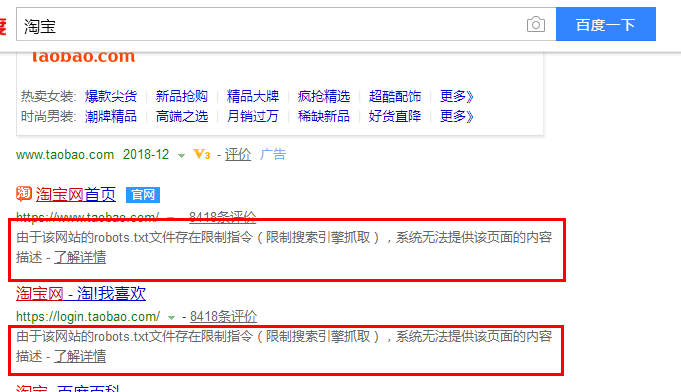

# Python Web Crawler from entry to practice

## Chapter 1 网络爬虫入门

### 1.1 Robots协议

#### 1.1.1 Rotos协议的概念

Robots协议(爬虫协议):全称是"网络爬虫排除标准(Robots Exclusion Protocol)".网站通过Robots协议告诉搜索引擎哪些页面可以抓取,哪些页面不能抓取.该协议是国际互联网界通行的道德规范,每个爬虫都应该遵守该协议.

#### 1.1.2 Robots协议例子

[淘宝网的robots规定网站](http://www.taobao.com/robots.txt)

**1.页面中的内容**

	User-agent:  Baiduspider  //百度爬虫引擎
	Allow:  /article  //表示允许访问/article.htm、/article/12345.com
	Allow:  /oshtml
	Allow:  /ershou
	Allow: /$
	Disallow:  /product/  //禁止访问/product/12345.com
	Disallow:  /  //禁止访问除Allow规定页面外的其他所有页面
	
	User-Agent:  Googlebot  //Google爬虫引擎
	Allow:  /article
	Allow:  /oshtml
	Allow:  /product  //允许访问/product.htm、/product/12345.com
	Allow:  /spu
	Allow:  /dianpu
	Allow:  /oversea
	Allow:  /list
	Allow:  /ershou
	Allow: /$
	Disallow:  /

**2.在百度搜索"淘宝"时会出现的现象**

在百度搜索"淘宝"时会出现"由于该网站的robots.txt文件存在限制指令（限制搜索引擎抓取），系统无法提供该页面的内容描述"说明百度很好的遵守了robot.txt协议.

**3.在Google搜索时出现的现象**

由于淘宝的Robots协议允许Google爬取产品页面(即Allow:/product).因此在Google中搜索"淘宝 iphone x"能搜索到淘宝中的产品.

PS:爬取网站数据时,应该遵守Robots协议.

### 1.2 Python爬虫的流程

1.获取网页

通过给一个网址发送请求,得到整个网页的数据.

	基础技术:request, urlib, selenium(模拟浏览器);
	进阶技术:多进程多线程抓取,登录抓取,突破IP封禁和服务器抓取.

2.解析网页

从得到的网页数据中提取想要的数据.

	基础技术:re正则表达式, BeautifulSoup和lxml;
	进阶技术:解决中文乱码.

3.存储数据

将提取的数据存储到csv或者数据库中.

	基础技术:存入txt文件和存入csv文件;
	进阶技术:存入Mysql数据和存入MongoDB数据库.

***

## Chapter 2 编写第一个网络爬虫

### 2.1 解析网页工具的使用

解析网页的工具的安装及import:

	安装:
		pip install bs4	//BeautifulSoup位于bs4的库中
	使用方法:
		from bs4 import BeautifulSoup

### 2.2 Anaconda+Jupyter的使用

**1.Anaconda的使用**

Anaconda集成了Python的功能,并且包含了很多用于科学计算的包(e.g.Numpy,Scipy,Pandas,Matplotlib以及用于机器学习的Scikit-Learn,BioPython等),使用起来简单,因此应用比较广.

[Anaconda的下载](https://www.anaconda.com/download/)

安装注意点:

	勾选上这两个选项(虽然第一个会显示不推荐,但是还是要选上).安装之后,需要使用的Python,pip和Jupyter
	也一并安装上了.

**2.Jupyter的使用**

当安装了Anaconda之后,Jupyter也一并被安装上了.Jupyter相当于一个编译器,可以直接在Jupyter中写代码进行执行.

Jupyter的启动:

	1.在cmd中输入:
		jupyter notebook //输入该命令即可在浏览器中启动Jupyter主界面.地址默认为:
						 //"http://localhost:8888/tree"
	2.在Jupyter中右边"New"一个新文件	,并编写相应的Python代码.
	3."Alt+Enter"为执行.

PS:在安装Anaconda时将Python3也加入到了Windows的Path变量中,且会在前面.因此输入"python"会执行Python3的应用程序,如果需要Python2和Python3同时都可以执行,可以使用下面方法:

	将Python3的python.exe改名为"python3.exe",python2的不变.
		1.执行"python",调用为python2的应用程序;
		2.执行"python3",调用为python3的应用程序.

### 2.3 编写一个简单的爬虫

#### 2.3.1 step1:获取页面

1.启动jupyter

	在cmd中输入:jupyter notebook

2.在jupyter中输入下面代码

	#!/usr/bin/python
	# -*- coding: utf-8 -*-
	
	import requests
	link = "http://www.santostang.com/"	//此处为爬取唐松的页面,是他自己写的页面,是为了避免商业纠纷
	headers = {'User-Agent' : 'Mozilla/5.0 (Windows; U; Widows NT 6.1; en-US; rv:1.9.1.6)
				Gecko/2009/12/01 Firefox/3.5.6'}	//此处使用headers伪装成浏览器访问
	
	r = reqeusts.get(link, headers = headers)	//后面直接去掉headers结果也是一样
	print (r.text)	//python3的语法

3.结果

	<!DOCTYPE html>
	<html lang="zh-CN">
	<head>
	<meta charset="UTF-8">
	<meta http-equiv="X-UA-Compatible" content="IE=edge">
	<meta name="viewport" content="width=device-width, initial-scale=1, maximum-scale=1">
	<title>唐松 Santos</title>
	<meta name="description" content="这是唐松 Santos的个人博客，《Python 网络爬虫: 从入门到实践》
	作者" />
	<meta name="keywords" content="唐松 Santos, Python, 网络爬虫, Python 网络爬虫: 从入门到实践,
	Python 爬虫, 大数据" />
	<link rel="apple-touch-icon" href="http://www.santostang.com/wp-content/themes/JieStyle-
	Two-master/images/icon_32.png">
	<link rel="apple-touch-icon" sizes="152x152" href="http://www.santostang.com/wp-content/
	themes/JieStyle-Two-master/images/icon_152.png">
	<link rel="apple-touch-icon" sizes="167x167" href="http://www.santostang.com/wp-content/
	themes/JieStyle-Two-master/images/icon_167.png">
	<link rel="apple-touch-icon" sizes="180x180" href="http://www.santostang.com/wp-content/
	themes/JieStyle-Two-master/images/icon_180.png">
	<link rel="icon" href="http://www.santostang.com/wp-content/themes/JieStyle-Two-master/
	images/icon_32.png" type="image/x-icon">
	<link rel="stylesheet" href="http://www.santostang.com/wp-content/themes/JieStyle-Two-
	master/css/bootstrap.min.css">
	<link rel="stylesheet" href="http://www.santostang.com/wp-content/themes/JieStyle-Two-
	master/css/font-awesome.min.css">

#### 2.3.2 step2:提取需要的数据

1.代码

	import requests
	from bs4 import BeautifulSoup
	
	link = "http://www.santostang.com/"
	headers = {'User-Agent' : 'Mozilla/5.0 (Windows; U; Widows NT 6.1; en-US; rv:1.9.1.6)
			Gecko/2009/12/01 Firefox/3.5.6'}	//此处使用headers伪装成浏览器访问
	r = request.get(link, headers = headers)
	
	soup = BeautifulSoup(r.text, "lxml")
	//因为r.text里面存放的是HTML代码,BeautifulSoup主要用于解析HTML代码.并将其转为soup对象.
	title = soup.find("h1", class_="post-title").a.text.strip()
	/*
	在查找标题时,使用右键->审查元素->在弹出的页面中点击左上角的鼠标键按钮->点击第一个标题,就会显示
	下图的代码
	*/
	print (title)

2.find时应该获取的信息

3.结果

	4.3 通过selenium 模拟浏览器抓取	//抓取的标题

#### 2.3.3 step3:存储数据

1.代码

	import requests
	from bs4 import BeautifulSoup
	
	link = "http://www.santostang.com/"
	headers = {'User-Agent' : 'Mozilla/5.0 (Windows; U; Widows NT 6.1; en-US; rv:1.9.1.6)
			Gecko/2009/12/01 Firefox/3.5.6'}	//此处使用headers伪装成浏览器访问
	r = request.get(link, headers = headers)
	
	soup = BeautifulSoup(r.text, "lxml")
	//因为r.text里面存放的是HTML代码,BeautifulSoup主要用于解析HTML代码.并将其转为soup对象.
	title = soup.find("h1", class_="post-title").a.text.strip()
	print (title)
	with open('title.txt', 'a+') as f:
		f.write(title)	//写入title文件.该文件保存在:C:\Users\pc-name\title.txt

***

## Chapter 3 静态网页抓取

静态网页:纯粹HTML格式的网页称为静态网页.网页中所有的数据都出现在HTML代码中.

	静态网页主要使用requests库来抓取数据.requests库的安装:
		pip install requests

动态网页:使用AJAX动态加载网页的数据.因此数据不一定全部出现在HTML代码中.

### 3.1 获取响应内容

	import requests
	r = requests.get('http://www.santostang.com/')
	print ('text coding: ', r.encoding)
	/*
		服务器内容使用的文本编码.
		此处返回:text coding:  UTF-8	--->表示使用utf-8编码
	*/
	print ('response status: ', r.status_code)
	/*
		响应的状态码.返回值为:
			200:表示请求成功;
			4xx:表示客户端错误;
			5xx:表示服务器响应错误.
	*/
	print ('text: ', r.text)	//服务器响应的内容.为一些HTML代码
	/*
		r.content:表示字节方式的响应体,会自动解码gzip和deflate编码的响应数据.--->目前用的较少
		r.json:是requests中内置的JSON编码器.--->目前用的较少
	*/

### 3.2 定制requests

### 3.2.1 传递URL参数

URL地址解析:

	http://httpbin.org/get?key1=value1	//"?"后面的为自己构建的信息.以key-value加入到URL中

实例:

	import requests
	key_dict = {'key1':'value1', 'key2':'value2'}
	r = requests.get('http://httpbin.org/get', params=key_dict)
	/*
		自己需要构建的参数可以先写成dict形式,在以params参数构建至URL中.
	*/
	print ('URL: ', r.url)	//此时的url为:http://httpbin.org/get?key1=value1&key2=value2
	print ('response:\n', r.text)
	/*
	响应信息为:
	response: 
	{
		"args": {
			"key1": "value1", 
			"key2": "value2"
		}, 
		"headers": {
			"Accept": "*/*", 
			"Accept-Encoding": "gzip, deflate", 
			"Connection": "close", 
			"Host": "httpbin.org", 
			"User-Agent": "python-requests/2.21.0"
		}, 
		"origin": "113.87.227.238", 
		"url": "http://httpbin.org/get?key1=value1&key2=value2"
	}
	*/

### 3.2.2 定制请求头

	import requests
	headers = {'User-Agent':'Mozilla/5.0 (Windows NT 6.1; WOW64) AppleWebKit/537.36 (KHTML, 
	like Gecko) Chrome/63.0.3239.132 Safari/537.36',
	           'Host':'www.santostang.com'
	          }
	/*
	headers内容的获取:
		网页->右键->审查元素->选择Network->选择网站名字->选择"Headers"->选择"Request Headers".
		挑选里面需要的信息(e.g.User-Agent,Host等)以字典的形式填充即可.
		PS:User-Agent和user-agent效果一样,可能是因为能够兼容.
	*/
	r = requests.get('http://www.santostang.com/', headers = headers)
	print ('response status: ', r.status_code)

### 3.2.3 发送POST请求

POST请求主要用于在登录的时候保护自己的密码.因为使用GET请求会将密码暴露在URL中,POST则不会.

	import requests
	key_dict = {'key1':'value1', 'key2':'value2'}
	/*
		POST请求的数据也是以key-value形式组装
	*/
	r = requests.post('http://httpbin.org/post', data = key_dict)
	/*
		POST请求使用requests的post方法.
		data为需要保护的信息.
	*/
	print (r.url)	//此时打印出来的网址为"http://httpbin.org/post".相比get少了后面的dict中信息.
	print (r.text)
	/*
	显示为:
	{
	  "args": {}, 
	  "data": "", 
	  "files": {}, 
	  "form": {
	    "key1": "value1", 	//这些信息存放在form中
	    "key2": "value2"
	  }, 
	  "headers": {
	    "Accept": "*/*", 
	    "Accept-Encoding": "gzip, deflate", 
	    "Connection": "close", 
	    "Content-Length": "23", 
	    "Content-Type": "application/x-www-form-urlencoded", 
	    "Host": "httpbin.org", 
	    "User-Agent": "python-requests/2.21.0"
	  }, 
	  "json": null, 
	  "origin": "113.87.227.238", 
	  "url": "http://httpbin.org/post"
	}
	*/

### 3.2.4 超时

超时:如果服务器在设置的timeout时间内没有应答,就会返回异常.防止程序一直等待.

	import requests
	r = requests.post('http://httpbin.org/post', timeout = 0.01)
	/*
		timeout参数:用于设置超时值,单位为s.此处为0.01s,会发生超时,出现timeout的异常.
		一般timeout默认被设置为20s.
	*/

### 3.3 爬虫实践:TOP250电影数据

	import requests
	from bs4 import BeautifulSoup
	import os
	import time
	import threading
	
	picDir = r'D:\\data\\'
	
	class Picture():
		def __init__(self, picName, picSrcUrl):
			self.picName = picName
			self.picSrcUrl = picSrcUrl
	
	def downloadPicture(pictureList):
		if not os.path.isdir(picDir):
			os.makedir(picDir)
		for index in range(len(pictureList)):
			try:
				picture = pictureList[index]
				filename = picDir + picture.picName + '.webp'
				print picture.picSrcUrl
				with open(filename, 'wb') as f:	
					f.write(requests.get(picture.picSrcUrl, timeout = 5).content)
				/*
				1.必须以'wb'打开,因为图片是二进制形式.否则下载下来的图片会形成马赛克;
				2.requests.get(url, timeout = 5).content //content里面放的就是图片的二进制编码.
					将该编码写入到文件即可得到图片.
				*/
			except:
				print picture.picSrcUrl, 'download fail'
				pass
		print 'Total time: ', time.time().__float__() - originalTime.__float__(), 's'
		/*
			time.time():得到时间值.为从格林威治时间到现在的秒数.
			time.time().__float__():转成浮点值.
			time.time().__int__():转成整数值.
		*/
	
	param = ''
	originalTime = time.time()
	listPicture = []
	while True:
		baseUrl = 'https://movie.douban.com/top250' + param
		response = requests.get(baseUrl, timeout = 5)
		response.raise_for_status()	//如果status_code非200,就会抛出异常.
		responseStr = response.text
		soup = BeautifulSoup(responseStr, 'lxml')
		/*
			以"lxml"形式解析.需要安装lxml模块:
			pip install lxml
		*/
		olArticle = soup.find('ol', class_='grid_view')	//获取ol对象
		liList = divItem = olArticle.find_all('li')	//ol下面包括很多li信息.
		for index in range(len(liList)):
			stringTitle = ''
			divItemInfo = liList[index].find('div', class_ = 'info')
			divBd = divItemInfo.find('div', class_ = 'bd')
			titleList = divItemInfo.find('div', class_ = 'hd').a.find_all('span')
			//获取影片的大致描述(导演、演员以及上映时间等)
			strDescription = divBd.p.getText()
			//影片星级
			strRatingStar = divBd.div.find_all('span')[1].getText()
			//影片评价数
			strComment = divBd.div.find_all('span')[3].getText()
			//影片总结(有的没有所以需要判空)
			if divBd.find('p', class_ = 'quote'):
				strQuote = divBd.find('p', class_ = 'quote').span.getText()
			//名字拼接
			for indexTitle in range(len(titleList)):
				stringTitle = stringTitle + titleList[indexTitle].getText()
			'''
			print 'Movie name: ' + stringTitle.encode('utf-8') \
				+ '\nMovie star: ' + strRatingStar.encode('utf-8') \
				+ '\nMovie comments: ' + strComment.encode('utf-8') \
				+ '\nMovie quote: ' + strQuote.encode('utf-8') \
				+ '\nMovie description: ' + strDescription.encode('utf-8').strip() + '\n'
			'''
			print 'Movie name: ' + stringTitle.encode('gbk', 'ignore') \
				+ '\nMovie star: ' + strRatingStar.encode('gbk', 'ignore') \
				+ '\nMovie comments: ' + strComment.encode('gbk', 'ignore') \
				+ '\nMovie quote: ' + strQuote.encode('gbk', 'ignore') \
				+ '\nMovie description: ' + strDescription.encode('gbk', 'ignore').strip() + '\n'
			/*
				windows下,中文需要:encode('gbk', 'ignore')即以gbk编码,utf-8会显示乱码.
			*/
			divItemPic = liList[index].find('div', class_ = 'pic')
			listPicture.append(Picture(divItemPic.a.img.get('alt'), divItemPic.a.img.
				get('src')))	//构建Picture对象,准备下载图片.
		print '\n'
		//获取底部分页的导航条
		divpaginator = soup.find('div', class_ = 'paginator')
		//获取下一页
		spanNext = divpaginator.find('span', class_ = 'next')
		if not spanNext.link:
			break	//到最后一页,退出循环
		//获取link的某个属性,使用get('href')
		param = spanNext.link.get('href')
	
	try:
		//所有数据内容爬取完毕,创建一个线程下载图片
		threadDownload = threading.Thread(target = downloadPicture, args = (listPicture, ))
		threadDownload.setDaemon(False)
		/*
			threadDownload.setDaemon(True):设置派生线程为守护线程,此时主线程退出派生线程也会退出.
			threadDownload.setDaemon(False):设置为False,主线程不会退出,直至派生线程执行完毕.
		*/
		threadDownload.start()	//线程启动.
	except:
		print 'Error: unable to start thread'

***

## Chapter 4 动态网页抓取

动态网页抓取的两种技术:

	1.通过浏览器审查元素解析真实网页地址;
	2.使用selenium模拟浏览器.

### 4.1 网页动态更新技术(指代AJAX技术)

AJAX(Asynchronous Javascript And XML):异步JavaScript和XML.通过在后台与服务器进行少量的数据交换就可以实现网页的异步更新(即在不重新加载整个网页的情况下对网页的某部分进行更新).

	相比于静态网页更新的技术的优势:
		1.传统的网页(即静态网页)如果需要更新必须重载整个页面,AJAX网页只需要重载某部分内容,可以减少重复
			内容的的下载;
		2.节省流量.AJAX可以使互联网应用程序更小、更快、更友好.

AJAX加载的网页爬取方法:

	1.通过浏览器审查元素解析地址;
	2.通过Selenium模拟浏览器抓取.

### 4.2 通过解析真实地址抓取(以抓取京东评论为例)

**1.打开检查功能**

百度搜索"京东"->首页中左边的"家用电器"点击->左边的"平板电视"点击"小米的4K超高清"->弹出的"小米官方旗舰店"->右击选择"审查元素"->点击"Network"->刷新页面->点击"商品评价(17万+)",如下所示:

**2.找到url及评论数据所在位置**

获取评论的位置如下图所示:

	评论数据以json文件格式获取.

**3.爬取url,获得评论.代码如下:**

	import re
	import requests
	from bs4 import BeautifulSoup
	import time
	import random
	import json
	
	votes_dir = r'D:\\repository\\data\\votes.csv'
	
	f = open(votes_dir, 'w', encoding='gbk')
	f.write('comments, reference name, nick name\n')
	/*
		f.write('comments, reference name, nick name\n'):
			1.逗号分隔会写入到不同的单元格;
			2."\n"换行会导致写入到下一行.
		"cvs文件":可以用excel打开,也可以用文本编辑器打开.
	*/
	
	url1 = 'https://sclub.jd.com/comment/productPageComments.action?callback=fetchJSON_
		comment98vv4481&productId=100000875011&score=0&sortType=5&page='
	url2 = '&pageSize=10&isShadowSku=0&fold=1'
	/*
		爬取的url为"https://sclub.jd.com/comment/productPageComments.action?callback=fetchJSON_
		comment98vv4506&productId=100000875011&score=0&sortType=5&page=
		0&pageSize=10&isShadowSku=0&fold=1":
		在url1和ur2之间存在一个page=0:标识爬取评论的哪一页,评论翻页是通过该数字标识的.
	*/
	
	def start():
	    for i in range(10):	//爬取前10页
	        t = str(time.time()).split('.')
			/*
				time.time():返回一个时间,带有多位小数(e.g.1553041841.4286044)
				time.time().split('.'):表示将返回的时间以小数点"."分隔,形成2个数字.
				t = str(time.time().split('.')):t为一个列表,t[0]=1553041841,t[1]=4286044.
			*/
	        #print(time.time())
	        final_url = url1 + str(i) + url2	//组成的url构成爬取的具体某一页.
	        time.sleep(random.random())
			/*
				random.random():返回一个随机值.
				time.sleep(random.random()):睡眠一个随机值.防止请求太快,可能出问题.
			*/
	        resp = requests.get(final_url)	//请求该url
	        data = resp.text
	
	        #print(data.encode('gbk'), 'ignore')
	
	        data = re.findall(r'{.*}', data)[0]
			/*
				re.findall(r'{.*}', data)[0]:匹配第一个"{}",返回其中的内容.
			*/
	
	        data = json.loads(data)	
			/*
				使用json.loads(data)把字符串格式的响应体数据转化为json数据.因为json格式的数据更
				容易解析.
			*/
	        #print(data)
	        comments_list = data['comments']
			/*
				data['comments']:提取comments数据,提取到的数据为一个列表.列表中元素如下:
				[{'id': 12299237085, 'topped': 0, 'guid': '96e21836-7032-4787-ba2d-b95dfd533
					bc0', 'content': '感觉还是很不错的，大小跟我大厅挺匹配的，...]
				在Pycharm中,将列表中的数据打印出来,然后拷贝到word文档中即可查看到具体的信息.
			*/
	        #print(comments_list)
	        for comment in comments_list:
	            f.write('%s, %s, %s\n' % (
	                comment['content'],
	                comment['referenceName'],
	                comment['nickname']
	            ))
			/*
				遍历列表,提取列表元素所需的评论、商品名字、昵称等信息.
			*/
	
	if __name__ == '__main__':
	    start()

### 4.3 通过Selenium模拟浏览器抓取

#### 4.3.1 Selenium环境搭建

**1.下载360极速浏览器的Chrome驱动**

	360极速浏览器使用Google的Chrome内核,Google的Chrome浏览器也可以使用相同的驱动(需要内核版本对应上)

1.查看Chrome内核版本

帮助->关于360极速浏览器.弹出的窗口如下:

	此处的内核版本为:69,Chrome驱动版本与内核版本的对应关系:
	v2.43		v69-71
	v2.42		v68-70	--->选择该个版本,其他版本应该也可以.没试过
	v2.41		v67-69
	v2.40		v66-68
	v2.39		v66-68
	v2.38		v65-67
	v2.37		v64-66
	v2.36		v63-65
	v2.35		v62-64
	v2.34		v61-63

2.下载对应Chrome内核的Chrome驱动

[下载地址](http://npm.taobao.org/mirrors/chromedriver/)

下载方法如下:

	需要选择"Chromedriver_win32.zip"这一个驱动,因为浏览器只有32-bit.无64-bit只说,但是也支持
	64-bit的OS.

3.拷贝Chrome驱动文件到python目录

	拷贝压缩文件中的"chromedriver.exe"到python的安装目录"G:\Programs (x86)\Python\Python3.7\"
	1.放在python安装的顶层目录或者Scripts目录都行--->目前试了顶层目录是ok的,Scripts目录没试过;
	2.Chrome驱动的压缩文件中只有一个"chromedriver.exe",直接拷贝该文件即可.

**2.Selenium的介绍及安装**

Selenium是一个用于Web应用程序测试的工具.Selenium测试直接运行在浏览器中,就像真正的用户在操作一样.支持IE, Firefox, Google Chrome, Safari, Opera等.

1.在cmd中安装(执行下面命令即可):

	pip install selenium

2.在Pycharm中添加

	File->Settings->Project:xxx->点击"Project Interpreter"
	1.如果在cmd中安装了,在右边的框框中就会显示有"selenium",也可以进行第2步再安装一次;
	2.如果没有,点击右边的"+",增加package.在搜索中输入"selenium",点击下面的"Install Package".安装即可.

#### 4.3.2 Selenium简单应用

在Pycharm中输入以下代码:

	from selenium.webdriver.chrome.options import Options
	//import Options:用于后面输入网址等信息
	from selenium import webdriver	//import webdriver:引入web驱动
	from selenium.webdriver.common.keys import Keys
	import time
	browser_path = r'D:\Program Files (x86)\360 browser\360Chrome\Chrome\Application
		\360chrome.exe'
	chrome_options = Options()
	chrome_options.binary_location = browser_path
	/*
		binary_location:启动的浏览器的路径.360浏览器名字需为"360chrome"(默认也即为该名字).
	*/
	
	driver = webdriver.Chrome(options = chrome_options)
	/*
		webdriver.Chrome(...):web驱动调用Chrome浏览器去启动,括号中为浏览器的路径.
		如果写成(chrome_options=chrome_options):会报"DeprecationWarning: use options instead of
			chrome_options...":是因为未来使用options取代chrome_options.因此,此处只需要将
			chrome_options改为options即可.
	*/
	driver.get('http://www.baidu.com')	//启动的浏览器访问"http://www.baidu.com"
	driver.quit()	//过一段时间后退出

#### 4.3.2 Selenium实例(抓取京东评论)

	from selenium.webdriver.chrome.options import Options
	//import Options:用于后面输入网址等信息
	from selenium import webdriver	//import webdriver:引入web驱动
	from selenium.webdriver.common.keys import Keys //用于模拟键盘操作
	from selenium.common.exceptions import NoSuchElementException
	//用于NoSuchElementException的异常
	from selenium.webdriver.support.wait import WebDriverWait //用于设置等待时间
	import time

	browser_path = r'D:\Program Files (x86)\360 browser\360Chrome\Chrome\Application
		\360chrome.exe'
	url = r'https://item.jd.com/100000875011.html' //请求的网页
	chrome_options = Options()
	chrome_options.binary_location = browser_path
	
	driver = webdriver.Chrome(options = chrome_options)
	driver.get(url)
	driver.implicitly_wait(10) //设置全局的等待时间.
	#print(driver.page_source) //driver.page_source:获得整个网页的html代码
	#comment = driver.find_element_by_css_selector('div.tab-con')
	/*
		driver.find_element_by_css_selector('div.tab-con'):通过元素的class来寻找.
		在html中显示为:

		如果要找多个元素使用:
		driver.find_elements_by_css_selector('div.tab-con')--->即element变为elements.
	*/
	click_operate = driver.find_element_by_xpath('//*[@id="detail"]/div[1]/ul/li[5]').click()
	/*
		driver.find_element_by_xpath():通过路径来寻找.
		//*[@id="detail"]/div[1]/ul/li[5]:
			//:为标准开头,必须以"//"开头
			*[@id="detail"]:寻找包含(id="detail")的所有元素(一般找唯一的元素)--->此处通过点击
				"商品评价",找到商品评价所在行,向上寻找,可找到一行代码为"
".此处即为匹配该行.
			/div1[1]/ul/li[5]:
				div[1]--->匹配
.html中第一行从1开始,而不是从0开始.
				ul--->匹配<ul>
				li[5]--->匹配<li ...>的第五行.
		click():此处表示找到"商品评价"的选项,然后点击.
		PS:此处寻找单个元素,因此用"drvier.find_element_by_xpath".
	*/
	item_list = driver.find_elements_by_xpath('//*[@id="comment-0"]/*[@class="comment-item"]')
	/*
		//*[@id="comment-0"]/*[@class="comment-item"]:
			//:标准开头,必须以"//"开头
			*[@id="comment-0"]:寻找包含(id="comment-0")的所有元素(一般找唯一的元素).匹配代码为:
				

			/*[@class="comment-item"]:在下一级目录中寻找包含(class="comment-item")的所有元素.匹配
				代码为
,因为有很多,返回的是一个list.
		PS:此处用于统计出每一页评论的数量,用于遍历.			
	*/
	#page_wrap = driver.find_element_by_xpath('//*[@id="comment-0"]/*[@class="com-table-
		footer"]/div[1]/div[1]/*[@class="ui-pager-next"]').click()
	#page_wrap = driver.find_element_by_xpath('//*[@id="comment-0"]/*[@class="com-table-
		footer"]/div[1]/div[1]/a[2]').send_keys(Keys.ENTER)
	#page_wrap = driver.find_element_by_xpath('//*[@id="comment-0"]/*[@class="com-table-
		footer"]/div[1]/div[1]/*[@class="ui-pager-next"]').send_keys(Keys.ENTER)
	/*
		('//*[@id="comment-0"]/*[@class="com-table-footer"]/div[1]/div[1]/*[@class=
			"ui-pager-next"]'):用于寻找到"下一页"的标签.
		PS:此处用click()方法不管用(应该是selenium的bug).
			使用send_keys(Keys.ENTER):即键盘敲击ENTER键,达到click相同的效果.
	*/
	
	next_xpath = '//*[@id="comment-0"]/*[@class="com-table-footer"]/div[1]/div[1]/*
		[@class="ui-pager-next"]'
	item_per_page = len(item_list)
	while True:
	    for item in range(item_per_page):
	        comment_xpath = '//*[@id="comment-0"]/div[' + str(item + 1) + ']/div[2]/p'
	        #comment = driver.find_elements_by_xpath(comment_xpath)
	        comment = WebDriverWait(driver, 30).until(lambda x: x.find_elements_by_xpath
				(comment_xpath))
			/*
				WebDriverWait(driver, timeout, poll_frequency):
					para1:返回浏览器的一个实例,即driver;
					timeout:设置的超时时间;
					poll_frequency:循环查询的间隔时间,默认为0.5s.
				WebDriverWait(...).until(lambda x: x.find_elements_by_xpath(xxx)):表示直到
					查询到xxx才结束,否则就到超时再结束.
			*/
	        comment_text = [c.text for c in comment]
			//因为comment是一个list,该list大小为1.查看类型可以:type(comment),返回为list.
	        print (comment_text[0])
	    try:
	        #next_page = driver.find_element_by_xpath(next_xpath)
	        #next_page.send_keys(Keys.ENTER)
	        WebDriverWait(driver, 10).until(lambda y: y.find_element_by_xpath(next_xpath)).
				send_keys(Keys.ENTER)
			//此处为查询到之后,就执行send_keys(Keys.ENTER)--->相当于单击.
	    except NoSuchElementException as e:	//表示捕获到NoSuchElementException异常.
	        break
	    finally:
	        print ('Succeed')
	    time.sleep(0.5)

**Selenium其他操作方法实例**

	1.clear:清除元素的内容;
	2.send_keys:模拟按键输入;
	3.click:单击元素;
	4.submit:提交表单.
	/*实例:*/
	user = driver.find_element_by_name("username")
	/*
		find_element_by_name:查找元素的name所在位置(<input name="username">).一般用于输入用户的账户.
	*/
	user.clear	//清除用户名输入框内容
	user.send_keys("1234567")	//在输入框中输入用户名(即账号)
	pwd = driver.find_element_by_name("password")
	/*
		查找密码输入框所在位置,即找到密码输入框.用于输入用户的密码.
	*/
	pwd.clear	//清除密码输入框内容
	pwd.send_keys("******")		//在密码输入框输入密码
	driver.find_element_by_id("loginBtn").click()
	/*
		find_element_by_id():通过id来查找.并单击,用于登录.
	*/

PS:Selenium还有其他的操作方法:(双击、拖拽等)暂略.

#### 4.3.3 Selenium高级操作

使用Selenium相比较于使用浏览器"检查"的方法爬取动态网页要慢.为了加快爬取速度,常用的方法如下:

	1.控制CSS的加载;
	2.控制图片文件的显示;
	3.控制JavaScript的运行.

**1.控制CSS的加载**

CSS样式文件主要是用来控制页面的外观和元素放置位置的,对内容没影响.

PS:如何控制,在Chrome没有找到方法.

**2.显示图片的加载**

限制图片的加载可以极大地提高爬取的效率.方法如下:

	prefs = {
		'profile.default_content_setting_values' : {
			'images' : 2	//为2表示限制图片加载
		}
	}
	chrome_options = Options()
	start_time = time.time()
	chrome_options.add_experimental_option('prefs', prefs)	//图片的设置
	...
	end_time = time.time()
	print (end_time.__float__() - start_time.__float__())	//计算爬取时间

**3.控制JavaScript的运行**

如果抓取的内容不是通过JavaScript动态加载得到的,可以禁止JavaScript的执行来提高抓取效率.方法如下:

	prefs = {
		'profile.default_content_setting_values' : {
			'javascript' : 2	//为2表示限制JavaScript的运行
		}
	}
	chrome_options = Options()
	start_time = time.time()
	chrome_options.add_experimental_option('prefs', prefs)	//图片的设置
	...
	end_time = time.time()
	print (end_time.__float__() - start_time.__float__())	//计算爬取时间

PS:通常图片会比JavaScript节省时间.最快的是两者都用.

### 4.4 Selenium爬虫实践---爬取深圳短租数据

	from selenium.webdriver.chrome.options import Options
	from selenium import webdriver
	from selenium.webdriver.common.keys import Keys
	from selenium.common.exceptions import NoSuchElementException
	from selenium.webdriver.support.wait import WebDriverWait
	import time
	browser_path = r'D:\Program Files (x86)\360 browser\360Chrome\Chrome\Application
		\360chrome.exe'
	url = r'https://zh.airbnb.com/s/Shenzhen----China/homes?refinement_paths%5B%5D=%
		2Fhomes&query=Shenzhen%2C%20%2C%20China&search_type=SECTION_NAVIGATION&allow_override
		%5B%5D=&s_tag=lGVxhEWt'
	chrome_options = Options()
	chrome_options.binary_location = browser_path
	driver = webdriver.Chrome(options=chrome_options)
	driver.get(url)
	driver.implicitly_wait(10)
		//设置全局的等待时间--->此处很重要,必须设置一个等待时间,因为网页需要一个响应时间.
	rent_list_path = '//*[@id="site-content"]/div/div/div[2]/div/div/div/div/section/div/div/
		div[2]/div/div/div[2]/div/div/*[@class="_14csrlku"]'
		//xpath可以在打开的审查元素中选中需要获取路径的元素->右击->选择Copy->Copy XPath即可
		// (selector也可以这样)
	rent_info_list = WebDriverWait(driver, 10).until(lambda x: x.find_elements_by_
		xpath(rent_list_path))	//使用WebDriverWait这种方式比较好,可以设置时间.防止网页响应太慢.
	rent_info_len = len(rent_info_list)
	for item in range(rent_info_len):
	    rent_xpath = '//*[@id="site-content"]/div/div/div[2]/div/div/div/div/section/div/div/
		div[2]/div/div/div[2]/div/div/div[' + str(item + 1) + ']/div/div/div/div[1]/div[1]/
		div[2]/div/div/div/a'
		//xpath可以使用网页中Copy XPath的方法拷贝
	    rent_info_list = WebDriverWait(driver, 15).until(lambda x: x.find_elements_by_
			xpath(rent_xpath))	//这种方式比普通的driver.find_elements_by_xpath好一点
	    rent_text = [c.text for c in rent_info_list]
	    #print (len(rent_info_list))
	    print (rent_text[0])

***

## Chapter 5 解析网页

### 5.1 使用正则表达式解析网页

关于正则表达式请看"python notes.md"中的描述.

### 5.2 使用BeautifulSoup解析网页

BeautifulSoup可以方便的从HTML或XML文件中提取数据.

#### 5.2.1 BeautifulSoup的安装

	pip install bs4

**BeautifuSoup的解析器**

使用解析器解析HTML代码,转成BeautifulSoup对象.

1.html.parser

Python内置标准库,执行速度适中,文档容错能力强--->经常使用.

	soup = BeautifulSoup(html_eg.text, 'html.parser')	//使用html.parser解析html代码

2.lxml

速度快,文档容错能力强--->因为解析的快,经常使用.

	soup = BeautifulSoup(html_eg.text, 'lxml')

#### 5.2.2 BeautifulSoup的实例

**1.爬取新浪网页的相关标题以及链接:**

	import requests
	from bs4 import BeautifulSoup
	url = 'https://news.sina.com.cn'
	headers = {'user-agent': 'Mozilla/5.0 (Windows NT 6.1; WOW64) AppleWebKit/537.36 (KHTML, 
		like Gecko) Chrome/69.0.3497.100 Safari/537.36'}
	r = requests.get(url, headers = headers)
	r.encoding = 'utf-8'
	/*
		网页默认使用的是"ISO-8859-1",该种方法导致中文显示乱码.
		查看请求回来的编码:
			print (r.encoding)	--->得到结果为"ISO-8859-1".
		r.encoding = 'utf-8':表示使用utf-8编码.
		PS:
			utf-8:通用编码,对中文和英文兼容性好;--->最好的编码方式
			GB2312:主要用于中文编码;
			gbk:GB2312编码的扩展,也主要用于中文编码.
	*/
	soup = BeautifulSoup(r.text, 'lxml') //使用'lxml'解析器
	#items = soup.find_all('div', class_='ct_t_01') //查找匹配

	#items = soup.find_all('h1', {'class' : 'ct_t_01'}) //使用这种明显的dict方式比较好理解
	headlines = soup.find_all('h1', {'data-client':'headline'})
	#print (headlines)
	for headline in headlines:
	    #print (headline)
		/*
		单挑信息为:
		<h1 data-client="headline"><a href="https://news.sina.com.cn/c/xl/2019-04-04/
		doc-ihvhiewr3243881.shtml" target="_blank">习近平的情怀：天地英雄气 千秋尚凛然</a></h1>
		*/
	    print (headline.a.get('href'))
		/*
			a.get('href'):获得a当中的href元素(此处为网址).如果要获得target使用a.get('target')即可.
		*/
	    print (headline.a.text)
		/*
			a.text:获得a当中的文本元素.
		*/
	'''
	//下面的使用较少
	for item in items:	//因为class为ct_t_01的有3个匹配成功.每个里面有多个h1具有文字信息.
	    #print(item)
	    titles = item.find_all('h1') //在class为ct_t_01中查找到所有的h1
	    #for title in titles:
	        #print (title.a.get('href')) //打印出href元素信息
	        #print(title.a.get('target')) //打印出target元素信息
	'''

**2.select选择器**

暂略.

### 5.3 使用lxml解析网页

暂略.

***

## Chapter 6 数据存储

### 6.1 将数据存储至TXT或CSV

#### 6.1.1 将数据存储至TXT

**1.字符串中间使用TAB键隔开**

	output = '\t'.join(['name', 'title', 'age', 'gender'])
	print(output)
	//结果为:name	title	age	gender--->中间为tab键隔开的

**2.实例**

	1.写操作
	output = '\t'.join(['name', 'title', 'age', 'gender'])
	with open(r'D:\test\test.txt', 'w') as f:
		f.write(output)		//将output信息写入到test.txt文件中
	2.读操作
	with open(r'D:\test\test.txt', 'r') as f:
		print(f.read())			//读取test.txt文件中的全部内容
		print(f.readline())		//读取test.txt文件中的第一行内容(每次读取一行)
		/*
			f.readlines()	//一次读取全部内容,返回一个list
		for line in f.readlines():	//遍历列表再输出
			print(line)
		*/

#### 6.1.2 将数据存储至CSV

CSV(Commoa-Separated Values):是逗号分隔值的文件格式,可以使用Excel打开.行用换行符分隔;列用","分隔.

**1.CSV文本实例**

一个test.csv的文件内容如下(无空格时):

	A1,B1,C1,D1		//A1,B1,C1,D1位于同一行;A1/A2/A3/A4位于同一列.且逗号之后没有空格
	A2,B2,C2,D2
	A3,B3,C3,D3
	A4,B4,C4,D4

如果逗号之后有空格,该字符在一个单元格显示时会在前面带一个空格.

	A1, B1, C1, D1
	A2,B2,C2,D2
	A3,B3,C3,D3
	A4,B4,C4,D4

显示效果如下:

**2.读取CSV文件**

	import csv	//不需要重新安装,直接import就可以使用(应该是默认自带有)
	with open(r'D:\test\test.csv', 'r', encoding='utf-8') as csvfile:
		//open后面的encoding为指定编码规则
		csv_reader = csv.reader(csvfile)
		/*
			将打开的文件以读的形式关联到csv,即将文件读出来.此处的csv_reader为一个对象.
			但是该对象可以像list一样的使用.
		*/
		//print (type(csv_reader)) --->结果为class.
		for row in csv_reader:	//list中每一个元素为一行
			print (row)	//打印出一整行的元素
			print (row[0])	//打印每行的第一个元素

**3.写入CSV文件**

	import csv
	output_list = ['1', '2', '3', ''4]
	with open(r'D:\test\test1.csv', 'a+', encoding='utf-8', newline='') as csvfile:
		//此处的newline='':表示下一行为空,去掉该参数会导致每次执行两行数字之间有一行空行.
		w = csv.writer(csvfile)
		//将打开的文件以写的形式关联到csv,即往文件中写入数据.此处的w为类的对象
		w.writerow(output_list)	//调用w的writerow()方法写入一行数据.

PS:写入的数据是右对齐的.

### 6.2 将数据存储至MySQL数据库

MySQL是一种关系型数据库管理系统(关系型数据库将数据保存在不同的表中),使用SQL语言.

	比如存储A先生的个人信息(性别、年龄等)和购买记录,关系型数据库处理方法:
		1.将个人信息放在"用户"表中;
		2.购买记录放在"购买记录"表中;
		3.两张表使用A先生的用户id作为关键字(primary key)关联起来.

MySQL关系型数据库体积小、速度快且免费,在网络爬虫的数据存储中作为常用的数据库.

