# RDMA Learning

# 1. RDMA概述

## 1.1 DMA

DMA全称为Direct Memory Access,即直接内存访问.意思是外设对内存的读写过程可以不用CPU参与而直接进行.

### 1.1.1 无DMA时的数据搬移

假设I/O设备为一个普通网卡,为了从内存拿到需要发送的数据,然后组装数据包发送到物理链路上,整个过程如下:

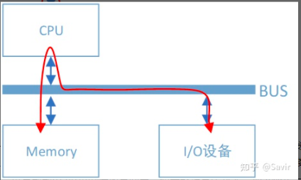

```
1.网卡通过总线告知CPU自己的数据请求;
2.CPU将内存缓冲区中的数据复制到自己内部的寄存器中,再写入到I/O设备的存储空间中.
PS:如果数据量比较大,那么很长一段时间内CPU都会忙于搬移数据,而无法投入到其他工作中去.而CPU的最主要工作是计算,而不是进行数据复制,
	这种工作属于白白浪费了CPU的计算能力.
```

### 1.1.2 有DMA时的数据搬移

总线上挂了一个DMA控制器,是专门用来读写内存的设备.有了它以后,当我们的网卡想要从内存中拷贝数据时,除了一些必要的控制命令外,整个数据复制过程都是由DMA控制器完成的,整个过程如下:

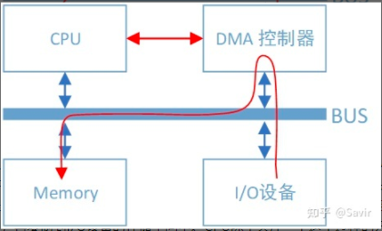


```
1.DMA控制器发起读写操作将内存中的数据通过总线复制到DMA控制器内部的寄存器中,再复制到I/O设备的存储空间中;
2.CPU除了关注一下这个过程的开始和结束以外,其他时间可以去做其他事情;
3.DMA控制器一般是放在I/O设备内部(属于I/O设备的一部分),也就是说一块网卡中既有负责数据收发的模块,也有DMA模块.
```

## 1.2 RDMA

RDMA(Remote Direct Memory Access)远程直接内存访问.通过RDMA,本端节点可以“直接”访问远端节点的内存.所谓直接,指的是可以像访问本地内存一样,绕过传统以太网复杂的TCP/IP网络协议栈读写远端内存,而这个过程对端是不感知的,而且这个读写过程的大部分工作是由硬件而不是软件完成的.

### 1.2.1 传统网络

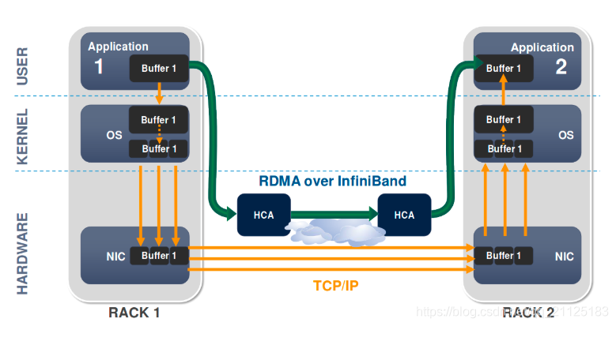

#### 1.2.1.1 传统网络的传输流程

传统网络中通过节点A给节点B发消息,实际上做的是“把节点A内存中的一段数据,通过网络链路搬移到节点B的内存中”.这一过程无论是发端还是收段,都需要CPU的指挥和控制(包括网卡的控制、中断的处理、报文的封装和解析等等).整个过程如下: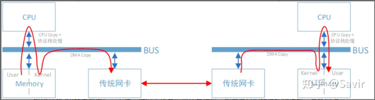

```
1.发送端(TX):
	1.用户空间到内核空间的拷贝:
		左边的节点在内存用户空间中的数据,需要经过CPU拷贝到内核空间的缓冲区中,然后才可以被网卡访问.这期间数据会经过软件实现的
		TCP/IP协议栈,加上各层头部和校验码,比如TCP头、IP头等;
	2.DMA拷贝
		网卡通过DMA拷贝内核中的数据到网卡内部的缓冲区中,进行处理后通过物理链路发送给对端.
2.接收端(RX)--->执行与TX相反的动作:
	1.DMA拷贝:
		从网卡内部存储空间,将数据通过DMA拷贝到内核空间的缓冲区中;
	2.内核空间到用户空间的拷贝:
		CPU会通过TCP/IP协议栈对内核空间的数据进行解析,将数据提取出来并拷贝到用户空间中.
PS:整个过程对CPU有较强的依赖.
```

#### 1.2.1.2 存在的问题

```
1.传输需要进行多次内存拷贝(e.g. application->OS->NIC的数据搬运),延迟会大幅增加;
2.中断处理需要CPU参与,极为影响性能;
3.内核协议栈是软件操作,性能低下,且大幅占用CPU.
```

#### 1.2.1.3 内核协议栈

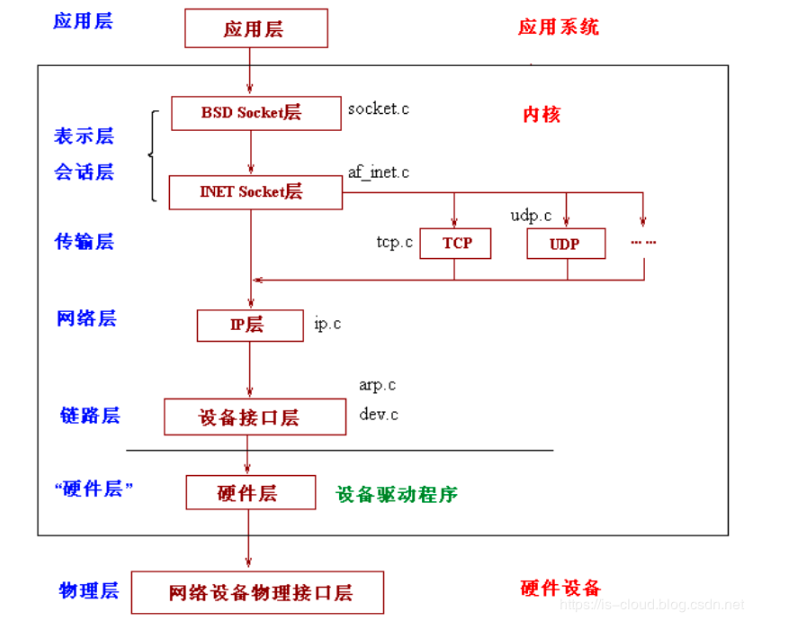

#### 1.2.1.4 CPU消耗分布

在传统的网络传输中,数据拷贝和协议栈(TCP/IP stack)的处理消耗了大量的CPU时间和资源.

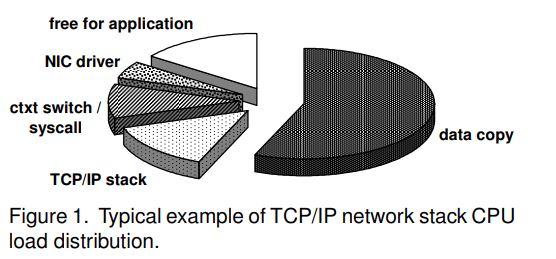

### 1.2.2 RDMA

#### 1.2.2.1 RDMA传输流程

RDMA的整个过程如下:

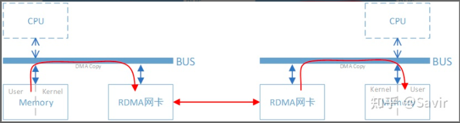

```
1.发送端(TX):
	本端的RDMA网卡直接从内存的用户空间DMA拷贝数据到RDMA网卡内部存储空间,然后硬件进行各层报文的组装后,通过物理链路发送到对端网卡;
2.接收端(RX):
	对端的RDMA网卡收到报文后,剥离各层报文头和校验码,通过DMA将数据直接拷贝到用户空间内存中.
PS:使用了RDMA技术时,两端的CPU几乎不用参与数据传输过程(只参与控制面).
```

#### 1.2.2.2 Traditional TCP DMA v.s RDMA

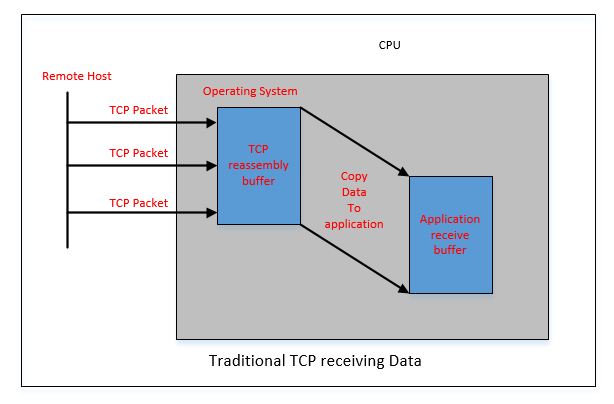

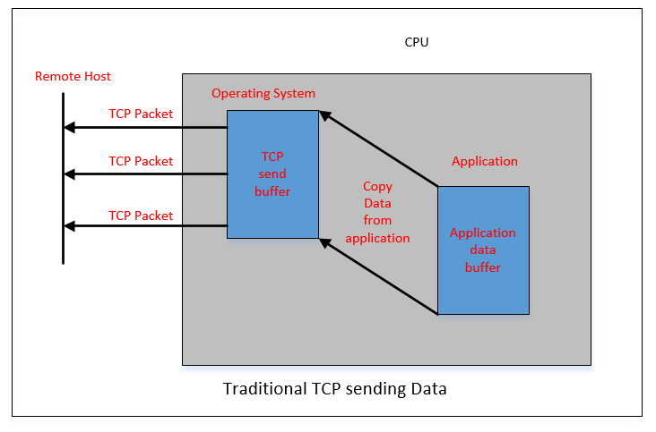

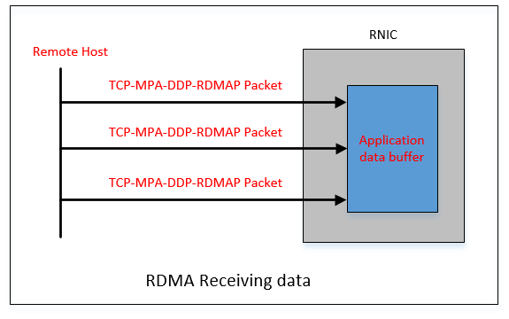


## 1.3 RDMA的优势

RDMA主要应用在高性能计算(HPC)领域和大型数据中心,设备相对普通以太网卡要昂贵不少(e.g. Mellanox公司的Connext-X 5 100Gb PCIe网卡市价在4000元以上).由于使用场景和价格的原因,RDMA与普通开发者和消费者的距离较远,目前主要是一些大型互联网企业在部署和使用.

RDMA的优势主要有以下几个:

### 1.3.1 零拷贝

零拷贝指的是不需要在用户空间和内核空间中来回复制数据.

```
1.传统的socket通信需要CPU多次将数据在用户空间和内核空间中拷贝;
2.RDMA的硬件可以直接访问已经注册的用户空间内存.
```

### 1.3.2 kernel bypass

kernel bypass指的是IO(数据)流程可以绕过内核,即在用户层就可以把数据准备好并通知硬件准备发送和接收.避免了系统调用和上下文切换的开销.

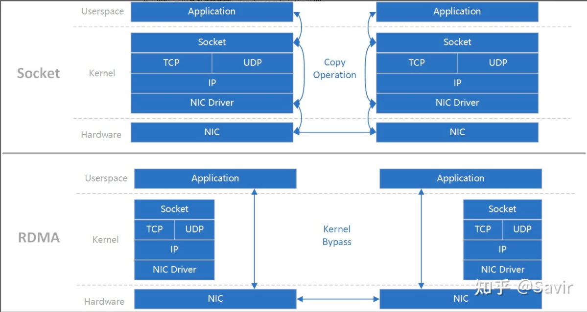

```
1.传统网络(基于Socket):需要3次拷贝操作:
	1.用户层到内核层的socket拷贝;
	2.内核层的协议栈操作;
	3.网卡通过DMA拷贝将内核中的数据搬移到网卡内部的缓冲区中.
2.RDMA的kernel bypass:
	RDMA的硬件可以直接访问已经注册的用户空间内存,将数据拷贝到RDMA网卡内部存储空间.
```

### 1.3.3 CPU offload(CPU卸载)

指的是可以在CPU不参与通信的情况下(当然要持有访问远端某段内存的“钥匙”才行)对内存进行读写.实际上一般是指把报文封装和解析放到硬件中做.

```
1.传统的以太网通信,双方CPU都必须参与各层报文的解析.
	如果数据量大且交互频繁,对CPU来讲将是一笔不小的开销,而这些被占用的CPU计算资源本可以做一些更有价值的工作.
2.RDMA将报文解析和封装都放到硬件中去做,对CPU进行卸载.
```

PS:通信领域提的最多的性能指标是:带宽和时延.

```
带宽:单位时间内能够传输的数据量;
时延:数据从本端发出到被对端接收所耗费的时间.
RDMA具有高带宽、低时延的特性.
```

## 1.4 RDMA协议

RDMA本身指的是一种技术,具体协议层面包含:Infiniband(IB), RDMA over Converged Ethernet(RoCE)和Internet Wide Area RDMA Protocol(iWARP).三种协议都符合RDMA标准,使用相同的上层接口.

### 1.4.1 RDMA 三种不同的硬件实现

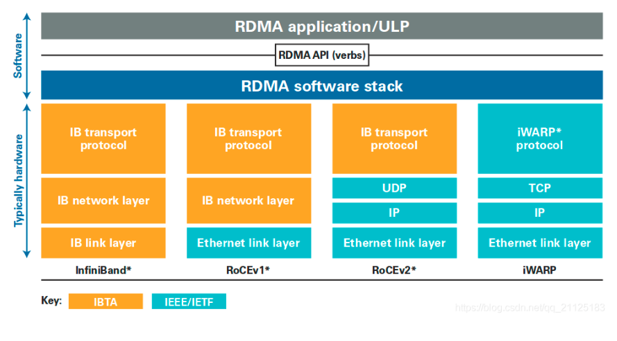

#### 1.4.1.1 TCP数据包格式

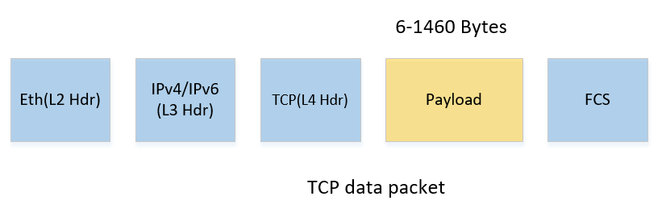

#### 1.4.1.2 IB协议

InfiniBand(IB):2000年由IBTA(InfiniBand Trade Association)提出的.从一开始就支持RDMA的新一代网络协议.这是一种新的网络技术,需要使用支持该技术的网卡和交换机.因此限制了其应用.

```
IB协议不兼容现有的以太网.
```

IB数据包格式如下:

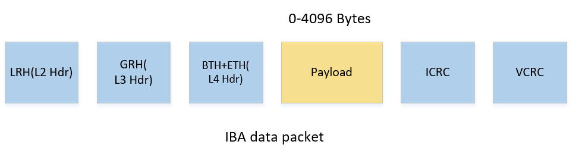

#### 1.2.4.3 RoCE协议

RDMA(RDMA Over Converged Ethernet,过融合以太网RoCE):允许通过以太网执行RDMA的网络协议.

```
1.基于UDP;
2.RoCE是在原有IB协议的基础上,将link层的LRH修改为以太网的MAC头,将VCRC修改为FCS,其他报文格式保持原有格式;
3.报文也完全遵循IB协议定义的方式进行解析处理;
4.接收报文时,通过EtherType的值来区分报文是传统以太网报文还是RoCE报文,RoCE的EtherType固定为:0x8915.
```

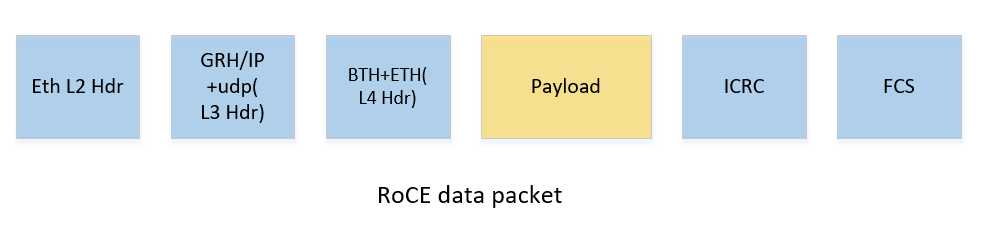

#### 1.2.4.4 RoCE v2协议

尽管RoCE已经将LRH修改为MAC向以太网兼容,但是其网络层仍然是IB的GRH,限制其只能在小网内使用.RoCE v2进行了以下更新:

```
1.将L3(GRH)修改为IP(v4/v6)+UDP,从而达到在子网间通信的目的.传输层仍然保持不变;
2.RoCE v2的升级,可以直接兼容传统以太网交换设备.所以现在在企业中应用比较多,但是相同场景下相比IB性能要有一些损失.
```

#### 1.2.4.5 iWARP协议

iWARP(RDMA over TCP互联网广域RDMA协议):允许通过TCP执行RDMA的网络协议,因此是面向连接的可靠协议.这允许在标准以太网基础架构(交换机)上使用RDMA,网卡要求是支持iWARP(如果使用CPU offload的话)的NIC.否则,所有iWARP栈都在软件中实现,但是失去了RDMA性能优势.

```
1.基于TCP;
2.iWARP在面对有损网络场景(e.g.网络环境中可能经常出现丢包)时相比于RoCE v2和IB具有更好的可靠性,在大规模组网时也有明显的优势;
3.由于基于TCP,大量的TCP连接会耗费很多的内存资源,另外TCP复杂的流控等机制会导致性能问题,所以从性能上看iWARP要比UDP的RoCE v2
	和IB差.
```

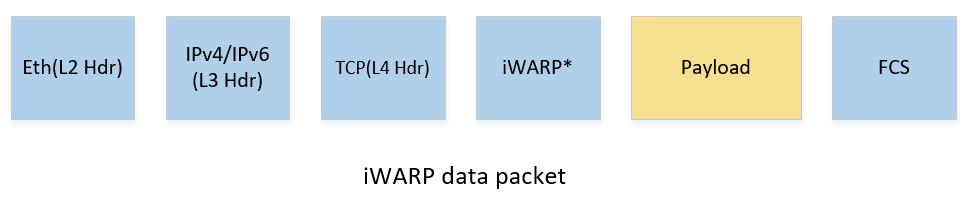

#### 1.2.4.6 RoCE的演进

RoCE的演进归纳为:

```
1.IB(IB网络)--->基于UDP演进--->RoCE(覆盖以太网子网(switch))--->RoCE V2(整个以太网(router));
2.IB(IB网络)--->基于TCP演进--->iWARP(PS:iWARP并不是由Infiniband直接发展而来,而是继承了一些Infiniband设计思想).
```

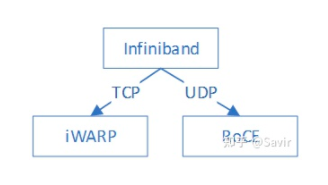

## 1.5 标准组织

### 1.5.1 IBTA

成立于1999年,负责制定和维护Infiniband协议标准.IBTA独立于各个厂商,通过赞助技术活动和推动资源共享来将整个行业整合在一起,并且通过线上交流、营销和线下活动等方式积极推广IB和RoCE.

```
IBTA的主要成员:博通,HPE,IBM,英特尔,Mellanox和微软等,华为也是IBTA的会员.
```

### 1.5.2 OFA

成立于2004年的非盈利组织,负责开发、测试、认证、支持和分发独立于厂商的开源跨平台infiniband协议栈,2010年开始支持RoCE.负责开发维护RDMA/Kernel bypass应用的OFED(OpenFabrics Enterprise Distribution)软件栈,保证其与主流软硬件的兼容性和易用性.OFED软件栈包括驱动、内核、中间件和API等.

### 1.5.3 IBTA和OFA的关系

```
1.IBTA主要负责开发、维护和增强Infiniband协议标准;
2.OFA负责开发和维护Infiniband协议和上层应用API.
```

## 1.6 开发社区

### 1.6.1 linux社区

开发维护linux内核的RDMA子系统(即RDMA驱动).

```
RDMA驱动代码位于: drivers/infiniband/目录下.
```

### 1.6.2 RDMA社区

RDMA社区特指用户态社区.对于上层用户(即应用程序),IB提供了一套与Socket套接字类似的接口---libibverbs.


### 1.6.3 UCX

UCX是一个建立在RDMA等技术之上的用于数据处理和高性能计算的通信框架,RDMA是其底层核心之一.

```
UCX可以将其理解为是位于应用和RDMA API之间的中间件,向上层用户又封装了一层更易开发的接口.
```

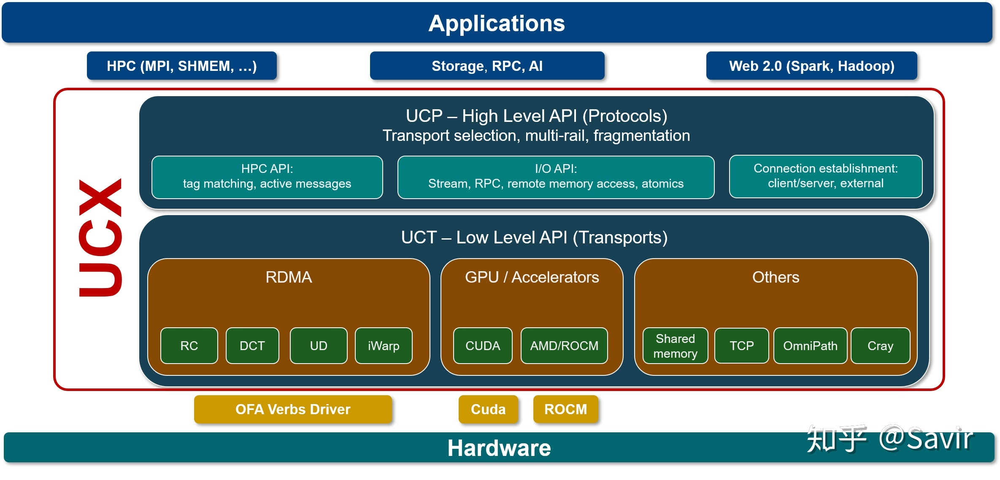

## 1.7 硬件厂商

### 1.7.1 Mellanox

IB领域的领头羊,协议标准制定、软硬件开发和生态建设都能看到Mellanox的身影,其在社区和标准制定上拥有最大的话语权.目前最新一代的网卡是支持200Gb/s的ConnextX-6系列.

### 1.7.2 华为

鲲鹏920芯片已经支持100Gb/s的RoCE协议,技术上在国内处于领先地位.但是距离Mellanox还有比较长的路要走.

# 2. IB(Infiniband)

## 2.1 IB简介

IBTA(Infiniband贸易协会)成立于1999年,负责指定和维护Infiniband标准.

IB的目的:

```
1.实现CPU和I/O之间的互联通道;
2.超高的性能
	1)高带宽:扩展空间大;
	2)低延迟:低于1us(ns级别)的应用延迟,集群中跨节点应用程序间的快速响应;
	3)低CPU占用及RDMA(远程直接内存访问):打破传统以太网需要CPU和OS介入通讯.
3.提高应用程序性能;
4.高可靠的子网管理器.
```

Infiniband是一个为大规模、易扩展而设计的网络技术.

## 2.2 IB网络结构

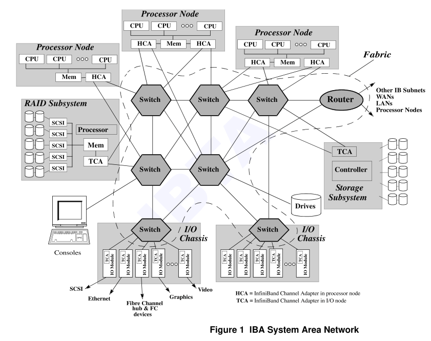

IB网络结构包含以下组件:

```
1.HCA(host channel adapter)
2.TCA(target channel adapter)
3.Swtich
4.Router
5.子网管理组件
PS:HCA和TCA必须有一个
```

## 2.3 verbs

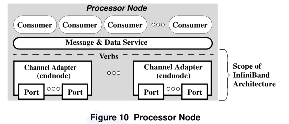

verbs用于实现硬件与OS之间交互的接口,功能类似于API.OS通过调用相应的verbs实现表项的建立与注销(create/modify/destroy)或者任务的下发(post send/receive)或者对数据的轮询(poll for completion)等.

## 2.4 一些基本概念

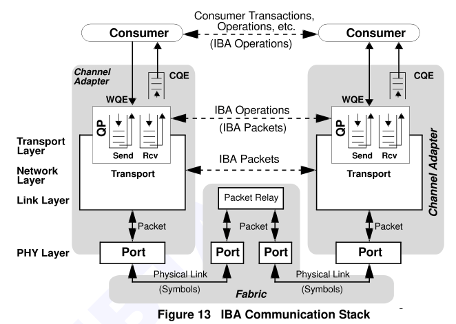

### 2.4.1 WR

WR(work request):请求任务,用户下发的操作任务,实体为WQE(work queue element, 发音为wookie).

```
WQE包含的内容为:具体的操作类型,地址向量,SGL(scatter-gather list)等信息.
```

### 2.4.2 QP

QP(queue pair):RoCE的基本通信单元,QP特点:

```
1.包含send queue(SQ, 发送队列)和receive queue(RQ, 接收队列).两个队列均为FIFO结构,每个队列都存储了多个WQE;
2.QP之间互相独立,互不影响.
```

QP中存在两个特殊的QP:

```
QP0:用于地址交换(RoCE基于以太网,不支持QP0),通信对象为switch或节点内的通信管理器;
QP1:用于正式通信前建立连接(CM)的报文交换,传输报文为UD类型,payload为MAD报文,主要包含通信时的QPC交互信息.
```

### 2.4.3 QPC

QPC(QP context):QP的上下文,一种数据结构.

```
包含QP的一些基本属性、服务类型、状态、地址向量、队列参数等信息.
```

### 2.4.4 CQE

CQE(completion queue entry, 发音为cookie):用于记录WQE的完成信息.

```
包括WQE的完成状态、消息长度、WQE的指针等.
```

### 2.4.5 CQ

CQ(completion queue):用于存储CQE,为FIFO结构.

```
使用时每个SQ/RQ都需要且只能关联到一个CQ,多个work queue可以共享同一个CQ.
```

### 2.4.6 CQC

CQC(completion queue context):CQ上下文,一种数据结构.

```
包括当前CQ的状态、队列使用情况等信息.
```

### 2.4.7 SRQ

SRQ(shared receive queue):共享的RQ队列.

```
1.为了节省receive queue资源,将多个QP的RQ进行共享使用,内部存储的是receive WQE,每个Q使用时申请WQE;
2.link结构,同样有SRQC与之对应.
```

### 2.4.8 MR

MR(memory region):用于地址转换.

```
1.包含memory的访问属性,VA->PA的转换信息;
2.一个MR对应一个L_KEY,也有可能会有一个R_KEY(取决于是否需要远程访问);
3.L_KEY包含index和key两个部分,index用于索引MR,key作为密钥用于MR内的key匹配;
4.R_KEY的功能与L_KEY类似,主要用于RDMA的远程访问.
```

### 2.4.9 CE

CE(completion event):完成事件,用于实现CQE的汇聚上报.

```
1.用于通过CE轮询CQ,进而获取CQE;
2.每个CQ可以绑定到一个CE的ID,然后通过设置CQE的聚合参数来上报CE给用户.
```

### 2.4.10 AE

AE(asynchronous event):异步事件.

```
用于上报硬件相关的异常和特殊状态.
```

# 3. IB协议层次结构

## 3.1 IB协议层次结构

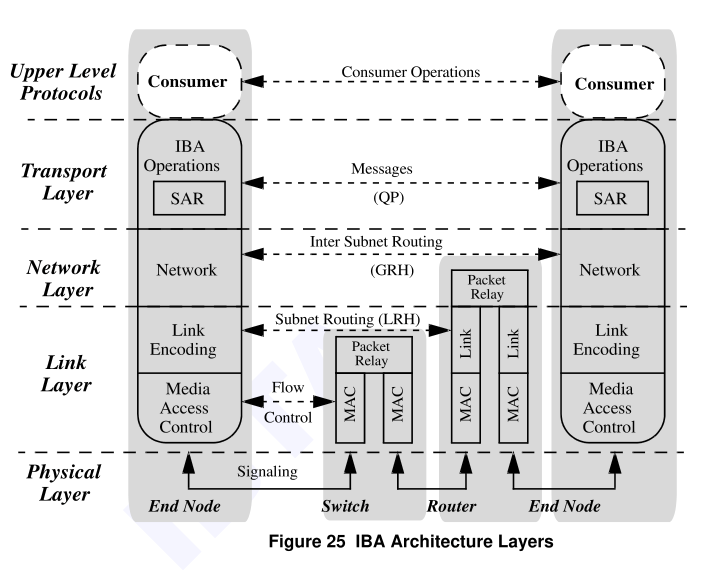

IB协议共包含5个层次:

```
1.ULP:upper level protocols,由软件实现.
2.传输层:transport layer,从传输层开始的层次均由硬件实现.ULP与传输层通过verbs进行交互.
3.网络层:network layer
4.链路层:link layer
5.物理层:physical layer
```

# 4. IB基本操作类型

IB包含4种基本操作类型---send, rdma write, rdma read, atomic.

## 4.1 send

send:将本地buffer里的数据(payload)传给对面分配的buffer内,server端所分配的buffer在client是看不到的.

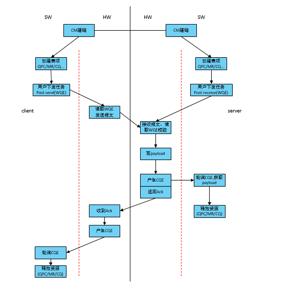

## 4.2 RDMA write

rdma write:将本地buffer的payload通过与对端协商过来的地址,写入对端相对应的存储空间.其中client端可以知道server端对应的地址信息.

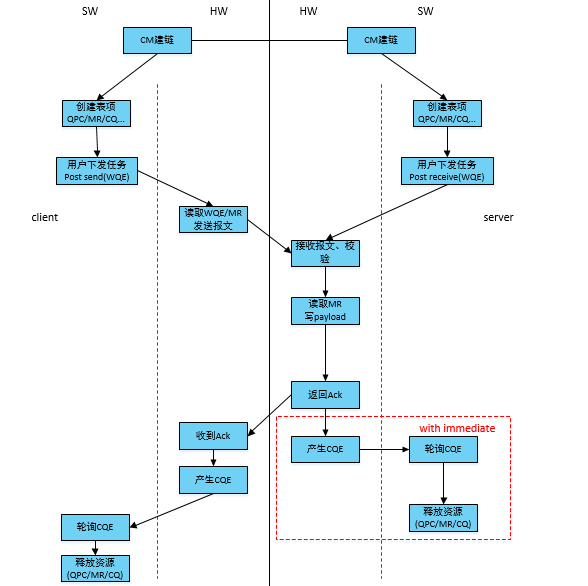

## 4.3 RDMA read

rdma read:client端将server端的数据读入本地的buffer内的一种操作.client可以知道需要读取的数据在server端的va信息.

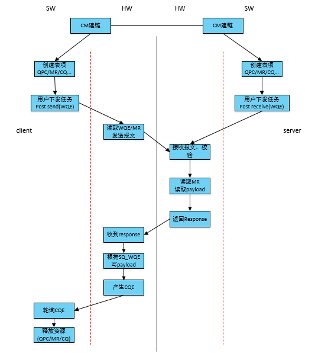

## 4.4 atomic

atomic:类似于read和write操作的结合.

```
1.client同样通过已知的server侧地址,将server端buffer内的数据读出来;
2.将读取到的数据与client侧发过来的数据进行逻辑运算后写回到server侧相同的地址；
3.server侧将内存中的原始数据返回给client,server侧的执行顺序是先读后写.
```

## 4.5 四种操作总结

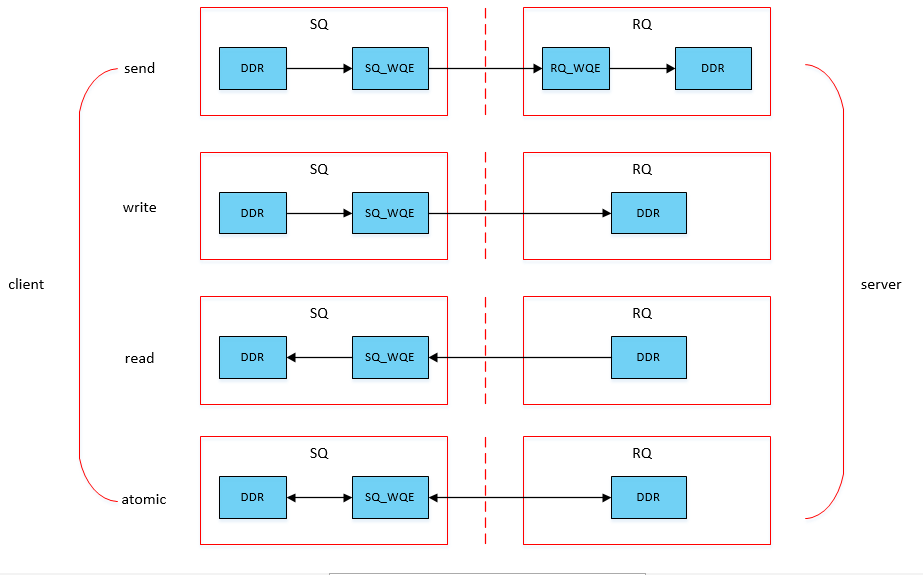

## 4.6 建链

在上述所有的操作类型中,在通信之前,均需要对QPC表项进行同步初始化,该过程称为建链过程.RoCE建链方式有两种:socket和CM(communication management).

```
1.socket建链:通过socket方式建链,即通过传统数据流进行协商通信;
2.CM建链:通过RoCE自带的UD类型报文进行协商.
PS:两种建链方式都是在软件层进行协商的,需要通过特定的协议栈解析.
```
