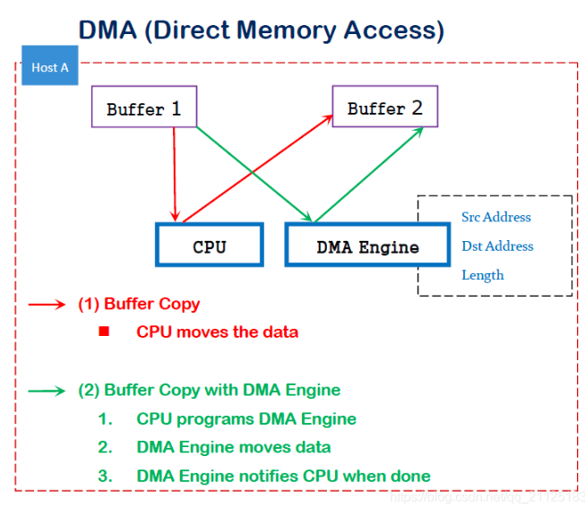
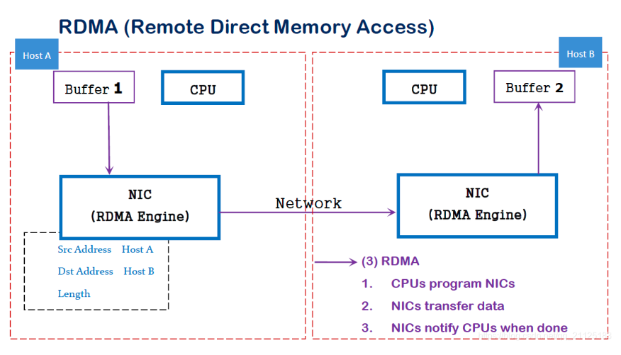

# RDMA Learning

# 1. RDMA简介

## 1.1 传统的数据传输


### 1.1.1 传统的数据传输存在的问题:

```
1.传输需要进行多次内存拷贝(e.g. application->OS->NIC的数据搬运),延迟会大幅增加;
2.中断处理需要CPU参与,极为影响性能;
3.内核协议栈是软件操作,性能低下,且大幅占用CPU.
```

### 1.1.2 内核协议栈


### 1.1.3 CPU消耗分布

在传统的网络传输中,数据拷贝和协议栈(TCP/IP stack)的处理消耗了大量的CPU时间和资源.


## 1.2 RDMA

### 1.2.1 DMA

DMA(Direct memory access,直接内存访问)是一种能力,允许设备与内存之间直接进行数据搬运,而不需要CPU参与.



```
1.传统模式:通过CPU进行数据copy来移动数据(e.g. CPU将内存中的数据从Buffer1移动到Buffer2中);
2.DMA模式:DMA Engine通过硬件将数据从Buffer1移动到Buffer2,而不需要CPU的参与,大大降低了CPU Copy的开销.
```

### 1.2.2 RDMA

RDMA(Remote direct memory access,远程直接访问内存).利用RDMA技术通过网络将数据直接传入另一台服务器(设备)的某一块内存区域,这种方法几乎不需要消耗本地和对端服务器的CPU资源.



在实现上,RDMA实际上是一种智能网卡与软件架构充分优化的远端内存直接高速访问技术.将RDMA协议固化于硬件(即网卡)上,以及支持Zero-copy和Kernel bypass这两种途径来达到高性能的远程直接数据存取的目标.

### 1.2.6 Traditional TCP DMA v.s RDMA


### 1.2.5 RoCE(RDMA Over Converged Ethernet)

由于当前网络还是以以太网为主,为了实现IB向以太网的兼容,产生了融合以太网的RoCE.RoCE是在原有IB协议的基础上,将link层的LRH修改为以太网的MAC头,将VCRC修改为FCS,其他不变.

增加一个图.

```
1.报文按照IB协议进行解析;
2.接收报文时,通过EtherType的值区分报文是传统以太网还是RoCE报文(RoCE报文的EtherType固定为0x8915).
```

### 1.2.6 RoCE V2

尽管RoCE已经将link层的LRH修改为MAC向以太网兼容,但是其网络层仍然是IB的GRH,这样只能在小网内使用,限制了其进一步的网络部署.为了让RoCE能在更大的网络中使用,IBTA将RoCE进一步升级,将L3(GRH)修改为IP(IPv4+IPv6)+UDP,从而达到在子网间通信的目的.但是传输层的处理保持不变.

因此,RoCE的演进过程为:

```
IB(IB网络)--->RoCE(以太网子网(switch))--->RoCE V2(整个以太网(router))
```

# 2. IB(Infiniband)简介

