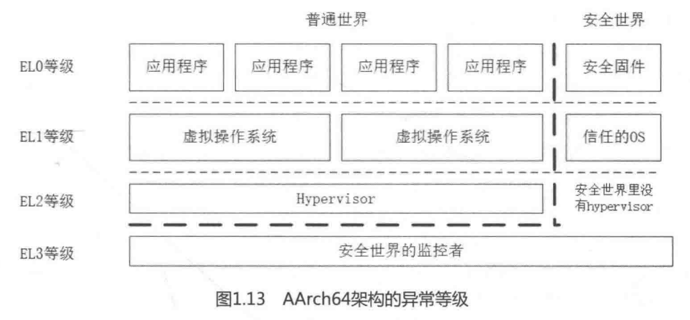

# Run Linux Kernel

***

# Chapter 1 处理器体系结构

1.ARMv4指令集的处理器架构有ARM7-TDMI,典型的处理器有三星的S3C44B0X;

2.ARMv4T指令集的处理器架构有ARM920T,典型的处理器有三星的S3C2440;

3.ARMv5指令集的处理器架构有ARM926EJ-S,典型的处理器有NXP的i.MX2 Series;

4.ARMv6指令集的处理器架构有ARM11 MPCore.

5.ARMv7指令集处理器系列以Cortex命名,分为A、R、M系列:

	A系列针对大型嵌入式系统(e.g.手机);
	R系列针对实时性系统;
	M系列针对单片机市场.
	ARMv7支持虚拟化和安全特性(TrustZone),透过LPAE(Large Physical Address Extensions)技术支持40-bit
	的物理地址空间,但是32-bit的处理器最高仅支持4GB虚拟地址空间.因此才出现了ARMv8 64-bit处理器.

6.ARMv8-A指令集: 

	1.支持64 bit指令集,并且向前兼容ARMv7-A指令集
	2.定义AArch64和AArch32两套运行环境来分别运行64位和32位指令集,软件可动态切换运行环境;
	3.AArch64也称为ARM64; AArch32也称为ARM32.

## 1.1 精简指令集RISC和复杂指令集CISC的区别

	在实际使用中,20%的简单指令被经常用到,占程序总指令数的80%;而指令集里其余80%的复杂指令很少被用到,
	只占程序总指令数的20%.将指令集和处理器进行重新设计,只保留常用的简单指令.而简单指令大部分时间能在
	一个cycle内完成,基于这种思想的指令集叫做RISC(Reduced Instruction Set Computer)指令集.以前的
	指令集叫做CISC(Complex Instruction Set Computer)指令集.

## 1.2 大小端字节序

大端模式:数据的高字节存放在内存的低地址中;低字节存放在内存的高地址中.

	00000430: 1234 5678 0100 1800 53ef 0100 0100 0000
	00000440: c7b6 1100 0000 3400 0000 0000 0100 ffff
	大端模式下,前32位数据读法:0x12345678

小端模式:数据的高字节存放在内存的高地址中;低字节存放在内存的低地址中.

	00000430: 7856 3412 0100 1800 53ef 0100 0100 0000
	00000440: c7b6 1100 0000 3400 0000 0000 0100 ffff
	小端模式下,前32位数据读法:0x12345678

**判断CPU对内存采用大端模式还是小端模式:**

	int checkCPU(void)
	{
		union w
		{
			int a;
			char b;
		}c;
		c.a = 1;
		return (c.b == 1);
		/*
			1.union共用一个存储空间.此处a和b共用一个4 byte的内存空间;
			2.union的存放顺序是所有成员都是从低地址开始存放的,访问也是从低地址开始.此处判断c.b == 1:
			1)如果为大端模式,此时的"c.a=1"属于低字节会存放在高地址.c.b访问低地址得到的数据为0,返回false.
			2)如果为小端模式,此时的"c.a=1"属于低字节会存放在低地址.c.a访问低地址得到的数据为1,返回true.
		*/
	}

计算机系统中,每个地址单元都对应一个字节(即一个地址存放一个字节).

	ARM默认采用的是小端模式,但是Cortex-A系列可以通过软件来配置大小端模式.

## 1.3 	x86和ARM的一条存储读写指令执行的全过程分解

**1.全过程步骤分解**

	1.指令首先进入流水线(pipeline)的前端(front-end),包括预取(fetch)和译码(decode),经过分发(dispatch)
		和调度(scheduler)后进入执行单元,最后提交执行结果;
	2.所有指令采用顺序方式(In-Order)通过前端,并采用乱序的方式(Out-of-Order, OOO)进行发射,然后乱序执行,
		最后用顺序方式提交结果,并将最终结果更新到LSQ(Load-Store Queue)部件;
	3.LSQ部件是执行流水线的一个执行部件,可以理解为存储子系统的最高层,其上接收来自CPU的存储器指令,其下连接
		着存储器子系统.主要功能是将来自CPU的存储器请求发送到存储器子系统,并处理其下存储器子系统的应答数据
		和消息.

**2.x86微处理器架构框图**

详细过程如下:

	1.存储指令从L1 I-Cache中读取指令,L1 I-cache做指令加载、指令预取、指令解码器,以及分支预测;
	2.然后进入Fetch & Decode单元,将指令解码成macro-ops微操作指令,然后由Dispatch部件分发到Integer Unit
		或FloatPoint Unit;
	3.Integer Unit由Integer Scheduler和Execution Unit组成,Execution Unit包含算法逻辑单元
		(arithmetic-logic unit, ALU)和地址生成单元(address generation unit, AGU),在ALU计算完成后
		进入AGU,计算有效地址后,将结果发送到LSQ部件;
	4.LSQ部件根据处理器系统要求的内存一致性(memory consistency)模型确定访问时序,另外LSQ还需要处理存储器
		指令间的依赖关系,最后LSQ需要准备L1 Cache使用的地址,包括有效地址的计算和虚实地址转换,将地址发送到
		L1 D-Cache中.

**3.ARM微处理器架构框图**

详细过程如下:

	1.存储指令首先通过主存或者L2 Cache加载到L1 I-cache中;
	2.在指令预取阶段(instruction prefetch stage),主要是做指令预取和分支预测,然后指令通过Instruction
		Queue队列被送到解码器进行指令的解码(解码器(decode)支持两路解码,可以通过解码两条指令);
	3.在寄存器重命名阶段(Register rename stage)会做寄存器重命名,避免机器指令不必要的顺序化操作,提高处
		理器的指令集并行能力;
	4.在指令分发阶段(Dispatch stage),该图支持4路猜测发射和乱序执行(Out-of-Order Multi-Issue with
		Speculation),然后在执行单元(ALU/MUL/FPU/NEON)中乱序执行;
	5.存储指令会计算有效地址并发射到内存系统中的LSU部件(Load Store Unit),最终LSU部件会去访问L1 D-cache.
	PS:在ARM中,只有cacheable的内存地址才需要访问cache.

**4.多处理器环境要求**

在多处理器环境下,需要考虑cache的一致性问题.

	在Cortex-A9中的L1和L2 cache的一致性由MESI协议来实现.

## 1.3 指令的执行过程相关概念

**1.五级流水线**

	取指(IF)、译码(ID)、执行(EX)、数据内存访问(MEM)和写回(WB).

**2.超标量体系结构(Superscalar Architecture)**

	描述一种微处理器设计理念,能够在一个时钟周期内执行多条指令.

**3.乱序执行(Out-of-Order Execution)**

	CPU采用了允许将多条指令不按程序规定的顺序分开发送给各相应电路单元处理,避免处理器在计算对象不可获取时的
	等待,从而导致流水线停顿.

**4.寄存器重命名(Register Rename)**

	用来避免机器指令或微操作的不必要的顺序化执行,提高处理器的指令集并行能力.思路:当一条指令写一个结果寄存器
	时不直接写到这个结果寄存器中,而是先写到一个中间寄存器过渡,当这条指令提交时再写到结果寄存器中.

**5.分支预测(Branch Predictor)**

	当处理分支指令时(跳转指令),有可能会产生跳转,因为无法确定该指令的下一条指令,进而会打断流水线指令的处理,
	直到分支指令执行完毕.分支预测(Branch Predictor)是处理器在程序分支指令执行前预测其结果.

**6.指令译码器(Instruction Decode)**

	指令由操作码和地址码组成.操作码表示要执行的操作;地址码是操作码执行时的操作对象的地址.指令译码器完成
	操作码和地址码的分析,然后送到下一个步骤完成指令的功能.
	Cortex-A53同时支持3路译码器,即同时执行3条指令译码;Cortex-A9同时支持译码2条指令.

**7.调度单元(Dispatch)**

	调度器负责把指令或微操作指令派发到相应的执行单元去执行.

**8.算术逻辑单元(ALU)**

	处理器的执行单元,进行算术运算、逻辑运算、关系运算等.

**9.LSQ/LSU部件(Load Store Queue/Unit)**

	将来自CPU的存储器请求发送到存储器子系统,并处理其下存储器子系统的应答数据和消息.

## 1.4 内存屏障(memory barrier)

### 1.4.1 内存访问乱序概念

程序在运行时内存实际的访问顺序和程序代码编写的访问顺序不一定一致.

	内存访问乱序出现的理由:为了提升程序运行时的性能.

### 1.4.2 内存访问乱序产生原因

	1.编译时,编译器优化导致内存乱序访问(指令重排)--->也叫编译器乱序
	2.运行时,多CPU间交互引起的内存乱序访问--->也叫CPU乱序

### 1.4.3 memory barrier种类

memory barrier能够让CPU或编译器在内存访问上有序.包含以下两类:

	1.编译器memory barrier;
	2.CPU memory barrier

#### 1.4.3.1 编译器乱序

**1.编译器乱序**

	int x, y, r;
	void f()
	{
		x = r;
		y = 1;
	}
	//在gcc下使用O2/O3优化参数可能会改变编译后指令的顺序(即导致y=1在x=r之前),进而改变执行的顺序.

**2.编译器乱序的解决办法--->使用编译器barrier(又叫优化barrier)**

linux内核提供了barrier()函数用于让编译器保证其之前的内存访问先于其之后的的完成.

	#define barrier() __asm__ __volatile__("" ::: "memory")

**3.将barrier()加入到程序中**

	int x, y, r;
	void f()
	{
		x = r;
		__asm__ __volatile__("" ::: "memory");	//或者barrier();即可
		y = 1;
	}
	//此时如果看反汇编就不会出现编译乱序了.

**4.linux内核提供了其他方法也可以避免编译乱序**

	1.声明变量为volatile
		volatile int x, y;
		int r;
		void f()
		{
			x = r;
			y = 1;
		}
		//x, y声明为volatile,使得x相对于y、y相对于x在内存访问上有序.
	2.使用ACCESS_ONCE宏避免指令重排
		该宏定义如下:
			#define ACCESS_ONCE(x) (*(volatile typeof(x) *)&(x))
		使用:
			int x, y, r;
			void f()
			{
				ACCESS_ONCE(x) = r;
				ACCESS_ONCE(y) = 1;
			}

#### 1.4.3.2 CPU乱序执行

**1.CPU乱序执行**

乱序执行是指处理器执行时,后发射的指令可能先执行完.现代CPU会根据自己的缓存特性,将访问执行重新排序执行,主要的乱序处理有两种:

	1.连续的地址访问可能会先执行,因为这样cache命中率高;
	2.允许访存的非阻塞,如果前面一条访存指令因为cache miss,造成长时间的存储访问,后面的访存指令可以先执行,
		以便从缓存中取数据.

**2.CPU乱序执行解决方法--->DMB/DSB/ISB**

从ARMv7指令集开始,ARM提供3条内存屏障指令.

**3.DMB(Data Memory Barrier)数据存储屏障**

	该指令可以不带参数.位于此指令前的所有内存访问均完成后,DMB指令才完成.该指令仅保证后面的访存操作
	(load/store指令)在DMB之后,其他的指令不受影响.

**4.DSB(Data Synchronization Barrier)数据同步屏障**

	数据同步隔离,比DMB更严格.要求是所有指令都要等待DSB前面的存储访问完成(包括位于该指令前的所有缓存,e.g.
		分支预测和TLB维护操作全部完成).	DSB比DMB常用.

**3.ISB(Instruction Synchronization Barrier)指令同步屏障**

	指令同步隔离,最严格,会冲洗流水线(Flush Pipeline)和预取buffers,才会从cache或内存中预取ISB指令之后
		的指令.通常用来保证上下文切换的效果.
	e.g.更改ASID(Address Space Identifier)、TLB维护操作和C15寄存器的修改等.

### 1.4.4 内存屏障实例1---两个CPU核同时访问Addr1和Addr2地址

	Core A:
		str r0, [addr1]
		//将寄存器r0的值保存到addr1的地址中.str/ldr指令操作memory第二个参数的格式"[addr]"
		ldr r1, [addr2]	//取addr2中的值放到寄存器r1中

	Core B:
		str r2, [addr2]	//将寄存器r2的值保存到addr2的地址中
		ldr r3, [addr1]	//取addr1中的值放到寄存器r3中

	/*
		因为没有任何同步措施.Core A的寄存器r1和Core B的寄存器r3可能得到以下4种结果:
		1)r1得到旧的值,r3也得到旧的值;
		1)r1得到旧的值,r3也得到新的值;
		1)r1得到新的值,r3也得到旧的值;
		1)r1得到新的值,r3也得到新的值;
	*/

### 1.4.5 内存屏障实例2---乱序执行

	Core A:
		str r0, [msg]	//写r0中的新数据到msg地址
		str r1, [flag]	//flag用来标志新数据可以读

	Core B:
	  poll_loop:
		ldr r1, [flag]	//取flag地址中的数据到r1
		cmp r1, #0		//比较r1中的值与立即数0是否相等.即判断flag有没有置位
		beq	poll_loop	//与0相等,表示没有置位.跳到poll_loop循环.判断不相等的指令:bne
		ldr r0, [msg]	//不相等,读取msg地址的数据到r0

	/*
		Core B可能读取不到最新的数据.因为Core B可能因为乱序执行的原因先读入msg,然后读取flag.处理器并不
		知道msg和flag存在数据依赖性.
		修改如下:
	*/
	Core A:
		str r0, [msg]	//写r0中的新数据到msg地址
	+	dmb				//保证两条store指令的执行顺序
		str r1, [flag]	//flag用来标志新数据可以读

	Core B:
	  poll_loop:
		ldr r1, [flag]	//取flag地址中的数据到r1
		cmp r1, #0		//比较r1中的值与立即数0是否相等.即判断flag有没有置位
		beq	poll_loop	//与0相等,表示没有置位.跳到poll_loop循环.判断不相等的指令:bne
	+	dmb				//保证直到flag置位才读入msg
		ldr r0, [msg]	//不相等,读取msg地址的数据到r0

### 1.4.6 内存屏障实例3---写命令到外设寄存器,等待状态变化

	str r0, [addr]	//写一个命令到外设寄存器(相当于写地址addr)
	dsb				//强制让该命令完成,写进了addr
	poll_loop:
		ldr r1, [flag]	//读取flag,判断是否循环
		cmp r1, #0
		beq poll_loop	//等于0,执行循环

## 1.5 cache工作方式

cache使用的地址编码方式和主存储器的类似,因此处理器可以使用访问主存储器的地址编码访问cache,架构如下图.

	处理器在访问存储器时,会把地址同时传递给TLB和cache.
	1.TLB(Translation Lookaside Buffer):用于存储虚拟地址到物理地址转换的小缓存,处理器先使用EPN
		(effective page number)在TLB中进行查找最终的RPN(Real Page Number).如果这期间发生TLB miss,
		处理器需要重新查询页表.如果TLB Hit,此时可以很快得到合适的RPN,并得到相应的物理地址.
	2.cache:
		1)物理内存通过物理地址PA标识,内存块用PA+SIZE表示.在读取内存时,CPU会将内存块按照cache line的大
		小load到cache中.而需要的内存块应该是被包含在这段load的内存中.在编程时,尽量将结构设计为cache
		line对齐,一次加载完成.而在访问下一个结构体时,可以直接访问另一个cache line,避免冲突.
		2)cache编码地址(或者物理编码地址)被分为三个部分:tag+index+offset.
			index:是物理地址在cache这个数组中的索引,此时可以得到cache line.
				整个cache相当于一个一维数组,由多个cache line构成.
				cache line的大小一般为32 byte,也有的是64 byte.
			offset:是物理地址在cache line中的偏移量
				因为数据load时是按照cache line的大小进行load.
			tag:用于判断cache line中存放的数据是否和处理器想要的一致.
		3.新的架构:
			set(组):相同的cache line构成一个组.
			way(路):在组相连的cache中,同一个set又多了4/8 way.提高cache利用率,进而提高命中率.
			此时:index相当于查找set,在set里查找way(way是遍历匹配),way查找成功,得到对应的cache line.
	3.cache hit和cache miss:
		将cache line中存放的地址和通过虚实地址转换得到的物理进行比较.如果相同并且状态为匹配,就会发生
			cache hit.通过offset等即可获得所需数据.如果发生cache miss,处理器需要用物理地址进一步访问
			主存储器来获得数据,并将数据填充到相应的cache line中.
	4.VIPT(virtual Index physical Tag):虚拟的Index和物理的Tag--->现在用的比较少了;
	  PIPT(physical Index physical Tag):物理的Index和物理的Tag--->ARM现在的处理器都用这种方式.
	
## 1.6 cache映射方式---direct mapping, set-associative, fully-associative

### 1.6.1 direct mapping(直接映射)

每个组只有一行cache line时(1 way),称为直接映射高速缓存.

#### 1.6.1.1 简单的cache

	一个简单的cache中:
		1.有4行cache line,每行4个字(一个word 4 byte,cache line为16 byte),cache总大小为64byte.
		2.cache控制器使用编码地址的bit[3:2]选择cache line中的字(总共4个字),bit[1:0]用于选择字中的字
		节,bit[5:4]来选择index(选择4行cache line中的哪一行);其他bit用于存储标记值(tag)
	//出现的情况:
	[5:4]相同的地址会映射到同一个cache line中,当操作地址数据时,会出现频繁的cache line数据换入换出,导致
	严重的cache颠簸(cache thrashing).

#### 1.6.1.2 direct mapping实例

	void add_array(int *data1, int *data2, int *result, int size)
	{
		int i;
		for (i=0; i<size; i++) {
			result[i] = data1[i] + data2[i];
		}
	}
	如果result,data1,data2分别指向0x00,0x40,0x80地址,这三个地址的[5:4]相同,因此处于同一个cache line.
	step 1:读data1即0x40地址数据时,不在cache中,所以读取主存的0x40到0x4f(因为cache line大小为16 byte)
		地址的数据填充到cache line中;
	step 2:读data2即0x80地址数据时.因为0x80和0x40映射到同一个cache line,此时0x80地址数据不在cache
		line中,所以需要读取主存0x80到0x8f地址的数据填充到cache line中,cache line发生替换操作;
	step 3:result写入0x00地址时,先写到cache line中.因此也会在同一个cache line发生替换操作.
	因此这段代码发生了严重的cache颠簸,性能会很糟糕.

### 1.6.2 set associative(组相联)

8条entry的2路组相连的映射关系:

	8条entry的2路组相联cache:
		1.总共有4个set,因此含有4个index;
		2.每个组(set)有2 way,有2个cache line可以提供替换(2路组相连).
	此时地址0x00,0x40,0x80被映射到同一个set(相同的index)中任意一个cache line.当cache line要发生
	替换操作时,就有50%的概率可以不被替换,减少cache颠簸.

### 1.6.3 fully associatvie(全相联)

cache以cache line为单位划分,地址可以映射到cache中的任意一条cache line.

## 1.7 32 KB的4路组相联的cache的结构

	在Cortex-A7和Cortex-A9的处理器上有32 KB的4路组相联的cache:
	cache大小:32 KB;		way:4 way;		cache line:32 Byte
	1.总共的cache line数量为: 32KB / 32B = 1K 条
	2.总共有的set数为: 1K / 4 = 256 个set
	
	cache的编码地址address排布:
	[4:0]---选择一条cache line中的数据(cache line大小为32B).[4:2]寻址8个字;[1:0]寻址每个字中的字节;
	[12:5]---用于索引(Index)set号;
	[31:13]---用作标记位(tag),即匹配tag.

## 1.8 ARM处理器的D-Cache和I-Cache组织方式

	----------------------------------------------------------------------------------
					Cortex-A7		Cortex-A9		Cortex-A15		Cortex-A53
	----------------------------------------------------------------------------------
	D-Cache缓存方式		PIPT			PIPT			PIPT			PIPT
	----------------------------------------------------------------------------------
	I-Cache缓存方式		VIPT			VIPT			PIPT			VIPT
	----------------------------------------------------------------------------------
	L1数据缓存大小	8KB~64KB	16KB/32KB/64KB			32KB		8KB~64KB
	----------------------------------------------------------------------------------
	L1数据缓存结构	4路组相联		4路组相联		2路组相联		4路组相联
	----------------------------------------------------------------------------------
	L2缓存大小		128KB~1MB		External		512KB~4MB		128KB~2MB
	----------------------------------------------------------------------------------
	L2缓存结构		8路组相联		External		16路组相联		16路组相联
	----------------------------------------------------------------------------------

处理器在进行存储器访问时,处理器访问的是虚拟地址(VA),经过TLB和MMU的映射,最终变成了物理地址(PA).

### 1.8.1 VIVT、VIPT、PIPT定义及区别

	VIVT(Virtual Index Virtual Tag):使用虚拟地址索引域和虚拟地址标记域.不经过MMU翻译,直接使用虚拟地址
		的索引域和标记域来查找cache line.这种方式会导致高速缓存别名的问题,形成一个物理地址的内容出现在多
		个cache line中;
	VIPT(Virtual Index Physical Tag):使用虚拟地址索引域和物理地址标记域.处理器输出的虚拟地址会发送到
		TLB/MMU进行地址翻译以及送到cache中进行索引和查询cache组(set).cache和TLB/MMU同时工作,当TLB/MMU
		完成地址翻译后,再用物理标记域来匹配cache line.但也会有可能出现多个cache组映射到同一个物理地址上;
	PIPT(Physical Index Physical Tag):使用物理地址索引域和物理地址标记域.需要查找1级TLB进行虚实转换,
		如果未命中,还需要到2级或者页表去查找,很耗时间.

	//使用场合
	D-cache:由于PIPT耗时,而现在处理器频率越来越高,D-cache也只能使用VIPT.
	I-cache:因为I-cache通常是只读的,不需要进行写操作,也就不会出现多条表项引起的一致性错误.因此I-cache一
		般使用VIPT.
	PS:现在更多的使用PIPT.

## 1.9 二级页表架构中虚拟地址到物理地址查询页表的过程

### 1.9.1 ARM内存管理架构

	MMU(Memory Management Unit):内存管理单元,包括TLB和Table Walk Unit两个部件.
	TLB:是一块高速缓存,用于缓存页表转换的结果,从而减少内存访问的时间.
	页表查询(Translation table walk):一个完整的页表翻译和查找的过程.页表查询的过程由硬件自动完成,但是
		页表的维护需要软件来完成.页表查询是一个相对耗时的过程,理想状态下是TLB里存有页表相关信息.只有当
		TLB Miss时,才会去查询页表,并且读入页表的内容.

### 1.9.2 ARMv7-A架构的页表

#### 1.9.2.1 ARMv7-A架构

ARMv7-A架构:支持安全扩展(Security Extensions),CA-15开始支持大物理地址扩展(Large Physical Address Extension, LPAE)和虚拟化扩展.如果使能了安全扩展,ARMv7-A分为Secure World和Non-secure World(也叫Normal World).如果使能了虚拟化扩展,处理器就会在Non-secure World里增加一个Hyp模式.

#### 1.9.2.2 ARMv7-A特权

在Non-secure World里,ARMv7-A运行特权被划分为PL0、PL1、PL2.

	PL0等级:运行在用户模式(User mode),用于运行用户程序.没有系统特权的.
		e.g.没有权限访问处理器内部的硬件资源.
	PL1等级:包括ARMv6架构中的Sys/SVC/FIQ/IRQ/Undef/Abort模式.Linux内核运行在PL1,应用程序运行在PL0.
		如果使能了安全扩展,Secure World里有一个monitor模式也是运行在secure PL1等级,用来管理Secure
		World和Non-secure world的状态切换.
	PL2等级:如果使能了虚拟化扩展,超级管理程序(Hypervisor)就运行在这个等级,运行在Hyp模式,管理Guest OS之
		间的切换.

#### 1.9.2.3 ARMv7-A二级页表页大小情况

	超级大段(Super Section):16MB
	段(Section):1MB
	大页面(Large page):64KB
	页面(page):4KB,Linux默认使用4KB的页.

#### 1.9.2.4 ARMv7二级页表查询过程

	一级页表:如果只需要支持超级大段和段映射,只需要一级页表即可.
	二级页表:如果需要支持4KB页面或64KB大页映射,就需要用到二级页表.

二级页表查询过程:

	当TLB miss时,处理器需要查询页表,过程如下:
	1)处理器根据页表基地址控制寄存器TTBCR和虚拟地址判断使用哪个页表基地址寄存器(TTBR0还是TTBR1).页表基
		地址寄存器存放的是一级页表的基地址.据此可以确定一级页表的基地址.
	2)处理器根据虚拟地址的bit[31:20]作为索引值,在一级页表中找到页表项,一级页表共有4096个页表项.一级页表
		项中存放的是二级页表的物理基地址.据此可以确定二级页表的物理基地址.
	3)处理器根据虚拟地址的bit[19:12]作为索引值,在二级页表中找到页表项,二级页表供有256个页表项.
	4)二级页表中的页表项存放的就是4KB页的物理基地址.
	/*
	PS:当一个页表大小超过一个页面大小,就会产生二级页表.
	*/

4KB映射的一级页表的表项(即描述符):

4KB映射的二级页表的表项(即描述符):

### 1.9.3 ARMv8-A架构的页表

ARMv8-A架构支持64-bit操作系统,可以同时支持64-bit和32-bit应用程序.为了兼容ARMv7-A指令集,定义AArch64架构和AArch32架构.

AArch64架构支持安全扩展和虚拟化扩展.安全扩展把ARM世界分为Secure World和Non-secure World.

#### 1.9.3.1 AArch64架构的异常等级(Exception Level)划分

	EL0:用户特权,运行普通用户程序;
	EL1:系统特权,运行操作系统;
	EL2:运行虚拟化扩展的Hypervisor;
	EL3:运行安全世界的Secure Monitor.

#### 1.9.3.2 AArch64架构中的MMU

	单一阶段页表(非虚拟化扩展时):直接将VA翻译成PA.
	两阶段页表(虚拟化扩展时):
		阶段1---虚拟地址翻译成中间物理地址(Intermediate Physical Address, IPA);
		阶段2---中间物理地址IPA翻译成最终物理地址PA.

#### 1.9.3.3 AArch64架构的地址总线

	1.地址总线位宽最多48位,虚拟地址VA被划分为2个空间,每个空间最大支持256TB大小.
	2.低位虚拟地址:0x0000_0000_0000_0000到0x0000_FFFF_FFFF_FFFF(一般只需检测最高bit位[63]为0),该
		虚拟地址用于用户空间.使用TTBR0(Translation Table Base Register)来存访页表基地址.
	3.高位虚拟地址:0xFFFF_0000_0000_0000到0xFFFF_FFFF_FFFF_FFFF(一般只需检测最高bit位[63]为1),该
		虚拟地址用于内核空间.使用TTBR1(Translation Table Base Register)来存访页表基地址.

#### 1.9.3.4 AArch64页表特性

	1.最多支持4级页表
	2.输入/输出地址最大有效位宽48-bit;
	3.翻译的最小粒度可以是4KB,16KB或64KB.

## 1.10 多核处理器中cache的一致性

### 1.10.1 cache coherency产生的原因

在一个处理器系统中不同CPU核上的D-cache和内存可能具有同一数据的多个副本,仅有一个CPU核的系统中不存在一致性问题.

### 1.10.2 一致性维护

跟踪每一个cache line的状态,并根据处理器的读写操作和总线上的相应传输来更新cache line在不同CPU核上的D-cache中的状态,从而维护cache一致性.

### 1.10.3 一致性维护方法

ARM或x86广泛使用类似MESI协议来维护cache一致性.

**1.MESI协议定义**

MESI协议源于Modified(M态),Exclusive(E态),Shared(S态),Invalid(I态).

	1.M态(修改态)和E(独占态)态的cache line,数据都是独有的,即数据只在本cache中.不同点:
		M态的数据是dirty的,和内存不一致.E态的数据是干净(clean)的,和内存的一致.
	2.拥有M态的cache line会在某个合适的时候把该cache line写回到内存中,其他状态变为S态(共享态);
	3.S态的cache line,数据和其他cache共享,只有clean的数据才能被多个cache共享;
	4.I态表示这个cache line无效.

**2.MESI状态迁移说明**

## 1.11 cache在linux内核中的应用

	1.内核中常用的数据结构通常是L1 cache对齐的.e.g.mm_struct,fs_cache等使用"SLAB_HWCACHE_ALIGN"标志
		来创建slab缓存描述符.
	2.一些常用的数据结构在定义时就约定数据结构以L1 cache对齐.使用"____cacheline_aligned_in_smp和
		____cacheline_internodealigned_in_smp"等宏来定义数据结构:
		/*在目录./include/linux/mmzone.h中*/
		struct zone{
			...
		}__cacheline_internodealigned_in_smp;	//表示该结构体cache line对齐
	3.数据结构中频繁访问的成员可以单独占用一个cache line,或者相关的成员在cache line彼此错开.
		e.g.struct zone数据结构中的zone->lock和zone->lru_lock可以让他们各自使用不同的cache line,
		以提高获取锁的效率.
	4.slab的着色区和自旋锁的实现.

## 1.12 ARM big.LITTLE架构

ARM big.LITTLE架构:ARM的大小核概念.

	针对性能优化过的处理器内核称为大核;
	针对低功耗待机优化过的处理器内核称为小核.

常见的大核处理器:Cortex-A15, Cortex-A57, Cortex-A72和Cortex-A73.

常见的小核处理器:Cortex-A7, Cortex-A53.

## 1.13 cache coherency和memory consistency

cache coherency:高速缓存一致性关注的是同一个数据在多个cache和内存中的一致性问题.解决方法主要是总线监听协议,e.g.MESI协议.

memory consistency:处理器系统对多个地址进行存储器访问序列的正确性,即内存访问模型.学术上内存访问模型有多种:

	1.严格一致性内存模型;
	2.处理器一致性内存模型;
	3.弱一致性内存模型.
	当前弱一致性模型得到广泛应用,其一致性由内存屏障指令保证.

## 1.14 cache的write back策略

存储器读写指令流程:

	1.一条存储器读写指令经过取指、译码、发射和执行等一系列操作后,先到达LSU(Load Store Unit)部件,然后
		达到L1 cache控制器;
	2.L1 cache控制器首先发起探测(probe)操作,对于读操作发起cache读探测并带回数据;写操作发起cache写探测
		操作(写操作之前需要准备好待写的cache line);
	3.写操作探测过程中,如果没有找到对应的cache block,就是Write miss(否则是Write hit).Write miss的策
		略是Write-Allocate,即L1 cache控制器分配一个新的cache line,之后和获取的数据进行合并,然后写入L1
		cache中.
	4.之后就是写入操作,分为两种模式:
		1.write throught(直写模式):进行写操作时,数据同时写入当前的cache、下一级cache或主存中.
			优点:降低cache一致性的实现难度;缺点:消耗比较多的总线带宽.
		2.write bach(回写模式):进行写操作时,数据直接写入当前cache中,而不会继续传递.而当该cache line被
		替换出去时,被改写的数据才会更新到下一级cache或主存储器中.
			优点:有效降低了总线带宽需求;缺点:增加了cache一致性的实现难度.

## 1.15 cache line替换策略

随机法(Random policy):随机地确定替换的cache block.有一个随机数产生器来生成随机数确定替换块.方法简单,易于实现,但命中率低.

先进先出法(FIFO):选择最先调入的cache block进行替换.但是最先调入的块有可能被多次命中,因此不符合局部性规律.

最少使用算法(LRU):选择最近最少使用的块来替换,这种算法较好的反映了程序局部性规律.

	Cortex-A57:L1 cache采用LRU算法,L2 cache采用随机算法;
	Cortex-A72:L2 cache采用伪随机算法(pseudo-random policy)或伪LRU算法(pseudo-least-recently-used policy).

## 1.16 NUMA架构

### 1.16.1 UMA内存架构

UMA的内存架构(Uniform Memory Architecture):内存是统一架构和统一寻址.SMP(Symmetric Multiple Processing:对称多处理器)系统大部分都采用UMA内存架构.特点:

	1.所有硬件资源是共享的,每个处理器都能访问到系统中的内存和外设资源;
	2.所有处理器都是平等关系;
	3.统一寻址访问内存;
	4.处理器和内存通过内部的一条总线连接在一起.
	缺点:
	因为所有对等的处理器都通过一条总线连接在一起,随着处理器数量的增多,系统总线成为系统的最大瓶颈.

### 1.16.2 NUMA架构

NUMA系统由多个内存节点组成,整个内存体系可以作为一个整体,任何处理器都可以访问,只是处理器访问本地内存节点拥有更小的延迟和更大的带宽,处理器访问远程节点速度要慢一些.

x86的服务器芯片早就支持NUMA架构(e.g.Intel的Xeon处理器);ARM阵营中,2016年Cavium公司发布的基于ARMv8-A架构设计的服务器芯片ThunderX2也支持NUMA架构.

## 1.17 最新进展

### 1.17.1 异构计算

CPU+集成针对某些场景而定制的功能.

	Intel:服务器芯片+FPGA.在数据中心、安防监控领域等实现大量的优化;
	ARM:A75+DynamIQ技术.DynmaIQ技术新增了针对机器学习和人工智能的全新处理器指令集,并增加了多核配置的
		灵活性.ARM也发布了用于数据中心应用的指令集--->Scalable Vector Extensions,最高支持2048-bit
		可伸缩的矢量计算.

### 1.17.2 其他指令集

#### 1.17.2.1 OpenRISC

OpenRISC已被Linux内核接受,称为官方Linux内核支持的一种体系结构.由于OpenRISC是由爱好者维护,更新缓慢.

#### 1.17.2.2 RISC-V

RISC-V由加州伯克利大学设计的全新的开源指令集,不受专利的约束和限制.V表示变化(variation)和向量(vectors).

	RISC-V包含一个非常小的基础指令集和一系列可选的扩展指令集.
	1.基础指令集只包含40条指令;
	2.可扩展支持64-bit和128-bit运算以及变长指令.

RISC-V有望成为开源硬件或开源芯片领域的Linux.

***

# Chapter 2 内存管理

## 2.1 物理内存初始化

DDR(Dual Data Rate SDRAM):其初始化一般是在BIOS或bootloader中,BIOS或bootloader会把DDR的大小传递给linux内核.从linux内核来看DDR就是一段物理内存空间.

### 2.1.1 内存管理概述

内存空间分为3个层次,分别是用户空间层、内核空间层和硬件层.

	1.用户空间层:linux内核内存管理为用户空间暴露的系统调用接口(e.g.brk/mmap等系统调用).通常libc库会
		封装成常见的C函数(e.g.malloc()和mmap等);
	2.内核空间层:
		1)处理系统调用接口的函数(e.g. sys_brk、sys_mmap、sys_madvise等);
		2)vma管理、缺页中断管理、匿名页面、page cache、页面回收、反向映射、slab分配器、页面管理等模块.
	3.硬件层:MMU、TLB、Cache以及DDR/LPDDR等.

### 2.1.2 内存大小

在ARM Vexpress平台,内存定义在:arch/arm/boot/dts/vexpress-v2p-ca9.dts中

	memory@60000000 {
		device_type = "memory";
		reg = <0x60000000 0x40000000>;	//起始地址0x60000000,大小为0x40000000(1GB)
	};

内核启动时,解析dts文件,实现代码位于:drivers/of/fdt.c中的early_init_dt_scan_memory()函数中.

	[调用关系:start_kernel()->setup_arch()->setup_machine_fdt()->early_init_dt_scan_nodes()
		->early_init_dt_scan_memory()]

	/*
		start_kernel:位于./init/main.c/start_kernel()--->该函数由汇编代码调用.e.g../arch/arm/
			kernel/head-common.S调用.该函数会做一些初始化:init_IRQ(),tick_init()...
		setup_arch:位于./arch/arm/kernel/setup.c/setup_arch()
		setup_machine_fdt:位于./arch/arm/kernel/devtree.c/setup_machine_fdt()
		early_init_dt_scan_nodes:位于./drivers/of/fdt.c/early_init_dt_scan_nodes()
		early_init_dt_scan_memory:位于./drivers/of/fdt.c/early_init_dt_scan_memory(),为一个
			call_back,在early_init_dt_scan_nodes中会依次调用该call back,遍历
			arch/arm/boot/dts/vexpress-v2p-ca9.dts文件,最终找到memory的节点.
	*/

	int __init early_init_dt_scan_memory(unsigned long node, const char *uname,
					int depth, void *data)
	{
		...
		/* we are scanning "memory" nodes only */
		if (type == NULL || strcmp(type, "memory") != 0)
		return 0;
		...
		while ((endp - reg) >= (dt_root_addr_cells + dt_root_size_cells)) {
			u64 base, size;
	
			base = dt_mem_next_cell(dt_root_addr_cells, &reg);
			size = dt_mem_next_cell(dt_root_size_cells, &reg);
	
			if (size == 0)
				continue;
			pr_debug(" - %llx ,  %llx\n", (unsigned long long)base,
			    (unsigned long long)size);
	
			early_init_dt_add_memory_arch(base, size);	//得到内存的base和size信息.
			//通过early_init_dt_add_memory_arch()->memblock_add()函数添加到memblock子系统中.
		}

		return 0;
	}

### 2.1.3 物理内存映射

1.清除页表

内核使用内存前,需要初始化内核的页表,初始化页表主要在map_lowmem()函数中.在映射页表之前,需要把页表中的页表项清零,在函数prepare_page_table()中实现(清除一级页表项的内容):

	[start_kernel->setup_arch->paging_init->prepare_page_table]
	/*
		start_kernel:位于./init/main.c/start_kernel()--->该函数由汇编代码调用.e.g../arch/arm/
			kernel/head-common.S调用.该函数会做一些初始化:init_IRQ(),tick_init()...
		setup_arch:位于./arch/arm/kernel/setup.c/setup_arch()
		paging_init:位于./arch/arm/mm/mmu.c/paging_init()
		prepare_page_table:位于./arch/arm/mm/mmu.c/prepare_page_table().
	*/
	static inline void prepare_page_table(void)
	{
		unsigned long addr;
		phys_addr_t end;
	
		/*
		 * Clear out all the mappings below the kernel image.
		 */
		for (addr = 0; addr < MODULES_VADDR; addr += PMD_SIZE)
	+		pmd_clear(pmd_off_k(addr));	//清零0x0~MODULES_VADDR
	
	#ifdef CONFIG_XIP_KERNEL
		/* The XIP kernel is mapped in the module area -- skip over it */
		addr = ((unsigned long)_etext + PMD_SIZE - 1) & PMD_MASK;
	#endif
		for ( ; addr < PAGE_OFFSET; addr += PMD_SIZE)
	+		pmd_clear(pmd_off_k(addr));	//清零MODULES_VADDR~PAGE_OFFSET
	
		/*
		 * Find the end of the first block of lowmem.
		 */
		end = memblock.memory.regions[0].base + memblock.memory.regions[0].size;
		if (end >= arm_lowmem_limit)
			end = arm_lowmem_limit;
	
		/*
		 * Clear out all the kernel space mappings, except for the first
		 * memory bank, up to the vmalloc region.
		 */
		for (addr = __phys_to_virt(end);
		     addr < VMALLOC_START; addr += PMD_SIZE)
	+		pmd_clear(pmd_off_k(addr));	//清零arm_lowmem_limit~VMALLOC_START
	}

2.创建页表,在函数map_lowmem()函数:

	[start_kernel->setup_arch->paging_init->map_lowmem]
	/*
		start_kernel:位于./init/main.c/start_kernel()--->该函数由汇编代码调用.e.g../arch/arm/
			kernel/head-common.S调用.该函数会做一些初始化:init_IRQ(),tick_init()...
		setup_arch:位于./arch/arm/kernel/setup.c/setup_arch()
		paging_init:位于./arch/arm/mm/mmu.c/paging_init()
		map_lowmem:位于./arch/arm/mm/mmu.c/map_lowmem().
	*/
	static void __init map_lowmem(void)
	{
		struct memblock_region *reg;
	+	phys_addr_t kernel_x_start = round_down(__pa(_stext), SECTION_SIZE);	//注意
	+	phys_addr_t kernel_x_end = round_up(__pa(__init_end), SECTION_SIZE);	//注意
	
		/* Map all the lowmem memory banks. */
		for_each_memblock(memory, reg) {
			phys_addr_t start = reg->base;
			phys_addr_t end = start + reg->size;
			struct map_desc map;
	
			if (end > arm_lowmem_limit)
				end = arm_lowmem_limit;
			if (start >= end)
				break;
	
			// 映射kernel_image区域
			if (end < kernel_x_start) {
				map.pfn = __phys_to_pfn(start);
				map.virtual = __phys_to_virt(start);
				map.length = end - start;
				map.type = MT_MEMORY_RWX;
	
				create_mapping(&map);
			} else if (start >= kernel_x_end) {
				map.pfn = __phys_to_pfn(start);
				map.virtual = __phys_to_virt(start);
				map.length = end - start;
				map.type = MT_MEMORY_RW;
	
	+			create_mapping(&map);	//映射函数.此处为物理内存直接映射(线性映射).
			} else {
				/* This better cover the entire kernel */
				if (start < kernel_x_start) {
					map.pfn = __phys_to_pfn(start);
					map.virtual = __phys_to_virt(start);
					map.length = kernel_x_start - start;
					map.type = MT_MEMORY_RW;
	
	+				create_mapping(&map);
				}
	
				map.pfn = __phys_to_pfn(kernel_x_start);
				map.virtual = __phys_to_virt(kernel_x_start);
				map.length = kernel_x_end - kernel_x_start;
				map.type = MT_MEMORY_RWX;
	
	+			create_mapping(&map);
	
				if (kernel_x_end < end) {
					map.pfn = __phys_to_pfn(kernel_x_end);
					map.virtual = __phys_to_virt(kernel_x_end);
					map.length = end - kernel_x_end;
					map.type = MT_MEMORY_RW;
	
	+				create_mapping(&map);
				}
			}
		}
	}

3.kernel内部代码段和只读数据段划分

	/*	_stext:代码段起始,地址为:0x60000000(该地址也是内存开始地址);
		_init_end:代码段结束,地址为:0x60800000;
		arm_lowmem_limit:0x8f800000;
		__end_rodata:只读数据段结束.
		kernel的代码段从_stext开始,到_init_end结束.
	*/

	//得到代码段起始和只读数据段的结束
	extern int _stext;
	extern int __end_rodata;
	
	u32 mem_start, mem_end;
	mem_start = __pa(&_stext);		//转成物理地址
	mem_end = __pa(&__end_rodata);	//转成物理地址

	mem_start &= 0x0FFFFFFF;
	mem_start |= 0xA0000000;	//转成DMA地址
	mem_end &= 0x0FFFFFFF;
	mem_end |= 0xA0000000;		//转成DMA地址.

### 2.1.4 zone初始化

#### 2.1.4.1 struct zone

页表初始化完成之后,内核对内存进行管理.内核采用区块zone的方式进行管理.

	/*struct zone位于./include/linux/mmzone.h中*/
	struct zone {
		/* Read-mostly fields */
	
		/* zone watermarks, access with *_wmark_pages(zone) macros */
		unsigned long watermark[NR_WMARK];
		/* 
			每个zone在系统启动时会计算出3个水位值(WMARK_MIN, WMARK_LOW,WMARK_HIGH).在页面分配器中
			和kswapd页面回收中用到.
		*/
		long lowmem_reserve[MAX_NR_ZONES];	//zone中预留的内存.
		struct pglist_data	*zone_pgdat;	//指向内存节点
		struct per_cpu_pageset __percpu *pageset;	//维护Per-CPU页面,减少自旋锁的争用.
		unsigned long		zone_start_pfn;	//zone开始页面的页帧号
		unsigned long		managed_pages;	//zone中被伙伴系统管理的页面数量
		unsigned long		spanned_pages;	//zone包含的页面数量
		unsigned long		present_pages;	//zone实际管理的页面数量
		const char		*name;
	
		ZONE_PADDING(_pad1_)
		struct free_area	free_area[MAX_ORDER];	//管理空闲区域的数组
		unsigned long		flags;
		spinlock_t		lock;	//对zone保护的自旋锁
	
		ZONE_PADDING(_pad2_)
		spinlock_t		lru_lock;	//对zone中LRU链表保护的自旋锁
		struct lruvec		lruvec;	//LRU链表集合

		ZONE_PADDING(_pad3_)
		atomic_long_t		vm_stat[NR_VM_ZONE_STAT_ITEMS];	//zone计数
	} ____cacheline_internodealigned_in_smp;

**struct zone的特点**

	1.struct zone要求L1 Cache对齐;
	2.ZONE_PADDING()可以让zone->lock和zone->lru_lock两个热门锁分布在不同的cache line中.
	PS:一个内存节点最多几个zone,不需要像struct page一样关注数据结构大小,此处的ZONE_PADDING()是为了
		性能而浪费空间(因为内核中的自旋锁竞争非常激烈),是内核优化的常用技巧.

#### 2.1.4.2 zone的划分

	/*mmzone.h位于./include/linux/mmzone.h中*/
	enum zone_type {
	#ifdef CONFIG_ZONE_DMA
	+	ZONE_DMA,
	#endif
	#ifdef CONFIG_ZONE_DMA32
	+	ZONE_DMA32,
	#endif
	+	ZONE_NORMAL,	//常用
	#ifdef CONFIG_HIGHMEM
	+	ZONE_HIGHMEM,	//常用
	#endif
	+	ZONE_MOVABLE,
	#ifdef CONFIG_ZONE_DEVICE
	+	ZONE_DEVICE,
	#endif
	+	__MAX_NR_ZONES
	};

#### 2.1.4.3 平台运行之后zone信息

	/*平台跑起来的打印信息,搜索zone就在附近*/
	Normal zone: 1520 pages used for memmap
	Normal zone: 0 page reserved
	Normal zone: 194560 pages, LIFO batch: 31 //ZONE_NORMAL
	Normal zone: 67584 pages, LIFO batch: 15 //ZONE_HIGHMEM
	Virtual kernel memory layout:	//虚拟kernel内存布局
	    vector  : 0xffff0000 - 0xffff1000   (   4 kB)
	    fixmap  : 0xffc00000 - 0xfff00000   (3072 kB)
	    vmalloc : 0xf0000000 - 0xff000000   ( 240 MB)
	+	lowmem  : 0xc0000000 - 0xef800000   ( 760 MB)	//ZONE_NORMAL
	    pkmap   : 0xbfe00000 - 0xc0000000   (   2 MB)
	    modules : 0xbf000000 - 0xbfe00000   (  14 MB)
	      .text : 0xc3008000 - 0xc36e5b7c   (7031 kB)
	      .init : 0xc36e6000 - 0xc3722000   ( 240 kB)
	      .data : 0xc3722000 - 0xc3765c70   ( 272 kB)
	       .bss : 0xc3765c70 - 0xc391a2d0   (1746 kB)
	
	ZONE_NORMAL:0xc000_0000-0xef80_0000,页面总数:(0xef80_0000-0xc000_0000)/4096=194560
	ZONE_NORMAL:线性映射,pa:0x6000_0000-0x8f80_0000映射为va:0xc000_0000-0xef80_0000;
	ZONE_HIGHMEM:非线性映射.

#### 2.1.4.4 zone的初始化函数---free_area_init_core

	/*start_kernel->setup_arch->paging_init->bootmem_init->zone_sizes_init->
		free_area_init_node->free_area_init_core*/
	/*
		start_kernel:位于./init/main.c/start_kernel()--->该函数由汇编代码调用.e.g../arch/arm/
			kernel/head-common.S调用.该函数会做一些初始化:init_IRQ(),tick_init()...
		setup_arch:位于./arch/arm/kernel/setup.c/setup_arch()
		paging_init:位于./arch/arm/mm/mmu.c/paging_init()
		bootmem_init:位于./arch/arm/mm/init.c/bootmem_init()
		zone_sizes_init:位于./arch/arm/mm/init.c/zone_sizes_init()
		free_area_init_node:位于./mm/page_alloc.c/free_area_init_node()
		free_area_init_core:位于./mm/page_alloc.c/free_area_init_core().
	*/

bootmem_init()->调用find_limits()函数,然后计算出min_low_pfn、max_low_pfn和max_pfn这3个值:

	min_low_pfn:内存卡起始地址的页帧号(0x60000--->偏移了4K);
	max_low_pfn:normal区域的结束页帧号(0x8f800--->偏移了4K),由arm_lowmem_init得到;
	max_pfn:内存卡结束地址的页帧号(0xa0000--->偏移了4K).

### 2.1.5 空间划分

4GB的虚拟地址空间划分方法---可在linux的menuconfig中进行划分

	linux->menuconfig->Kernel Features->Memory split(3G/1G user/kernel split)
		->3G/1G user/kernel split(通常为3GB的用户空间/1GB的内核空间).

在driver中调用virt_to_phys和phys_to_virt时所在的文件:

	/*virt_to_phys和phys_to_virt都在./arch/arm/include/asm/memory.h中*/
	
	/*
	+ * These are *only* valid on the kernel direct mapped RAM memory.
	+ * Note: Drivers should NOT use these.  They are the wrong
	+ * translation for translating DMA addresses.  Use the driver
	+ * DMA support - see dma-mapping.h.
	+ 即为DMA地址转换需要去查看dma-mapping.h
	 */
	#define virt_to_phys virt_to_phys
	static inline phys_addr_t virt_to_phys(const volatile void *x)
	{
		return __virt_to_phys((unsigned long)(x));
	}
	
	#define phys_to_virt phys_to_virt
	static inline void *phys_to_virt(phys_addr_t x)
	{
		return (void *)__phys_to_virt(x);
	}

	/*如果是为简单的no mmu的kernel,其转换简单如下:---线性映射即是如此*/
	static inline phys_addr_t __virt_to_phys(unsigned long x)
	{
		return (phys_addr_t)x - PAGE_OFFSET + PHYS_OFFSET;
		/*
			PAGE_OFFSET为0xC000_0000;
			PHYS_OFFSET为0.
		*/
	}
	
	static inline unsigned long __phys_to_virt(phys_addr_t x)
	{
		return x - PHYS_OFFSET + PAGE_OFFSET;
	}

### 2.1.6 物理内存初始化

物理内存页面page是由buddy system(伙伴系统)进行管理的.

buddy system(伙伴系统):OS中最常用的一种动态存储管理方法.用户申请时分配一块大小合适的内存块给用户,反之将用于释放的内存回收.

buddy system以内存块为单位,内存块是2的order次幂(order最大值MAX_ORDER为11).内存块的大小分为:1,2,4,8,...,1024个page(1024个page表示连续的4MB大小的内存).

linux内存管理分为几个zone(e.g. ZONE_NORMAL, ZONE_HIGHMEM等).

#### 2.1.6.1 struct zone的数据结构(./include/linux/mmzone.h)

	struct zone {
		...
		/* free areas of different sizes */
		struct free_area	free_area[MAX_ORDER]; /* 每个块由struct free_area链表维护 */
	};

#### 2.1.6.2 struct free_area的数据结构(./include/linux/mmzone.h)

	struct free_area {
		struct list_head	free_list[MIGRATE_TYPES];
		/*
			MIGRATE_TYPES:定义块类型.
			free_list为一个链表头.
		*/
		unsigned long		nr_free;
	};

#### 2.1.6.3 MIGRATE_TYPES的数据结构(./include/linux/mmzone.h)

	enum migratetype {
		MIGRATE_UNMOVABLE,
		MIGRATE_MOVABLE,
		MIGRATE_RECLAIMABLE,
		MIGRATE_PCPTYPES,	/* the number of types on the pcp lists */
		MIGRATE_HIGHATOMIC = MIGRATE_PCPTYPES,
		...
	#ifdef CONFIG_MEMORY_ISOLATION
		MIGRATE_ISOLATE,	/* can't allocate from here */
	#endif
		MIGRATE_TYPES
	};

PS:页面分配的状态查看: cat /proc/pagetypeinfo

具体如何管理页面,暂略.

## 2.2 页表的映射过程

### 2.2.1 ARM32页表映射

#### 2.2.1.1 32-bit的linux内核映射特点

	1.一般采用3层映射模型:
		第1层:PGD(页面目录)	第2层:PMD(页面中间目录)	第3层:PTE(页面映射表)
	2.实际的ARM32系统只用到2层映射,将PMD和PTE合并为1层;
	3.页面大小分为: 64KB的大页和4KB的小页.linux内核默认使用4KB的小页.

#### 2.2.1.2 32-bit的linux内核映射模式

映射模式分为:段映射和页表映射.

1.段映射

	1.只有1层映射,最后1级页表为1MB的block(占用20-bit);
	2.存在一个段映射表,共4096个表项,每个表项的大小为4B,因此段映射表的总大小为:4K*4B=16KB,每个表项寻址
		1MB的地址;
	3.虚拟地址高12-bit(bit[31:20])用于索引段映射表,段映射表里的每个表项提供12-bit的物理地址,与虚拟
		地址的低20-bit构成最终的32-bit的物理地址.

2.页表映射

	1.2级映射,高12-bit(bit[31:20])索引PGD,接着的8-bit(bit[19:12])用于索引PTE,无PMD;
	2.PTE中的表项里提供20-bit的物理地址,与虚拟地址的低12-bit构成最终的32-bit的物理地址.

#### 2.2.1.3 ARM32页表映射建立

#### 2.2.1.4 其他暂略

### 2.2.2 ARM64页表映射

	1.linux ARM64 VA地址宽度配置:make menuconfig->搜索"/CONFIG_ARM64_VA",即可得到相关的VA地址宽
		度配置;
	2.ARM64支持4KB/16KB/64KB的页面大小,映射的层级为3级或4级；
	3.linux内核中关于内存分布信息可以参考:./Documentation/arm64/memory.rst.

其他暂略.

## 2.3 内核内存的布局图

