# SMMUv3 Learning

# 1. SMMU术语和缩写

ASID(Address Space ID):用于区分不同地址空间的TLB entry.

VMID(Virtual Machine ID):用于区分不同虚拟机的TLB entry.

DVM(Distributed Virtual Memory):基于消息的互联协议,用于广播TLB维护操作.

VM(Virtual Machine):虚拟机或虚拟OS.

VA(Virtual Machine):虚拟地址.

IPA(Intermediate Physical Address):中间物理地址.

PA(Physical Address):物理地址.

RC(PCIe的Root Complex),见下图.

EP(Endpoint):PCIe的概念,用于一个SMMU client节点设备的context.

PASID(Process address space ID):PCIe的概念,是EP的本地ID(可以看作EP的本地ASID),一个系统中一个PASID可能用很多遍.

	PS:PASID除了名字与PE的ASID有点靠近外,其实与ASID完全没关系.

ATS(Address translation service):PCIe的概念,PCIe RC和TLB之间的一种接口协议.

PRI(Page request interface):PCIe的概念,基于ATS的扩展.允许EP请求进行虚拟内存page的映射.\\

SMMU(System Memory Management Unit).

ATOS:允许通过寄存器访问SMMU实现VA-IPA/PA的转换;VATOS提供了次要的寄存器组,用于虚拟机直接使用,只做VA-IPA的转换.

PTE(Page Table Entry):最后一级页表.

PE(Process Element):ARM体系结构里定义的处理单元,可以简单理解为ARM CPU的Core.

TT(Translation table):页表,ARM架构的,同Page Table.

TTD(Translation table descriptor):同PTE(Page Table Entry).

HTTU(Hardware translation table update):在访问或写入相关页面后,硬件自动更新相关页表里的Access flag/Dirty stats.

LPAE(Large Physical Address Extension):ARMv7为支持大物理地址空间进行的扩展,使用64-bit长页表格式,最大支持40-bit PA/IPA输出,页表格式与ARMv8 AArch32相同.

TTW(Translation Table Walk):通过一级一级访问memory中的页表完成地址翻译的过程(也叫PTW).

SSD(Secure state determination):将client设备的一段数据流与secure/non-secure控制联系起来的方法,确定这段数据流是否完全.

STE(Stream table entry):存储Stream配置的数据结构.

L1STD(Level-1 Stream Table Descriptor):两级STE格式的时候使用.

CD(Context descriptor):存储Context配置的数据结构.

L1CD(Level-1 Context Descripto):两级CD格式的时候使用.

Client device:SMMU的上游master,memory访问、地址翻译请求的发起方.

Split-stage ATS:两阶段页表转换方式.ATS用阶段1页表转换,non-ATS用阶段2页表转换.

S1/S2:地址翻译的步骤,S1翻译的中间地址作为S2的输入.

bypass:一种设置,一个阶段的不做任何地址转化,这种直通模式就是使用bypass(可能会进行属性翻译和判断);如果SMMU没有实现哪一阶段地址转换,那么这个阶段的地址转换就可以认为是Bypass.

Stage N-only:一种对一段数据流的转换设置,两阶段转换只转换一个阶段,另一个Bypass掉,可以是设置成这样,也可以是SMMU被实现成这样.

E2H(EL2 host mode):ARMv8.1中定义的虚拟化扩展,支持在EL2翻译规则中使用ASID作为Tag.

TR(Translation request):用于在PCIe ATS的context中,请求SMMU做地址转换.

# 2. 简介

SMMU的行为与PE的MMU类似,为系统I/O设备的DMA提供地址翻译服务.

## 2.1 基本功能

	1.SMMU是IO device与总线桥之间的一个地址转换桥,可以实现地址映射、属性转换、权限检查等功能,与PE中的
		MMU功能相似;
	2.地址映射的好处:
		1.IO device的地址配置不需要手动进行地址转换;
		2.防止IO device错误踩踏别的地址空间,提高系统的安全性.
	3.支持2级翻译(VA->IPA->PA):
		Stage 1:软件通过S1进行buffer的地址翻译和隔离(e.g.OS内的DMA隔离);
		Stage 2:用于虚拟化扩展,为VM提供DMA虚拟化
		PS:secure world没有虚拟化,只有non-secure world才有虚拟化.

## 2.2 SMMUv3版本特性

**1.SMMUv1**

	SMMUv1的各种配置项是基于寄存器的,只支持一定数量的contexts/streams.

**2.SMMUv2**

	支持ARMv8-A长页表格式,支持大地址空间,但是contexts/streams数量仍受限于寄存器数量.

**3.SMMUv3.0**

	1.Memory-base的配置结构,理论上支持无限的stream个数;
	2.支持S1 only, S2 only和S1+S2翻译;
	3.支持最高16-bit的ASID/VMID;
	4.支持ARMv8.1 Virtual memory system architecture定义的地址翻译和保护,页表可以和PE共享;
	5.支持49-bit VA(matching ARMv8-A's 2x48-bit translation table input size)(AArch64模式);
	6.由于配置结构的变化,SMMUv3软件接口不向前兼容SMMUv2.
	可选支持项:
	1.S1/S2支持AArch32(LPAE页表格式)和AArch64页表格式;
	2.Secure stream;
	3.Broadcast TLB invalidation;
	4.Hardware Translation Table Update(HTTU),可支持只更新Access Flag或同时支持Access Flag和
		Dirty state;
	5.PCIe ATS和PRI;
	6.16KB和64KB page粒度,ARM建议在基于服务器的架构上支持S1和S2的64KB page粒度.

**4.SMMUv3.1**

	1.支持52-bit VA,IPA和PA(AArch64);
	2.Page-Base Hardware Attribute(PBHA);
	3.EL0 vs EL1 execute never controls in S2 translation tables;
	4.Supports for transactions that perform cache-stash or destructive read side-effects;
	5.Performance Monitor Counter Group(PMCG) error status.

## 2.3 SMMU在系统中的连接关系

SMMU在系统中有两种连接方式:

	1.一种连接方式是client设备经SMMU从系统取数据,设备的DMA可以使用VA、IPA或是其他总线地址,SMMU将这地
		址转换成PA;
	2.另一种连接方式是SMMU与PCIE的Root Complex一对一连接,Root Complex自己管着一票Endpoints,
		SMMU给出了一个ATS port来支持PCIE的ATS和PRI,当然,这个ATS也可能是兼容其他非PCIE设备的相近功能.

### 2.3.1 SMMU在系统中的位置要求

	1.正在发生的对slave设备的访问不能避过SMMU:
		一般来说,master在SMMU后面,就像PE在MMU后面一样.因此进行中的对slave设备的访问需要master的SMMU
		调和,如果master没有SMMU,那么他的DMA就可以有全系统访问能力,因此其DMA需要软件设置,这种情况下,只有
		最高权限才能进行设置;
	2.SMMU有自己的程序接口:
		接受系统软件的设置和维护,并且每个SMMU都要单独设置,SMMU也能访问自己的设置,比如TTW;SMMU自行访问
		内存的通道是否与其client设备共享由具体实现决定;
	3.ARM推荐项:
		1.SMMU桥接I/O设备的DMA地址应该到系统或物理地址;
		2.SMMU应该放在设备master或是I/O与系统之间;
		3.MMU不应该串联到一起,就是说,SMMU到内存或其他slave设备不应经过另一个SMMU;
	4.一致性:
		1.系统的SMMU master接口想要实现IO一致行,从而为SMMU的client设备提供IO一致性访问;
		2.SMMU slave接口对从设备来的数据流不需要任何一致性支持;
		3.由于在传出方向上没有地址转换,因此侦听流量不能从系统到达客户端设备,因此无法将全一致性设备放在
			SMMU后面;
		4.将SMMU作为包含全一致性缓存的复杂设备的一部分是可行的,就像PE的MMU一样;不过这意味着缓存就需要
			用物理地址做标签.

### 2.3.2 SMMU的实现结构

	1.SMMU A是"嵌入"结构,仅供当前设备使用,避免地址翻译和TLB使用冲突;
	2.SMMU B是"独立"结构,有单独的配置接口和translation table walk逻辑,可以提供给多个DMA同时进行地址翻译;
	3.SMMU C是"分布"结构,可以提供更多的翻译通路和更高的带宽,包含:
		1.一个核心的translation table walk(通常称为TCU),自身包含master接口用于预取各级页表描述符、
			STE/CD配置表和CMD queue;同时包含slave接口用于接受寄存器配置,内部也可能包含macro-TLB或
			cache结构,用于加速地址翻译;
		2.多个TLB单元,当发生TLB miss时,向TCU发起翻译请求并且缓存在本地cache中;
		3.对于PCIe的RC来说,与TLB之间还可以支持ATS接口,RC通过ATS接口请求TCU进行地址翻译.
	4.最左边的是一个"智能设备(smart device)",该设备集成本地TLB,向SMMU C中的TCU发起翻译请求.从软件层面
		来说该设备和其他设备无区别.这种分离的TLB结构可以有效降低设计复杂度.

PS:无论是什么结构,从软件角度,每个device都拥有一个专属的、独立的SMMU.

# 3. SMMU操作

## 3.1 软件接口

1.支持3个软件接口

	1.memory-based数据结构(STE/CD),将device的stream映射到页表;
	2.memory-based circular buffer queues,cmdq控制SMMU,eventq用于上报event/fault,PRI queue用于接收
		PCIe的page请求(可选项);
	3.配置寄存器,可支持安全:
		配置各种数据结构、queue的首地址;
		指示SMMU支持的特性;
		全局行为控制.

2.在虚拟化场景中,guest OS看到的SMMU软件接口与非虚拟化场景一样.因为guest OS认为其使用的是一个真实的SMMU(实际上只支持S1).

## 3.2 Stream编码

### 3.2.1 StreamID

	1.每个StreamID对应一个逻辑上的device;
	2.每个SMMU拥有独立的StreamID空间,不同的SMMU之间的StreamID可以相同;
	3.一个device可以发出多个StreamID,可以认为是多个逻辑device;
	4.StreamID用于索引Stream Table Entry(STE),对应per-device configuration;
	5.对于支持安全的场景,SEC_SID用于标记StreamID是否安全,安全StreamID和非安全StreamID是两个独立的
		StreamID空间.

### 3.2.2 SubStreamID(可选支持,同PCIe PASID的概念)

	1.进一步细分同一个逻辑device发出的transaction,区分不同的地址翻译上下文(context);
	2.仅适用于S1.如果SMMU不支持S1,则SubstreamID不作为输入;如果一个StreamID只包含一个context,则
		SubStreamID也可以不支持.

StreamID和SubStreamID通过SMMU_IDR1寄存器配置.

## 3.3 数据结构查找

SMMU内主要有两种数据结构:

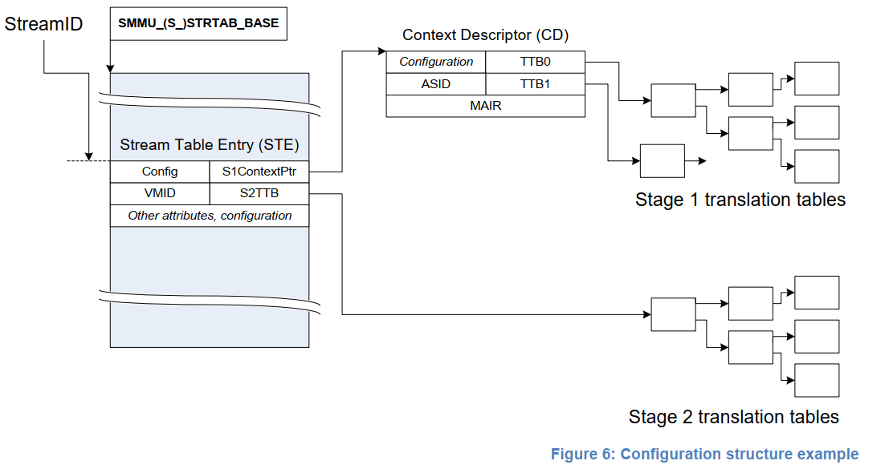

**1.configuration**

将StreamID映射到页表基地址、配置项和context,以便进行地址翻译,包含STE和CD两种数据结构.

	STE(Stream Table Entry):包含S2页表基地址、VMID和CD数据结构的首地址等;
	CD(Context Descriptor):包含S1页表基地址、per-stream configuration和ASID等.

**2.Translation Table**

用于VA->IPA(S1)和IPA->PA(S2)的地址翻译.

### 3.3.1 STE

**1.线性STE**

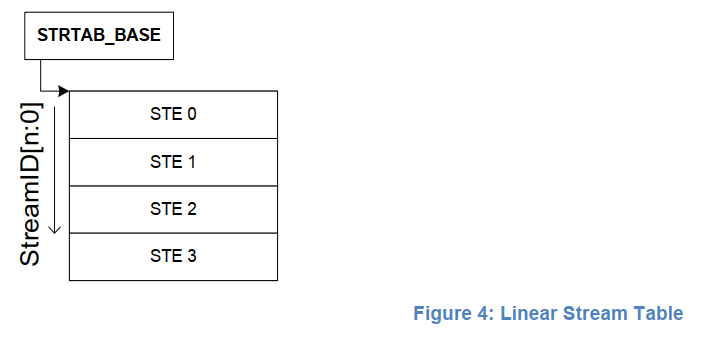

	1.线性STE在内存中连续存储,每个Stream Table Entry占用64B的存储空间;
	2.通过SMMU_(S)_STRTAB_BASE.ADDR[51:6]作为基地址,StreamID作为索引来查找,当StreamID递增1时,STE
		偏移地址递增64B;
	//优缺点:
	优点:实现简单,只需要一次索引,速度块;
	缺点:需要连续空间,当StreamID较多时不推荐使用.

**2.2-level结构STE**

	1.第一级Table,即线性结构的STD(Stream Table Descriptor),包含了指向二级STE的基地址STD.L2Ptr和表
		征第二级STE数目的STD.Span.每个STD占用8B的存储空间;
	2.第二级STE是线性结构;
	3.第一级STD由StreamID[n:SPLIT]作为索引,n为StreamID的最高bit;SPLIT通过SMMU_(S)_STRTAB_BASE_CFG.
		SPLIT寄存器进行配置;
	4.第二级STE由第一级STD中的STD.L2Ptr作为基地址加上StreamID[SPLIT-1:0]作为偏移进行索引;
	5.是否支持2-level STE由寄存器SMMU_IDR0.ST_LEVEL指示;
	6.StreamID[SPLIT-1:0]中,SPLIT的值只支持6/8/10三种,对应4KB/16KB/64KB三种page size;
	7.如果线性STE的大小超过4KB时,无法放入同一个4KB page,因此SMMU支持的StreamID超过64时(4KB/64B=64,即
		StreamID超过6bit),必须支持2-level STE.
	//优缺点:
	优点:节约内存空间,特别是StreamID范围很大、且有效的STE分布比较稀疏时;
	缺点:需要索引两次,进行两次内存访问,速度慢.

### 3.3.2 StreamID to CD

	1.S1使能时,STE包含CD数据结构的首地址,指向一个或多个CD(多个CD的情况下,CD由SubStreamID作为index);
		CD包含S1页表首地址、per-stream configuration和ASID等信息;
	2.S2使能时,STE包含S2页表首地址和VMID等信息;
	3.多个device可以共享使用一个VM,表示多个STE可以共享一套S2页表(相同的VMID);同理,多个stream可以共享
		一个S1配置,表示多个STE也可以共享同一个CD(相同的ASID);
	4.ARM建议,hypervisor使能的情况下,STE和S2页表由hypervisor控制,CD和S1页表由guest OS控制,hypervisor
		也可以使用独立的S1页表用于自身的地址翻译;
	5.如果使能了substream,但没有提供SubstreamID,SMMU的行为与STE.S1DSS配置有关:
		1.STE.S1DSS=0b00,缺少SubstreamID将导致出错,该transaction被abort并记录到event;
		2.STE.S1DSS=0b01,缺少SubstreamID不会导致出错,当作S1-bypass处理;
		3.STE.S1DSS=0b10,缺少SubstreamID不会导致出错,使用Substream 0的CD,此时如果某个transaction的
			SubstreamID=0,则会被abort并记录到event.
	6.ASID和VMID作为TLB的Tag,主要有以下功能:
		1.地址翻译时,区分不同的stream中的不同地址空间;
		2.在收到广播的TLB invalidation命令时,匹配TLB entry;
		3.多个stream间共享页表.

**1.实例1--->线性的STE和线性的CD**

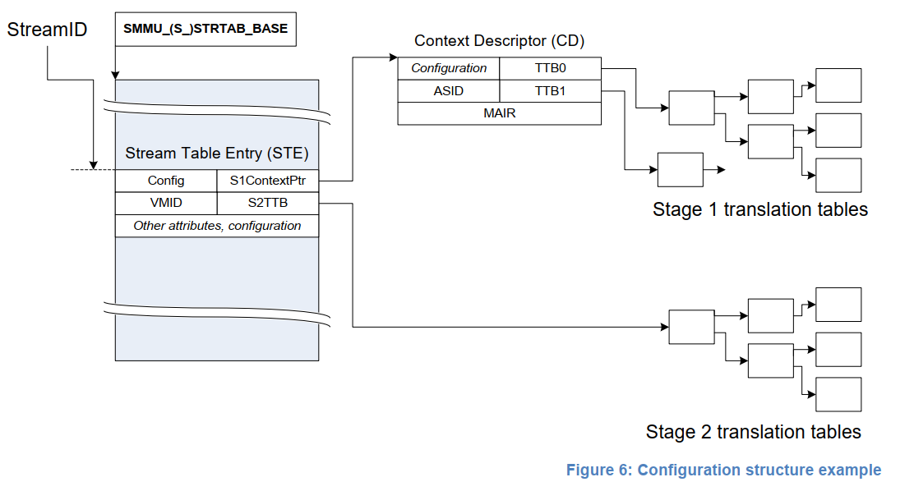

	1.STE线性结构,由StreamID索引;
	2.每个STE指向一个CD和S2页表;
	3.CD指向一个S1的页表.

**2.实例2--->线性的STE和二级CD**

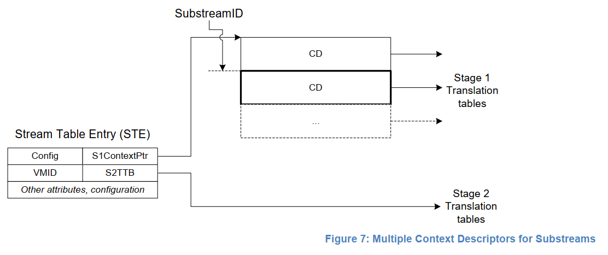

	1.STE指向一个CD阵列的首地址;
	2.CD阵列中的CD由SubstreamID索引;
	3.每个CD指向一个S1的页表.

**3.实例3--->二级的STE和二级CD**

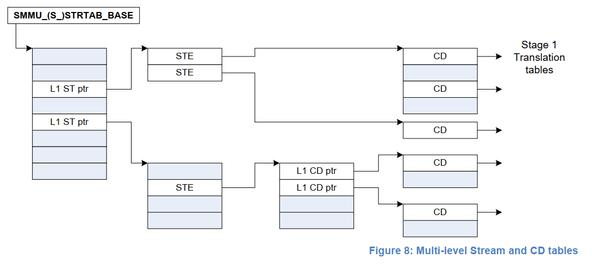

	1.2-level STE和2-level CD复合结构;
	2.可以灵活的支持更多数量的stream和substream,且节约内存空间.

### 3.3.3 2 stage翻译过程

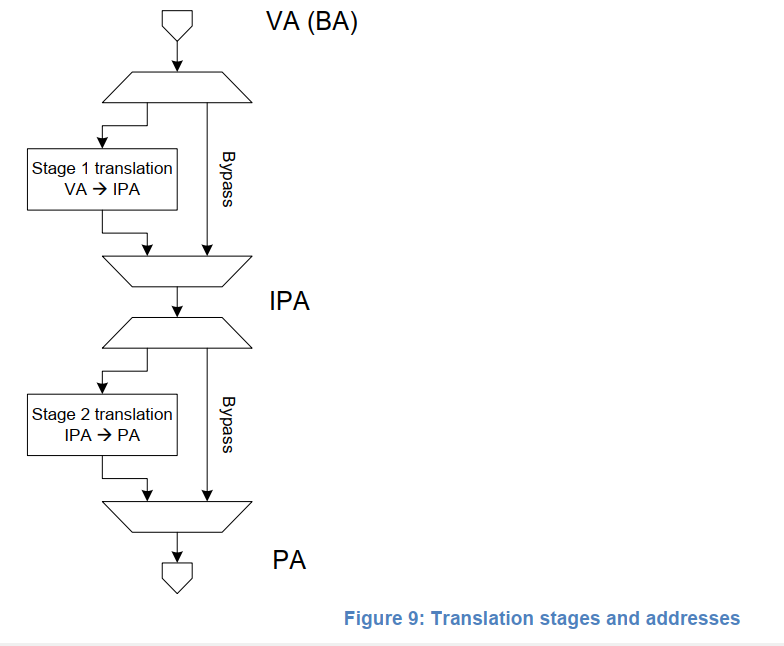

	1.如果SMMU_CR0.SMMUEN==0,表示global bypass,不进行地址翻译,但是可以通过SMMU_GBPA进行属性配置,
		或者abort所有的transaction.
	2.如果SMMU_CR0.SMMUEN==1,表示非global bypass:
		1.通过StreamID查找STE;
		2.如果STE使能S2(STE.Config),则STE包含S2页表首地址;
		3.如果STE只能S1(STE.Config),则STE包含CD的首地址.如果S1/S2同时使能,STE包含的CD这个地址是IPA
			地址,需要通过S2翻译变成PA地址才能访问到真正的CD,否则使用的是PA地址读取CD;
	3.如果STE和CD配置都有效的话,进行地址翻译:
		1.如果S1使能且非bypass,CD指向S1页表(S1的TTBx信息),进行PTW,得到IPA地址;否则VA直接作为IPA地址
			给S2.
		2.如果S2使能且非bypass,STE指向S2页表,IPA地址需要进行一次S2翻译转换得到PA地址;否则直接作为输出
			PA地址给到下游.
	4.安全场景下,bypass由SMMU_S_CR0.SMMUEN和SMMU_S_GBPA控制,且不支持S2.

## 3.4 配置查找和翻译查找

### 3.4.1 查找过程

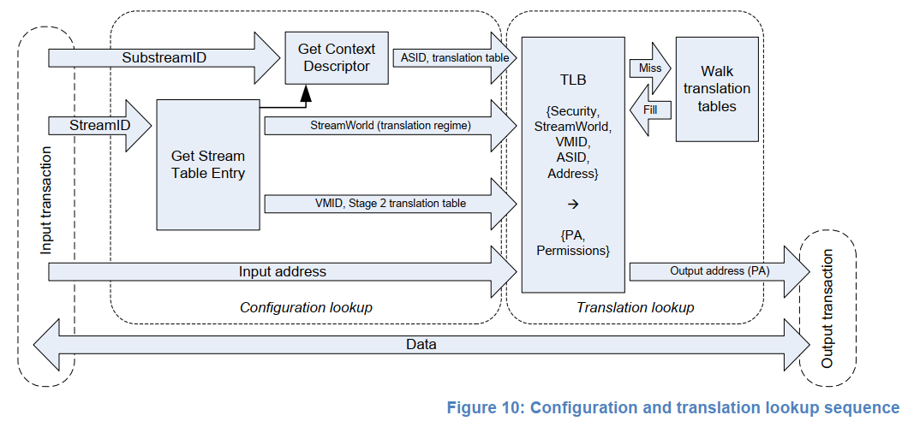

SMMU翻译过程分为两大步骤:

**1.配置查找**

通过寄存器配置和StreamID(SubstreamID)查找到STE(CD)的过程,最终得到stream相关的配置信息:

	1.S1页表基地址、ASID和相关的配置信息(e.g.地址翻译的granule size);
	2.S2页表基地址、VMID和相关的配置信息;
	3.Stream的相关的配置信息,e.g.StreamWorld(ELn、安全、翻译规则等);

**2.翻译查找**

通过输入地址、StreamWorld、ASID和VMID等信息得到最终物理地址

	ARM建议用TLB缓存这些信息,不用每次翻译都进行PTW,加速翻译过程.

### 3.4.2 StreamWorld

StreamWorld定义的是不同的翻译场景,对应不同的翻译规则

	1.查找或失效TLB时作为Tag的一部分;
	2.StreamWorld由以下几个配置项组合得到:
		1.STE的安全属性;
		2.STE.Config;
		3.STE.STRW;
		4.SMMU_CR2.E2H.

StreamWorld基本可以对应ARMv8-A里定义的EL概念

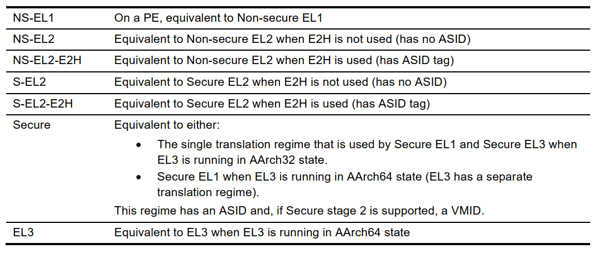

### 3.4.3 总结

	1.StreamID/SubstreamID标记配置查找过程:
		可用于configuration cache maintenance
	2.(StreamWorld、VMID、ASID、Address)标记翻译查找过程:
		可用于Translation cache maintenance(e.g.TLB maintenance)

## 3.5 transaction属性

1.一个transaction可能包含以下属性:

	1.Address、Size、Read/Write;
	2.Access type: Device、Write-Back cached normal memory等;
	3.Shareability: Inner/Outer shareable
	4.Cache allocation hints
	5.Instruction/Data、Privileged/Unprivileged, Secure/Non-secure

2.instruction/data, privileged/unprivileged, secure/non-secure, read/write等都是permission相关的属性,需要和页表中的相关属性做检查,检查不通过SMMU可以驳回此次访问.这些属性可以通过STE中的INTSTCFG, PRIVCFG和NSCFG配置进行覆盖.

3.其他的属性(memory type, shareability, cache hints)等主要用于进行memory访问控制,由输入的属性、页表中的属性和SMMU的配置(STE中的MTCFG/MemAttr, SHCFG, ALLOCCFG等)组合得到.SMMU同样也可以进行覆盖(override):

	1.S1和S2都bypass时,由于没有页表属性,使用输入的属性较为合适;
	2.S2-only时,由于S2页表是VM通用的,device比VM更清楚自己的访问行为,也使用输入的属性较为合适.

4.ARM建议

	1.在device保证输入的属性正确的情况下,使用输入属性而不进行override;
	2.在device不保证属性正确或不输出属性时,使用SMMU的配置和页表中的属性进行override.

## 3.6 SMMU page table walk

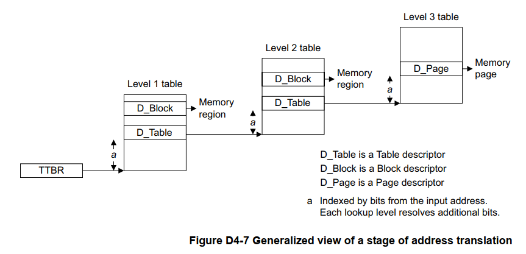

PTW:一系列查表过程的总称.TTBR给出查表过程的base addr,每次查表过程都会得到一个描述符,描述符说明如下:

	1.如果该entry是最后一次walk的entry,则该entry包含了OA、权限和属性;
	2.如果该entry是中间walk的entry,则包含了转换表的基地址,需要额外的lookup过程;
	3.如果是安全的转换,则描述符会指示当前的基地址是安全的还是非安全的基地址;
	4.如果描述符是无效的,本次转换产生translation fault.
	PS:
	1.除了Non-secure EL1&0 stage1 translation,TTBR和页表描述符返回的基地址都是物理地址;
	2.对于Non-secure El1&0 stage1+stage2 translation,TTBR和转换表描述符返回的基地址都是IPA,需要经过
		stage2的转换.总的lookup次数为: (S1+1)*(S2+1)-1,S1为stage1的查找次数,s2为Stage2的查找次数.

### 3.6.1 Control of translation table walks

TCR_EL1.EPD0/1:指示TTBR_EL0/1是否有效.--->Translation Control Register(EL1).

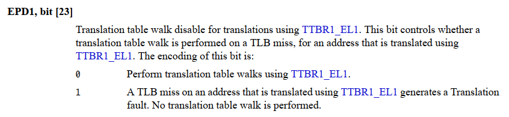

	TCR_EL1.EPD1:表明TTBR_EL1是否有效;
	TCR_EL1.EPD0:表明TTBR_EL0是否有效.

### 3.6.2 Overview of VMSAv8-64 address translation using the 4KB translation granule

S1与S2的初始查找级数的要求不一样.

**1.S1特点**

没有concatenation of translation tables.初始查找级数与TxSZ有关,如下:

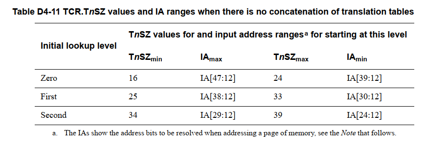

	1.使用4KB页表粒度,初始查找级数不能是第三级;
	2.IA[11:0] = OA[11:0],即低12-bit直接填充即可.

**2.S2特点**

最大存在16个concatenated的转换表.初始查找级数与TxSZ、concatenated有关,如下:

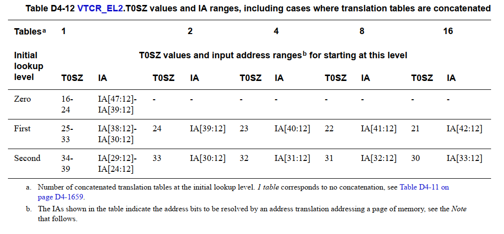

	1.使用4KB页表粒度,初始查找级数不能是第三级;
	2.concatenated不能在level0处;
	3.IA[11:0] = OA[11:0],即低12-bit直接填充即可;
	4.level0只能是table类型.

**3.注意点**

1.S2 SL0表示起始的查找级数,4KB粒度下的编码如下:

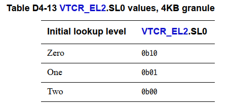

2.如果T0SZ,SL0不匹配,则会产生stage 2 level zero translation fault.

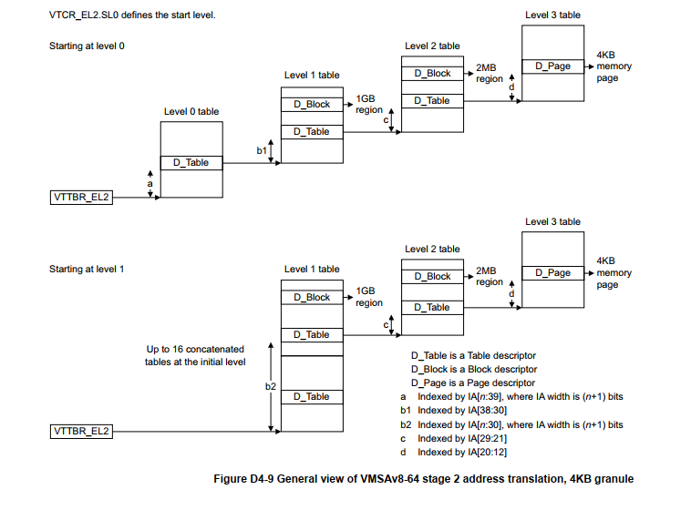

# 4. 延伸: ARMv8-A

## 4.1 名词解释

	ARMv8-A: ARM architecture version 8-Application profile;
	AArch64: 64-bit Execution state, supports the A64 instruction set;
	AArch32: 32-bit Execution state, supports the T32 and A32 instruction set;
	VMSA: Virtual Memory System Architecture based on a Memory Management Unit(MMU);
	PE: Processing Element;
	EL: Exception Level;
	HYP: Hypervisor;
	VHE: Virtualization Host Extensions.

## 4.2 EL的概念

EL(Exception Level),软件执行环境所处的特权等级,分为EL0, EL1, EL2, EL3.

	1.数字越大,特权级别越高;
	2.EL0是最低权限,称为unprivileged.EL1/EL2/EL3称为privileged;
	3.EL2与虚拟化相关,只存在于Non-secure状态;
	4.EL3涉及到Non-secure和secure切换,只存在于secure状态;
	5.EL0/EL1必须实现,EL2/EL3可选;
	6.EL之间的切换只能通过异常处理实现:
		进入异常时,EL只能上升或者保持不变;
		从异常返回时,EL只能降低或者保持不变.

EL层级与软件层次之间的对应关系如下:

	EL0--->Applications Secure or Non-secure state;
	EL1--->Operation system kernel and associated functions that are typically described as
		privileged Secure or Non-secure;
	EL2--->Hyperisor. Non-secure only;
	EL3--->Secure monitor.

## 4.3 EL的层次化

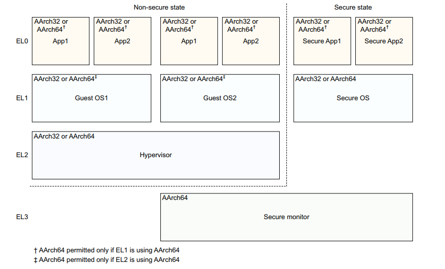

## 4.4 Hypervisor

1.允许多个NS-EL1 guest OS多路复用,运行在同一套硬件上.

	1.自有翻译规则
		独立的S1翻译,没有S2;
		支持LPAE格式;
		只有一个页表基地址(TTBR0_EL2);
	2.角色:作为一个"world switch"
		Between guests(baremetal hypervisor/Type-1);
		Between host and guests(hosted hypervisor/Type-2)---host作为一个特殊的guest

2.KVM/ARM使用Hypervisor切换host和guest

## 4.5 Virtualization Host Extensions

1.Virtualization Host Extensions(VHE) expand the capabilities of EL2:

	1.Designed to improve the support of Type-2 hypervisors;
	2.Allow the host OS to be run at EL2;
	3.The host OS requires minimal changes to run at EL2;
	4.User-space still runs at EL0;
	5.Guest OS run at EL1;
	6.Host has no software running at EL1;
	7.AArch64 specific;
	8.Consists of two S1 translation tables.

2.Major design goals for VHE:

	1.Make architecture features discoverable;
	2.Allow EL1 software to run at EL2 transparently;
	3.Put the burden of the change on Virtualization software.

3.With VHE enabled, the Linux kernel can now be run at EL2.

 
