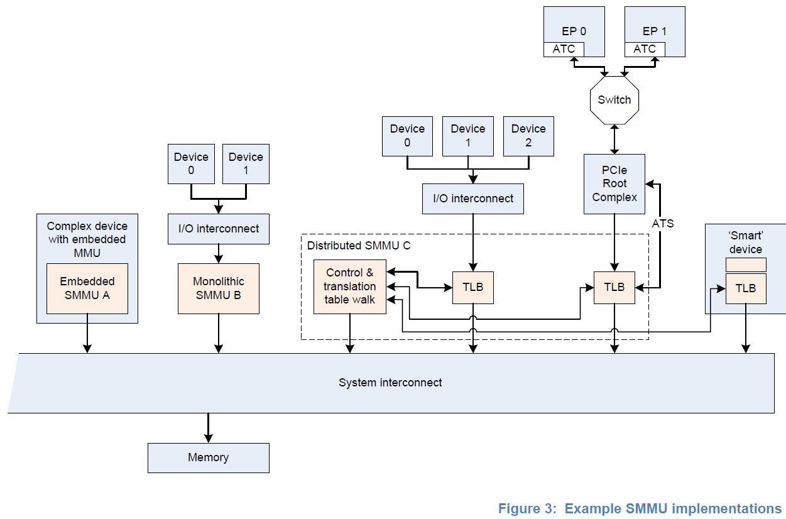

# SMMUv3 Learning

# 1. SMMU基本概念

## 1.1 术语

ASID(Address Space ID):用于区分不同地址空间的TLB entry.

VMID(Virtual Machine ID):用于区分不同虚拟机的TLB entry.

DVM(Distributed Virtual Memory):基于消息的互联协议,用于广播TLB维护操作.

VM(Virtual Machine):虚拟机或虚拟OS.

VA(Virtual Machine):虚拟地址.

IPA(Intermediate Physical Address):中间物理地址.

PA(Physical Address):物理地址.

RC(PCIe的Root Complex),见下图.

EP(Endpoint):PCIe的概念,用于一个SMMU client节点设备的context.

PASID(Process address space ID):PCIe的概念,是EP的本地ID(可以看作EP的本地ASID),一个系统中一个PASID可能用很多遍.

	PS:PASID除了名字与PE的ASID有点靠近外,其实与ASID完全没关系.

ATS(Address translation service):PCIe的概念,PCIe RC和TLB之间的一种接口协议.

PRI(Page request interface):PCIe的概念,基于ATS的扩展.允许EP请求进行虚拟内存page的映射.\\

SMMU(System Memory Management Unit).

ATOS:允许通过寄存器访问SMMU实现VA-IPA/PA的转换;VATOS提供了次要的寄存器组,用于虚拟机直接使用,只做VA-IPA的转换.

PTE(Page Table Entry):最后一级页表.

PE(Process Element):ARM体系结构里定义的处理单元,可以简单理解为ARM CPU的Core.

TT(Translation table):页表,ARM架构的,同Page Table.

TTD(Translation table descriptor):同PTE(Page Table Entry).

HTTU(Hardware translation table update):在访问或写入相关页面后,硬件自动更新相关页表里的Access flag/Dirty stats.

LPAE(Large Physical Address Extension):ARMv7为支持大物理地址空间进行的扩展,使用64-bit长页表格式,最大支持40-bit PA/IPA输出,页表格式与ARMv8 AArch32相同.

TTW(Translation Table Walk):通过一级一级访问memory中的页表完成地址翻译的过程(也叫PTW).

SSD(Secure state determination):将client设备的一段数据流与secure/non-secure控制联系起来的方法,确定这段数据流是否完全.

STE(Stream table entry):存储Stream配置的数据结构.

L1STD(Level-1 Stream Table Descriptor):两级STE格式的时候使用.

CD(Context descriptor):存储Context配置的数据结构.

L1CD(Level-1 Context Descripto):两级CD格式的时候使用.

Client device:SMMU的上游master,memory访问、地址翻译请求的发起方.

Split-stage ATS:两阶段页表转换方式.ATS用阶段1页表转换,non-ATS用阶段2页表转换.

S1/S2:地址翻译的步骤,S1翻译的中间地址作为S2的输入.

bypass:一种设置,一个阶段的不做任何地址转化,这种直通模式就是使用bypass(可能会进行属性翻译和判断);如果SMMU没有实现哪一阶段地址转换,那么这个阶段的地址转换就可以认为是Bypass.

Stage N-only:一种对一段数据流的转换设置,两阶段转换只转换一个阶段,另一个Bypass掉,可以是设置成这样,也可以是SMMU被实现成这样.

E2H(EL2 host mode):ARMv8.1中定义的虚拟化扩展,支持在EL2翻译规则中使用ASID作为Tag.

TR(Translation request):用于在PCIe ATS的context中,请求SMMU做地址转换.

## 1.2. 简述

SMMU的行为与PE的MMU类似,在系统I/O设备的DMA请求发到系统之前进行地址转换(SMMU只为DMA工作).

### 1.2.1 描述

	1.对DMA的地址进行转换是为了隔离或快捷:
		为了将设备通讯与转换相关联,还要区分SMMU背后不同的设备,转换请求还需要除了地址、R/W、权限以外的额外
		属性(即需要一个分辨某个流的属性);
		不同的流在逻辑上与不同的设备相关联,SMMU可以对不同的流实现不同的转换或检查,即使一个系统中只有一个
		client设备,SMMU的概念仍然不会变,只有一个流与该设备对应.
	2.一个系统中可能有很多个SMMU,一个SMMU可能为1个或多个设备做转换;
	3.SMMU支持2阶段页表转换的方式与PE的MMU相似:
		1阶段VA->IPA,2阶段IPA->PA;
		1阶段转换主要是为了在一个VM内的DMA隔离,2阶段一般在支持虚拟化扩展的设备实现将DMA设备虚拟化到VM内.

### 1.2.2 SMMUv3.2特性

SMMUv3提供了支持PCIE Root Complexes的特性,并通过支持大量并行转换context来支持其他潜在大量I/O的系统.主要特性如下:

	1.基于内存的配置结构,支持大量的流;
	2.具体实现可仅1阶段、仅2阶段或两阶段页表转换,从寄存器里可以查到具体配置,其他根据实现选配的参数也可以
		查到;
	3.最高16bit ASID;
	4.最高16位VMID;
	5.根据ARMv8.1虚拟内存系统架构实现地址转换和保护.SMMU转换表可与PE们共享,允许软件选择共享页表或SMMU
		私有页表;
	6.49bit VA,符合ARMv8-A的2x48bit转换表输入大小.

选配特性:

	1.可支持aarch32 LPAE页表格式和aarch64页表格式;
	2.支持安全域的流;
	3.广播TLB失效;
	4.HTTU可能仅支持硬件更新Access flag或同时支持硬件更新Access flag和Dirty state,也可以没有HTTU;
	5.兼容Root Complex的PCIE ATS和PRI;
	6.4K,16K和64K页表粒度,建议基于服务器的系统架构实现应实现两阶段页表转换并使用64KB页表,与PE相对齐.

其他:

	1.可以支持52bit VA、IPA、PA;
	2.Page-Based Hardware Attribute;
	3.2阶段页表的EL0 vs EL1 execute never控制;
	4.ARMv8.2中的PE的概念Common not Private(CnP)并不适用于SMMU架构,所有SMMU转换都按common处理.

## 1.3 SMMU在系统中的位置

下图中有两种SMMU的使用方式:

	1.一种使用方式是两个client设备经SMMU从系统取数据,设备的DMA可以使用VA、IPA或是其他总线地址,SMMU将这地
		址转换成PA;
	2.另一种使用方式是SMMU与PCIE的Root Complex一对一的接到了一起,Root Complex自己管着一票Endpoints,
		SMMU给出了一个ATS port来支持PCIE的ATS和PRI,当然,这个ATS也可能是兼容其他非PCIE设备的相近功能.

### 1.3.1 SMMU在系统中的位置要求

	1.正在发生的对slave设备的访问不能避过SMMU:
		一般来说,master在SMMU后面,就像PE在MMU后面一样.因此进行中的对slave设备的访问需要master的SMMU
		调和,如果master没有SMMU,那么他的DMA就可以有全系统访问能力,因此其DMA需要软件设置,这种情况下,只有
		最高权限才能进行设置;
	2.SMMU有自己的程序接口:
		接受系统软件的设置和维护,并且每个SMMU都要单独设置,SMMU也能访问自己的设置,比如TTW;SMMU自行访问
		内存的通道是否与其client设备共享由具体实现决定;
	3.ARM推荐项:
		1.SMMU桥接I/O设备的DMA地址应该到系统或物理地址;
		2.SMMU应该放在设备master或是I/O与系统之间;
		3.MMU不应该串联到一起,就是说,SMMU到内存或其他slave设备不应经过另一个SMMU;
	4.一致性:
		1.系统的SMMU master接口想要实现IO一致行,从而为SMMU的client设备提供IO一致性访问;
		2.SMMU slave接口对从设备来的数据流不需要任何一致性支持;
		3.由于在传出方向上没有地址转换,因此侦听流量不能从系统到达客户端设备,因此无法将全一致性设备放在
			SMMU后面;
		4.将SMMU作为包含全一致性缓存的复杂设备的一部分是可行的,就像PE的MMU一样;不过这意味着缓存就需要
			用物理地址做标签.

### 1.3.2 SMMU实现的实例

	1.SMMU A作为一个复杂设备的一部分,仅为此设备提供转换服务,这一设计可以提供专用的无需争用的页表翻译和TLB
		的设备;
	2.SMMU B则是一个集成了页表转换、编程接口和TTW功能的整体,两个client设备使用此SMMU作为DMA进入系统的途径;
	3.SMMU C是分布式的,并能提供多路径到系统实现更高带宽,其包含:
		1.一个中心TTW,具有自己的master接口用于获取转换页表、配置结构及队列,还有自己的slave接口用于接受编程
			访问;
		2.一个宏TLB和配置的缓存;
		3.一些远程TLB单元:在转换miss时向中心TTW发转换请求,并将结果缓存到本地.
		4.图上展示了两个远程TLB单元,一个远程TLB单元通过1个端口支持了一组3个设备,一个远程TLB单元连接到PCIE
			Root Complex,第二个远程TLB单元还提供了一个ATS接口给Root Complex,所以PCIE Endpoint可以
			使用ATS来发起转换请求到中心TTW.

在所有情况下,在软件层看来都是一个设备连接在逻辑上分开的SMMU后面.所有实现都像是读写操作从client设备到离散的SMMU,但实际上其实是设备直接执行读写到系统,但使用SMMU提供的转换.这样就允许一个SMMU驱动驱动起各种不同的SMMU实现,设备可能整合了TLB或整个SMMU来提升性能,但是紧耦合的TLB可能还被用于为全一致设备缓存提供物理地址的匹配;无论实现什么实现方式,他们的行为对于软件来说是一致的.

## 1.4 SMMU的软件接口

包含3个软件接口:

	1.基于内存的数据结构,用来将设备映射到负责转换client设备地址的转换表(即页表);
	2.基于内存的环形缓冲队列:
		1.一个用于放SMMU的指令的cmdq;
		2.一个用于放从SMMU回报事件的事件队列(eventq);
		3.一个PRI队列来接收PCIE页面请求;
		只有支持PRI服务的SMMU才有priq,这个额外的队列允许处理从设备来的PRI请求而不与eventq混合.
	3.一组寄存器,有些仅用于安全域.
		SMMU用寄存器指示内存数据结构、队列的基地址,用寄存器提供功能检测和标志寄存器.
		另有全局控制寄存器控制启动队列处理和流量转换;如果支持安全域,则存在一组附加的寄存器来允许安全域软件
		维护安全域设备数据结构,在安全域指令队列中发布命令、读取安全域事件.

# 2. SMMU转换分析

## 2.1 StreamID和SubStreamID

### 2.1.1 StreamID

做一次转换需要地址、size以及相关属性如读/写/安全域/非安全域/可共享性/可缓存性.如果超过1个client设备使用SMMU流量,那么他们还要有StreamID来区分,StreamID在系统里的构建传送是具体实现决定的,逻辑上讲,一个StreamID就关联到一个发起转换的设备.

	1.物理设备到StreamID的映射必须描述给系统软件,ARM推荐StreamID用密集命名空间,从0开始;
	2.每个SMMU都是独立的StreamID命名空间;
	3.一个设备可以不止使用一个StreamID触发流量,可以用多个StreamID来区分设备不同的状态;
	4.StreamID用于从Stream table选出STE(Stream Table Entry),这个STE包含这个设备的配置,Stream table
		最大包含2^StreamIDSize条位于内存的配置数据结构;

### 2.1.2 SubStreamID

SubstreamID可能选择性的提供给SMMU做一阶段页表转换.

	1.SubstreamID可以是0-20bit.用于区分来自同一逻辑块但去往不同的程序地址空间,比如说一个有8个context的
		计算加速器,每个context可能映射到不同的用户进程,但是只有一个设备且通用的配置,因此必须将其分配给
		整个VM;
	2.SubstreamID等同于PCIE里的PASID,因为也用于非PCIE系统,所以给了一个更通用的名字;
	3.SubstreamID最大值20bit也与PCIE的PASID一致.

StreamID和SubStreamID通过SMMU_IDR1寄存器配置.

### 2.1.3 StreamID和SubStreamID的使用

	1.StreamID是识别一个transaction所有配置的关键,一个StreamID可以配置成bypass或要转换的项目,而这就
		决定了要做1或2阶段页表转换;
	2.SubstreamID提供了一个修饰符,这个修饰符在StreamID指示的一组1阶段转换间做选择,但对有StreamID选择的
		2阶段转换没有影响.仅实现2阶段的SMMU不能接受SubstreamID;
	3.安全域的StreamID从安全域的Stream table中找STE,非安全域的StreamID从非安全域Stream table找STE.

### 2.1.4 ARM推荐

ARM希望对于PCI:

	1.StreamID从PCI RequestID生成,这样StreamID[15:0]就是RequestID的[15:0]:
		如果一个SMMU后有超过1个RootComplex,ARM推荐将这16bit的RequestID命名空间编入更大的StreamID命名
		空间来管理,高bit位来区分连续的RequestID命名空间,这样StreamID[N:16]就能指示哪个RootComplex是
		stream的源;
	2.在PCIE系统里,SubstreamID应该直接从PASID一对一的对应而来.因此,实现与PCI client一起用的SMMU需要
		支持StreamID最少16bit.
