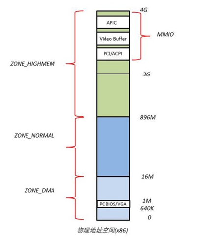
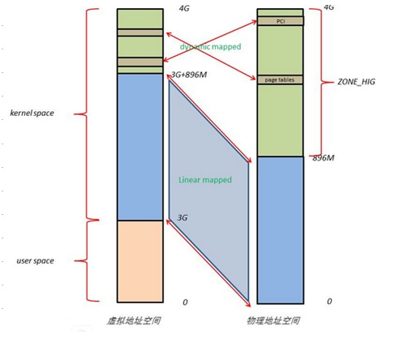

# 1.MIPS体系结构

## 1.mips简介

mips是一种采用RISC设计的处理器芯片.

**RISC(Reduced Instrution Set Computer):精简指定集计算机,指令类型较少,速度更快.**

**CISC(Complex Instruction Set Computer):复杂指令集计算机,指令复杂,速度慢.**

CPU速度指标:MIPS(Million Instruction Per Second),每秒百万条指令数.
***
## 2.mips体系结构

mips采用5级流水线作业,指令和数据高速缓存分离.因此取指的同时可以读写数据.

流水线5个阶段:IF(取指)、RD(读寄存器)、ALU(算术逻辑单元)、MEM(访问内存)和WB(写回寄存器).

	IF(instruction fetch):从指令高速缓存(I-cache)获取下一条指令
	RD(read register):读取指定的寄存器内容
	ALU(arithmetic/logic unit):在一个时钟周期内完成算术或逻辑运算
	MEM(memory):读写数据高速缓存(D-Cache)
	WB(write back):运算结果写回到寄存器中.

CISC架构流水线:取指、译码、执行、写回结果.

RISC流水线更长,因此执行效率更高.5级流水线占4个时钟周期.

### 2.1 mips指令特点:

1)指定长度为定长32bit

2)没有堆栈操作push/pop指令

3)具有32个寄存器,$0寄存器永远返回0

4)没有条件标志

5)没有字节(8 bit)或半字(16 bit)数据的运算

mips数据存储类型

	c名字			mips名字				大小(字节)			汇编助记符
	long long		dword				8					ld中的"d"
	int				word				4					lw中的"w"
	short			halfword			2					lh中的"h"
	char			byte				1					lb中的"b"

### 2.2 大端(big Endian)和小端(little Endian)

大端:地址由小到大增加,数据从高位向低位存放(即从数据位的31~0依次存放入地址).

	一个32 bit的数据为:0x12345678
	存放到地址:0x00000430开始处.则存放的规则为:30存放12; 31存放34; 32存放56; 33存放78.每个地址存放一个字节的数据
	大端读数据时,直接地址从小到大读即可读到正确顺序的数据.

小端:地址从小到大增加,数据从低位向高位存放(即从数据位的0~31依次存放入地址).

	一个32 bit的数据:0x12345678
	存放到地址:0x00000430开始处,则存放的规则为:30存放78; 31存放56； 32存放34; 33存放12.每个地址存放一个字节的数据
	大端读数据时,地址应该从大到小才能读到正确顺序的数据.

因为我们的是4 byte对齐(otp/key等),4 byte之间采用小端模式.因此需要4 byte之间从大到小读取才是正确的顺序.

### 2.3 mips寄存器

	寄存器编号		助记符		用法
	0				zero		永远返回0
	1				at			(assembly temporary汇编暂存)保留给汇编器使用
	2-3				v0,v1		子程序返回值
	4-7				a0-a3		(argument)子程序调用的前几个参数
	8-15			t0-t7		(temporaries)临时变量,子程序使用时无需保存
	24-25			t8-t9		(temporaries)临时变量,子程序使用时无需保存
	16-25			s0-s7		子程序寄存器变量:子程序写入时必须保存其值并在返回前恢复原值,此时调用函数看到这些寄存器值没变化
	26-27			k0,k1		保存异常处理函数的地址.发生异常(中断)时,这两个寄存器的值不会恢复
	28				gp			(global pointer)全局指针,便于存取static和extern变量
	29				sp			(stack pointer)堆栈指针
	30				s8/fp		第9个寄存器变量,需要的子程序可以用来做帧指针(frame pointer)
	31				ra			存放子程序调用的返回地址

mips 32/64位CPU上,增加了浮点运算协处理器,同时也增加了32个浮点寄存器,汇编中使用$f0~$f31表示.

### 2.4 mips memory map(32 bit的情况)

	0xFFFF,FFFF	-----------------------------------
				
						Mapped(kseg2)				1GB
					
	0xC000,0000	-----------------------------------
					Unmapped uncached(kseg1)		512MB
	0xA000,0000	-----------------------------------
					Unmapped cached(kseg0)			512MB
	0x8000,0000	-----------------------------------

					32-bit user space kuseg			2GB

	0x0000,0000	-----------------------------------  

	kuseg:0x0000,0000到0x7FFF,FFFF(2GB).用户模式下可用的地址,必须经过MMU(TLB)转换地址,如果MMU没有被设置好,则这段地址不可用.

	kseg0:0x8000,0000到0x9FFF,FFFF(512MB).其对应的物理地址是0x0000,0000到0x1FFF,FFFF(最高位清0).
	访问时不需要通过地址转换.在无MMU时存放大多数的程序和数据,有MMU时会存放操作系统内核.属于带cache的地址,cache未设置好之前,
	这段地址不能随便使用.

	kseg1:0xA000,0000到0xBFFF,FFFF(512MB).将最高三位清0(addr & 1FFFFFFF)重新映射到低端512MB物理地址
	(即0x0000,0000到0x1FFF,FFFF),该区域为系统初始化区域.这段区域是系统重启唯一可以正常工作的地址空间,
	系统复位时的入口点地址就位于该区域,即0xBFC0,0000,其对应的物理地址为:1FC0,0000.这段是非cache存取的.

	kseg2:0xC000,0000到0xFFFF,FFFF(1G).这段区域只能在kernel mode(kernel模式)下使用,而且必须先通过MMU设置.

	/***********************************/
	kseg0、kseg1属于不经过MMU转换的512M(都是512M)的大小,而且都映射到0x0000,0000到0x1FFF,FFFF(512M)物理地址.
	其余的3G的虚拟地址空间需要经过MMU转化成物理地址,转换规则由CPU厂商决定.
	因此,mips32 CPU访问0~512M的物理地址,可以直接访问ksg0和ksg1.如果要高于512M的物理地址,就必须通过MMU地址转换.

### 2.5 mips可以运行的3种特权模式:

1)用户模式(user mode)

2)核心模式(kernel mode)

3)管理模式(supervisor mode)---一般忽略

用户态程序是无法访问核心地址空间(0xC000,0000到0xFFFF,FFFF),否则会导致异常.
***
## 3.mips处理器控制

### mips协处理器

mips中,最多支持4个协处理器(Co-Processor).

协处理器1(CP1)是浮点运算协处理器(可选),协处理器0(CP0)是系统控制协处理器.

协处理器0(CP0)在mips中必不可少.mips配置CPU、MMU、异常处理、乘除法等功能都依赖CP0.

	CP0的职责:
	1)配置CPU的基本特性
	2)Cache的控制
	3)异常/中断的控制
	4)MMU的控制
	5)定时器、事件计数器、奇偶较验、错误检测等.
***
## 4.mips cache机制

### 4.1 基本知识

1)Cache与内存交换数据以"line"为单位,cache line的大小为32 byte.

2)CPU与D-Cache之间的数据交换以字(4 byte)为单位.

3)mips的I-cache(指令cache)与D-cache(数据cache)分离,并有各自独立的读写端口.

4)mips采用多级cache,采用Register->L1 cache->L2 cache->L3 cache->Memory->Mass storage,访问速度和成本依次降低.

**CPU存在MMU,因而存在虚拟地址空间与物理地址空间.指令流的访存地址为VA,在访存操作送给RAM控制器前需要将VA转换为PA.**

### 4.2 写memory的两种方式

**write-through(透写)**

write-through:当write数据时,CPU的数据总是写到memory;如果cache有对应数据,cache中的备份也会更新.

	CPU需要等待主存写完成,降低了CPU的效率

**write-back(回写)**

write-back:当write数据时,CPU的数据只写到cache中,并将相应的cache line标记为"dirty"(脏数据).当该行被替换时,控制器才将它写到memory.

	1)write-back不需要直接写内存,写速度快
	2)一旦数据未写入存储设备时掉电,数据将丢失
	
### 4.3 DMA、内存、cache操作

	DMA设备<--->memory<--->cache<--->CPU

**1)DMA设备从memory读数据前,必须保证cache中对应的数据全部写回到memory.**

**2)DMA设备写数据到memory前,必须保证对应cache中的数据作废.否则,CPU可能得到cache中过时的数据(memory数据没刷新到cache).**
***
## 5.mips 异常、中断和启动

### 5.1 mips address mapping

	mips CPU address mapping---物理地址划分
	_____________________________________________________________________________________________________________
	
	Space Map			mips CPU Physical Address				size
						
	DRAM				0x0000_0000 ~ 0x0BFF_FFFF				192M

	FLASH				0x0C00_0000 ~ 0x0FFF_FFFF				64M

	DRAM1				0x1000_0000 ~ 0x17FF_FFFF				128M
	
	IO_REG				0x1800_0000 ~ 0x18FF_FFFF				16M---各个IP核的IO 寄存器

	RGMII BIU			0x1900_0000 ~ 0x19FF_FFFF				16M

	...

	FLASH/BOOTROM		0x1C00_0000 ~ 0x1FFF_FFFF				64M---mips启动点0xBFC0_0000对应的0x1FC0_0000位于此处

						0x1A00_0000 ~ 0x1BFF_FFFF				48M

	Reserved			0x2000_0000 ~ 0x3FFF_FFFF				512M

						0xC000_0000 ~ 0xFFFF_FFFF				1024M(1G)

	DRAM				0x4000_0000 ~ 0xBFFF_FFFF				2048M(2G)
	_____________________________________________________________________________________________________________

### 5.2 mips启动步骤

1)系统上电后,跳转到地址0xBFC0,0000地址,转成物理地址为0x1FC0,0000取第一条指令(此时位于ROM中);同时跳转指令简单地测试CPU是否能够取值;

2)设置状态寄存器(SR)为有效状态,可在ROM中执行存储加载指令;

3)初始化部分RAM并对其进行完整性检查(只能使用寄存器,可将初始化缩小到一块能放下ROM中的程序的内存大小);

4)通过console和诊断寄存器,跟踪报告初始化过程的一些问题;

5)为C代码执行做准备,初始化堆栈及相应寄存器;

6)初始化cache,执行其他代码.

### 5.3 mips启动应用程序需要RAM的原因

1)需要堆栈空间.分配一块足够大的内存,SP(栈指针)指向该内存块的上边界(对齐)

2)初始化一些数据.C程序的数据区由程序装载器初始化,并初始化一些变量

3)所有未初始化的static和extern数据用一块单独的内存块(BSS段)保存
***
## 6.mips 内存管理 & TLB

1)TLB(Translation lookaside buffer):旁路转换缓冲器,通俗的叫法是"页表缓冲".是把虚拟地址转换为物理地址的硬件.里面存放的是一些页表文件(虚拟地址到物理地址的转换表).

2)TLB技术又称为快表技术.页表存储在主存储器中,直接到主存储器中查询页表花费时间多.因此有了页表缓冲(TLB)加快查询.

3)TLB是CPU硬件的一部分,属于MMU.如果使能了MMU,则指令中的地址和取指的地址都要经过TLB转换为物理地址.

4)mips CPU上,虚拟地址和物理地址的转换以页为单位,页的大小为4KB.

5)TLB(页表缓冲)里的转换表(页表文件)包含虚拟页地址(virtual page number, VPN)和物理页地址(physical page number, PFN).
***
# 2.memory mapping

## 2.1 linux内核物理内存的描述

### 1.页

内存通常把"物理页"作为内存管理的基本单位,MMU把虚拟地址转为物理地址通常以"页"为单位进行处理的.

linux系统初始化的时候,为每个物理页面创建一个page对象,所有的page对象指针存放在一个mem_map[]数据中.一般32位系统每个page是4KB.

							physical memory
		0xFFFF_FFFF----------------------------------
						page (2^20-1)	---总共有2^20个page
		0xFFFF_F000----------------------------------	
	((2^20-1)*4KB)
													 #define __pfn_to_page(pfn)	(mem_map + (pfn))
		0xxxxx_xxxx----------------------------------#define __page_to_pfn(page)	((unsigned long)((page)-mem_map))
							page n			#define page_to_phys(page) ((dma_addr_t)page_to_pfn(page)<<PAGE_SHIFT)
		0x1000 * n ----------------------------------	
		(n * 4KB)			.......
		0xxxxx_xxxx----------------------------------
							page 2
		0x0000_2000----------------------------------		
		(2 * 4KB)			page 1
		0x0000_1000----------------------------------	
		(1 * 4KB)			page 0
		0x0000_0000----------------------------------	<-----struct page * mem_map
		(0 * 4KB)

### 2.区

内核将物理内存分为三个区:ZONE_DMA、ZONE_NORMAL、ZONE_HIGHMEM.

x86结构物理地址空间布局:

### 3.虚拟地址与物理地址映射

在linux中,虚拟地址/线性地址/逻辑地址都是一样.

虚拟地址与物理地址映射(x86 architecture):

## 2.2 memory mapping

512MB DDR物理地址划分

	0x0000_0000	 ----------------------------------
				|
				|	linux main memory range 0
				|
	0x01CF_F000	 ----------------------------------
				|	Reserved
	0x01D0_0000	 ----------------------------------
				|
				|	xxx CPU private memory
				|
	0x0200_0000	 ----------------------------------
				|
				|	linux main memory range 1
				|
	0x1000_0000	 ----------------------------------
				|	reserved
	0x1800_0000	 ----------------------------------
				|
				|	IO space(IO 空间)
				|
	0x2000_0000	 ----------------------------------
				|
				|	reserved
				|
	0x8000_0000	 ----------------------------------
				|
				|	Unused DDR high  mem range
				|
	0x9000_0000	 ----------------------------------
				|
				|	linux hign  mem
				|
	0xA000_0000	 ----------------------------------

	/*dts中的表示:*/
	/ {
		/*linux main memory range 0*/
		memory@0{
			device_type = "memory";
			reg = <0x00000000 0x01CFF000>;
		};
		/*linux main memory range 1*/
		memory@0x02000000{
			devicey_type = "memory";
			reg = <0x02000000 0x0E000000>;
		};
		/*linux high memory range*/
		memory@0x90000000{
			device_type = "memory";
			reg = <0x90000000 0x10000000>;
		};
	};

linux中看到的physical address(pa)不是真正的物理内存地址.pa地址只是出了MMU到达北桥(North Bridge)的地址,北桥访问真正的内存硬件或者外设还需要做地址映射.这个映射对于CPU而言是"完全透明的".

linux中,把真正的内存地址称为DMA地址,使用dma_addr_t描述.有些IP核可以不通过CPU而直接访问memory,这种IP核就必须知道memory的真实地址(即DMA地址),而不是北桥地址(pa).

	1)main cpu应该传递一个什么地址给see cpu?
	--->main cpu应该传递虚拟地址对应的pa(北桥地址)给see cpu.
	2)see cpu应该怎么处理这个地址呢?
	--->see cpu应该将接收到的pa(北桥地址)转成va(虚拟地址).
	3)如果main cpu写了某个内存地址,但是see cpu不需要访问,但是某个IP核的DMA需要访问这个地址,main cpu应该传递什么地址到see呢?
	--->main cpu传递dma地址到see cpu,see cpu不做处理,直接将该地址配给对应的IP核的寄存器即可.

**进程对应的内存空间中的5种数据区:**

1)代码段:用来存放可执行文件的操作指令,是可执行程序在内存中的镜像;

2)数据段:用来存放可执行文件中已初始化的全局变量(初始化为非0),也就是说存放程序静态分配的变量和全局变量;

3)BSS段:包含了程序中未初始化的全局变量和初始化为0的全局变量,在内存中bss段全部置0;

4)堆(heap):用于存放进程运行中动态分配的内存段,大小不固定,可动态扩张或缩减.malloc等新分配内存会被动态添加到堆上(堆被扩张);free等释放内存会从堆中剔除(堆被缩减);

5)栈(stack):存放程序临时创建的局部变量.栈特别适用于保存/恢复调用现场.

### 2.3 用户空间内存划分

实例1---进程内存区域地址:

	#include <stdio.h>
	#include <malloc.h>
	#include <unistd.h>
	
	int bss_var;	//bss段
	int data_var0 = 1;	//数据段
	
	int main(int argc, char *argv[])
	{
		/*code segment*/
		printf("below are addresses of types of process'mem\n");
		printf("Text location:\n");
		printf("\tAddress of main(code segment): %p\n", main);
		printf("-------------------------");		
		
		/*stack segment*/
		int stack_var0 = 2;
		printf("Stack location:\n");
		printf("\tInitial end of stack:%p\n", &stack_var0);

		int stack_var1 = 3;
		printf("\tnew end of stack:%p\n", &stack_var1);
		printf("-------------------------");
		
		/*data segment*/
		printf("Data location:\n");
		printf("\tAddress of data_var(Data segment):%p\n", &data_var0);
		
		static int data_var1 = 4;
		printf("\tNew end of data_var(Date segment):%p\n", &data_var1);
		printf("-------------------------");

		/*BSS segment*/
		printf("BSS segment:\n");
		printf("\tAddress of bss_var(bss segment):%p\n", &bss_var);
		printf("-------------------------");

		/*Heap segment*/
		printf("Heap location:\n");
		char *str = (char *)malloc(sizeof(char) * 10);
		printf("\tInitial heap end:%p\n", str);
		char *buf = (char *)malloc(sizeof(char) * 10);
		printf("\tnew heap end:%p\n", buf);

		/*另一种方式:*/
		/*
		char *b = sbrk((ptrdiff_t)0);
		printf("Heap location:\n");
		printf("Initial end of heap:%p\n", b);
		
		brk(b+4);
		b=sbrk((ptrdiff_t)0);
		printf("\tnew end of heap:%p\n", b);
		*/
		return 0;
	}

	/*测试得到结果:*/
	below are addresses of types of process's mem
	Text location:
        Addresses of main(code segment):0x406990
	------------------------
	Stack location:
        Initial end of stack: 0x7ff71dfc
        new end of stack: 0x7ff71e00		//stack向上生长(0x7ff71dfc->0x7ff71e00)
	------------------------
	Data location:
        Address of data_var(data segment):0x4521a0
        New end of data_var(data segment):0x4521a4
	------------------------
        Address of bss_var: 0x4549c8
	------------------------
	Heap location:
        Initial end of heap:0xb0e000
        New end of heap: 0xb0e004		//heap也是向上生长(0xb0e000->0xb0e004).很奇怪

1)查看程序各个段的大小:

	size 程序名---size basic

2)查看程序相关信息:

	readelf -h 程序名---readelf -h basic

实例2---测试进程分配内存大小(heap堆内存)

	int max_alloc(void)
	{
		int MB = 0;
		while(malloc(1<<20))	//1<<20为MB
			++MB;

		printf("Maximum allocated %d MB\n", MB);
		return 0;
	}

	/*测试结果:*/
	Maximum allocated 2037 MB	---2GB的用户空间(mips上是2GB用户空间,2GB内核空间)
	在另一款芯片上显示为(arm上为3:1):
	Maximum allocated 3040 MB	---3GB的用户空间(arm上是3GB用户空间,1GB内核空间)

### 2.3 内核内存划分

	#include <linux/module.h>
	#include <linux/kernel.h>
	#include <linux/mm.h>
	#include <linux/init.h>

	static int mem_alloc_page(void)
	{
		struct page *p = NULL;	//page结构体,4KB---系统内存的最小单位s
		void *addr;		//虚拟地址
		unsigned long paddr;	//物理地址

		p = alloc_page(GFP_KERNEL);		//分配一个page的内核空间
		if(!p)
			return -ENOMEM;
		
		printk("Alloc page:\n");
		printk("\tAddress of page:%p\n", p);	//打印出申请的page的地址
		
		vaddr = page_address(p);	//将申请的page转成虚拟地址
		printk("\tAddress of page_address:%p\n", vaddr);	//打印出虚拟地址

		paddr = virt_to_phys(vaddr);	//虚拟地址转成物理地址
		printk("\tAddress of virt_to_phys:%lx\n", paddr);	//打印出物理地址
		
		put_page(p);	//将申请的page释放掉
		return 0;
	}

	static int mem_test_init(void)
	{
		mem_alloc_page();
		printk("init success!\n");
		return 0;
	}

	static void mem_test_exit(void)
	{
		printk("exit success!\n");
	}

	MODULE_LICENSE("GPL);

	module_init(mem_test_init);
	module_exit(mem_test_exit);

	/*测试结果*/
	alloc_page:
        Address of page:efddd6e0
        Address of page_address:ef2b7000	//arm申请的内核空间内存是从3G(0xC000_0000)开始.
        Address of virt_to_phys:af2b7000	//arm的虚拟地址转成物理地址需要经过mmu。因此不是单纯的减掉某个值(mips是这样)
	init success!

***
# 3.See MIPS Run
