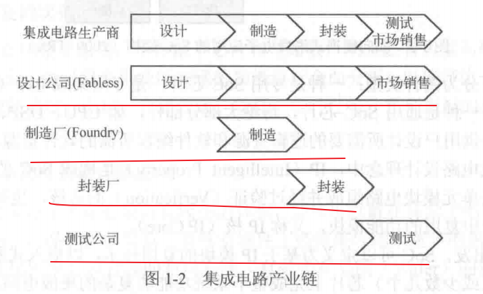
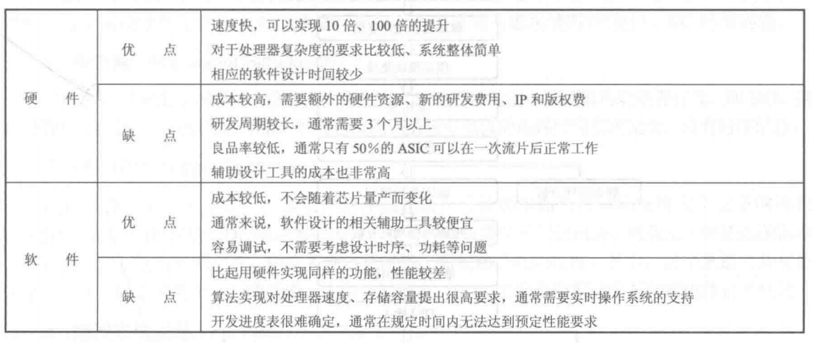
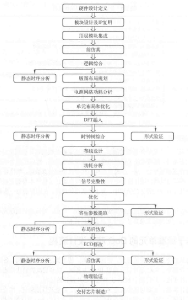

# SoC Design and Implementation

# Chapter 1 SoC设计绪论

## 1.1 微电子技术概述

### 1.1.1 集成电路的发展

集成电路的发展总共分为6个阶段:

```
第一阶段:1962年制造的包含12个晶体管的小规模集成电路(SSI, Small-Scale Integration);
第二阶段:1966年发展的集成度为100-1000个晶体管的中规模集成电路(MSI, Medium-Scale Integration);
第三阶段:1967-1973年,研制出的集成度为1000-10w个晶体管的大规模集成电路(LSI, Large-Scale Integration);
第四阶段:1977年研制出的在30平方毫米的硅晶片上集成15w个晶体管的超大规模集成电路(VLSI, Very Large-Scale Integration);
第五阶段:1993年研制成功的集成了1000w个晶体管的16MB FLASH和256MB DRAM,进入了特大规模集成电路(ULSI, Ultra Large-Scale Integration);
第六阶段:1994年研制成功的集成了1亿个晶体管的1GB DRAM,进入了巨大规模集成电路(GSI, Giga Scale Integration)时代.
```

几个专业名词:

```
SoC(System on Chip):系统级芯片;
SiP(System-in-Package):系统级封装.
```

### 1.1.2 集成电路产业分工

#### 1.1.2.1 以生产为导向的初级阶段

20世纪60年代为半导体产业的初级阶段,此时半导体制造为主,IC为辅.

```
e.g. 以仙童(Fairchild)公司为典型,不仅生产晶体管、集成电路,而且制造生产所需的设备.
```

#### 1.1.2.2 Foundry与Fabless设计公司的崛起

**1.Fabless**

Fabless是半导体集成电路行业中无生产线的设计公司的简称.

```
1.Fabless开拓出市场后进行产品设计;
2.将设计成果外包给Foundry厂家进行芯片生产;
3.生产出来的芯片经过封装测试后由设计公司进行销售.
```

**2.Foundry**

Foundry是芯片代工厂的简称.

```
Foundry不搞设计,也没有自己的IC产品,它为Fabless提供完全意义上的代工,使Fabless可以放心的将产品交给Foundry而无须担心知识产权外流.
```

**3.EDA**

EDA(Electronic Design Automation):电子设计自动化.

#### 1.1.2.3 "四业分离"的IC产业

IC产业进一步细分为:设计、制造、封装、测试.



## 1.2 SoC概述

**1.IP核**

IP(Intelligent Property):知识产权.是构成SoC的基本单元.

```
IP是指由各种超级宏单元模块电路组成并经过验证(Verification)的芯核.一般理解为能在设计中复用的功能模块,也称IP核(IP Core).
```

**2.时序收敛**

时序收敛一般指前后端设计时序能达到设计需求.

DFM:集成电路可制造性设计.

**3.ESL**

ESL(Electronic System Level):电子系统级.利用系统级建模,可以有效的进行设计空间的探测(Design Space Exploration),进而快速得到优化的系统架构.

```
1.ESL设计可以使设计工程师能够及早进行软件开发,实现快速设计和派生设计、快速硬件验证及快速硬件/软件(HW/SW)验证;
2.还提供可以用来验证下游RTL实现是否符合系统规范的功能测试平台;
3.TLM(Transaction Level Modeling):事务级模型.可以分为3种:
	没有时序信息的模型(e.g. ARM的FastModel);
	周期近似的模型;
	精确时序的模型.
```

# Chapter 2 SoC设计流程

## 2.1 软硬件协同设计

同样的功能软硬件实现的优缺点如下:



## 2.2 SoC芯片设计流程




### 2.2.1 硬件设计定义说明(Hardware Design Specification)

硬件设计定义说明描述了芯片总体架构、规格参数、模块划分、使用的总线,以及各模块的详细定义等.

### 2.2.2 模块设计及IP复用(Module Design & IP Reuse)


