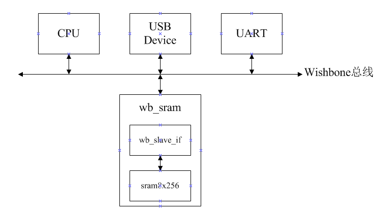

# SystemC Leaning

***

## Chapter 1 前言

### 1.1 SystemC的入门

现代片上系统的设计之难源于其复杂性,复杂性催生SystemC(系统级设计语言)和电子系统级设计(Electronic System Level, ESL)方法学.

**1.系统级仿真**

	1.目的:确认设计的体系架构是否恰当、总线是否能够满足吞吐量和实时性要求以及存储器是否被浪费;
	2.时间:系统级仿真先于RTL设计;
	3.语言:一般使用UML,C,C++等.

**2.RTL级设计**

	1.RTL:Register Transfer Level,寄存器传输级;
	2.语言:VHDL和Verilog HDL;
	3.特点:在系统级仿真后面,由于系统级设计使用C/C++,因此需要手工从C/C++代码转换成VHDL/Verilog HDL代码;
	4.效率:手工编写RTL代码效率不高.

**3.ESL设计**

	1.ESL:Electronic System Level,电子系统级设计;
	2.语言:SystemC和C/C++,SystemC是C++的扩展库;
	3.特点:可以进行系统级仿真,速度快,且语言基于现有语言,环境、编译和调试工具可以复用现有的,效率高.

**4.SystemC和System Verilog的使用范围**

	1.SystemC:特别适合于建模体系结构,开发事物处理级(TL)模型和在验证中描述软件的行为;
	2.System Verilog:是进行RTL设计的最佳语言.

### 1.2 一个"Hello, SystemC!"建模实例

	/*1.类定义*/
	#include <iostream>
	#include "systemc.h"	//SystemC的头文件
	SC_MODULE(hello) {
	/*
	SC_MODULE是SystemC中定义的一个宏,表示生成一个类.括号中的"hello"即为类名.
	*/
		SC_CTOR(hello) {
		/*
		SC_CTOR也是一个宏.表示生成构造函数.括号中的"hello"为构造函数名,与类名相同.
			cout << "Hello, SystemC!" << endl;
		*/
		}
	};

	/*2.SystemC的main函数*/
	int sc_main(int argc, char *argv[]) {
		/*sc_main相当于C的main函数,即为入口函数*/
		hello h("hi");	//hello为之前定义的类名,构造一个实例对象
		return 0;
	}

### 1.3 一个二输入与非门建模实例

**1.nand2.h**

	#ifndef __NAND2_H__
	#define __NAND2_H__
	
	#include <systemc.h>
	SC_MODULE(nand2) {
		sc_in<bool> A;		//输入信号A
		sc_in<bool> B;		//输入信号B
		sc_out<bool> F;		//输出信号F
		void do_nand() {
			F = !(A & B);	//与非,得到F的值
		}
	
		SC_CTOR(nand2) {
			SC_METHOD(do_nand);		//SC_METHOD(do_nand):表示进程do_nand
			sensitive << A << B;	//进程do_nand对A,B信号敏感.一旦A,B信号发生变化,则会调用进程一次
		}
	};
	
	#endif

**2.testbench定义**

	#ifndef __TB_H__
	#define __TB_H__
	#include <iostream>
	#include <systemc.h>
	
	SC_MODULE(tb) {
		sc_out<bool> a, b;
		sc_in<bool> f;
		sc_in_clk clk;
		void gen_input(){
			wait(); a = 0; b = 0;
			wait(); a = 0; b = 1;
			wait(); a = 1; b = 0;
			wait(); a = 1; b = 1;
			wait(100);
		}
	
		void display_variable(){
			cout << "a = " << a << ", b = " << b << ", f = " << f << endl;
		}
	
		SC_CTOR(tb){
			SC_CTHREAD(gen_input, clk.pos());
			/*
			SC_CTHREAD(gen_input, clk.pos()):表示含有进程gen_input,且该进程会有clk.pos时钟的上升沿
				触发.
			*/
			SC_METHOD(display_variable); //SC_METHOD(display_variable):表示进程display_variable
			sensitive << f << a << b;
			//进程display_varialbe对f,a,b信号敏感.一旦发生变化,则会调用一次
			dont_initialize();	//不要在仿真零时刻调用进程display_variable,会出错
		}
	};
	
	#endif

**3.测试程序**

	#include <systemc.h>
	#include "nand2.h"
	#include "tb.h"
	
	int sc_main(int argc, char *argv[])
	{
		sc_signal<bool> a, b, f;	//初始值a,b,f均为0
		sc_clock clk("clk", 20, SC_NS);
		nand2 N2("nand2");
		N2.A(a);	//完成端口绑定.N2.A <---> tbl.a
		N2.B(b);	//完成端口绑定.N2.B <---> tbl.b
		N2.F(f);	//完成端口绑定.N2.F <---> tbl.f
	
		tb tbl("tb");
		tbl.clk(clk);
		tbl.a(a);	//端口绑定
		tbl.b(b);	//端口绑定
		tbl.f(f);	//端口绑定
		sc_trace_file *tf = sc_create_vcd_trace_file("nand2");	//sc_trace保存波形文件
		sc_trace(tf, N2.A, "A");
		sc_trace(tf, N2.B, "B");
		sc_trace(tf, N2.F, "F");
		sc_start(200, SC_NS);
		sc_close_vcd_trace_file(tf);
		sc_start(200, SC_NS);
		return 0;
	}

**4.结果**

	a = 0, b = 0, f = 1
	a = 0, b = 1, f = 1
	a = 1, b = 0, f = 1
	a = 1, b = 1, f = 1		//不能理解,难道是因为刚好处在翻转的位置???
	a = 1, b = 1, f = 0

***

## Chapter 2 SystemC基本语法

### 2.1 一个典型的SystemC的程序设计

设计一个宽8位,深256的静态存储器的基本模型.

**头文件定义**

	//sram8x256.h
	#ifndef __SRAM8x256_H__
	#define __SRAM8x256_H__

	#include "systemc.h"
	#include "assert.h"
	
	SC_MODULE(sram8x256)	//模块定义,类似类定义
	{
		sc_in_clk clk;			//输入时钟
		sc_in<bool> wr_en;		//写使能输入端口
		sc_in<sc_uint<8>> wr_data;	//写数据输入端口
		sc_in<sc_uint<8>> addr;		//读写地址输入
		sc_out<sc_uint<8>> rd_data;	//读数据输出端口

		void main()	//进程
		{
			rd_data.write(mem[addr.read()]);
			/*
				addr.read():将地址读出来,为8-bit的地址;
				mem[addr.read()]:取读到地址的数据;
				rd_data.write(mem[addr.read()]):将取到地址的数据写入到读数据输出端口
			*/
			if (wr_en.read())	//读到写数据使能
			{
				mem[addr.read()] = wr_data.read();
				/*
					wr_data.read():将写数据输入端口的数据读出来
					mem[addr.read()]:取读到地址的数据,准备重新赋值.
					mem[addr.read()] = wr_data.read():赋值.
				*/
				//写入到输入的地址
			}
		}

		SC_CTOR(sram8x256)
		{
			mem = new sc_uint<8>[256];	//分配8x256的空间
			assert(mem != NULL);	//断言可以分配到空间
			for (int i = 0; i < 256; ++i)
				mem[i] = 0;	//初始化
			SC_METHOD(main);	//创建方法进程
			sensitive << clk.pos();	//产生激励,上升沿触发
		}

		~sram8x256()
		{
			if (mem) {
				delete mem;	//释放申请的内存
				mem = 0;
			}
		}
	private:
		sc_uint<8> *mem;	//私有mem变量
	};

	#endif

### 2.2 SystemC头文件

**1.sc\_core和sc_dt**

sc_core和sc_dt是SystemC核心库中包括的两个最基本和重要的名字空间.

	sc_core:System基本的内核空间;
	sc_dt:定义了SystemC的基本数据类型

**2."systemc"和"sytemc.h"的区别**

	#include "systemc"	//仅将sc_core和sc_dt包括到目标设计中
	#include "systemc.h"	//包括SystemC所有的名字空间.--->一般用这个即可

### 2.3 模块

#### 2.3.1 模块定义

**1.使用SC_MODULE定义**

	1.定义方法
	SC_MODULE(sram8x256)	//括号中为模块名字,类似类名
	{
		...
	};
	2.SC_MODULE解析(SC_MODULE就是一个宏,内部由结构体实现)
	#define SC_MODULE(module_name) \
		struct module_name : public sc_module
	3.特点
		1.SC_MODULE模块定义其实就是一个C++结构体;
		2.SC_MODULE模块定义中的成员都是public的,除非明确说明是private.

**2.使用struct定义**

	struct sram8x256 : public sc_module	//必须继承自sc_module,与SC_MODULE实现一致.
	{
		...
	};
	//内部成员默认是public,不需要放开的可以声明为public

**3.使用class定义--->使用比较多**

	class sram8x256 : public sc_module //必须继承自sc_module
	{
		...
	};
	//内部成员默认是private.

PS:struct内部成员默认是public,class内部成员默认是private.

#### 2.3.2 模块的构造函数和析构函数

**1.使用SystemC的构造函数方法**

	SC_CTOR(sramx256)	//SC_CTOR:构造函数标识符.括号中的为构造函数名,必须与SC_MODULE()名字相同.
	{
		mem = new sc_uint<8>[256];
		assert(mem != NULL);
		for (int i=0; i<256; i++)
			mem[i] = 0;
		SC_METHOD(main);
		/*
			SC_METHOD(main)：创建进程main
			SC_METHOD/SC_CTHREAD()/SC_THREAD():三个创建进程的方法
		*/
		sensitive << clk.pos();
		/*
			创建进程的敏感表.此处表示进程main对时钟上升沿敏感,(pos)在每个时钟的上升沿,main函数被执行一次.
		*/
	}

**2.使用class的构造函数方法**

使用class的构造方法必须在源代码中声明:SC\_HAS_PROCESS(构造函数名).

使用class实现sram8x256:

	#ifndef __SRAM8x256_H__
	#define __SRAM8x256_H__
	#include "systemc.h"
	#include "assert.h"
	class sram8x256 : public sc_module	//必须继承自sc_module
	{
	public:
		sc_in_clk clk;
		sc_in<bool> wr_en;
		sc_in<sc_uint<8>> wr_data;
		sc_in<sc_uint<8>> addr;
		sc_out<sc_uint<8>> rd_data;

		void main()
		{
			rd_data.write(mem[addr.read()]);
			if(wr_en.read())
				mem[addr.read()] = wr_data.read();
		}

		SC_HAS_PROCESS(sram8x256);	//表示含有构造函数sram8x256
		sram8x256(sc_module_name _name) : sc_module(_name)
		{
			/*
				class的构造函数必须带一个sc_module_name类型的参数,表示模块名(为一个常量字符串).
				然后将该参数传递给sc_module参数.
			*/
			mem = new sc_uint<8> [256];
			assert(mem != NULL);
			for (int i=0; i<256; i++)
				mem[i] = 0;
			SC_METHOD(main);
			sensitive << clk.pos();
		}

		~sram8x256()	//析构函数直接使用C++形式即可
		{
			if(mem)
			{
				delete mem;
				mem = NULL;
			}
		}
	private:
		sc_uint<8> *mem;
	};
	#endif

### 2.4 端口和信号

#### 2.4.1 端口和信号的定义

**1.端口分类**

	输入端口:sc_in< ... >表示;	//<...>中间的为端口数据类型
	输出端口:sc_out< ... >表示;
	双向端口:sc_inout< ... >表示.
	//read()/write()都是基本端口类型(sc_in,sc_out,sc_inout)的方法.

绑定:端口与端口之间的连接称为绑定.

**2.端口数据类型**

	1.C++数据类型:long, int, char, short, float, double;
	2.SystemC专有类型:sc_int<n>, sc_uint<n>, sc_bitint<n>, sc_biguint<n>, sc_bit, sc_logic,
		sc_bv<n>, sc_lv<n>, sc_fixed, sc_ufixed, sc_fix, sc_ufix;(其中的n表示数据有n-bit);
	3.结构体类型:
		typedef struct _frame {
			...
		}frame;
	4.抽象类型(class中使用virtual = 0(纯虚函数)定义):
		class direct_if : public virtual sc_interface
		{
		public:
			virtual bool direct_read(int *data, unsigned int addr) = 0;
			virtual bool direct_write(int *data, unsigned int addr) = 0;
		};
		/*
			抽象端口定义:
			sc_port<direct_if> arbitor_port;
		*/

**3.端口和信号定义方法**

	sc_in_clk clk;				//时钟信号定义
	sc_in<bool> wr_en;			//输入端口定义
	sc_out<sc_uint<8>> rd_data;	//输出端口定义
	sc_in<sc_logic> a[32];		//端口向量(声明a[0]~a[31]这32个端口)
	sc_signal<sc_logic> addr[16];	//信号定义.声明addr[0]~addr[15]这16个信号

#### 2.4.2 延迟Δ

模块1的进程1和模块2的进程2通过信号D进行通信,使用相同的时钟clk上升沿.

	1.进程1:在T1时刻,进程1将信号D赋值为1,但需要等到T1+Δ时刻D的值才会被更新为1;
	2.进程2:在T1时刻,进程2读取信号D的值,此时读到的值为0.
	这种操作实现了赋值和更新的分离,保证软件仿真和硬件行为的一致性.

实例:

	void main()
	{
		rd_data.write(mem[addr.read()]);
		if (wr_en.read())
			mem[addr.read()] = wr_data.read();
	}
	/*
		该函数由时钟的上升沿触发,读到所有端口的值都是触发前一时刻的各信号的值(即更新前的值).
		符合硬件的特点.经过Δ之后,所有操作已经完成,值被更新.
	*/

#### 2.4.3 端口和信号的多驱动处理

SystemC建模较少使用--->略.

#### 2.4.4 端口和信号的绑定

一个USB转串口的简单SoC如下图所示:

	1.处理器、USB设备、串口UART和wb_sram模块同时连接到Wishbone总线;
	2.总线位宽8-bit,wb_sram存储程序代码和数据,该模块是一个Wishbone的从设备模块,由子模块wb_slave_if和
		sram8x256组成.

