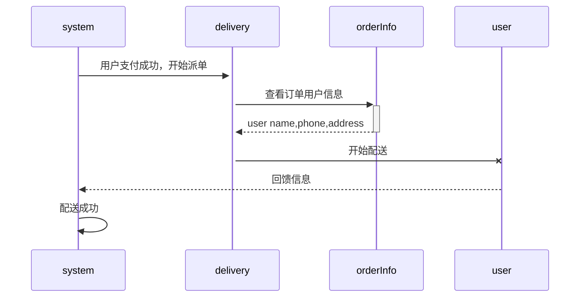

# Typora Usage

## 1. Typora下载及安装

### 1.1 Typora下载

[Typora官网](https://typora.io/)

[Windows版本下载地址](https://www.typora.io/windows/typora-setup-x64.exe)

### 1.2 Typora安装

安装略.

## 2. Typora基本语法

基于语法与Markdown类似,此处省略.

## 3. Typora插入表格

	Ctrl+T--->弹出"插入表格"对话框,输入行、列即可.

| aaa  |      |      |
| ---- | ---- | ---- |
| bbb  |      |      |
| ccc  |      |      |

## 4. 插入流程图

### 4.1 画一个简单的流程图

​	输入: ```mermaid--->会有一个输入框,输入框顶格输入下面代码即可显示一个简单的流程图.

​	graph LR;

​		A-->B;	//是"-->",只有两个短线.后面的";"是必须的.

​		A-->C;

​		B-->D;

​		C-->D


### 4.2 mermaid画sequence diagram




