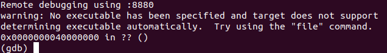

# Ubuntu & Qemu usage

# Chapter 1. Ubuntu 18.04工具安装

## 1.1 vim软件的安装

	sudo apt-get install vim
	echo $?		//返回0表示软件安装成功;非0表示出现了问题.

## 1.2 检查软件更新情况并将软件进行更新

	1.sudo apt-get update
	/*
		更新/etc/apt/sources.list和/etc/apt/sources.list.d中列出的源的地址.这样才能获取到最新的
		软件包.
	*/
	2.sudo apt-get upgrade
	/*
		升级已安装的所有软件包,将本地的软件版本与update文件更新的版本进行对比从而进行相关升级.因此,
		执行upgrade之前一定要执行update,这样才能保证更新到最新.
	*/

## 1.3 "net-tools"安装

**1.问题**

刚安装的linux可能在执行"ifconfig"时,没有这个命令.报如下的错误:

	Comand "ifconfig" not found, but can be installed with:
		apt install net-tools
	PS:即没有ifconfig命令.

**2.解决**

	apt install net-tools

## 1.4 git安装

	sudo apt-get install git

注意点:
	1.查看git的版本:
	git --version
	2.sudo apt-get下载的文件的目录:
		/var/cache/apt/archives		//但是使用"sudo apt-get install git"没有发现文件
	3.文件下载的目录可以在"/etc/apt/source.list"中指定  --->还没有发现真正的用途

## 1.5 gcc安装及版本切换

### 1.5.1 自动下载安装gcc

**1.普通的gcc/g++**

	sudo apt-get install gcc-arm-linux-gnueabi
	/*
		一般会下载最新版本gnu交叉编译工具,最新版本gnu对Linux也是有版本支持的.
		本人安装的18.04版本的ubuntu自动下载的的gcc版本为"version 7.4.0",不支持3.16版本的linux
		(会出现很多error),需要使用4.x版本的linux.
	*/
	sudo apt-get install g++-arm-linux-gnueabi	//安装g++

**2.aarch64的gcc/g++**

	sudo apt-get install gcc-aarch64-linux-gnu
	sudo apt-get install g++-aarch64-linux-gnu

### 1.5.2 手动安装gcc及版本切换--->该种方法更好,有gdb调试工具

主要针对需要不同版本的gcc,可以切换gcc版本.

#### 1.5.2.1 aarch32的gcc/gdb版本手动安装

**1.gcc下载地址**

[arm-linux-gcc历史版本下载地址](https://releases.linaro.org/components/toolchain/binaries/)

	Linaro的官网(https://www.linaro.org/downloads/)--->拉到下面的"Linaro Toolchain"--->
		点击"GNU cross-toolchain binary archives"--->弹出页面中可以选择历史版本.

**2.版本切换方法**

	//Ubuntu 18.04.2 LTS默认会使用gcc version 7.3.0.如果要切换为4.9.4的版本
	1.下载4.9.4的gcc版本
		网址"https://releases.linaro.org/components/toolchain/binaries/"--->选择"4.9-2017.01"
		--->选择"arm-linux-gnueabi"--->选择"gcc-linaro-4.9.4-2017.01-i686_arm-linux-
			gnueabi.tar.xz"
	2.解压
		tar -xvJf gcc-linaro-4.9.4-2017.01-i686_arm-linux-gnueabi.tar.xz
		mv gcc-linaro-4.9.4-2017.01-i686_arm-linux-gnueabi arm-linux-gcc arm-linux-gcc
		mv arm-linux-gcc /home/defychen/
		PS:gcc的编译器在目录"/home/defychen/arm-linux-gcc/bin/"
	3.修改.bashrc/profile
		1.仅在当前目录下有效方法:
			1.打开/root/.bashrc(root用户)和/home/defychen/.bashrc(普通用户)文件,增加下面信息:
				export PATH=/home/defychen/arm-linux-gcc/bin:$PATH
				//放在PATH环境变量的前面,可以保证肯定有效;放在后面如果PATH变量中有gcc版本,则后面的不会用
			2.让路径生效
				source /root/.bashrc
				source /home/defychen/.bashrc
		2.开机就有效(一直有效)方法:
			在/etc/profile中写入:
				export PATH=/home/defychen/arm-linux-gcc/bin:$PATH
				source /etc/profile	//如果开机,会先扫描该文件.并使能该路径

**3.gcc版本查看**

终端输入:

	arm-linux-gnueabi-gcc -v
	arm-linux-gnueabi-gcc --version

**4.g++编译实例---gcc类似的**

1.源文件hello.cpp

	#include <iostream>
	using namespace std;
	
	int main(int argc, char *argv[])
	{
		cout << "hello world" << endl;
		return 0;
	}

2.编译

	1.编译出可执行程序
		g++ hello.cpp -o hello
	2.编译出带调试信息的可执行程序	
		g++ -g hello.cpp -o hello.debug		//执行./hello.debug即可
	3.仅编译,不链接(编译出目标文件.o)
		g++ -c hello.cpp hello.o
	4.编译出动态链接库(也叫共享库文件,即.so)--->由.o编译成.so
		g++ -shared -fPCI -o hello.so hello.o
	5.编译出静态库(即.a)--->由.o压缩成.a
		ar -r hello.a hello.o
	6.以c++11编译
		g++ test.cpp -o test -std=c++11
		g++ test.cpp -o test -std=c++0x

#### 1.5.2.2 aarch64的gcc/gdb版本手动安装

**1.gcc/gdb下载地址**

[arm-linux-gcc历史版本下载地址](https://releases.linaro.org/components/toolchain/binaries/)

	Linaro的官网(https://www.linaro.org/downloads/)--->拉到下面的"Linaro Toolchain"--->
		点击"GNU cross-toolchain binary archives"--->弹出页面中可以选择历史版本.

**2.选择版本**

	//选择7.5的版本
	1.下载7.5的gcc/gdb版本
		网址"https://releases.linaro.org/components/toolchain/binaries/"
			--->选择"7.5-2019.12"
			--->选择"aarch64-linux-gnu"
			--->选择"gcc-linaro-7.5.0-2019.12-x86_64_aarch64-linux-gnu.tar.xz"
			PS:下载下来的可能显示为"xxx.tar.tar",只是后缀变了,本质还是xxx.tar.xz文件,改一下后缀即可.
	2.解压
		cd /home/defychen/repository_software
		mv gcc-linaro-7.5.0-2019.12-x86_64_aarch64-linux-gnu.tar.tar 
			gcc-linaro-7.5.0-2019.12-x86_64_aarch64-linux-gnu.tar.xz //如果后缀被改
		mv gcc-linaro-7.5.0-2019.12-x86_64_aarch64-linux-gnu.tar.xz /home/defychen/toolchain
		cd /home/defychen/toolchain
		tar -xvJf gcc-linaro-7.5.0-2019.12-x86_64_aarch64-linux-gnu.tar.xz
		PS:gcc/gdb在目录"/home/defychen/toolchain/gcc-linaro-7.5.0-2019.12-x86_64_aarch64-linux
			-gnu/bin/"
	3.修改.bashrc/profile
		1.仅在当前目录下有效方法:
			1.打开/root/.bashrc(root用户)和/home/defychen/.bashrc(普通用户)文件,增加下面信息:
				export PATH="/home/defychen/arm-linux-gcc/bin:$PATH"
				//放在PATH环境变量的前面,可以保证肯定有效;放在后面如果PATH变量中有gcc版本,则后面的不会用
			2.让路径生效
				source /root/.bashrc--->root用户
				source /home/defychen/.bashrc--->如果为普通用户
		2.开机就有效(一直有效)方法:
			在/etc/profile中写入:
				export PATH="/home/defychen/arm-linux-gcc/bin:$PATH"
				source /etc/profile	//如果开机,会先扫描该文件.并使能该路径
	4.查看下环境变量
		echo $PATH	//可以看到path的路径
	5.测试gdb是否可用
		aarch64-linux-gnu-gdb	//显示可用

## 1.6 ubuntu版本查看

	1.cat /proc/version		//可以显示当前Linux的版本及gcc的版本信息
	2.uname -a				//也会显示当前Linux的版本,还有当前用户名
	3.lsb_release -a			//会显示当前Ubuntu版本"Ubuntu 18.04.2 LTS"

## 1.7 rar/unrar工具的安装

如果需要解压的包为.rar格式,则需要使用unrar命令:

	sudo apt-get install rar unrar

rar/unrar命令的使用:

	1.rar创建一个*.rar包:
	rar a test.rar test.jpg test.png	//将test.jpg和test.png压缩成一个rar包
	2.unrar解压一个*.rar包:
	unrar e test.rar	//解压在当前目录
	unrar x test.rar test	//解压到test目录下
	3.rar和unrar的使用帮助:
	rar -?
	unrar -?

## 1.8 wine的安装及使用

### 1.8.1 安装wine

	apt-get install wine64	//安装64-bit的wine.一般还需要安装wine32
	dpkt --add-architecture i386 	//添加i386体系结构
	apt-get upgrade	//更新包
	apt-get install wine32

### 1.8.2 使用wine

	wine *.exe

## 1.9 python的安装

### 1.9.1 python的安装

**1.安装python2.x**

	apt install python		//安装python2
	启动方法: python

**2.安装python3.x**

	apt install python3		//安装python3
	启动方法: python3

### 1.9.2 python的pip工具的安装

	apt install python-pip

## 1.10 linux源码下载地址

[国内下载地址](http://ftp.sjtu.edu.cn/sites/ftp.kernel.org/pub/linux/kernel/)

	国内下载地址速度快很多.

[官网地址](https://www.kernel.org/pub/linux/kernel/)

	官网下载很慢.

## 1.11 更改软件源(使用阿里云的源)

ubuntu经常会需要执行更新操作,使用官方的软件源更新会很慢.因此需要更改软件源为国内,这样更新会快很多.

	打开/etc/apt/sources.list文件,在该文件开头添加以下内容:

[aliyun相关的镜像](https://developer.aliyun.com/mirror/)

### 1.11.1 Ubuntu 14.04.5 LTS的源

	deb https://mirrors.aliyun.com/ubuntu/ trusty main restricted universe multiverse
	deb-src https://mirrors.aliyun.com/ubuntu/ trusty main restricted universe multiverse
	deb https://mirrors.aliyun.com/ubuntu/ trusty-security main restricted universe multiverse
	deb-src https://mirrors.aliyun.com/ubuntu/ trusty-security main restricted universe multiverse
	
	deb https://mirrors.aliyun.com/ubuntu/ trusty-updates main restricted universe multiverse
	deb-src https://mirrors.aliyun.com/ubuntu/ trusty-updates main restricted universe multiverse
	
	deb https://mirrors.aliyun.com/ubuntu/ trusty-backports main restricted universe multiverse
	deb-src https://mirrors.aliyun.com/ubuntu/ trusty-backports main restricted universe multiverse
	
	## Not recommended
	# deb https://mirrors.aliyun.com/ubuntu/ trusty-proposed main restricted universe multiverse
	# deb-src https://mirrors.aliyun.com/ubuntu/ trusty-proposed main restricted universe multiverse

### 1.11.2 Ubuntu 16.04 LTS的源

	deb http://mirrors.aliyun.com/ubuntu/ xenial main
	deb-src http://mirrors.aliyun.com/ubuntu/ xenial main
	
	deb http://mirrors.aliyun.com/ubuntu/ xenial-updates main
	deb-src http://mirrors.aliyun.com/ubuntu/ xenial-updates main
	
	deb http://mirrors.aliyun.com/ubuntu/ xenial universe
	deb-src http://mirrors.aliyun.com/ubuntu/ xenial universe
	deb http://mirrors.aliyun.com/ubuntu/ xenial-updates universe
	deb-src http://mirrors.aliyun.com/ubuntu/ xenial-updates universe
	
	deb http://mirrors.aliyun.com/ubuntu/ xenial-security main
	deb-src http://mirrors.aliyun.com/ubuntu/ xenial-security main
	deb http://mirrors.aliyun.com/ubuntu/ xenial-security universe
	deb-src http://mirrors.aliyun.com/ubuntu/ xenial-security universe

### 1.11.3 Ubuntu 18.04 LTS的源(19.04可以使用)

	deb http://mirrors.aliyun.com/ubuntu/ bionic main restricted universe multiverse
	deb-src http://mirrors.aliyun.com/ubuntu/ bionic main restricted universe multiverse
	
	deb http://mirrors.aliyun.com/ubuntu/ bionic-security main restricted universe multiverse
	deb-src http://mirrors.aliyun.com/ubuntu/ bionic-security main restricted universe multiverse
	
	deb http://mirrors.aliyun.com/ubuntu/ bionic-updates main restricted universe multiverse
	deb-src http://mirrors.aliyun.com/ubuntu/ bionic-updates main restricted universe multiverse
	
	deb http://mirrors.aliyun.com/ubuntu/ bionic-proposed main restricted universe multiverse
	deb-src http://mirrors.aliyun.com/ubuntu/ bionic-proposed main restricted universe multiverse
	
	deb http://mirrors.aliyun.com/ubuntu/ bionic-backports main restricted universe multiverse
	deb-src http://mirrors.aliyun.com/ubuntu/ bionic-backports main restricted universe multiverse

/etc/apt/sources.list表示apt install时,ubuntu会从这些站点下载软件包到本地并进行安装.

## 1.12 安装u-boot-tools

uboot-tools是将Image转成u-boot可以引导的镜像文件格式.

安装方法:

	apt install u-boot-tools

## 1.13 安装tree

tree用于查看目录结构,默认是不安装的.

	apt install tree

***

# Chapter 2. Ubuntu 18.04问题方法

## 2.1 忘记root密码解决办法

**方法 1**

如果用户具有sudo权限:

	1.sudo su root	//通过sudo直接切换到root用户
	2.passwd		//重新更改root密码
	/*
		提示:输入新的UNIX密码->重新输入新的UNIX密码->更改root密码成功.
	*/

**方法 2**

用户不具备sudo权限,需要进入GRUB修改kernel镜像启动参数,此处暂时略.

## 2.2 root用户和普通用户的切换

1.切换到root用户

	1.su root	//切换到root用户,输入root用户密码即可.仍然停在当前目录
	2.su -		//切换到root用户,输入root用户密码即可.同时切换到当前用户的home目录.

2.切换到普通用户

	su defychen		//切换到defychen用户(defychen为普通用户名).

## 2.3 关于Ubuntu中出现"Could not get lock /var/lib/dpkg/lock"解决方案

**1.问题**

1.当执行"apt install python-pip(安装python的pip程序,以便可以pip install xxx)"时出错:

2.当执行"apt-get install gcc-arm-linux-gnueabi":下载并安装包时出错:

	E: Could not get lock /var/lib/dpkg/lock - open (11: Resource temporarily unavailable)
	E: Unable to lock the administration directory (/var/lib/dpkg/), is another process
	using it?

**2.原因**

简单描述为:apt还在运行,/var/lib/apt/lists、/var/lib/dpkg、/var/cache/archives会被锁定.导致其他apt操作不会成功.

	出现这个问题可能是有另一个程序正在运行,导致资源被锁不可用.而导致资源被锁的原因可能是上次运行安装或
	更新时没有正常完成,进而出现此状况.

**3.解决办法**

1.查找所有apt相关进程,并杀死:

	1.查找apt相关进程
	ps afx | grep apt
	 3284 pts/0    S+     0:00          \_ grep --color=auto apt
		//该进程自带,不能被kill.后面两个进程需要kill掉.
	 2869 ?        Ss     0:00 /bin/sh /usr/lib/apt/apt.systemd.daily install
	 2873 ?        S      0:00  \_ /bin/sh /usr/lib/apt/apt.systemd.daily lock_is_held install
	2.杀掉apt相关进程
		kill -9 2873
		kill -9 2869

2.删掉锁定的文件:

	1.删除对应目录下的锁文件:
		rm -rf /var/lib/dpkg/lock
	2.强制重新配置软件包:
		dpkg --configure -a
	3.更新软件包源文件
		apt update

**4.重新安装包文件即可**

	1.再次执行"apt install python-pip"	//如果安装python pip
	2.执行"apt-get install gcc-arm-linux-gnueabi"	//安装交叉编译工具链

## 2.4 Ubuntu 18.04无法连接到WiFi的解决方案

Ubuntu18.04安装后可能会出现找不到Wifi,不能连接到Wifi.

### 2.4.1 插入网线,使用DSL宽带拨号上网

因为需要联网下载一些东西:

**1.创建一个连接点**

	1.点击桌面左边的"文件"菜单(一个图标),打开一个类似Windows资源管理器的东西;
	2.选择"其他位置",出现"计算机",依次点选"计算机"->usr->share->applications->
		选择"Network Connections",弹出"网络连接窗口";
	3.点击"以太网"->点击左下角的"+",增加一个以太网连接,出现的选择连接类型:选择"DSL/PPPoE",点击创建.
		弹出一个"编辑DSL连接"的窗口;
	4.在"DSL/PPPoE"页面中填写以下设置:
		Parent interface:选择网卡"enp3s0"--->Ubuntu 18.04网卡变成了enp3s0
		PPP界面:不填写
		用户名:输入网络的账户(e.g.1001)
		服务:不填写
		密码:输入网路的密码(e.g.21004)		
	  在"常规"页面中勾选前两个选项:
		1.勾选"可用时自动链接到这个网络";
		2.勾选"所有用户都可以连接到这个网络"
	5.点击保存即可.

**2.连接到网络**

第一步设置好之后右上角就会出现"有线连接"的标识,但是带一个问号.

	打开ubuntu的设置->选择"网络":
		在"有线连接"下面会显示"已连接-100Mb/秒",点击该行右边的"设置"选项->在弹出的"有线"窗口中->
		在详细信息页面中去掉"自动连接"选项->点击应用.
		在"蓝牙"下面的"PPP"变得打开.此时也会自动连上宽带.

### 2.4.2 更改软件源

	点击桌面左下角的"显示应用程序"->选择"软件和更新"->在"Ubuntu软件"的页面中更改"下载自"的站点为合适的
	站点(本人选择"其他站点"->中国->mirros.huaweicloud.com)->系统可能会自动更新索引,让其更新即可.

### 2.4.3 添加附加驱动

	同样在"软件和更新"里->切换到"附加驱动"选项卡->据说能搜到对应的无线网卡(我的没有,只有网卡驱动会
	在一段时间之后出现,没有也没关系,该步跳过即可).
	PS:需要注意BIOS是否位于UEFI且开启了secure boot,必须把secure boot关掉,因为专用驱动是闭源的.而
	ubuntu是开源的,开源组织认为"闭源系统是不安全的",所以闭源的软件在开启secure boot的时候是不能启用的.
	--->acer笔记本关闭secure boot方法:
		1.F2进入到BIOS;
		2.切换到"Security",然后按"↓"箭头,选择"Set Supervisor Password",设置管理员密码(也是超级用户
		密码),该密码今后在进入BIOS时需要输入.我设置了acer的密码为"123456";
		3.然后切换到"Boot",按键盘的按"↓"箭头选择Secure Boot,回车在弹出的界面中点击Disabled;
			--->但是我的acer电脑没有secure boot这个选项...
		4.保存退出.
		PS:我没有设置成功secure boot也没有关系.可以跳过该步. 

### 2.4.4 安装bcmwl-kernel-source

2.4.3步可能执行不成功.在终端(调出终端窗口快捷键:Ctrl+Alt+T)执行下面的命令:

	sudo apt-get update
	sudo apt-get install bcmwl-kernel-source
	/*
	用于安装无线网卡驱动,网卡属于Broadcom,查看所有的pci设备(包括无线网卡):
		lspci	//显示pci设备
		如果出现"Ethernet Controller:: Broadcom Limited Netlink BCM57780 Gigabit Ethernet PCIe
			...",即表示网卡属于Broadcom.
	即属于Broadcom的网卡可用该方法安装驱动.
	*/

这步执行完成后,可能等很长时间就有了Wifi标识.

### 2.4.5 在/etc/modprobe.d/blacklist.con加入命令(我加入了,但是后面又注释掉了)

	1.打开blacklist.conf
		sudo vim /etc/modprobe.d/blacklist.conf
	2.在最后一行加入下面的命令
		blacklist acer-wmi	//加上之后,我后面又注视掉才成功.
	
PS:总结起来,"2.4.4"步最重要.执行完等5-6分钟应该就有Wifi标识了.

## 2.5 Ubuntu 16.04小技巧

1.打开终端操作

	1.打开一个终端
		Ctrl+Alt+T
	2.在一个终端的基础上重新增加一个终端(两个终端并排排列)
		Ctrl+Shift+T
	3.切换终端
		Alt+1	//切换到1终端
		Alt+2	//切换到2终端

2.设置屏幕不息屏

	/* 1.ubuntu 16.04设置方法 */
	点击左上角的设置图标--->选择"System Settings"--->点击"Brightness & Lock"--->在"Turn screen off
		when inactive for":选择"Never"(表示从不息屏)
	/* 2.ubuntu 19.04设置方法 */
	右键--->Settings--->选择"Privacy"--->点击"Screen Lock",将On切换为Off即可.

3.隐藏左侧的菜单项

	/* 1.ubuntu 16.04设置方法 */
	点击左上角的设置图标--->选择"Appearance"--->切换到"Behavior"页--->在"Auto-hide the Launcher"
		选择打开(即ON)即可--->此时左侧的菜单项就会隐藏
	PS:显示左侧菜单项方法:按下"win"键即可显示.
	/* 2.ubuntu 19.04设置方法 */
	右键--->Change Backgound--->Dock--->将"Auto-hide the Dock"打开即可.

4.安装的ubuntu不是全屏

测试发现,在安装了VMWare Tools后,重启虚拟机就是全屏了.

5.问题

	apt-get install vim
	出现下面这个问题:
	ubuntu install :The following packages have unmet dependencies:
	vim: Depends: vim-common(= 2:7.4.1689-3ubuntu1.3)but 2:8.0.1453-1ubuntu1 is to be installed
	原因:
	安装该软件包时它需要指定的版本才能安装上(意思就是版本不兼容).
		e.g.在ubuntu 19.04指定源为16.04的就会出现这个问题.
	解决方法:
	1.切换源为18.04的aliyun;
	2.执行下面命令:
		sudo apt-get purge vim-common
		sudo apt-get update
		sudo apt-get upgrade
		sudo apt-get install vim	//此时可以成功

***

# 3. Qemu usage

Qemu是纯软件实现的虚拟化模拟器,几乎可以模拟任何硬件设备(e.g.Qemu模拟出一台能够独立运行操作系统的虚拟机,虚拟机认为自己在和硬件打交道,但其实是和Qemu模拟出来的硬件打交道,Qemu再将这些指令转译给真正的硬件).

	因为Qemu是纯软件实现的,所有的指令都要经过Qemu,性能非常低.所以,在实际中大多数的做法是配合KVM来完成虚
	拟化工作.因为KVM是硬件辅助的虚拟化技术,主要负责比较繁琐的CPU和内存虚拟化,而Qemu则负责I/O虚拟化,两者
	合作各自发挥优势,相得益彰.

## 3.1 在Ubuntu系统搭建Qemu模拟ARM(一)--->只运行内核和根文件系统

环境:

	Ubuntu:Ubuntu 18.04.2 LTS
	Qemu上运行的内核:Linux 4.8
	Qemu:2.8
	目标系统:以Versatile Express-A9开发板搭建环境

### 3.1.1 Qemu的下载、编译、安装

#### 3.1.1.1 下载Qemu

**1.qemu 2.8下载**

[qemu 2.8下载地址](http://download.qemu-project.org/qemu-2.8.0.tar.xz)

	下载下来的文件为:qemu-2.8.0.tar.xz
	ubuntu下载方法:
		wget http://download.qemu-project.org/qemu-2.8.0.tar.xz

**2.qemu 4.1下载**

[qemu 4.1下载地址](https://download.qemu.org/qemu-4.1.0.tar.xz)

	下载下来的文件为:qemu-4.1.0.tar.xz
	ubuntu下载方法:
		wget https://download.qemu.org/qemu-4.1.0.tar.xz

#### 3.1.1.2 下载并安装Qemu安装时所需要的工具软件包**

	sudo apt-get install zlib1g-dev
	sudo apt-get install libglib2.0-dev
	sudo apt-get install autoconf automake libtool
	sudo apt-get install libsdl1.2-dev
	sudo apt-get install libncurses5-dev	//busybox里执行make menuconfig需要该库
	PS:网上资料说2.7还需要安装下面的包(2.8我安装Qemu时并不需要下面的包),作为一个参考:
	sudo apt-get install libglib2.0-0	//感觉不需要,有了"libglib2.0-dev"
	sudo apt-get install flex bison		//没试过

#### 3.1.1.3 解压Qemu源码包**

**1.qemu 2.8**

	//Ubuntu 18.04下载的Qemu会放在/home/defychen/Downloads/qemu-2.8.0.tar.xz
	cp qemu-2.8.0.tar.xz /root/
	cd /root
	tar -xvJf qemu-2.8.0.tar.xz		//使用-xvJf解压"tar.xz"文件
	cd qemu-2.8.0

**2.qemu 4.1**

	tar -xvJf qemu-4.1.0.tar.xz

#### 3.1.1.4 配置、编译、安装

全部操作均在qemu目录下完成(安装需要root权限,因此最好全部在root下操作):

**1.配置**

1.qemu 2.8配置(通用的配置)--->qemu 2.8好像也支持AArch64,没试过

	配置通用的Qemu编译(e.g.用于Cortex-A9)
	./configure --target-list=arm-softmmu --audio-drv-list=
	/*
		--audio-drv-list必须加,否则运行时会报告有关audio的错误:
		audio:Could not init `oss' audio driver --->我暂时没碰到
	*/

2.qemu 4.0配置(用于AArch64)--->比如A53的核
		
	支持AArch64的配置
	./configure --target-list=aarch64-softmmu	//用于编译AArch64架构

**2.编译(通用的和AArch64一样的编译手法)**

	make
	/*
	编译时,可能出现的问题:
	1."util/memfd.c:43:12:error: static declaration of ‘memfd_create’ follows non-staticdeclaration"
	--->解决办法:
		打开util/memfd.c,将memfd_create函数名重命名为:tmp_memfd_create即可.
	2."qga/commands-posix.c:634: undefined reference to `minor'"
	--->解决方法:
		打开qga/commands-posix.c,在commands.posix.c文件中加上头文件<sys/sysmacros.h>即可.
	*/

**3.安装(通用的和AArch64一样的安装手法)**

	make install	//会安装到系统的"/usr/local/bin/qemu-system-arm"的位置

**4.查看qemu版本**

1.qemu 2.8

	qemu-img -V		//大写的"v",会显示"qemu-img version 2.8.0 xxx"
	qemu-system-arm --version
	/*
		只能用"--version,单纯的"-v"不支持.显示结果为:
		QEMU emulator version 2.8.0 xxx
	*/

2.qemu 4.1

	/* aarch64下的qemu版本查看 */
	qemu-system-aarch64 --version

**5.查看qemu支持的开发板**

1.qemu 2.8

	qemu-system-arm -M help
	/*
		会显示支持的开发板,其中包括:
		vexpress-a15		ARM Versatile Express for Cortex-A15		//支持A15
		vexpress-a9		ARM Versatile Express for Cortex-A9		//支持A9--->支持最好的一个
	*/
2.qemu 4.1

	/* aarch64的查看 */
	qemu-system-aarch64 -M help

### 3.1.2 linux内核编译(在Qemu上运行)

#### 3.1.2.1 下载并安装gnu交叉编译工具

**1.普通的gcc编译工具安装**

	sudo apt-get install gcc-arm-linux-gnueabi
	/*
		一般会下载最新版本gnu交叉编译工具,最新版本gnu对Linux也是有版本支持的.
		本人下载的的gcc版本为"version 7.3.0",不支持3.16版本的linux(会出现很多error),
		需要使用4.x版本的linux.
	*/

**2.aarch64的gcc编译工具安装--->ARMv8平台使用aarch64模式**

	sudo apt-get install gcc-aarch64-linux-gnu

#### 3.1.2.2 内核下载

可以参考前面"1.10 linux源码下载地址"地址进行下载:

	本人下载的地址为:http://ftp.sjtu.edu.cn/sites/ftp.kernel.org/pub/linux/kernel/v4.x/
	下载的版本为:linux-4.8.tar.gz		//因为最新的gnu交叉编译工具仅支持4.x之后的版本的

版本下载原则:

	1.首先到"https://www.kernel.org"查看当前linux版本信息,选择版本为"longterm"的作为下载项;
		e.g.longterm:	4.4.189		//表示linux社区依旧在维护该版本
	2.到"http://ftp.sjtu.edu.cn/sites/ftp.kernel.org/pub/linux/kernel/v4.x/"国内下载源去下载
		对应版本即可.

#### 3.1.2.3 解压

	//Ubuntu 18.04下载的linux会放在/home/defychen/Downloads/linux-4.8.tar.gz
	cp /home/defychen/Downloads/linux-4.8.tar.gz /root/
	cd /root
	tar -xvzf linux-4.8.tar.gz
	/*
	如果要编译aarch64,linux-4.8存在bug,编译不通过.使用linux-4.4.189就没问题了.
		tar -xvzf linux-4.4.189.tar.gz
	*/
	cd linux-4.8
	
#### 3.1.2.4 配置交叉编译器

**1.Cortex-A9的交叉编译器的配置**

	export CROSS_COMPILE=arm-linux-gnueabi-
	export ARCH=arm
	/*
		如果一般用arm架构,且交叉编译器一般不变,可:
		进入linux源代码目录,修改顶层的Makefile(搜索CROSS_COMPILE):
			...
			# Note: Some architectures assign CROSS_COMPILE in their arch/*/Makefile
			ARCH			?= arm
			//默认的为:ARCH			?= $(SUBARCH)
			CROSS_COMPILE	?= arm-linux-gnueabi-
			//默认的为:CROSS_COMPILE	?= $(CONFIG_CROSS_COMPILE:"%"=%)
		PS:有时候修改了不行,只能用第一种export方法.
	*/

**2.Cortex-A57的交叉编译器的配置(aarch64)**

	export CROSS_COMPILE=aarch64-linux-gnu-
	export ARCH=arm64

##### 3.1.2.5 配置编译参数

**1.Cortex-A9配置编译参数**

	make vexpress_defconfig
	/*
		1.linux支持的arm开发板信息查看目录为:./arch/arm/
			其中包括"mach-vexpress"--->为支持的vexpress-a9
		2.linux支持的arm开发板的所有的config文件目录为:./arch/arm/configs/
			其中包括"vexpress_defconfig",此处配置编译参数即选择该配置文件.
	*/
	make menuconfig
	配置initramfs
		General setup --->
			[*] Initial RAM filesystem and RAM disk (initramfs/initrd) support
				(__install) Initramfs source file(s)
				//此处选中"Initramfs source file(s)"回车后,输入"__install"即可
		Boot options --->
			()Default kernel command string
		配置memory split为3G/1G user/kernel split,并打开高端内存:
		Kernel Feature --->
		Memory split (3G/1G user/kernel split) --->
		[*] High Memory support

**2.Cortex-A57配置编译参数**

	/*
		cp arch/arm64/configs/defconfig .config
		--->网上有人执行这步,但是好像试过起不来,只有后面的make defconfig能起来.
	*/
	make defconfig	//一定需要这步骤,否则kernel起不来(不知道是哪里的问题)
	make menuconfig,配置initramfs
		General setup --->
			[*] Initial RAM filesystem and RAM disk (initramfs/initrd) support
				(__install_arm64) Initramfs source file(s)
				//此处选中"Initramfs source file(s)"回车后,输入"__install_arm64"即可
		Boot options --->
			(Default kernel command string)
		Kernel Features --->
			Page size(4KB) --->	//如果拷贝了arm64的配置文件,该选项则会没有,因为不能复制arm64配置文件.
				Virtual address space size(48-bit) --->

##### 3.1.2.6 配置编译参数

**1.Cortex-A9编译**

	mkdir _install	//新建一个_install的目录
	make -j2 	//2线程编译(使用make bzImage -j2是一样的效果)
	/*
		1.image:
			编译好的image会在:./arch/arm/boot/zImage.
		2.dtb:
			编译好的dtb会在:./arch/arm/boot/dts/vexpress-v2p-ca9.dtb
			PS:./arch/arm/boot/dts/下存放了linux支持的各种arm开发板的dts文件
		*/
	4.编译内核模块--->可不执行
		make modules -j4
	5.编译dts--->可不执行(make -j2会将该步一起执行)
		make dtbs

**2.Cortex-A57编译**

	mkdir _install_arm64	//新建一个_install_arm64的目录
	make -j8	// linux-4.8编译aarch64时会出错,内核本身的问题.使用linux-4.4.189就没问题了.
	/*
		image:编译好的image会在:./arch/arm64/boot/Image.
	*/

### 3.1.3 根文件系统的制作

busybox:一个集成100多个linux常用命令和工具的软件,是一个特别适合制作嵌入式文件系统的软件工具.

#### 3.1.3.1 busybox的下载、解压

[busybox下载地址](https://busybox.net/downloads/)

	方法1:打开上述网址选择"busybox-1.25.0.tar.bz2"进行下载
		//Ubuntu 18.04下载的busybox会放在/home/defychen/Downloads/busybox-1.25.0.tar.bz2
		cp /home/defychen/Downloads/busybox-1.25.0.tar.bz2 /root
		cd /root
		tar -xvjf busybox-1.25.0.tar.bz2
		cd busybox-1.25.0
	方法2:使用命令行下载
		wget https://www.busybox.net/downloads/busybox-1.25.0.tar.bz2 --no-check-certificate
		//没试过,不知道行不行??

#### 3.1.3.2 配置、编译

**1.aarch32模式(即普通模式)**

	make defconfig 	//config文件在./configs/下面(此步没有也可以)
	export ARCH=arm
	export CROSS_COMPILE=arm-linux-gnueabi-
	make menuconfig	//配置一些选项,此处配置成静态编译
		Busybox Settings --->
			Build Options --->
				[*] Build BusyBox as a static binary (no shared libs)
	make install	//编译及安装
	/*
		生成的根文件系统位于:./busybox-1.25.0/_install/,有"bin/linuxrc/sbin/usr"等.
	*/

配置其他选项(执行make menuconfig)时可能会出现"fatal error: curses.h:没有那个文件或目录":

	原因:是因为ubuntu系统中缺少一个套间ncurses devel,将此套间安装即可.
	解决方法:
		apt-get install libncurses5-dev

**2.aarch64模式**

	make defconfig
	export ARCH=arm64
	export CROSS_COMPILE=aarch64-linux-gnu-
	make menuconfig	//配置一些选项,此处配置成静态编译
		Busybox Settings --->
			Build Options --->
				[*] Build BusyBox as a static binary (no shared libs)
	make install	//编译及安装
	/*
		生成的根文件系统位于:./busybox-1.25.0/_install/,有"bin/linuxrc/sbin/usr"等.
	*/

#### 3.1.3.3 制作根目录

**1.方法1--->单独编译出a9rootfs.ext3**

1.创建必要的目录

	cd /root
	mkdir rootfs
	cd rootfs
	mkdir lib	//创建一个lib目录
	mkdir dev	//创建一个dev目录

2.拷贝busybox编译产生的目录和文件,以及编译器自带的lib文件

	cp /root/busybox-1.25.0/_install/* rootfs/ -r	//递归拷贝
	cp -P /usr/arm-linux-gnueabi/lib/* rootfs/lib/
	/*
		/usr/arm-linux-gnueabi/lib/下面放的是编译器自带的lib文件
	*/

3.创建/dev下面的相关节点

	cd rootfs/dev
	1.创建4个tty终端设备(串口节点)
		mknod tty1 c 4 1	//另一种:mknod -m 666 tty1 c 4 1--->效果是一样的.
		mknod tty2 c 4 2
		mknod tty3 c 4 3
		mknod tty4 c 4 4
	2.创建控制台节点
		mknod console c 5 1	//另一种:mknod -m 666 console c 5 1--->效果是一样的.
	3.创建null节点
		mknod null c 1 3	//另一种:mknod -m 666 null c 1 3--->效果是一样的.

4.生成32M大小的镜像,并拷贝文件系统树到镜像文件中

	cd /root
	1.生成一个a9rootfs.ext的镜像文件(32M大小)
		dd if=/dev/zero of=a9rootfs.ext3 bs=1M count=32
	2.格式化为ext3文件系统
		mkfs.ext3 a9rootfs.ext3
	3.创建挂载点,并进行挂载
		mkdir tmpfs
		mount -t ext3 a9rootfs.ext3 tmpfs/ -o loop	//将a9rootfs.ext3(ext3的文件系统)挂载到tmpfs下
	4.拷贝所需的文件系统到挂载点
		cp -r rootfs/* tmpfs/
	5.卸载
		sudo umount tmpfs	//卸载

5.运行起来之后会出现"Can't run '/etc/init.d/rcS': No such file or directory"

	解决方法:
	1.在rootfs下面创建/etc/init.d/rcS文件:
		cd rootfs
		mkdir etc/init.d -p	//创建多级目录
		cd etc/init.d/
		touch rcS
		chmod a+x rcS
		vim rcS
	2.在rcS文件中写入:
		echo "---------------------------------"
		echo "  Welcome to A9 vexpress borad   "
		echo "---------------------------------"
		PS:这些内容在最后即将进入终端时会显示出来.
	3.挂载a9rootfs.ext3(SD卡),将新的rcS文件拷贝进去
		mount -t ext3 a9rootfs.ext3 tmpfs/ -o loop
		cp ./rootfs/etc tmpfs/ -rf
		umount tmpfs	//卸载
	4.重启就不会再出现这个问题了.

**2.方法2--->编译出来的binary直接拷贝到linux目录,然后与linux一起编译(更常用)**

1.拷贝busybox编译出来的binary到linux目录

	cp ./busybox-1.25.0/_install/ ./linux-4.4.189/_install_arm64 -rf

2.再_install目录创建一些必要的目录

	cd linux-4.4.189/_install_arm64
	mkdir etc
	mkdir dev
	mkdir mnt
	mkdir -p etc/init.d/

3.etc/init.d/下创建rcS文件,并写入以下内容

	cd etc/init.d
	touch rcS
	vi rcS
	//写入以下内容:
		mkdir -p /proc
		mkdir -p /tmp
		mkdir -p /sys
		mkdir -p /mnt
		/bin/mount -a
		mkdir -p /dev/pts
		mount -t devpts devpts /dev/pts
		echo /sbin/mdev > /proc/sys/kernel/hotplug
		mdev -s
	//增加可执行权限
	chmod +x rcS

4.etc/下创建fstab文件,并写入以下内容

	cd etc
	touch fstab
	//写入以下内容
		proc /proc proc defaults 0 0
		tmpfs /tmp tmpfs defaults 0 0
		sysfs /sys sysfs defaults 0 0
		tmpfs /dev tmpfs defaults 0 0
		debugfs /sys/kernel/debug debugfs defaults 0 0
	//增加可执行权限
	chmod +x fstab

5.etc/目录下创建inittab文件,并写入以下内容

	cd etc
	touch inittab
	//写入以下内容
		::sysinit:/etc/init.d/rcS
		::respawn:-/bin/sh
		::askfirst:-/bin/sh
		::ctrlaltdel:/bin/umount -a -r
	//增加可执行权限
	chmod +x inittab

6.dev/目录下添加设备节点,需要root权限

	cd dev
	1.创建4个tty终端设备(串口节点)
		sudo mknod tty1 c 4 1	//另一种:mknod -m 666 tty1 c 4 1--->效果是一样的.
		sudo mknod tty2 c 4 2
		sudo mknod tty3 c 4 3
		sudo mknod tty4 c 4 4
	2.创建控制台节点
		sudo mknod console c 5 1	//另一种:mknod -m 666 console c 5 1--->效果是一样的.
	3.创建null节点
		sudo mknod null c 1 3	//另一种:mknod -m 666 null c 1 3--->效果是一样的.

7.然后才是编译内核.

### 3.1.4 运行虚拟机

#### 3.1.4.1 Cortex-A9运行方法

在终端输入:

	qemu-system-arm -M vexpress-a9 -m 512M -kernel /root/linux-4.8/arch/arm/boot/zImage
	-dtb /root/linux-4.8/arch/arm/boot/dts/vexpress-v2p-ca9.dtb -nographic -append
	"root=/dev/mmcblk0 console=ttyAMA0" -sd a9rootfs.ext3

	参数解析:
		-M:表示Machine;
		-m:表示memory.

也可写成一个脚本(qemu.sh):

	#!/usr/bin/sh
	qemu-system-arm -M vexpress-a9 -m 512M -kernel /root/linux-4.8/arch/arm/boot/zImage
	-dtb /root/linux-4.8/arch/arm/boot/dts/vexpress-v2p-ca9.dtb -nographic -append
	"root=/dev/mmcblk0 console=ttyAMA0" -sd a9rootfs.ext3

启动之后即可进入到终端(只运行内核和根文件系统),boot后续增加.

#### 3.1.4.2 Cortex-A57运行方法

	#!/usr/bin/sh
	qemu-system-aarch64 -machine virt -cpu cortex-a57 -machine type=virt -nographic -m 2048
	-smp 2 -kernel /home/defychen/repository_software/linux-4.4.189/arch/arm64/boot/Image 
	--append "rdinit=/linuxrc console=ttyAMA0"

[qemu-system-aarch64模拟arm64会出现运行时卡住不动,参看该文章](https://blog.csdn.net/snail_coder/article/details/82935081)

### 3.1.5 退出虚拟机

方法1--->这个方法可能不会奏效

	先按Ctrl+A,然后再按X.就会出现"QEMU: Terminated",退出qemu.

方法2--->这个方法肯定有效

	另外打开一个终端,执行:
		ps -a	//查看所有进程
		kill qemu的PID	//qemu的PID是qemu-system-arm进程的PID.

方法3--->该方法最快,可以干掉所有的qemu进程(但是全kill也存在不好).

	killall qemu-system-aarch64		//干掉全部qemu-system-aarch64的进程.

## 3.2 在Ubuntu系统搭建Qemu模拟ARM(二)--->u-boot启动kernel

### 3.2.1 Qemu启动u-boot的制作

**1.u-boot的下载、解压**

[u-boot下载地址](http://ftp.denx.de/pub/u-boot)

	方法1:打开上述网址选择"u-boot-2017.05.tar.bz2"进行下载
		//Ubuntu 18.04下载的u-boot会放在/home/defychen/Downloads/u-boot-2017.05.tar.bz2
		cp /home/defychen/Downloads/u-boot-2017.05.tar.bz2 /root
		cd /root
		tar -xvjf u-boot-2017.05.tar.bz2
		cd u-boot-2017.05
	方法2:使用命令行下载
		wget http://ftp.denx.de/pub/u-boot/u-boot-2017.05.tar.bz2 --no-check-certificate
		//试过,好像不行.需要再次确认.

**2.配置、编译**

	1.配置
		1.配置交叉编译器
		export CROSS_COMPILE=arm-linux-gnueabi-
		export ARCH=arm
		/*
			如果一般用arm架构,且交叉编译器一般不变,可:
			1.修改CROSS_COMPILE
			进入u-boot源代码目录,修改顶层的Makefile(搜索CROSS_COMPILE):
				...
				# set default to nothing for native builds
				ifeq ($(HOSTARCH),$(ARCH))
				CROSS_COMPILE	?= arm-linux-gnueabi-
				//默认的为:CROSS_COMPILE	?=
				endif
			2.修改ARCH
			进入u-boot源代码目录,修改顶层的config.mk(搜索ARCH):
				ARCH := arm
				//默认的为:ARCH := $(CONFIG_SYS_ARCH:"%"=%)
			PS:有时候修改了不行,只能用第一种export方法.
		*/
		2.配置编译参数
		make vexpress_ca9x4_defconfig
		/*
			u-boot支持的开发板的所有的config文件目录为:./configs/
				其中包括"vexpress_ca9x4_defconfig",此处配置编译参数即选择该配置文件.
		*/

	3.编译
		make -j4 	//4线程编译
		/*
			u-boot:
				编译好的u-boot会在:./u-boot.
		*/

**3.单独启动u-boot**

	#!/usr/bin/sh
	qemu-system-arm -M vexpress-a9 -m 512M -kernel /root/u-boot-2017.05/u-boot -nographic

**4.u-boot中的命令**

	在u-boot启动显示"Hit any key to stop autoboot"敲击Enter后,即可进入到u-boot命令行:
	1.	print ipaddr	//显示u-boot的ip地址--->刚编译好看不到ip地址?
	2.	print			//显示所有的u-boot的变量值

### 3.2.2 Qemu网络功能设置

**1.配置Qemu与Ubuntu主机的网路连接**

1.环境网络连接情况

	1.虚拟机与主机使用NAT方式连接;
	2.Qemu与Ubuntu虚拟机采用桥接(bridge)进行通信(需要Ubuntu主机内核tun/tap模块的支持).

2.配置

	1.Ubuntu安装工具包:
		apt install uml-utilities bridge-utils
	2.创建tun设备文件:
		tun设备文件位于: /dev/net/tun	--->我的自动就创建好了,因此不用再创建了
	3.修改/etc/network/interfaces文件,内容如下:
		# interfaces(5) file used by ifup(8) and ifdown(8)
		auto lo
		iface to inet loopback

		//下面的代码是新增的
		auto ens33		//ens33网络为ifconfig显示的网卡信息
		auto br0
		iface br0 inet dhcp
		bridge_ports ens33
	4.配置/etc/qemu-ifup、/etc/qemu-ifdown脚本--->可能有些有自动生成,但是我的没有
		1./etc/qemu-ifup内容如下:
			#!/bin/sh
	
			echo sudo tunctl -u $(id -un) -t $1
			sudo tunctl -u $(id -un) -t $1
			
			echo sudo ifconfig $1 0.0.0.0 promisc up
			sudo ifconfig $1 0.0.0.0 promisc up
			
			echo sudo brctl addif br0 $1
			sudo brctl addif br0 $1
			
			echo brctl show
			brctl show
			
			sudo ifconfig br0 192.168.33.135
			//此处的ip:我的是与虚拟机主机ifconfig中的ip一致,不确定是否有问题?
		2./etc/qemu-ifdown内容如下:
			#!/bin/sh

			echo sudo brctl delif br0 $1
			sudo brctl delif br0 $1
			
			echo sudo tunctl -d $1
			sudo tunctl -d $1
			 
			echo brctl show
			brctl show
	5.重启虚拟机即可.

**2.主机TFTP工具安装**

1.安装tftp工具

	apt-get install tftp-hpa tftpd-hpa xinetd

2.修改配置文件:/etc/default/tftpd-hpa

	TFTP_USERNAME="tftp"
	TFTP_DIRECTORY="/home/defychen/tftpboot"
	TFTP_ADDRESS="0.0.0.0:69"
	TFTP_OPTIONS="-l -c -s"

3.创建tftp目录(步骤2中指定"TFTP_DIRECTORY")

	mkdir /home/defychen/tftpboot
	chmod 777 /home/defychen/tftpboot

4.重启tftp服务

	/etc/init.d/tftpd-hpa restart

**3.自动化引导需修改u-boot和kernel**

1.u-boot修改的地方:

	1.打开u-boot目录下的:./include/configs/vexpress_common.h,修改代码如下:
		/* Basic enviroment settings */
		//注释掉原始的
		/*#define CONFIG_BOOTCOMMAND \
				"run distro_bootcmd; " \
				"run bootflash; "
		*/
		//修改为:
		#define CONFIG_BOOTCOMMAND \
				"tftp 0x60003000 uImage; tftp 0x60500000 vexpress-v2p-ca9.dtb; \
				setenv bootargs 'root=/dev/mmcblk0 console=ttyAMA0'; \
				bootm 0x60003000 - 0x60500000; "
				//此处"0x60003000 - 0x60500000"必须有空格隔开,没有是引导不起来的
		//新增的Netmask
		/*Netmask*/
		#define CONFIG_IPADDR 192.168.33.196	//板卡的ip地址,需要与虚拟机主机在同一网段
		#define CONFIG_NETMASK 255.255.255.0
		#define CONFIG_SERVERIP 192.168.33.135	//虚拟机主机的ip地址
	2.重新编译
		export CROSS_COMPILE=arm-linux-gnueabi-
		export ARCH=arm
		make vexpress_ca9x4_defconfig
		make -j4
	3.拷贝编译好的u-boot到tftpboot目录
		cp u-boot /home/defychen/tftpboot/

2.linux需要修改的地方

	1.进入linux目录,执行编译:
		make LOADADDR=0x60003000 uImage -j4		//指定uImage加载地址
	2.拷贝uImage/dtb到tftpboot目录
		cp arch/arm/boot/uImage /home/defychen/tftpboot/
		cp arch/arm/boot/dts/vexpress-v2p-ca9.dtb /home/defychen/tftpboot/

**4.修改tftpboot下的启动脚本**

	#!/bin/sh
	qemu-system-arm -M vexpress-a9 -m 512M \
		-kernel u-boot -nographic     \
		-net nic,vlan=0 -net tap,vlan=0,ifname=tap0 \
		-sd a9rootfs.ext3

**5.启动即可**

	./qemu-uboot.sh

## 3.3 在Ubuntu系统搭建Qemu模拟ARM(三)--->挂载NFS文件系统

NFS文件系统是一种网络文件系统,两个机器之间可通过NFS实现网络共享.

### 3.3.1 Ubuntu主机HOST支持NFS服务

**1.安装nfs server**

	apt install nfs-kernel-server	//Ubuntu主机是作为nfs的server端,板卡作为client端

**2.配置NFS(即设置NFS共享)**

	在/etc/exports文件中添加:
	/home/defychen/repository_develop/rootfs *(rw,sync,no_root_squash,no_subtree_check)
	/*
		/home/defychen/repository_develop/rootfs:根文件系统所在的目录,通过NFS实现共享;
		rw:两个机器均可可读写;
		sync:同步;
		no_root_squash:指示板卡访问主机的文件系统目录可以以root用户访问;
		no_subtree_check:不检查根文件系统子目录.
		PS:(rw,sync,no_root_squash,no_subtree_check)--->中间无空格.
	*/

**3.开启NFS服务**

	/etc/init.d/rpcbind restart
	/etc/init.d/nfs-kernel-server restart

### 3.3.2 u-boot修改bootargs启动参数

1.修改u-boot目录下的./include/configs/vexpress_common.h:

	//修改为:
	#define CONFIG_BOOTCOMMAND \
			"tftp 0x60003000 uImage; tftp 0x60500000 vexpress-v2p-ca9.dtb; \
			setenv bootargs 'root=/dev/nfs rw \
			nfsroot=192.168.33.135:/home/defychen/repository_develop/rootfs init=/linuxrc \
			ip=192.168.33.196 console=ttyAMA0'; \
			bootm 0x60003000 - 0x60500000; "
	/*
		1.root=/dev/nfs表示根文件系统是NFS形式;而root=/dev/mmcblk0表示根文件系统是在SD中;
		2.nfsroot=192.168.33.135:/home/defychen/repository_develop/rootfs:
			表示根文件系统所在服务器的位置;
		4.ip=192.168.33.196:表示板卡的ip地址;
		3.此处"0x60003000 - 0x60500000"必须有空格隔开,没有是引导不起来的.
	*/
	//新增的Netmask
	/*Netmask*/
	#define CONFIG_IPADDR 192.168.33.196	//板卡的ip地址,需要与虚拟机主机在同一网段
	#define CONFIG_NETMASK 255.255.255.0
	#define CONFIG_SERVERIP 192.168.33.135	//虚拟机主机的ip地址

2.编译

	make -j4

3.拷贝到tftboot目录

	cp u-boot /home/defychen/tftpboot

### 3.3.3 内核支持挂载NFS文件系统

1.配置menuconfig以支持NFS文件系统

	在linux下执行:make menuconfig,接着勾选下面几个选项(好像默认是选上的):
		File Systems--->
			[*]Network File Systems
				<*> NFS client support
				<*> NFS client support for NFS versoin 2
				<*> NFS client support for NFS versoin 3
				...
				<*> Root file system on NFS

2.编译

	make uImage -j4

3.拷贝到tftpboot目录

	cp arch/arm/boot/uImage /home/defychen/tftpboot
	cp arch/arm/boot/dts/vexpress-v2p-ca9.dtb /home/defychen/tftpboot/

### 3.3.4 启动Qemu及板卡

1.启动脚本与之前可以一样

	#!/bin/sh
	qemu-system-arm -M vexpress-a9 -m 512M \
		-kernel u-boot -nographic     \
		-net nic,vlan=0 -net tap,vlan=0,ifname=tap0 \
		-sd a9rootfs.ext3	//该行可去掉,因为不会看sd卡中的文件系统

### 3.3.5 测试

1.板卡端测试

	在板卡的文件系统目录下新建一个文件:
		touch hello	//此时在ubuntu主机端的/home/defychen/repository_develop/rootfs可以看到该文件.

2.ubuntu主机端测试

	在ubuntu主机端删掉刚刚创建的文件:
		cd /home/defychen/repository_develop/rootfs
		rm hello //此时在在板卡端可以看到该文件已经没了

### 3.3.6 问题及解决方法

问题:在ubuntu 19.04上,在uboot启动时,使用nfs挂载NFS时会出现以下问题:

	VFS: Unable to mount root fs via NFS, trying floppy. 
	VFS: Cannot open root device “nfs” or unknown-block(2,0): error -6 
	Please append a correct “root=” boot option; here are the available partitions: 
	1f00 256 mtdblock0 (driver?) 
	1f01 128 mtdblock1 (driver?) 
	1f02 2048 mtdblock2 (driver?) 
	1f03 259712 mtdblock3 (driver?) 
	Kernel panic - not syncing: VFS: Unable to mount root fs on unknown-block

解决:

	1.原因:ubuntu 17.10之后nfs默认就只支持协议3和协议4,但是uboot默认启动的是协议2;
	2.解决:使ubuntu 19.04的nfs支持协议2,在文件"/etc/default/nfs-kernel-server"末尾加上一句:
		RPCNFSDOPTS="--nfs-version 2,3,4 --debug --syslog"
		
		改完之后内容如下:
		# Number of servers to start up
		RPCNFSDCOUNT=8
		
		# Runtime priority of server (see nice(1))
		RPCNFSDPRIORITY=0
		
		# Options for rpc.mountd.
		# If you have a port-based firewall, you might want to set up
		# a fixed port here using the --port option. For more information, 
		# see rpc.mountd(8) or http://wiki.debian.org/SecuringNFS
		# To disable NFSv4 on the server, specify '--no-nfs-version 4' here
		RPCMOUNTDOPTS="--manage-gids"
		
		# Do you want to start the svcgssd daemon? It is only required for Kerberos
		# exports. Valid alternatives are "yes" and "no"; the default is "no".
		NEED_SVCGSSD=""
		
		# Options for rpc.svcgssd.
		RPCSVCGSSDOPTS=""
		RPCNFSDOPTS="--nfs-version 2,3,4 --debug --syslog"	//增加的一句话
	3.重启nfs服务器即可
		/etc/init.d/rpcbind restart
		/etc/init.d/nfs-kernel-server restart

## 3.4 在Ubuntu系统搭建Qemu模拟ARM(四)--->完善根文件系统

**1.目的**

	1.增加内核的各种用户接口;
	2.reboot功能的添加

**2.添加步骤**
	
	在板卡的根文件系统中:
	1.新建etc目录:
		添加inittab、init.d/rcS、fstab、profile
		PS:该目录可在./plugin/下面有,直接拷贝,修改profile为显示自己希望的前缀:
			PS1='defychen@vexpress:\w # '
			export PS1
	2.新建tmp、sys、var、proc目录--->仅创建即可,不需要有内容
	3.启动qemu即可.

**3.根文件系统启动流程**

...

## 3.5 在Ubuntu系统搭建Qemu模拟ARM(五)--->在板卡上运行应用和驱动程序

略.

## 3.6 Qemu调试ARM linux内核

### 3.6.1 安装ARM GDB工具

#### 3.6.1.1 ubuntu 16.x安装gdb方法

	sudo apt-get install gdb-arm-none-eabi	//直接安装即可

#### 3.6.1.2 ubuntu 18.x安装gdb方法

18.x的ubuntu没有将gdb-arm-none-eabi加到系统中,这是一个bug.

[问题描述](https://acassis.wordpress.com/2018/12/27/adding-arm-none-eabi-gdb-to-ubuntu-18-04/)

**1.解决方法1--->最好的办法**

参看"1.5.2.2 aarch64的gcc/gdb版本手动安装"安装linaro的交叉工具链,里面就有aarch64-linux-gnu-gdb.

**2.解决方法2(安装gdb-arm-none-eabi-)--->这种方法安装的是aarch32的gdb,在aarch64有问题.**

	1.在我的百度网盘里,有两个用于安装gdb-arm-none-eabi的文件,路径:
		06 reposiroty_study/arm-none-eabi-gdb
	2.下载下来的gdb安装包,包含:
		libreadline6_6.3-8ubuntu2_amd64.deb
		gdb-arm-none-eabi_7.10-1ubuntu3 9_amd64.deb
		//deb包是Debian,ubuntu等linux发行版的软件安装包,类似rpm软件包.
	3.安装gdb包:
		sudo dpkg -i libreadline6_6.3-8ubuntu2_amd64.deb	//先安装这个
		sudo dpkg -i gdb-arm-none-eabi_7.10-1ubuntu3 9_amd64.deb
	4.安装后就可以使用.

**3.解决方法3(安装gdb-multiarch)--->这种方法在给linux下断点时有问题**

[参考文章](https://zhuanlan.zhihu.com/p/47783910)

	apt-get install gdb-multiarch

### 3.6.2 linux内核支持调试

编译时确保内核包含调试信息,打开如下开关.

	make menuconfig
	Kernel hacking --->
		Compile-time checks and compiler options --->
			[*] Compile the kernel with debug info	//选上
	make -j8

### 3.6.3 支持gdb调试的脚本

#### 3.6.1.1 aarch32下的脚本

#### 3.6.1.2 aarch64下的脚本

	#!/usr/bin/sh
	qemu-system-aarch64 -machine virt -cpu cortex-a57 -machine type=virt -nographic -m 2048 
	-smp 2 -kernel /home/defychen/repository_software/linux-4.4.189/arch/arm64/boot/Image 
	--append "rdinit=/linuxrc console=ttyAMA0 loglevel=8" -S -gdb tcp::8880
	/*
		-S:表示Qemu虚拟机会冻结CPU,直到远程的gdb启动后,再继续运行
		-gdb tcp::8880:指定gdb链接的端口号.
		PS:执行完这条命令后,qemu会暂停,等待gdb的接入.
	*/
	PS:在一个终端先运行该脚本,不会打印任何东西.等待gdb的接入.

### 3.6.4 启动并运行gdb

#### 3.6.4.1 aarch32

#### 3.6.4.2 aarch64

**1.aarch64-linux-gnu-gdb启动gdb**

重新启动一个终端窗口,运行下面命令

	aarch64-linux-gnu-gdb /home/defychen/repository_software/linux-4.4.189/vmlinux
	//后面直接指定需要debug的vmlinux,正常会顺利读完symbols.

**2.gdb-multiarch启动gdb---后面有问题**

	gdb-multiarch vmlinx
	/*
	启动后会提示没有vmlinx:
		To enable execution of this file add
			add-auto-load-safe-path .../vmlinu-gdb.py
		line to your configuration file "/root/.gdbinit".
		To completely disable this security protection add
		    set auto-load safe-path /
		line to your configuration file "/root/.gdbinit".
	解决方法:
		新建:~/.gdbinit文件--->该文件在我的系统中不存在,需要新建.填入以下信息:
			add-auto-load-safe-path /usr/local/lib64/libstdc++.so.6.0.21-gdb.py
			set auto-load safe-path /
		再重新启动gdb即可.
	*/
	set architecture aarch64	//设置架构为aarch64
	directory /home/defychen/repository_software/linux-4.4.189/	//设置kernel代码路径

**2.连接qemu**

	target remote:8880

看到如下信息表示连接成功.

**3.打断点**

	b start_kernel
	c	//输入c继续运行,此时会断在start_kernel函数处.

## 3.7 Qemu上调试编译的linux(PC版本)能否boot起来

当将Chapter 4中的需要升级的ubuntu的linux image编译好之后,为了确认该image能否直接boot起来,需要使用qemu进行验证.

	qemu-system-x86_64 -machine pc -m 4G -kernel /boot/vmlinuz-5.12.0-rc4 -initrd /boot/
	initrd.img-5.12.0-rc4 -monitor none -serial stdio -nographic -append "console=ttyS0"

### 3.7.1 "kernel panic"问题可能情况(initrd.img过大的问题)

linux启动时,出现"Kernel Panic - not syncing: VFS: Unable to mount root fs on unkown-block(0,0)",进一步查看之前log出现过"initramfs unpacking failed: write error".在早期还出现过"can't allocate initrd",此处报这个原因是initrd太大.

	在Qemu上可以尝试将-m改大,此处改为"-m 8G",就可以继续往下走.

### 3.7.2 解决linux编译内核模块(initrd.img)过大的问题

我们一般编译内核时模块会默认把调试信息也塞进去,导致出来的initrd.img会有900M左右的大小,无法开机.这时需要改一下编译模块时的命令:

	sudo make INSTALL_MOD_STRIP=1 modules_install	//编译modules
	sudo make install //安装,此时安装的initrd.img会变得很小,然后就可以正常起来了.

# Chapter 4. Ubuntu版本升级及内核升级

## 4.1 Ubuntu版本升级

[参考的网址](https://sypalo.com/how-to-upgrade-ubuntu)

### 4.1.1 preparation

#### 4.1.1.1 Update packages list(更新包列表)

	sudo apt-get update

#### 4.1.1.2 Upgrade packages(升级包)

	sudo apt-get upgrade

#### 4.1.1.3 Install update-manager-core package(安装update-manager-core的包)

	sudo apt-get install update-manager-core

### 4.1.2 upgrade Ubuntu

#### 4.1.2.1 Upgrade distro(升级发行版)

	sudo apt-get dist-upgrade //升级到最新的LTS release(LTS:long term supported).针对
		ubuntu 18.04/20.04/20.10的升级.
	PS:如果版本时16.x或者更低没有试过,不确定OK不.

#### 4.1.2.2 替换sources.list的内容

	sudo sed -i 's/bionic/groovy/g' /etc/apt/sources.list	//18.04--->20.10的升级

各个发行版本的代号:

	18.04--->bionic
	18.10--->cosmic
	19.04--->disco
	19.10--->eoan
	20.04--->focal
	20.10--->groovy
	21.04--->hirsute (dev branch)

#### 4.1.2.3 Update packages list(更新包列表)

	sudo apt-get update

#### 4.1.2.4 Upgrade packages(升级包)

	sudo apt-get upgrade

#### 4.1.2.5 Run full upgrade

	sudo apt-get dist-upgrade
	//If any error re-run
	sudo apt-get update 
	sudo apt-get dist-upgrade

#### 4.1.2.6 Run cleanup

	sudo apt-get autoremove
	sudo apt-get clean

#### 4.1.2.7 Reboot the system

	sudo shutdown -r now

## 4.2 Upgrade kernel

### 4.2.1 下载适合ubuntu的kernel

#### 4.2.1.1 ubuntu维护kernel的网址

[ubuntu维护kernel的网址](https://kernel.ubuntu.com/~kernel-ppa/mainline/)

[kernel社区的网址](https://www.kernel.org)

#### 4.2.1.2 下载kernel

	cd /tmp		//下载到/tmp目录

1.下载5.12.x的版本--->升级到该版本后,再编译自己的版本进行升级就不方便了,只能先下载,更改引导文件.

	wget -c https://kernel.ubuntu.com/~kernel-ppa/mainline/v5.12-rc6/amd64/
		linux-headers-5.12.0-051200rc6-generic_5.12.0-051200rc6.202104042231_amd64.deb
	wget -c https://kernel.ubuntu.com/~kernel-ppa/mainline/v5.12-rc6/amd64/
		linux-headers-5.12.0-051200rc6_5.12.0-051200rc6.202104042231_all.deb
	wget -c https://kernel.ubuntu.com/~kernel-ppa/mainline/v5.12-rc6/amd64/
		linux-image-unsigned-5.12.0-051200rc6-generic_5.12.0-051200rc6.202104042231_amd64.deb
	wget -c https://kernel.ubuntu.com/~kernel-ppa/mainline/v5.12-rc6/amd64/
		linux-modules-5.12.0-051200rc6-generic_5.12.0-051200rc6.202104042231_amd64.deb

2.下载5.11.x的版本--->可先安装该版本,复制该版本的config配置,再编译自己的image进行替换.

	wget -c https://kernel.ubuntu.com/~kernel-ppa/mainline/v5.11.11/amd64/
		linux-headers-5.11.11-051111-generic_5.11.11-051111.202103310025_amd64.deb
	wget -c https://kernel.ubuntu.com/~kernel-ppa/mainline/v5.11.11/amd64/
		linux-headers-5.11.11-051111_5.11.11-051111.202103310025_all.deb
	wget -c https://kernel.ubuntu.com/~kernel-ppa/mainline/v5.11.11/amd64/
		linux-image-unsigned-5.11.11-051111-generic_5.11.11-051111.202103310025_amd64.deb
	wget -c https://kernel.ubuntu.com/~kernel-ppa/mainline/v5.11.11/amd64/
		linux-modules-5.11.11-051111-generic_5.11.11-051111.202103310025_amd64.deb

### 4.2.2 安装新kernel并重启系统

#### 4.2.2.1 安装新的kernel

	sudo dpkg -i *.deb	//安装下载下来的所有*.deb文件

PS:deb文件是linux发行版debian系统的安装包格式,ubuntu是基于debian的系统,因此可以使用deb格式安装包.

#### 4.2.2.2 Reboot the system

	sudo shutdown -r now

## 4.3 Finishing up

#### 4.3.1.1 Update packages list(更新包列表)

	sudo apt-get update

#### 4.3.1.2 Upgrade packages(升级包)

	sudo apt-get upgrade

#### 4.3.1.3 Reboot the system if needed

	sudo shutdown -r now

#### 4.3.1.4 Check the OS distro(核对OS的发行版)

	lsb_release -a

#### 4.3.1.5 Check kernel version

	uname -r