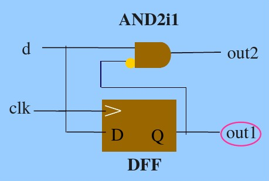
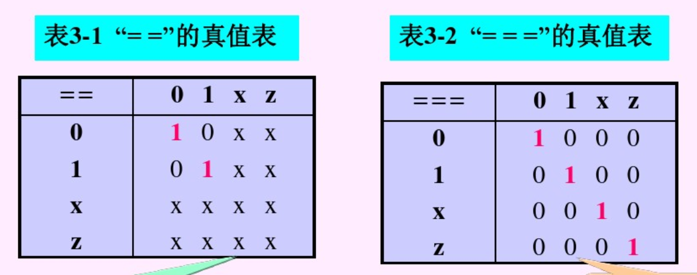

# Verilog HDL

## Chapter 1 引言

### 1.1 Verilog HDL定义

Verilog HDL是一种用于数字逻辑电路设计的硬件描述语言(Hardware Decription Language),可以用来进行数字电路的仿真验证、时序分析、逻辑综合等.

	1.用Verilog HDL描述的电路设计就是该电路的Verilog HDL模型;
	2.Verilog HDL既是一种行为描述语言也是一种结构描述语言.

Verilog HDL模型的建立:既可以用电路的功能描述来建立,也可以用元器件及其之间的连接来建立.

### 1.2 Verilog HDL的发展历史

1.1983年,由GDA(GateWay Design Automation)公司的Phil Moorby首创;

2.1989年,Cadence公司收购了GDA公司.并于1990年公开发表了Verilog HDL;

3.1995年,IEEE制定并公开发表Verilog HDL1364-1995标准;

4.1999年,模拟和数字电路都适用的Verilog标准公开发表.

### 1.3 不同层次的Verilog HDL抽象

Verilog HDL模型可以是实际电路的不同级别的抽象,抽象级别分为5级:

1.系统级(System Level):用高级语言结构(e.g.case语句)实现的设计模块外部性能的模型;

2.算法级(Algorithmic Level):用高级语言结构实现的设计算法模型(写出逻辑表达式);

3.RTL级(Register Transfer Level):描述数据在寄存器之间的流动和如何处理这些数据的模型;

4.门级(Gate Level):描述逻辑门(e.g.与门,非门,或门,与非门,三态门等)以及逻辑门之间连接的模型;

5.开关级(Switch Level):描述器件中三极管和存储节点及其之间连接的模型.

### 1.4 Verilog HDL的特点

1.语言结构上的特点:

	1.形式化地表示电路的行为和结构;
	2.借用C语言的结构和语句;
	3.可在多个层次上对所设计的系统加以描述,语言对设计规模不加任何限制;
	4.具有混合建模能力:一个设计中的各子模块可用不同级别的抽象模型来描述;
	5.基本逻辑门、开关级结构模型均内置于语言中,可直接调用;
	6.易创建用户定义原语(UDP:User Designed Primitive).

2.易学易用.

***

## Chapter 2 Verilog HDL基本结构

### 2.1 一些简单的Verilog HDL例子

**1.8位全加器**

	module adder8(cout, sum, a, b, cin);	//模块名:adder8;端口定义:cout,sum,a,b,cin
		output cout;	//输出端口声明
		output [7:0] sum;	//嵌套在module和endmodule的语句缩进2/4格空格.使用一个tab键即可.
		input [7:0] a, b;
		input cin;
		assign {cout, sum} = a + b + cin;	//功能描述
		/*
			assign语句:无论右边表达式操作数何时发生变化,右边表达式都会重新计算.
						并且在指定的延迟后给左边表达式赋值.
		*/
	endmodule

**2.8位计数器**

	module counter8(out, cout, data, load, cin, clk);
		output [7:0] out;	//IO说明
		output cout;
		input [7:0] data;
		input load, cin, clk;
		reg [7:0] out;	//信号类型说明
		always @(posedge clk)	//功能描述
			begin
				if(load)
					out <= data;	//同步预置数据
				else
					out <= out + cin;	//加1计数
			end
		assign cout = &out & cin;	//前面一个&为缩减运算符;后面一个&为位运算符.
		/*
			若out为8'hFF,cin为1,则cout为1.
		*/
	endmodule

**3.2位比较器**

	module compare2(equal, a, b);
		output equal;
		input [1:0] a, b;
		assign equal = (a == b) ? 1 : 0;	//条件运算
		/*如果a,b相等,则equal取1,否则取0.*/
	endmodule

重要的点:

	<=(非阻塞过程性赋值):将想要赋值给左边的值安排在未来时刻.不等上一个赋值执行完成执行下一个赋值语句.
	=(阻塞过程赋值):按照顺序执行,前一个赋值结束才执行下边的赋值语句.

**4.三态驱动器---门元件例化**

门元件例化:程序通过调用一个在Verilog语言库中现存的实例化元件来实现某逻辑门功能.

	module trist2(out, int, enable);
		output out;
		input in, enable;
		bufifi1 mybuf(out, in, enable);
		/*
			bufif1:门元件关键字.	mybuf:例化的元件名.
		*/
	endmodule

bufif1的真值表:

		Inputs				Output
	In			Enable		 Out
	x			0			 z
	1			1			 1
	0			1			 0
	/*解析:
		1.当enable为0时,无论in为0/1.out均为z;
		2.当enable为1时,out的值取决于in的值.
	*/

**5.三态驱动器---模块元件例化**

模块元件例化:顶层模块(e.g.trist1)调用由某子模块(mytri)定义的实例元件(tri_inst)来实现某功能.

	module trist1(out, in, enalbe);	//顶层模块
		output out;
		input in, enable;
		mytri tri_inst(out, in, enable)s;	//模块例化
	endmodule
	
	module mytri(out, in, enable);	//子模块
		output out;
		input in, enable;
		assign out = enable ? in : 'bz;
		/*
			如果enable为1,则out=in;否则为高阻态('bz:表示高阻态);
		*/
	endmodule

### 2.2 Verilog HDL模块的结构

Verilog模块的结构由在module和endmodule关键词之间的4个部分组成:

	module block1(a, b, c, d);	//端口定义
		input a, b, c;	// I/O说明
		output d;		// I/O说明
		wire x;			//信号类型声明
		assign d = a | x;		//功能描述
		assign x = (b & ~c);	//功能描述
	endmodule

### 2.3 Verilog HDL逻辑功能定义

3种方法描述电路的逻辑功能:

**1.使用assign语句**

assign语句常用于描述组合逻辑.

	assign x = (b & ~c);

**2.使用元件例化(instantiate)**

	and myand3(f, a, b, c);
	/*
		and:门元件关键字;	myand3:例化元件名.
	*/
	
元件例化注意点:

	1.元件例化即是调用Verilog HDL提供的元件;
	2.元件例化包括门元件例化和模块元件例化;
	3.例化元件名必须唯一,避免冲突;
	4.有时例化元件名也可省略.

**3.使用always块语句**

	always @(posedge clk)	//每当时钟上升沿到来时执行一遍块内语句
		begin
			if(load)
				out = data;	//同步预置数据
			else
				out = data + 1 + cin;	//加1计数
		end

always语句注意点:

	1.always语句常用于描述时序逻辑,也可用于描述组合逻辑;
	2.always块可使用if-else或case语句来表示逻辑关系;
	3.always块语句与assign语句是并发执行的.因此,assign语句一定要放在always块语句之外.

### 2.4 Verilog HDL模块的模板(仅考虑用于逻辑综合的部分)

	module <模块名>(<输入/输出端口列表>);
		output 输出端口列表;
		input 输入端口列表;
		/*1.使用assign语句定义逻辑功能*/
		wire 结果信号名;
		assign <结果信号名> = 表达式;
		/*2.使用always块定义逻辑功能*/
		always @(<敏感信号表达式>)
			begin
				/*
					1.过程赋值语句;
					2.if语句;
					3.case语句;
					4.while,repeat,for循环语句;
					5.task,function调用
				*/
			end
		/*3.元件例化*/
		//3.1:模块元件例化
		<module_name> <instance_name>(<port_list>);
		//3.2:门元件例化
		<gate_type_keyword> <instance_name>(<port_list>);
		endmodule

### 2.5 关键字

关键字用小写字母定义,常用的如下:

### 2.6 标识符

1.标识符由字母、数字、下划线和$符号构成,但第一个字符必须是字母或下划线,不能是数字或$符号.

2.Verilog HDL中的变量名是区分大小写的.

### 2.7 编写Verilog HDL源代码的标准

**1.语汇代码编写标准**

1.每个Verilog HDL源文件中只准编写一个顶层模块;

2.源文件名字最好与顶层模块同名;

3.源代码采用层层缩进的格式来写;

4.对接口(e.g.模块参数,端口,任务,函数变量等)需要做必要的注释;

5.常量尽可能多的使用参数定义和宏定义.

		参数定义:
			parameter 参数名1=表达式, 参数名2=表达式,...;
		宏定义:
			`define 宏名 宏内容

**2.综合代码的编写标准**

1.除设计中对速度响应要求比较临界的部分外,都应该避免门级描述;

2.建立一个好的始终策略(e.g.单时钟、多相位时钟,经过门产生的时钟、多时钟域等).保证源代码中时钟和复位信号是干净的(即不是由组合逻辑或没有考虑到的门产生的);

3.建立好的测试策略,使所有触发器都是可复位的,使测试能通过外部管脚进行,又没有冗余的功能;

4.所有源代码都必须遵守并符合在always块语句的4中可综合标准模板之一;

5.描述组合和锁存逻辑的always块,必须在always块开头的控制事件列表中列出所有的输入信号;

6.描述组合逻辑的always块,一定不能有不完全赋值.即所有输出变量必须被各输入值的组合值赋值,不能有例外;

7.描述组合逻辑和锁存逻辑的always块一定不能包含反馈.即在always块中已被定义为输出的寄存器变量绝对不能再在always块中读出来作为输入信号;

8.时钟沿触发的always块必须是单时钟的,且任何异步控制输入(通常是复位或置位信号)必须在控制事件列表中列出;

	e.g.always @(posedge clk or negedge set or negedge reset)

9.避免生成不想要的锁存器.在无时钟的always块中,若有的输出变量被赋了某个信号变量值,而该信号变量并未在该always块的电平敏感控制事件中列出,则会在综合中生成不想要的锁存器.

10.避免生成不想要的触发器.在时钟沿触发的always块中,如果用非阻塞赋值语句对reg型变量赋值;或者当reg型变量经过多次循环其值仍保持不变,则会在综合中生成触发器.

reg型变量生成触发器实例:

	e.g.使用reg型变量生成触发器--->用非阻塞型赋值语句对reg型变量赋值:
	module rw2(clk, d, out1);
		input clk, d;
		output out1;
		reg out1;	//out1为reg型变量
		always @(posedge clk)	//上升沿触发
			out1 <= d;	//非阻塞赋值语句
	endmodule

reg型变量生成组合逻辑,使用电平触发实例:

	e.g.电平触发
	module rw2(clk, d, out1);
		input clk, d;
		output out1;
		reg out1;
		always @(d)	//电平触发
			out1 <= d;	//非模态对话框阻塞赋值语句
		endmodule

11.所有内部状态寄存器必须是可复位的,这是为了使RTL级和门级描述能够被复位成同一个已知的状态,以便进行门级逻辑验证.

12.一般地,在赋值语句中不能使用延迟,否则是不可综合的.

13.不要使用integer型和time型寄存器,否则将分别总合成32位和64位的总线.

***

## Chapter 3 数据类型及常量、变量

### 3.1 数据类型

数据类型是用来表示数字逻辑电路中的数据存储和传递单元.

#### 3.1.1 数据类型

Verilog HDL共有19种数据类型:

	1.4种基本类型:integer, parameter, reg, wire;
	2.其他类型:large, medium, scalared, small, tri, tri0, tri1, triand, trior,
		trireg, vectored, wand, wor等.

#### 3.1.2 常量

常量包括:

	1.数字(包括整数,x和z值,负数);
	2.parameter常量(也叫符号常量).

**1.整数型常量**

	1.b/B(二进制), d/D(十进制), h/H(十六进制), o/O(八进制).
		e.g.8'b11000101或8'hc5	=>表示8位宽,二/十六进制的数.
	2.如果没有指定位宽(转换为二进制数的宽度),默认为32位.没有指定进制,默认为10进制.

**2.x和z值**

x表示不定值,z表示高阻值.

	1.最左边的x或z具有扩展性:
		8'bzx = 8'bzzzz_zzzx	//最左边的z扩展.
	2."?"是z的另一种表示符号.在case语句中通常使用"?"表示高阻态z:
		case z(select)
			4'b???1:out = a;
			4'b??1?:out = b;
			4'b?1??:out = c;
			4'b1???:out = d;

**3.负数**

位宽前加一个减号表示负数.负数一般用补码表示.

	1.负数补码表示:
		-8'd5 =>表示为:=8'b11111011
	2.较长的数字之间可用(_)隔开:
		16'b1010_1011_1100_1111	//这个表示是合法.
	3.常量未指明位宽,默认为32位:
		-1 = -32'd1 = 32'hFFFFFFFF

**4.parameter常量(符号常量)**

parameter用来定义一个标识符,代表一个常量.

	1.赋值语句右边必须为常数表达式(即只能包含数字或先前定义过的符号常量):
		parameter addrwidth = 16;	//合法常量定义
		parameter addrwidth = datawidth * 2;	//非法,因为datawidth是个变量.
	2.parameter常量常用来定义延迟时间和变量宽度;
	3.parameter参量是本地的,只在定义的模块内有效;
	4.在模块或实例引用时,可通过参数传递改变在被引用模块或实例中已定义过的参数.

**5.模块引用时参数的传递**

格式:

	被引用的模块名 #(para1, para2, ...) 模块实例名(端口列表);

实例:

	module mod(out, ina, inb);	//被引用的模块
		...
		paramter cycle = 8, real_constant = 2.039,
			file = "/user1/jmdong/design/mem_file.dat";
		...
	endmodule

	module test;
		...
		mod #(5, 3,20, "../my_mem.dat") mk(out, ina, inb);	//对模块mod的实例引用
			//传递的参数必须与模块声明时的参数一致
		...
	endmodule

#### 3.1.3 变量

变量的数据类型有19种,常用的为下面3种:

	nets type(网络型), register type(寄存器型), memory type(数组类型)

**1.nets型变量**

定义:输出始终随输入的变化而变化的变量.表示结构实体(如门)之间的物理连接.

常用的nets型变量:

	1.wire, tri:连线类型(两者功能一致);
	2.wor, trior:具有线或特性的连线(两者功能一致);
	3.wand, triand:具有线与特性的连线(两者功能一致);
	4.tri1, tri0:上拉电阻和下拉电阻;
	5.supply1, supply0:电源(逻辑1)和地(逻辑0).

wire型变量:

	1.最常用的nets型变量,常用来表示以assign语句赋值的组合逻辑信号;
	2.模块中的输入/输出信号类型缺省为wire型;

wire型变量的定义:

	wire 数据名1, 数据名2, ..., 数据名n;

wire型向量(总线)定义:

	wire[n-1:0] 数据名1, 数据名2, ..., 数据名m;	//每条总线位宽为n,共有m条总线.

**2.register型变量**

定义:对应具有状态保护作用的电器元件(e.g.触发器、寄存器等).常用来表示过程块语句(e.g.initial, always, task, function)内的指定信号.

常用的register型变量:

	reg:常代表触发器;
	integer:32位带符号整数型变量;
	read:64位带符号实数型变量;
	time:无符号时间变量.

register型变量与nets型变量的区别:

	1.register型变量需要被明确地赋值,并且在被重新赋值前一直保持原值;
	2.register型变量必须通过过程赋值语句赋值,不能通过assign语句赋值;
	3.在过程内被赋值的每个信号必须定义成register型.

reg型变量

	最常用的register型变量.在过程块中被赋值的信号,往往代表触发器(组合逻辑信号也可以);

reg型变量的定义:

	reg 数据名1, 数据名2, ..., 数据名n;

reg型向量(总线)的定义:

	reg[n-1:0] 数据名1, 数据名2, ..., 数据名m;	//每个向量位宽为n,共有m个reg型变量
	reg[4:1] regc, regd;	//regc, regd为4位宽的reg型变量

**3.reg与wire的区别**

reg型变量既可以生成触发器,也可以生成组合逻辑;wire型变量只能生成组合逻辑.

实例1---reg型变量生成组合逻辑

	module rw1(a, b, out1, out);
		input a, b;
		output out1, out2;
		reg out1;	//reg型变量必须通过过程赋值语句赋值
		wire out2;	//wire型变量,需要通过assign赋值
		assign out2 = a;	//连续赋值语句
		always @(b)	//电平触发
			out1 <= ~b;	//过程赋值语句
	endmodule

实例2---reg型变量生成触发器

	module rw2(clk, d, out1, out2);
		input clk, d;
		output out1, out2;
		reg out1;	//reg型用于触发器
		wire out2;	//wire型
		assign out2 = d & ~out1;	//连续赋值语句
		always @(posedge clk)	//沿触发,一般为上升沿
			begin
				out1 <= d;	//过程赋值语句(过程赋值使用"<="??)
			end
	endmodule

**4.memory型变量---数组**

定义:由若干个相同宽度的reg型向量构成的数组.

memory型变量用途:memory型变量可描述RAM,ROM和reg文件.一般用于存储器建模;

memory型变量定义方法:

	reg[n-1:0] 存储器名[m-1:0];
	//表示:共有m个存储单元,每个存储单元位宽为n.即为m个n位寄存器构成的存储器.

memory型变量与reg型变量的区别:

	1.含义不同:
		reg[n-1:0] rega;	//一个n位的寄存器
		reg memo[n-1:0];	//由n个1位寄存器构成的存储器
	2.赋值方式不同:
		rega = 0;	//n位寄存器所有位清0.合法赋值
		memo[8] = 1;	//存储单元中的第8个寄存器清0.合法赋值
		memo[1023:0] = 0;	//存储器中的0~1023个寄存器都清0.合法赋值
		memo = 0;	//没有指明具体是哪个寄存器.非法赋值.
	即为:memory型变量赋值时,必须指明具体是哪个寄存器(即具体哪个存储单元).

***

## Chapter 4 运算符及表达式

### 4.1 算数运算符

%(求模)运算符要求%两侧均为整数数据.结果值的符号取第一个操作数的符号位??

	-11 % 3 = -2

进行算数运算时,若某个操作数为不定值x,则整个结果也为x.

实例---除法和求模运算的区别

	module arithmetic(clk, a, b, c, d, e);
		output [3:0] c, d;
		output [7:0] e;
		input [3:0] a, b;
		input clk;
		reg [3:0] c, d;	//reg型变量只能在过程块语句中指定信号
		reg [7:0] e;	//reg型变量只能在过程块语句中指定信号
		always @(posedge clk)	//沿触发
			begin
				c = a/b;
				d = a%b;
				e = a*b;
			end
	endmodule

上述例子可以进行仿真,参加PPT.

### 4.2 逻辑运算符

	1.非0是真(1'b1);
	2.零是假(1'b0);
	3.不确定的操作数如4'bxx00--->是不确定的(可能为0,也可能非0),记为1'bx;
	  但是4'bxx11是真(因为肯定有值)--->记为1'b1.

主要的逻辑符号:&&(与), ||(或), !(非).

逻辑运算后的结果为1, 0, x(如果存在某个操作数为x(不确定的)).

实例:

	(a>b) && (b>c);	(a==b) || (x==y); (!a) || (a>b)

### 4.3 位运算符

	~(按位取反);	&(按位与); |(按位或); ^(按位异或); ~^/^~(按位同或).

实例:

	A = 5'b11001, B = 3'b101
	A & B = 5'b00001	//B中不够的最高位补0

实例---&&和&的区别

	module logic_demo(outc, outd, a, b);
		output outc;
		output [3:0] outd;
		input [3:0] a, b;
		assign outc = a && b;
		assign outd = a & b;
	endmodule

上述例子可以进行仿真,参加PPT.

### 4.4 关系运算符

	<; <=; >; >=

在比较时,若有操作数为不确定值x,则返回值为x.

### 4.5 等式运算符

	==(等于); !=(不等于); ===(全等); !==(不全等)

运算结果为1位的逻辑值1或0或x.

==(等于)和===(全等)的区别:

	1.==(等于):两个操作数必须逐位相等,结果才为1;如果某些位存在x或z,则结果为x;
	2.===(全等):两个操作数的相应位必须完全一致(同为1,或0,或x,或z),结果为1,否则为0.
	3.==取值为1,0,x; ===取值为1,0.

===和!==常用语case表达式的判别,又称为"case等式运算符".

==和===的真值表:

实例:

	if (A == 1'bx)
		$display("A is X");	//无论A为什么值,A == 1'bx结果均为x.因此该句不执行.

	if (A === 1'bx)
		$display("A is X");	//当A为不定值x时,A === 1'bx运算结果为1.该语句执行.

### 4.6 缩减运算符---单目运算符

	&(与); ~&(与非); |(或); ~|(或非); ^(异或); ~^, ~^(同或).

运算过程:先将操作数的最低位与第二位进行与&/|/~;再将结果与第三位进行相同运算.直到最高位结束得到结果.

运算结果位1位二进制数.

实例:

	reg [3:0] a;
	b = |a;	//等效为:b = ((a[0] | a[1]) | a[2]) | a[3]

### 4.7 移位运算符

	<<(左移); >>(右移)

无论左移/右移均用0填充.

### 4.8 条件运算符

	xxx = condition ? expr1 : expr2;

实例---mux(数据选择器)

	assign out = sel ? in1 : in0;
	/*
		当sel=1时,out=in1;
		当sel=0时,out=in0.
	*/

### 4.9 位拼接运算符

将两个或多个信号的某些位拼接起来,表示一个整体信号.

	{信号1的某几位, 信号2的某几位, ..., 信号n的某几位}

例1---多个位拼接在一起,构成整体

	{a, b[3:0], w, 3'b101}
	= {a, b[3], b[2], b[1], b[0], w, 1'b1, 1'b0, 1'b1}
	//即构成的一个9位的数.左边为最高位.
	{1, 0} = 64'h00000001_00000000;	//位拼接未指明位数,默认为32位.

例2---进位输出跟和拼接在一起

	output [3:0] sum;	//和
	output cout;		//进位输出
	input [3:0] ina, inb;
	input cin;
	assign {cout, sum} = ina + inb + cin;
	/*
	构成的信号为{cout, sum[3], sum[2], sum[1], sum[0]}.
	因此,此句相当于给cout,sum赋值.cout存放进位,sum存放和.
	*/

例3---重复法和嵌套方法

	1.重复法
	{4{w}} = {w, w, w, w}
	2.嵌套方法
	{b, {3{a, b}}} = {b, {a, b}, {a, b}, {a, b}} = {b,a,b,a,b,a,b}

***

## Chapter 5 语句

### 5.1 赋值语句和块语句

#### 5.1.1 赋值语句

主要分为两类:

	1.连续赋值语句---assign语句,用于对wire型变量赋值,是描述组合逻辑最常用的方法之一.
		assign c = a & b;	//a,b,c均为wire型变量
	2.构成赋值语句---用于对reg型变量赋值,有两种方式:
		1)非阻塞(non-blocking)赋值方式,赋值符号"<=";
			b <= a;
		2)阻塞(blocking)赋值方式,赋值符号"=".
			b = a;

#### 5.1.2 非阻塞赋值与阻塞赋值的区别

**1.非阻塞赋值方式**

非阻塞赋值在块结束时才完成赋值操作.

	always @(posedge clk)
		begin
			b <= a;
			c <= b;
		end		//非阻塞赋值在块结束时才完成赋值操作.
	PS:c的值比b的值落后一个时钟周期.

**2.阻塞赋值方式**

阻塞赋值在某语句结束时就完成赋值操作.

	always @(posedge clk)
		begin
			b = a;
			c = b;	//阻塞赋值在该语句结束就完成赋值操作
		end
	PS:在一个块语句中,如果有多条阻塞赋值语句,在前面的赋值语句没有完成之前,后面的语句就
	不能被执行,就像被阻塞了一样,因此被称为阻塞赋值方式.
	此处的c的值与b的值一样.

**3.非阻塞赋值与阻塞赋值方式的主要区别**

1.非阻塞赋值(non-blocking)方式(b<=a):

	1.b的值被赋值成新值a的操作,不是立刻完成的,而是在块结束时才完成;
	2.块内的多条赋值语句在块结束时同时赋值;
	3.硬件有对应的电路.

2.阻塞赋值(blocking)方式(b=a):

	1.b的值立刻被赋成新值a;
	2.完成该赋值语句后才能进行下一句的操作;
	3.硬件没有对应的电路,因而综合结果未知.

**4.使用方式**

	初学时全部使用非阻塞方式即可.

#### 5.1.2 块语句

将多条语句组合在一起.主要有两种方式:

	1.begin-end语句:标识顺序执行的语句;
	2.fork-join语句:标识并行执行的语句.

**1.顺序块--->用begin-end标识的块**

	1.块内的语句是顺序执行的;
	2.每条语句的延迟时间是相对于前一条语句的仿真时间而言的;
	3.直到最后一条语句执行完,程序流程才跳出该顺序块.
	4.块内声明的语句可以是参数声明、reg型变量声明、integer型变量声明、real型变量声明语句.

实例1:

	begin
		b = a;
		c = b;	//c的值为a的值
	end

实例2:

	begin
		b = a;
		#10 c = b;	//延迟10个时间单位
	end
	/*
		1.此处的"#"表示延迟;
		2.在模块调用中的"#"表示参数的传递.
	*/

实例3---用顺序块和延迟控制组合产生一个时序波形

	parameter d = 50;
	reg	[7:0] r;
	begin
		# d r = 'h35; //相对于前一条语句延迟时间d
		# d r = 'hE2;
		# d r = 'h00;
		# d r = 'hF7;
		# d ->end_wave;	//触发事件end_wave
	end

**2.并行块--->用fork-join标识的块**

	1.块内的语句是同时执行的;
	2.块内每条语句的延迟时间是相对于程序流程控制进入到块内时的仿真时间而言的;
	3.延迟时间用于给赋值语句提供时序;
	4.当按时间排序在最后的语句执行完成或一个disable语句执行时,程序流程控制跳出该并行快;
	5.块内声明的语句可以是参数声明、reg型变量声明、integer型变量声明、real型变量声明语句、
		time型变量声明语句和事件(event)声明语句.

实例---用并行块和延迟控制组合产生一个时序波形.

	reg [7:0] r;
	fork
		# 50 r = 'h35;	//延迟50ns
		# 100 r = 'hE2;	//因为是并行.为了相对前一句延迟50ns.因此此处相对公共起点延迟100ns
		# 150 r = 'h00;	//因为是并行.为了相对前一句延迟50ns.因此此处相对公共起点延迟150ns
		# 200 r = 'hF7; //因为是并行.为了相对前一句延迟50ns.因此此处相对公共起点延迟200ns
		# 250 ->end_wave;	//触发事件end_wave.相对公共起点延迟250ns
	join
	
PS:fork-join块内,各条语句可以不按顺序给出(因为是计算绝对时间).但是为了增加可读性,还是按顺序书写比较好.

