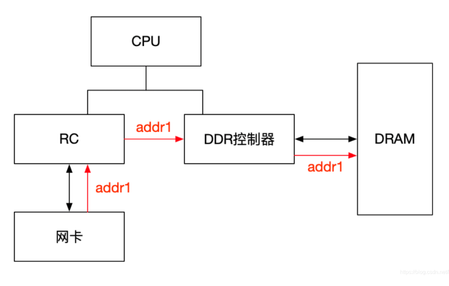
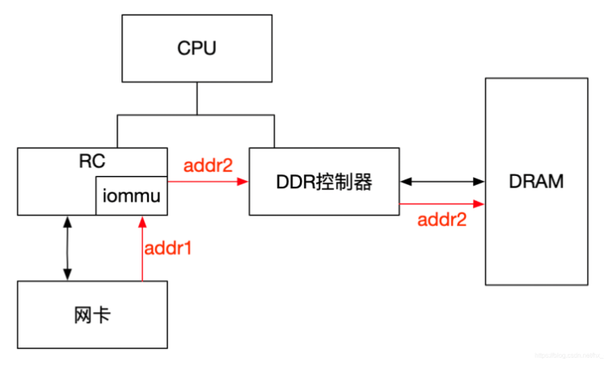
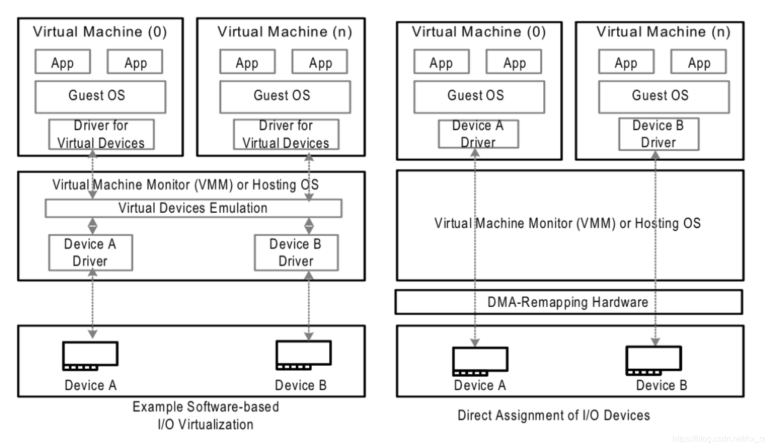
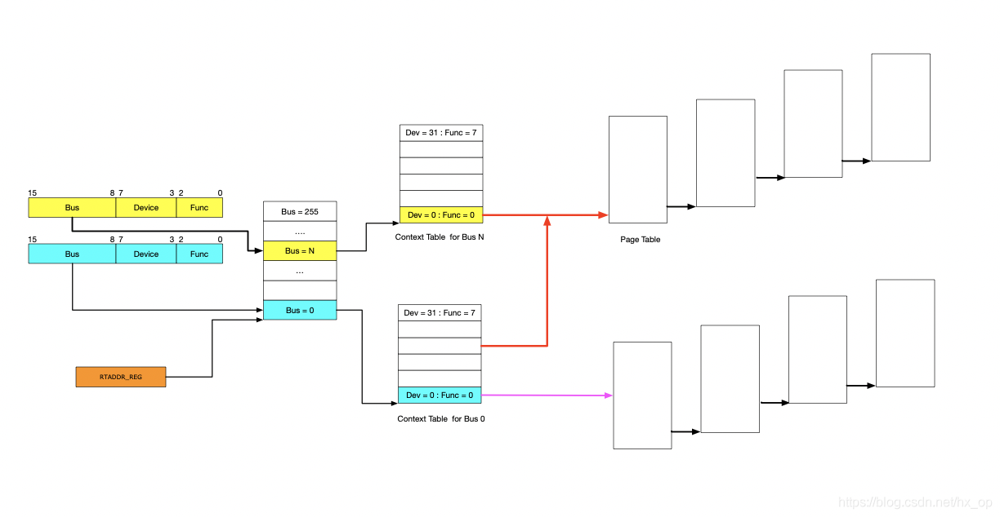
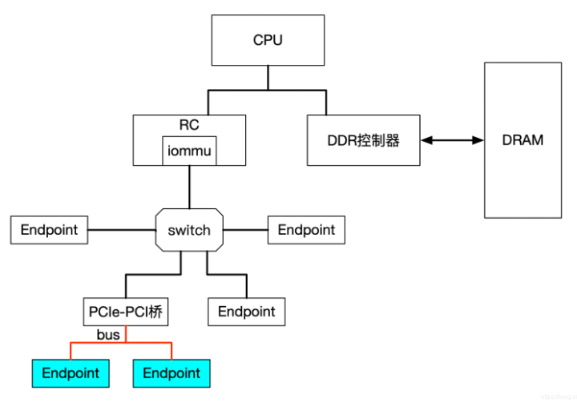
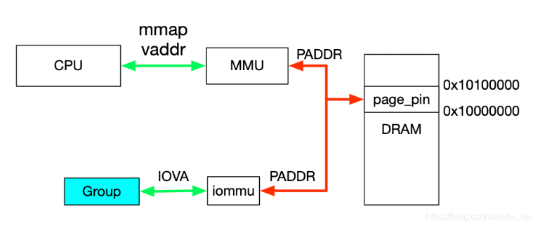

# Virtualization

# 1. VFIO概述

## 1.1 IOMMU

### 1.1.1 IOMMU功能简介

IOMMU主要功能包括DMA Remapping和Interrupt Remapping,此处主要讲解DMA Remapping,Interrupt Remapping暂不涉及.IOMMU与MMU类似,可以将一个设备访问地址转换为存储器地址.

#### 1.1.1.1 有无IOMMU对比

**1. 无IOMMU**

在没有IOMMU的情况下,网卡接收数据时地址转换流程.RC会将网卡请求写入地址addr1直接发送到DDR控制器,然后访问DRAM上的addr1地址,这里的RC对网卡请求地址不做任何转换,网卡访问的地址就是物理地址.

**2. 有IOMMU**

对于有IOMMU的情况,网卡请求写入地址addr1会被IOMMU转换为addr2,然后发送到DDR控制器,最终访问的是DRAM上addr2地址.网卡访问的地址addr1会被IOMMU转换成真正的物理地址addr2,这里可以将addr1理解为虚机地址.

#### 1.1.1.2 虚拟化

**1.无IOMMU**

没有IOMMU的情况(左图),对于虚机无法实现设备的透传.原因主要有两个:

	1.在没有IOMMU的情况下,设备必须访问真实的物理地址HPA,而虚机可见的是GPA;
	2.如果让虚机填入真正的HPA,那样的话相当于虚机可以直接访问物理地址,会有安全隐患.
	所以针对没有IOMMU的情况,不能用透传的方式,对于设备的直接访问都会有VMM接管,这样就不会对虚机暴露HPA.

**2.有IOMMU**

有IOMMU的情况(右图).虚机可以将GPA直接写入到设备,当设备进行DMA传输时,设备请求地址GPA由IOMMU转换为HPA(硬件自动完成),进而DMA操作真实的物理空间.IOMMU的映射关系是由VMM维护的,HPA对虚机不可见,保障了安全问题,利用IOMMU可实现设备的透传.

	IOMMU可以将设备访问地址映射成真实的物理地址,那么对于右图中的Device A和Device B,IOMMU必须保证两个
	设备映射后的物理空间不能存在交集,否则两个虚机可以相互干扰,这和IOMMU的映射原理有关,后面有讲述.

### 1.1.2 IOMMU作用

IOMMU的主要作用如下:

	1.屏蔽物理地址,起到保护作用.典型应用包括两个:
		1.实现用户态驱动(guest OS的驱动),由于IOMMU的映射功能,使HPA对用户空间不可见;
		2.将设备透传给虚机,HPA对虚机不可见,并将GPA映射为HPA.
	2.IOMMU可以将连续的虚拟地址映射到不连续的多个物理内存片段,与MMU功能类似.

### 1.1.3 IOMMU工作原理

	1.IOMMU的主要功能就是完成映射,类似MMU利用页表实现VA->PA的映射,IOMMU也需要用到页表;
	2.设备发起DMA请求时,将自己的Source Identifier(包含Bus、Device、Func)包含在请求中,IOMMU根据这个
		标识,以RTADDR_REG指向空间为基地址,然后利用Bus、Device、Func在Context Table中找到对应的
		Context Entry,即页表首地址,然后利用页表将设备请求的虚拟地址翻译成物理地址.
	PS:
	1.图中红线的部分,是两个Context Entry指向了同一个页表.在虚拟化场景中的典型用法就是这两个Context
		Entry对应的不同PCIe设备属于同一个虚机.
	2.由图中可知,每个具有Source Identifier(包含Bus、Device、Func)的设备都会具有一个Context Entry.如果
		不这样做,所有设备共用同一个页表,隶属于不同虚机的不同GPA就会翻译成相同HPA,会产生问题.

具体地址翻译过程请参考"ARMv8 Architecture Learning.md".

### 1.1.4 Source Identifier

IOMMU利用设备的Source Identifier(包含Bus、Device、Func)找到页表项来完成地址映射.针对PCIe switch的处理:

	对于由PCIe switch扩展出的PCI桥及桥下设备,在发起DMA请求时,Source Identifier是PCIe switch的.这样
	该PCI桥及桥下所有设备都会使用PCIe switch的Source Identifier去定位Context Entry,找到的页表也是
	同一个.如果将这个PCI桥下的不同设备分给不同虚机,由于会使用同一份页表,这样会产生问题.针对这种情况,必须
	将PCI桥及桥下的所有设备分配给同一个虚机,这就是VFIO中组(group)的概念.

## 1.2 VFIO

VFIO是内核针对IOMMU提供的软件框架,支持DMA Remapping和Interrupt Remapping(此处只讲DMA Remapping).VFIO利用IOMMU这个特性,可以屏蔽物理地址对上层的可见性,可以用来开发用户态驱动,也可以实现设备透传.

### 1.2.1 VFIO重要概念

#### 1.2.1.1 Group

	1.group是IOMMU能够进行DMA隔离的最小硬件单元;
	2.一个group内可能只有一个device,也可能有多个device,硬件IOMMU拓扑结构;
	3.设备直通的时候一个group里面的设备必须都直通给一个虚拟机.
	4.不能够让一个group里的多个device分别从属于2个不同的VM;
	--->因为这样一个guest中的device可以利用DMA攻击获取另外一个guest里的数据,无法做到物理上的DMA隔离.
	5.也不允许部分device在host上而另一部分被分配到guest里.

#### 1.2.1.2 Container

	1.对于虚机,Container可以简单理解为一个VM Domain的物理内存空间;
	2.对于用户态驱动,Container可以是多个Group的集合.

	图中PCIe-PCI桥下的两个设备,在发送DMA请求时,PCIe-PCI桥会为下面两个设备生成Source Identifier.
	其中Bus域为红色总线号bus,device和func域为0.这样的话,PCIe-PCI桥下的两个设备会找到同一个Context
	Entry和同一份页表,所以这两个设备不能分别给两个虚机使用,这两个设备就属于一个Group.

### 1.2.2 使用实例

vfio的用户态驱动,利用vfio实现设备透传.

	int container, group, device, i;
	struct vfio_group_status gruop_status = 
		{ .argsz = sizeof(groups status) };
	struct vfio_iommu_type1_info iommu_info = { .argsz = sizeof(iommu_info) };
	struct vfio_iommu_type1_dma_map dma_map = { .argsz = sizeof(dma_map) };
	struct vfio_device_info device_info = { .argsz = sizeof(device_info) };

	/* Create a new container */
	container = open("/dev/vfio/vfio", O_RDWR);

	if (ioctl(container, VFIO_GET_API_VERSION) != VFIO_API_VERSION)
		/* Unknown API version */

	if (!ioctl(container, VFIO_CHECK_EXTENSION, VFIO_TYPE1_IOMMU))
		/* Doesn't support the IOMMU driver we want. */

	/* Open the group */
	group = open("/dev/vfio/26", O_RDWR);

	/* Test the group is viable(可实施的,切实可行的) and available */
	ioctl(group, VFIO_GROUP_GET_STATUS, &group_status);

	if (!(group_status.flags & VFIO_GROUP_FLAGS_VIABLE))
		/* Group is not viable (ie, not all devices bound for vfio) */

	/* Add the group to the container */
	ioctl(group, VFIO_GROUP_SET_CONTAINER, &container);

	/* Enable the IOMMU model we want */   // type 1 open | attatch
	ioctl(container, VFIO_SET_IOMMU, VFIO_TYPE1_IOMMU);

	/* Get addition IOMMU info */
	ioctl(container, VFIO_IOMMU_GET_INFO, &iommu_info);

	/* Allocate some space and setup a DMA mapping */
	dma_map.vaddr = mmap(0, 1024 * 1024, PROT_READ | PROT_WRITE,
			     MAP_PRIVATE | MAP_ANONYMOUS, 0, 0);
	dma_map.size = 1024 * 1024;
	dma_map.iova = 0; /* 1MB starting at 0x0 from device view */
	dma_map.flags = VFIO_DMA_MAP_FLAG_READ | VFIO_DMA_MAP_FLAG_WRITE;

	ioctl(container, VFIO_IOMMU_MAP_DMA, &dma_map);

	/* Get a file descriptor for the device */
	device = ioctl(group, VFIO_GROUP_GET_DEVICE_FD, "0000:06:0d.0");

	/* Test and setup the device */
	ioctl(device, VFIO_DEVICE_GET_INFO, &device_info);

### 1.2.3 group映射流程--->代码解析

	1.利用mmap映射出1MB字节的虚拟空间.因为物理地址对于用户态不可见,只能通过虚拟地址访问物理空间;
	2.执行ioctl的VFIO_IOMMU_MAP_DMA命令,传入参数主要包含vaddr及iova.
		1.iova代表的是设备发起DMA请求时要访问的地址,是IOMMU映射前的地址,此处自行给值为0;
		2.vaddr就是mmap时返回的地址.
	3.VFIO_IOMMU_MAP_DMA命令会为虚拟地址vaddr找到物理页并pin住(物理页面被pin住表示不能交换出去).然后
		找到Group对应的Contex Entry,建立页表项.页表项能将iova地址映射成上面pin住的物理页对应的物理地
		址.这样对用户态程序完全屏蔽了物理地址,实现了用户空间驱动.
		--->因为用户空间在此处可以看到vaddr和iova,看上去和驱动差不多,因此叫用户空间驱动.
		PS:VFIO_IOMMU_MAP_DMA命令的主要作用:将iova通过iommu映射到vaddr对应的物理地址上去.
	4.此处地址关系:0x0(iova)----0x10000000(pa),0x100000(iova)--->0x10100000(pa),大小为:1M

## 1.3 设备透传分析

设备透传就是由虚机直接接管设备,虚机可以直接访问MMIO空间.VMM配置好IOMMU之后,设备DMA读写请求无需VMM介入.

	PS:设备的配置空间不会透传,因为VMM已经配置好了BAR空间.如果将这部分空间也透传给虚机,虚机会再次对BAR
		空间进行配置,会导致设备无法正常工作.

### 1.3.1 虚机地址映射

