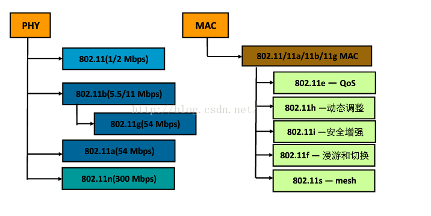
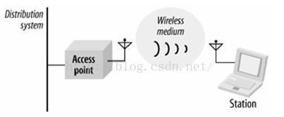
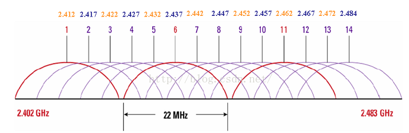
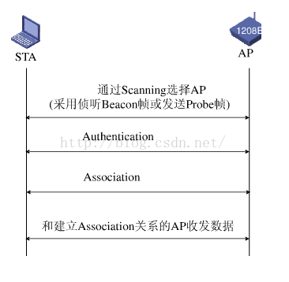
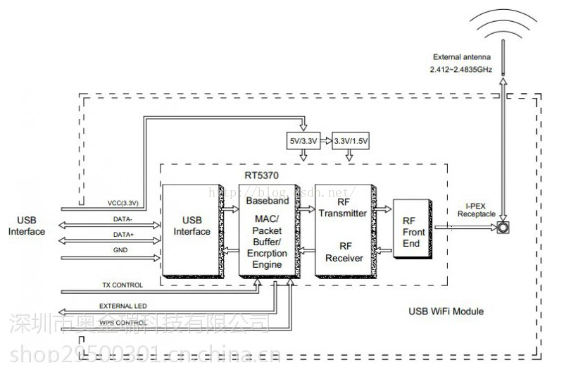

# WiFi driver development under Linux

## Chapter 1 Analysis of the basic knowledge of WiFi(WiFi基础知识解析)

### 1.1 WiFi相关基础概念

#### 1.1.1 什么是WiFi

Wi-Fi是一种可以将个人电脑、手持设备(e.g.pad, phone)等终端以无线方式(事实上为一个高频无线线信号)互相连接的技术.

	Wi-Fi英文全称是WIreless-FIdelity,译为无线保真.

#### 1.1.2 什么是wlan

WiFi目的是取代旧式的双绞铜线(Coaxial)构成的局域网络,在空中进行通信连接.

Wireless Local Area Networks(wlan):无线局域网络.利用Radio Frequency(RF:射频)技术,使用电磁波.

	wlan技术包括:WiFi,蓝牙,Wimax等.

#### 1.1.3 无线网vs有线网

缺点:

	1.无线网络双方通信之前需要先建立连接;有线网络是直接用线缆连接,不需要该过程.
	2.无线网络是半双工通信方式;有线网络是全双工.
	3.无线网络在网络层以下出错的概率非常高,帧的重传概率很大,需要在网络层之下的协议添加重传机制(不能只依赖
	上面的TCP/IP的延时等待重传来保证);有线网络出错概率非常小,无需在网络层有那么复杂的机制.
	4.无线网络的数据是在无线环境下进行的,因此抓包非常容易,存在安全隐患.
	5.无线网络收发无线信号,功耗较大,对电池来说是考验.
	6.无线网络相对于有线网络吞吐量低.

### 1.2 IEEE 802.11协议

Ethenet和WiFi采用的协议都属于IEEE 802协议集.Ethenet以IEEE 802.3协议作为其网络层以下的协议;WiFi以IEEE 802.11作为其网络层以下的协议.但是它们网络层以上的部分基本一样.

#### 1.2.1 802.11简介

IEEE 802家族由一系列局域网络(Local Area Network, LAN)技术规则所组成.802.11属于其中一员.

IEEE 802.11协议族包括PHY(物理层)和MAC(媒体访问控制层).

IEEE 802.11协议族成员如下:

#### 1.2.2 IEEE 802.11b

802.11b是无线局域网(WLAN)的一个标准.载波频率2.4GHz,传输速度11Mbit/s.在2.4GHz-ISM频段共有14个频宽为22MHz的频道可供使用.

IEEE 802.11b的后继标准是IEEE 802.11g,其传输速度为54Mbit/s.

#### 1.2.3 802.11网络包含的四种主要实体原件

802.11网络包含的实体如下:

	1.工作站(Station)
		具有无线网络接入功能的电子设备(e.g.笔记本,手持设备等).
	2.基站(Access Point)
		802.11网络所使用的帧必须经过转换才能被传到其他不同类型的网络.具有无线到有线桥接功能的设备称为
		基站(Access Point, AP).
	3.无线介质(Wireless Medium)
		802.11标准以无线介质(Wireless Medium)在工作站之间传递帧.
	4.传输系统(Distribution System)
		传输系统是基站间转送帧的骨干网络,通常称为骨干网络(backbone network).当多部基站串联以覆盖较大区域时,
		就需要传输系统来保证相互通信.
		传输系统属于802.11的逻辑元件,负责将帧(frame)转送至目的地.大多数商用产品,是以桥接引擎(bridging engine)
		和传输系统介质(distribution system medium)共同组成传输系统.

#### 1.2.4 802.11工作方式

802.11主要定义两种类型的设备.一种是无线站,通常是一台PC机+一块无线网络接口卡构成;另一种是无线接入点(Access Point, AP),其作用是提供无线和有线网络之间的桥接(e.g.路由器).

### 1.3 WiFi相关知识进阶

#### 1.3.1 频谱划分

WiFi总共14个信道,如下图:

	1.IEEE 802.11 b/g标准工作在2.4GHz频段,频率范围为2.400~2.483GHz,供83.5M带宽.
	2.划分为14个子信道,每个子信道宽度为22MHz.
	3.相邻信道的中心频点间隔5MHz.且相邻的多个信道存在频率重叠(e.g.信道1与2,3,4,5信道有频率重叠)
	4.整个频段内只有3个(1,6,11)互补干扰信道.

#### 1.3.2 SSID和BSSID

1.基本服务集(BSS):能相互进行无线通信的STA(station)可以组成一个BSS(Basic Service Set).

2.扩展服务集(ESS):多个BSS可以构成一个扩展网络,称为扩展服务集网络(ESS).

3.SSID:服务集的标识,是一个ESS的网络表示.同一个SS内的所有的STA和AP都必须具有相同的SSID,否则无法进行通信.

4.BSSID:BSSID是一个BSS的标识,BSSID实际上就是AP的MAC地址.用来标识AP管理的BSS,在同一个AP内BSSID和SSID一一映射.

#### 1.3.3 无线接入过程的三个阶段

STA(station,工作站)启动初始化、开始正式使用AP传送数据帧前,要经过三个阶段才能够接入:

	1.扫描阶段(SCAN);
	2.认证阶段(Authentication);
	3.关联(Association).

如下图所示:

#### 1.3.4 WiFi组成结构

无线网络的基本配备只需要无线网卡和一台AP(Access Point,无线访问接入点/桥接器).

***

## Chapter 2 Analysis of WiFi module(WiFi模块浅析)

### 2.1 WiFi模块定义

Wi-Fi模块又名串口Wi-Fi模块,属于物联网传输层.功能是将串口/TTL电平转为符合Wi-Fi无线网络通信标准的嵌入式模块.

Wi-Fi模块内置无线网络协议IEEE 802.11b.g.n协议栈以及TCP/IP协议栈.传统的硬件设备嵌入Wi-Fi模块可以直接利用Wi-Fi联入互联网,是实习无线智能家居、M2M等物联网应用的重要组成部分.

### 2.2 WiFi模块分类

主要分为3类:

#### 2.2.1 通用Wi-Fi模块

手机、笔记本、平板电脑上的USB/SDIO接口模块.Wi-Fi协议栈和驱动是在andriod, windows, IOS等系统里跑的,需要强大的CPU来完成应用.

#### 2.2.2 路由器Wi-Fi模块

协议和驱动是借助拥有强大Flash和RAM资源的芯片+linux操作系统.典型的家用路由器.

#### 2.2.3 嵌入式Wi-Fi模块

32位单片机,内置Wi-Fi驱动和协议.接口为一般的MCU接口(e.g.UART等).适合各类智能家居或智能硬件产品.

#### 2.2.4 普通Wi-Fi模块与嵌入式Wi-Fi模块的区别

普通Wi-Fi模块:对于像笔记本、手机、平板电脑等产品具有强大的CPU和大容量的存储器能进行网络通信数据的处理和存储,因此在使用WiFi时不需要额外的MCU.

嵌入式Wi-Fi模块:对于像家电、仪表、LED灯等智能家居产品,其主控芯片一般为成本低、功能简单、性能也简单的MCU,因此无法支持普通WiFi的功能.而且普通Wi-Fi功耗比较高,而嵌入式Wi-Fi在功耗上做了很大的改善,因此比较适合需要严格控制功耗的无线家电设备.

嵌入式Wi-Fi和普通Wi-Fi对比:

	1.使用范围:
		嵌入式WiFi模块主要用于无线家电、仪表、智能灯泡等智能家居设备;
		普通WiFi模块主要用于笔记本、手机、平板电脑等.
	2.主控芯片:
		嵌入式WiFi模块其主控芯片为模块上集成的MCU;
		普通WiFi模块其主控芯片为X86, ARM等高速微处理器.
	3.接口:
		嵌入式WiFi模块接口主要有:UART, SPI, I2C, SDIO;
		普通WiFi模块接口有:USB, SDIO.
	4.功耗:
		嵌入式WiFi模块功耗低;
		普通WiFi模块功耗高.
	5.产品:
		嵌入式WiFi模块产品主要有:TI的CC3200系列,MXCHIP系列,ASIX系列,Atheros的HF-LPA系列;
		普通WiFi模块产品主要有:瑞昱的RTL81xx系列,威盛VT系列,雷凌RT系列,博通BCM,Marvell,
			高通Atheros等.
	6.开发设计:
		嵌入式WiFi模块内置WIFI驱动,MAC,WIFI协议,无线安全协议等.所有的网络软件封装成一个
			UART/SPI接口的设备.使用简单,只需要往UART/SPI收发数据即可.从整体软件层面上看,
			不属于网络设备.
		普通WiFi模块需要在主机添加WIFI驱动,同时需要依赖主机的网络协议栈等软件平台资源.从整体
			软件层面上看,属于网络设备,使用时需要遵循网络相关的协议.

#### 2.2.5 某款带USB接口的WiFi模块原理图,如下:

### 2.3 WiFi模块主要功能

WiFi模块包括两种类型的拓扑形式:基础网(Infra)和自组网(Adhoc).

1.AP(Access Point)

AP(Access Point):无线网络接入点,是一个无线网络的创建者,是网络的中心节点.一般家庭或办公室使用的无线路由器就是一个AP.

2.STA(station)站点

每一个连接到无线网络中的终端(e.g.笔记本,PDA以及其他可以联网的用户设备)都可以称为一个站点.

#### 2.3.1 基于AP组建的基础无线网络(Infra)

Infra:也称基础网.由AP创建,众多STA加入所组成的无线网络.该类型的网络的特点是AP是整个网络的中心,网络中所有的通信都通过AP来转发完成.

一般的WiFi模块可以设置为以下两种形式:

	1.无线网类型AP:AP将WiFi模块当路由器使用,手机和电脑可以直接连接到WiFi模块.
	2.Infra:Infra将WiFi模块当基础设备使用,用于连接别的路由器.

#### 2.3.2 用于自组网的无线网络(Adhoc)

Adhoc:也称为自组网.由两个或以上的STA自己组成,网络中不存在AP.这种类型的网络是一种松散的结构,网络中的所有STA都可以直接通信.

#### 2.3.3 安全机制

无线网络加密方式包括:WEP64/WEP128,TKIP/CCMP(AES),WEP/WPA-PSK/WPA2-PSK.

#### 2.3.4 快速联网

支持通过指定信道号的方式来进行快速联网.

#### 2.3.5 地址绑定

支持在联网过程中绑定目的网络BSSID地址的功能.可以防止STA接入到非法的网络,提高无线网络的安全性.

#### 2.3.6 无线漫游

支持基于802.11协议的无线漫游功能.

无线漫游:指的是为了扩大一个无线网络的覆盖范围,由多个AP共同创建一个具有相同的SSID/ESSID的无线网络,每个AP用来覆盖不同的区域,接入到网络的STA可以根据所处位置选择信号最强的AP接入,而且随着STA的移动自动在不同的AP之间切换.

### 2.4 工作方式

#### 2.4.1 主动型串口设备联网

主动型串口设备联网指的是:由设备主动发起连接,并与后台服务器进行数据交互(上传或下载).

典型的主动型设备如:无线POS机,在每次刷卡交易完成后即开始连接后台服务器,并上传交易数据.后台服务器作为TCP Server端,设备通过AP/路由器接入到网络中,并作为TCP Client端.

#### 2.4.2 被动型串口设备联网

被动型串口设备联网指的是:在系统中所有设备一直处于被动的等待连接状态,仅由后台服务器主动发起与设备的连接,并进行请求/下传数据的方式.

典型的应用如:某些无线传感器网络,每个传感器终端始终实时的在采集数据,但是采集到的数据并没有马上上传,暂时保存在设备中.后台服务器周期性的每隔一段时间主动连接设备,请求上传或下载数据.此时后台服务器实际上作为TCP Client端,而设备作为TCP Server端.

***

## Chapter 3 Analysis of WiFi driver for SDIO interface(SDIO接口WiFi驱动浅析)

SDIO-WiFi模块是基于SDIO接口的符合WiFi无线网络标准的嵌入式模块.内置无线网络协议IEEE 802.11协议栈以及TCP/IP协议栈.能够实现用户主平台数据通过SDIO口到无线网络之间的转换.

SDIO-WiFi接口的WiFi模块特点:

	1.是一个SDIO卡的设备,具备WiFi的功能.注册时是以SDIO卡的设备去注册.
	2.在检测到SDIO卡的设备后然后驱动WiFi功能.因为是使用SDIO的协议,因此是通过发命令和数据来控制.

### 3.1 SDIO基础知识

#### 3.1.1 SDIO接口

SDIO(Secure Digital Input and Output):安全数字输入输出接口,是一种外设接口.是SD(SD是记忆卡的标准)的I/O接口.

SDIO本身是一种相当单纯的计数,使用SD的I/O接脚来连接外围,透过SD上的I/O数据位与外围传输数据.SDIO具有传输数据快,兼容SD、MMC接口等特点.

常见的SDIO外围(也叫SDIO卡)有:

	WiFi Card(无线网卡)
	CMOS sensor card(照相模块)
	GPS card
	GSM/GPRS modem card
	Bluetooth card

SDIO的应用将是未来嵌入式系统最终的接口技术之一,并且也会取代目前GPIO式的SPI接口.

#### 3.1.2 SDIO总线

SDIO总线和USB总线类似,有两端.一端是HOST端,一端是Device端.所有的通信都是由Host端发送命令开始,Device端只要能解析命令,就可以互相通信.

SDIO传输组成:

	1.CLK信号:Host给Device的时钟信号,每个时钟周期传输一个命令;
	2.CMD信号:双向的信号,用于传送命令和反应;
	3.DAT0~DAT3信号:四条用于传送的数据线;
	4.VDD信号:电源信号;
	5.VSS1,VSS2信号:电源地信号.

#### 3.1.3 SDIO热插拔原理

方法:设置一个定时器检查或插拔中断检测.

硬件:假设GPG10(EINT18)用于SD卡检测.当GPG10为高电平时表示没有SD卡插入;当GPG10为低电平时表示插入了SD卡.

#### 3.1.4 SDIO命令

SDIO总线上都是Host端发起请求,然后Device端回应请求.SDIO命令由6字节组成:

	Command:表示开始传输的命令.由Host端发送到Device端.通过CMD信号线传送.
	Response:表示回应命令.由Device返回给Host的命令,作为Command的回应.通过CMD信号线传送.
	Data:表示双向传送的数据.可以设置为1线模式或4线模式.通过DAT0~DAT3信号线传输.

SDIO的每次操作都是由Host在CMD信号线上发起一个CMD,有的CMD Device需要返回Response,有的则不需要.

读/写命令的流程:

	1.读命令:
		1.Host向Device发送命令,Device会返回一个握手信号;
		2.Host收到回应的的握手信号后,将数据放在4位的数据线上,在发送数据的同时会跟随着CRC校验码;
		3.当读传送完毕后,Host会再发送一个命令,通知Device操作完毕,Device会返回一个响应.
	2.写命令:
		1.Host向Device发送命令,Device会返回一个握手信号;
		2.Host收到回应的的握手信号后,将数据放在4位的数据线上,在发送数据的同时会跟随着CRC校验码;
		3.当写传送完毕后,Host会再发送一个命令,通知Device操作完毕,Device会返回一个响应.

### 3.2 SDIO接口驱动

Linux下wifi驱动开发(三)[SDIO接口WiFi驱动浅析](https://blog.csdn.net/zqixiao_09/article/details/51105877)