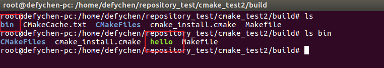

# Chapter 1 初识cmake

## 1.1 cmake背景

cmake的流行归功于KDE4(2008-01-11发布)的开发,之前的KDE版本使用autotools,在KDE4后完全使用cmake进行构建.

```
KDE是一个用于UNIX工作站的现代化桌面环境.其他的桌面环境包括:Unity,GNOME,XFCE,LXDE等.
```

## 1.2 cmake特点

cmake具有如下特点:

```
1.开放源代码,使用类BSD许可发布
2.跨平台,并可生成native编译配置文件:
	在Linux/Unix平台,生成makefile
	在苹果平台,可以生成xcode
	在Windows平台,可以生成MSVC的工程文件
3.能够管理大型项目,KDE4就是最好的证明
4.简化编译构建过程和编译过程:
	make的工具链非常简单--->cmake+make
5.高效性:
	CMake构建KDE4的kdelibs要比使用autotools来构建KDE3.5.6的kdelibs快40%,主要是因为cmake在工具链中没有libtool
6.可扩展性
	可以为cmake编写特定功能的模块,扩展cmake功能
```

## 1.3 cmake安装

cmake目前已经成为各大linux发行版提供的组件,一般不需要安装.如果需要安装,ubuntu安装方法:

```
apt install cmake	// 我的ubuntu 16.x默认没有安装cmake,手动安装即可.
```

# Chapter 2 初试cmake

新建一个测试目录:cmake_test

## 2.1 源代码及编译脚本

在cmake_test目录下建立main.c和CMakeLists.txt(名字必须是这样的).

### 2.1.1 源代码main.c

main.c内容如下:

```
#include <stdio.h>
int main()
{
	printf("Hello world!\n");
	return 0;
}
```

### 2.1.2 编译脚本CMakeLists.txt

CMakeLists.txt内容如下:

```
PROJECT (HELLO)
SET(SRC_LIST main.c)
MESSAGE(STATUS "This is BINARY dir " ${HELLO_BINARY_DIR})	//变量的取值使用${}
MESSAGE(STATUS "This is SOURCE dir " ${HELLO_SOURCE_DIR})
ADD_EXECUTABLE(hello ${SRC_LIST})
```

## 2.2 构建、编译、运行

### 2.2.1 构建

在cmake_test目录下执行:

```
cmake .	//“.”:表示在当前目录下
```

执行后会输出如下信息:

```
-- The C compiler identification is GNU 5.4.0
-- The CXX compiler identification is GNU 5.4.0
-- Check for working C compiler: /usr/bin/cc
-- Check for working C compiler: /usr/bin/cc -- works
-- Detecting C compiler ABI info
-- Detecting C compiler ABI info - done
-- Detecting C compile features
-- Detecting C compile features - done
-- Check for working CXX compiler: /usr/bin/c++
-- Check for working CXX compiler: /usr/bin/c++ -- works
-- Detecting CXX compiler ABI info
-- Detecting CXX compiler ABI info - done
-- Detecting CXX compile features
-- Detecting CXX compile features - done
-- This is BINARY dir /home/defychen/repository_test/cmake_test
-- This is SOURCE dir /home/defychen/repository_test/cmake_test
-- Configuring done
-- Generating done
-- Build files have been written to: /home/defychen/repository_test/cmake_test
```

构建成功后会在目录下自动生成下面几个文件:

```
CMakeCache.txt\CMakeFiles(目录)\cmake_install.cmake\Makefile
```

### 2.2.2 编译

构建成功后会自动生成Makefile,编译只需要再执行"make"即可.会输出如下信息:

```
Scanning dependencies of target hello
[ 50%] Building C object CMakeFiles/hello.dir/main.c.o
[100%] Linking C executable hello
[100%] Built target hello
```

如果需要显示make执行的详细过程,可以执行:

```
make VERBOSE=1
```

此时在当前目录下会生成可执行文件"hello".

### 2.2.3 执行

运行生成的"hello"

```
./hello
```

输出:

```
Hello world!
```

### 2.2.4 CMakeLists.txt语法解析

#### 2.2.4.1 PROJECT语法

PROJECT用于对工程进行设置.

```
PROJECT(projectname [CXX][C][Java])
/*
	projectname:定义工程名称,名称指定后会隐式的生成两个cmake变量:projectname_BINARY_DIR和projectname_SOURCE_DIR.
		上述代码会自动生成2个cmake变量:HELLO_BINARY_DIR和HELLO_SOURCE_DIR.
		上述代码采用内部编译,因此两个变量的值为:
		${HELLO_BINARY_DIR}--->/home/defychen/repository_test/cmake_test
		${HELLO_SOURCE_DIR}--->/home/defychen/repository_test/cmake_test
		如果是外部编译,两个变量的值就会不一样.
		cmake系统也预定义了PROJECT_BINARY_DIR和PROJECT_SOURCE_DIR变量,与projectname_BINARY/SOURCE_DIR是一样的.
		--->今后使用:PROJECT_BINARY_DIR和PROJECT_SOURCE_DIR,这样修改了工程名,不需要修改变量名.
	[CXX][C][Java]:指定工程支持的语言,默认表示支持所有语言,因此一般省略.
*/
```

#### 2.2.4.2 SET语法

SET用于定义变量.

```
SET(VAR [VALUE] [CACHE TYPE DOCSTRING[FORCE]])
/*
	VAR:变量名
	[VALUE]:变量值.
*/
SET(SRC_LIST main.c test.c)	// 定义SRC_LIST变量,指代源文件列表(多个源文件用空格分隔)
```

#### 2.2.4.3 MESSAGE语法

MESSAGE用于向终端输出用户定义的信息.

```
MESSAGE([SEND_ERROR | STATUS | FATAL_ERROR]"message to display")
/*
	para1:消息级别.
		SEND_ERROR:产生错误,生成过程被跳过;
		STATUS:后面的字符串加上前缀"--";
		FATAL_ERROR:立即终止cmake过程.
	para2:字符串,需要输出的信息.
*/
```

#### 2.2.4.4 ADD_EXECUTABLE语法

定义生成的可执行文件名及相关的源文件列表.

```
ADD_EXECUTABLE(exec_name src_list)
/*
	para1:可执行文件名;
	para2:依赖的源文件列表
*/
ADD_EXECUTABLE(hello ${SRC_LIST})	//表示生成的可执行文件是hello,由其后的源文件编译得到.
```

### 2.3 工程清理

与经典的autotools系列工具一样,只需要运行:

```
make clean	//只会将将生成的可执行文件删掉,其他生成的文件不会被删掉.
```

cmake不能使用make distclean.

### 2.4 内部构建(in-source build)和外部构建(out-of-source build)

#### 2.4.1 in-source build

```
上述的构建方式是一种in-source build,此时会在源代码目录下生成很多临时文件,不美观.现代工程更多的采用out-of-source build.
```

#### 2.4.1 out-of-source build

方法如下:

```
1.清除构建的中间文件
    make clean	//删掉可执行文件
    rm -rf CMakeCache.txt CMakeFiles cmake_install.cmake Makefile
2.创建build目录
	mkdir build
3.构建
	cd build
	cmake ..	//因为CMakeLists.txt在上一层目录
	//执行后,在build目录就会生成所需要的中间临时文件
4.编译
	make	//在build目录make即可,编译后在build目录会生成可执行文件hello
5.执行
	./hello
```

out-of-source build的特点:

```
1.对原有工程无影响,所有的编译动作发生在build目录;
2.PROJECT_SOURCE_DIR变量的值为:/home/defychen/repository_test/cmake_test
3.PROJECT_BINARY_DIR变量的值为:/home/defychen/repository_test/cmake_test/build
```

# Chapter 3 cmake合理用法

第2章节里的工程构建方法比较粗暴,不利于工程管理.(重新新建一个测试目录:cmake_test2)

## 3.1 工程布局

在目录cmake_test2下进行如下操作:

```
1.新建一个子目录src,用于存放源代码;
2.新建一个子目录doc,用于存放hello.txt;
3.新建一个字目录lib,用于存放编译好的库文件;
3.创建文本文件COPYWRITE,README;
4.创建runhello.sh脚本,用于安装目标文件
```

## 3.2 编译的布局

### 3.2.1 源代码

拷贝上一章节的main.c和CMakeLists.txt到src目录:

```
cd cmake_test2
mkdir src doc
cp ../cmake_test/main.c ./src
cp ../cmake_test/CMakeLists.txt ./		//此处的CMakeLists.txt为顶层的CMakeLists.txt
```

### 3.2.2 在源代码目录中创建CMakeLists.txt

进入到src目录,创建CMakeLists.txt,并编辑

```
cd src
touch CMakeLists.txt
vim CMakeListst.txt
//在CMakeListst.txt中写入如下内容
	SET(EXECUTABLE_OUTPUT_PATH ${PROJECT_BINARY_DIR}/bin)
	/*
		EXECUTABLE_OUTPUT_PATH:指定编译后的二进制文件路径的变量,系统变量,此处为更改变量值.
		PROJECT_BINARY_DIR:如果是out-of-source编译,该变量值则为:工程目录+build
		此处为指定二进制文件输出路径为:./build/bin
	*/
	SET(LIBRARY_OUTPUT_PATH ${PROJECT_BINARY_DIR}/lib)
	/*
		LIBRARY_OUTPUT_PATH:指定编译后的lib文件路径的变量,系统变量,此处为更改变量值.
		PROJECT_BINARY_DIR:如果是out-of-source编译,该变量值则为:工程目录+build
		此处为指定库文件输出路径为:./build/lib
	*/
	MESSAGE(STATUS "binary path" ${EXECUTABLE_OUTPUT_PATH})
	MESSAGE(STATUS "lib path" ${LIBRARY_OUTPUT_PATH})
	SET(SRC_LIST main.c)
	ADD_EXECUTABLE(hello ${SRC_LIST})
	INSTALL(TARGETS hello RUNTIME DESCTINATION bin)
	//指定安装的目录,不指定后面的安装hello不会拷贝到bin目录.即没有hello
```

### 3.2.3 修改顶层的CMakeLists.txt

顶层仅仅是一个宏观的编译,具体编译、二进制输出路径的指定等都在子目录下的CMakeLists.txt指定.

```
PROJECT(HELLO)
ADD_SUBDIRECTORY(src bin)
/*
	ADD_SUBDIRECTORY(source_dir [binary_dir] [EXCLUDE_FROM_ALL])
	1.该语法用于向当前工程在编译时指定源代码存放的目录,编译后目标文件存放的位置;
	2.param1:指定源代码存放的目录;
	3.param2:指定编译输出的目录,此处为bin目录(此处为out-of-source编译后会放在./build/bin目录下).整个流程为:
		1.在build目录下新建一个src目录;
		2.如果param2存在,将src目录重命名为bin目录,之后的目标文件存放在该目录;
		3.如果param2不存在,之后的目标文件则会存放在src目录中.
	4.param3:指定在编译过程中排除某目录.
*/
```

### 3.2.4 编译

out-of-source编译

```
mkdir build
cd build
cmake ..
make
```

编译后的结果为:



## 3.3 安装的布局

### 3.3.1 doc目录

在cmake_test2目录下新建doc目录

```
mkdir doc
cd doc
touch hello.txt
vim hello.txt
//写入以下内容
	The first cmake using!
```

### 3.3.2 执行脚本

在cmake_test2目录下新建一个脚本:runhello.sh

```
touch runhello.sh
vim runhello.sh
//写入以下内容
	./hello
chmod +x runhello.sh
```

### 3.3.3 添加COPYWRITE, README等文件

在cmake_test2目录下新建COPPYWRITE, README文件

```
touch COPYWRITE
touch README
```

### 3.3.4 更新顶层CMakeLists.txt

```
1.安装COPYWRITE/README
INSTALL(FILES COPYWRITE README DESTINATION share/doc/cmake/cmake_test2)
2.安装runhello.sh
INSTALL(PROGRAMS runhello.sh DESTINATION bin)
3.安装doc目录下的hello.txt
INSTALL(DIRECTORY doc/ DESTINATION share/doc/cmake/cmake_test2)
```

### 3.3.5 编译并安装相关信息

```
mkdir result_install
cd build
rm -rf *
cmake -DCMAKE_INSTALl_PREFIX=../result_install ..
/*
	—DCMAKE_INSTALL_PREFIX:指定安装的目录前缀.没有指定会被安装到/usr/local下
*/
make
make install
```

安装之后的目录结构如下:


# Chapter 4 静态库与动态库构建

## 4.1 构建静态库和动态库

### 4.1.1 建立共享库

#### 4.1.1.1 准备工作

```
mkdir cmake_test3
cd cmake_test3
mkdir lib	//存放共享库的源代码及库文件
```

#### 4.1.1.2 添加源代码及CMakeLists.txt

**1.顶层CMakeLists.txt**

在cmake_test3目录下新建一个CMakeListst.txt:

```
touch CMakeLists.txt
// 并写入以下内容
PROJECT(HELLOLIB)
ADD_SUBDIRECTORY(lib)
/*
	ADD_SUBDIRECTORY(source_dir [binary_dir] [EXCLUDE_FROM_ALL])
	1.该语法用于向当前工程在编译时指定源代码存放的目录,编译后目标文件存放的位置;
	2.param1:指定源代码存放的目录;
	3.param2:指定编译输出的目录,此处为没有指定目录(在out-of-source编译后会放在./build/lib目录下).整个流程为:
		1.在build目录下新建一个src目录--->此处为lib目录;
		2.如果param2存在,将src目录重命名为bin目录,之后的目标文件存放在该目录--->param2不存在;
		3.如果param2不存在,之后的目标文件则会存放在src目录中--->此处编译后的库文件会放在lib目录.
	4.param3:指定在编译过程中排除某目录.
*/
```

**2.源代码**

在lib新建源代码文件:

```
touch hello.h
touch hello.c
```

hello.h内容如下:

```
#ifndef __HELLO_H__
#define __HELLO_H__
#include <stdio.h>
void hello_func();
#endif
```

hello.c内容如下:

```
#include <stdio.h>
#include "hello.h"
void hello_func()
{
	printf("Hello world!\n");
}
```

**3.源代码目录下的CMakeLists.txt**

在lib目录下新建一个CMakeLists.txt:

```
touch CMakeLists.txt
```

CMakeLists.txt内容如下:

```
SET(LIBHELLO_SRC hello.c)
ADD_LIBRARY(hello SHARED ${LIBHELLO_SRC}
/*
	ADD_LIBRARY(libname [SHARED|STATIC|MODULE] [EXCLUDE_FROM_ALL] source1 source 2 ... source N)
	param1:生成的库名字--->此处写上hello,系统会自动补全为libhello.x;
	param2:指定生成的库类型:
		SHARED:动态库(扩展名为.so),此时生成:libhello.so;
		STATIC:静态库(扩展名为.a),此时生成:libhello.a;
		MODULE:在使用dyld的系统有效,如果不支持dyld,会被当做SHARED对待.
	param3:意思是这个库不会被默认构建,除非由其他组件依赖或手工构建--->暂时不关心该参数;
	param4:源文件--->此处用SET指定一个源文件列表的变量,然后取该变量的值即可.
*/
```

### 4.1.1 编译共享库

编译时仍然采用out-of-source编译:

```
mkdir build
cd build
cmake ..
make	//生成的lib是:./build/lib/libhello.so
```

#### 4.1.1.1 指定编译后的目标文件存放的位置的方法

**方法1**

在顶层的CMakeListst.txt中修改ADD_SUBDIRECTORY指定来实现:

```
ADD_SUBDIRECTORY(src bin)
/*
	ADD_SUBDIRECTORY(source_dir [binary_dir] [EXCLUDE_FROM_ALL])
	1.该语法用于向当前工程在编译时指定源代码存放的目录,编译后目标文件存放的位置;
	2.param1:指定源代码存放的目录;
	3.param2:指定编译输出的目录,此处为bin目录(此处为out-of-source编译后会放在./build/bin目录下).整个流程为:
		1.在build目录下新建一个src目录;
		2.如果param2存在,将src目录重命名为bin目录,之后的目标文件存放在该目录;
		3.如果param2不存在,之后的目标文件则会存放在src目录中.
	4.param3:指定在编译过程中排除某目录.
*/
```

**方法2**

在源代码目录中的CMakeLists.txt中添加SET(EXECUTABLE/LIBRARY_OUTPUT_PATH ...)变量来实现:

```
SET(EXECUTABLE_OUTPUT_PATH ${PROJECT_BINARY_DIR}/bin)
/*
    EXECUTABLE_OUTPUT_PATH:指定编译后的二进制文件路径的变量,系统变量,此处为更改变量值.
    PROJECT_BINARY_DIR:如果是out-of-source编译,该变量值则为:工程目录+build
*/
SET(LIBRARY_OUTPUT_PATH ${PROJECT_BINARY_DIR}/lib)
/*
    LIBRARY_OUTPUT_PATH:指定编译后的lib文件路径的变量,系统变量,此处为更改变量值.
    PROJECT_BINARY_DIR:如果是out-of-source编译,该变量值则为:工程目录+build
*/
```

## 4.2 构建相同名字的静态库和动态库

要构建相同名字的静态库和动态库需要其他的cmake指令,此处暂略.

[相同名字的动态库与静态库的构建参考](https://www.cnblogs.com/52php/p/5681755.html)

## 4.3 动态库版本号添加

一般情况下,动态库存在版本号,显示如下:

```
libhello.so.1.2
libhello.so -> libhello.so.1
libhello.so.1 -> libhello.so.1.2
```

实现动态库版本号方法:

```
//在lib/CMakeLists.txt(即源代码下的CMakeLists.txt)中添加如下代码
SET(LIBHELLO_SRC hello.c)
ADD_LIBRARY(hello SHARED ${LIBHELLO_SRC}
+ SET_TARGET_PROPERTIES(hello PROPERTIES VERSOIN 1.2 SOVERSION 1)
/*
	param1:动态库名字;
	param2-4(PROPERTIES VERSION 1.2):指代动态库版本号;
	param5-6(SOVERSOIN 1):指代API版本.
	此时会生成:
		libhello.so.1.2						//真正的动态库(具有版本号和API版本信息)
		libhello.so.1 -> libhello.so.1.2	//中间的link文件
		libhello.so -> libhelo.so.1			//一般使用动态库的名字,最终link到真正的动态库
*/
```

执行编译后的结果--->在build/lib目录会生成:

```
libhello.so.1.2
libhello.so -> libhello.so.1
libhello.so.1 -> libhello.so.1.2
```

## 4.4 安装共享库和头文件

将生成的libhello.so.x以及hello.h安装到系统/或其他目录,供其他人使用的方法如下:

### 4.4.1 修改源代码下的CMakeLists.txt

本例修改lib/CMakeLists.txt文件:

```
SET(LIBHELLO_SRC hello.c)
ADD_LIBRARY(hello SHARED ${LIBHELLO_SRC}
SET_TARGET_PROPERTIES(hello PROPERTIES VERSOIN 1.2 SOVERSION 1)
INSTALL(TARGET hello LIBRARY DESTINATION lib)	//此处仅安装动态库
INSTALL(FILES hello.h DESTINATION include/hello)
```

### 4.4.2 编译并安装

切到build目录下,执行下面命令:

```
cd build
cmake -DCMAKE_INSTALL_PREFIX=../result_install ..
make
make install
```

安装之后的目录结构如下:


# Chapter 5 使用外部共享库和头文件


