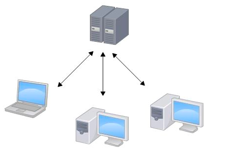
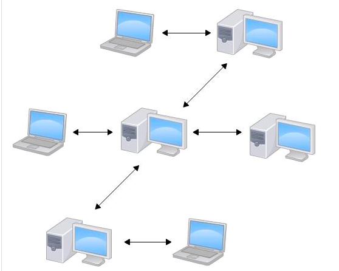

# Git Learning

# 1. git概述

## 1.1 git概述

git是目前世界上最先进的分布式版本控制系统(没有之一),是由linus开发的.

	所有的版本控制系统(包括git)都只能跟踪文本文件的改动(e.g. txt文件,网页,程序代码等).类似图片、视频等
	二进制文件,版本控制系统不能跟踪文件的变化(即具体改了啥不知道,也没法知道),只知道文件大小改变了.

## 1.2 SVN v.s git

SVN是集中式版本控制系统,git是分布式版本控制系统.

1.SVN控制版本原理

2.git版本控制原理

集中式(svn)和分布式(git)的区别:

	1.svn每一次commit都需要联网,这就需要网络的等待;断网的情况下,svn会丢掉版本控制记录,当多人的修改
		难以做快速的合并;如果SVN服务器没了,就会丢掉所有历史信息,因为本地只有当前版本以及部分历史信息;
	2.git只有在push、pull(与远程仓库交互)的时候需要联网,平时的commit可以直接操作;断网的情况下,git本
		地保存了版本记录,合并起来很方便;如果git服务器没了,不会丢掉任何git历史信息,因为本地有完整的版本
		库信息.你可以把本地的git库重新上传到另外的git服务商.

## 1.3 安装git

1.linux上安装git

	sudo apt-get install git

2.配置个人信息--->必须的,否则在commit需要输入该信息

	//1. 配置全局的用户名和邮箱---此时本机所有的提交都会用这个用户名和邮箱
	git config --global user.name "defychen"
	git config --global user.email 894739534@qq.com
	//全局的配置会修改进"~/.gitconfig"
	内容为:
	[user]
		name = defy.chen
		email = defy.chen@xxx.com
	
	//2. 配置当前的project的用户名和邮箱---此时只会作用于当前的project
	git config user.name "defychen"
	git config user.email 894739534@qq.com
	--->使用1即可.

## 1.4 创建版本库

1.创建一个git管理的仓库

	git init	// 将一个目录变成git可以管理的仓库
	/*
		显示:Initialized empty Git repository in /home/defychen/repository_normal/.git/
		--->表示初始化成功.
	*/

2.添加一个文件readme.txt

	touch readme.txt
	vim readme.txt
	/*
	内容为:
		Git is a version control system.
		Git is free software.
	*/
	git status	// 查看git状态
	git add readme.txt	//添加readme.txt,没有任何显示就是正确的操作.

3.提交commit

	git commit -m "Add readme.txt"