# Linux device driver development(linux4.0)

***

## Chapter 1 linux设备驱动概述及开发环境构建

### 1.1 设备的分类及特点

**驱动针对的对象是存储器和外设,而不是CPU内核,主要分为3个基础大类:**

1)字符设备:必须以串行顺序依次进行访问的设备(e.g. 鼠标、触摸屏等).

2)块设备:可以按任意顺序进行访问,以块为单位进行操作(e.g. 硬盘、eMMC等).

3)网络设备:主要面向网络数据包的发送和接收,内核与网络设备的通信使用套接字接口,不会在文件系统生成具体的节点.

### 1.2 Linux设备驱动与整个软硬件系统的关系

除网络设备外,字符设备和块设备都会映射到linux文件系统的文件和目录,通过文件系统的系统调用接口open()、read()、write()、close()等即可访问.

**Linux块设备访问方法**

	1.使用dd命令访问:
		dd if=/dev/sdb1 of=/dev/hdd	//将本地的/dev/hdb整盘备份到/dev/hdd
		dd if=/dev/zero bs=1024 count=1000000 of=/root/1Gb.file
		/*
			/dev/zero:一个输入设备,该设备可以无穷尽的提供0
			本例为产生一个block size为1024B,数量为count的块输出到/root/1Gb.file
		*/
	2.在块设备上建立FAT, EXT4, BTRFS等文件系统,然后以文件路径如"/home/defy/hello.txt"的形式进行访问.

Linux针对Nor, Nand等提供了独立的内存技术设备(Memory Technology Device, MTD)子系统,其上可运行YAFFS2, JFFS2, UBIFS等具备擦除和负载均衡能力的文件系统.

	应用程序开发使用C库函数(e.g.fopen(), fwrite(), fread(), fclose()等)比Linux的系统调用(e.g.open(),
	write(), read(), close()等)可移植性更好,因此推荐用C库函数.

### 1.3 Linux字符设备驱动框架

**字符设备在定义设备结构体时,一定会包含字符设备cdev结构体(struct cdev cdev);**

	struct light_cdev {
		struct cdev cdev;	/*字符设备cdev结构体*/
		/*其他设备的信息*/
	};

**字符设备驱动的框架:**

	/*open function*/
	int xxx_open(struct inode *inode, struct file *filp)
	{
		/*inode对应的是设备节点(/dev下面的),e.g. /dev/dsc0*/
		/*open的作用可以理解为:将操作设备使用节点转为使用文件，便于后面全部使用fd来操作*/
		struct light_cdev *dev;	/*设备结构体指针*/
		/*container_of:通过设备结构体变量中(probe的时候会定义一个设备结构体变量)的某个成员的首地址
		找到整个结构体变量的首地址.*/
		dev = container_of(inode->i_cdev, struct light_cdev, cdev);	
		/*
		para1:设备结构体中成员的首地址.在probe的时候,调用"cdev_add(&dev->cdev, devno, 1);",将cdev加
		入到cdev链表中,同时设备号与cdev建立起了对应关系.因为设备文件与设备号一一对应,而每个设备文件都对
		应一个inode节点.因此最终在probe建立的连接就是:
			1.inode->i_cdev会由cdev的地址填充.即:inode->i_cdev=&dev->cdev;
				因此:inode->i_cdev即为cdev的首地址
			2.inode->i_fop会由cdev的file_operations填充.因此透过inode能找到对应的driver中的函数.
				cdev与file_operations建立联系的函数:
				struct file_operations xxx_file_ops = {
						xxxx
				};
				cdev_init(&dev->cdev, &xxx_file_ops); //初始化cdev信息.
		para2:设备结构体类型;
		para3:设备结构体中的成员(此处为字符设备成员cdev)*/
	
		/*设备结构体变量作为文件(struct file *filp)的私有数据(private_data)，后续的read/write/ioctl/
		llseek函数通过filp->private_data访问设备结构体变量,体现linux面向对象的设计思想.
		PS:现在的做法是:
			1.设备结构体主要用于在probe注册设备和open打开设备时建立设备节点与driver之间的联系.通常会包括:
				1)struct cdev cdev;	//字符设备
				2)struct device *dev;	//device_create创建device
				3)dev_t devt;	//存储设备号
				4)struct mutex mutex;	//mutex可能会有(在需要互斥操作的driver中)
			2.私有数据
				1)私有数据结构体肯定会包括设备结构体的指针成员,用来使私有数据与设备关联.并且在open的时候
					会将设备结构体赋值给私有数据对应的设备结构体指针;
					struct test_priv {
						/* some private member*/
						struct test_dev *test; //设备结构体成员
					};
	
					struct test_dev *test = container_of(inode->i_cdev,
						struct test_dev, cdev);
					struct test_priv *priv = NULL;
					priv = devm_kzalloc(test->dev, sizeof(struct test_priv), GFP_KERNEL);
					...
					priv->test = test;
				2)私有数据一般在设备的open函数中申请,用来保证每次打开设备时得到的私有数据不一样;
				3)私有数据结构体会在open的时候赋值给file->private_data;
					file->private_data = (void *)s;
		*/
		filp->private_data = dev;
		...
	}
	
	/*release function*/
	int xxx_release(struct inode *inode, struct file *filp)
	{
		/*释放资源*/
		...
	}
	
	/*read function*/
	ssize_t xxx_read(struct file *filp, char __user *buf, size_t count, loff_t *f_pos)
	{
		/*__user:为一个宏,linux中定义的.表明后面的指针指向用户空间.*/
		
		/*通过filp(fd)获得设备结构体或私有数据结构*/
		struct light_cdev *dev = filp->private_data;
		/*使用dev进行相关的读操作*/
		
		/*copy_to_user函数
		para1:目标地址e.g.(buf)--->用户空间(user space)
		para2:源地址e.g.(&(dev->value))--->内核空间(kernel space)
		para3:复制的大小.e.g.sizeof(unsigned int).--->复制4 byte.
		返回为不能复制的字节数,成功时返回0;失败返回负值.
		*/
		if(copy_to_user(buf, &(dev->value), 1))
			return -EFAULT;	/*EFAULT:Bad address*/
		...
	}
	
	/*write function*/
	ssize_t xxx_write(struct file *filp, const char __user *buf, size_t count, loff_t *f_pos)
	{
		/*__user:为一个宏,linux中定义的.表明后面的指针指向用户空间.*/
		
		/*通过filp(fd)获得设备结构体或私有数据结构*/
		struct light_cdev *dev = filp->private_data;
		/*使用dev进行相关的写操作*/
	
		/*copy_from_user函数
		para1:目标地址e.g.(&(dev->value))--->内核空间(kernel space)
		para2:源地址e.g.(buf)--->用户空间(user space)
		返回为不能复制的字节数,成功时返回0;失败返回负值.
		*/
		if(copy_from_user(&(dev->value), buf, 1))
			return -EFAULT;	/*(14)EFAULT:Bad address*/
		...
	}
	
	/*ioctl function*/
	int xxx_ioctl(struct file *filp, unsigned int cmd, unsigned long arg)
	{
		/*通过filp(fd)获得设备结构体或私有数据结构*/
		struct light_cdev *dev = filp->private_data;
		/*根据cmd，使用dev进行相关操作*/
		switch(cmd) {
		case...
		default:
			-ENOTTY;	/*(25)Inappropriate ioctl for device*/
		}
		...
	}
	
	/*llseek  function*/
	loff_t xxx_llseek(struct file *filp, loff_t offset, int orig)
	{
		/*该函数被用户调用后更新文件的当前位置,并返回新位置.*/
		/*文件起始位置(orig):表示当前在文件中的哪个位置去读/写数据
			(e.g.文件头SEEK_SET;文件尾SEEK_END;当前位置:SEEK_CUR等.)
		文件读写位置:指示当前的读写位置(是一个变量)
		*/
		loff_t ret = 0;
		switch(orig) {
		case 0:	/*SEEK_SET:文件头*/
			if(offset < 0) {
				ret = -EINVAL;	/*Invalid argument*/
				break;
			}
			if((unsigned int)offset > GLOBALMEM_SIZE)	/*GLOBALMEM_SIZE:文件的最大值*/
			{
				ret = -EINVAL;
				break;
			}
			filp->f_pos = (unsigned int)offset;	/*更新文件位置*/
			ret = filp->f_pos;	//返回当前位置
			break;
		case 1: /*SEEK_CUR:当前位置*/
			if((filp->f_pos + offset) > GLOBALMEM_SIZE) {
				ret = -EINVAL;
				break;
			}
			if((filp->f_pos + offset) < 0) {
				ret = -EINVAL;
				break;
			}
			filp->f_pos += offset;
			ret = filp->f_pos;
			break;
		default: /*其他情况不支持(包括从文件尾)*/
			ret = -EINVAL;
			break;
		}
		return ret;
	}
	
	struct file_operations light_fops = {
		.owner = THIS_MODULE,
		.open = xxx_open,
		.release = xxx_release,
		.read = xxx_read,
		.write = xxx_write,
		.ioctl = xxx_ioctl,
		.llseek = xxx_llseek,
	};
	
	/*Module init function*/
	int __init xxx_init(void)
	{
		/*申请设备号*/
		dev_t devno;	/*保存设备号*/
		alloc_chrdev_region(&devno, 0, 1, "led");
		/*
			para1:保存申请到的设备号;
			para2:第一个次设备号(一般从0开始);
			para3:次设备号的个数(一般为1);
			para4:设备名称.在"/dev/devname"显示的名称.
		*/
	
		/*light_devp = kmalloc(sizeof(struct light_dev), GFP_KERNEL);
		kmalloc中:
			para1分配块大小(单位为字节);
			para2分配标记(GFP_KERNEL:内核空间中申请内存).
		kmalloc使用kfree释放,kfree("kmalloc返回的结构体实例e.g. light_devp")
		ENOMEM(12):Out of memory.
		一般分配了内存都会调用memset()进行初始化.
		kmalloc分配的内存在物理上是连续的.
		*/
	
		/*字符设备初始化*/
		cdev_init(&light_devp->cdev, &light_fops);	
		/*
			para1:设备结构体下的字符设备结构体变量;
			para2:文件操作结构体
		*/
		light_devp->cdev.owner = THIS_MODULE; //这一句应该是可有可无
		light_devp->cdev.ops = &light_fops; //这一句应该是可有可无
		
		/*字符设备添加到cdev链表中*/
		cdev_add(&light_devp->cdev, devno, 1);
		/*
			para1:设备结构体下的字符设备结构体变量;
			para2:申请的设备号;
			para2:次设备号的数目(一般为1)
		*/
		/*其他操作*/
		...
	}
	
	/*Module exit function*/
	void __exit xxx_exit(void)
	{
		/*从cdev链表中删除cdev节点*/
		cdev_del(&light_devp->cdev);
		/*注销字符设备*/
		unregister_chrdev_region(MKDEV(light_major, 0), 1);	
		/*
			para1:设备号;
			para2:count(次设备号的数目,一般为1)
			PS:para1设备号(devno)需要生成.e.g.MKDEV(light_major, 0)->para1:主设备号;para2:次设备号.
		*/
		/*释放申请的字符设备结构体内存*/
		kfree(light_devp);
	}
	
	module_init(xxx_init);
	module_exit(xxx_exit);
	
	MODULE_AUTHOR("xxx Corporation");
	MODULE_DESCRIPTION("xxxx");
	MODULE_LICENSE("GPL v2");
	MODULE_VERSION("1.0");

***

## Chapter 2 驱动设计的硬件基础

### 2.1 处理器

冯 诺依曼结构:指令存储器和数据存储器合并在一起,指令存储地址和数据存储地址指向同一个存储器的不同物理位置,因此指令和数据的位宽一样.

哈佛结构:指令和数据分开存储,指令和数据的位宽有不同的位宽;同时程序(指令)总线和数据总线分开,效率高.

改进的哈佛结构:改进为公用的地址总线和数据总线(程序和数据存储器分时共用这两条总线).数据总线完成程序存储器或数据存储器与CPU的数据交换;地址总线完成寻址程序和数据.

指令集:CPU分为两类(RISC:精简指令集;CISC:复杂指令集).

### 2.2 存储器

#### 2.2.1 ROM & Flash

ROM:EEPROM完全可以用软件来擦写.

NOR Flash(或非):类SRAM接口(CPU的接口也是类SRAM接口),特点是可芯片内执行(execute in place, XIP).

NAND Flash(与非):以块方式访问,不支持芯片内执行.

	1.NAND Flash较NOR Flash容量大、价格低;
	2.NAND FLash中每个块的最大擦写次数是100万次,而NOR Flash的擦写次数为10万次;
	3.NAND Flash的擦除、编程速度远超过NOR Flash.
	PS:Flash还存在一个负载均衡的问题,不能老是在同一块位置进行擦除和写的活动,这样容易导致坏块.

CFI(Common Flash Interface):公共闪存接口,是一个从NOR Flash中读取数据的公开、标准接口,可使用系统软件查询到已安装的Flash器件的各种参数(包括:Flash的制造商ID和设备ID,Flash的大小等等).

Flash的编程原理是将1写0,不能将0写1.擦除过程是将所有位都写1(即块内所有字节变为0xFF).

OTP(One-Time Programmable):一次性可编程存储器,由SoC集成一个eFuse电编程熔丝作为OTP.

#### 2.2.2 RAM

DRAM:电荷形式存储,数据存储在电荷中,因为电容器漏电会出现电荷丢失,因此DRAM器件需要定期刷新.

SRAM:静态RAM,晶体管组成,供电就会保持固定值,没有刷新周期.

DPRAM:双端口RAM,两个处理器之间交互数据.一端写入数据,另一端通过轮询或中断获知并读取其写入的数据.

#### 2.2.3 FIFO

FIFO是先进先出队列,进出有序.

	1.FIFO多用于数据缓冲;
	2.某一时刻只能设备一边作为输入,一边作为输出;
	3.如果FIFO的区域有n个字节,通过循环n次读取同一个地址能将该片区域字节全部读出,不能指定偏移地址
		--->这是FIFO本身的特性.

### 2.3 接口与总线

#### 2.3.1 串口

UART:通用异步收发传输器(Universal Asynchronous Receiver/Transmitter),是一个特定的功能的硬件.主要功能是串行数据和并行数据之间的转换.直接使用CPU使用的电平即TTL电平(0-3.3V之间).

UART通信:UART属于一种串行通信协议,通信双方需要采用相同的帧格式和波特率,才能在未共享时钟信号的情况下,仅用两根信号线(Rx和Tx)就可以完成通信过程,因此也叫异步串行通信.

RS232/RS485:两种不同的电气协议.只是物理层的电气接口要求,作用于数据的传输通路上,并不内含对数据的处理方式.因此,RS232/RS485仅仅只是传输数据,并非通讯协议.目前工业控制的RS232口一般只使用RxD(2),TxD(3),GND(5)三条线.

RS232/RS485与UART是相对独立的,由于电气特性的差别,两者需要有专用的器件.比如RS232/RS485驱动芯片,可以将CPU经过UART传送过来的电压信号驱动成RS232/RS485逻辑电平.

在板卡上经常看到的串口,其实是已经经过转换后的RS232逻辑电平.

#### 2.3.2 I2C

I2C(内置集成电路):两线式串行总线,用于连接微控制器及其外围设备.两个信号线分别为SDA(数据线)、SCL(时钟线).

**SCL稳定在高电平时,SDA由高电平到低电平的变化将产生一个开始位;由低电平到高电平的变化将产生一个停止位.**

#### 2.3.3 SPI

SPI(Serial Peripheral Interface):串行外设接口,是一种同步串行外设接口,使CPU与各种外设以串行方式进行通信.一般主控为:SoC,从设备为:外设.

#### 2.3.4 USB

USB(Universal Serial Bus):通用串行总线.

USB主机控制器(简称USB主机.e.g.PC机)用于连接USB外设;USB设备适配器(简称USB设备)用于作为其他计算机系统的USB外设(e.g.手机充当U盘).

USB系统的物理拓扑系统包括:USB主机,USB设备,Hub(USB集线器(其他还有网络Hub)--用于USB扩展，进而可连接多个USB设备).

#### 2.3.5 eMMC

eMMC(Embedded Multi Media Card) = NAND Flash+闪存控制芯片+标准接口封装,属于多芯片封装--MCP(Multi-Chip Package).

eMMC接口电压分为1.8V和3.3V两种.

SSD(Solid State Disk) = 多个NAND Flash+多主控(闪存控制芯片)+缓存,eMMC都为单个.

***

## Chapter 3 Linux内核及内核编程

### 3.1 Linux内核特点(Linux 2.6)

**1.调度器**

Linux 2.6以后版本的内核使用了新的进程调度算法,在高负载的情况下有极其出色的性能,并且对多处理器也有很好的扩展.

	Linux 2.6内核调度器早期采用O(1)算法,之后转移到CFS(Completely Fair Scheduler,完全公平调度)算法.
	Linux 3.14中增加了一个新的调度类:SCHED_DEADLINE,实现了EDF(Earliest Deadline First,最早截止
		期限优先)调度算法.

**2.内核抢占**

内核抢占:Linux 2.6以后版本的内核任务可以被抢占,从而提高系统的实时性.但存在一些不可抢占区间(e.g.中断上下文、软中断上下文、自旋锁锁住的区间等原子上下文进程).

**3.线程模型**

Linux 2.6以后版本的线程采用NPTL(Native POSIX Thread Library,本地POSIX线程库)模型,操作速度得以极大提高.

**4.虚拟内存**

Linux 2.6以后的内核融合了r-map(反向映射)技术(通过页结构体快速寻找到页面的映射),显著改善虚拟内存在负载下的性能.

**5.文件系统**

ext2/ext3/ext4是Linux系统默认安装的文件系统.

	当前文件系统研究热点是基于B树的Btrfs,在扩展性、数据一致性、多设备管理和针对SSD的优化等方面优于ext4.

**6.音频**

Linux 2.6使用ALSA(Advanced Linux Sound Architecture,高级Linux音频体系结构)取代了缺陷很多的旧的OSS(Open Sound System).

	ALSA支持USB音频和MIDI设备,并支持全双工重放等功能.

**7.总线、设备和驱动模型**

Linux 2.6以后版本的内核使用总线将设备和驱动联系起来.

	总线中的match()函数用来匹配设备和驱动,匹配成功就会执行驱动程序中的probe()函数.

**8.电源管理**

Linux 2.6以后版本的内核支持ACPI(Advanced Configuration and Power Interface,高级配置和电源接口),用于调整CPU在不同的负载下工作于不同的时钟频率以降低功耗.

**9.联网和IPSec**

Linux 2.6版本的内核加入对IPSec的支持,加入对新的NFSv4(网络文件系统)的客户机/服务器的支持,并改进了对IPv6的支持.

**10.用户界面**

Linux 2.6版本的内核重写了帧缓冲/控制台层,人机界面层加入了近乎所有接口设备的支持.

	相较于2.4，,内核API增加了以下新功能:
		内存池、sysfs文件系统、内核模块有.o变为.ko、驱动模块的编译方式等.

**11.ARM架构的变更**

采用DTS管理设备和驱动.

### 3.2 linux内核组成

### 3.2.1 Linux内核源代码的目录结构

	1.arch:包含和硬件体系结构相关的代码,每种平台占一个相应的目录.在arch目录下,存放的是各个平台以及各个
		平台的芯片对Linux内核进程调度、内存管理、中断等的支持,以及各个具体的SoC和电路板的板级支持代码;
	2.block:块设备驱动程序I/O调度;
	3.crypto:常用加密和散列算法(e.g.AES、SHA等),还有一些压缩和CRC校验算法;
	4.documentation:内核各部分的通用解释和注释;
	5.drivers:设备驱动程序,各个不同的驱动占用一个子目录(e.g.char、block、net、mtd、i2c等);
	6.fs:所支持的各种文件系统(e.g.EXT、FAT、NTFS、JFFS2等);
	7.include:内核API级别头文件,与系统相关的头文件放置在include/linux子目录下;
	8.init:内核初始化代码,著名的start_kernel()就位于init/main.c文件中;
	9.ipc:进程间通信的代码;
	10.kernel:内核最核心的部分,包括进程调度、定时器等,和平台相关的一部分代码放在arch/*/kernel目录下;
	11.lib:库文件代码;
	12.mm:内存管理代码,和平台相关的一部分代码放在arch/*/mm目录下;
	13.net:网络相关代码,实现各种常见的网络协议;
	14.scripts:用于配置内核的脚本文件;
	15.security:主要是一个SELinux的模块;
	16.sound:ALSA、OSS音频设备的驱动核心代码和常用设备驱动;
	17.usr:实现用于打包和压缩的cpio等;
	PS:
		1.内核一般要做到drivers和arch的软件架构分离,驱动中不包含板级信息,让驱动跨平台;
		2.内核的通用部分(e.g.kernel、fs、ipc、net等)则与具体的硬件(arch和driver)剥离.

### 3.2.2 Linux内核的组成部分

linux内核主要由:进程调度(SCHED)、内存管理(MM)、虚拟文件系统(VFS)、网络接口(NET)、进程间通信(IPC)五个子系统组成.

**1.进程调度(SCHED)**

进程调度控制系统中的多个进程对CPU访问,使得多个进程在CPU中"微观串行、宏观并行"的执行.进程调度处于系统的中心位置.

linux进程状态转换:


	1.linux内核中,使用task_struct结构体来描述进程,该结构体包含描述该进程的内存资源、文件系统资源、文件
		资源、tty资源、信号处理等的指针;
	2.linux的线程采用轻量级进程模型来实现,在用户空间通过pthread_create() API创建线程的时候,本质上内核
		只是创建了一个新的task_struct;
	3.绝大多数进程(以及进程中的多个线程)是由用户空间的应用创建的,当存在底层资源和硬件访问的需求时,会通过
		系统调用进入内核空间;
	4.在内核编程中,如果需要几个并发执行的任务,可以启动内核线程,这些线程没有用户空间.启动内核线程函数:
		pid_t kernel_thread(int (*fn)(void *), void *arg, unsigned long flags);

**2.内存管理(MM)**

内存管理的主要作用是控制多个进程安全地共享主存储区域.当CPU提供MMU时,linux内存管理对于每个进程完成虚拟内存到物理内存的转换.

	1.32-bit处理的linux的每个进程享有4GB的内存空间.0-3GB属于用户空间,3-4GB属于内核空间,内核空间对常规
		内存、IO设备内存以及高端内存有不同的处理方式;
	2.内核空间和用户空间的界限大小调整方式:
		menuconfig->Kernel Features->Memory split

linux内存管理:


**3.虚拟文件系统(VFS)**


	1.用户空间(应用程序):调用open/read/write/close函数;
	2.vfs层:调用filp_open, vfs_read, vfs_write, filp_close函数--->read/write进入内核态实际执行的是
		sys_read/sys_write,然后再执行到vfs_read/vfs_write等;
	PS:需要进一步深入.

**4.网络接口**

linux中网络接口分为网络协议和网络驱动程序.

	1.网络协议:负责实现每一种可能的网络传输协议;
	2.网络设备驱动程序负责与硬件设备通信.

linux内核支持的协议栈种类多,包括Internet、Unix、CAN、NFC、Bluetooth、WiMAX、IrDA等.但上层的应用程序统一使用套接字接口.


**5.进程间通信**

进程间通信包括:信号量、共享内存、消息队列(System V中的IPC)、管道、UNIX域套接字等.

### 3.3 linux内核编译及加载

#### 3.3.1 linux内核的编译

	1.arch/arm/configs/xxx_defconfig:为某电路板提供默认配置;
	2.export CROSS_COMPILE=arm-linux-gnueabi-	//导出交叉编译工具
	3.export ARCH=arm		//导出架构
	4.make xxx_defconfig为xxx开发板配置内核.
	5.make zImage	//编译内核(编译应该直接:make -j2就可以了,此处这样不确定行不行?)
	6.make modules	//编译可动态加载模块(不确定行不行?)
	PS:编译之后各文件位置:
		1.未压缩的内核映像vmlinux和内核符号表文件System.map位于源代码的根目录(即./);
		2.压缩的内核映像zImage位于arch/arm/boot/zImage;
		3.内核模块在内核各对应的目录中.

**linux配置系统组成**

	1.Makefile:定义linux内核的编译规则;
	2.Kconfig(配置文件):给用户提供配置选择的功能;
	3.配置工具:包括配置命令解释器和配置用户界面(字符界面和图形界面等).配置工具使用的脚本语言包括:
		Tcl/TK/Perl等.

make xxx_defconfig和make menuconfig均会写入一个.config配置文件中.该配置文件记录哪些被编译进内核,哪些被编译为模块.

**linux menuconfig菜单结构分析:**

	运行make menuconfig时,首先分析与体系结构对应的./arch/xxx/Kconfig文件(xxx为传入的ARCH参数):
		1.该Kconfig文件包含一些与体系结构相关的配置项和配置菜单;
		2.通过source语句引入一系列的Kconfig(e.g.source "net/Kconfig");
		3.这样一层一层的引入形成linux menuconfig的菜单结构.**

#### 3.3.2 Kconfig和Makefile

**1.Kconfig:提供界面中的配置选项.**

	config TTY_PRINTK	/*提供给Makefile中的编译项,Makefile中会自动变为"CONFIG_TTY_PRINTK"*/
		tristate "TTY driver to output user messages via printk"
		/*
			tristate后面的内容为在菜单中显示的字符串;
			tristate:三态(编译入内核(Y),不编译(N),编译为模块(M));bool:两态(编译入内核(Y),不编译(N));
			上述的提示信息也可以使用如下格式代替:
				tristate
				prompt "TTY driver to output user messages via printk"	//使用prompt作为提示
			PS:除了tristate(三态),还有bool(两态,Y/N),其他的string/hex/int不常用---略.
		*/
		depends on EXPERT && TTY
		/*
			depends on EXPERT && TTY--->表示多重依赖,同时依赖EXPERT和TTY.只有两个都选中,
				该选项才会出现.
			bool实例:
				depends on BAR
				bool "foo"		//提示
				default			//默认是选中的
			上述bool实例也可以写成:
				bool "foo" if BAR	//使用if表示依赖关系
				default if BAR
		*/
		default n	/*默认值,用户如果不设置就使用默认值.此处为不编译.*/
		---help---
			....	//必须缩进
		/*
			(help)---help---:表示后面的为帮助信息."help"和"---help---"无区别,只是为了好看
				使用"---help---".
		*/

**2.Makefile:指定编译规则.**

	obj-$(CONFIG_TTY_PRINTK)	+= ttyprintk.o 
	/*
		CONFIG_TTY_PRINTK配置为"Y/M",等同于"obj-y/obj-m",则会编译"ttyprintk.c",分别为"编译进内核"
			或生成模块"ttyprintk.ko";如果配置为"N",等同于obj-n,不编译ttyprintk.c.
	*/

内核中的Makefile语法:

1)目标定义:
	
	obj-y += foo.o	/*由foo.c或foo.s编译得到foo.o并链接进内核(无条件编译)*/
	obj-m += foo.o	/*foo.c作为模块编译,而obj-n表示不编译*/

2)多文件模块定义:

采用"模块名-y"或"-objs"定义模块的组成文件(一般使用"模块名-y")
	
	obj-$(CONFIG_EXT2_FS) += ext2.o
	ext2-y := balloc.o dir.o file.o fsync.o ialloc.o ... 
	/*
		模块名字ext2,由balloc.o dir.o file.o...等多个目标文件链接生成ext2.o,并最终编译进内核或成为
		"ext2.ko"模块文件
	*/
	ext2-$(CONFIG_EXT2_FS_POSIX_ACL) += acl.o	
	/*
		如果CONFIG_EXT2_FS_POSIX_ACL被选择,将编译acl.c得到acl.o并链接进ext2.o.
	*/

3)目录层次的迭代

	obj-$(CONFIG_EXT2_FS) += ext2/
	/*
		当CONFIG_EXT2_FS的值为y或m时,kbuild将会把ext2目录列入向下迭代的目标中.
	*/

**3.菜单结构**

	menu "Network device support"
		depends on NET	/*且会继承依赖关系(menu一般仅仅是一个菜单名,没有对应真实的配置选项)*/
	config NETDEVICES	/*子菜单*/
		...
	endmenu
	/*
		menu和endmenu之间构成菜单结构.
		1.menu后面的提示"Network device support"是一个主菜单,没有对应真实的配置选项,也没有3/2种状态;
		2.处于menu和endmenu之间的所有配置选项都是该菜单的子菜单,也会继承父菜单的依赖关系.
			e.g.上述中的主菜单对NET的依赖会加到配置选项"NETDEVICES"的依赖列表中.
	*/
	PS:除了"menu...endmenu"这种形成菜单外;依赖关系也有可能形成菜单.

choice...endchoice定义选择群菜单方法:

	1.定义方法
	choice
	depends on FB_S3C_VGA
	prompt "Select VGA Resolution for S3C Framebuffer"	//提示
	default FB_S3C_VGA_1024_768
	config FB_S3C_VGA_1024_768
		bool "1024*768@60Hz"
		---help---
		TBA
	config FB_S3C_VGA_640_480
		bool "640*480@60Hz"
		---help---
		TBA
	endchoice
	2.显示效果
	"选择群菜单"点开之后是下面这种效果:
		(*)1024*768@60Hz	//默认选中
		()640*480@60Hz

**4.实例---在drivers下添加一个test目录**

1.test driver的树形目录结构

	|-- test
		|-- cpu		//test目录下有一个cpu的目录
			|-- cpu.c
			|-- Makefile
		|-- test.c
		|-- test_client.c
		|-- test_ioctl.c
		|-- test_proc.c
		|-- test_queue.c
		|-- Makefile
		|-- Kconfig

2.Kconfig的添加

	1.在test目录下的Kconfig内容:
		#
		# TEST driver configuration
		#
		menu "TEST Driver"
		comment " TEST Driver"
		
		config CONFIG_TEST
			bool "TEST support"
		
		config CONFIG_TEST_USER
			tristate "TEST user-space interface"
			depends on CONFIG_TEST
		endmenu
	2.使能test下的Kconfig
		在arch/arm/Kconfig文件最后添加:
			source "drivers/test/Kconfig"	//会引用到test目录下的Kconfig

3.Makefile的添加

	1.test目录下的Makefile内容:
		# drivers/test/Makefile
		#
		# Makefile for the TEST.
		#
		obj-$(CONFIG_TEST) += test.o test_queue.o test_client.o
		/*
			选中CONFIG_TEST配置项,就变成:
				obj-y += test.o test_queue.o test_client.o--->会编译进内核.
			如果编译成模块一般写成:
				obj-$(CONFIG_TEST) += test_module.o	//会得到一个模块的文件名,为test_module.ko
				test_module-y := test.o test_queue.o test_client.o
		*/
		obj-$(CONFIG_TEST_USER) += test_ioctl.o
		/*
			此处CONFIG_TEST_USER为三态,说明test_ioctl.o不依赖其他模块.可单独编译成模块加载.
		*/
		obj-$(CONFIG_PROC_FS) += test_proc.o
		//CONFIG_PROC_FS没有放在menu...endmenu中.
	2.cpu目录下的Makefile内容:
		# drivers/test/cpu/Makefile
		# 
		# Makefile for the TEST CPU
		#
		obj-$(CONFIG_TEST_CPU) += cpu.o
	3.在test的父目录的Makefile内容增加:
		obj-$(CONFIG_TEST) += test/		//加入该行,使得在编译内核时能进入到test目录

1)Kconfig

Kconfig在某个目录下编辑好后,需要在./arch/arm/Kconfig中添加:

	/*C3505目录结构*/	
	source "drivers/Kconfig"	/*在"./arch/arm/Kconfig中添加,包括了drivers下面的Kconfig"*/
	
	source "drivers/alidrivers/modules/Kconfig" 
	/*在"./drivers/Kconfig"中添加,包括了modules下面的Kconfig*/
	/*(drivers/alidrivers/modules/Kconfig)中描述alixxx的菜单信息*/
	
	/*S3922目录结构*/
	source "drivers/Kconfig"	/*在"./arch/arm/Kconfig中添加,包括了drivers下面的Kconfig"*/
	source "drivers/alidrivers/modules/Kconfig"
		/*在"./drivers/Kconfig"中添加,包括了modules下面的Kconfig*/
	source "drivers/alidrivers/modules/alirpc/Kconfig"	
		/*在"drivers/alidrivers/modules/Kconfig"中添加,包括了alirpc下面的Kconfig*/
	/*(drivers/alidrivers/modules/aliprc/Kconfig)中描述alixxx的菜单信息*/---因为这些都会依赖rpc模块

2)Makefile

	obj-y += alidrivers/modules/	
	/*
		在"./drivers/Makefile"中添加,强制(无条件)进入该目录"alidrivers/modules/"
	*/
	obj-$(CONFIG_ALI_DSC) += alidsc/	
	/*
		在"./drivers/alidrivers/modules/Makefile"中添加,根据"$(CONFIG_ALI_DSC)"决定是否进
		入"alidsc/"目录.
	*/
	obj-$(CONFIG_ALI_DSC) += alidsc.o
	/*在"./modules/alidsc"中添加具体的编译命令*/

### 3.4 Linux内核引导

linux内核引导流程:

	1.SoC内嵌bootrom(每个CPU都有一份bootrom),一上电运行所有CPU中的bootrom(初始化一些堆栈信息?);
	2.CPU0中的bootrom会去引导bootloader(在SD/eMMC/Nand/等上),其他CPU(非CPU0)则进入WFI状态等待CPU0
		唤醒;
	3.CPU0中的bootloader紧接着引导linux kernel,在linux kernel启动阶段CPU0会发出中断唤醒其他CPU运行;
	4.CPU0导致用户空间的init程序被调用,init程序再派生其他进程.接着CPU0和CPU1共同担负这些负载,进行负载
		均衡.

linux内核引导流程图:


**zImage(内核镜像)解析**

	1.zImage(内核镜像)由没有压缩的解压算法和被压缩的内核组成;
	2.bootloader跳到zImage后,利用zImage自身的解压逻辑把压缩的内核解压出来,再进行下一步的kernel运行.

### 3.5 Linux下的C编码特点

#### 3.5.1 Linux编码风格

**1.Windows的编码风格**

	#define PI 3.1415926		//大写字母表示宏
	int minValue, maxValue;		//变量:第一个单词全小写,其后单词首字母大写.
	void SendData(void);		//函数:所有单词的首字母大写

**2.linux的编码风格**

1.命名:下划线间隔

		#define PI 3.1415926		//大写字母表示宏
		int min_value, max_value;	//变量:下划线分隔单词(单词均小写)
		void send_data(void);		//函数:下划线分隔单词(单词均小写)

2.缩进

		使用TAB进行缩进

3."{}"使用原则
	
	1.结构体、if/for/while/switch语句:"{"不另起一行:
		结构体:
			struct var_data {	//"{"不另起一行
				int len;
				char data[0];
			};
		if:
			if (a == b) {
				a = c;
				d = a;
			}
		for:
			for (i = 0; i < 10; i++) {
				a = c;
				d = a;
			}
	2.如果if,for循环只有一句,不要加"{}":
		for (i = 0; i < 10; i++)
			a = c;		//只有一行,不要加"{}"
	3.if...else,else语句不另起一行:
		if (x == y) {
			...
		} else if (x > y) {	//此处不另起一行
			...
		} else {
			...
		}
	4.函数另起一行:
		int add(int a, int b)
		{
			return a + b;
		}
	5.switch和case对齐:
		switch (suffix) {
		case 'G':
		case 'g':	//case顶端和switch对齐
			mem <<=30;
			break;
		...
		default:
			break;
		}
	6.空格使用:
		for ( i = 0; i < 10; i++ ) {	//注意for中的一些空格
			...
		}

**3.linux代码风格检查**

内核下的scripts/checkpatch.pl可以检查代码风格是否符合linux coding style.

#### 3.5.2 GNU C与ANSI C

linux用的C编译器为GNU C编译器.GNU C编译器对标准C语言进行了一系列扩展,以增强标准C的功能.

**1.零长度和变量长度的数组**

	1.零长度数组
		1.零长度数组定义
		struct var_data {
			int len;
			char data[0];	//表示数组含有0个元素,不占用任何的空间(即不会分配任何的内存空间)
		};
		/*
			该结构体的长度为: sizeof(struct var_data) = sizeof(int) = 4-->零长度数组不占用空间
		*/
		2.如果struct var_data的数据域(即data)就保存在struct var_data紧接着的内存区域中,通过以下方式
			可以遍历这些数据:
		struct var_data s;
		...
		int i;
		for (i = 0; i < s.len; i++) {
			printf("%02x", s.data[i]);	//遍历紧接着的内存的数据
		}
	2.变量长度数组(使用1个变量来定义数组)
		int main(int argc, char *argv[])
		{
			int i, n = argc;
			double x[n];	//n为一个传进来的变量,可通过该变量定义一个数组
	
			for (i = 0; i < n; i++)
				x[i] = i;
			return;
		}

**2.case范围**

GNU C支持case x...y语法:

	switch (ch) {
	case '0'...'9':
		/*
			等价于标准C中的:
				case '0':
				case '1':
				case '2':
				case '3':
				case '4':
				case '5':
				case '6':
				case '7':
				case '8':
				case '9':
		*/
		c -= '0';
		break;
	case 'a'...'f':
		c -= 'a' - 10;
		break;
	case 'A'...'F':
		c -= 'A' - 10;
		break;
	}

**3.语句表达式**

GNU C将包含在小括号中的复合语句看成是一个表达式,称为语句表达式.

	#define min_t(type, x, y) \
		({ type __x = (x); type __y = (y); __x < __y ? __x : __y;})
	/*
		1.大括号包含的复合语句包含在一对小括号中,GNU C看成一个表达式;
		2.type表示类型的泛指,调用该宏时可以传入int/double/float等类型;
		相比于标准C不会产生副作用:
			#define min(x, y) ((x) < (y) ? (x) : (y))
		如果是以下调用:
			mint(++ia, ++ib)会展开为((++ia) < (++ib) ? (++ia) : (++ib)),此时传入的宏参数会增加两次.
			而min_t则不会有副作用,因为重新定义了__x和__y两个局部变量.
		如果是:
			int ia = 2, ib = 3;
			printf("compare value: %d\n", min_t(int, ++ia, ++ib));
			//结果为:compare value: 3(因为ia增加了1)
	*/
	int ia, ib, mini;
	float fa, fb, minf;
	mini = min_t(int, ia, ib);	//type泛指,接收int
	minf = min_t(float, fa, fb);

**4.typeof关键字**

typeof(x)可以获得x的类型.利用typeof重新定义min这个宏:

	#define min(x, y) ({	\
		const typeof(x) _x = (x);	\
		/*
			typeof(x):获得x的类型,并声明一个局部变量_x,初始化为x.
		*/
		const typeof(y) _y = (y);	\
		(void) (&_x == &_y);		\	//用于检查_x和_y的类型是否一致.如果不一致,会报warning.
		_x < _y ? _x : _y;			\
	})

**5.按某对齐向上/下取整,整除向上/下取整及两数取大/小的实现**

1.__extension__:GCC对标准C语言进行了扩展,当用到扩展功能时,GCC编译器会提出警告.使用__extension__关键字可以告诉GCC不要提出警告.

2.__typeof__:得到某个变量的类型(e.g.__typeof__(x):得到x的类型.与typeof相同).

	1.x按y对齐,并向上取整(超出了就入)
		#define roundup(x, y) __extension__ ({ \
				const __typeof__(x) __x = (x); \	//定义一个与x类型相同的局部变量__x并初始化为x.
				const __typeof__(y) __y = (y); \	//定义一个与x类型相同的局部变量__y并初始化为y.
				((__x + __y - 1) / __y) * __y;})
		调用:
			int round_up_val = roundup(4, 5);
			//会将4,5的值代入,最后计算得到5并赋值给round_up_val.
	2.x按y对齐,并向下取整(四舍五入)
		#define rounddown(x, y) __extension__ ({ \
				__typeof__(x) __x = (x); \
				__typeof__(y) __y = (y); \
				__x - (__x % __y);})
		调用:
			int round_down_val = rounddown(4, 5);
			//会将4,5的值代入,最后计算得到0并赋值给round_down_val.
	3.x/y整除向上取整
		#define DIV_ROUND_UP(n, d) (((n) + (d) - 1) / (d))
		/*位于./include/linux/kernel.h中*/
	4.x/y整除向下取整
		略.	//正常就是向下取整.
	5.x,y取较大值
		#define max(x, y) __extension__ ({ \
				__typeof__(x) __x = (x); \
				__typeof__(y) __y = (y); \
				(void)(&__x == &__y); \		//检查参数__x和__y的类型是否相同.
				__x < __y ? __y : x;})
	6.x,y取较小值
		#define min(x, y) __extension__ ({ \
				__typeof__(x) __x = (x); \
				__typeof__(y) __y = (y); \
				(void)(&__x == &__y); \		//检查参数__x和__y的类型是否相同.
				__x < __y ? __x : __y;})

**6.可变参数宏**

接受可变数目的参数.

	#define pr_debug(fmt, arg...) \
				printk(fmt, ##arg)
		/*
			arg前面的"##"为了处理arg不代表任何参数的情况,GNU C预处理器会丢弃前面的逗号.
		*/
	调用:
		1.pr_debug("%s:%d", __func__, __LINE__);
		会被展开为:
			printk("%s:%d", __func__, __LINE__);
		2.pr_debug("success!\n");	//arg不带任何参数
		会被正确展开为:
			printk("success!\n");

**7.结构体初始化**

	//声明一个struct file_operations结构体变量xxx_fops,并进行初始化:
	struct file_operations xxx_fops = {
		.owner = THIS_MODULE,
		.open = xxx_open,
		/*
			.open = xxx_open,
			open为结构体struct file_opeartions一个函数指针:
				struct file_operations {	//该结构体位于:./include/linux/fs.h中
					...
					int (*open)(struct inode *, struct file *);
					...
				};
			即为:
				.open = 函数名(函数名也是函数指针)--->切记:后面是一个","而不是";"
		*/
		.close = xxx_close,
		.release = xxx_release,
		.unlocked_ioctl = xxx_ioctl,
	};

**8.当前函数名**

__FUNCTION__:保存函数在源码中的名字;__PRETTY_FUNCTION__:保存带语言特色的函数名字.C99支持__func__宏,linux编程推荐使用__func__.

	void example(void)
	{
		printf("This is a function: %s", __func__);	//会显示函数名:example
	}

**9.特殊属性声明**

作用于函数、变量和类型,以便手动优化代码和定制代码检查的方法:

	格式为:
		__attribute__((noreturn/format/unused/section/aligned/packed))	//一般在声明后面添加

如果存在多个属性,则以逗号","分隔.

	1.noreturn:作用于函数,表示函数不返回.
		void do_exit(long error_code) __attribute__((noreturn));
	2.unused:作用于函数和变量,表示可能不会用到,避免编译器产生警告信息.
		__attribute__((unused)) int a = 0;
		static __attribute__((unused)) int b = 0;
	3.aligned:作用于变量、结构体、联合体,指定对齐方式.
		struct example_struct {
			char a;
			int b;
			long c;
		}__attribute__((aligned(4)));
		/*
			表示该结构体4字节对齐.结构体中每个成员最少占用4字节,因此此处总共占用16(4+4+8)字节.
		*/
	4.packed:用于变量或结构体成员时表示使用最小可能的对齐--->使用较多;
			 用于枚举、结构体或联合体时表示使用最小的内存--->不确定哪里用.
		struct example_struct {
			char a;
			int b;
			long c;
		}__attribute__((packed));	//使用最小对齐(即1Byte).此处总共占用大小为9(1+4+4)byte.

__attribute__((format(printf, x, y)))的使用:

编译器检查函数调用与函数声明的各参数的格式化字符串是否匹配.

	format(archetype, string-index, first-to-check)
	/*
		archetype:指定风格(e.g.printf, scanf).一般使用printf即输出结果.
		string-index:指定检查函数的第几个参数表示格式化字符串.
		first-to-check:指定从函数的第几个参数开始进行格式化字符串的检查.
	*/

实例:

	#include <stdio.h>
	#include <stdarg.h>
	
	#define __formatted_print __attribute__((format(printf, 1, 2)))
		//表示检查函数的第一个参数作为格式化字符串,从第二个参数开始检查是否符合格式化的形式.
	
	__formatted_print void TRACE(const char *fmt, ...)
	{
		//第一个参数为格式化,第二个参数为需要检查的参数
		va_list ap;
		va_start(ap, fmt);
		(void)vprintf(fmt, ap);
		va_end(ap);
	}
	
	int main(void)
	{
		TRACE("iValue = %d\n", 6);	//检查时,第一个参数为格式,第二个参数需要检查的.此处符合要求.
		TRACE("iValue = %d\n", "test");	//检查时,因为"test"为字符串不符合"%d"形式.在编译时会报错.
	}
	
	/*
		编译:gcc test.c -c -Wall test //必须是-Wall.
		结果为:
		test.c: In function ‘main’:
		test.c:21:2: warning: format ‘%d’ expects argument of type ‘int’, but argument 2 has type
		'char *' [-Wformat=]
		  TRACE("iValue = %d\n", "test");
		  ^
		gcc: warning: test: linker input file unused because linking not done
	*/

**10.内建函数--->以"__builtin"开始**

Linux内核编程中常用likely()和unlikely()底层调用的likely_notrace()、unlikely_notrace()就是基于__builtin_expect(EXP, C)实现的.

likely()和unlikely()主要用于提高CPU性能,尽可能不执行指令跳转.

	if (likely(x))		//表示x(变量或表达式)为真的可能性比较大.用于分支预测,可以提高CPU性能.
	if (unlikely(x))	//表示x(变量或表达式)为假的可能性比较大.用于分支预测,可以提高CPU性能.

likely()和unlikely()内部实现:

	/*
		__builtin_expect()是gcc(version >= 2.96)提供的,目的是将"分支转移"的信息提供给编译器.
			这样编译器可以对代码进行优化,以减少指令跳转带来的性能下降.
	*/
	#define likely(x) __builtin_expect((x), 1)		//表示x的值为真的可能性比较大.
	#define unlikely(x) __builtin_expect((x), 0)	//表示x的值为假的可能性比较大.
	
	//还有一种用法:
	#define likely(x) __builtin_expect(!!(x), 1)
		//"!!"是将x转换成bool型,表示为true的可能性比较大.
	#define unlikely(x) __builtin_expect(!!(x), 0)
		//"!!"是将x转换成bool型,表示为false的可能性比较大.

如果编译时使用"-ansi-pedantic"编译选项,则会告诉编译器不使用GNU C扩展语法,容易报错.一般不这么使用.

#### 3.5.3 do {} while(0)语句

do{} while(0)主要用于宏,目的是保证宏定义的使用者能无编译错误的使用宏.

	#define SAFE_FREE(p) do{free(p); p=NULL;} while(0)	//定义宏时,后面是没有分号";"
	
	if (NULL != p)
		SAFE_FREE(p);
	else
		...	/*do something*/
	
	//会被展开为:
	if (NULL != p)
		do{free(p); p=NULL;}while(0);
		/*
			不会有任何的编译错误.
			do{} while(0);	--->后面是由分号";".
		*/
	else
		.../*do something*/

#### 3.5.4 goto语句

linux内核源代码中对goto应用非常广泛,但一般只用于错误处理(e.g.注销驱动程序、资源释放等,与正常的注册、资源申请顺序相反).

	if (register_a() != 0)
		goto err;
	if (register_b() != 0)
		goto err1;
	...
	
	err1:
		unregister_a();
	err:
		return ret;

### 3.6 工具链

交叉工具链构建比较复杂,一般通过下载得到.

ARM linux工具链解析:
	
	arm-linux-gnueabihf-gcc
	/*hf:硬浮点(用于加速编译);abi:(application binary interface)应用程序二进制接口.*/

公司一般通过"SSH"连接客户端与服务器.

***

## Chapter 4 Linux内核模块

### 4.1 linux内核模块简介

#### 4.1.1 linux内核模块特点

	1.模块本身不被编译入内核映像,从而可以控制内核的大小;
	2.模块一旦被加载,就和内核中的其他部分完全一样.

一个简单的内核模块实例:

	#include <linux/init.h>
	#include <linux/module.h>
	
	static int __init hello_init(void)
	{
		printk(KERN_INFO "Hello World Enter!\n");
		return 0;
	}
	
	static void __exit hello_exit(void)
	{
		printk(KERN_INFO "Hello World exit!\n");
	}
	
	module_init(hello_init);
	module_exit(hello_exit);
	
	MODULE_AUTHOR("Defy");
	MODULE_LICENSE("GPL v2");
	MODULE_DESCRIPTION("A simple hello world module");
	MODULE_ALIAS("a simplest module");

#### 4.1.2 内核模块的加载/查看/卸载

**1.使用insmod/lsmod/rmmod操作**

1.insmod命令

	insmod hello.ko	//加载内核模块

2.lsmod命令

获得系统中已加载的所有模块及模块间的依赖关系.

		lsmod		//结果如下:
		Module			Size	Used by
		hello			9  472	0
		nls_iso8859_1	12 032	1
		nls_cp437		13 696	1
		...

lsmod命令实际上是读取并分析"/proc/modules"文件,例如:

	cat /proc/modules
	hello 12393 0 - Live 0xe67a2000 (OF)
	nls_utf8 12493 1 - Live 0xe6783000
	...

/sys/module目录下保存了所有已加载模块的信息,每个模块都有一个目录.

	在加载hello.ko后,/sys/module目录下就多了个/sys/module/hello目录.
	/sys/module/hello目录下还有像"refcnt"文件和"sections"目录,可通过"tree -a"查看到目录树信息.

3.rmmod

	rmmod hello.ko	//卸载内核模块

**2.使用modprobe/modprobe -r/modinfo操作**

1.modprobe

	modprobe hello.ko	//在加载模块时,会同时加载该模块所依赖的其他模块.

2.modprobe -r

	modprobe -r hello.ko	//下载模块,同时卸载其依赖关系.
	/*
		魔窟的依赖关系是由存放在/lib/modules/<kernel-version>/modules.dep文件描述,在整体编译内核
		时由depmod工具生成,格式如下:
		kernel/lib/cpu-notifier-error-inject.ko: kernel/lib/notifier-error-inject.ko
			//前一个依赖于后一个
		...
	*/

3.modinfo

	modinfo hello.ko	//获得模块的信息(e.g.作者、模块说明、所支持的参数以及verimagic等信息).
	filename: ...
	aliasa: ...
	description: ...
	...
	// 应该在linux服务器上(也就是编译的地方),板子端是查看不到的.

### 4.2 linux内核模块程序结构

linux内核模块主要由以下几部分组成:

**1.模块加载函数**

	module_init(init_func);	//由类似module_init指定的函数指针,完成模块的初始化

**2.模块卸载函数**

	module_exit(exit_func);	//由类似module_exit指定的函数指针,完成模块的卸载

**3.模块许可证(LICENSE)声明**

许可证(LICENSE)声明描述内核模块的许可权限.如果不声明LICENSE,模块被加载时,将收到内核被污染(Kernel Tainted)的警告.

	linux内核模块领域,可接受的LICENSE包括:
	"GPL"、"GPL v2"、"GPL and addtional rights"、"Dual BSD/GPL"、"Dual MPL/GPL"、"Proprietary"
	(Proprietary存在争议).--->常用的为"GPL v2".
		e.g. MODULE_LICENSE("GPL v2");	//声明模块采用GPL v2.

**4.模块参数(可选)**

模块参数是模块被加载时可以传递给它的值,本身对应模块内部的全局变量.

	insmod book.ko book_name='GoodBook'	//表示传递了一个模块参数book_name

**5.模块导出符号(可选)**

内核模块可以导出的符号(symbol--->可为函数或变量).导出的符号,其他模块可以直接使用本模块的变量或函数.

	int add_integer(int a, int b)
	{
		return a + b;
	}
	EXPORT_SYMBOL_GPL(add_integer);	//导出add_integer.其他模块可以直接调用到该函数.

**6.模块作者等信息声明(可选)**

	MODULE_AUTHOR("Defy");
	MODULE_DESCRIPTION("A simple hello world module");

### 4.3 模块加载函数

模块加载函数以"module_init(func_name)"的形式被指定.成功返回0,失败返回错误编码.

**1.错误编码信息**

	linux errno位置:
		1-34号在./include/uapi/asm-generic/errno-base.h
		35-133号在./include/uapi/asm-generic/errno.h
		512-529号在./include/linux/errno.h

PS:可以使用perror(errno)将错误编码转成有意义的错误信息字符串.

**2.__init**

	1.__init函数
		标识为__init的函数如果编译进内核会成为内核镜像的一部分,在链接时会放在.init.text段.
		#define __init		__attribute__((__section__(".init.text")))
	2.__initdata(数据)
		static int hello_data __initdata = 1;	// __initdata的声明
	
		static int __init hello_init(void)
		{
			printk(KERN_INFO "Hello, world %d\n", hello_data);
			return 0;
		}
		module_init(hello_init);
	PS:定义为__init的函数或__initdata的数据表示:只在内核初始化阶段使用的函数或数据,内核初始化完成后,
		他们所占用的内存就会被释放掉.

### 4.4 模块卸载函数

	static void __exit hello_exit(void)
	{
		printk(KERN_INFO "Goodbye, world\n");
	}

**1.__exit**

	定义为"__exit"的函数或__exitdata的数据表示:只在退出阶段才会使用的函数或数据.
	PS:如果模块被编译进内核会被直接忽略--->模块被内置,就不会被卸载了.

### 4.5 模块参数

用于向模块传递参数(e.g.insmod xxx.ko 参数名=参数值)

**1.模块参数**

模块参数定义:

	static char *book_name = "Linux Device Driver";
	module_param(book_name, charp, S_IRUGO);
	/*
		module_param(参数名,参数类型,参数读/写权限):
			参数名:即为变量名;
			参数类型:包括byte,short,ushort,int,uint,long,ulong,charp(字符指针),bool或invbool
				(布尔的反)等.在模块被编译时会将module_param中声明的参数类型与变量定义的类型进行比较,
				判断是否一致.
			参数读/写权限:S_IRUGO
		PS:如果是数组可以:
			module_param_array(数组名,数组类型,数组长,参数读/写权限);
			使用insmod或modprobe命令时,使用逗号分隔输入的数组元素.
	*/
	static int book_num = 4000;
	module_param(book_num, int, S_IRUGO);

模块参数其他:

	模块被加载后,在/sys/module/目录下将会出现一个以模块名命名的目录:
		1)当"参数读/写权限"为0时,表示此参数不存在sysfs文件系统下的文件节点;
		2)当"参数读/写权限"不为0时,在/sys/module/目录下还有一个parameter目录,其中包含一系列的以参数名
		命名的文件节点:
			1.查看这些文件的权限值即为传入module_param()的"参数读/写权限";
			2.文件的内容即为参数的值.

**2.实例**

	#include <linux/init.h>
	#include <linux/module.h>
	
	static char *book_name = "dissecting Linux Device Driver";
	module_param(book_name, charp, S_IRUGO);	//定义book_name为模块参数.为一个全局静态变量
	
	static int book_num = 4000;
	module_param(book_num, int, S_IRUGO);	//定义book_num为模块参数.为一个全局静态变量
	
	static int __init book_init(void)
	{
		pr_info("Book name: %s\n", book_name);
		pr_info("Book num: %d\n", book_num);
	}
	
	static void __exit book_exit(void)
	{
		pr_info("book module exit\n");
	}
	
	module_init(book_init);
	module_exit(book_exit);
	
	MODULE_AUTHOR("Defy");
	MODULE_LICENSE("GPL v2");
	MODULE_DESCRIPTION("A simple Module for Testing module param");
	MODULE_VERSION("V0.0.1");
	
	1.不传递模块参数(使用默认值):
		insmod book.ko
	  查看"/var/log/messages"日志文件,查看到内核的输出:
		tail -n 2 /var/log/messages		//模块参数的输出为默认值
	2.传递模块参数:
		insmod book.ko book_name='GookBook' book_num=5000
		//查看内核的输出
		tail -n 2 /var/log/messages		//此时模块参数的输出为传递的值
	3./sys/module/book/parameters目录:查看模块参数的信息
		cd /sys/module/book/parameters
		tree	--->会显示:
		.
		|----book_name
		|----book_num
		通过:cat book_name和cat book_num可以查看他们的内容.

### 4.6 导出符号

**1.查看导出的内核符号表**

linux的/proc/kallsyms文件对应着内核符号表,记录了符号以及符号所在的内存地址.

	cat /proc/kallsyms	//查看内核符号表

**2.导出符号表方法**

导出符号就可以被其他模块使用.导出方法如下:

	EXPORT_SYMBOL(符号名);
	/*
		导出符号名.
		e.g.EXPORT_SYMBOL(func_name);--->导出函数名func_name,其他内核模块可以直接调用func_name函数.
	*/
	EXPORT_SYMBOL_GPL(符号名);	/*导出符合GPL许可的内核符号.--->常用.*/

**3.实例**

	#include <linux/init.h>
	#include <linux/module.h>
	
	int add_integer(int a, int b)
	{
		return a + b;
	}
	EXPORT_SYMBOL_GPL(add_integer);	//导出函数名add_integer(即函数指针,其他模块可直接调用)
	
	int sub_integer(int a, int b)
	{
		return a - b;
	}
	EXPORT_SYMBOL_GPL(sub_integer);	//导出函数名sub_integer(即函数指针,其他模块可直接调用)
	MODULE_LICENSE("GPL v2");
	
	PS:从/proc/kallsyms文件中可以找到add_integer/sub_integer等相关信息(有多个).

### 4.7 模块声明及描述

	MODULE_AUTHOR("Defy");		//模块作者
	MODULE_DESCRIPTION("xxx");	//模块的描述信息
	MODULE_VERSION("v0.1");		//模块版本信息
	...(其他)

### 4.8 模块的编译

Makefile文件(待完善).

	KVERS = $(shell uname -r)
	
	# Kernel modules
	obj-m += hello.o
	
	#EXTRA_CFALGS=-g -O0
	
	build: kernle_modules
	
	kernel_modules:
		make -C /lib/modules/$(KVERS)/build M-$(CURDIR) mdoules
	
	clean:
		make -C /lib/modules/$(KVERS)/build M=-$(CURDIR) clean

***

## Chapter 5 Linux文件系统与设备文件

### 5.1 linux文件操作

#### 5.1.1 系统调用

**1.创建文件**

	int creat(const char *filename, mode_t mode);
	/*
		filename:创建的文件名;
		mode:权限(S_I"R/W/X""USR/GRP/OTH"或者S_IRWX"U/G/O");
		PS:由于filename没有路径可以指定,一般用的比较少.
	*/

**2.打开**

	有两种方法:
	1.int open(const char *pathname, int flags);
	/*
		pathname:文件名(含路径);
		flags:打开方式:
			O_RDONLY:只读方式打开;
			O_WRONLY:只写方式打开;
			O_RDWR:读写方式打开;
			O_APPEND:追加方式打开;
			O_CREAT:创建一个文件;
			O_EXEC:如果使用了O_CREAT而且文件已经存在,则会发生一个错误;
			O_NONBLOCK:非阻塞方式打开;
			O_TRUNC:如果文件已经存在,则删除文件内容.
	*/
	2.int open(const char *pathname, int flags, mode_t mode); 
	/*
		mode:表示文件的访问权限.这样设置之后,后续不需要执行chmod命令更改权限.mode的值如下:
			S_IRUSR:用户可读;
			S_IWUSR:用户可写;
			S_IXUSR:用户可执行;
			S_IRWXU:用户可读、写、执行;
			S_IRGRP:组可读;
			S_IWGRP:组可写;
			S_IXGRP:组可执行;
			S_IRWXG:组可读、写、执行;
			S_IROTH:其他人可读;
			S_IWOTH:其他人可写;
			S_IXOTH:其他人可执行;
			S_IRWXO:其他人可读、写、执行;
			S_ISUID:设置用户执行ID--->设置用户ID也可以用1表示,不设置用0表示;
			S_ISGID:设置组的执行ID--->设置组ID也可以用1表示,不设置用0表示;
		e.g.如果创建一个文件,属性为:
				用户可读、写、执行,组没有权限,其他人可读、执行,设置用户ID,不设置组ID,则:
			open("test", O_CREAT, 10705);
				10705:
					第一个位用户ID(=1表示设置用户ID);
					第二位组ID(=0不设置组ID);
					第三位用户权限(7->可读,可写,可执行);
					第四位组权限(0->组没有权限);
					第5位其他人的权限(5->1可读,可执行)
			上述等价于:open("test", O_CREAT, S_IRWXU | S_IROTH | S_IXOTH | S_ISUID);
	*/
	
	char dev_name[128] = {"/dev/dsc0"};
	...
	fd = open(dev_name, O_RDWR); /*返回文件描述符fd(为一个int类型),创建成功返回值fd>0*/
	if (fd < 0)
	{
		/*print some error message...*/
	}
**3.读写**

	int read(int fd, void *buf, size_t length);
		/*从fd读length(length:以字节为单位)个字节读到buf缓冲区,返回实际读取的字节数*/
	int write(int fd, const void *buf, size_t length);
		/*将length个字节数据从buf写到fd,返回实际写入的字节数*/	

**4.定位**

	int lseek(int fd, offset_t offset, int whence);
	/*
		offset:偏移量(其实为int型);
		whence:定位位置,可为下列值:
			SEEK_SET(0):文件开头(offset相对文件开头偏移);
			SEEK_CUR(1):文件读写指针当前位置(offset相对当前位置);
			SEEK_END(2):文件末尾(offset相对文件末尾);
		retval:返回值为文件读写指针相对文件头的位置
	*/
	e.g.取得文件的长度:
		file_length = lseek(fd, 0, SEEK_END);

**5.关闭**

	close(fd);

**6.实例---linux文件操作用户空间的编程(使用系统调用)**

	#include <sys/types.h>
	#include <sys/stat.h>
	#include <fcntl.h>
	#include <stdio.h>
	
	#define LENGTH 100
	
	int main(int argc, char *argv[])
	{
		int fd, len;
		char str[LENGTH];
	
		fd = open("hello.txt", O_CREAT | O_RDWR, S_IRUSR | S_IWUSR);
		/*
			创建并打开文件,用户可读、可写.
			等价于:
				fd = open("hello.txt", O_CREAT | O_RDWR, 600);
		*/
		if (fd > 0) {
			write(fd, "Hello world", strlen("Hello world")); //strlen():求字符串长度
			close(fd);
		}
	
		fd = open("hello.txt", O_RDWR);
		len = read(fd, str, LENGTH);	//读取LENGTH长度的字节,返回实际读取的长度
		str[len] = '\0';	//结尾必须添加上'\0'(结束符).
		printf("%s\n", str);
		close(fd);
	}

#### 5.1.2 C库函数--->推荐使用

C库函数的文件操作独立于具体的操作系统平台,即在DOS, Windows, Linux或VxWorks都是一样的函数.

**1.创建和打开**

	FILE *fopen(const char *path, const char *mode);
	/*
		para1:需要打开的文件名;
		para2:打开的模式
			r, rb:只读方式打开;
			w, wb:只写方式打开,不存在会创建;
			a, ab:追加方式打开,不存在会创建;
			w+, w+b:以读写方式打开.不存在会创建.
		retval:成功返回FILE的指针,失败返回NULL.后续可以进行如下的判断:
			if (fd) //表示打开成功
	*/
	PS:linux不区分二进制文件和文本文件.因此"rb/wb"和"r/w"在linux中是一样的功能.

**2.读写**

	int fgetc(FILE *stream); 
		//从stream中读取一个字符并将字符返回
	int fputc(int c, FILE *stream);
		//向stream中写入一个字符c
	char *fgets(char *s, int n, FILE *stream);
		//从stream中读取n个字符,并存放到s这个字符串buffer中.
	int fputs(const char *s, FILE *stream);
		//将buffer s所包含的字符串写入到stream中
	size_t fread(void *ptr, size_t size, size_t n, FILE *stream);
		//从stream中读取n个字段(每个字段大小为size)到ptr所指向的buffer中.返回实际已读取的字段数
	size_t fwrite(const void *ptr, size_t size, size_t n, FILE *stream);
		//从ptr所指向的buffer中将n个字段(每个字段大小为size)写入到stream中.返回实际写入的字段数.

**3.定位**

	int fgetpos(FILE *stream, fpos_t *pos); 		//获取文件的位置.
	int fsetpos(FILE *stream, const fpos_t *pos);	//设置文件的位置
	int fseek(FILE *stream, long offset, int whence);	//对文件进行相关的定位操作.

**4.关闭**

	int fclose(FILE *stream);

**5.实例---使用C库函数**

	#include <stdio.h>
	#define LENGTH 100
	
	int main()
	{
		FILE *fd;
		char str[LENGTH];
	
		fd = fopen("hello.txt", "w+"); //读写方式打开文件,不存在会创建
		if (fd) { //打开成功
			fputs("Hello World", fd);
			fclose(fd);
		}
	
		fd = fopen("hello.txt", "r"); //只读打开
		fgets(str, LENGTH, fd);
		printf("%s\n", str);
		fclose();
	
		return 0;
	}

### 5.2 linux文件系统

#### 5.2.1 linux文件系统目录结构**

**1./bin**

	基本命令(e.g.ls, cp, mkdir等).该目录下的所有文件都是可执行的.

**2./sbin**

	系统命令(e.g.modprobe, hwclock, ifconfig等).大多为系统管理命令.该目录下的所有文件都是可执行的.

**3./dev**

	设备文件存储目录(即设备节点).应用程序通过对该目录下的文件进行读写、控制以访问实际的设备.

**4./etc**

	系统配置文件目录(一些服务器的配置文件也在这里).e.g.用户账号和密码配置文件,busybox启动脚本就在该目录下.

**5./lib**

	系统库文件存放目录.

**6./mnt**

	存放挂载存储设备的挂载目录(e.g.cdrom目录).

**7./opt**

	可选目录.有些软件包会被安装在这里.

**8./proc**

	操作系统运行时进程及内核信息(e.g.CPU、硬盘分区、内存信息等)放置在该目录.
	/proc目录为伪文件系统proc(不是真正的文件系统)的挂载目录,proc文件系统存在于内存中.
	其他的文件系统一般放置在Flash上,会挂载在根目录"/".
	
	PS:
		cat /proc/devices:获知系统中注册的设备(字符设备和块设备)

**9./tmp**

	程序运行时存放临时文件目录.

**10./usr**

	存放用户程序的目录(e.g.用户命令、用户库等).

**11./var**

	该目录的内容经常变动(e.g./var/log目录就用来存放系统日志).

**12./sys**

	sysfs文件系统映射到该目录.linux设备驱动模型中的总线、驱动和设备在sysfs文件系统中有对应的节点.
	当内核检测到在系统中出现新设备后,内核会在sysfs文件系统中为该新设备生成一个新的目录.

#### 5.2.2 linux文件系统与设备驱动

**1.文件系统与设备驱动之间的关系**

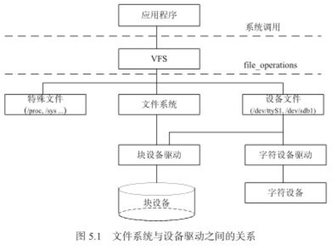

	1.应用程序与VFS(虚拟文件系统)之间的接口是系统调用;
	2.VFS与文件系统(ext2/fat/btrfs等)、设备文件(/dev/ttyS1、/dev/sdb1、/dev/dsc0等)、特殊文件
	系统(/proc、/sys等)--(这些属于同一层次)之间的接口是file_operations结构体成员函数;
	3.字符设备上层没有文件系统(e.g.ext2),因此字符设备的file_operations由自己的设备驱动提供;
	4.块设备有两种途径:
		1.像字符设备一样,直接访问裸设备,走kernel实现的统一的def_blk_fops这个file_operations(源代码
		位于fs/block_dev.c) e.g.dd if=/dev/sbd1 of=sbd1.img将/dev/sbd1裸分区复制到sbd1.img,内核
		走的就是def_blk_fops这个file_operations;
		2.通过文件系统(e.g.ext2)来访问块设备:file_operations的实现位于该文件系统中,文件系统将针对文件
		的读写转换为块设备原始扇区的读写.此时块设备驱动提供接口给文件系统;
	5.ext2、fat、btrfs等文件系统中实现了针对VFS的file_operations,因此设备驱动层看不到file_operations
	的存在.

**2.file结构体**

file结构体代表一个打开的文件,应用程序每个打开的文件在内核空间都有一个关联的struct file.由内核在打开文件时创建,并传递给在文件上进行操作的任何函数.在文件被关闭时内核释放struct file.struct file的指针通常被命名为file或filp(file pointer--->较为常用).

	struct file {
	union {
		struct llist_node		fu_llist;
		struct rcu_head			fu_rcuhead;		
	};
	...
	unsigned int		f_flags;	/* 文件标志,e.g. O_RDONLY, O_NONBLOCK, O_SYNC等 */
	fmode_t				f_mode;		/* 文件读/写模式, FMODE_READ和FMODE_WRITE */
	...
	loff_t				f_pos;		/* 当前读写位置 */
	...
	void		*private_data;	/*文件私有数据,大多数指向设备驱动中自定义的用于描述设备的结构体 */
	} __attribute__((aligned(4)));

内核中判断文件是以阻塞方式还是非阻塞方式打开设备文件:

	if (file->f_flags & O_NONBLOCK)		/*非阻塞*/
		pr_debug("open: non-blocking\n");
	else
		pr_debug("open: blocking\n");	/*阻塞*/

**3.inode**

VFS inode包含文件访问权限、属主、组、大小、生成时间、访问时间、最后修改时间等信息.是linux管理文件系统的最基本单位,也是文件系统连接任何子目录、文件的桥梁.

	struct inode {
		...
		umode_t i_mode;		/* inode的权限 */
		uid_t i_uid;		/* inode拥有者的id */
		gid_t i_gid;		/* inode所属的群组id */
		dev_t i_rdev;		/* 若是设备文件,该字段记录设备的设备号 */
		loff_t i_size;		/* inode所代表的文件大小 */
	
		struct timespec i_atime;	/* inode最近一次的存取时间 */
		struct timespec i_mtime;	/* inode最近一次的修改时间 */
		struct timespec i_ctime;	/* inode的产生时间 */
		...
		union {
			struct pipe_inode_info *i_pipe;
			struct block_device *i_bdev; /* 若是块设备,为其对应的block_device结构体指针 */
			struct cdev *i_cdev; /* 若是字符设备,为其对应的cdev结构体指针 */
		};
		...
	};

inode的使用:

	1.从节点(inode)获得设备结构体的首地址	
	dev = container_of(inode->i_cdev, struct light_cdev, cdev);	/*i_cdev:cdev的首地址.*/
	2.inode获得主设备号和次设备号
		unsigned int imajor(struct inode *inode);
		unsigned int iminor(struct inode *inode);

**4.系统中设备查看**

	1.查看/proc/devices文件可以获知系统中注册的设备
		cat /proc/devices
		Character devices:
			1 mem
			2 pty
			...
	2.查看/dev目录可以获知系统中包含的设备文件
		ls -l /dev
		crw-rw---	1 root	uucp	4, 64 jan 30 2xxx /dev/ttyS0	//4,64分表表示主、次设备号

**5.主次设备号**

	主设备号代表一类设备,次设备号表示多个同类设备下使用某驱动的设备的序号,序号(次设备号)一般从0开始.
	内核的./Documentations/devices.txt描述了Linux设备号的分配情况.

### 5.3 udev用户空间设备管理

#### 5.3.1 udev与devfs的区别

**1.devfs(设备文件系统)**

linux 2.4内核中,devfs作为对设备进行管理的文件系统(设备文件系统).挂载于/dev目录下,管理该目录下的所有设备.由于存在众多缺点(主要是运行内核空间),后来没被再使用.

**2.udev**

udev完全工作在用户态,利用设备加入或移除时内核所发送的热插拔事件(Hotplug Event)来工作.

1.针对热插拔设备的udev

在热插拔时,设备的详细信息会由内核通过netlink套接字发送出来,发出的事情叫uevent.udev的设备命名策略、权限控制和事件处理都是在用户态下完成的,它利用从内核收到的信息来进行创建设备文件节点等工作.

	//netlink的使用范例
	#include <linux/netlink.h>
	
	static void die(char *s)
	{
		write(2, s, strlen(s));
		exit(1);
	}
	
	int main(int argc, char *argv[])
	{
		struct sockaddr_nl nls;
		struct pollfd pfd;
		char buf[512];
	
		// open hotplug event netlink socket
		memset(&nls, 0, sizeof(struct sockaddr_nl));
		nls.nl_family = AF_NETLINKE;
		nls.nl_pid = getpid();
		nls.nl_groups = -1;
	
		pfd.events = POLLIN;
		pfd.fd = socket(PF_NETLINK, SOCK_DGRAM, NETLINK_KOBJECT_UEVENT);
		if (pfd.fd == -1)
			die("Not root\n");
	
		// Listen to netlink socket
		if (bind(pfd.fd, (void *)&nls, sizeof(struct sockaddr_nl)))
			die("Bind failed\n");
	
		while (-1 != poll(&pfd, 1, -1)) {
			int i, len = recv(pfd.fd, buf, sizeof(buf), MSG_DONTWAIT);
			if (len == -1)
				die("recv\n");
	
			// print data to stdout
			i = 0;
			while (i < len) {
				printf("%s\n", buf + i);
				i += strlen(buf + i) + 1;
			}
		}
		die("poll\n");
		return 0;
	}
	
	/*
	编译并运行上述代码,把Apple Facetime HD Camera USB摄像头插入Ubuntu,程序会dump出一些信息.
	udev就是采用上面这种方式接受netlink消息,并根据它的内容和用户设备给udev的规则做匹配来进行工作的.
	*/

2.针对冷插拔设备的udev

冷插拔设备在开机时就存在,在u已经dev启动前已经被插入.对于冷插拔的设备,linux内核提供了sysfs下面一个uevent节点,可以往该节点写一个"add",导致内核重新发送netlink,之后udev就可以收到冷插拔的netlink消息了.

	运行上述代码程序,手动往/sys/module/psmouse/uevent写一个"add",程序也会dump出来一些信息.

#### 5.3.2 sysfs文件系统与linux设备模型

linux 2.6以后的内核中,sysfs作为对设备进行管理的文件系统(与proc/devfs/devpty同类别的文件系统,sysfs是一个虚拟文件系统).挂载与/sys目录下.

	1.sysfs展示了设备驱动模型中各组件(设备、总线、类等)的层次关系,顶级目录包括:block,bus,dev,devices,
		class,fs,kernel,power和firmware等;
		block:包含所有的块设备;
		devices:包含系统所有的设备,并根据设备连接的总线类型组织成层次结构;
		bus:包含系统中所有的总线类型;
		class:包含系统中的设备类型(e.g.网卡设备、声卡设备、输入设备等);
	2.sysfs可以被user space读写,而udev作为一个工具,利用sysfs提供的信息对dev进行相关的操作.

linux使用struct bus_type、struct device_driver、struct device来描述总线、驱动、设备,位于"./include/linux/device.h".使用的时候"#include <linux/device.h>"--->结构体定义参照linux源码

	1.struct device_driver和struct device依附于struct bus_type,都包含有struct bus_type指针;
	2.linux内核中,设备和驱动是分开注册的;
	3.struct bus_type中的match()函数负责将设备和驱动进行匹配.一旦匹配上之后,xxx_driver的probe()函数
		就会被执行(xxx:总线名.e.g.platform、pci、i2c、spi、usb等);
	4.一些attribute不明白是干嘛的--->略.

#### 5.3.3 udev的相关说明--->需要继续深入

udev是一种工具(运行在用户空间),根据系统中的硬件设备状况更新设备文件(即/dev下的设备文件),e.g.动态建立/删除设备文件.

	//udev工作过程:
	1.当内核检测到系统中出现了新设备后,内核会通过netlink套接字发送uevent;
	2.udev获取内核发送的消息,进行规则的匹配(匹配的事务包括SUBSYSTEM、ACTION、attribute、内核提供的名
		称(通过KERNEL=)以及其他的环境变量).

udev有自己的规则去更新/dev下的设备文件(e.g.windows连接usb转串口设备时,udev在设备管理器中显示为:usb-serial,可以认为是udev规则作用的结果..)

udev需要sysfs、tmpfs的支持,sysfs为udev提供设备入口和uevent通道,tmpfs为udev提供存放设备文件(/dev)的空间.

***

## Chapter 6 字符设备驱动

### 6.1 Linux字符设备驱动结构

#### 6.1.1 cdev结构体

cdev结构体用于描述一个字符设备:

	struct cdev {
		struct kobject kobj;	/*内嵌的kobject对象*/
		struct module *owner;	/*所属模块*/
		struct file_operations *ops;	/*文件操作结构体*/
		struct list_head list;
		dev_t dev;		/*设备号*/
		unsigned int count;
	};

**1.dev_t--->设备号**

dev_t dev用于描述设备号(32 bit)

	MAJOR(dev_t dev);	/*获得主设备号(12bit)*/
	MINOR(dev_t dev);	/*获得次设备号(20bit)*/
	MKDEV(int major, int minor);	/*利用主设备号和次设备号生成dev_t(设备号)*/

**2.cdev_init()**

cdev_init():初始化cdev成员,并建立cdev和file_operations之间的联系
	
	void cdev_init(struct cdev *cdev, struct file_operations *fops);
	/*
		para1:struct cdev的结构体指针;
		para2:struct file_operations结构体指针.
	*/

**3.cdev_alloc()**

cdev_alloc():动态申请cdev内存.不需要指定大小,自动申请大小为sizeof(struct cdev).(无论什么内存申请,单位都是字节)--->一般不用.

	struct cdev *cdev_alloc(void);
	/*其源代码中使用到了
		struct cdev *p = kzalloc(sizeof(struct cdev), GFP_KERNEL);
			/*kzalloc结合kmalloc申请内核内存和memset初始化*/
		kzalloc返回(void *)的指针--指向分配的内存.
	*/

**4.cdev_add()**

cdev_add():添加一个cdev设备,也就是将cdev设备添加到一个链表中,完成字符设备的注册.

	int cdev_add(struct cdev *, dev_t, unsigned);
	/*
		para1:struct cdev结构体指针;
		para2:设备号;
		para3:次设备号的数目(一般为1);
		retval:成功返回0,失败返回非0值.
		*/
	/*e.g. cdev_add(&dev->cdev, devno, 1);*/

**5.cdev_del()**

cdev_del():删除一个cdev设备,在注销设备时调用(即模块卸载函数中).

	void cdev_del(struct cdev *);
	/*
		para:struct cdev结构体指针.
	*/

#### 6.1.2 分配和释放设备号

**1.register_chrdev_region()**

静态申请设备号的情况(即设备号已知的情况)--->容易与别的设备产生设备号冲突,一般不用.

	int register_chrdev_region(dev_t from, unsigned count, const char *name);
	/*
		para1:已知的设备号.dev_t from一般由MKDEV(int major, int minor)构造.
		para2:次设备数量;
		para3:设备名字.
		缺点:设备号需要传递进去,因此需要提前定义好.容易和别的设备产生设备号冲突.
	*/

**2.alloc_chrdev_region()**

动态申请未被占用的设备的情况,会自动避开设备号重复的冲突--->使用较多.

	int alloc_chrdev_region(dev_t *dev, unsigned baseminor, unsigned count, const char *name);
	/*
		para1:存放申请到的设备号--->传出来的值;
		para2:次设备号(一般从0开始),需要传进去;
		para3:次设备的数量(一般为1);
		para4:设备名字.
	*/

**3.unregister_chrdev_region()**

释放申请到的设备号.

	void unregister_chrdev_region(dev_t from, unsigned count);
	/*
		para1:申请得到的设备号;
		para2:次设备数量(一般为1);
	*/

#### 6.1.3 字符设备注册/注销总结

**1.字符设备注册**

	1.申请设备号
		alloc_chrdev_region(dev_t *dev, unsigned basemonior, unsigned count, const char *name);
	2.字符设备初始化
		cdev_init(struct cdev *, struct file_operations *);
	3.注册字符设备
		cdev_add(struct cdev *, dev_t, unsigned);
	4.创建设备节点
		struct device *device_create(struct class *class, struct device *parent, 
					dev_t devt, void *drvdata, const char *fmt, ...);
		/*
			para1:struct class---设备类.在这之前需要先创建struct class(设备类)(可以在init的时候创建)
				e.g.struct class *g_bsf_class = NULL;
					g_bsf_class = class_create(THIS_MODULE, BSF_DRVNAME);
			para2:父设备;
			para3:设备号;
			para4:设备的数据(为自定义设备结构体);
			para5:在/dev下显示的设备节点名字(e.g.para5为dsc0)
				--->只是在/dev下显示的名字,"/dev"不会作为para5参数的一部分.
			retval:struct device *设备结构体指针.
		*/

**2.字符设备注销**

	1.卸载设备节点
		device_destroy(struct class *class, dev_t devt);
		/*
			para1:设备类;
			para2:设备号;
		*/
	2.删除字符设备
		cdev_del(struct cdev *cdev);
	3.释放设备号
		unregister_chrdev_region(dev_t from, unsigned count);
	4.删除设备类
		class_destroy(struct class *class);

#### 6.1.4 file_operations结构体

**1.struct file_operations定义如下:**

	struct file_operations {
		struct module *owner;
		loff_t (*llseek)(struct file *, loff_t, int);
		ssize_t (*read)(struct file *, char __user *, size_t, loff_t *);
		ssize_t (*write)(struct file *, const char __user *, size_t, loff_t *);
		ssize_t (*aio_read)(struct kiocb *, struct iovec *, unsigned long, loff_t);
		ssize_t (*aio_write)(struct kiocb *, const struct iovec *, unsigned long, loff_t);
		...
		long (*unlocked_ioctl)(struct file *, unsigned int, unsigned long);
		...
		int (*mmap)(struct file *, struct vm_area_struct *);
		int (*open)(struct inode *, struct file *);
		...
		int (*release)(struct inode *, struct file *);
		...
	};

**2.llseek()**

用来修改一个文件的当前读写位置,并将新位置返回.在出错时,返回一个负值.

	loff_t (*llseek)(struct file *, loff_t, int);

**3.read()**

用来从设备中读取数据,成功返回读取的字节数,出错返回一个负值(返回0时表示end-of-file(EOF)).

	ssize_t (*read)(struct file *, char __user *, size_t, loff_t *);

用户空间调用该函数的方式:

	1.系统调用方式
		ssize_t read(int fd, void *buf, size_t count);
	2.库函数方式
		size_t fread(void *ptr, size_t size, size_t n, FILE *stream);

**4.write()**

用来向设备写入数据,成功返回写入的字节数,出错返回一个负值(返回0时表示end-of-file(EOF)).

	ssize_t (*write)(struct file *, const char __user *, size_t, loff_t *);

用户空间调用该函数的方式:

	1.系统调用方式
		ssize_t write(int fd, const void *buf, size_t count);
	2.库函数方式
		size_t fwrite(const void *ptr, size_t size, size_t n, FILE *stream);

**5.unlocked_ioctl()**

提供设备相关控制cmd(命令)的实现.成功返回非负值.一般使用".unlocked_ioctl = xxx_ioctl;"赋值.

	long (*unlocked_ioctl)(struct file *, unsigned int, unsigned long);

用户空间调用该函数的方式:

	1.fcntl调用:
		int fcntl(int fd, int cmd, .../* arg */);
	2.ioctl调用
		int ioctl(int fd, int cmd, ...);

**6.mmap()**

将设备内存(内核空间)映射到进程的虚拟地址空间(用户空间).建立内核空间到用户空间(即进程)的虚拟地址空间的映射(即设备内存到用户内存的映射).映射成功后,用户对这段内存的操作直接反应到内核空间(设备内存),同样内核空间对这段内存的操作也直接反应到用户空间.应用程序访问这段内存无需进行内存拷贝,针对需要大量数据传输的操作效率非常高.

	int (*mmap)(struct file *, struct vm_area_struct *);

用户空间调用该函数的方式:

	1.mmap用户空间调用:
	void *mmap(void *start, size_t length, int prot, int flags, int fd, off_t offset);
	/*参数说明:
		para1:起始地址,一般为NULL(即为0),表示由内核来指定该内存地址
		para2:要映射内存区域的大小
		para3:内存保护标志(PROT_EXEC(页内容可以被执行)、PROT_READ(页内容可以被读取)、PROT_WRITE
			(页可以被写入)、PROT_NONE(页不可以被访问))
		para4:指定映射对象的类型,映射选项和映射页是否可以共享.使用"MAP_SHARED"居多,允许其他映射该文
			件的进程共享.
		para5:文件描述符号(open的返回),即具体调用哪一个设备的mmap.
		para6:偏移,该值必须为PAGE_SIZE的整数倍(不能应用于page不对齐的情况).
			1.当应用mmap实现进程间通信(通过映射一个普通文件实现共享内存通信),此时para6为0;
			2.当应用mmap实现将物理地址映射到用户空间的虚拟地址实现对设备寄存器等的操作,需要
				1)para6为真实的物理地址(需要addr & (PAGE_SIZE-1),即page对齐);
				2)fd为打开的"/dev/mem"返回的fd./dev/mem含有所有物理地址的全映像(即:0-0xffff_ffff).
		retval:成功时返回被映射区的指针,失败时,返回MAP_FAILED(其值为(void *)-1)
		PS:一般将/dev/mem映射好,通过在进程空间中读写映射后的虚拟地址,可实现在用户空间读写物理寄存器地址.
	*/
	2.munmap用户空间调用:
	int munmap(void *start, size_t length)
	/*
		para1:mmap返回的映射区的指针;
		para2:mmap映射的大小;
		retval:成功返回0,失败返回-1.
	*/

进程在mmap映射过程中的文件内容的改变不会立即写回到磁盘文件中,写回操作是在调用munmap()后才执行,可以通过调用msync()来实现同步.-----一般用的较少.

mmap的实例---进程中通过mmap实现进程间通信

	/*********进程中通过mmap实现进程间通信**********/
	1.write.c程序:
	/*write.c*/
	#include <stdio.h>
	#include <stdlib.h>
	#include <fcntl.h>
	#include <unistd.h>
	#include <sys/types.h>
	#include <sys/stat.h>
	#include <sys/mman.h>
	/*映射内存大小*/
	#define MAPLEN 0x100
	/*定义一个学生信息结构体*/
	struct STU
	{
	    int id;
	    char name[20];
	    char sex;
	};
	/*出错信息统一处理函数*/
	void sys_err(char *str, int exitno)
	{
	    perror(str);
	    exit(exitno);
	}
	
	int main(int argc, char*argv[])
	{
	    struct STU *pm;//STU结构体指针
	    int fd, i = 0;
	    if(argc < 2) {
	        printf("args error\n");
	        exit(1);
	    }
	
	    fd = open(argv[1], O_RDWR | O_CREAT, 0777); //打开一文件
	    if(fd < 0) {
	        sys_err("open", 1);
	    }
	
	    if(lseek(fd, MAPLEN - 1, SEEK_SET) < 0) {
			//文件偏移至分配的内存地址末端
	        sys_err("lseek", 3);
	    }
	
	    if(write(fd, "\0", 1) < 0) { //末端赋值为'\0'
	        sys_err("write", 4);
	    }
	    /*将文件映射至进程的地址空间*/
	    pm = mmap(NULL, MAPLEN, PROT_READ | PROT_WRITE, MAP_SHARED, fd, 0);
	    if(pm == MAP_FAILED){
	        sys_err("mmap", 2);
	    }
	    /*关闭文件描述符*/
	    close(fd);
	    /*对文件进行写入操作*/
	    while(1){
	        pm->id = i;
	        sprintf(pm->name, "yu-%d", i);
	        if(i % 2 == 0){
	            pm->sex = 'm';
	        }else{
	            pm->sex = 'w';
	        }
	        i++;
	        sleep(1);
	    }
	    munmap(pm, MAPLEN);
	
	    return 0;
	}
	2.read.c程序:
	/*read.c*/
	#include <stdio.h>
	#include <stdlib.h>
	#include <fcntl.h>
	#include <unistd.h>
	#include <sys/types.h>
	#include <sys/stat.h>
	#include <sys/mman.h>
	
	#define MAPLEN 0x1000
	
	struct STU
	{
	    int id;
	    char name[20];
	    char sex;
	};
	
	void sys_err(char *str, int exitno)
	{
	    perror(str);
	    exit(exitno);
	}
	
	int main(int argc, char *argv[])
	{
	    struct STU *pm;
	    int fd, i = 0;
	    if (argc < 2) {
	        printf("args error\n");
	        exit(1);
	    }
	
	    fd = open(argv[1], O_RDWR);
	    if (fd < 0){
	        sys_err("open", 1); 
	    }
	
	    pm = mmap(NULL, MAPLEN, PROT_READ | PROT_WRITE, MAP_SHARED, fd, 0);
	    if(pm == MAP_FAILED){
	        sys_err("mmap", 2);
	    }
	    /*关闭文件*/
	    close(fd);
	    /*删除文件*/
	    unlink(argv[1]);
	    /*在内存中读数据*/
	    while(1){
	        printf("%d\n", pm->id);
	        printf("%s\n", pm->name);
	        printf("%c\n", pm->sex);
	        sleep(1);
	    }
	    munmap(pm, MAPLEN);
	
	    return 0;
	}
	
	编译:
		gcc write.c -o write
		gcc read.c -o read
	执行:
		./write myfile
		./read myfile
		/*read的进程会打印出:yu-2 m; yu-3 w...*/

内核驱动中的mmap使用:
	
	1.内核中mmap的使用
	.mmap = xxx_mmap,	/*file_operations中*/
	static int xxx_mmap(struct file *filp, struct vma_area_struct *vma) /*驱动中的实现*/
	{
		...
		page = virt_to_phys(buffer);	/*buffer:内核中的buffer.得到buffer对应的物理地址(page)*/
		if(remap_pfn_range(vma, vma->vm_start, page>>PAGE_SHIFT, 
			(unsigned long )(vma->vm_end-vma->vm_start), vma->vm_page_prot))
		{
			...(一些错误信息)
		}
		/*remap_pfn_range:
		para1:struct vma_area_struct *vma(vma结构体指针)
		para2:虚拟地址起始地址
		para3:物理地址(page>>PAGE_SHIFT---内核中定义的宏.PAGE_SHIFT为12.即4k对齐.)
		para4:映射空间大小,单位为字节
		para5:给vma要求的"protection".一般直接使用vma->vm_page_prot.如果要求用户空间读数据时不
		经过cache可以:
			vma->vm_page_prot = pgprot_noncached(vma->vm_page_prot);再传入vma->vm_page_prot.
		*/
	}
	2.I/O内存的使用须知
	PS:I/O内存(内核内存)被映射到用户空间时需要是nocached的,因此需要设置nocached标志.
	/*给vma的vma_page_prot设置nocached标志*/
	vma->vma_page_prot = pgprot_nocached(vma->vma_page_prot);	/*pgprot_nocached是一个宏*/
	3.PS
	pgprot_nocached()是禁止了相关页的cache和写缓冲(write buffer).ARM的写缓冲是一个非常小的FIFO存
	储器,位于CPU和主存之间,只作用于写主存.

mmap()内存映射在显示、视频等设备中使用较多,可以减少用户空间和内核空间之间的内存拷贝,在其他设备中使用较少.

**7.select/poll**

select/poll调用(主要针对非阻塞I/O),应用在socket网络编程比较多(需要再看)

非阻塞的I/O应用程序常会使用select(用户空间调用)、poll(内核空间)来查询是否可以对设备进行无阻塞的访问.

select(用户空间):监控多个文件,如果没有一个文件满足(读/写)要求,select将会阻塞调用的进程.

	int select(int maxfdp, fd_set *readfds, fd_set *writefds, fd_set *exceptfds, 
		const struct timeval *timeout);
	/*
		para1:需要检查的文件描述符个数(fd的数目),一般为后面三个fd_set中的最大值+1"max(readfds,
			writefds, exceptfds)+1";
		para2:检查可读性的一组文件描述符集;
		para3:检查可写性的一组文件描述符集;
		para4:检查意外状态的文件描述符集(ps:错误不是意外状态);
		para5:超时时间(NULL表示无限等待)
	*/
	PS:
	select中任何一个文件满足要求都将返回,正常返回满足要求的文件描述符个数;如果没有满足要求的将会阻塞
		(进程睡眠)直到超时返回0、中断或出错返回-1.

select函数中fd_set的构造:

	fd_set rds/wds/eds;
	void FD_ZERO(fd_set *fdset);	/* 清空文件描述集.e.g.FD_ZERO(&rds) */
	void FD_SET(int fd, fd_set *fdset);	/* 添加fd到fdset中.e.g.FD_SET(fd, &rds) */
	void FD_ISSET(int fd, fd_set *fdset);
		/* 在调用select后使用它来检测fdset是否发生了变化(置位).FD_ISSET(fd, &rds) */
	void FD_CLR(int fd, fd_set *fdset); /*从fdset中清除掉fd*/

poll(内核空间)

返回是否能对设备进行无阻塞读、写访问的掩码.

	unsigned int xxx_poll(struct file *filp, struct poll_table *wait)
	{
		...
		poll_wait(filp, &engine->OutWq, wait);
		/*
			1.将filp所代表的进程加入到poll_table等待列表(实际上为绑定到poll_table队列元素),然后
			poll_table等待队列元素添加到engine这个设备结构体的等待队列头部中,等待被唤醒;
			2.一旦其他的操作导致filp有动作(e.g.往filp中写入数据),将会唤醒engine->OutWq等待队列头部
			中的所有等待队列元素---即为包含的所有进程.然后继续往下执行;如果没有被唤醒则会直到超时
			(select中的timeout设置的时间).
		*/
	
		if(have_data)	
			mask |= POLLIN | POLLRDNORM;
			/* have_data为真时,poll会返回mask,表明可读.如果可写则为(POLLOUT | POLLWRNORM) */
		return mask;
	}

poll函数实现了调用select而阻塞的进程可以被等待队列头部唤醒.但不会将进程阻塞(因为进程没有睡眠)!

#### 6.1.5 copy_from_user()、copy_to_user()函数解析

**1.copy_from_user()**

用户空间--->内核空间.

	unsigned long copy_from_user(void *to, const void __user *from, unsigned long count);
	/*
		完成用户空间缓冲区到内核空间的复制.
		para1:内核空间buffer;
		para2:用户空间buffer(使用const void __user表示用户空间的只读buffer);
		para3:复制的字节数;
		retval:返回不能被复制的字节数.复制成功返回0,失败返回负值.
	*/

**2.copy_to_user()**

内核空间--->用户空间.

	unsigned long copy_to_user(void __user *to, const void *from, unsigned long count);
	/*
		完成内核空间缓冲区到用户空间的复制.
		para1:用户空间buffer(使用void __user表示用户空间的buffer);;
		para2:内核空间buffer(使用const void 表示内核空间的只读buffer);
		para3:复制的字节数;
		retval:返回不能被复制的字节数.复制成功返回0,失败返回负值.
	*/

**3.get_user()**

用户空间--->内核空间的简单类型的内存复制(简单类型包括:char, int, long等).

	int val;	//内核空间整形变量
	...
	get_user(val, (int *)arg);
	/*
		arg:用户空间的地址--->(int *)arg:取用户空间地址的整形数据(4-Byte).
		get_user:类似于赋值操作(val = (int *)arg).即用户空间传某地址,内核空间取某地址数据赋值给某变量.
	*/

**4.put_user()**

内核空间--->用户空间的简单类型的内存复制(简单类型包括:char, int, long等).

	int val;	//内核空间整形变量
	...
	put_user(val, (int *)arg);
	/*
		arg:用户空间的地址--->(int *)arg:对用户空间地址的整形数据进行赋值.
		put_user:类似于赋值操作((int *)arg = val).即用户空间传某地址,内核空间将数据赋值到该地址.
	*/

PS:无论是get_user/put_user,内核空间变量在前面,用户空间变量在后面(使用地址取内容操作得到变量).

**5.access_ok()**

	access_ok(type, addr, size);	//合法性检查,确定传入的缓冲区的确属于用户空间.

### 6.2 globalmem虚拟设备实例

**1.ioctl函数**

对于不支持的命令(cmd),linux下ioctl()函数应该返回"-ENOIOCTLCMD",如果这个返回值就没有返回"-EPERM".

ioctl()命令生成:

	#define XXX_BASE	0xc1	/设备类型字段,也叫*幻数("type"),8 bit(0-0xff),
	根据./Documentation/ioctl/ioctl_num.txt选择,避免与已经使用的冲突*/
	#define xxx_FORMAT	_IOW(xxx_BASE, 1, int/*format*/)		/*命令xxx_FORMAT*/
	/* _IOW:表示写(从应用程序角度看);xxx_BASE:type;1:序列号-8 bit(0-0xff);int:数据类型字段
	_IO(type, 序列号)
	_IOR(type, 序列号, 数据类型字段):表示读
	_IOW(type, 序列号, 数据类型字段):表示写--->常用
	_IOWR(type, 序列号, 数据类型字段):表示可读可写.
	*/
	#define xxx_KL_KEY	_IOW(xxx_BASE, 2, struct xxx_kl_key)

**2.支持单个设备的globalmem虚拟设备驱动**

1.驱动代码(位于./code/globalmem_single目录下)

	#include <linux/module.h>
	#include <linux/fs.h>
	#include <linux/init.h>
	#include <linux/cdev.h>
	#include <linux/slab.h>
	#include <linux/uaccess.h>
	
	#define GLOBALMEM_SIZE		0x1000
	#define MEM_CLEAR			0x1
	#define GLOBALMEM_MAJOR	230
	
	static int globalmem_major = GLOBALMEM_MAJOR;
	module_param(globalmem_major, int, S_IRUGO);
	
	struct globalmem_dev {
		struct cdev cdev;
		unsigned char mem[GLOBALMEM_SIZE];
	};
	
	struct globalmem_dev *globalmem_devp;
	
	static int globalmem_open(struct inode *inode, struct file *filp)
	{
		filp->private_data = globalmem_devp;
		return 0;
	}
	
	static int globalmem_release(struct inode *inode, struct file *filp)
	{
		return 0;
	}
	
	static long globalmem_ioctl(struct file *filp, unsigned int cmd, unsigned long arg)
	{
		struct globalmem_dev *devp = filp->private_data;
	
		switch (cmd) {
		case MEM_CLEAR:
			memset(devp->mem, 0, GLOBALMEM_SIZE);
			pr_info("globalmem is set to zero\n");
			break;
		default:
			return -EINVAL;
		}
	
		return 0;
	}
	
	static ssize_t globalmem_read(struct file *filp, char __user *buf, size_t size, loff_t *ppos)
	{
		unsigned long p = *ppos;
		unsigned int count = size;
		int ret = 0;
		struct globalmem_dev *devp = filp->private_data;
	
		if (p >= GLOBALMEM_SIZE)
			return 0;
	
		if (count > GLOBALMEM_SIZE -p)
			count = GLOBALMEM_SIZE - p;
	
		if (copy_to_user(buf, devp->mem + p, count)) {
			ret = -EFAULT;
		} else {
			*ppos += count;
			ret = count;
			pr_info("read %u bytes from &lu\n", count, p);
		}
		return ret;
	}
	
	static ssize_t globalmem_write(struct file *filp, const char __user *buf, size_t size, loff_t *ppos)
	{
		unsigned long p = *ppos;
		unsigned int count = size;
		int ret = 0;
		struct globalmem_dev *devp = filp->private_data;
	
		if (p >= GLOBALMEM_SIZE)
			return 0;
	
		if (count > GLOBALMEM_SIZE - p)
			count = GLOBALMEM_SIZE - p;
	
		if (copy_from_user(devp->mem + p, buf, count))
			return -EFAULT;
		else {
			*ppos += count;
			ret = count;
	
			pr_info("write %u bytes from %lu\n", count, p);
		}
	
		return ret;
	}
	
	static loff_t globalmem_llseek(struct file *filp, loff_t offset, int orig)
	{
		loff_t ret = 0;
		switch (orig) {
		case 0:
			if (offset < 0) {
				ret = -EINVAL;
				break;
			}
	
			if ((unsigned int)offset > GLOBALMEM_SIZE) {
				ret = -EINVAL;
				break;
			}
	
			filp->f_pos = (unsigned int)offset;
			ret = filp->f_pos;
			break;
		case 1:
			if ((filp->f_pos + offset) > GLOBALMEM_SIZE) {
				ret = -EINVAL;
				break;
			}
			if ((filp->f_pos + offset) < 0) {
				ret = -EINVAL;
				break;
			}
			filp->f_pos += offset;
			ret = filp->f_pos;
			break;
		default:
			ret = -EINVAL;
			break;
		}
		return ret;
	}
	
	static const struct file_operations globalmem_fops = {
		.owner = THIS_MODULE,
		.llseek = globalmem_llseek,
		.read = globalmem_read,
		.write = globalmem_write,
		.unlocked_ioctl = globalmem_ioctl,
		.open = globalmem_open,
		.release = globalmem_release,
	};
	
	static void globalmem_setup_cdev(struct globalmem_dev *devp, int index)
	{
		int err, devno;
		devno = MKDEV(globalmem_major, index);
	
		cdev_init(&devp->cdev, &globalmem_fops);
		devp->cdev.owner = THIS_MODULE;
		err = cdev_add(&devp->cdev, devno, 1);
		if (err)
			pr_err("Error %d adding globalmem %d\n", err, index);
	}
	
	static int __init globalmem_init(void)
	{
		int ret;
		dev_t devno = MKDEV(globalmem_major, 0);
		if (globalmem_major)
			ret = register_chrdev_region(devno, 1, "globalmem");
		else {
			ret = alloc_chrdev_region(&devno, 0, 1, "globalmem");
			globalmem_major = MAJOR(devno);
		}
	
		if (ret < 0)
			return ret;
	
		globalmem_devp = kzalloc(sizeof(struct globalmem_dev), GFP_KERNEL);
		if (!globalmem_devp) {
			ret = -ENOMEM;
			goto fail_malloc;
		}
	
		globalmem_setup_cdev(globalmem_devp, 0);
		return 0;
		
	fail_malloc:
		unregister_chrdev_region(devno, 1);
		return ret;
	}
	
	static void __exit globalmem_exit(void)
	{
		cdev_del(&globalmem_devp->cdev);
		kfree(globalmem_devp);
		unregister_chrdev_region(MKDEV(globalmem_major, 0), 1);
	}
	
	module_init(globalmem_init);
	module_exit(globalmem_exit);
	
	MODULE_AUTHOR("Defychen");
	MODULE_LICENSE("GPL v2");

2.Makefile文件内容

	ifneq ($(KERNELRELEASE), )
	
	obj-m := globalmem.o
	
	else
	
	EXTRA_CFLAGS += DDEBUG
	KDIR := /home/defychen/repository_software/linux-4.4.189
	all:
		make CROSS_COMPILE=arm-linux-gnueabi- ARCH=arm -C $(KDIR) M=$(PWD) modules
	clean:
		rm -rf *.ko *.o *.mod.o *.mod.c *.symvers *.order .*.ko .tmp_versions
	endif
	
	.PYONY:all clean

**3.支持多个子设备的globalmem虚拟设备驱动**

	#include <linux/module.h>
	#include <linux/fs.h>
	#include <linux/init.h>
	#include <linux/cdev.h>
	#include <linux/slab.h>
	#include <linux/uaccess.h>
	
	#define GLOBALMEM_SIZE		0x1000
	#define MEM_CLEAR			0x1
	#define GLOBALMEM_MAJOR		230
	#define DEVICE_NUM			10	//定义子设备数量
	
	static int globalmem_major = GLOBALMEM_MAJOR;
	module_param(globalmem_major, int, S_IRUGO);
	
	struct globalmem_dev {
		struct cdev cdev;
		unsigned char mem[GLOBALMEM_SIZE];
	};
	
	struct globalmem_dev *globalmem_devp;
	
	static int globalmem_open(struct inode *inode, struct file *filp)
	{
		struct globalmem_dev *devp = container_of(inode->i_cdev, struct globalmem_dev, cdev);
		/*
			container_of:通过设备结构体变量中的某个成员的首地址找到对应设备结构体的指针.
		*/
		filp->private_data = devp;
		return 0;
	}
	
	static int globalmem_release(struct inode *inode, struct file *filp)
	{
		return 0;
	}
	
	static long globalmem_ioctl(struct file *filp, unsigned int cmd, unsigned long arg)
	{
		struct globalmem_dev *devp = filp->private_data;
	
		switch (cmd) {
		case MEM_CLEAR:
			memset(devp->mem, 0, GLOBALMEM_SIZE);
			pr_info("globalmem is set to zero\n");
			break;
		default:
			return -EINVAL;
		}
	
		return 0;
	}
	
	static ssize_t globalmem_read(struct file *filp, char __user *buf, size_t size, loff_t *ppos)
	{
		unsigned long p = *ppos;
		unsigned int count = size;
		int ret = 0;
		struct globalmem_dev *devp = filp->private_data;
	
		if (p >= GLOBALMEM_SIZE)
			return 0;
	
		if (count > GLOBALMEM_SIZE -p)
			count = GLOBALMEM_SIZE - p;
	
		if (copy_to_user(buf, devp->mem + p, count)) {
			ret = -EFAULT;
		} else {
			*ppos += count;
			ret = count;
			pr_info("read %u bytes from %lu\n", count, p);
		}
		return ret;
	}
	
	static ssize_t globalmem_write(struct file *filp, const char __user *buf, size_t size, loff_t *ppos)
	{
		unsigned long p = *ppos;
		unsigned int count = size;
		int ret = 0;
		struct globalmem_dev *devp = filp->private_data;
	
		if (p >= GLOBALMEM_SIZE)
			return 0;
	
		if (count > GLOBALMEM_SIZE - p)
			count = GLOBALMEM_SIZE - p;
	
		if (copy_from_user(devp->mem + p, buf, count))
			return -EFAULT;
		else {
			*ppos += count;
			ret = count;
	
			pr_info("write %u bytes from %lu\n", count, p);
		}
	
		return ret;
	}
	
	static loff_t globalmem_llseek(struct file *filp, loff_t offset, int orig)
	{
		loff_t ret = 0;
		switch (orig) {
		case 0:
			if (offset < 0) {
				ret = -EINVAL;
				break;
			}
	
			if ((unsigned int)offset > GLOBALMEM_SIZE) {
				ret = -EINVAL;
				break;
			}
	
			filp->f_pos = (unsigned int)offset;
			ret = filp->f_pos;
			break;
		case 1:
			if ((filp->f_pos + offset) > GLOBALMEM_SIZE) {
				ret = -EINVAL;
				break;
			}
			if ((filp->f_pos + offset) < 0) {
				ret = -EINVAL;
				break;
			}
			filp->f_pos += offset;
			ret = filp->f_pos;
			break;
		default:
			ret = -EINVAL;
			break;
		}
		return ret;
	}
	
	static const struct file_operations globalmem_fops = {
		.owner = THIS_MODULE,
		.llseek = globalmem_llseek,
		.read = globalmem_read,
		.write = globalmem_write,
		.unlocked_ioctl = globalmem_ioctl,
		.open = globalmem_open,
		.release = globalmem_release,
	};
	
	static void globalmem_setup_cdev(struct globalmem_dev *devp, int index)
	{
		int err, devno;
		devno = MKDEV(globalmem_major, index);
	
		cdev_init(&devp->cdev, &globalmem_fops);
		devp->cdev.owner = THIS_MODULE;
		err = cdev_add(&devp->cdev, devno, 1);
		if (err)
			pr_err("Error %d adding globalmem %d\n", err, index);
	}
	
	static int __init globalmem_init(void)
	{
		int ret;
		int i;
		dev_t devno = MKDEV(globalmem_major, 0);
		if (globalmem_major)
			ret = register_chrdev_region(devno, DEVICE_NUM, "globalmem");
			/*
				表示注册字符设备的区域,表示设备号为devno整个DEVICE_NUM的范围都属于该字符设备.
			*/
		else {
			ret = alloc_chrdev_region(&devno, 0, DEVICE_NUM, "globalmem");
			/*
				表示分配字符设备的区域,由系统分配一个设备号,子设备从0开始,覆盖整个DEVICE_NUM的范围都
				属于该字符设备.
			*/
			globalmem_major = MAJOR(devno);
		}
	
		if (ret < 0)
			return ret;
	
		globalmem_devp = kzalloc(sizeof(struct globalmem_dev) * DEVICE_NUM, GFP_KERNEL);
		//申请sizeof(struct globalmem_dev) * DEVICE_NUM字符设备空间.
	
		if (!globalmem_devp) {
			ret = -ENOMEM;
			goto fail_malloc;
		}
	
		for (i = 0; i < DEVICE_NUM; i++) {
			globalmem_setup_cdev(globalmem_devp + i, i);
			//将每一个子字符设备都注册进去
		}
		return 0;
		
	fail_malloc:
		unregister_chrdev_region(devno, DEVICE_NUM);	//释放分配的字符设备区域.
		return ret;
	}
	
	static void __exit globalmem_exit(void)
	{
		int i;
		for (i = 0; i < DEVICE_NUM; i++) {
			cdev_del(&(globalmem_devp + i)->cdev);	//将cdev_add的每一个子字符设备删除.
		}
		kfree(globalmem_devp);
		unregister_chrdev_region(MKDEV(globalmem_major, 0), DEVICE_NUM);
	}
	
	module_init(globalmem_init);
	module_exit(globalmem_exit);
	
	MODULE_AUTHOR("Defychen");
	MODULE_LICENSE("GPL v2");

**4.加载及查看字符设备**

1.加载单个设备的globalmem

	1.加载
		insmod globalmem.ko
	2.查看
		lsmod globalmem
	3.查看设备信息
		cat /proc/devices --->显示
		Character devices:
			1 mem
			...
			230 globalmem

2.加载多个设备的globalmem_multiple

	1.加载
		insmod globalmem_multiple.ko
	2.查看
		lsmod globalmem_multiple
	3.查看设备信息
		cat /proc/devices --->显示
		Character devices:
			1 mem
			...
			230 globalmem_multiple

**5.设备节点创建**

设备节点:即是驱动open函数中的inode(或应用程序open函数中的第一个参数),也即是/dev下面的设备文件(设备节点).

1.自动创建设备节点(在cdev_init和cdev_add之后):

	/*class_create可在./driver/class.c中找到原型; device_create可在./driver/core.c中找到原型*/
	
	static struct class *xxx_class;	/*全局变量,xxx_class是一个类,由class_create赋值*/
	static struct device *xxx_device; /*全局变量,xxx_device是由device_create赋值,
										进行判断device(设备节点)创建成功与否*/
	#define DEVICE_NAME "xxx_device_name" /*xxx_device_name是在/dev目录下显示的设备节点*/
	#define XXX_CLASS_NAME	"xxx_class_name"	/*xxx_class_name是/sys/class目录下的一个类名*/
	
	xxx_class = class_create(THIS_MODULE, XXX_CLASS_NAME);	/*创建/sys/class目录下"XXX_CLASS_NAME"类名*/ 
	...
	xxx_device = device_create(xxx_class, NULL, devno, NULL, DEVICE_NAME) /*创建设备节点DEVICE_NAME*/
	/*
	para1:设备类(struct class *class)
	para2:父设备(struct device *parent),一般为NULL
	para3:设备号(dev_t devt)
	para4:数据(void *drvdata),可以为NULL
	para5:在/dev下显示的设备文件名(节点)(const char *fmt)
	*/
	if(xxx_device == NULL){
		/*print some error message!*/
	}
	
	/*注销device*/
	device_destroy(xxx_device, devno);
	/*注销class*/
	class_destroy(xxx_class);

2.手动创建设备节点

	1.单个globalmem设备创建及测试
		1.创建设备节点
			mknod /dev/globalmem c 230 0	
			/*mknod:创建设备节点命令;/dev/globalmem:节点名;c:字符设备;230:主设备号;0:次设备号*/
		2.测试
			echo "hello world" > /dev/globalmem		//测试写操作
			//结果为:write 12 bytes from 0
			cat /dev/globalmem		//测试读操作	
			//结果为:hello world
	2.多个globalmem_multiple设备创建及测试
		1.创建设备节点
			mknod /dev/globalmem0 c 230 0
			mknod /dev/globalmem1 c 230 1	
			/*mknod:创建设备节点命令;/dev/globalmem:节点名;c:字符设备;230:主设备号;0:次设备号*/
		2.测试
			echo "hello world" > /dev/globalmem0		//测试写操作
			//结果为:write 12 bytes from 0
			cat /dev/globalmem0		//测试读操作	
			//结果为:hello world

***

## Chapter 7 Linux设备驱动中的并发控制

多个进程对共享资源的并发访问会导致竞态.

### 7.1 并发与竟态

并发：指多个执行单元同时、并行的执行.

竟态:多个并发的执行单元对共享资源(硬件资源/软件资源(全局变量、静态变量等))等的访问容易导致竟态.

**竟态可能发生于进程与进程之间(进程抢占)、中断与进程之间(中断服务程序访问进程正在访问的资源)、中断与中断之间(高优先级中断).**

解决竟态的方法是保证对共享资源的互斥访问.

访问共享资源的代码区称为临界区,将临界区以某种互斥机制保护起来(包括中断屏蔽、原子操作、自旋锁、信号量、互斥体等).

### 7.2 编译乱序和执行乱序

#### 7.2.1 编译乱序

代码编译后得到的汇编码可能不是严格按照代码的逻辑顺序排布的(特别是使用了"-O2"优化编译选项)

解决:加上编译屏障

	#define barrier() __asm__ volatile("":::"memory")	/*汇编时的编译屏障*/
	//也可以写成:#define barrier() {asm volatile("":::"memory")}
	/*
	memory强制gcc编译器假设RAM所有内存单元均被汇编指令修改,这样CPU中的registers和cache中已缓存的内存单元中
	的数据将被作废.CPU在需要的时候必须重新读取内存中的数据.这就阻止了CPU将registers或cache中的数据用于去优化
	指令,而不去访问内存.
	"":::表示空指令.barrier操作不能在此插入一条串行化的汇编指令.
	*/
	
	1)e = d[4095];
	barrier();	/*未加barrier()时,1和3、4句可能会在编译时乱序,加上之后按照正常的逻辑顺序排布*/
	3)b = a;
	4)c = a;

volatile的作用

	volatile int i = 10; /*volatile会告诉编译器,i的值随时可能发生变化，每次使用i的值必须从其地址去读.*/
	int j = i;
	int k = i; /*如果i没有使用volatile修饰,k取到的值就是j读的那次的值(因为j读i的值时没有对i进行任何操作)*/
	/*而使用了volatile修改后,k的赋值是根据i的地址获得i的值之后再赋给k.*/

volatile一般用于修饰register,因为register容易被其他的操作更改其值.

	#define GET_CHIP_DWORD (*(volatile unsigned int *)0x18000000)
	
	unsigned int get_soc_chip_id(void)
	{
		unsigned int chip_dw = GET_CHIP_DWORD;
		unsigned int chip_id = ((chip_dw & 0xffff0000)>>16);	//取高16bit
		...	/*other operations*/
	}
	
	/*
		如果有多个地方调用get_soc_chip_id.因为都会使用GET_CHIP_DWORD去获得chip_dw,没有volatile
		会导致第一次调用之后所有其他操作都使用第一次取得的值.有可能会出错.因此使用volatile.
	*/

#### 7.2.2 执行乱序---常见于多个CPU

即使编译后的指令顺序正确,但是由于CPU是"乱序执行(Out-of-Order-Execution)"策略,CPU本质决定的.

	//CPU0上执行:
	while (f == 0);
	print x;
	
	//CPU1上执行:
	x = 42;
	f = 1;
	
	/*
		疑问:CPU0上打印的x不一定是42.
		解释:因为CPU1即使"f=1"编译在"x=42"后面,执行时仍然可能先于"x=42"完成.所以这时候CPU0上的
		打印不一定是42.
	*/
	因此,处理器为了处理多核间一个核的内存行为对另一个核可见的问题,引入了内存屏障指令.
	用来确保执行正序(DMB/DSB/ISB等).
	DMB(数据内存屏障):在DMB之后的显示内存访问执行前,保证所有在DMB指令之前的内存访问完成;
	DSB(数据同步屏障):等待所有在DSB指令之前的指令完成(1,所有显示内存访问均完成;2,所有缓存、跳转预测和TLB
		维护操作均完成);
	ISB(指令同步屏障):Flush流水线,使得所有ISB之后执行的指令都是从缓存或内存中获得的.
	
	PS:Linux内核中的自旋锁、互斥体等互斥逻辑,都用到上述指令.

在linux内核中的"./include/asm-generic/io.h"中,定义了读写IO就具有读写IO寄存器屏障的功能.

	#ifndef ioread32
	#define ioread32 ioread32
	static inline u32 ioread32(const volatile void __iomem *addr)
	{
		return readl(addr);		//readl的实现中具有__iormb(),读IO屏障
	}
	#endif
	
	#ifndef iowrite32
	#define iowrite32 iowrite32
	static inline void iowrite32(u32 value, volatile void __iomem *addr)
	{
		writel(value, addr);	//writel的实现中具有__iowmb(),写IO屏障
	}
	#endif

**实例:DMA操作的过程**

	writel_relaxed(DMA_SRC_REG, src_addr);	//writel_relaxed:无屏障的写DMA的开始地址
	writel_relaxed(DMA_DST_REG, dst_addr);	//无屏障的写DMA的结束地址
	writel_relaxed(DMA_SIZE_REG, size);		//无屏障的写DMA的大小
	writel(DMA_ENABLE, 1);	//有屏障的启动DMA,保证之前操作DMA寄存器完成之后再启动DMA.

### 7.3 中断屏蔽

中断屏蔽:单CPU避免竟态的一种简单的方法.将使得中断与进程之间的并发不再发生,进程抢占的并发也不再发生(进程调度依赖于中断来实现).

	local_irq_disable()	/*中断屏蔽*/
	...
	critical section	/*临界区代码*/
	...
	local_irq_enable()	/*中断使能*/

中断屏蔽使用方法:

	1.linux的异步I/O、进程调度都依赖于中断,因此不能长时间的屏蔽中断(会导致数据丢失或者系统崩溃).临界区
		代码需要尽快执行完;
	2.local_irq_disable()和local_irq_enable()只能禁止和使能本CPU内的中断.不能解决SMP多CPU引发的竞态,
		单独使用通常是一个bug,因此SMP的多CPU引发的竟态常常使用中断屏蔽+自旋锁.
	3.local_irq_save(flags)/local_irq_restore(flags)除了禁止/恢复中断操作外,还保存CPU的中断位信息
		(即保存和恢复CPSR).
	4.禁止/使能中断底半部:local_bh_disable()/local_bh_enalbe().

### 7.4 原子操作

原子操作保证一个整型数据(整型变量和位)的修改是排他性的.

#### 7.4.1 整型原子操作

1)定义原子变量并初始化:
	
	atomic_t v = ATOMIC_INIT(i);	/*定义原子变量v并初始化为i*/
	void atomic_set(atomic_t *v, int i);	/*设置原子变量v的值为i*/

2)获取原子变量的值:
	
	atomic_read(atomic_t *v);	/*返回原子变量v的值*/

3)原子变量加/减(+/-)、自增/减:
	
	void atomic_add(int i, atomic_t *v);	/*原子变量v加i*/
	void atomic_sub(int i, atomic_t *v);	/*原子变量v减i*/
	void atomic_inc(atomic_t *v);			/*原子变量v自增1*/
	void atomic_dec(atomic_t *v);			/*原子变量v自减1*/

4)操作并测试:
	
	int atomic_inc_and_test(atomic_t *v);	
		/*原子变量先执行自增1操作,然后测试是否与0相等.相等返回true,否则返回false*/
	int atomic_dec_and_test(atomic_t *v);
		/*原子变量先执行自减1操作,然后测试是否与0相等.相等返回true,否则返回false*/
	int atomic_sub_and_test(int i, atomic_t *v);
		/*原子变量先执行减i操作,然后测试是否与0相等.相等返回true,否则返回false*/

5)操作并返回:

	int atomic_add/sub_and_return(int i, atomic_t *v);	/*原子变量v加/减i后返回新值*/
	int atomic_inc/dec_return(atomic_t *v);	/*原子变量v自增/自减后返回新值*/

#### 7.4.2 位原子操作

	void set_bit(nr, void *addr);	/*设置地址addr的第nr位,即写1*/
	void clear_bit(nr, void *addr);	/*清除地址addr的第nr位,即写0*/
	void change_bit(nr, void *addr);	/*将地址addr的第nr位反置(1变0,0变1)*/
	test_bit(nr, void *addr);	/*返回addr的第nr位*/
	...

#### 7.4.3 实例---使用原子变量使设备只能被一个进程打开

操作步骤:

	1)定义一个原子变量(整型),并初始化为1;
	2)对原子变量进行相关的操作及判断.

实例代码:

	static atomic_t xxx_available = ATOMIC_INIT(1);	/*定义原子变量并初始化为1*/
	
	static int xxx_open(struct inode *inode, struct file *filp)
	{
		...
		if(!atomic_dec_and_test(&xxx_available))
		{
			/*
			atomic_dec_and_test(&xxx_available):先进行dec(减1)操作,然后test(测试)是否为0.也就是和0
			比较,如果等于0(设备没被打开过)返回ture,取反跳出判断进行后续操作;否则被打开过返回false,取反
			进入该if语句块,进行相关的返回操作..
			解析:
			刚开始xxx_available这个原子变量为1,dec之后变为0,与0相等test成功返回true,取反之后变为false,
			跳出if,执行后续打开操作,此时xxx_available变为0.当再一次调用open的时候,由于该值为0,dec之后变
			为-1,与0不相等test失败返回false,取反之后变为true,进入if.由于做了dec操作,因此在if中需要调用:
				atomic_inc(&xxx_available);将xxx_available恢复到0.
			*/
			atomic_inc(&xxx_available);
			return -EBUSY;	/*已经打开*/
		}
		...
		return 0;
	}
	
	static int xxx_release(struct inode *inode, struct file *filp)
	{
		atomic_inc(&xxx_available);	/*释放了设备,自增1*/
		return 0;
	}

### 7.5 自旋锁

自旋锁是一种对临界资源进行互斥访问的手段.特点:如果锁被占用,试图获得锁的代码将会一直处于"自旋"状态,等待锁.

#### 7.5.1 自旋锁

自旋锁主要针对SMP或单CPU但内核可抢占的情况,对于单CPU和内核不支持抢占的情况,自旋锁没用(退化为空操作).对于支持抢占的系统,单核会直接将整个核的抢占调度禁止;多核SMP的情况会禁止本核的抢占调度,但其他核继续正常的抢占调度.

由于多核SMP的情况下,自旋锁保证本核临界区不受别的CPU核的抢占进程干扰(其他CPU核的抢占调度仍然正常运行),本CPU核抢占调度禁止.但是中断可以打破这种禁止抢占调度的情况(中断的优先级比抢占调度的高).因此,在某些特殊情况下需要在获得的锁的同时关中断,释放的时候开中断.

自旋锁与中断的使用:

	spin_lock_irq() = spin_lock() + local_irq_disable()	/*获得锁的同时关中断*/
	spin_unlock_irq() = spin_unlock() + local_irq_enable()	/*释放锁的同时开中断*/
	spin_lock_irqsave() = spin_lock() + local_irq_save()	/*获得锁的同时关中断并保存状态字*/
	spin_unlock_irqrestore() = spin_unlock() + local_irq_restore()	/*释放锁的同时开中断并恢复状态字*/
	spin_lock_bh() = spin_lock() + local_bh_disable()	/*获得锁的同时关中断底半部*/
	spin_unlock_bh() = spin_unlock() + local_bh_enable()	/*释放锁的同时开中断底半部*/

#### 7.5.2 自旋锁的操作步骤

	spinlock_t lock;			/*定义一个自旋锁*/
	spin_lock_init(&lock);		/*初始化自旋锁,会调用内核中./include/linux/spinlock.h中宏
								"spin_lock_init"进行初始化*/
	...
	spin_lock(&lock);		/*获取自旋锁,保护临界区.如果没有获得锁,将会处于自旋,直到锁持有者释放*/
	.../*临界区*/
	spin_unlock(&lock);		/*解锁,释放自旋锁*/

#### 7.5.3 使用例程---设备只能被最多一个进程打开

	int xxx_count = 0;	
		/*定义设备打开的状态变量,为临界资源.该临界资源会在其他多个地方监控,决定是否执行后续的操作.*/
	spinlock_t lock;	/*一般在设备结构体中*/
	
	int __init xxx_init(void)
	{
		...
		spin_lock_init(&lock);	/*在设备初始化函数中初始化自旋锁*/
		...
	}
	
	int xxx_open(struct inode *inode, struct file *filp)
	{
		...
		spin_lock(&lock);
		/*
			试图获得锁,获得锁后该核上操作该临界资源的其他进程被CPU暂时停止调度.其后续代码单独执行,
			直到释放锁调度重新启用.
		*/
		if(xxx_count)		/*已经打开了设备*/
		{
			spin_unlock(&lock);	/*释放锁*/
			return -EBUSY;
		}
		xxx_count++;	/*增加使用计数*/
		spin_unlock(&lock);	/*释放锁*/
		...
		return 0;
	}
	
	int xxx_release(struct inode *inode, struct file *filp)
	{
		...
		spin_lock(&lock);
		xxx_count--;	/*减少计数值*/
		spin_unlock(&lock);
	
		return 0;
	}

#### 7.5.4 注意点

	1.进程上下文中使用"spin_lock_irqsave()/spin_unlock_irqrestore()"(防止中断的打扰);中断上下文中
		(中断服务程序中)使用"spin_lock()/spin_unlock()"(中断上下文会自动关中断);
	2.在自旋锁锁定期间不能调用可能引起进程调度的函数(e.g.阻塞函数:copy_from_user(), copy_to_user(),
		kmalloc(), msleep()等),,系统需要调度出去,但是调度又关掉了,此时可能导致内核崩溃;
	3.自旋锁只能用于占用锁时间极短的场合,长时间占用锁,会降低系统的性能,而且可能出现内核崩溃.

#### 7.5.5 读写自旋锁

读写自旋锁对临界资源允许读的并发(多个读操作),但写只能有一个进程操作,读和写也不能同时进行.

	rwlock_t rwlock;			/*定义读写自旋锁rwlock*/
	rwlock_init(&rwlock);		/*初始化rwlock*/
	
	//下面是获得读锁定函数,多个进程都可以调用.
	read_lock(&rwlock);		/*读锁定,正常每个需要读取临界资源的操作都应该调用读锁定函数*/
	...						/*读临界资源*/
	read_unlock(&rwlock);		/*读解锁*/
	
	//下面是获得写锁定函数,只能有一个进程可以调用.
	write_lock(&rwlock);		/*写锁定,只能有一个进程可获得写锁定*/
	...						/*操作临界资源*/
	write_unlock(&rwlock);	/*写解锁*/

顺序锁和RCU(读-复制-更新)省略.

### 7.6 信号量

信号量(Semaphore)用于同步和互斥,保护临界资源,信号量值可以是0,1或者n.

#### 7.6.1 信号量操作函数:

	struct semaphore sem;	//定义一个名称为sem的信号量
	void sema_init(struct semaphore *sem, int val);	//初始化信号量,并设置信号量sem的值为val
	void down(struct semaphore *sem);	--->用的比较少
	//尝试获取信号量,没有获取成功会导致睡眠,且不能被打断,因此不能在中断上下文中使用
	int down_trylock(struct semaphore *sem);
	//尝试获取信号量,成功获取返回0;失败立即返回非0值.不会导致调用者睡眠,因此可以用于中断上下文
	int down_interruptible(struct semaphore *sem);
	//尝试获取信号量,成功获取返回0;没有成功获取会进入睡眠状态,但是能被信号打断,此时返回非0值.
	void up(struct semaphore *sem);	//释放信号量sem,唤醒等待者.

#### 7.6.2 down_trylock和down_interruptible的使用区别

如果需要立即返回的使用down_trylock,允许睡眠使用down_interruptible.因此:down_interruptible使用的较多.

	//down_trylock和down的使用
	if (file->f_flags & O_NONBLOCK)	//非阻塞模式
	{
		if (down_trylock(&xxx_sem))	//没有获取成功会立即返回非0
		{	
			pr_err("try again\n");
			return -EAGAIN;
		}
	}
	else
	{
		down(&xxx_sem);	//阻塞模式的话就睡眠,不能被打断
	}
	
	//down_interruptible的使用
	if (down_interruptible(&xxx_sem))	//没有获取成功就睡眠,但是可以被其他信号打断,此时返回非0
	{
		return -ERESTARTSYS;
	}

PS:新的linux内核倾向于直接使用mutex作为互斥手段,semaphore不再被推荐使用.

### 7.7 互斥体

互斥体用于多个进程之间对资源的互斥.
	
	struct mutex my_mutex;		/*定义互斥体my_mutex,一般在设备结构体中*/
	mutex_init(&my_mutex);		/*初始化mutex,一般在xxx_init(模块初始化函数中)*/
	void mutex_lock(struct mutex *my_mutex);
	//尝试获取互斥体,没有获取成功会导致睡眠,且不能被打断,因此不能在中断上下文中使用
	int mutex_lock_interrutible(struct mutex *my_mutex);
	//尝试获取互斥体,成功获取返回0;没有成功获取会进入睡眠状态,但是能被信号打断,此时返回非0值.
	int mutex_trylock(struct mutex *my_mutex);
	//尝试获取互斥体,成功获取返回0;失败立即返回非0值.不会导致调用者睡眠,因此可以用于中断上下文
	void mutex_unlock(struct mutex *my_mutex);	//释放互斥体
	
	//实例
	mutex_lock(&my_mutex);		/*获取互斥体mutex,一般在操作临界资源前调用*/
	mutex_unlock(&my_mutex);	/*释放互斥体mutex,对临界资源操作完成后调用*/

互斥体是进程级的,用于多个进程之间对资源的互斥.如果资源竞争失败,会发生进程上下文切换,当前进程进入睡眠状态,CPU将运行其他进程.由于进程上下文切换的开销大,因此,只有当进程占用资源时间较长时,用互斥体才是比较好的选择.

#### 7.7.1 互斥体与自旋锁选用区别

	1.临界区较小,宜用自旋锁(会关抢占调度,因此必须小);临界区很大,应该使用互斥体(可以睡眠,发生进程上下文
		切换,因此适合临界区较大的场合);
	2.互斥体保护的临界区可以包含阻塞代码(可以睡眠);自旋锁由于自旋效应,不能用于阻塞的场合(会关抢占调度);
	3.互斥体用于进程上下文(可以睡眠,时间开销可以比较大);自旋锁适合于中断上下文(关抢占调度).

### 7.8 完成量(Completion)

略.

### 7.9 增加并发控制后的globalmem的设备驱动

代码见./code/globalmem_with_mutex.

	其中mutex位于头文件:#include<linux/mutex.h>

***

## Chapter 8 Linux设备驱动中的阻塞与非阻塞I/O

阻塞和非阻塞I/O是用户空间对设备的两种访问方式.

阻塞操作:在对设备进行访问时,如果所请求的资源不能得到满足时,则挂起进程(进程睡眠)直到可操作的条件满足后再进行后续操作.

非阻塞操作:如果对设备的请求不能满足时,并不挂起(睡眠).要么放弃;要么一直不停的查询,直到可以进行操作为止.

**阻塞时进程会睡眠,让出CPU资源给其他进程,睡眠的进程会放入一个等待队列中等待被唤醒.**

1.阻塞方式打开串口,然后阻塞的读取串口的一个字符

	char buf;
	fd = open("/dev/ttyS1", O_RDWR);	/*默认会以阻塞方式打开*/
	...
	len = read(fd, &buf, 1);	/*阻塞读一个字符,只有读到才会返回.否则会一直阻塞在这里*/
	if(len)
	printf("%c\n", buf);

2.非阻塞方式打开串口,然后循环尝试读取串口的一个字符

	char buf;
	fd = open("/dev/ttyS1", O_RDWR | O_NONBLOCK);	/*非阻塞方式打开*/
	...
	while(read(fd, &buf, 1) != 1)	/*由于为非阻塞,没读到也会返回.因此判断如果没有读到就在此处循环,直到读到一个字符*/
		continue;
	printf("%c\n", buf);

3.文件默认是以阻塞方式打开,后续需要修改为非阻塞方式:

	fd = open("dev/ttyS1", O_RDWR);
	...
	fcntl(fd, F_SETFL, O_NONBLOCK);	//设置fd对应的IO为非阻塞.

### 8.1 等待队列

等待队列用于实现阻塞进程的唤醒.

**等待队列的一些操作:**

1)定义"等待队列头部"

	wait_queue_head_t my_queue;

2)初始化"等待队列头部"

	init_waitqueue_head(&my_queue);

3)定义等待队列元素(该元素要放进等待队列中)

	DECLARE_WAITQUEUE(name, tsk);	/*定义一个等待队列元素,并与进程tsk绑定*/
	DECLARE_WAITQUEUE(name, current);	/*定义一个等待队列元素,并与当前进程绑定*/

4)添加/移除等待队列元素到/从等待队列头部

	void add/remove_wait_queue(wait_queue_head_t *q, wait_queue_t *wait);
	/*
	para1:等待队列头部;	para2:等待队列元素
	*/

5)等待事件(事件没发生就一直阻塞)

	wait_event(queue, condition);	/*condition满足时,queue代表的等待队列头部中的队列元素被唤醒(进程也就被唤醒了)*/
	wait_event_interruptible(queue, condition);		/*可以被中断信号打断*/
	wait_event_timeout(queue, condition, timeout);	/*timeout:阻塞等待的超时时间(以jiffy为单位)*/
	wait_event_interruptible_timeout(queue, condition, timeout);	/*结合中断、超时*/

6)唤醒队列

	void wake_up(wait_queue_head_t *queue);	/*唤醒以queue为等待队列头部中的与等待队列元素绑定的所有进程,
		包括处于TASK_INTERRUPTIBLE和TASK_UNINTERRUPTIBLE的进程.*/
	void wake_up_interruptible(wait_queue_head_t *queue); /*只能唤醒处于TASK_INTERRUPTIBLE的进程.*/

7)在等待队列上睡眠

	sleep_on(wait_queue_head_t *queue);		/*将当前的进程设置为TASK_UNINTERRUPTIBLE,并定义一个等待队列元素,
		将该元素加入到等待队列头部queue,等待被唤醒.*/
	interruptible_sleep_on(wait_queue_head_t *queue); /*将当前的进程设置为TASK_INTERRUPTIBLE,其他一样.*/

**实例:**

	wait_queue_head_t xxx_wait; //定义等待队列xxx_wait
	
	ssizt_t xxx_write(struct file *filp, const char __user *buf, size_t count, loff_t *f_pos)
	{
		...
		DECLARE_WAITQUEUE(wait, current);	/*定义一个等待队列元素wait,并与当前进程绑定*/
		add_wait_queue(&xxx_wait, &wait);	/*添加wait到等待队列头部xxx_wait*/
	
		/*等待设备缓冲可写*/
		do {
			avail = device_writable(...);	/*是否可写*/
			if(avail < 0) {	/*不可写*/
				if(filp->f_flags & O_NONBLOCK) { /*非阻塞情况*/
					ret = -EAGAIN;
					goto out;
				}
				__set_current_state(TASK_INTERRUPTIBLE);	/*改变进程状态:TASK_INTERRUPTIBLE*/
				schedule();			/*调度其他进程执行*/ /*当队列被唤醒时,可以调度到该进程*/
				if(signal_pending(current)) { 
				/*signal_pending:检测当前睡眠进程是否是正常被唤醒,正常唤醒返回0;被中断打断返回非0*/
					ret = -ERESTARTSYS;	/*重启系统*/
					goto out;
				}
			}
		}while(avail < 0);	/*不可写一直循环*/
	
		/*可写设备了,写设备*/
		device_write(...);
	out:
	remove_wait_queue(&xxx_wait, &wait);	/*将wait元素移除xxx_wait等待队列头部*/
	set_current_state(TASK_RUNNING);		/*设置进程状态为:TASK_RUNNING*/
	return ret;
	}

**实例---globalfifo设备驱动**

1.globalfifo设备结构体

	struct globalfifo_dev {
		struct cdev cdev;
		uint32_t current_len;
		uint8_t mem[GLOBALFIFO_SIZE];
		struct mutex mutex;
		wait_queue_head_t r_wait;
		wait_queue_head_t w_wait;
	};
	
	struct globalfifo_dev *devp = NULL;

2.globalfifo模块加载函数

	static int __init globalfifo_init(void)
	{
		int ret;
		dev_t devno = MKDEV(globalfifo_major, 0);
		
		if (globalfifo_major)
		{
			ret = register_chrdev_region(devno, 1, "globalfifo");
		}else
		{
			ret = alloc_chrdev_region(&devno, 0, 1, "globalfifo");
			globalfifo_major = MAJOR(devno);
		}
		if (ret < 0)
			return ret;
	
		globalfifo_devp = kzalloc(sizeof(struct globalfifo_dev), GFP_KERNEL);
		if (globalfifo_devp == NULL) {
			ret = -ENOMEM;
			goto fail_malloc;
		}
	
		globalfifo_setup_cdev(globalfifo, 0);
		
		mutex_init(&globalfifo_devp->mutex);	  //初始化mutex
		init_waitqueue_head_t(&globalfifo_devp->r_wait);  //初始化读队列头
		init_waitqueue_head_t(&globalfifo_devp->w_wait);  //初始化写队列头
	
		return 0;
	fail_malloc:
		unregister_chrdev_region(devno, 1);
		return ret;
	}
	
	module_init(globalfifo_init);

3.globalfifo读函数

	static ssize_t globalfifo_read(struct file *filp, char __user *buf, size_t count, loff_t *ppos)
	{
		int ret;
		struct globalfifo_dev *dev = filp->private_data;
		DECLARE_WAITQUEUE(wait, current);  //声明一个等待队列元素wait,并与当前的读进程绑定
		
		mutex_lock(&dev->mutex);	  //拿到锁
		add_wait_queue(&dev->r_wait, &wait);  //将等待队列元素加入到读等待队列头部
		
		while(dev->current_len == 0)  //当前fifo为空就循环
		{
			if (filp->f_flags & O_NONBLOCK) { //如果为非阻塞
				ret = -EAGAIN;
				goto out;
			}
	
			__set_current_state(TASK_INTERRUPTIBLE);  //改变当前进程的状态为TASK_INTERRUPTIBLE
			mutex_unlock(&dev->mutex);  //释放mutex
			schedule();  //切换进程,当前进程会进入睡眠状态
			if (signal_pending(current))  //检测当前睡眠进程是否是正常被唤醒,正常唤醒返回0;被中断打断返回非0
			{
				ret = -ERESTARTSYS;
				goto out2;
			}
			mutex_lock(&dev->mutex);
		}
	
		if (count > dev->current_len) //如果需要读取的长度比fifo中的数据长度大
			count = dev->current_len;
	
		if (copy_to_user(buf, dev->mem, count)) {
			ret = -EFAULT;
			goto out;
		} else {
			memcpy(dev->mem, dev->mem + count, dev->current_len - count);
			dev->current_len -= count;
			pr_info("read %d bytes, current_len: %d\n", count, dev->current_len);
		}
		
		wake_up_interruptible(&dev->w_wait);  //唤醒写进程(写进程是处于TASK_INTERRUPTIBLE)
		ret = count;
	out:
		mutex_unlock(&dev->mutex);
	out2;
		remove_wait_queue(&dev->r_wait, &wait);
		set_current_state(TASK_RUNNING);
		return ret;
	}

3.globalfifo写函数

	static ssize_t globalfifo_write(struct file *filp, char __user *buf, size_t count, loff_t *ppos)
	{
		int ret;
		struct globalfifo_dev *dev = filp->private_data;
		DECLARE_WAITQUEUE(wait, current);  //声明一个等待队列元素wait,并与当前的写进程绑定
		
		mutex_lock(&dev->mutex);	  //拿到锁
		add_wait_queue(&dev->w_wait, &wait);  //将等待队列元素加入到写等待队列头部
		
		while(dev->current_len == GLOBALFIFO_SIZE)  //当前fifo为满就循环
		{
			if (filp->f_flags & O_NONBLOCK) { //如果为非阻塞
				ret = -EAGAIN;
				goto out;
			}
	
			__set_current_state(TASK_INTERRUPTIBLE);  //改变当前进程的状态为TASK_INTERRUPTIBLE
			mutex_unlock(&dev->mutex);  //释放mutex
			schedule();  //切换进程,当前进程会进入睡眠状态
			if (signal_pending(current))  //检测当前睡眠进程是否是正常被唤醒,正常唤醒返回0;被中断打断返回非0
			{
				ret = -ERESTARTSYS;
				goto out2;
			}
			mutex_lock(&dev->mutex);
		}
	
		if (count > GLOBALFIFO_SIZE - dev->current_len) //如果需要写的长度比fifo中剩下的空间大
			count = GLOBALFIFO_SIZE - dev->current_len;
	
		if (copy_from_user(dev->mem + dev->current_len, buf, count)) {
			ret = -EFAULT;
			goto out;
		} else {
			dev->current_len += count;
			pr_info("written %d bytes, current_len: %d\n", count, dev->current_len);
		}
		
		wake_up_interruptible(&dev->r_wait);  //唤醒读进程(读进程是处于TASK_INTERRUPTIBLE)
		ret = count;
	out:
		mutex_unlock(&dev->mutex);
	out2;
		remove_wait_queue(&dev->w_wait, &wait);
		set_current_state(TASK_RUNNING);
		return ret;
	}

### 8.2 轮询操作

非阻塞I/O的应用程序通常会使用select/poll/epoll系统调用查询是否可对设备进行无阻塞的访问.select/poll/epoll系统调用最终会调用到设备驱动中的poll函数.

	select:在BSD Unix中引入的,比较常见,适用于监听的fd数量较少的场合.用的比较广
	poll:在System V中引入,见的比较少;
	epoll:在linux2.5.45内核引入的,是扩展的poll.适用于监听大量的fd.

#### 8.2.1 应用程序中的轮询编程

**1.应用程序中select的使用**

1.函数原型:

	int select(int numfds, fd_set *readfds, fd_set *writefds, fd_set *exceptfds, 
		struct timeval *timeout);
	/*
		para1:需要检查的号码最高的fd+1.一般为最后打开的那个文件返回的fd+1(因为fd的值是依次增大).
		para2:读的文件描述符集.
		para3:写的文件描述符集.
		para4:异常处理的文件描述符集(一般为NULL).
		para5:超时时间.
		返回:当读文件描述符集/写文件描述符集有文件变得可读/写.select函数返回.如果没有文件满足读写要求,
			调用select的进程阻塞且睡眠(一旦变得可读写,就会被唤醒,相当于一直在调用驱动中的poll函数).
	*/

2.struct timeval结构体

	//用于设置select函数的超时时间
	struct timeval {
		int tv_sec;		//秒
		int tv_usec;	//微秒
	};

3.文件描述符集的设置

	FD_ZERO(fd_set *set);	//清除一个文件描述符集set
	FD_SET(int fd, fd_set *set);	//将一个文件描述符fd加入到文件描述符集set中
	FD_CLR(int fd, fd_set *set);	//将一个文件描述符fd从文件描述符集set中清除
	FD_ISSET(int fd, fd_set *set);	//判断文件描述符fd是否被置位(变为可读写)

**2.应用程序中poll的使用**

	//poll的功能和原理和select相似,由于用的比较少.书中介绍也比较少
	int poll(struct pollfd *fds, nfds_t nfds, int timeout);

**3.应用程序中epoll的使用**

1.创建epoll句柄

	int epoll_create(int size);
	/*
		para:内核要监听的fd数量.
		retval:返回一个int epfd(epoll的句柄)
		PS:因为会返回一个fd,因此在使用完后需要调用close(epfd);
	*/

2.设置需要监听的事件类型

	int epoll_ctl(int epfd, int op, int fd, struct epoll_event *event);
	/*
		para1:epoll_create返回的epfd.
		para2:针对para3(fd)需要执行的动作:
			EPOLL_CTL_ADD:注册新的fd到epfd中;
			EPOLL_CTL_MOD:修改已经注册的fd的监听事件;
			EPOLL_CTL_DEL:从epfd中删除一个fd.
		para3:需要监听的fd.
		para4:告诉内核需要监听的事件类型
			struct epoll_event {
				__uint32_t events;	/* Epoll events */
				epoll_data_t data;	/* User data variable */
			};
			events可以是下面宏的"或":
			EPOLLIN:表示对应的文件描述符可以读;
			EPOLLOUT:表示对应的文件描述符可以写;
			EPOLLPRI:表示对应的文件描述符有紧急数据可读;
			EPOLLERR:表示对应的文件描述符发生错误;
			EPOLLHUP:表示对应的文件描述符被挂断;
			EPOLLONESHOT:一次性监听,监听完之后,如果需要继续监听这个fd的话,需要重新调
			用该函数加入到epoll中.
	*/

3.等待事件的产生

	int epoll_wait(int epfd, struct epoll_event *events, int maxevents, int timeout);
	/*
		para1:epoll_create返回的epfd.
		para2:输出参数,用来从内核得到事件的集合.
		para3:告诉内核本次最多接收多少事件(该值不能大于epoll_create时的size).
		para4:超时时间(单位ms.0->立即返回;-1->永久等待).
		retval:返回需要处理的事件数目.返回0表示已超时.
	*/

#### 8.2.2 设备驱动中的轮询编程

1.poll函数原型

	unsigned int (*poll)(struct file *filp, poll_table *wait);
	/*
		para1:file结构体指针;
		para2:轮询表指针.
		该函数的主要任务:
			1.对可能引起设备文件状态变化的等待队列调用poll_wait函数,将对应的等待队列头部加
			入到poll_table中;
			2.返回表示是否能对设备进行无阻塞读、写访问的掩码(POLLIN/POLLOUT/POLLRDNORM/
			POLLWRNORM等).
	*/

2.poll_wait函数原型

	void poll_wait(struct file *filp, wait_queue_head_t *queue, poll_table *wait);
	/*
		para1:file结构体指针;
		para2:需要加入到poll_table中的等待队列头部;
		para3:poll_table结构体.
		该函数作用:
				把当前进程添加到wait参数指定的等待列表(poll_table)中,由于该poll_table
				还包括等待队列头部,因此可以唤醒queue的信息也可以唤醒因select而睡眠的进程.
		PS:该函数不会阻塞的等待某个事件的发生,实际的阻塞是在select处.
	*/

#### 8.2.3 轮询操作的实例

**1.globalfifo设备驱动的poll函数**

	static unsigned int globalfifo_poll(struct file *filp, poll_table *wait)
	{
		//PS:poll_table可以为struct poll_table,也可以去掉struct
		unsigned int mask = 0;
		struct globalfifo_dev *dev = filp->private_data;
		
		mutex_lock(&dev->mutex);
		poll_wait(filp, &dev->r_wait, wait);
			//将r_wait等待队列头部加入到poll_table,使得唤醒读队列的也可以唤醒select进程
		poll_wait(filp, &dev->w_wait, wait);
			//将w_wait等待队列头部加入到poll_table,使得唤醒写队列的也可以唤醒select进程
	
		if (dev->current_len != 0) {
			mask |= POLLIN | POLLRDNORM; //非空返回可读标志
		}
	
		if (dev->current_len != GLOBALFIFO_SIZE) {
			maks |= POLLOUT | POLLWRNORM; //非满返回可写标志
		}
		mutex_unlock(&dev->mutex);
		return mask;
	}

**2.用户空间使用select监控globalfifo的可读写状态**

	#define FIFO_CLEAR 0x1	/*一条ioctl*/
	#define BUFFER_LEN 20
	void main(void)
	{
		int fd, num;
		char rd_ch[BUFFER_LEN];
		fd_set rfds, wfds;	/*读、写文件描述符集*/
		fd = open("/dev/globalfifo", O_RDONLY | O_NONBLOCK);
		if (fd != -1) {
			if (ioctl(fd, FIFO_CLEAR, 0) < 0)	//将driver中的FIFO清0
				printf("Error ioctl failed\n");
			
			while(1) {
				FD_ZERO(&rfds); //将rfds文件描述符集清空
				FD_ZERO(&wfds); //将wfds文件描述符集清空
				FD_SET(fd, &rfds); //将fd加入到rfds
				FD_SET(fd, &wfds); //将fd加入到wfds
	
				select(fd+1, &rfds, &wfds, NULL, NULL); //不返回就一直睡眠.
				//数据可获得
				if (FD_ISSET(fd, &rfds)) //可读
					printf("Poll monitor: can be read\n");
				if (FD_ISSET(fd, &wfds)) //可写
					printf("Poll monitor: can be written\n");
			}
		} else {
			printf("Device open fail\n");
		}
	}
	
	PS:当调用echo命令时,相当于调用驱动的write函数,往里面写数据.

**2.用户空间使用epoll监控globalfifo的可读状态**

	#define FIFO_CLEAR 0x1
	#define BUFFER_LEN 20
	void main(void)
	{
		int fd;
		int epfd;
		int ret;
	
		fd = open("/dev/globalfifo", O_RDONLY | O_NONBLOCK);
		if (fd != -1) {
			struct epoll_event ev_globalfifo;
			int epfd;
			if (ioctl(fd, FIFO_CLEAR, 0) < 0)
				printf("Error ioctl fail\n");
	
			epfd = epoll_create(1); //创建epfd
			if (epfd < 0) {
				perror("epoll create fail\n");
				return;
			}
	
			memset(&ev_globalfifo, 0x0, sizeof(struct epoll_event));
			ev_globalfifo.events = EPOLLIN | EPOLLPRI; //读事件
			
			ret = epoll_ctl(epfd, EPOLL_CTL_ADD, fd, &ev_globalfifo);
			if (ret < 0) {
				perror("epoll ctl fail\n");
				return;
			}
	
			ret = epoll_wait(epfd, &ev_globalfifo, 1, 15000);
			if (ret < 0) {
				perror("epoll wait fail\n");
			} else if (ret == 0) {
				printf("No data input in FIFO within 15 seconds.\n");
			} else {
				printf("FIFO is not empty\n");
			}
	
			ret = epoll_ctl(epfd, EPOLL_CTL_DEL, fd, &ev_globalfifo); //从epfd中去掉fd
			if (ret < 0)
				perror("epoll ctl fail\n");
			close(epfd); //需要关掉epfd
		} else {
			printf("Device open fail\n");
		}
	}

***

## Chapter 9 Linux设备驱动中的异步通知和同步I/O

### 9.1 异步通知

异步通知:在对设备进行访问时,设备在资源等就绪的状态下驱动可以主动通知应用程序进行访问.不需要应用程序查询设备状态.

异步通知在原理上是进程收到信号(类似于处理器收到硬件中断).因为信号是异步的(收到信号不知道是什么时候),所以叫异步通知.

**几种I/O方式比较:**

1)阻塞:会导致进程睡眠(加入到等待队列中等待被唤醒),会让出时间片.

2)非阻塞:select...poll系统调用,一直轮询设备,直到资源满足要求.

3)异步通知:可以主动通知应用程序访问设备.

三种I/O方式可以相互补充.

### 9.2 异步编程

进程间通信(IPC)就是一种利用信号来通信的机制(e.g. 在输入一串字符后,标准输入设备会释放出SIGIO信号,可由其他进程捕获并进行读取).

**信号接收**

linux有众多信号(SIGIO、SIGINT(Ctrl+c)、SIGTERM(kill进程))

	void input_handle(int num)	/*num为信号值(此处为SIGIO)---执行该程序,用户输入后就会释放SIGIO信号,
								该程序立马会捕捉到,并进行相应的处理*/
	{
		char data[MAX_LEN];
		int len;
	
		/*读取STDIN_FILENO(是一个文件句柄)上的输入并输出*/
		len = read(STDIN_FILENO, data, MAX_LEN);
		data[len] = 0;
		printf("input available:%s\n", data);
	}
	
	main()
	{
		int oflags;	/*文件标记*/
		
		/*启动信号驱动机制*/
		signal(SIGIO, input_handler);	/*para1:捕获的信号值; para2:捕获到信号后的信号处理函数*/
		fcntl(STDIN_FILENO, F_SETOWN, getpid()); /*para1:文件句柄; para2:文件拥有者; para3:进程号(getpid()表示本进程)*/
		oflags = fcntl(STDIN_FILENO, F_GETFL);	/*获得STDIN_FILENO文件句柄的flag*/
		fcntl(STDIN_FILENO, F_SETFL, oflags | FASYNC);	/*为STDIN_FILENO文件增加FASYNC flag(异步通知模式标志)*/
	
		while(1);	/*设置一个死循环,防止退出*/
	}

**信号释放**

设备驱动程序中需要增加释放信号的代码,以便应用程序可以捕捉到信号.

1)在设备结构体中添加fasync_struct结构体;
		
		struct fasync_struct *async_queue;	/*设备结构体中添加异步结构体指针*/

2)实现xxx_fasync函数

	int xxx_fasync(int fd, struct file *filp, int mode)
	{
		struct xxx_dev *dev = filp->private_data;
		return fasync_helper(fd, filp, mode, &dev->async_queue);		
		/*para4:fasync_struct的指针的指针(该函数由内核实现)*/
	}

3)在资源可以获得时,调用kill_fasync()释放SIGIO信号

	ssize_t xxx_write(struct file *filp, const char __user *buf, size_t count, loff_t *f_pos)
	{
		struct xxx_dev *dev = filp->private_data;
		...
		/*发出异步信号*/
		if(dev->async_queue)
			kill_fasync(&dev->async_queue, SIGIO, POLL_IN);	/*发出信号函数*/
			/*para1:异步结构体指针的指针; para2:信号; para3:可读*/
		...
	}

4)将文件从异步通知列表中删除

	int xxx_release(struct inode *inode, struct file *filp)
	{
		/*将文件从异步通知列表中删除*/
		xxx_fasync(-1, filp, 0);
		...
	}

### 9.3 Linux异步I/O

同步I/O:使用传统的阻塞式或者非阻塞式来操作I/O时,同一个程序不能同时操作两个或两个以上的文件I/O,每次只能对一个文件进行I/O操作.这样效率不高(CPU速度远大于I/O速度).

异步I/O(AIO):在一个程序中进行I/O操作时(读/写),程序不阻塞在当前位置,而是继续往下执行.

e.g. 一个程序中同时对两个文件进行读/写操作,使用异步I/O时,第一个发起读写后不会发生阻塞,继续往下执行;第二个发起读写后,也继续往下执行.最终通过检查两个读/写状态决定确定完成情况.

异步I/O是借用了多线程模型,用开启新的线程以同步的方法做I/O.

	/*异步读:aio_read*/
	#include <aio.h>	/*aio的头文件*/
	
	#define BUFFER_SIZE		1024
	
	int main()
	{
		struct aiocb my_aiocb;	/*aio操作所需的结构体*/
		int fd, ret;
	
		fd = open("file.txt", O_RDONLY);
		if(fd < 0)
			...
		
		bzero(&my_aiocb, sizeof(struct aiocb));	/*将aiocb结构体清零*/
		my_aiocb.aio_buf = malloc(BUFFER_SIZE + 1);	/*给aiocb分配buf*/
		if(!my_aiocb.aio_buf)
			...
		
		/*初始化aiocb结构体成员*/
		my_aiocb.aio_fildes = fd;
		my_aiocb.aio_nbytes = BUFFER_SIZE;
		my_aiocb.aio_offset = 0;
	
		/*异步读操作*/
		ret = aio_read(&my_aiocb);
		if(ret < 0)
			...
	
		while(aio_error(&my_aiocb) == EINPROGRESS)	/*等待读操作结束*/
			continue;	/*aio_error:确定请求的状态(EINPROGRESS:请求未完成)*/
	
		if((ret = aio_return(&my_aiocb)) > 0) {
			print("返回值:%d\n", ret);	
			/*aio_return:返回值等同于read/write函数返回值,返回传输的字节数;错误返回负数*/
		} else {
			...
		}
		return 0;
	}

异步I/O(AIO)在字符设备中一般不需要实现.

***

## Chapter 10 中断与时钟

### 10.1 中断与定时器

#### 10.1.1 中断概念

	CPU在执行程序的过程中,出现了某些突发事件急待处理.CPU必须暂停当前程序的执行,转去处理突发事件就叫中断.
	处理完毕后又返回原程序被中断的位置继续执行.中断与CPU相关.

#### 10.1.2 中断分类

	1.根据中断来源:分为内部中断和外部中断:
		内部中断:中断源来自CPU内部(软件中断指令、溢出、除法错误等。e.g.操作系统由用户态切换到内核态需要
			借助CPU内部的软件中断);
		外部中断:中断源来自CPU外部,即由外设提出请求.
	2.根据是否可屏蔽:分为可屏蔽中断和不可屏蔽中断(NMI):
		可屏蔽中断:通过设置中断控制器寄存器等方法屏蔽某中断,不再得到响应;
		不可屏蔽中断:不能被屏蔽.
	3.根据中断入口跳转方法:向量中断和非向量中断:
		向量中断:CPU为不同的中断分配不同的中断号.当检测到某中断号到来时,跳转到与该中断号对应的地址去执行
			(由硬件提供中断服务程序入口地址);
		非向量中断:多个中断共享一个入口地址,软件根据中断标志来识别具体的某个中断(由软件提供中断服务程序
			入口地址).

#### 10.1.3 中断服务程序结构

非向量中断服务程序的典型结构:

	ire_handler()
	{
		...
		int int_src = read_int_status();	//读硬件的中断相关寄存器
		switch (int_src) {	//判断中断源
		case DEV_A:
			dev_a_handler();
			break;
		case DEV_B:
			dev_b_handler();
			break;
		...
		default:
			break;
		}
	}

#### 10.1.4 ARM的GIC

GIC(Generic Interrupt Controller):ARM处理器中的中断控制器.支持3种类型的中断:

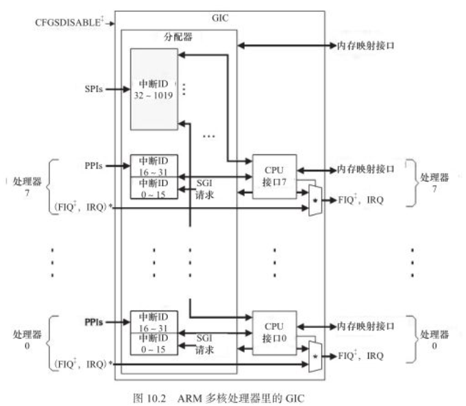

ARM中断类型

	1.SGI(Software Generated Interrupt,中断号0-15):软件产生的中断,可用于多核间的通信.一个CPU可以通过
		写GIC寄存器SGI中断号给另一个CPU产生中断;
	2.PPI(Private Peripheral Interrupt,中断号16-31):某个CPU私有外设的中断.此类中断只能发给绑定的
		那个CPU;
	3.SPI(Shared Peripheral Interrupt,中断号32-1019):共享外设的中断.此类中断可以路由到任意一个CPU.
	PS:ARM linux默认情况下,中断都是在CPU0上产生的.

### 10.2 Linux中断处理程序架构

中断会打断内核进程的正常调度和运行,因此要求中断服务程序尽量短小精悍.

#### 10.2.1 中断处理程序框架

中断到来时,要完成的工作量往往并不会是短小的,可能要进行大量的耗时处理.为了在中断执行时间尽量短和中断处理需完成的工作量大之间找到一个平衡点.linux将中断分为顶半部和底半部:

	顶半部(Top Half):完成尽量少、比较紧急的功能.工作包括:读取寄存器中断状态,在清除中断标志后"登记中断".
		即将底半部处理程序挂到该设备的底半部执行队列中去.顶半部不可被中断,属于硬件的中断服务程序,处于中断
		上下文中.
	底半部(Bottom Half):实现中断服务程序处理耗时的中断,不在硬件的中断服务程序中,处于非中断上下文中.
	PS:如果中断要处理的工作本身很少,完成可以直接在顶颁布全部完成,不需要底半部.

#### 10.2.2 查看系统的中断统计信息

	cat /proc/interrupts

### 10.3 Linux中断编程

#### 10.3.1 申请和释放中断

**1.申请irq**

	int request_irq(unsigned int irq, irq_handler_it handler, unsigned long flags,
		const char *name, void *dev);
	/*
		para1:要申请的硬件中断号;
		para2:中断处理函数(顶半部),是一个回调函数,中断发生时,系统调用这个函数,para5将被传递给它;
		para3:中断处理属性(触发方式):IRQF_TRIGGER_RISING/FALLING/HIGH/LOW;
		para4:...(没看懂);
		para5:一般设置为设备结构体(表示传递给中断服务程序的私有数据);
		retval:
			0:表示成功;
			-EINVAL:表示中断号无效或处理函数指针为NULL;
			-EBUSY:表示中断已经被占用且不能共享.
	*/

**2.释放irq**

	void free_irq(unsigned int irq, void *dev_id);
	//参数定义与request_irq相同.释放申请的irq中断.

**3.带自动内核managed资源的irq申请函数**

内核中以"devm_"开头的API申请的是内核"managed"的资源,一般不需要再出错处理和remove()接口里显示的释放资源(e.g.申请的irq不需要调用free_irq来释放资源)--->类似Java的垃圾回收机制.

	int devm_request_irq(struct device *dev, unsigned int irq, irq_handler_t handle, 
		unsigned long irqflags, const char *devname, void *dev_id);
	/*
		para1:struct device结构体指针;
		para2:要申请的硬件中断号;
		para3:中断处理函数(顶半部),是一个回调函数,中断发生时,系统调用这个函数;
		para4:中断处理属性(触发方式):IRQF_TRIGGER_RISING/FALLING/HIGH/LOW;
		para5:...(没看懂);
		para6:一般设置为设备结构体(表示传递给中断服务程序的私有数据);
	*/
	
	实例:
	struct device *dev = &pdev->dev;
	struct resource *irq[2];
	struct tsio_dev *tsio;
	irq[0] = platform_get_resource(pdev, IORESOURCE_IRQ, 0); /* struct platform_device *pdev */
	ret = devm_request_irq(dev, irq[0]->start, tsio_dmq_irq, IRQF_TRIGGER_HIGH, irq[0]->name,
		tsio);

PS:使用devm_request_irq申请顶半部中断不需要显示释放,kernel自动进行资源的回收.

#### 10.3.2 使能和屏蔽中断

**1.使能中断函数**

	void enable_irq(int irq);

**2.屏蔽中断**

屏蔽中断号的目的:程序收到某中断后,一般先屏蔽该中断号,然后进行中断处理,处理完了之后再使能该中断号.

1.屏蔽指定的中断号

	1.disable_irq
	void disable_irq(int irq);
	/*
		屏蔽irq指定的中断号.
		disable_irq()需要等待指定的中断号irq被处理完才会返回.不能用在顶半部,会造成死锁.
	*/
	2.disable_irq_nosync
	void disable_irq_nosync(int irq);
	/*
		屏蔽irq指定的中断号.
		disable_irq_nosync():调用后立即返回,因此在顶半部中只能调用disable_irq_nosync(n).
	*/

2.屏蔽本CPU内的所有中断

	1.local_irq_disable()和local_irq_enable()只能禁止和使能本CPU内的中断.不能解决SMP多CPU引发的竞态,
		单独使用通常是一个bug,因此SMP的多CPU引发的竟态常常使用中断屏蔽+自旋锁.
	2.local_irq_save(flags)/local_irq_restore(flags)除了禁止/恢复中断操作外,还保存CPU的中断位信息
		(即保存和恢复CPSR).
	PS:以local_开头的方法的作用范围为本CPU内.

#### 10.3.3 底半部机制

linux实现底半部的机制主要由tasklet, 工作队列, 软中断和线程化irq.

**1.tasklet**

tasklet执行上下文为"软中断",运行于软中断上下文,不允许睡眠.

1.步骤

	1.定义一个底半部处理函数:
		void my_tasklet_func(unsigned long);
	2.声明一个struct tasklet_struct结构,并与底半部处理函数关联:
		DECLARE_TASKLET(my_tasklet, my_tasklet_func, data);
		/*
			para1:该宏定义一个struct tasklet_struct变量my_tasklet;
			para2:需要关联的底半部处理函数名;
			para3:传递给底半部处理函数的参数.
		*/
	3.在需要调度tasklet的地方引用tasklet_schedule()函数就能使系统在适当的时候进行调度运行:
		tasklet_schedule(&my_tasklet);

2.使用tasklet作为底半部处理设备中断的驱动模板

	void xxx_do_tasklet(unsigned long);	/*定义中断低半部处理函数*/
	DECLARE_TASKLET(xxx_tasklet, xxx_do_tasklet, 0);
	/*声明一个struct tasklet_struct变量xxx_tasklet,并将其与底半部处理函数关联*/
	
	void xxx_do_tasklet(unsigned long)
	{
		...	/*底半部处理函数的实现*/
	}
	
	//中断处理顶半部
	irqreturn_t xxx_interrupt(int irq, void *dev_id)
	{
		...
		tasklet_schedule(&xxx_tasklet);
		/*顶半部中调用tasklet_schedule():系统会在适当的时候进行调度运行与xxx_tasklet关联的底半部函数*/
		...
	}
	
	int __init xxx_init(void)
	{
		...
		ret = request_irq(xxx_irq, xxx_interrupt, 0, "xxx", NULL);
		/*申请中断,中断号与顶半部函数关联*/
		...
		return IRQ_HANDLED;
	}	
	
	void __exit xxx_exit(void)
	{
		...
		free_irq(xxx_irq, xxx_interrupt);	/*释放中断*/
		...
	}

**2.工作队列**

工作队列执行上下文为"内核线程",运行进程上下文,允许睡眠.

1.步骤

	1.定义一个工作队列:
		struct work_struct my_wq;
	2.定义底半部处理函数:
		void my_wq_func(struct workd_struct *work);
	3.通过INIT_WORK()初始化定义的工作队列并将工作队列与底半部处理函数绑定:
		INIT_WORK(&my_wq, my_wq_func);
		/*
			para1:定义的工作队列;
			para2:需要关联的底半部处理函数名;
		*/
	4.在需要调度工作队列的地方调用schedule_work()函数就能使系统在适当的时候进行调度运行:
		schedule_work(&my_wq);

2.使用工作队列作为底半部处理设备中断的驱动模板

	struct work_struct xxx_wq;	/*定义一个工作队列*/
	void xxx_do_work(struct work_struct *work);	/*定义一个底半部处理函数*/
	
	void xxx_do_work(struct work_struct *work)
	{
		...	/*底半部处理函数实现*/
	}
	
	/*中断顶半部*/
	irqreturen_t xxx_interrupt(int irq, void *dev_id)
	{
		...
		schedule_work(&xxx_wq);	/*顶半部调度底半部工作队列*/
		/*顶半部中调用schedule_work():系统会在适当的时候进行调度运行与工作队列关联的底半部函数*/
		...
		return IRQ_HANDLED;
	}
	
		int __init xxx_init(void)
	{
		...
		ret = request_irq(xxx_irq, xxx_interrupt, 0, "xxx", NULL);
		/*申请中断,中断号与顶半部函数关联*/
		...
		INIT_WORK(&xxx_wq, xxx_do_work);	/*初始化工作队列,完成工作队列与底半部函数的绑定*/
	}	
	
	void __exit xxx_exit(void)
	{
		...
		free_irq(xxx_irq, xxx_interrupt);	/*释放中断*/
		...
	}

**3.软中断**

1.概念

	1.软中断(softirq):是一种传统的底半部处理机制,tasklet是基于软中断实现的,都运行于软中断上下文;
	2.linux内核中:
		softirq_action结构体用于表征一个软中断(包含软中断处理函数指针和传递给该函数的参数);
		open_softirq()函数用于注册软中断对应的处理函数;
		raise_softirq()函数用于触发一个软中断.
	3.软中断和tasklet都运行于软中断上下文(属于原子上下文的一种),工作队列运行于进程上下文.因此:
		软中断和tasklet处理函数不允许睡眠,工作队列处理函数允许睡眠.
	4.local_bh_disable()和local_bh_enable()是内核中用于禁止和使能软中断及tasklet底半部机制的函数;
	5.一般驱动不宜使用softirq.

2.硬中断、软中断和信号的区别

	硬中断:外部设备对CPU的中断;
	软中断:中断底半部的一种处理机制;
	信号:内核(或其他进程)对某个进程的中断.

**4.threaded_irq**

略.

#### 10.3.4 实例:GPIO按键的中断

linux下的./drivers/input/keyborad/gpio_keys.c是一个通用的GPIO按键驱动,移植该驱动时只需要修改"arch/arm/mach-xxx"下的板文件或者device tree对应的dts即可.

	源码见"./drivers/input/keyborad/gpio_keys.c"或"defychen/code/linux-gpio/gpio_keys.c".
	PS:源码分析暂略.

### 10.4 共享中断

共享中断:多个设备共享同一根硬件中断线.

#### 10.4.1 使用方法

	1.多个设备在申请中断时,都应该以IRQF_SHARED标志取申请:
		request_irq(sh_irq_num, xxx_interrupt, IRQ_SHARED, "xxx", xxx_dev);
	2.在中断到来时,系统会遍历执行共享此中断的所有中断处理程序,直到某一个函数返回IRQ_HANDLED.因此,在中断
		处理程序顶半部中,应根据硬件寄存器中的信息比照传入的dev_id参数迅速判断是否为本设备的中断.如果不是,
		应迅速返回IRQ_NONE.

#### 10.4.2 共享中断驱动模板

	/*中断顶半部*/
	irqreturn_t xxx_interrupt(int irq, void *dev_id)
	{
		...
		int status = read_int_status();	//获知中断源
		if (!is_myint(dev_id, status))	//判断是否为本设备中断
			return IRQ_NONE;			//不是本设备中断,立即返回
		
		//是本设备中断,进行处理
		...
		return IRQ_HANDLED;		//返回IRQ_HANDLED表示中断已被处理
	}
	
	//设备驱动模块加载函数
	int xxx_init(void)
	{
		...
		//申请共享中断
		result = request_irq(sh_irq, xxx_interrupt, IRQF_SHARED, "xxx", xxx_dev);
		...
	}
	
	//设备驱动模块卸载函数
	void xxx_exit(void)
	{
		...
		//释放中断
		free_irq(sh_irq, xxx_interrupt);
	}

### 10.5 内核定时器

#### 10.5.1 内核定时器编程

软件意义上的定时器最终依赖硬件定时器来实现,内核在时钟中断发生后检测各定时器是否到期,到期后的定时器处理函数将作为软中断在底半部执行.

linux内核提供了用于操作定时器的数据结构和函数如下:

**1.timer_list**

timer_list结构体的一个实例对应一个定时器:

	struct timer_list {
		struct list_head entry;
		unsigned long expires;	//指定定时器到期的时间(jiffies)
		struct tvec_base *base;
	
		void (*function)(unsigned long); //定时器满后,函数指针function指向的函数将被调用
		unsigned long data;		//传入函数指针的参数
	
		int slack;
	#ifdef CONFIG_TIMER_STATS
		int start_pid;
		void start_site;
		char start_comm[16];
	#endif
	#ifdef CONFIG_LOCKDEP
		struct lockdep_map lockdep_map;
	#endif
	};

定义一个my_timer的定时器:

	struct timer_list my_timer;

**2.初始化定时器**

	void init_timer(struct timer_list *timer);	//para为声明的定时器

**3.添加定时器**

添加(也叫注册)定时器,用于将定时器加入到内核动态定时器链表中:

	void add_timer(struct timer_list *timer);

**4.删除定时器**

删除定时器,用于将定时器从内核动态定时器链表中移除:

	int del_timer(struct timer_list *timer);
	/*
	PS: del_timer_sync()是del_timer()的同步版,在删除一个定时器时需等待其被处理完,因此不能用于中断上下
		文(因为会阻塞).
	*/

**5.修改定时器**

修改定时器的到期时间,在新的被传入的expires到来后才会执行定时器函数:

	int mod_timer(struct timer_list *timer, unsigned long expires);
		//指定timer中的expires参数为para2(expires的值).

**6.内核定时器使用模板**

	//设备结构体
	struct xxx_dev {
		struct cdev dev;
		...
		struct timer_list xxx_timer;
	};
	
	//xxx驱动中的某函数
	xxx_func1(...)
	{
		struct xxx_dev *dev = filp->private_data;
		...
		//初始化定时器
		init_timer(&dev->xxx_timer);
		dev->xxx_timer.function = &xxx_do_timer; //指定定时器满的处理函数
		dev->xxx_timer.data = (unsigned long)dev;
			//指定定时器处理函数的参数,一般为设备结构体指针.
		dev->xxx_timer.expires = jiffies + delay;
		//指定到期时间.一般为jiffies的基础上添加一个时间,如为Hz,则表示延迟1s.
		add_timer(&dev->xxx_timer);	//注册定时器
	}
	
	//xxx驱动中的某函数
	xxx_func2(...)
	{
		...
		//删除定时器
		del_timer(&dev->xxx_timer);
	}
	
	//定时器处理函数
	static void xxx_do_timer(unsigned long arg)
	{
		struct xxx_dev *dev = (struct xxx_dev *)(arg);
		...
		//调度定时器再执行
		dev->xxx_timer.expires = jiffies + delay; //新的定时器满的时间
		add_timer(&dev->xxx_timer);
		...
	}

#### 10.5.2 实例:秒字符设备

**1.秒字符设备驱动代码**

	#include <linux/module.h>
	#include <linux/fs.h>
	#include <linux/mm.h>
	#include <linux/init.h>
	#include <linux/cdev.h>
	#include <linux/slab.h>
	#include <linux/uaccess.h>
	
	#define SECOND_MAJOR	(248)
	static int second_major = SECOND_MAJOR;
	module_param(second_major, int, S_IRUGO);
	
	struct second_dev {
		struct cdev cdev;
		atomic_t counter;
		struct timer_list s_timer;
	};
	
	static struct second_dev *second_devp;
	
	static void second_timer_handler(unsigned long arg)
	{
		mod_timer(&second_devp->s_timer, jiffies + HZ); //修改定时器,触发下一次定时
		/*
			此处的:jiffies + HZ:表示每个一秒定时器绑定的函数指针将会被调用一次.
		*/
		atomic_inc(&second_devp->counter); //增加秒计数
		pr_info("current jiffies is %ld\n", jiffies);
	}
	
	static int second_open(struct inode *inode, struct file *filp)
	{
		init_timer(&second_devp->s_timer);
		second_devp->s_timer.function = &second_timer_handler; //绑定函数指针
		second_devp->s_timer.expires = jiffies + HZ;
	
		add_timer(&second_devp->s_timer);
		atomic_set(&second_devp->counter, 0);
	
		return 0;
	}
	
	static int second_release(struct inode *inode, struct file *filp)
	{
		del_timer(&second_devp->s_timer);
		return 0;
	}
	
	static ssize_t second_read(struct file *filp, char __user *buf, size_t count, loff_t *ppos)
	{
		int counter;
	
		counter = atomic_read(&second_devp->counter);
	
		if (put_user(counter, (int *)buf)) //复制counter到userspace
			return -EFAULT;
		else
			return sizeof(unsigned int);
	}
	
	static const struct file_operations second_fops = {
		.owner = THIS_MODULE,
		.open = second_open,
		.release = second_release,
		.read = second_read,
	};
	
	static void second_setup_cdev(struct second_dev *devp, int index)
	{
		int err, devno = MKDEV(second_major, index);
	
		cdev_init(&devp->cdev, &second_fops);
		devp->cdev.owner = THIS_MODULE;
		err = cdev_add(&devp->cdev, devno, 1);
	
		if (err)
			pr_err("Failed to add second device!\n");
	}
	
	static int __init second_init(void)
	{
		int ret;
		dev_t devno = MKDEV(second_major, 0);
	
		if (second_major)
			ret = register_chrdev_region(devno, 1, "second");
		else {
			ret = alloc_chrdev_region(&devno, 0, 1, "second");
			second_major = MAJOR(devno);
		}
	
		if (ret < 0)
			return ret;
	
		second_devp = kzalloc(sizeof(struct second_dev), GFP_KERNEL);
		if (!second_devp) {
			ret = -ENOMEM;
			goto fail_malloc;
		}
	
		second_setup_cdev(second_devp, 0);
		return 0;
	
	fail_malloc:
		unregister_chrdev_region(devno, 1);
		return ret;
	}
	
	static void __exit second_exit(void)
	{
		cdev_del(&second_devp->cdev);
		kfree(second_devp);
		unregister_chrdev_region(MKDEV(second_major, 0), 1);
	}
	
	module_init(second_init);
	module_exit(second_exit);
	MODULE_AUTHOR("Defychen");
	MODULE_LICENSE("GPL v2");

**2.编译驱动的Makefile**

	ifneq ($(KERNELRELEASE), )
	
	obj-m := second_device.o
	
	else
	
	EXTRA_CFLAGS += DDEBUG
	KDIR := /home/defychen/repository_software/linux-4.4.189
	all:
		make CROSS_COMPILE=arm-linux-gnueabi- ARCH=arm -C $(KDIR) M=$(PWD) modules
	clean:
		rm -rf *.ko *.o *.mod.o *.mod.c *.symvers *.order .*.ko .tmp_versions
	endif
	
	.PYONY:all clean

**3.编译之后加载驱动并创建设备节点**

	insmod second_device.ko
	mknod /dev/second c 248 0

**4.应用程序代码**

	#include <stdio.h>
	#include <stdlib.h>
	#include <fcntl.h>
	
	int main()
	{
		int fd;
		int counter = 0;
		int old_counter = 0;
	
		fd = open("/dev/second", O_RDONLY);
		if (fd != -1) {
			while (1) {
				read(fd, &counter, sizeof(unsigned int));
				if (counter != old_counter) {
					printf("seconds after open /dev/second: %d\n", counter);
					old_counter = counter;
				}
			}
		}else {
			printf("Device open failure!\n");
		}

**5.编译并运行应用程序**

	arm-linux-guneabi-gcc second_app.c -o second_app
	//需要拷贝到板卡的工项目录再执行
	./second_app

**6.运行结果**

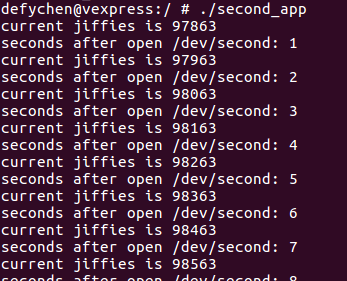

### 10.6 内核延时

#### 10.6.1 短延迟

**1.忙等待延迟**

忙等待延迟本质是CPU在进行循环.

	1.void ndelay(unsigned long nsecs);	//纳秒延迟
	2.void udelay(unsigned long usecs);	//微妙延迟
	3.void mdelay(unsigned long msecs);	//毫秒延迟
	//有时软件的延迟也可以:
	void delay(unsigned int time)
	{
		while(time--);
	}

**2.睡眠延迟**

睡眠延迟会使用调用的进程睡眠.对于毫秒时延(以及更大的秒时延),内核中最好不要直接使用mdelay()函数,因为会耗费CPU资源.而应该使用睡眠延迟.

	1.void msleep(unsigned int millisecs);	//毫秒睡眠延迟
	2.unsigned long msleep_interruptile(unsigned int millisecs);	//可中断的毫秒睡眠延迟
	3.void ssleep(unsigned int seconds);	//秒睡眠延迟

#### 10.6.2 长延迟

长延迟的方法为:比较当前的jiffies和目标jiffies(为当前的jiffies加上时间间隔的jiffies),直到未来的jiffies达到目标的jiffies.

**实例:使用忙等待先延迟100jiffies,再延迟2s**

	/*延迟100jiffies*/
	unsigned long delay = jiffies + 100;
	while (time_before(jiffies, delay));
	
	/*再延迟2s*/
	unsigned long delay = jiffies + 2*Hz;
	while (time_before(jiffies, delay));
	PS:还存在一个time_after(),与time_before类似.

#### 10.6.3 睡眠延迟

暂略.

***

## Chapter 11 内存与I/O访问

### 11.1 CPU与内存、I/O

#### 11.1.1 内存空间与I/O空间

**1.内存空间**

	内存空间:内存区域的地址空间,32-bit处理器大小为4G(32根地址线).

**2.I/O空间**

I/O空间仅在X86处理器中存在,使用专门的指令来访问(e.g.Intel中的in/out指令用于访问I/O空间).

	1.I/O空间:X86系统上外设使用的地址空间,大小为64K;
	2.I/O空间仅X86支持,ARM等不支持.ARM针对外设和内存提供统一的编址,并且使用统一的指令去访问.

PS:内存空间是必须的,但I/O空间是可选的.

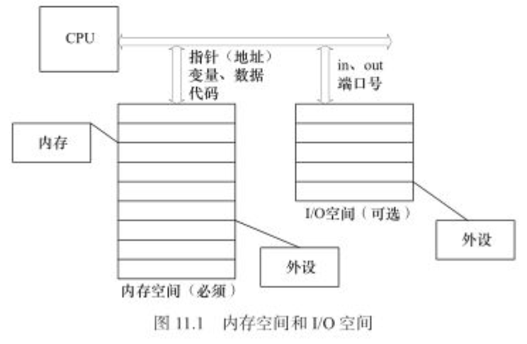

**3.IO端口与IO内存**

	IO端口:(外设的)寄存器或内存位于IO空间时称为IO端口(由于ARM CPU没有IO空间,因此这个基本没什么用).
	IO内存:(外设的)寄存器或内存位于内存空间时,称为IO内存(ARM CPU使用).

#### 11.1.2 内存管理单元

**1.MMU的作用**

MMU硬件用于辅助操作系统进行内存管理,主要有以下作用:

	1.提供虚拟地址和物理地址的映射;
	2.内存访问权限保护;
	3.Cache缓存控制等硬件操作.

**2.TLB和TTW(MMU中的组件)**

	1.TLB(Translation Lookaside Buffer):转换旁路缓存,是MMU的核心部件.缓存少量的虚拟地址与物理地址
		的转换关系,是转换表的Cache,也叫"快表";
	2.TTW(Translation Table walk):转换表漫游.当TLB缓冲没有命中时,需要通过内存转换表(多级页表)来获
		得虚拟地址与物理地址的转换关系.TTW成功后,会更新到TLB中.

**3.ARM处理器访问内存的过程**

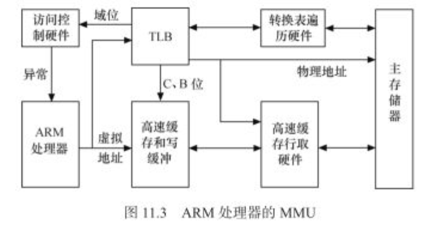

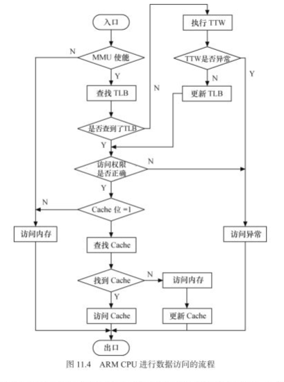

ARM内TLB条目中的控制信息用于控制对对应地址的访问权限以及Cache操作,主要用途如下:

	1.C(高速缓存)和B(缓存)位被用来控制对应的高速缓存和写缓冲,并决定是否进行高速缓存;
	2.访问权限和域位用来控制读写访问是否被允许.如不允许,MMU则向ARM处理器发送一个存储器异常.

PS:"TLB和通过TTW得到的更新的TLB"都是得到一个虚拟地址到物理地址的转换关系.最终都是在TLB条目的控制信息的控制下,当访问权限允许时,对物理地址的访问将会在cache或者内存中发生.

**4.linux与MMU相关代码**

	1.linux内核硬件无关层使用4级页表目录管理方式:PGD, PUD, PMD和PTE(是软件抽象);
	2.arch/arm/lib/uaccess_with_memcpy.c含有一个典型的从虚拟地址得到TPE的页表查询过程--->可以看看.

PS:MMU并不是所有处理器必须的,Samsung的S3C44B0X就没有MMU,新的Linux内核也支持不带MMU的处理器.

### 11.2 Linux内存管理

#### 11.2.1 linux的地址空间划分

linux系统进程的4GB内存空间(虚拟地址空间)被分为两个部分---用户空间和内核空间.用户空间地址0~3GB(0~PAGE_OFFSET--->0xC0000000(X86系统)),内核空间为3~4GB.

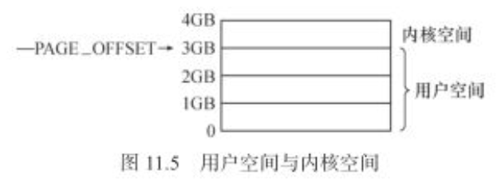

	1.用户空间:0~3GB,各个进程私有,每个进程都有自己的3GB空间;
	2.内核空间:3~4GB,所有进程及内核共享,因此需要做特殊的划分.

#### 11.2.2 linux内核空间映射

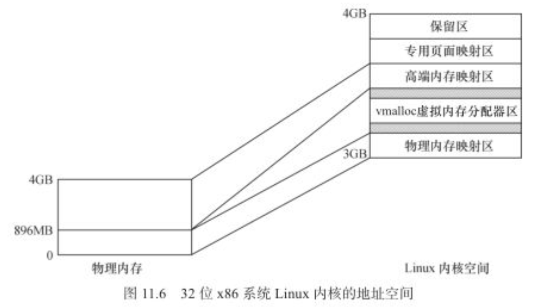

**1.1GB内核空间访问到全部物理内存**

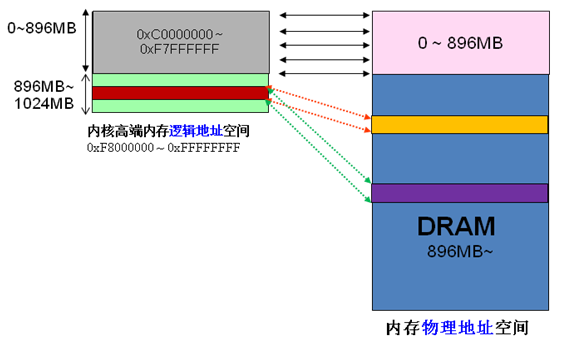

	1.从3GB内核空间开始，分别为:
		ZONE_DMA:3GB ~ 3GB+16MB,开始的16MB,留给DMA用;
		ZONE_NORMAL:3GB+16MB ~ 3GB+896M,属于常规内存;
		ZONE_HIGHMEM:3GB+896M ~ 4GB,属于高端内存.
		PS:ZONE_DMA和ZONE_NORMAL属于物理内存映射区,映射到物理内存的低896MB.其他高端内存负责映射物理
			内存其余3GB;
	2.当内核想访问高于896MB物理地址内存时,从0xF8000000 ~ 0xFFFFFFFF地址空间范围内找一段相应大小空闲
		的逻辑地址空间,借用一会.借用这段逻辑地址空间,建立映射到想访问的那段物理内存（即填充内核PTE页面
		表,临时用一会,用完后归还.这样别人也可以借用这段地址空间访问其他物理内存,实现了使用有限的地址空
		间,访问所有所有物理内存(如上图).
	PS:高端内存的最基本思想:借一段地址空间,建立临时地址映射,用完后释放,达到这段地址空间可以循环使用访问
		所有物理内存.

**2.3GB用户空间只能访问3GB物理内存**

	0~3GB属于用户空间,只能访问到3GB的物理内存--->比较好奇,难道是一一映射????

**3.x86结构CPU上的linux内核空间划分(从低--->高)**

1.物理内存映射区

	内核空间中的3GB~3GB+896MB---映射到物理内存的0~896MB.
		1.其中的3GB~3GB+16MB的留给DMA,叫ZONE_DMA;
		2.3GB+16MB~3GB+896MB为常规区域,叫ZONE_NORMAL;
		PS:其他的高于896MB为高端内存区域,叫ZONE_HIGHMEM.

2.vmalloc(虚拟内存分配器区)

	VMALLOC_START~VMALLOC_END,用于vmalloc()函数.与物理内存映射区有隔离带,与高端内存映射区也有隔离带.

3.高端内存映射区

	PKMAP_BASE~FIXADDR_START(高端内存区),这段虚拟内存会映射覆盖全部物理内存的高端内存(896MB~4GB).

4.专用页面映射区
	
	FIXADDR_START~FIXADDR_TOP,总尺寸和每页用途由fixed_address枚举结构在编译时预定义.

5)保留区

	FIXADDR_TOP~4GB

如果物理内存超过4GB,需要使用CPU的扩展分页(PAE)提供64位页目录项存取4GB物理内存.有36位物理地址空间,最大配置64GB物理内存

**4.ARM结构CPU的linux内核地址空间映射**

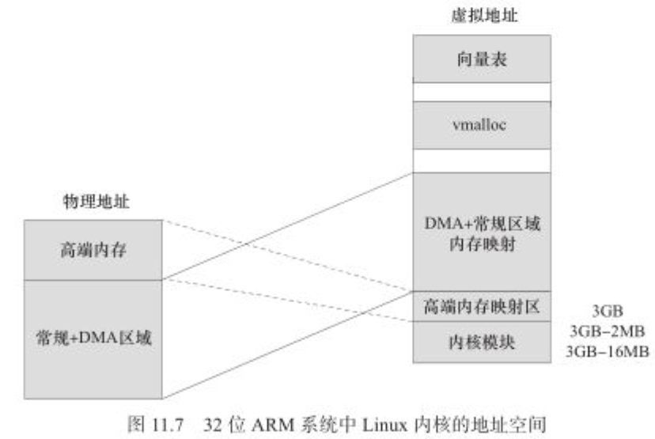

1.内核模块

	3GB-16MB~3GB-2MB,实现内核模块和内核本身的短跳转

2.高端内存映射区

	映射到物理内存地址的高端内存(非x86的896MB~4GB),高端内存由特殊的情况划分

3.DMA+常规区域内存映射

	该虚拟地址映射到物理内存的常规+DMA区域.与物理内存一一对应,仅存在一个固定的偏移

4.vmalloc区域

	大小可配置,通过"vmallo="启动参数指定

5.向量表区域

	CPU vector page,向量表地址

**5.DMA、常规、高端内存区域分布**

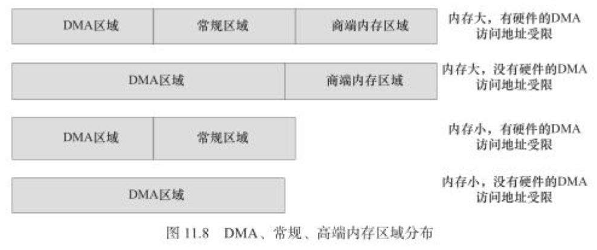

	没看明白???

**6.buddy算法管理内存区域**

DMA、常规、高端内存都采用buddy算法进行管理.

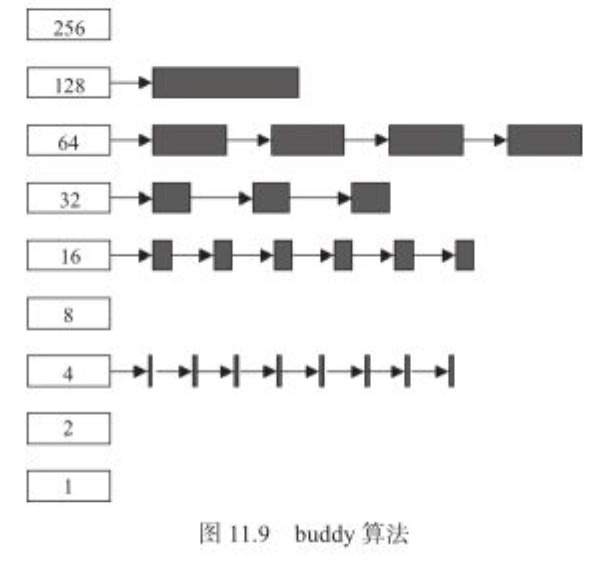

	buddy算法:把空闲的页面以2的n次方为单位进行管理,因此linux最底层的内存申请都是以2^n为单位的.
	buddy算法优点是:避免了外部碎片,任何时候区域里的空闲内存都能以2的n次方进行拆分与合并.

**7.查看内存区域剩余情况**

	cat /proc/buddyinfo
	显示:Node 0, zone   Normal    27    16     7     6     3     3     0     1     1     1    20 
	/*
	Normal:常规内存区域	1页空闲27个	连续2页空闲16个	连续4页空闲7个	
	*/
	如果:Node 0, zone   DMA    27    16     7     6     3     3     0     1     1     1    20 
	/*则为DMA区域中的情况*/

**8.DMA和常规区域使用下列方法进行虚拟/物理内存的转化**

	virt_to_phys():虚拟内存转化为物理内存(仅适用于DMA和常规内存)
	phys_to_virt():物理内存转化为虚拟内存(仅适用于DMA和常规内存)
	PS:高端内存换算关系复杂

### 11.3 内存存取

#### 11.3.1 用户空间内存动态申请

申请:malloc()函数;释放:free()函数

	void *malloc(size_t size);	//申请一段size字节大小的buffer,返回为"void *"
	free(ptr);	//释放ptr(指针)指向的malloc内存
	/*
	void *ptr = malloc(SIZE);	//申请SIZE大小的内存
	free(ptr);	//释放ptr指向的内存
	*/

malloc()和free()函数在malloc.h和stdlib.h都有.
	
	一般只需要:#include <stdlib.h>即可.

Linux内核是按需调页(Demand Paging),malloc()申请返回时内核并没有真正给进程内存.此时读申请的内存会全部是0.只有在这个内存中写了数据之后再去读才会有真正的内容.

#### 11.3.2 内核空间内存动态申请

linux内核空间申请内存的函数主要是:kmalloc(), __get_free_pages()和vmalloc()等.

	1.kmalloc()和__get_free_pages()申请的内存位于DMA和常规区域的映射区,在物理上也是连续的,与真实的物
		理地址只有一个固定的偏移,一般使用virt_to_phys即可得到物理地址;
	2.vmalloc()是在虚拟内存空间给出一块连续的内存区,这片虚拟内存在物理上不一定连续,虚拟内存与物理内存也
		没有简单的换算关系.

**1.kmalloc()**

申请的内存位于DMA和常规内存区域,物理上连续.与物理内存仅存在一个固定偏移,具有一一对应关系,转换关系简单,

	void *kmalloc(size_t size, int flags);
	/*
		para1:申请的字节大小;
		para2:分配标志(适用于申请小于128KB的内存).分配标志种类如下:
			GFP_KERNEL:在内核空间的进程申请内存.若申请不满足,进程会睡眠等待页,引起阻塞.不能用于中断上
			下文或持有自旋锁的时候(e.g.中断处理函数、tasklet和内核定时器等非进程上下文不能使用);
			GFP_ATOMIC:不存在空闲页时,不等待直接返回.适用于中断处理函数、tasklet、内核定时器等非进程
			上下文;
			GFP_USER:为用户空间分配内存,可能阻塞;
			GFP_HIHGUSER:类似GFP_USER,但是是从高端内存分配;
			GFP_DMA:从DMA区域分配内存.
			...其他略.
		PS:因为kmalloc()底层实现依赖于__get_free_pages(),因为分配标志前缀为:GFP(get_free_pages的
			缩写).
	*/
	kfree(ptr);	/*使用kmalloc申请的内存释放函数*/

**2.__get_free_pages()**

linux内核最底层获得空闲内存页的方法,kmalloc中的GFP即是get_free_pages,所以一般使用kmalloc即可.

相关的函数:

	get_zeroed_page(unsigned int flags);	//该宏返回一个指向新页的指针并将该页清0;
	__get_free_page(unsigned int flags);	//该宏返回一个指向新页的指针,但是该页不清0;
	__get_free_pages(unsigned int flags, unsigned int order);
	/*
		para1:分配标志,常用的为:GFP_KERNEL和GFP_ATOMIC;
		para2:分配的页数为2^order,order的最大值为10(即1024页)或11(即2048页),每个页为4KB;
		retval:返回分配内存的首地址.
	*/

**3.vmalloc()**

1.vmalloc()分配的特点:

	1.vmalloc()只为存在于软件中(没有硬件意义)的较大的顺序缓冲区分配内存;
	2.vmalloc()远大于__get_free_pages()的开销,为了完成vmalloc(),新的页表项需要被建立;
	3.vmalloc不能用于分配少量内存(e.g.1页以内的内存,1 page更适合用kmalloc或者__get_free_page()).

2.vmalloc()函数

	void *vmalloc(unsigned long size);	/*分配size字节的内存*/
	void vfree(void *addr);	/*释放*/

vmalloc不能用于原子上下文中,因为内部使用GFP_KERNEL标志的kmalloc.vmalloc的虚拟地址和物理地址不是一个简单的线性映射(也没有硬件意义).

**4.slab和内存池**

kmalloc()和__get_free_pages()等函数以页为单位申请和释放内存容易导致浪费(如果申请少量字节,也需要1页).slab和内存池是预先分配好一片大内存,然后透过slab或内存池来管理,提供给一些需要少量内存的软件.

1.slab

slab建立在buddy算法之上,从buddy算法拿到2^n个页面后进行二次管理.slab申请的内存以及基于slab的kmalloc()申请的内存,与物理内存之间也是一个简单的线性偏移.

	1.创建slab缓存
		struct kmem_cache *kmem_cache_create(const char *name, size_t size, size_t align,
			unsigned long flags,
			void (*ctor)(void *, struct kmem_cache *, unsigned long),
			void (*dtor)(void *, struct kmem_cache *, unsigned long));
		/*
			para1:slab名字;
			para2:是要分配的每个数据结构的大小--->slab用于管理n个相同结构体的的大小;
			para3:对齐,一般给0即可;
			para4:控制如何进行分配的位掩码,包括:
				SLAB_HWCACHE_ALIGN(每个数据对象对齐到一个cacheline);
				SLAB_CACHE_DMA(要求数据对象在DMA区域中分配);
			para5:为NULL即可;
			para6:为NULL即可.
		*/
	2.分配slab缓存
		void kmem_cache_alloc(struct kmem_cache *cachep, gfp_t flags);
		//从kmem_cache_create()创建的slab后备缓存中分配一块内存,并返回首地址指针.
	3.释放slab缓存
		void kmem_cache_free(struct kmem_cache *cachep, void *objp);
		//释放由kmem_cache_alloc()分配的缓存.
	4.回收slab缓存
		int kmem_cache_destroy(struct kmem_cache *cachep);
	5.slab缓存使用范例
		/* 1.创建slab缓存 */
		static kmem_cache_t *xxx_cachep;
		xxx_cachep = kmem_cache_create("xxx", sizeof(struct xxx),
			0, SLAB_HWCACHE_ALIGN | SLAB_PANIC, NULL, NULL);
		/* 2.分配slab缓存 */
		struct xxx *ctx;
		ctx = kmem_cache_alloc(xxx_cachep, GFP_KERNEL);
		... //使用slab缓存
		/* 3.释放slab缓存 */
		kmem_cache_free(xxx_cachep, ctx);
		/* 4.回收slab缓存 */
		kmem_cache_destroy(xxx_cachep);
	6.获知当前slab的分配和使用情况
		cat /proc/slabinfo

2.内存池

内存池技术是一种非常经典的用于分配大量小对象的后备缓存技术.

	1.创建内存池
		mempool_t *mempool_create(int min_nr, mempool_alloc_t *alloc_fn,
			mempool_free_t *free_fn, void *pool_data);
		/*
			para1:需要预分配对象的数目;
			para2:指向内存池机制提供的标准对象分配函数的指针;
				typedef void *(mempool_alloc_t)(int gfp_mask, void *pool_data);
			para3:指向内存池机制提供的标准对象回收函数的指针;
				typedef void *(mempool_free_t)(int gfp_mask, void *pool_data);
			para4:分配和回收函数指针需要用到的指针.
		*/
	2.从内存池中分配对象或回收对象到内存池
		void *mempool_alloc(mempool_t *pool, int gfp_mask);
		void mempool_free(void *element, mempool_t *pool);
	3.回收内存池
		void mempool_destroy(mempool_t *pool);

### 11.4 设备I/O端口和I/O内存的访问

任何设备通常都会有控制、数据、状态等寄存器来控制设备、读写设备和获取设备状态.

ARM CPU没有I/O空间,只有内存空间.外设和内存统一编址,使用相同的指令去访问外设和内存.

#### 11.4.1 I/O端口和IO内存访问接口

**1.I/O端口**

(外设寄存器位于I/O空间)--->ARM CPU没有.

	1.读写字节端口(8-bit)
		unsigned inb(unsigned port); //从端口port读一个字节数据
		unsigned outb(unsigned char byte, unsigned port); //将一个字节的数据写入port端口
	2.读写字端口(16-bit)
		unsigned inw(unsigned port); //从端口port读一个字数据
		unsigned outw(unsigned short word, unsigned port); //将一个字的数据写入port端口
	3.读写长字端口(32-bit)
		unsigned inl(unsigned port); //从端口port读一个长字数据
		unsigned outl(unsigned longword, unsigned port); //将一个长字的数据写入port端口
	4.读写一串字节
		void insb(unsigned port, void *addr, unsigned long count); 
		/*从端口port读count个字节到addr指向的内存*/
		void outsb(unsigned port, void *addr, unsigned long count);
		/*将addr指向的内存中的count个字节写入port端口*/
	5.读写一串字
		void insw(unsigned port, void *addr, unsigned long count); 
		/*从端口port读count个字到addr指向的内存*/
		void outsw(unsigned port, void *addr, unsigned long count);
		/*将addr指向的内存中的count个字写入port端口*/
	6.读写一串长字
		void insl(unsigned port, void *addr, unsigned long count); 
		/*从端口port读count个长字到addr指向的内存*/
		void outsl(unsigned port, void *addr, unsigned long count);
		/*将addr指向的内存中的count个长字写入port端口*/

**2.I/O内存**

ARM属于I/O内存,一般ARM板卡的寄存器用I/O内存来访问.

1.将设备所处的物理地址映射到虚拟地址上--->因为驱动中访问的必须是虚拟地址.

	void *ioremap(unsigned long offset, unsigned long size);
	/*
		para1:offset,一般传递设备的物理地址即可;
		para2:size,一般传递设备寄存器的大小即可.
		retval:返回映射的虚拟地址.
	*/

2.在设备驱动卸载时需要释放映射的设备虚拟地址

	void iounmap(void *addr);

3.ioremap的变体devm_ioremap()

	void __iomem *devm_ioremap(struct device *dev, resource_size_t offset, unsigned long size);
	/*
		para1:设备指针,devm_开头的函数在驱动卸载时不需要进行释放;
		para2:offset,一般传递设备的物理地址即可;
		para3:size,一般传递设备寄存器的大小即可.
	*/

4.读写ioremap映射的虚拟地址

	不带内存屏障的读I/O空间的虚拟地址函数:
		readb_relaxed(addr)---读8-bit的寄存器.
		readw_relaxed(addr)---读16-bit的寄存器.
		readl_relaxed(addr)---读32-bit的寄存器.
	不带内存屏障的写I/O空间的虚拟地址函数:
		readb_relaxed(value, addr)---写8-bit到addr寄存器.
		readw_relaxed(value, addr)---写16-bit到addr寄存器.
		readl_relaxed(value, addr)---写32-bit到addr寄存器.
	带内存屏障的读I/O空间的虚拟地址函数:
		readb(addr)---读8-bit的寄存器.
		readw(addr)---读16-bit的寄存器.
		readl(addr)---读32-bit的寄存器.
	带内存屏障的写I/O空间的虚拟地址函数:
		readb(value, addr)---写8-bit到addr寄存器.
		readw(value, addr)---写16-bit到addr寄存器.
		readl(value, addr)---写32-bit到addr寄存器.

#### 11.4.2 申请和释放设备的I/O端口和IO内存

**1.I/O端口申请**

申请和释放I/O端口,表明驱动要访问这片区域.

	1.申请I/O端口
	struct resource *request_region(unsigned long first, unsigned long n, const char *name);
	/*
		para1:起始端口号;
		para2:向内核申请n个端口;
		para3:设备名称;
		retval:分配成功返回不是NULL,失败返回NULL,意味着申请端口失败.
	*/
	2.释放申请的I/O端口
	void release_region(unsigned long start, unsigned long n);
	/*从start开始,释放n个端口*/

PS:devm_request_region不需要明显的调用释放动作.

**2.I/O内存申请**

申请和释放I/O内存,表明驱动要访问这片内存区域.

	1.申请I/O内存
	struct resource *request_mem_region(unsigned long start, unsigned long len, char *name);
	/*
		para1:申请内存的起始地址;
		para2:申请len个内存地址;
		para3:设备名称;
		retval:分配成功返回不是NULL,失败返回NULL,意味着申请I/O内存失败.
	*/
	2.释放I/O内存
	void release_mem_region(unsigned long start, unsigned long len);
	/*从start开始,释放len个内存地址*/
	PS:devm_request_mem_region不需要明显的调用释放动作.

#### 11.4.3 设备I/O端口和I/O内存访问流程

**1.I/O端口访问流程**

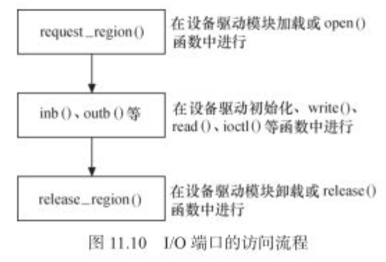

	request_region()------申请I/O端口区域(在设备驱动模块加载函数中进行)
	inb/outb等------------I/O端口访问(read/write/ioctl函数中进行)
	release_region()------释放I/O端口区域(在设备驱动模块的卸载函数中进行)

**2.I/O内存访问流程**

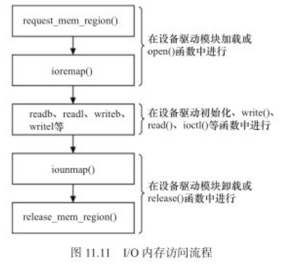

	request_mem_region()------申请I/O内存(在设备驱动模块加载函数中进行)
	ioremap()-----------------将寄存器物理地址映射到内核虚拟地址(在设备驱动模块加载函数中进行)
	readb/l/writeb/l----------I/O内存访问(read/write/ioctl函数中进行)
	iounmap()-----------------将映射的虚拟地址释放(在设备驱动模块的卸载函数中进行)
	release_mem_region()------释放I/O内存区域(在设备驱动模块的卸载函数中进行)

PS:有时候在访问寄存器或I/O端口前,会省去request_mem_region()、request_region()这样的调用(不影响结果).

#### 11.4.4 将设备地址映射到用户空间.

关于mmap的讲解,暂略.

### 11.5 I/O内存静态映射

该方法已经不值得推荐.

### 11.6 DMA

DMA:无需CPU参与,让外设与系统内存之间进行双向数据传输的硬件机制.使用DMA可以是系统CPU从实际的I/O数据传输过程中摆脱出来,大大提高了系统的吞吐率.

	DMA方式的数据传输由DMAC(DMA控制器)控制,在传输期间,CPU可以并发地执行其他任务.当DMA结束后,DMAC通过中断
	通知CPU数据传输已结束,然后由CPU执行相应的中断服务程序进行处理.

#### 11.6.1 DMA与Cache一致性

**1.Cache原理:**

Cache:CPU缓存,位于CPU与内存之间的缓存.利用程序的空间局部性和时间局部性原理,达到较高的命中率,从而避免CPU每次都必须要与相对慢速的内存交互数据依次来提高数据的访问速率.

	Cache虽然容量比内存小得多但交换速度比内存快得多.通常cache与主存存在一定范围内保持适当的比例关系,达到
	Cache的命中率90%以上(一般比例为4:1000).e.g.128KB Cache映射32MB内存;256KB可映射64MB内存.

DMA:可以作为内存与外设之间传输数据的方式,在此方式下,数据不需要经过CPU中转.

**2.cache一致性**

CPU需要操作的数据和结果优先从Cache中拿或者写回到Cache.

	1.外设对内存数据的修改不能保证cache同样得到更新;
	2.处理器对cache中内容的修改不能保证内存中的数据得到更新.

cache一致性问题最终解释为:cache中数据与内存中数据需要是一致的.

处理cache与内存数据一致性方法:

	贯穿读出式(Look Through):CPU首先请求cache,如果命中,切断主存请求;不命中,请求DRAM;
	旁路读出式(Look Aside):CPU同时请求cache和DRAM,cache速度快.如果命中cache将数据送给CPU的同时切断
		CPU对DRAM的请求;否则cache不做任何动作,CPU访问DRAM;
	写穿式(Write Through):CPU写到cache的同时也写入DRAM;
	回写式(Copy Back):一般只写到cache,当cache中的数据得到更新而DRAM中数据不变,cache中会设置一个标记.
		当cache中的数据再一次准备更新前会将cache中的数据写入DRAM中,进而才更新cache.

**3.Cache与DMA的一致性问题**

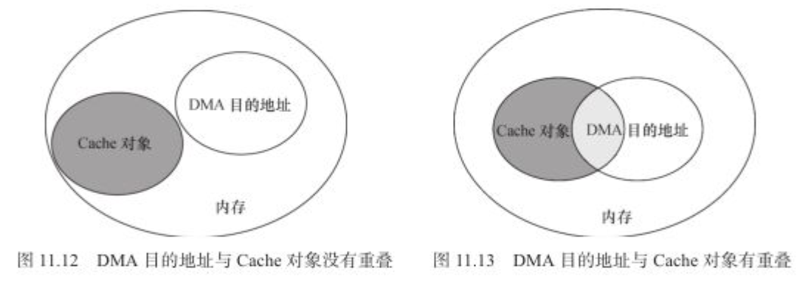

1.外设数据到CPU:DMA将外设数据传到DRAM,cache中保留的仍是旧数据,CPU从cache中拿到错误的数据.
	
	解决:CPU在读取cache中的数据之前,先进行cache_invalidate作用,保证从DRAM读取数据到cache再到CPU.

2.CPU数据到外设:CPU处理的数据结果存放到cache,此时cache中的数据还没写回到DRAM;DMA从DRAM中取数据送到外设取到的为错误的数据.

	解决:DMA处理之前先进行cache_flush(刷新数据到DRAM),保证DMA取到的数据为最新的数据.

#### 11.6.2 linux下的DMA编程

DMA本身不属于一种外设,它只是一种外设与内存交互数据的方式.

	内存中用于与外设交互数据的一块区域称为DMA缓冲区,在设备不支持scatter/gather(分散/聚集,简称S/G)操作的
	情况下,DMA缓冲区在物理上必须是连续的.

**1.DMA区域**

x86系统其DMA操作只能在16MB以下的内存中进行.使用kmalloc()、__get_free_pages()等函数申请DMA区域应使用GFP_DMA标志.

	内核源代码中的:unsigned long dma_mem_alloc(int size);可用于申请DMA内存.

PS:在现代嵌入式处理中,DMA操作可以在整个常规内存区域中进行.因此,DMA区域就直接覆盖了常规内存.

**2.虚拟地址、物理地址和总线地址**

	总线地址:从设备角度看到的内存地址,基于DMA的硬件使用的是总线地址而不是物理地址;
	物理地址:从CPU MMU控制器外围看到的内存地址;
	虚拟地址:CPU核角度看到的地址.
	PS:有时总线地址即为物理地址(e.g.PC上的ISA和PCI),但不是每个平台都如此.

IOMMU

IOMMU的工作原理与CPU内的MMU类似,针对的是外设总线地址和内存地址之间的转化.

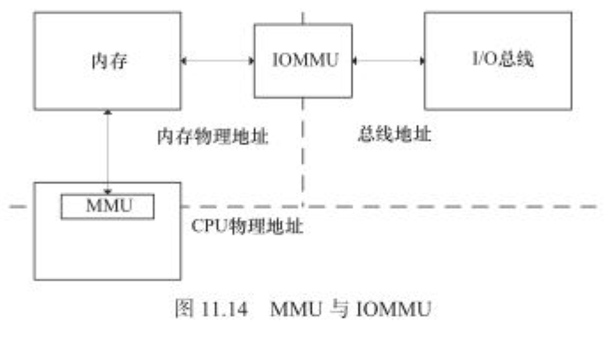

	IOMMU可以使得外设DMA引擎看到"虚拟地址",在使用IOMMU的情况下,在修改映射寄存器后,可以使得SG中分段的
	缓冲区地址对外设变得连续.

**3.DMA地址掩码**

设备并不一定能在所有的内存地址上执行DMA操作,此时需要执行DMA地址掩码:

	int dma_set_mask(struct device *dev, u64 mask);
	/*
		e.g.对于只能在24-bit地址上执行DMA操作的设备而言,应该调用:
			dma_set_mask(dev, 0xffffff); //表示只取地址的低24-bit.
	*/

**4.一致性DMA缓冲区**

1.分配/释放一个DMA一致性的内存区域

	1.申请一片DMA缓冲区,以进行地址映射并保证该缓冲区的Cache一致性.
	void *dma_alloc_coherent(struct device *dev, size_t size, dma_addr_t *handle, gfp_t gfp);
	/*
		para1:device;
		para2:分配的大小;
		para3:返回DMA缓冲区的总线地址.dma_addr_t类型表示的是总线地址;
		para4:gfp标志.
		retval:返回申请到的DMA缓冲区的虚拟地址.
	*/
	2.释放函数
	void dma_free_coherent(struct device *dev, size_t size, void *cpu_addr, dma_addr_t handle);

2.分配一个写合并(writecombining)的DMA缓冲区

	1.申请一片写合并的DMA缓冲区
	void *dma_alloc_writecombine(struct device *dev, size_t size, dma_addr_t *handle,
		gfp_t gfp);
	2.释放函数
	#define dma_free_writecombine(dev, size, cpu_addr, handle) \
			dma_free_coherent(dev, size, cpu_addr, handle)

3.PCI设备申请DMA缓冲区

	1.申请DMA缓冲区
	void *pci_alloc_consistent(struct pci_dev *pdev, size_t size, dma_addr_t *dma_addrp);
	2.释放函数
	void pci_free_consistent(struct pci_dev *pdev, size_t size, void *cpu_addr,
		dma_addr_t dma_addr);

PS:dma_alloc_xxx开头的函数申请的内存区域不一定在DMA区域里面.对于32-bit处理器,当coherent_dma_mask小于0xffffff时,才会设置GFP_DMA标记,并从DMA区域去申请内存.

**5.流式DMA映射**

暂略.

**6.dmaengine标准API**

linux内核目前推荐使用dmaengine的驱动架构来编写DMA控制器区域.

内容暂略.

***

## Chapter 12 Linux设备驱动的软件架构思想

### 12.1 Linux驱动的软件架构

**linux驱动的软件架构哲学:**

1.linux设备和驱动分离

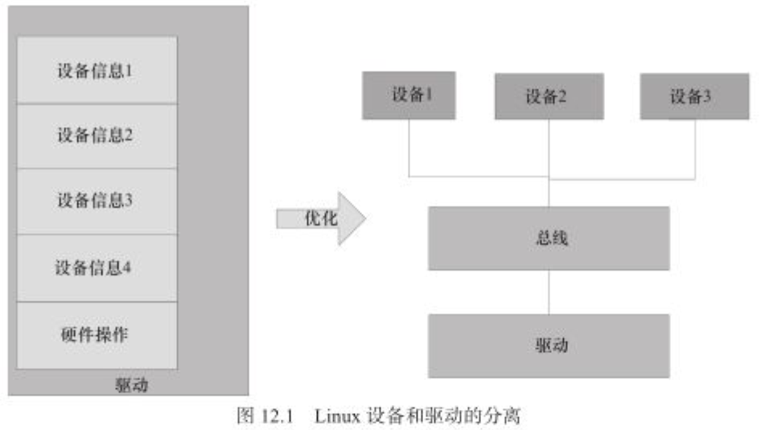

	驱动只管驱动,设备只管设备,总线负责匹配设备和驱动.驱动则以标准途径拿到板级信息;

2.linux驱动的分层

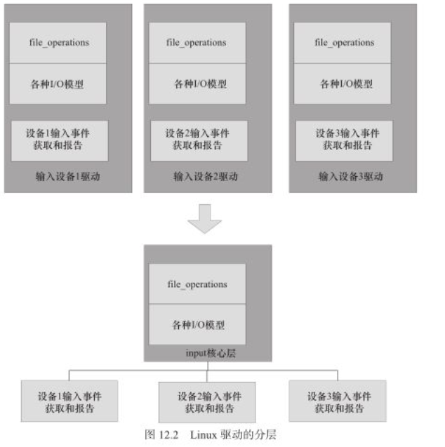

	提炼一个input的核心层出来,将与linux接口以及整个一套input事件的汇报机制都在input里实现

3.linux驱动的分隔

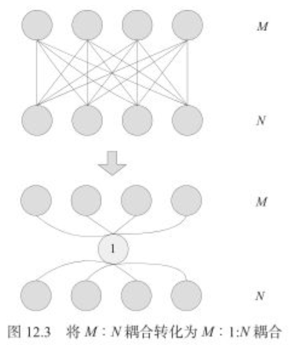

	实现高内聚,低耦合.

### 12.2 platform设备驱动

#### 12.2.1 platform总线、设备和驱动

总线实现将设备和驱动绑定.在注册设备时,总线会寻找与该设备匹配的驱动;注册驱动时,总线会寻找与该驱动匹配的设备.

常用的总线有:

	1.PCI, USB, I2C, SPI等:像此类的总线是有设备会依附于该总线;
	2.platform总线:linux中的一种虚拟总线.像在SoC内部集成的独立外设控制器(e.g.内部I2C,RTC,LCD,看门狗等)
		以及挂接在SoC内存空间的外设等都会依附于platform总线;

**1.struct platform_device**

platform的设备称为platform_device(e.g.I2C,RTC,LCD,看门狗等SoC内部集成的控制器挂在platform上,称为platform_device).

	/* 在./include/linux/platform_device.h定义 */
	struct platform_device {
		const char *name;	/*一般用于与platform_driver.driver.name进行匹配*/
		int id;
		bool id_auto;
		struct device dev;	/* 可使用to_platfrom_device(dev)找到platform_device */
		u32 num_resources;
		struct resources *resource;
		
		const struct platform_device_id *id_entry;
		char *driver_override; /*Driver name to force a match */
	
		/* MFD cell pointer */
		struct mfd_cell *mfd_cell;
	
		/* arch specific additions */
		struct pdev_archdata archdata;
	};

**2.struct platform_driver**

platform的驱动称为platform_driver.

	/* 在./include/linux/platform_driver.h定义 */
	struct platform_driver {
		int (*probe)(struct platform_device *);		/* probe函数,例化需要给值 */
		int (*remove)(struct platform_device *);	/* remove函数,例化需要给值 */
		void (*shutdown)(struct platform_device *);
		int (*suspend)(struct platform_device *, pm_message_t state);
		int (*resume)(struct platform_device *);
		struct device_driver driver;	/* 例化需要给值 */
		const struct platform_device_id *id_table;
		bool prevent_deferred_probe;
		/**
		 * 该结构常用的是:probe和remove函数指针以及driver成员,类似:suspend()/resume()更多的是
		 * 使用struct device_driver里的suspend和resume.
		 */
	};

**3.struct device_driver和struct dev_pm_ops**

	1.platform_driver中的电源回调函数:suspend,resume已经过时,很少使用了;
	2.电源回调函数suspend,resume现在一般使用:struct platform_driver--->struct device_driver
		--->const struct dev_pm_ops下的suspend和resume函数;
	3.struct device_driver--->位于./include/linux/device.h;
	4.struct dev_pm_ops--->位于./include/linux/pm.h;
	5.platform_driver中的probe和resume一直使用,不用关注struct device_driver里的相同函数.

1.struct device_driver

	struct device_driver {
		const char *name;	/* 例化需要给值:与platform_device中的name相同*/
		struct bus_type *bus;
		struct module *owner;	/* 一般给:THIS_MODULE即可 */
		const char *mod_name; /* used for build-in modules */
		bool suppress_bind_attrs; /* disables bind/unbind via sysfs */
		enum probe_type probe_type;
	
		const struct of_device_id *of_match_table;
		const struct acpi_device_id *acpi_match_table;
	
		int (*probe) (struct device *dev);
		int (*remove) (struct device *dev);
		void (*shutdown) (struct device *dev);
		int (*suspend) (struct device *dev, pm_message_t state);
		int (*resume) (struct device *dev);
		const struct attribute_group **groups;
	
		const struct dev_pm_ops *pm;	/* suspend/resume使用该成员中的即可. */
	
		struct driver_private *p;
	};

2.struct dev_pm_ops--->电源回调函数suspend,resume等

	struct dev_pm_ops {
		int (*prepare)(struct device *dev);
		void (*complete)(struct device *dev);
		int (*suspend)(struct device *dev);	//电源回调函数,需要时驱动中要使用该成员.
		int (*resume)(struct device *dev); 	//电源回调函数,需要时驱动中要使用该成员.
		int (*freeze)(struct device *dev); 
		int (*thaw)(struct device *dev);
		int (*poweroff)(struct device *dev);
		int (*restore)(struct device *dev);
		int (*suspend_late)(struct device *dev);
		int (*resume_early)(struct device *dev);
		int (*freeze_late)(struct device *dev);
		int (*thaw_early)(struct device *dev);
		int (*poweroff_late)(struct device *dev);
		int (*restore_early)(struct device *dev);
		int (*suspend_noirq)(struct device *dev);
		int (*resume_noirq)(struct device *dev);
		int (*freeze_noirq)(struct device *dev);
		int (*thaw_noirq)(struct device *dev);
		int (*poweroff_noirq)(struct device *dev);
		int (*restore_noirq)(struct device *dev);
		int (*runtime_suspend)(struct device *dev);
		int (*runtime_resume)(struct device *dev);
		int (*runtime_idle)(struct device *dev);
	};

**4.platform_device和platform_driver的匹配**

1.struct bus_type用于定义匹配函数,即match函数.platform的bus_type定义位于./drivers/base/platform.c中.

	/*
		系统为platform总线定义了一个struct bus_type的实例platform_bus_type,该实例中的match()函数用于
		确定platform_device和platform_driver之间的匹配.
	*/
	struct bus_type platform_bus_type = {
		.name		= "platform",
		.dev_groups = platform_dev_groups,
		.match		= platform_match,
		.uevent		= platform_uevent,
		.pm			= &platform_dev_pm_ops, 
	};
	EXPORT_SYMBOL_GPL(platform_bus_type);

2.platform_match函数

用于platform_device和platform_driver之间的匹配.

	static int platform_match(struct device *dev, struct device_driver *drv)
	{
		struct platform_device *pdev = to_platform_device(dev);
		struct platform_driver *pdrv = to_platform_driver(drv);
	
		/* When driver override is set, only bind to the matching driver */
		if (pdev->driver_override)
			return !strcmp(pdev->driver_override, drv->name);
	
		/* 总共有4中匹配方法: */
		/* Attempt an OF style match first--->1.基于设备树的风格匹配 */
		if (of_driver_match_device(dev, drv))
			return 1;
	
		/* Then try ACPI style match--->2.基于ACPI风格匹配 */
		if (acpi_driver_match_device(dev, drv))
			return 1;
	
		/* Then try to match against the id table--->3.基于ID表匹配 */
		if (pdrv->id_table)
			return platform_match_id(pdrv->id_table, pdev) != NULL;
	
		/* fall-back to driver name match--->4.匹配platform_device的设备名和驱动名 */
		return (strcmp(pdev->name, drv->name) == 0);
	}
	
	PS:Linux 3.x之后的,一般使用设备树来匹配.

#### 12.2.2 将globalfifo作为platform设备

### 12.2 platform设备驱动加载编写方法及dts写法

**第1种:**

1.设备的device信息在dts中描述

	/ {
		xxx_bus@0 {
			TEST@2 { //父节点信息,其下有多个子节点
				compatible = "defy, test";
				reg = <2>;
				... //其他信息
	
				test_0 {
					... //第一个子节点信息
				};
				test_1 {
					... //第二个子节点信息
				};
				...
			};
		};
	};

2.driver信息的描述

	1.platform_driver的注册和注销
		module_platform_driver(test_drv); //其描述信息在./include/linux/platform_device.h
		/*
		module_platform_driver内部会调用platform_driver_register/platform_driver_unregister
		来注册和注销platform_driver.内部有自动调用module_init/exit
		*/
	2.platform_driver的描述
		static struct platform_driver test_drv = {
			.probe	= test_probe,
			.remove	= test_remove,
			.driver = {
				.name = "TEST", //此时在板子终端有目录:"/sys/bus/platform/drivers/TEST"
				.of_match_table = test_matchtbl, //该驱动与dts device信息进行匹配.
								//test_matchtbl为struct of_device_id的指针.
				.pm = &test_drv_pm_ops, //指定电源管理毁掉函数等
								//test_drv_pm_ops为struct dev_pm_ops的指针.
			},
		};
	3.struct of_device_id的描述--->device dts在driver中的描述.位于./include/linux/mod_devicetable.h
		/*
		 * Struct used for matching a device
		 */
		struct of_device_id {
			char name[32]; //设备名
			char type[32];
			char compatible[128]; //与dts中的compatible匹配
			const void *data;
		};
	
		//例子
		static const struct of_device_id test_matchtbl[] = { //一个of_device_id数组
			{ .compatible = "defy, test" }, //与dts中的compatible一样.name可省略.
			{}
		};
	4.struct dev_pm_ops的描述--->电源管理的回调函数suspend,resume等.
		static const struct dev_pm_ops test_drv_pm_ops = {
			.suspend = test_suspend,
			.resume = test_resume,
		};

**第2种:**

1.设备的device信息在dts中描述

	/ {
		xxx_bus@0 {
			TEST1@2 { //节点信息,其下没有其他子节点
				compatible = "defy, test1";
				reg = <0>;
				... //其他信息
			};
		};
	};

2.driver信息的描述

	1.driver的加载与卸载
		module_init(test1_init);
		module_exit(test1_exit);
		
		//加载与卸载实现
		static int __init test1_init(void)
		{
			g_test1_class = class_create(THIS_MODULE, TEST1_DRVNAME); //创建一个全局的class
			if (IS_ERR(g_test1_class))
				return PTR_ERR(g_test1_class);
			
			return platform_driver_register(&test1_drv); //platform_driver的注册
		}
	
		static void __exit test1_exit(void)
		{
			platform_driver_unregister(&test1_drv);
			class_destroy(g_test1_class);
		}
	2.platform_driver的描述
		static struct platform_driver test1_drv = {
			.probe	= test1_probe,
			.remove	= test1_remove,
			.driver = {
				.name = "TEST1", //此时在板子终端有目录:"/sys/bus/platform/drivers/TEST1"
				.of_match_table = test1_matchtbl, //该驱动与dts device信息进行匹配.
								//test1_matchtbl为struct of_device_id的指针.
				.pm = &test1_drv_pm_ops, //指定电源管理毁掉函数等
								//test1_drv_pm_ops为struct dev_pm_ops的指针.
			},
		};
	3.struct of_device_id的描述--->device dts在driver中的描述.位于./include/linux/mod_devicetable.h
		/*
		 * Struct used for matching a device
		 */
		struct of_device_id {
			char name[32]; //设备名
			char type[32];
			char compatible[128]; //与dts中的compatible匹配
			const void *data;
		};
	
		//例子
		static const struct of_device_id test1_matchtbl[] = { //一个of_device_id数组
			{ .compatible = "defy, test1" }, //与dts中的compatible一样.name可省略.
			{}
		};
	4.struct dev_pm_ops的描述--->电源管理的回调函数suspend,resume等.
		static const struct dev_pm_ops test1_drv_pm_ops = {
			.suspend = test1_suspend,
			.resume = test1_resume,
		};

### 12.3 platform设备驱动的probe和remove方法编写

1.probe函数的编写

	static int test_probe(struct platform_device *pdev)
	{
		struct device_node *dn = pdev->dev.of_node; //设备节点
		u32 dev_index = 0;
		struct test_dev *test;
		struct resource *mem[2], irq[2]; //存放mem和irq信息
		...
		if (of_have_populated_dt()) {//判断dts的根节点是否为空,有dts就不会为空
			ret = of_property_read_u32(dn, (const char *)"dev-index",
				dev_index); //读dts中匹配"dev-index"信息,结果填写到"dev_index"这个变量中
		}
	
		test = devm_kzalloc(&pdev->dev, sizeof(struct test_dev), GFP_KERNEL);
			//申请内存
		...
		mem[0] = platform_get_resource(pdev, IORESOUCE_MEM, 0); //拿到dts中的memory信息
		//情况1:将物理地址映射到nocache的虚拟地址.		
		test->base_addr = devm_ioremap_nocache(&pdev->dev, mem[0]->start, resource_size(mem[0]));
		//情况2:将物理地址映射成虚拟地址(具体地址自由分配).
		test->base_addr = devm_ioremap_resource(&pdev->dev, mem[0]);
		...
		irq[0] = platform_get_resource(pdev, IORESOUCE_IRQ, 0); //拿到dts中的irq信息
		...
		platform_set_drvdata(pdev, test); //将driver data设置到platform上.
	}
	/*
		1.所有的of_xxx(e.g.of_have_populated_dt())函数都在./include/linux/of.h中
		2.platform_get_resource位于./drivers/base/platform.c
			struct resource *platform_get_resource(struct platform_device *dev,
				unsigned int type, unsigned int num);
			/*
				para1:struct platform_device的指针;
				para2:资源的类型
					IORESOURCE_IO--->IO资源
					IORESOURCE_MEM--->MEM资源
					IORESOURCE_IRQ-->IRQ资源(中断资源)
					IORESOURCE_DMA--->DMA资源
				para3:取dts中相同资源的第几个索引值
			*/
	
			1.struct resource结构体--->位于./include/linux/ioport.h
				struct resource {
					resource_size_t start;	//存放内存或中断号的起始值
					resource_size_t end;	//存放内存或中断号的结束值
					const char *name;
					unsigned long flags;
					struct resource *parent, *sibling, *child;
				};
			2.dts中mem/irq信息的描述:
				test {
					compatible = "alitech, test";
					reg = <0x18050000 0x1000>; //描述mem信息(para1:base_addr; para2:size)
					/*多个reg时:
						reg = <0x18050000 0x1000>,
								<0x18080000 0x300>;
					*/
	
					interrupts = <114 141>; //描述irq信息
				};
			3.devm_ioremap_nocache--->将物理地址映射到nocache的虚拟地址.位于./include/linux/io.h
			  devm_ioremap_resource--->将物理地址映射到虚拟地址(自由分配).位于./include/linux/device.h
	*/

### 12.4 Linux设备与驱动的手动解绑和手动绑定

#### 12.4.1 device和driver的绑定

##### 12.4.1.1 绑定原理

Linux靠设备与驱动之间的match,来完成设备与驱动的bind,从而触发驱动的probe()成员函数被执行.每个bus都有相应的match方法,完成match的总的入口函数是:

	/* 该函数位于./drivers/base/base.h */
	static inline int driver_match_device(struct device_driver *drv,                                      
	struct device *dev){    
	    return drv->bus->match ? drv->bus->match(dev, drv) : 1;
	}

##### 12.4.1.2 platform bus的绑定

上面总的入口函数又会调用到各自不同总线的match函数.对于platform bus而言,它的match函数就是platform_match().

	static int platform_match(struct device *dev, struct device_driver *drv)
	{    
	        struct platform_device *pdev = to_platform_device(dev);        
	        struct platform_driver *pdrv = to_platform_driver(drv);
	
		    /* When driver_override is set, only bind to the matching driver */        
	        if (pdev->driver_override)        
	                return !strcmp(pdev->driver_override, drv->name);
	
	        /* Attempt an OF style match first */        
	        if (of_driver_match_device(dev, drv))       
	                return 1;
	
	        /* Then try ACPI style match */        
	        if (acpi_driver_match_device(dev, drv))        
	                return 1;
	
	        /* Then try to match against the id table */        
	        if (pdrv->id_table)        
	                return platform_match_id(pdrv->id_table, pdev) != NULL;
	      
	  /* fall-back to driver name match */        
	        return (strcmp(pdev->name, drv->name) == 0);
	}

#### 12.4.2 device和driver的手动unbind和bind

上述是一种自动绑定的场景,但有时候我们需要手动匹配(e.g. 我们有时候就是希望XXX设备用YYY驱动,而不是用XXX驱动).

	最典型的场景是VFIO的场景,想让设备与内核空间原本绑定的驱动解绑,转而采用内核空间的通用VFIO驱动,因为
		VFIO驱动提供了userspace驾驭设备的能力.

##### 12.4.2.1 device和driver绑定实例

1.platform_device模块(globalfifo-dev.ko)

	static int __init globalfifodev_init(void)
	{
	  int ret;
	  globalfifo_pdev = platform_device_alloc("globalfifo", -1);
	  ret = platform_device_add(globalfifo_pdev); 
	  ...  
	  return 0;
	  
	}
	module_init(globalfifodev_init);

2.platform_driver模块(globalfifo.ko)

	static struct platform_driver globalfifo_driver = {
	  .driver = {
	      .name = "globalfifo",    
	      .owner = THIS_MODULE,  
	      },  
	      .probe = globalfifo_probe,  
	      .remove = globalfifo_remove,
	};
	module_platform_driver(globalfifo_driver);

3.device与driver的匹配

由于其中的platform_driver和platform_device的name都是“globalfifo”,符合此行的匹配规则：

	strcmp(pdev->name, drv->name) == 0

4.查看匹配情况

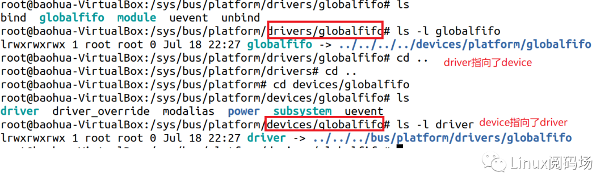

	1.通过/sys/bus/platform/drivers目录下的driver信息,可以查看到某driver指向的device;
	2.通过/sys/bus/platform/devices目录下的device信息,可以查看到某device指向的driver.

##### 12.4.2.2 device与driver手动unbind和bind

写一个第三者driver,名字叫做globalxxx.然后我们想把globalfifo device的driver指定为globalxxx.因此我们要完成2步:

	1.unbind:解除globalfifo driver与globalfifo device的绑定;
	2.bind:进行globalxxx driver与globalfifo device的绑定.

手动bind和unbind的方法:

切到/sys/bus/platform/drivers/globalfifo目录,把设备globalfifo的名字写进去unbind文件即可完成unbind,将名字写入bind即可完成bind.

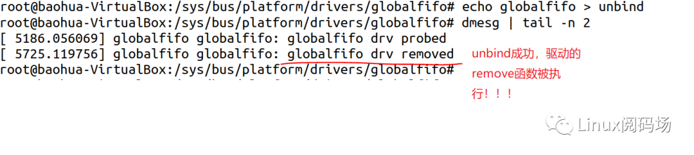

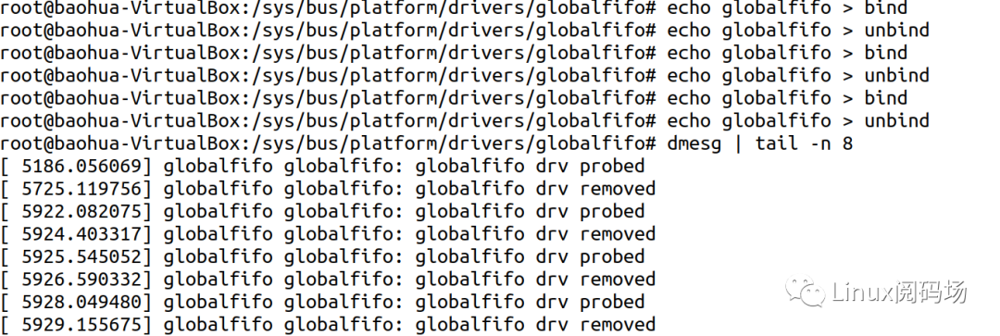

	echo globalfifo > /sys/bus/platform/drivers/globalfifo/unbind
	/*
		通过: ls -l /sys/bus/platform/devices/globalfifo/drivers可以找到globalfifo这个设备对应的
		driver路劲,将globalfifo写入到对应的driver的unbind文件中,就会执行驱动的remove函数.
	*/
	echo globalfifo > /sys/bus/platform/drivers/globalfifo/bind
	/*
		将设备名字写入到globalfifo驱动的bind文件中,就会调用platform_match函数,进行驱动和设备名字的
		匹配,匹配成功后会执行驱动的probe函数.
	*/

##### 12.4.2.3 第三者的bind/unbind方法

1.写一个第三者的platform_driver模块,如下:

	static struct platform_driver globalxxx_driver = {
	  .driver = {
	      .name = "globalxxx",	/* 此处名字与globalfifo_dev的不一样,但是仍然可以bind/unbind */
	      .owner = THIS_MODULE,
	  },
	  .probe = globalxxx_probe,  
	  .remove = globalxxx_remove,
	};
	module_platform_driver(globalxxx_driver);

2.bind/unbind方法

	1.unbind操作
	echo globalfifo > /sys/bus/platform/drivers/globalfifo/unbind
	2.将globalxxx的名字写入到globalfifo这个device的driver_override中
	echo globalxxx > /sys/bus/platform/devices/globalfifo/driver_override
	3.将globalfifo设备与globalxxx驱动进行匹配.globalfifo设备中的名字为driver_override中的字段
	echo globalfifo > /sys/bus/platform/drivers/globalxxx/bind

3.上述的匹配原则为

	if (pdev->driver_override)
	    return !strcmp(pdev->driver_override, drv->name);
	PS:pdev为globalfifo; pdev->driver_override为"globalxxx"; drv->name为"globalxxx"

#### 12.4.3 实例---将dma_map_benchmark驱动绑定到某设备上

##### 12.4.3.1 编译dma_map_benchmark驱动

dma_map_benchmark是用于测试iommu/smmu map/unmap的性能的,在linux-5.10之后的版本已经存在.

```
1.驱动所在目录:
	./kernel/dma/map_benchmark.c
2.驱动编译进内核方法:
	make menuconfig--->搜索"DMA_MAP_BENCHMARK"即可找到--->跳转到对应位置,打开即可.
3.编译内核
```

##### 12.4.3.2 编译dma_map_benchmark应用程序

dma_map_benchmark应用程序用于测试dma_map_benchmark驱动(两者名字相同).

```
1.应用程序所在目录:
	./tools/testing/selftests/dma
2.直接在上述目录执行:
	make	//即可编译出dma_map_benchmark应用程序
```

##### 12.4.3.3 将dma_map_benchmark驱动绑定到gpio-keys的设备上

1.解除bind

	echo gpio-keys > /sys/bus/platform/drivers/gpio-keys/unbind

2.将新驱动的名字写入需要绑定设备的override中

	echo dma_map_benchmark > /sys/bus/platform/devices/gpio-keys/driver_override

3.将需要绑定的设备(设备节点)echo到新驱动的bind中完成新的bind

	echo gpio-keys > /sys/bus/platform/drivers/dma_map_benchmark/bind

##### 12.4.3.4 将dma_map_benchmark驱动绑定到pci的设备上

1.lspci

	查看当前系统拥有的pci设备(显示为bridge的不能绑定,挑选非桥的pci设备)

2.查看pci device对应的driver

	ls -l /sys/bus/pci/devices/0000\:00\:02.0/driver	//找到该device对应的driver

3.解除绑定

	echo 0000:00:02.0 > /sys/bus/pci/drivers/cirrus/unbind

4.将新驱动的名字写入需要绑定设备的override中

	echo dma_map_benchmark > /sys/bus/pci/devices/0000\:00\:02.0/driver_override

5.将需要绑定的设备(设备节点)echo到新驱动的bind中完成新的bind

	echo 0000:00:02.0 > /sys/bus/pci/drivers/dma_map_benchmark/bind

***

##### 12.4.3.5 运行dma_map_benchmark应用程序

```
./dma_map_benchmark -t 1 -s 1 -n 0
```


## Chapter 15 Linux I2C核心、总线与设备驱动

I2C总线使用SCL、SDA两根信号线实现设备之间的数据交互,极大的简化了对硬件资源和PCB板布线空间的占用.

I2C总线主要应用于EEPROM、实时时钟、小型LCD等设备与CPU的接口中.

	在linux系统中,I2C驱动的体系结构:I2C核心、I2C总线驱动和I2C设备驱动.

***
## Chapter 18 ARM linux设备树

### 18.1 ARM设备树起源

在linux 2.6中,ARM架构的板级硬件细节过多地被硬编码在arch/arm/plat-xxx和arm/arm/mach-xxx中.采用设备树后,许多硬件的细节直接通过设备树传递给linux,不需要在内核中进行大量的冗余编码.

设备数由一系列被命名的节点(Node)和属性(Property)组成.

设备树可以理解为画一棵电路板上CPU、总线、设备组成的树,Bootloader会将这棵树传递给内核.内核会识别并利用这棵树所包含的资源.

### 18.2 设备树的组成和结构

**1.DTS**

DTS:Device Tree Source,是一种ASCII文本格式的设备树描述.一个dts文件对应一个ARM的设备,标准是放置在"arch/arm/boot/dts"目录.Ali的是放置在一个专门的dts文件目录下.

dtsi:Soc公用的部分或者多个设备共同使用的部分写成".dtsi",类似于C的头文件.包含某个dtsi可以:

	// Method 1
	/include/ "vexpress-v2m.dtsi"
	// Method 2	---更为常用
	#include "as.dtsi"	---和C语言include头文件一致

设备树结构模版

	/ {		/*root节点*/
		node1 {		/*root节点下的子节点"node1"*/
			a-string-property = "A string";	/*字符串属性*/
			a-string-list-property = "first string", "second string";	/*字符串数组属性*/
			a-byte-data-property = [0x01 0x23 0x34 0x56];	/*二进制属性*/
			child-node1 {	/*node1节点下的子节点"child-node1"*/
				first-child-property;	/*空属性*/
				second-child-property = <1>;		/*Cells属性,由u32整数组成*/
				a-string-property = "Hello, world";
			};
			child-node2 {
			};
		};
		node2 {		/*root节点下的子节点"node2"*/
			an-empty-property;	/*空属性*/
			a-cell-property = <1 2 3 4>;		/*1,2,3,4都是u32整数*/
			child-node1 {
			};
		};
	};

实例

	/ {
		compatible = "acme, coyotes-revenge";	/*根节点兼容属性,通过它可以判断启动的是什么设备.*/
		#address-cells = <1>;	/*表示这一层结构下的地址address为一个32 bit的无符号整型,对应于reg<address ...>*/
		#size-cells = <1>;		/*表示这一层结构下的长度length为一个32 bit的无符号整型,对应于reg<... length>*/
		interrupt-parent = <&intc>;
	
		cpus {	/*cpu node*/
			#address-cells = <1>;	/*cpu@0中的"reg<0>",地址为0为一个32 bit的无符号整数*/
			#size-cells = <0>;		/*cpu@0中的"reg<0>",此处"#size-cell = <0>",因此不带长度*/
			cpu@0 {	/*"name@address":name=cpu,address:0*/	/*name可以相同,但是address必须不一样.*/
				compatible = "arm, cortex-a9";
				reg = <0>
			};
			cpu@1 {	/*"name@address":name=cpu,address:1*/
				compatible = "arm, cortex-a9";
				reg = <1>
			};
		};
	
		serial@101f1000 {	/*"name@address":name=serial,address:101f1000*/
			compatible = "arm, p1011";
			reg = <0x101f1000 0x1000>;	/*起始地址(address):0x101f1000,大小(length)为0x1000*/
			interrupts = <1 0>;
		};
	
		serial@101f2000 {	/*"name@address":name=serial,address:101f2000*/
			compatible = "arm, p1011";
			reg = <0x101f2000 0x1000>;	/*起始地址:0x101f2000,大小为0x1000*/
			interrupts = <2 0>;
		};
	
		gpio@101f3000 {	/*"name@address":name=gpio,address:101f3000*/
			compatible = "arm, p1061";
			reg = <0x101f3000 0x1000
				   0x101f4000 0x0010>;
			interrupts = <3 0>;
		};
	
		intc: interrupt-controller@10140000 {	/*"name@address":name=interrupt-controller,address:10140000
												intc:为label,在驱动中可以通过"@intc"即"@label"来引用.*/
			compatible = "arm, p1190";
			reg = <0x10140000 0x1000>;
			interrupt-controller;
			#interrupt-cells = <2>;
		};
	
		spi@10115000 {	/*"name@address":name=spi,address:10115000*/
			compatible = "arm, p1022";
			reg = <0x10115000 0x1000>;
			interrupts = <4 0>;
		};
	
		external-bus {	/*外部总线节点*/
			#address-cells = <2>;	
			/*表示这一层结构下的地址address为两个32 bit的无符号整型,对应于reg<address1 address2 ...>*/
			#size-cells = <1>;	/*表示这一层结构下的长度length为一个32 bit的无符号整型,对应于reg<... length>*/
			ranges = <0 0 0x10100000 0x10000	//Chipselect 1, Ethernet
					/*external-bus这一层的address<0 0>转换到CPU内存映射的"reg<0x10100000 0x10000>"*/
					  1 0 0x10160000 0x10000	//Chipselect 2, i2c controller
					/*external-bus这一层的address<1 0>转换到CPU内存映射的"reg<0x10160000 0x10000>"*/
					  2 0 0x30000000 0x1000000>;//Chipselect 3, Nor Flash
	
			ethernet@0,0 {	/*"name@address":name=ethernet,address:0*/
				compatible = "smc, smc91c111";
				reg = <0 0 0x1000>;	/*address1:0(片选); address2:0(基地址); length:0x1000*/
				interrupts = <5 2>;					
			};
			
			i2c@1, 0 {	/*"name@address":name=i2c,address:1*/
				compatible = "acme, a1234-i2c-bus";
				#address-cells = <1>;
				#size-cells = <0>;
				reg = <1 0 0x1000>;
				interrupts = <6 2>;
				rtc@58 {
					compatible = "maxim, ds1338";
					reg = <58>;
					interrupts = <7 3>;
				};
			};
	
			flash@2, 0 {	/*"name@address":name=flash,address:2*/
				compatible = "samsung, k8f1315ebm", "cfi-flash";
				reg = <2 0 0x4000000>;	/*64MB*/
			};
		};
	};

**2.DTC**

DTC:Device Tree Compiler,将".dts"编译成".dtb"的工具.DTC的源代码位于内核"scripts/dtc"目录中,在linux内核使能设备树的情况下,工具"DTC"就会被编译出来,对应于"script/dts/Makefile"中的"hostprogs-y := dtc"这一hostprogs目标.

**3.DTB**

DTB:Device Tree Blob,是".dts"被DTC编译后设备树描述的二进制格式,可由linux内核或者u-boot这样的Bootloader解析.

通常Nand/SD启动映像,".dtb"文件会有一个单独的区域存放,Bootloader引导内核时会先读取该处的".dtb"文件到内存.

**根节点兼容属性**

	/ {
		compatible = "manufacturer(制造商), model(型号)";		/*通过其可以知道启动的是什么设备*/
	};
	
	// e.g.
	/ {
		compatible = "alitech, 3922";	/*alitech corp, 3922芯片*/
	};
	
	// driver中判断目前运行的板子或者SoC的兼容性的API:
	if(of_machine_is_compatible("alitech, 3921"))	/*para:根节点compatible中的字符串.*/

**设备节点兼容性**

dts中设备节点的兼容性用于驱动和设备的绑定.

	/ {
		compatible = "ali, 3735";
		...
		see_bus@0 {	/*see总线*/
			compatible = "alitech, see-bus", "simple-bus";	/*see bus驱动和see bus的device绑定.
													后一个表征可兼容其他的简单bus*/
			...
			DSC@0 {
				compatible = "alitech, dsc";	/*用于dsc设备和驱动绑定*/
				reg = <0>;
				dev-index = <0>;
			};
		};
	};

驱动中需要与".dts"中描述的设备节点进行匹配,进而使驱动的probe()函数执行.

	static const struct of_device_id see_dsc_matchtbl[] = {	/*device挂在see bus这条总线上*/
		{ .compatible = "alitech,dsc"},	/*与dts中的需要匹配*/
		{ },
	};
	
	static struct see_client_driver dsc_drv = {
		.probe = ca_dsc_probe,
		.remove = ca_dsc_remove,
		.driver = {
			.name = "DSC",
			.of_match_table = see_dsc_matchtbl,	/*匹配上面的table*/
			.pm = &dsc_drv_pm_ops,	/*???*/
		},
	};
***


## Chapter 22 driver开发实践

## 1. Test driver development

### 1. 头文件介绍

	#include <linux/module.h>	//用于MODULE_LICENSE/AUTHOR/DESCRIPTION/VERSION等
	#include <linux/init.h>		//用于module_init/exit
	#include <linux/errno.h>	//用于错误处理
	#include <linux/kernel.h>	//用于printk
	#include <linux/cdev.h>		//用于cdev函数
	#include <linux/fs.h>		//用于struct file_operations
	#include <linux/uaccess.h>	//用于copy_from/to_user
	#include <linux/slab.h>		//用于kmalloc,devm_kzalloc
	#include <linux/gfp.h>		//用于alloc_pages函数
	#include <linux/mm.h>		//用于内存管理
	#include <linux/device.h>	//包括device、class等结构体定义
	#include <linux/sched.h>	//用于kernel的线程、进程处理
	#include <linux/kthread.h>	//用于kernel的线程处理
	#include <linux/delay.h>	//用于sleep处理
	#include <linux/types.h>	//包括size_t等各种typedef数据类型
	#include <linux/interrupt.h>	//包括enable_irq、free_irq等函数
	#include <linux/poll.h>		//包括poll_wait(将当前进程加入到等待队列、阻塞)函数
	#include <linux/io.h>		//包括ioremap、iowrite32、ioread32等函数
	#include <linux/semaphore.h>	//信号量
	#include <linux/spinlock.h>	//自旋锁
	#include <linux/idr.h>		//进程间通信
	#include <linux/of.h>		//和linux/of_platform一起使用
	#include <linux/of_platform.h>	//包括platform总线相关的函数
	#include <linux/time.h>		//包括C标准时间
	#include <linux/highmem.h>	//file_operations中需要用内存,必须有
	#include <linux/dma-mappint.h>	//与dma相关
	#include <linux/err.h>		//错误处理
	
	/**********************一般包括的头文件*********************/
	#include <linux/slab.h>
	#include <linux/of_platform.h>
	#include <linux/module.h>
	#include <linux/highmem.h>
	#include <linux/types.h>
	#include <linux/cdev.h>
	#include <linux/device.h>
	#include <linux/err.h>
	#include <linux/idr.h>
	#include <linux/kernel.h>

### 2. platform driver框架

#### 2.1 test_priv.h---用于定义驱动中使用的结构体或变量等

	#ifndef __TEST_PRIV_H__
	#define __TEST_PRIV_H__
	
	/*xxx_priv.h用于定义驱动中使用的结构体或变量等*/
	#include <linux/ioctl.h>
	#include <linux/types.h>
	#include <linux/kernel.h>
	#include <linux/idr.h>
	#include <linux/cdev.h>
	#include <linux/sysfs.h>
	
	/*
	* Device structure		//自定义设备结构体
	*/
	struct test_dev {
		dev_t devt;				//设备号
		struct device *dev;		//描述linux下的device的结构体
		struct cdev;			//字符设备的结构体
	};
	
	/*
	* Session structure 	//Session的结构体
	*/
	struct test_session {
		struct test_dev *test;
		unsigned int ree_memory_basic;	//addr_select = 1
		unsigned int tee_memory_basic;	//addr_select = 2
		unsigned int see_memory_basic;	//addr_select = 3
	};
	
	#define TEST_BASE_ADDR	0x18034000		//IO空间的基址(属于寄存器的物理地址,在读取前需要ioremap成虚拟地址再进行读取)
	
	#endif

#### 2.2 test.h---用于定义使用driver时用到的数据结构(e.g.设备节点位置,ioctl,调用时需要的填充的结构体)

	#ifndef __TEST_H__
	#define __TEST_H__
	
	#include <linux/ioctl.h>
	
	/*!< TEST driver name.*/
	#define TEST_DRVNAME "xxx_test"	//driver name只会在class_create(THIS_MODULE, TEST_DRVNAME);会使用,
									//其他地方都不使用,用于创建一个device class
	/*!< TEST device name*/
	#define TEST_DEVNAME "defy_test"	//device name在probe及其他地方都是用这个，
										//而且这个也会显示在/dev/defy_test.
	/*!< TEST ioctl CMD base*/
	#define TEST_BASE 0xd1			//ioctl cmd base.幻数(type), 8 bit(0~0xff).
	//根据./Documentation/ioctl/ioctl-number.txt选择,避免与已经使用的冲突*/
	
	/*
	* ioctl list
	*/
	#define TEST_TEE_RANGE_CHECK		_IOW(TEST_BASE, 1, int /*base_addr*/)
	/*_IOW宏:构成ioctl命令
		para1:ioctl cmd base---定义的时候不能和其他的有重叠
		para2:序列号,一般从1开始增加
		para3:数据类型字段.表示调用该ioctl穿进来的arg的参数类型
	*/
	#define TEST_READ_DEVICE(e.g.DSC)_CHECK			_IOW(TEST_BASE, 2, int /*存放读取得到的某个设备的寄存器值*/)
	#endif

#### 2.3 test_ioctl.h---主要用于定义ioctl函数(将ioctl的操作与其他分开)

	#ifndef __TEST_IOCTL_H__
	#define __TEST_IOCTL_H__
		
	long test_ioctl(struct file *file, unsigned int cmd, unsigned long arg);
	
	#endif

#### 2.4 test_core.c---用于实现驱动的主体结构(probe/remove/read/write等,不包括ioctl)

	#include <linux/slab.h>
	#include <linux/of_platform.h>
	#include <linux/module.h>
	#include <linux/highmem.h>
	#include <linux/types.h>
	#include <linux/cdev.h>
	#include <linux/device.h>
	#include <linux/err.h>
	#include <linux/idr.h>
	#include <linux/kernel.h>
	
	#include "test_priv.h"
	#include "test.h"
	#include "test_ioctl.h"
	
	#define TEST_VERSION "0.0.1"
	#define NO_CHRDEVS	(1)		//表示没有child device
	#define FIRST_MIN	(0)		//次设备号从0开始
	
	static struct class *g_test_class = NULL;	//存放设备类,全局指针

**file_opeations相关函数**

	static int test_open(struct inode *inode, struct file *file)
	{
		int ret = -1;
		struct test_dev *test = 
			container_of(inode->i_cdev, struct test_dev, cdev);
		/*
		para1:inode->i_cdev(表明是字符设备),结构体成员的指针;---不变
		para2:设备结构体(表明具体是哪个字符设备);---自己定义的设备结构体
		para3:cdev(为inode->i_cdev结构体成员的类型).通过结构体成员的指针获得设备结构体的指针---不变
		*/
	
		struct test_session *s = NULL;
		
		s = devm_kzalloc(test->dev, sizeof(struct test_sesion), GFP_KERNEL);
		/*
			devm_kzalloc是与设备(device)相关的内核内存分配函数,一般自定义的设备结构体会带有一个struct device *dev指针.
			其优点是:当device被detached或driver被卸载(uploaded)时,内存会被自动释放.可以使用devm_kfree释放.
			
			para1:申请内存的目标设备.常为设备结构体或者struct platform_device结构体下的struct device *dev成员.
			para2:申请内存大小.一般为sizeof(自定义设备结构体或者自定义的其他结构体(该结构体常有一个自定义设备结构体的指针))
			para3:申请内存的类型标志.kernel中使用GFP_KERNEL
		*/
		if (!s) {
			ret = -ENOMEM;	//没有足够的内存
			return ret;
		}
	
		memset(s, 0, sizeof(struct test_session));
		s->test = test;	//指定父设备
		file->private_data = (void *)s;	//将s赋给file->private_data并回传出去,便于s这一个数据在write/read/ioctl中传输
		return 0;
	}
	
	static int test_release(struct inode *inode, struct file *file)
	{
		struct test_dev *test = NULL;
		struct test_session *s= NULL;
		int ret = 0;
	
		s = file->private_data;		//得到file下的private_data数据(此前在open时填充进去的)
		if (!s) {
			ret = -EBADF;	//bad file number,其值为9
			return ret;
		}
		test = s->test;	//因为自定义的其他结构体含有自定义设备结构体指针(相当于取得父指针),
						//直接取了赋值给自定义设备结构体后可以透过自定义设备结构体的struct device成员去释放分配的内存
		
		file->private_data = NULL;	//将file->private_data指针置空
		devm_kfree(test->dev, s);	//释放devm_kzalloc分配的内存
		/*
		para1:一般为自定义结构体下的struct device *dev成员
		para2:由devm_kzalloc返回的指针.一般为自定义结构体分配得到的指针和自定义设备结构体分配得到的指针.
		*/
		return 0;
	}
	
	static ssize_t test_read(struct file *file, char __user *buf, size_t count, loff_t *f_pos)
	{
		struct test_session *s = file->private_data;		//得到file下的private_data数据(此前在open时填充进去的)
		int ret = 0;
	
		if (s->write_mem_flag == 1)
		{
			ret = copy_to_user(buf, &s->tee_mem_base_addr, count);
			/*
			copy_to_user:将数据从内核空间拷贝到用户空间
				para1:用户空间buf
				para2:内核空间需要拷贝的数据
				para3:由用户空间传进来的需要拷贝的字节数
			*/
		}
		/*...其他操作...*/
		return ret;
	}
	
	static ssize_t test_write(struct file *file, const char __user *buf, size_t count, loff_t *pos)
	{
		struct test_session *s = file->private_data;
		int ret = 0;
		
		/*
			copy_from_user(void *dest, buf, count);	//从用户空间将数据拷贝到内核空间
			para1:内核空间的buf
			para2:用于空间传过来的const char __user *buf
			para3:由用户空间传进来需要拷贝的字节数	
		*/
	}
	
	/*mmap:建立内核空间到用户空间(即进程)的虚拟地址空间的映射(即内核内存到用户内存的映射).映射成功后,
	用户对这段内存的操作直接反应到内核空间(内核内存),同样内核空间对这段内存的操作也直接反应到用户空间*/
	static int test_mmap(struct file *file, struct vma_area_struct *vma)
	{
		/*struct vma_area_struct:内核空间中描述用户空间buf的结构体,
			用户空间buf信息会通过系统自动保存到struct vma_area_struct结构体*/
		int ret = -1;
		struct test_session *s = file->private_data;
		size_t size = vma->vm_end - vma_start;	//用户空间映射buf的大小
		
		size = (size >= PAGE_SIZE) ? size : PAGE_SIZE;	//最小一个page(4k),最大到size
	
		if (s->write_mem_flag == 1)	//tee memory
		{
			ret = remap_pfn_range(vma, vma->start, s->tee_mem_base_addr >> PAGE_SHIFT,
				 size, pgprot_nocached(PAGE_SHARED));	//如果写driver,还需要调整mmap的code,这段code有点问题
			if (ret)
				return -EAGAIN;
		}
		return 0;
	}	//mmap这段code有点问题,映射有点不成功
	
	static const struct file_opeations test_fops = {
		.owner		= THIS_MODULE,
		.open		= test_open,
		.read		= test_read,
		.write		= test_write,
		.mmap		= test_mmap,
		release		= test_release,
		unlocked_ioctl	= test_ioctl,
	};

**probe & remove函数**

	static int test_probe(struct platform_device *pdev)	//para为struct platform_device *pdev
	{
		struct device *dev = &pdev->dev;		//得到pdev下面的device信息
		struct test_dev *test;	//自定义设备结构体对象
		int ret = -1;
	
		/*1. 分配设备使用的内存*/
		test = devm_kzalloc(dev, sizeof(struct test_dev), GFP_KERNEL);	//给设备结构体分配内存
		/*
			devm_kzalloc是与设备(device)相关的内核内存分配函数,一般自定义的设备结构体会带有一个struct device *dev指针.
			其优点是:当device被detached或driver被卸载(uploaded)时,内存会被自动释放.可以使用devm_kfree释放.
			
			para1:申请内存的目标设备.常为设备结构体或者struct platform_device结构体下的struct device *dev成员.
			para2:申请内存大小.一般为sizeof(自定义设备结构体或者自定义的其他结构体(该结构体常有一个自定义设备结构体的指针))
			para3:申请内存的类型标志.kernel中使用GFP_KERNEL
		*/
		if (!test)
			return -ENOMEM;		//没有内存
		
		/*2. 申请设备号*/
		ret = of_get_major_minor(pdev->dev.of_node, &test->devt, FIRST_MIN, NO_CHRDEVS, TEST_DEVNAME);
		//得到分配的设备号
		/*
			para1:设备节点.一般为pdev->dev.of_node---得到设备节点
			para2:存放设备号."&test->devt"存放分配的设备号
			para3:次设备号从0开始.一般使用一个宏定义为0即可
			para4:设备数量.一般使用一个宏定义为1即可
			para5:设备名
			retval:成功返回0;出错返回<0
		*/
		if (ret < 0)
			goto chrdev_alloc_fail;		//分配设备号失败
	
		/*3. 字符设备初始化*/
		cdev_init(&test->cdev, &test_fops);	//字符设备与struct file_opeations绑定
		/*
			para1:struct cdev.一般为自定义设备结构体下面的cdev结构体地址
			para2:struct file_operations结构体对象
		*/
	
		/**4. 添加一个字符设备/
		ret = cdev_add(&test->cdev, test->devt, 1);	//添加一个字符设备
		/*
			para1:struct cdev.一般为自定义设备结构体下面的cdev结构体地址
			para2:设备号.
			para3:设备数量.一般为1即可
			retval:成功返回0;出错返回<0
		*/
		if (ret < 0)
			goto cdev_add_fail;
	
		test->dev = device_create(g_test_class, dev, test->devt, test, 
					"%s%d", TEST_DEVNAME, MINOR(test->devt));		
		/*
			//为自定义设备结构体下的成员创建设备
			para1:设备类指针
			para2:父设备.一般为platform_device下的device
			para3:设备号
			para4:设备数据.为自定义设备结构体对象即可
			para5:/dev/xxx下面的设备节点名.(const char *fmt),因此可以---"%s%d", TEST_DEVNAME, MINOR(test->devt).
					此时会在/dev/xxx0---即后面会多一个数字0.去掉方法:("%s", TEST_DEVNAME),即后面不需要带%d这个次设备号.
			retval:device指针(设备指针)
		*/
		
		if (IS_ERR(test->dev)) {		//IS_ERR:判断返回的指针是错误信息(返回非0)还是实际地址(返回0).即指针是否落在最后一页
			ret = PTR_ERR(test->dev);	//PTR_ERR将指针转为错误号返回
			goto device_create_fail;
		}
	
		platform_set_drvdata(pdev, test);	//将自定义设备结构体对象设为platform的driver数据.
			//后面在remove中可以拿到该设备结构体对象
	
		dev_info(dev, "[%s: %d] probe version %s succeed!\n", __func__, __LINE__, TEST_VERSION);
		return 0;
	
		/*返回值错误处理*/
		device_create_fail:
			cdev_del(&test->cdev);	//删除掉一个字符设备
		cdev_add_fail:
			unregister_chrdev_region(test->devt, NO_CHRDEVS);	//取消分配的设备号
			/*
				para1:设备号; para2:设备数量
			*/
		chrdev_allo_fail:
			devm_free(dev, test);	//释放devm_kzallo分配的内存
			return ret;
	}
	
	static int test_remove(struct platform_device *pdev)
	{
		struct device *dev = &pdev->dev;
		struct test_dev *test = platform_get_drvdata(pdev);	
			//得到probe时挂载platform下的driver数据
	
		if (!test)
			return -ENODEV;		//表示没有设备结构体对象
	
		platform_set_drvdata(pdev, NULL);	//将platform的driver data设为0
		
		/*注销设备*/
		device_destroy(g_test_class, test->devt);
		/*
			para1:设备类;	para2:设备号
		*/
		
		/*删除一个字符设备*/
		cdev_del(&test->cdev);
		
		/*注销设备号*/
		unregister_chrdev_region(test->devt, NO_CHRDEVS);
	
		/*释放分配的内存*/
		devm_free(dev, test);
	
		dev_info(dev, "[%s: %d] remove version %s succeed!\n", __func__, __LINE__, TEST_VERSION);
		return 0;
	}
	
	static void platform_test_release(struct device *dev)	//该函数必须要有.para为"struct device *dev"
	{
		return;		//可以没有任何的实现,但必须有
	}
	
	static struct platform_driver test_drv = {	//platform_driver的对象
		.probe = test_probe,	//在init时调用probe进行driver的一系列注册
		.remove = test_remove,	//在exit时调用remote进行driver的释放
		.driver = {
			.name = TEST_DRVNAME,	//driver name
			.owner = THIS_MODULE
		}
	};
	
	static struct platform_device test_device = {	//platform_device的对象
		.name = TEST_DEVNAME,	//与driver name相同
		.id = 0,				//生成的driver name会带上一个id.即:"TEST_DRVNAME.0"->"xxx_test.0"
		.dev = {
			.release = platform_test_release,	//一定需要有这个release函数指针,不然会报错
		}
	};
	
	static int __init test_init(void)
	{
		int ret;
		
		ret = platform_device_register(&test_device);	//先注册device
		if (ret) {
			TEST_PRINTK("Register Test device failed!\n");
			return -ENODEV;		//No such device,其值为19.
		}
	
		g_test_class = class_create(THIS_MODULE, TEST_DRVNAME);		//创建一个设备类,para2为driver name
		if (IS_ERR(g_test_class))	//IS_ERR:判断返回的指针是错误信息(返回非0)还是实际地址(返回0).
		{							//即指针是否落在最后一页
			return PTR_ERR(g_test_class);	//PTR_ERR将指针转为错误号返回
		}
	
		ret = platform_driver_register(&test_drv);	//再注册driver
		if (ret) {
			platform_device_unregister(&test_device);	//取消注册device
			return -ENODEV;
		}
	
		TEST_PRINTK("Test driver init succeed!\n");
		return 0;
	}
	
	static void __exit test_exit(void)
	{
		platform_driver_unregister(&test_drv);		//取消注册driver
		platform_device_unregister(&test_device);	//取消注册device
		class_destory(g_test_class);	//销毁创建的类
		TEST_PRINTK("Test driver exit succeed!\n");
	}
	
	module_init(test_init);
	moudule_exit(test_exit);
	
	MODULE_AUTHOR("xxx Corporation");
	MODULE_DESCRIPTION("xxx Test Core");
	MODULE_LICENSE("GPL v2");
	MODULE_VERSION();

#### 2.5 test_ioctl.c---用于实现驱动的ioctl函数

	#include <linux/slab.h>
	#include <linux/of_platform.h>
	#include <linux/module.h>
	#include <linux/highmem.h>
	#include <linux/types.h>
	#include <linux/cdev.h>
	#include <linux/device.h>
	#include <linux/err.h>
	#include <linux/idr.h>
	#include <linux/kernel.h>
	#include "test_priv.h"
	#include "test.h"
	#include <test_ioctl.h>
	
	static unsigned int test_read_register(unsigned int base_addr, unsigned int offset)
	{
		unsigned int value = ioread32((void *)base_addr + offset);
		/*
			ioread32:读取IO虚拟空间中某个寄存器的值
			para:一般为IO物理空间基址映射得到虚拟空间的基址 + 寄存器的偏移值
			retval:读到的寄存器的值
		*/
		return value;
	}
	
	long test_ioctl(struct file *file, unsigned int cmd, unsigned long args)
	{
		int ret = -1;
		struct test_session *s = file->private_data;
		int check_select = 0;
		__maybe_unused struct device_node *node = NULL;
		/*
			__maybe_unused:声明可能是不会使用的变量
			struct device_node *node:用于保存分析dts(.dtsi文件)得到的节点信息
		*/
		__maybe_unused u32 tee_mem_base_addr = 0;
		__maybe_unused u32 tee_mem_range = 0;
		/*...其他的变量定义...*/
		unsigned int virt_base_addr = 0;	//存放IO空间地址(IO寄存器,相当于物理地址)重新映射得到的虚拟地址
		
		if (!s)
			return -EBADF;	/*bad file number*/
		
		ret = copy_from_user(&check_select, (void __user *)args, sizeof(int));
		/*args:用户空间调用ioctl传的是一个指针*/
		if (ret)
			return ret;
		
		switch(cmd)	{	/*使用switch...case来区分不同的cmd*/
		case TEST_TEE_RANGE_CHECK:
		{
			s->tee_mem_range = (u32)test_get_range_rpc(check_select);	/*rpc到see得到tee range*/
	
			/*parser dts*/
			node = of_find_compatible_node(NULL, NULL, "xxxtech,memory-partition");
			/*
			of_find_compatible_node:在dts中寻找和para3匹配的节点信息
			para1:一般为NULL即可;		para2:一般为NULL即可.
			para3:dtsi文件中的匹配字符
			retval:成功返回设备节点指针(struct device_node *node);失败返回NULL.
			e.g.----dtsi文件(即dts文件)
				/{
					#address-cells = <1>;
					#size-cells = <1>;
					memory-partition{
						compatible = "xxxtech,memory-partition";		//匹配字符
						tee_area = <0x80000000 0x2900000>;	//表示tee的area大小
						...
					};
				};
			*/
			if (IS_ERR(node)) {	//节点为NULL时
				pr_info("xxxtech,memory-partition node is NULL!\n");
				return PTR_ERR(node);
			}
	
			of_property_read_u32_index(node, "tee_area", 0, (u32 *)&tee_mem_base_addr);
			/*
				of_property_read_u32_index:寻找节点(para1)下的与属性(para2)匹配的信息.
				para1:需要寻找的节点,由of_find_compatible_node返回得到
				para2:需要查找节点下的属性;	para3:取查找的属性的第0/1个值
				para4:查找到的属性值应该保存到的变量
				此处即为:
				将dtsi文件中的(tee_area = <0x80000000 0x2900000>)第0个属性0x80000000保存到tee_mem_base_addr中
			*/
			of_property_read_u32_index(node, "tee_area", 1, (u32 *)&tee_mem_range);
			/*
				此处为:
				将dtsi中的(tee_area = <0x80000000 0x2900000>)第1个属性0x2900000保存到tee_mem_range中
			*/
	
			if (s->tee_mem_range == tee_mem_range)
			{
				s->tee_mem_base_addr = tee_mem_base_addr;
				s->write_mem_flag = 1;
			}
			break;
		}
		case TEST_READ_DEVICE(e.g.DSC)_CHECK:
		{
			unsigned int value = 0;
			virt_base_addr = (unsigned int)ioremap(TEST_BASE_ADDR, 0x10);
			/*
				ioremap:将IO空间物理地址信息映射成虚拟地址,以便能够操作寄存器(读取/写入)
				para1:寄存器基址(相当于物理地址),IO空间中
				para2:需要重新映射的空间大小,一般为IP的SRAM的大小.
				retval:映射到虚拟空间的起始地址
				PS:对于某个IP而言,只能通过寄存器去操作IP(读取IP的SRAM的值或者其他行为),IP内部的SRAM的值不能直接操作.
			*/
			value = test_read_register(virt_base_addr, 0);
			ret = copy_to_user((void *)args, &value, sizeof(unsigned int));	//拷贝给应用程序
			if (ret)
				return ret;
			break;
		}
		/*其他的case语句*/
		default:
			break;
		}
	}

### 3. RPC框架添加

	在see端:
		1.在hld下建立一个存放源文件目录---e.g.secfeature,其中有secfeature.c secfeature.h secfeature_remote.c
			其中secfeature_remote.c中的关键代码:
				static UINT32 hld_sec_feature_entry[] = 
				{
					(UINT32)sec_feature_get_range,
					(UINT32)sec_feature_dram_check,
					(UINT32)sec_feature_integrity_check_test,
					(UINT32)sec_feature_see_executable_range_check,	//发起rpc调用时see对应的函数
				};
	
				void hld_sec_feature_callee(UINT8 *msg)		//该名字有讲究,在rpc注册中的需要对应
				{
					if (NULL == msg)
						return;
					os_hld_callee((UINT32)hld_sec_feature_entry, msg);	
					//hld_sec_feature_entry,rpc的入口点,与上面的代码对应
				}
		2.在hld目录中建立一个Makefile,可以参考casi.修改其中的:
			# Module Name	
			MOD = HLD_SEC_FEATURE	该模块名是rpc中名字的大写
		3.在alisee.../see/src/下的makefile中,添加对secfeature目录的编译:
			HLD_SEC_FEATURE :
				cd hld/secfeature; \
				$(MAKE)
		
			HLD_SEC_FEATURE_ :
				cd hld/secfeature; \
				$(MAKE) clean
		
			HLD_SEC_FEATURE__ :
				cd hld/secfeature; \
				$(MAKE) ddk_rel
		//添加成功后,编译会出现对应源文件的*.o文件以及一个HLD_SEC_FEATURE.mk
		4.添加会rpc的注册:
			在alisee.../see/src/see/m36f/Makefile.cmd中:
			查找casi的注册,像casi一样将HLD_SEC_FEATURE注册进去即完成see这边rpc的注册.
	
	在ree端:
		在./driver/alidriver/include/linux/ali_rpc.h添加ree端的rpc.
			在enum REMOTE_MODULES{};中,在和see那边相同位置:
			(其位置可以查看./alisee.../see/src/see/m36f/modules_see.c中查找hld_sec_feature_callee在g_remote_callee
			的位置.该位置)
			添加HLD_SEC_FEATURE_MODULE(注意大写,和其他模块保持和一致),此刻完成了ree这边rpc的注册.		

## 2. GPIO driver development

### 2.1 linux的GPIO子系统

linux的gpio子系统帮助我们管理整个系统gpio的使用情况,同时通过sysfs系统文件导出了调试信息和应用层控制接口.各个板卡实现自己的gpio_chip控制模块(e.g.request,free,input,output...等).然后linux系统会将控制模块注册到内核中,这时会改变全局的gpio数组(gpio_desc[]).当用户请求gpio时,就会到该数组中匹配,匹配成功会调用gpio_chip的相关的处理函数.

**1.struct gpio_desc---不知道位于哪里,没找到.**

	struct gpio_desc {
		struct gpio_chip *chip; //struct gpio_chip的结构体
		unsigned long flags;
			...
	};

**2.struct gpio_chip---位于./include/linux/gpio/driver.h**

	struct gpio_chip {
		const char *label;
		struct device *dev;
		struct device *cdev;
		struct module *owner;
		struct list_head list;
	
		int (*request)(struct gpio_chip *chip, unsigned offset);
			//请求gpio
		void (*free)(struct gpio_chip *chip, unsigned offset);
			//释放gpio
		int (*get_direction)(struct gpio_chip *chip, unsigned offset);
		int (*direction_input)(struct gpio_chip *chip, unsigned offset);
			//配置gpio为输入,返回当前gpio状态.
		int (*direction_output)(struct gpio_chip *chip, unsigned offset, int value);
			//配置gpio为输出,并设置输出值为value.
		int (*get)(struct gpio_chip *chip, unsigned offset);
			//获取gpio的状态
		void (*set)(struct gpio_chip *chip, unsigned offset, int value);
			//设置gpio为value值
		void (*set_multiple)(struct gpio_chip *chip, unsigned long *mask, unsigned long *bits);
		int (*set_debounce)(struct gpio_chip *chip, unsigned offset, unsigned debounce);
			//设置消除抖动的时间,一般在gpio按键时有用.
		int (*to_irq)(struct gpio_chip *chip, unsigned offset);
			//将gpio号转换为中断号.
		void (*dbg_show)(struct seq_file *s, struct gpio_chip *chip);
		int base; //这个gpio控制器的开始编号
		u16 ngpio; //这个gpio控制器控制的gpio数
		struct gpio_desc *desc;
		const char *const *names;
		bool can_sleep;
		...
	};

**3.实例**

	#include <linux/kernel.h>
	#include <linux/module.h>
	#include <linux/platform_device.h>
	#include <linux/gpio.h>
	#include <linux/slab.h>
	#include <linux/irq.h>
	#include <linux/irqdomain.h>
	#include <linux/interrupt.h>
	#include <linux/io.h>
	#include <linux/of.h>
	#include <linux/of_platform.h>
	#include <linux/of_gpio.h>
	#include <linux/spinlock.h>
	#include <linux/bitops.h>
	#include <linux/pinctrl.h/consumer.h>
	#include <linux/version.h>
	
	static test_gpio {
		void __iomem *base; //表示io空间ioremap后的虚拟地址
		int irq;
		struct gpio_chip gc;
		char label[16];
	};
	
	static inline struct test_gpio *to_test_gpio(struct gpio_chip *chip)
	{
		return container_of(chip, struct test_gpio, gc);
		/*
			通过struct test_gpio中的gc成员的首地址找到struct test_gpio的首地址
		*/
	}
	
	static test_gpio_direction_in(struct gpio_chip *chip, unsigned offset)
	{
		struct test_gpio *test_gpio = to_test_gpio(chip);
		/*
			其他操作,设置gpio为输入.
		*/
	}
	
	static int test_probe(struct platform_device *pdev)
	{
		struct test_gpio *test_gpio;
		struct resource *mem;
		struct device_node *dn = pdev->dev.of_node; //设备节点
		int ret;
		u32 ngpio = 0;
		u32 gpio_base = 0;
	
		if (!dn)
			return -EINVAL;
		pr_info("Enter %s\n", __func__); //如果dts中含有多个匹配信息,probe函数会调用多次
		
		if (of_property_read_u32(dn, "ngpio", &ngpio)) {
			...
		}
	
		if (of_property_read_u32(dn, "gpio-base", &gpio_base)) {
			...
		}
	
		test_gpio = devm_kzalloc(&pdev->dev, sizeof(struct test_gpio), GFP_KERNEL);
	
		mem = platform_get_resource(pdev, IORESOURCE, 0); //透过platform拿到dts中属于reg的信息
		/*
			一般dts中描述为:
				gpio_xxx:gpio@1808D000 {
					compatible = "test, test-gpio";
					reg = <0x1808D000 0x20>; //<base size>
				};
		*/
		test_gpio->base = devm_ioremap_resource(&pdev->dev, mem);
			//将物理地址影射成kernel space的虚拟地址
		
		...
	
		/*以下是一些struct gpio_chip的操作函数*/
		test_gpio->gc.label = of_node_full_name(dn); //内核函数,不需要自己实现
		test_gpio->gc.dev = &pdev->dev;
		test_gpio->gc.owner = THIS_MODULE;
		test_gpio->gc.direction_input = test_gpio_direction_in;
		test_gpio->gc.get = test_gpio_get;
		test_gpio->gc.direction_output = test_gpio_direction_out;
		test_gpio->gc.set = test_gpio_set;
		test_gpio->gc.request = test_gpio_request;
		test_gpio->gc.free = test_gpio_free;
		test_gpio->gc.base = gpio_base; //此处填物理地址
		test_gpio->gc.ngpio = ngpio;
		test_gpio->gc.can_sleep = false;
	
		ret = gpiochip_add(&test_gpio->gc); //将gpio注册进系统
			...
		platform_set_drvdata(pdev, test_gpio);
			...
	}
	
	static int __exit test_gpio_remove(struct platform_device *pdev)
	{
		struct test_gpio *test_gpio = platform_get_drvdata(pdev);
	
		return gpiochip_remove(&test_gpio->gc);
	}
	
	static const struct of_device_id ali_gpio_dt_ids[] = {
		{.compatible = "test, test-gpio"},
			//在dts中parse该信息,匹配对应的字符串(即硬件信息)就会调用probe函数.
			//如果多个匹配,probe函数会调用多次
		{}
	};
	
	MODULE_DEVICE_TABLE(of, test_gpio_dt_ids);
	
	static struct platform_driver test_gpio_driver = {
		.probe = test_gpio_probe,
		.remove = test_gpio_remove,
		.driver = {
			.name = "test-gpio",
			.of_match_table = test_gpio_dt_ids, //匹配dts信息,相当于匹配硬件信息
		}
	};
	
	static int __init test_gpio_init(void)
	{
		return platform_driver_register(&test_gpio_driver);
	}
	
	arch_initcall(test_gpio_init); //不需要exit
	MODULE_AUTHOR("defy");
	MODULE_LICENSE("GPL");
	MODULE_DESCRIPTION("Test GPIO Driver");
	MODULE_VERSION("0.1");
